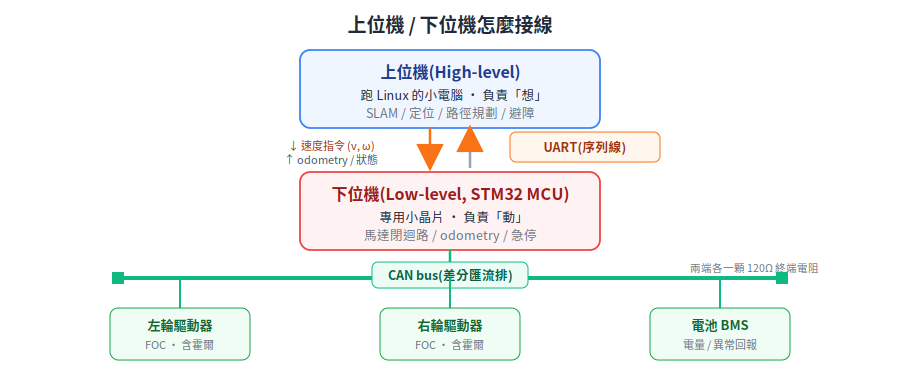

# robot-notes — 機器人知識筆記

從**軟體到硬體**,完整整理機器人相關知識。以**送餐機器人(室內 AMR)** 為主軸,逐步擴展到多機調度、主板模擬與 Physical AI。寫給想把機器人從頭搞懂的人,特別照顧「軟體背景、硬體不熟」的讀者。

> 進行中的整理計畫與分輪進度見 [PLAN.md](PLAN.md)。
> **看不懂的名詞** → 查 [CONTEXT.md 術語表](CONTEXT.md);**看到 `§11.3` 之類的編號不知在哪個檔** → 查 [章節對照表](docs/section-map.md)。

  
  
  

---

## 機器人怎麼運作(完全沒碰過硬體先讀這段)

一台送餐機器人 = **一台會自己走路的小推車**,內部分兩個腦:

- **上位機(High-level)** = 一台跑 Linux 的小電腦,負責「想」:我在地圖哪裡、怎麼走到 5 號桌、前面有人要不要繞。
- **下位機(Low-level)** = 一顆專門的小晶片(MCU,常見 STM32),負責「動」:即時控制兩顆馬達的轉速、回報走了多遠、有撞到就立刻停。

兩者用一條線(UART/CAN)對話:上位機每幾十毫秒下一個「速度指令」,下位機照做並回報實際狀態。反覆這個迴圈,車就動起來了。

四個全文反覆出現的核心詞:

| 詞 | 一句話 |
|---|---|
| **MCU** | 微控制器,一顆專做即時控制的小晶片(這裡是 STM32) |
| **(v, ω)** | 速度指令:v = 前進速度,ω(omega)= 轉彎的角速度 |
| **encoder(編碼器)** | 裝在馬達上、量「輪子轉了多少」的感測器 |
| **odometry(里程定位)** | 用輪子轉動量推算「我移動到哪了」,會慢慢累積誤差 |

懂這四個詞,就能順順讀下去了。

---

## 從哪裡開始讀

| 你的情況 | 建議路線 |
|---|---|
| **完全沒碰過硬體** | 先讀上面「機器人怎麼運作」→ [系統架構](docs/00-overview/system-architecture.md) → [底盤](docs/10-hardware/chassis-and-drivetrain.md) → [感測器](docs/10-hardware/sensors.md),卡名詞就查 [術語表](CONTEXT.md) |
| 想先看全貌 | [系統架構](docs/00-overview/system-architecture.md) |
| 軟體背景、想補硬體 | [底盤](docs/10-hardware/chassis-and-drivetrain.md) → [馬達/FOC](docs/10-hardware/motors-and-foc.md) → [感測器](docs/10-hardware/sensors.md) |
| 做下位機韌體 | [下位機運動控制](docs/20-firmware/low-level-control.md) → [編碼器](docs/10-hardware/encoders.md) → [通訊匯流排](docs/10-hardware/communication-buses.md) |
| 做導航 | [SLAM](docs/30-navigation/slam-mapping.md) → [定位](docs/30-navigation/localization.md) |
| 想做 AI 模擬(進階) | 先走完上面硬體/導航,再讀 [Physical AI 總覽](docs/50-physical-ai/physical-ai-overview.md) |

> 💡 進階小節(如數位電路 §15 半導體物理、定位 §28 地標 PnP)初讀可跳過,需要時再回來。

---

## 文件索引

### 00 系統全貌
- [系統架構](docs/00-overview/system-architecture.md) — 上位機/下位機分層、資料流、硬體選型、軟體架構、研發路線

### 10 硬體
- [底盤與驅動系統](docs/10-hardware/chassis-and-drivetrain.md) — 差速、萬向輪、輪轂馬達、BLDC、行星減速機
- [馬達與 FOC 控制](docs/10-hardware/motors-and-foc.md) — FOC、定子/轉子、有刷/無刷、功率橋、閘極驅動
- [編碼器](docs/10-hardware/encoders.md) — 霍爾、增量式 A/B 相、STM32 讀取
- [感測器](docs/10-hardware/sensors.md) — 2D LiDAR、深度相機、IMU
- [通訊匯流排](docs/10-hardware/communication-buses.md) — CAN 與 RS485,STM32F4 串接
- [數位電路](docs/10-hardware/digital-circuits.md) — open-drain、GPIO 輸出形式
- [電源與安全](docs/10-hardware/power-and-safety.md) — 電壓法規、急停、ramp/過流/堵轉保護

### 20 韌體
- [下位機運動控制](docs/20-firmware/low-level-control.md) — M1 知識清單、運動學解算 vs PID
- [上下位機通訊協議](docs/20-firmware/host-mcu-protocol.md) — 從三個根本痛點推出 framing/CRC16/心跳逾時/序號;韌體↔軟體的契約
- [主板模擬:Renode](docs/20-firmware/board-simulation-renode.md) — 為何模擬主板(回饋迴路)、STM32 全系統模擬、確定性測試進 CI、Arduino/AVR 現況
- [STM32F4 上的 REST API + TLS 1.2](docs/20-firmware/stm32-rest-tls.md) — MCU 跑 HTTPS:lwIP + mbedTLS 堆疊、RAM/CPU 瓶頸、硬體 crypto/RNG、cipher suite,附 ST / mbedTLS 出處

### 30 導航
- [SLAM 建圖](docs/30-navigation/slam-mapping.md) — 2D SLAM 流程、loop closure
- [定位](docs/30-navigation/localization.md) — AMCL、odometry、地標/AprilTag 定位
- [座標轉換與 TF](docs/30-navigation/kinematics-and-coordinate-transforms.md) — 為何分 map/odom、齊次變換、tf2 樹、REP-103/105
- [路徑規劃與軌跡(Nav2)](docs/30-navigation/path-planning.md) — 三層架構、costmap 膨脹、Hybrid-A*、DWB/MPPI/RPP、行為樹

### 40 多機調度
- [OpenRMF:跨車隊調度](docs/40-fleet/open-rmf.md) — 為何疊在車隊之上、時空排程協商、系統需求/語言、怎麼寫 fleet adapter、與 VDA5050 串接流程
- [VDA5050 協定](docs/40-fleet/vda5050.md) — 為何標準化(N×M→N+M)、order/state、released/horizon、職責邊界、**完整 order JSON 範例**
- [Fleet 深入:API/圖資/座標/避塞車](docs/40-fleet/rmf-maps-and-traffic.md) — RMF 三層 API、VDA5050 圖資匯入(LIF)、reference_coordinates 座標對齊、rmf_traffic 避塞車原語
- [私有系統案例:任意起點大迴轉,在 ROS2 會發生嗎](docs/40-fleet/proprietary-vs-ros2-arbitrary-start.md) — 速度方向放錯層的真實案例、車身座標 forward 投影定前進/倒車、RMF 拓樸 vs Nav2 運動規劃的責任邊界
- [實作小抄:adapter + 派任務](docs/40-fleet/rmf-adapter-cookbook.md) — VDA5050 fleet adapter 骨架 + REST 派任務的最小 pseudo-code
- [ROS 2 的 DDS:節點怎麼互相講話](docs/40-fleet/ros2-dds-intro.md) — DDS 是什麼、去中心化(無中央 master)、QoS / ROS_DOMAIN_ID / RMW,為何多容器要處理多播
- [RMF 多容器部署](docs/40-fleet/rmf-multi-container-deploy.md) — adapter/core 各一 docker、DDS 跨容器(host network / discovery server)、最小 docker-compose,附官方出處
- [MQTT over TLS:用 EMQX 達成 TLS 1.2+ 安全](docs/40-fleet/mqtt-tls-emqx.md) — 三層(加密/認證/授權)、mTLS client 憑證、ACL、TLS 版本與 cipher,附 EMQX 出處

### 50 Physical AI(進階:術語密度較高,建議先讀完 00/10/30 再來)
- [Physical AI 總覽](docs/50-physical-ai/physical-ai-overview.md) — Physical AI、World Model、NVIDIA 堆疊、sim-to-real
- [感測器資料與 3D Gaussian 重建](docs/50-physical-ai/sensor-data-and-3d-reconstruction.md) — 真實感測資料如何重建成模擬場景;附「為什麼一堆演算法都掛高斯」
- [用 Isaac Sim + Isaac Lab 模擬 AMR](docs/50-physical-ai/isaac-sim-isaac-lab-amr.md) — NVIDIA 堆疊、URDF→USD、ROS2 橋接、RL 訓練、合成資料
- [用 Gazebo + ROS2 模擬 AMR](docs/50-physical-ai/simulation-gazebo-ros2.md) — gz sim 版本對應、diff_drive、Nav2 閉迴路
- [SDF 3D 模型檔:從零開始](docs/50-physical-ai/sdf-3d-models.md) — 給完全沒碰過 3D 模型的人:mesh / visual / collision / inertial、SDF 資料夾結構、Poly Haven 的 HDRIs/Textures/Models 差異、差速搬運車 AMR 範例
- [Sim-to-real](docs/50-physical-ai/sim-to-real.md) — reality gap、domain randomization、上車檢查清單
- [用 Claude 完成 Physical AI 模擬](docs/50-physical-ai/claude-physical-ai-workflow.md) — 方法論:Claude 當膠水層與迭代引擎
- [專案探討:Gazebo 叉車搬運(RMF+VDA5050)](docs/50-physical-ai/project-forklift-rmf-gazebo.md) — capstone:URDF 設計、物理參數設定、第一性原理 worklist(M0–M7)、取放/派工/VDA5050 對映

### 60 法規與認證
- [法規與認證總覽](docs/60-compliance/README.md) — 合規地圖:一台機器人要過哪些關
- [電池認證法規](docs/60-compliance/battery-certification.md) — UL 2271 vs UL 2580、為何選 LFP + 金屬外殼、供應商認證、配套標準
- [半導體 fab AMR 規範](docs/60-compliance/semiconductor-amr-standards.md) — SEMI S2/S8/E84、AMHS、潔淨室/ESD、ISO 3691-4 對照

### 70 資安
- [機器人通訊安全(總覽)](docs/70-security/README.md) — 五個通訊面(下位機/DDS/MQTT/雲端/MCU)的威脅與手段、加密+認證+授權三件套、誠實現況;聚合 STM32 TLS、MQTT EMQX 等安全子篇

### 90 數學基礎(第一性原理)
- [高斯分布:第一性原理](docs/90-foundations/gaussian-from-first-principles.md) — 從最大熵/CLT 推出高斯,用四條性質統一理解 Gaussian blur、Kalman/EKF、GP、GMM、3DGS

### 參考論文(基礎材料)
- [Nav2 導航全棧 survey 導讀](docs/_refs/nav2-survey.md) — Nav2 維護者親寫的 ROS2 導航全棧 survey(全域規劃/區域控制/平滑/costmap/行為樹/狀態估計/定位建圖),附章節對照 robot-notes 各篇;CC BY 4.0 全文 PDF 收錄

---

歷史原始整理文件保留在 [`docs/_legacy/`](docs/_legacy/)(已拆分到上述主題檔)。
