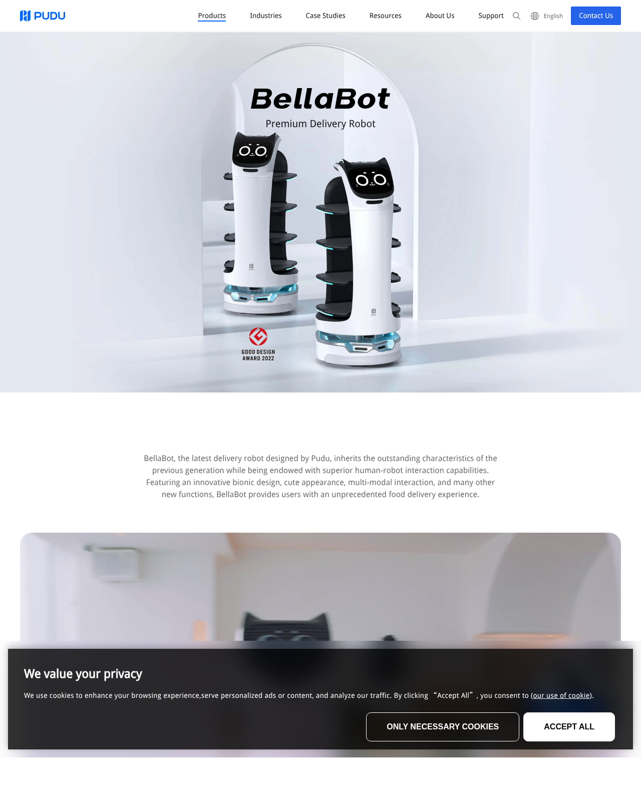
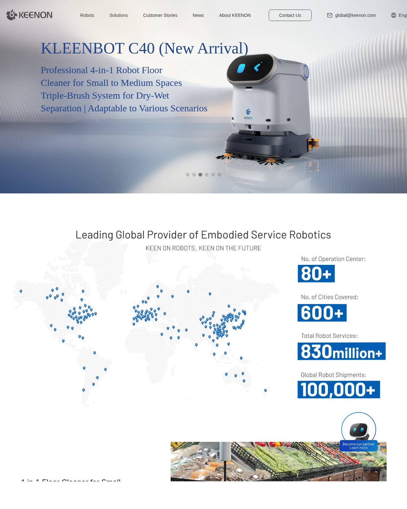
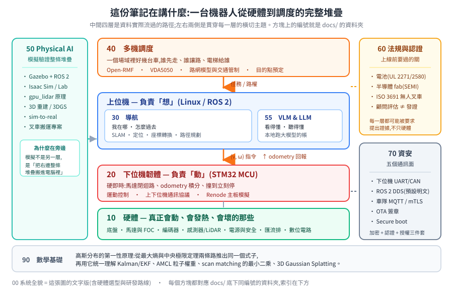
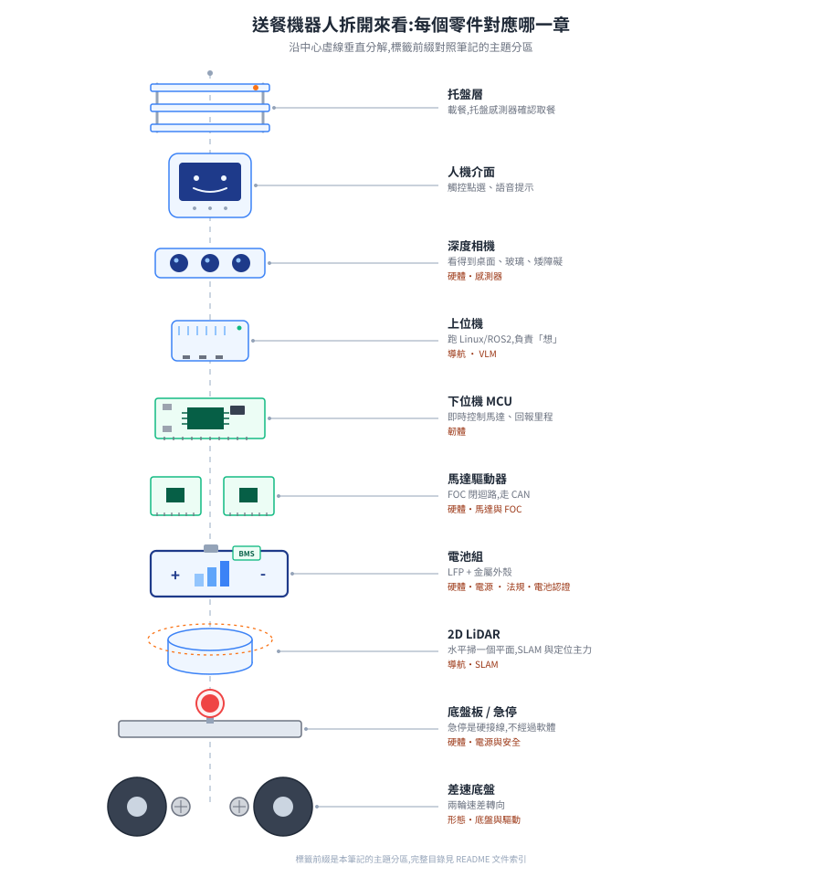
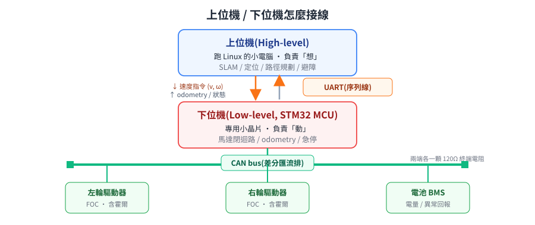

# robot-notes — 機器人知識筆記

一份從硬體寫到調度的機器人筆記。主軸是送餐機器人(室內 AMR),再往外延伸到多機調度、路網交管、主板模擬、Physical AI。

- **在講什麼** — 一台自走機器人從馬達、感測器、韌體,一路到導航、多車交管與模擬驗證,每一層各自要解什麼問題、為什麼是這個設計。
- **寫給誰** — 想把機器人從頭搞懂的人,尤其是寫軟體、但對硬體不熟的那種。名詞第一次出現就當場翻譯。
- **規模** — 50+ 篇主題文件、150+ 張手繪示意圖,全部繁體中文,每篇都從「這東西要解決什麼根本問題」推起。

  
  
  

---

## 這份筆記在講什麼

中間四層是**資料實際流過的路徑**:調度層決定「哪台車去做哪件事、誰先走」,上位機想「我在哪、怎麼過去」,下位機把速度指令變成馬達轉動,硬體是真正會動的東西。層與層之間的介面很窄——調度給的是任務與路權,上位機給下位機的是一組 `(v, ω)`,下位機回報 odometry。**介面窄是刻意的**:每一層都能單獨替換、單獨測試。

左右兩側則是貫穿每一層的橫切主題。模擬(50)不是另外一層,而是把整條堆疊搬進電腦裡跑;法規(60)與資安(70)則是每一層都會被要求交出證據的東西。

## 一台機器人拆開來看

上面那張圖是**邏輯分層**,這張是**實體零件**。同一台車的兩種看法:軟體工程師習慣看左邊那種,但真正會撞到牆、會沒電、會過熱的是這一堆東西。

---

## 機器人怎麼運作

完全沒碰過硬體的話,先建立這個直覺再往下讀。

一台送餐機器人,其實就是一台會自己走路的小推車,裡面有兩顆腦分工:

- 上位機(high-level)是一台跑 Linux 的小電腦,負責「想」——我在地圖哪裡、怎麼走到 5 號桌、前面有人要不要繞。
- 下位機(low-level)是一顆 MCU(常見 STM32),負責「動」——即時控制兩顆馬達的轉速、回報走了多遠、撞到就立刻停。

兩顆腦用一條線(UART/CAN)講話:上位機每幾十毫秒丟一個速度指令,下位機照做、再回報實際狀態。這個迴圈一直跑,車就動起來了。

四個全文反覆出現的核心詞:

| 詞 | 一句話 |
|---|---|
| **MCU** | 微控制器,一顆專做即時控制的小晶片(這裡是 STM32) |
| **(v, ω)** | 速度指令:v = 前進速度,ω(omega)= 轉彎的角速度 |
| **encoder(編碼器)** | 裝在馬達上、量「輪子轉了多少」的感測器 |
| **odometry(里程定位)** | 用輪子轉動量推算「我移動到哪了」,會慢慢累積誤差 |

懂這四個詞,就能順順讀下去了。

---

## 從哪裡開始讀

| 你的情況 | 建議路線 |
|---|---|
| **完全沒碰過硬體** | 上面「機器人怎麼運作」→ [系統架構](docs/00-overview/system-architecture.md) → [底盤](docs/10-hardware/chassis-and-drivetrain.md) → [感測器](docs/10-hardware/sensors.md),卡名詞就查 [術語表](CONTEXT.md) |
| 想先看全貌 | [系統架構](docs/00-overview/system-architecture.md) |
| 軟體背景、想補硬體 | [底盤](docs/10-hardware/chassis-and-drivetrain.md) → [馬達/FOC](docs/10-hardware/motors-and-foc.md) → [感測器](docs/10-hardware/sensors.md) |
| 做下位機韌體 | [下位機運動控制](docs/20-firmware/low-level-control.md) → [編碼器](docs/10-hardware/encoders.md) → [通訊匯流排](docs/10-hardware/communication-buses.md) |
| 做導航 | [SLAM](docs/30-navigation/slam-mapping.md) → [定位](docs/30-navigation/localization.md) → [路徑規劃](docs/30-navigation/path-planning.md) |
| **做多車調度 / 路網交管** | [路網模型與交通管制](docs/40-fleet/roadnet-and-traffic-control.md) → [室內 AMR 路網選型](docs/40-fleet/indoor-amr-roadnet-selection.md) → [OpenRMF](docs/40-fleet/open-rmf.md) → [VDA5050](docs/40-fleet/vda5050.md) |
| 想做 AI 模擬(進階) | 先走完上面硬體/導航,再讀 [Physical AI 總覽](docs/50-physical-ai/physical-ai-overview.md) |
| 要準備上線合規 | [法規與認證總覽](docs/60-compliance/README.md) → [資安總覽](docs/70-security/README.md) |

> 進階小節(如數位電路 §15 半導體物理、定位 §28 地標 PnP)初讀可跳過,需要時再回來。
> 看到 `§11.3` 之類的編號不知在哪個檔 → 查 [章節對照表](docs/section-map.md)。看不懂的名詞 → 查 [術語表](CONTEXT.md)。

---

## 文件索引

### 00 系統全貌
- [系統架構](docs/00-overview/system-architecture.md) — 上位機/下位機分層、資料流、硬體選型、軟體架構、研發路線

### 10 硬體
- [底盤與驅動系統](docs/10-hardware/chassis-and-drivetrain.md) — 差速、萬向輪、輪轂馬達、BLDC、行星減速機
- [馬達與 FOC 控制](docs/10-hardware/motors-and-foc.md) — FOC、定子/轉子、有刷/無刷、功率橋、閘極驅動
- [編碼器](docs/10-hardware/encoders.md) — 霍爾、增量式 A/B 相、四倍頻、STM32 硬體讀取
- [感測器](docs/10-hardware/sensors.md) — 2D LiDAR、深度相機、IMU,以及各自的盲區
- [LiDAR 完整解析](docs/10-hardware/lidar-landscape.md) — 測距原理(dToF/相位/FMCW)、905 vs 1550nm、掃描機構、2D vs 3D;附 2025–2026 產品盤點與選型
- [通訊匯流排](docs/10-hardware/communication-buses.md) — CAN 與 RS485 的分工,STM32F4 串接
- [數位電路](docs/10-hardware/digital-circuits.md) — 推挽 vs open-drain、上拉電阻、wired-AND
- [電源與安全](docs/10-hardware/power-and-safety.md) — 電壓法規、急停鏈、ramp/過流/堵轉保護

### 20 韌體
- [下位機運動控制](docs/20-firmware/low-level-control.md) — 運動學解算 vs PID、odometry 積分、控制週期
- [上下位機通訊協議](docs/20-firmware/host-mcu-protocol.md) — 從三個根本痛點推出 framing/CRC16/心跳逾時/序號
- [主板模擬:Renode](docs/20-firmware/board-simulation-renode.md) — 為何要模擬主板、STM32 全系統模擬、確定性測試進 CI
- [STM32F4 上的 REST API + TLS 1.2](docs/20-firmware/stm32-rest-tls.md) — lwIP + mbedTLS 堆疊、RAM/CPU 瓶頸、硬體 crypto

### 30 導航
- [SLAM 建圖](docs/30-navigation/slam-mapping.md) — 2D SLAM 流程、scan matching、loop closure、pose graph
- [3D LiDAR SLAM 建圖](docs/30-navigation/slam-3d-lidar.md) — 點雲配準(ICP/NDT/LOAM)、LIO 融 IMU、FAST-LIO 系譜;附 ROS2 可用套件盤點
- [定位](docs/30-navigation/localization.md) — AMCL 粒子濾波、odometry、AprilTag 地標定位
- [座標轉換與 TF](docs/30-navigation/kinematics-and-coordinate-transforms.md) — 為何分 map/odom、齊次變換、tf2 樹、REP-103/105
- [路徑規劃與軌跡(Nav2)](docs/30-navigation/path-planning.md) — 三層架構、costmap 膨脹、Hybrid-A*、DWB/MPPI/RPP、行為樹
- [路徑平滑與軌跡生成](docs/30-navigation/path-smoothing-and-trajectory.md) — 從「折線轉角曲率無限大」推起:G0–G3 連續性階梯、Bézier 完整推導(凸包與碰撞檢查)、B-spline 的局部支撐與內建 C²、clothoid、速度規劃(梯形 vs S 曲線、彎道速度上限),以及 Open-RMF 兩個 waypoint 之間為什麼是三次

### 40 多機調度

**路網與交管(先讀這兩篇)**
- [路網模型與交通管制](docs/40-fleet/roadnet-and-traffic-control.md) — 三條技術路線的第一性原理比較:空間怎麼表示、衝突怎麼定義、卡死怎麼解;前導線公式推導、柵格化的理由、環形鎖偵測
- [室內 AMR 路網規劃選型](docs/40-fleet/indoor-amr-roadnet-selection.md) — 叉車/搬運車/送貨機器人的物理差異如何決定路網;單一廠牌 vs 多廠牌混場的兩條決策路徑與切換門檻

**跨車隊協調**
- [OpenRMF:跨車隊調度](docs/40-fleet/open-rmf.md) — 為何疊在車隊之上、時空排程協商、怎麼寫 fleet adapter
- [VDA5050 協定](docs/40-fleet/vda5050.md) — 為何標準化(N×M→N+M)、order/state、released/horizon、完整 order JSON 範例
- [Fleet 深入:API/圖資/座標/避塞車](docs/40-fleet/rmf-maps-and-traffic.md) — RMF 三層 API、LIF 圖資匯入、座標對齊、rmf_traffic 避塞車原語
- [目的點重複預定](docs/40-fleet/slot-reservation-dispatch-strategies.md) — 悲觀鎖 vs 樂觀+序列化、banker's algorithm、死結與飢餓防護
- [私有系統案例:任意起點大迴轉](docs/40-fleet/proprietary-vs-ros2-arbitrary-start.md) — 速度方向放錯層的真實案例、RMF 拓樸 vs Nav2 運動規劃的責任邊界
- [實作小抄:adapter + 派任務](docs/40-fleet/rmf-adapter-cookbook.md) — VDA5050 fleet adapter 骨架 + REST 派任務的最小 pseudo-code

**底層通訊**
- [ROS 2 的 DDS](docs/40-fleet/ros2-dds-intro.md) — DDS 是什麼、去中心化、QoS / ROS_DOMAIN_ID / RMW,為何多容器要處理多播
- [RMF 多容器部署](docs/40-fleet/rmf-multi-container-deploy.md) — adapter/core 各一 docker、DDS 跨容器、最小 docker-compose
- [MQTT over TLS(EMQX)](docs/40-fleet/mqtt-tls-emqx.md) — 三層(加密/認證/授權)、mTLS client 憑證、ACL、cipher 選擇
- [機器人的廣域連線](docs/40-fleet/robot-wan-5g-satellite.md) — 廠區 private 5G、公網 5G+VPN、衛星 Direct-to-Device(3GPP NTN)、6G NTN

### 50 Physical AI(進階)

> 術語密度較高,建議先讀完 00/10/30。

- [Physical AI 總覽](docs/50-physical-ai/physical-ai-overview.md) — Physical AI、World Model、NVIDIA 堆疊、sim-to-real
- [感測器資料與 3D Gaussian 重建](docs/50-physical-ai/sensor-data-and-3d-reconstruction.md) — 真實感測資料如何重建成模擬場景
- [用 Isaac Sim + Isaac Lab 模擬 AMR](docs/50-physical-ai/isaac-sim-isaac-lab-amr.md) — URDF→USD、ROS2 橋接、RL 訓練、合成資料
- [用 Gazebo + ROS2 模擬 AMR](docs/50-physical-ai/simulation-gazebo-ros2.md) — gz sim 版本對應、diff_drive、Nav2 閉迴路;含 Classic 世界遷移的機械清單與踩到的真 bug
- [在 Gazebo 倉庫用 slam_toolbox 建圖](docs/50-physical-ai/gazebo-slam-warehouse.md) — 可重跑教學:加 gpu_lidar 與里程計、Docker、ros_gz_bridge、tf 樹三段、繞倉庫建圖
- [gpu_lidar 怎麼運作(讀原始碼)](docs/50-physical-ai/gpu-lidar-how-it-works.md) — 為何用 GPU render 深度而非逐 ray 求交、cubemap 兩趟、為何「不算真 ray tracing」
- [SDF 3D 模型檔:從零開始](docs/50-physical-ai/sdf-3d-models.md) — mesh / visual / collision / inertial、SDF 資料夾結構、差速搬運車範例
- [建 AMR 模擬世界:模型與場景哪裡來](docs/50-physical-ai/simulation-asset-sources.md) — 資產來源盤點(2026-08-05 實查):Gazebo Fuel 的實際數量與缺口、AWS RoboMaker 服務終止後那批 world 的現況、Isaac SimReady 與雲端 asset root、rmf_demos 場景、研究用室內資料集、通用素材;以及「拿到資產不等於能用」要補多少工
- [Sim-to-real](docs/50-physical-ai/sim-to-real.md) — reality gap、domain randomization、上車檢查清單
- [用 Claude 完成 Physical AI 模擬](docs/50-physical-ai/claude-physical-ai-workflow.md) — 方法論:Claude 當膠水層與迭代引擎
- [專案探討:Gazebo 叉車搬運(RMF+VDA5050)](docs/50-physical-ai/project-forklift-rmf-gazebo.md) — capstone:URDF 設計、物理參數、第一性原理 worklist(M0–M7)

### 55 VLM & LLM
- [LLM 與 VLM 給機器人](docs/55-vlm-llm/llm-vlm-for-robots.md) — token 化、自注意力在解什麼、VLM 怎麼把影像變 token、VLA 與開放詞彙感知對機器人的意義
- [在 NVIDIA GB10(DGX Spark)上架本地 LLM](docs/55-vlm-llm/local-llm-on-nvidia-gb10.md) — 為何 LLM 推論是記憶體頻寬 bound、統一記憶體的取捨、量化、GB10 規格查證與軟體堆疊

### 60 法規與認證
- [法規與認證總覽](docs/60-compliance/README.md) — 合規地圖:一台機器人要過哪些關
- [電池認證法規](docs/60-compliance/battery-certification.md) — UL 2271 vs UL 2580、為何選 LFP + 金屬外殼、配套標準
- [半導體 fab AMR 規範](docs/60-compliance/semiconductor-amr-standards.md) — SEMI S2/S8/E84、AMHS、潔淨室/ESD、ISO 3691-4 對照
- [PwC、SEMI E187 與 ISO 3691 認證角色](docs/60-compliance/pwc-semi-iso3691-certification.md) — 顧問/評估 vs 官方檢測發證的分界

### 70 資安
- [機器人通訊安全(總覽)](docs/70-security/README.md) — 五個通訊面的威脅與手段、加密+認證+授權三件套、誠實現況
- [SROS2 / DDS-Security](docs/70-security/sros2-dds-security.md) — ROS2 節點間預設明文這個洞怎麼補:認證、加密、授權一次到位
- [OTA 韌體簽章](docs/70-security/ota-firmware-signing.md) — 守「裝什麼」:上位機軟體與 MCU 韌體兩種 OTA,簽章驗證的核心
- [Secure boot](docs/70-security/secure-boot.md) — 守「跑什麼」:即使 Flash 被用別的方式改過,開機時也擋下來

### 90 數學基礎
- [高斯分布:第一性原理](docs/90-foundations/gaussian-from-first-principles.md) — 從最大熵/CLT 推出高斯,用四條性質統一理解 Gaussian blur、Kalman/EKF、GP、GMM、3DGS

### 參考論文
- [Nav2 導航全棧 survey 導讀](docs/_refs/nav2-survey.md) — Nav2 維護者親寫的 ROS2 導航全棧 survey,附章節對照;CC BY 4.0 全文 PDF 收錄

---

## 這個 repo 怎麼寫的

- [寫作慣例與 lessons learned](docs/_meta/lessons-learned.md) — 每篇的工作流(研究查證 → 第一性原理寫 → 配 SVG → 去 AI 味 → 專家/學生審查)與一路踩過的雷
- [GitHub Actions × gz sim playbook](docs/_meta/github-actions-gz-sim-playbook.md) — 沒有 GPU 也能驗證/視覺化 gz sim 模型
- [PLAN.md](PLAN.md) — 分輪整理計畫與進度
- [CONTEXT.md](CONTEXT.md) — 術語表(ubiquitous language)
- [章節對照表](docs/section-map.md) — `§N` 編號對應到哪個檔

歷史原始整理文件保留在 [`docs/_legacy/`](docs/_legacy/)(內容已拆分到上述主題檔)。
