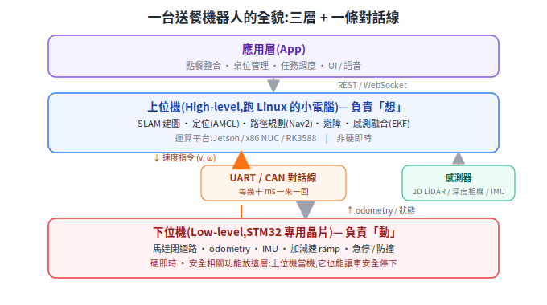

# 送餐機器人系統架構介紹

> 本篇講送餐機器人的完整架構、硬體選型與軟體組成。完全沒碰過硬體也能讀——先讀 [README 的「機器人怎麼運作」30 秒導言](../../README.md) 把「上位機(ROS2)/下位機(STM32)分層」這組詞建立起來,再回來看這篇的細節。
> 範圍:室內送餐 AMR(餐廳場景),不含機械結構與外觀設計細節。

---

## 1. 整體架構概觀

送餐機器人本質上是一台「室內 AMR + 餐廳應用層」,典型分成三層,中間靠一條 UART/CAN 線對話:

<p align="center"></p>

### 1.1 為什麼要分上位機 / 下位機

| 面向 | 上位機 (ROS2) | 下位機 (STM32) |
|---|---|---|
| 任務性質 | 高運算量、非硬即時(SLAM、規劃) | 硬即時(電流環 kHz 級、急停) |
| OS | Linux (Ubuntu) | bare-metal 或 FreeRTOS |
| 失效後果 | 導航停擺,但車可安全停下 | 失控、撞人 → 安全相關功能必須放這層 |
| 開發迭代 | 快,軟體生態豐富 | 慢,但穩定後極少動 |

核心原則:**安全相關功能(急停、防撞條、馬達失控保護)一律放下位機**,即使上位機當機,下位機也要能讓車安全停止。

### 1.2 資料流(一次送餐任務)

```
點餐系統/平板 → 任務「送到 5 號桌」
    → 上位機:查桌位座標 → Nav2 規劃路徑
    → 上位機:每 20–50ms 下發速度指令 (v, ω)
    → 下位機:速度指令 → 左右輪轉速 → 閉迴路控制馬達
    → 下位機:每 10–20ms 回報 encoder odometry + IMU
    → 上位機:odometry + LiDAR → 定位修正 → 持續修正路徑
    → 到點 → 語音提示取餐 → 托盤感測確認 → 返航
```

---

## 2. 硬體選型

### 2.1 底盤與驅動形式

室內送餐幾乎都用**兩輪差速 (differential drive) + 萬向輪**:結構簡單、原地旋轉、控制模型成熟(Nav2 原生支援)。

| 項目 | 建議 | 說明 |
|---|---|---|
| 驅動形式 | 兩輪差速 + 前後萬向輪 | 麥克納姆輪不適合(餐廳地面油污打滑、odometry 差) |
| 馬達 | 直流無刷輪轂馬達 (hub motor) 或 BLDC + 行星減速機 | 輪轂馬達整合度高、安靜,送餐機主流 |
| 功率 | 單輪 100–200W、24V | 載重 30–50kg、速度 ≤1.2 m/s 夠用 |
| Encoder | 必備,輪轂馬達常內建霍爾 + 可加磁編碼 | odometry 精度直接決定定位品質 |
| 馬達驅動器 | 帶 FOC 的 BLDC 驅動器,CAN 或 RS485 介面 | 自研 FOC 成本高,初期建議買現成驅動器 |

> 取捨:馬達驅動可以「STM32 自己做 FOC」或「STM32 透過 CAN 指揮現成驅動器」。前者 BOM 便宜但研發週期長;**初期建議後者**,STM32 專注在運動學解算、odometry、安全邏輯。

### 2.2 上位機運算平台

| 平台 | 適用情境 | 參考價位 | 備註 |
|---|---|---|---|
| **Jetson Orin Nano / NX** | 要跑視覺 AI(行人偵測、深度學習避障) | 中高 | ROS2 生態完整,GPU 加速 |
| **x86 NUC / 工控機** | 純 LiDAR 導航、開發期 | 中 | 開發最順,除錯方便,功耗較高 |
| **RK3588 (如 Orange Pi 5)** | 量產降成本 | 低 | NPU 可用但生態較碎,移植成本要估 |
| Raspberry Pi 5 | 原型驗證 | 低 | 跑 Nav2+SLAM 吃緊,不建議當產品方案 |

建議路線:**開發期用 x86 NUC,確認算力需求後再決定量產平台**(視覺重 → Jetson;成本敏感 → RK3588)。

### 2.3 下位機 MCU

| 項目 | 建議 |
|---|---|
| MCU | STM32F407 / F427(168–180MHz、FPU、CAN×2、Timer 豐富)|
| 升級選項 | STM32H7(需要更多運算或乙太網時)、G4(主打馬達控制的精簡方案)|
| RTOS | FreeRTOS;任務:通訊、控制環、感測、安全監控分開排程 |
| 通訊周邊需求 | CAN(馬達驅動器)、UART(上位機)、I2C/SPI(IMU)、GPIO/EXTI(急停、防撞條)|

### 2.4 感測器

| 感測器 | 用途 | 選型參考 | 必要性 |
|---|---|---|---|
| 2D LiDAR | SLAM 建圖 + 定位 + 平面避障 | RPLIDAR S2/S3、鐳神 N10、SICK TiM(預算高) | **必備** |
| 深度相機 | 立體避障(桌面突出物、低矮障礙) | Orbbec Astra/Gemini、RealSense D435 | 強烈建議 |
| IMU | 姿態 / 與 odometry 融合 | BMI088、ICM-42688(接下位機或獨立模組) | **必備** |
| 超音波 / ToF | 近距離盲區補償(玻璃、低反射物) | 4–8 顆環繞 | 建議 |
| 防撞條 (bumper) | 接觸式最後防線,直接觸發下位機停車 | 機械微動開關式 | **必備(安全)** |
| 防跌落感測 | 樓梯 / 台階偵測(朝下 ToF 或紅外) | 場域有高低差才需要 | 視場域 |
| 托盤感測 | 偵測餐點放置 / 取走 | 重量感測 (load cell) 或紅外對射 | 應用必備 |

> LiDAR 安裝高度注意:裝太低掃不到桌面(只看到桌腳),深度相機就是用來補這個高度區間的立體障礙。

### 2.5 電源系統

| 項目 | 建議 |
|---|---|
| 電池 | 24V 鋰電池(磷酸鋰鐵安全性較佳),20–40Ah 依續航需求 |
| BMS | 必備,並把電量 / 異常透過 UART/CAN 回報下位機 |
| 電源樹 | 24V 直供馬達;DC-DC 降壓出 19V(上位機)、12V(LiDAR/螢幕)、5V(感測器) |
| 充電 | 初期手動充電即可;自動回充(充電樁 + 對接導引)列為二期 |
| 急停 | 實體急停開關,**硬體層直接切斷馬達驅動致能**,不經過軟體 |

### 2.6 人機介面

- 觸控螢幕(Android 平板或 Linux 螢幕,跑應用層 UI)
- 喇叭 + 語音提示(到桌提醒、避讓提示)
- LED 燈帶(狀態指示:行進 / 等待取餐 / 異常)

---

## 3. 軟體架構

### 3.1 下位機韌體 (STM32 + FreeRTOS)

```
┌────────────────────────────────────────────┐
│ 通訊任務:與上位機協議收發 (UART/CAN, 50–100Hz)│
├────────────────────────────────────────────┤
│ 運動控制任務 (100Hz–1kHz)                    │
│  (v, ω) → 差速運動學 → 左右輪目標轉速         │
│  → PID 速度環(或下發給 FOC 驅動器)           │
├────────────────────────────────────────────┤
│ Odometry 任務 (50–100Hz)                    │
│  encoder 積分 + IMU → (x, y, θ, v, ω) 上報   │
├────────────────────────────────────────────┤
│ 感測任務:IMU、超音波、電池、托盤              │
├────────────────────────────────────────────┤
│ 安全監控任務(最高優先級)                     │
│  急停 / 防撞條 / 通訊逾時 (watchdog) /        │
│  馬達過流 / 上位機心跳遺失 → 安全停車          │
└────────────────────────────────────────────┘
```

關鍵設計:

- **通訊逾時保護**:超過 N ms(常見 200–500ms)沒收到上位機速度指令 → 自動減速停車。這是上位機當機時的保命機制。
- **加減速限制 (ramp)**:速度指令在下位機做平滑,避免餐點打翻;送餐機加速度通常壓在 0.3–0.5 m/s² 以下。
- 控制環、通訊、安全監控用 RTOS 任務優先級隔離,安全監控最高。

### 3.2 上下位機通訊協議

| 項目 | 建議 |
|---|---|
| 物理層 | UART (115200–921600) 起步;要掛多個節點(驅動器、BMS)則用 CAN |
| 框架選項 | 自定義二進位協議(幀頭 + 長度 + 命令 + payload + CRC16)或 **micro-ROS** |
| 頻率 | 上→下:速度指令 20–50Hz;下→上:odometry/IMU 50–100Hz;狀態 10Hz |

micro-ROS 與自定義協議的取捨:

| | micro-ROS | 自定義協議 |
|---|---|---|
| 優點 | 直接出現成 ROS2 topic,免寫 bridge | 簡單、可控、除錯直觀、資源占用小 |
| 缺點 | 記憶體占用大、版本綁定、除錯較黑盒 | 要自己寫上位機 driver node + 維護協議文件 |
| 建議 | 團隊 ROS2 經驗深可用 | **初期建議自定義協議**,把協議文件當正式交付物管理 |

### 3.3 上位機軟體 (Ubuntu 22.04 + ROS2 Humble)

```
┌───────────────────────────────────────────────┐
│ 應用層(可不在 ROS2 內,REST/WebSocket 對接)     │
│  任務調度 / 桌位管理 / UI / 點餐系統 / 雲端後台   │
├───────────────────────────────────────────────┤
│ ROS2 導航層                                    │
│  ┌─ SLAM:slam_toolbox(建圖,部署時離線執行)   │
│  ├─ 定位:AMCL(已知地圖 + LiDAR 即時匹配)      │
│  ├─ 規劃 + 控制:Nav2                          │
│  │   global planner / controller (MPPI 或 DWB) │
│  │   costmap(LiDAR + 深度相機障礙層)           │
│  │   behavior tree(重規劃、recovery 行為)      │
│  └─ 感測融合:robot_localization (EKF)          │
│        encoder odom + IMU → 融合 odom           │
├───────────────────────────────────────────────┤
│ Driver 層(ROS2 nodes)                         │
│  LiDAR driver / 相機 driver /                   │
│  base driver(對下位機協議 ↔ /cmd_vel, /odom)   │
└───────────────────────────────────────────────┘
```

各模組的具體選擇:

| 功能 | 套件 | 說明 |
|---|---|---|
| 建圖 | `slam_toolbox` | 2D SLAM 目前最穩定的主流選擇;部署場域時建一次圖即可 |
| 定位 | `nav2_amcl` | 已知地圖下的粒子濾波定位;餐廳長走道 / 動態人群多時需調參 |
| 路徑規劃 | `nav2`(Smac/NavFn + MPPI/DWB) | 行為樹可自訂卡住時的 recovery 流程 |
| 里程融合 | `robot_localization` | EKF 融合輪式 odom + IMU,抑制打滑誤差 |
| 描述檔 | URDF + `robot_state_publisher` | 感測器外參(LiDAR/相機安裝位置)寫進 TF tree |
| 底盤介面 | 自寫 base driver node | 訂閱 `/cmd_vel`、發布 `/odom` 與 TF,對接下位機協議 |

### 3.4 應用層

- **任務調度服務**:接收「送 X 號桌」任務 → 轉成 Nav2 goal → 管理任務佇列、多點配送順序、失敗重試、返航。
- **桌位管理**:建圖後在地圖上標註桌位點 (named waypoints),存成設定檔。
- **UI**:觸控螢幕(選桌、出發、取餐確認);技術上常用 Web UI (WebSocket ↔ ROS2 bridge) 或 Android App。
- **後台(二期)**:多機調度、遠端監控、地圖 / 設定下發、OTA 更新。
- 應用層與 ROS2 之間建議用 **REST / WebSocket API 隔離**,讓 UI 與業務邏輯團隊不需要懂 ROS2。

### 3.5 部署與工程實務

- 上位機軟體以 **Docker 容器化部署**(ROS2 + Nav2 + drivers 一個 image),版本可回滾。
- 開發期善用 **Gazebo / 仿真**:Nav2 調參、任務調度邏輯先在仿真驗證,再上實車。
- 建立 **rosbag 錄製習慣**:現場問題錄 bag 帶回重放分析,是導航除錯的主要 feedback loop。
- 下位機韌體:CI 出 binary + 版本號,協議版本與上位機 driver 對齊管理。

---

## 4. 建議研發路線(milestone)

| 階段 | 目標 | 驗收標準 |
|---|---|---|
| M1 底盤手控 | 下位機完成:馬達閉迴路、odometry、急停、通訊協議;上位機鍵盤/搖桿遙控 | 遙控直線 5m 偏差可量測;急停 / 通訊逾時保護有效 |
| M2 建圖定位 | LiDAR + slam_toolbox 建圖;AMCL 定位 | 場域地圖完整;定位不飄(人走動干擾下仍穩定) |
| M3 自主導航 | Nav2 點對點導航 + 避障 | 指定點往返成功率、避開行人與臨時障礙 |
| M4 送餐應用 | 桌位管理、任務調度、UI、語音、托盤感測 | 完整送餐流程 demo:接單 → 送達 → 取餐 → 返航 |
| M5 產品化 | 多點配送、自動回充、長時間穩定性、量產 BOM 優化 | 連續運行時數、MTBF、成本目標 |

> M1 是地基:**odometry 品質不好,後面 SLAM / 定位全部跟著差**,值得在 M1 多花時間校正(輪徑、輪距、encoder 解析度標定)。

---

## 5. 風險與注意事項

1. **安全架構先行**:急停、防撞、通訊逾時保護要在 M1 就做進下位機,不是最後補。
2. **餐廳場景的定位挑戰**:人群密集、桌椅常移動 → AMCL 參數與 costmap 動態障礙處理是調參重點;玻璃 / 鏡面對 LiDAR 不友善,需超音波補盲。
3. **odometry 打滑**:油污地面輪子打滑 → 必須有 IMU 融合,不能只信 encoder。
4. **自研範圍控制**:FOC 驅動器、SLAM 演算法都有成熟現成方案,初期自研範圍建議收斂在「下位機整合 + 上位機系統整合 + 應用層」,先把產品跑起來。
5. **協議文件化**:上下位機協議是兩個團隊(韌體 / 軟體)的契約,從 day 1 就版本化管理。

---

## 附:運算平台補充 — x86 NUC 是什麼


**NUC**(Next Unit of Computing)原是 Intel 定義的迷你電腦規格:約 10×10cm 的小盒子,裝著跟筆電同級的 CPU、RAM、SSD。Intel 已把這條產品線轉給 ASUS,現在「NUC」泛指這一類迷你 PC(ASUS NUC、Beelink、工控品牌的無風扇款等)。

**x86** 指的是 CPU 指令集架構——跟你的桌機、筆電、伺服器同一家族(Intel/AMD),相對於 Jetson、Raspberry Pi、RK3588 用的 **ARM** 架構。

放在機器人上的意義:

| 面向 | x86 NUC | ARM 板(Jetson/RK3588) |
|---|---|---|
| 軟體相容性 | 與開發機完全一致,Ubuntu/ROS2 任何套件 `apt install` 直接裝 | 部分套件要自己編譯,偶有 ARM 相容性坑 |
| 開發流程 | 程式在開發機編好直接丟上去跑,不用交叉編譯 | 交叉編譯或板上編譯(慢) |
| CPU 效能 | 強(SLAM、Nav2 跑得寬裕) | 中等 |
| AI 加速 | 無 GPU/NPU(視覺 AI 弱) | Jetson 有 GPU、RK3588 有 NPU |
| 功耗 | 15–40W(電池容量要多留) | 7–25W |
| 量產成本 | 較高 | 較低 |

所以架構文件的建議是:**開發期用 NUC**——把「平台移植」這個變數從開發過程中拿掉,專心解決機器人本身的問題;等功能定型、算力需求明朗,再評估量產要不要換 Jetson(視覺重)或 RK3588(成本敏感)。選工控版本(寬溫、寬壓 DC 輸入、無風扇)可以直接吃電池的 DC-DC 輸出。

---

