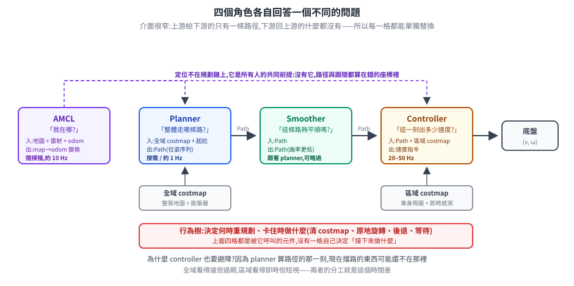
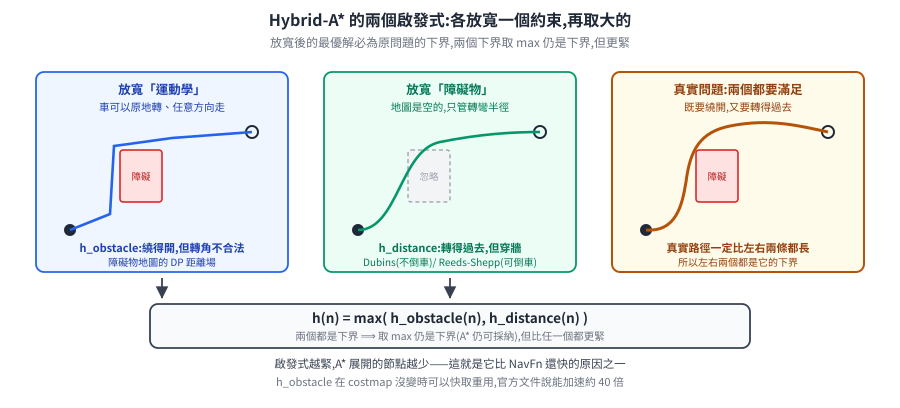
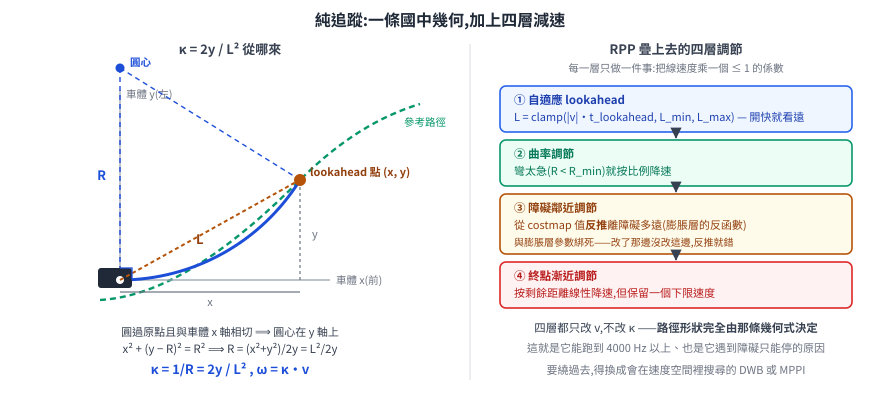
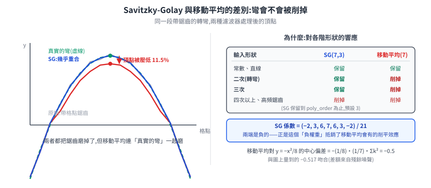
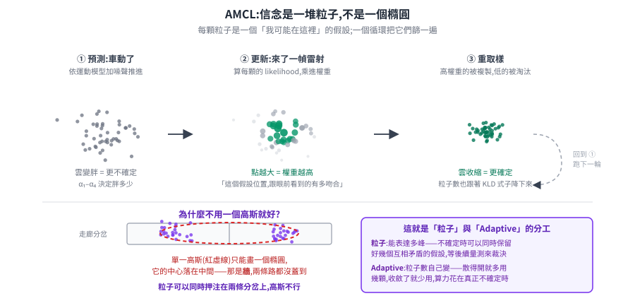

# Nav2 外掛演算法:planner、controller、smoother 與 AMCL 的數學

Nav2 把導航拆成一組**可替換的外掛(plugin)**:換一個 planner、換一個 controller,設定檔改一行就好,程式不用動。代價是選型變成一件要懂的事——官方文件列出五個 planner、五個 controller、三個 smoother,每個都有一串參數,而參數的意義只有在知道背後那條式子之後才講得通。

這篇把它們逐一拆開:**這個外掛在解什麼問題、它的數學核心是什麼、哪幾個參數真的會進到式子裡**。參數只收「進得了公式」的那些——完整清單以[官方文件](https://docs.nav2.org/rolling/configuration_and_development/configuration_guide/)為準,那份會隨版本變,這篇要留下的是不會變的部分。

> 前置:[路徑規劃與軌跡(Nav2)](path-planning.md)(三層架構、costmap 與行為樹的概觀)、[定位](localization.md)(AMCL 在場景裡怎麼用)。
> 數學基礎:[路徑平滑與軌跡生成](path-smoothing-and-trajectory.md)(§6 的離散平滑器目標函數,是本篇三個 smoother 的共同骨架)、[回授控制:PID、LQR 與 MPPI](../../90-foundations/feedback-control-pid-lqr.md)(§13 是 MPPI 的完整推導)、[高斯分布:第一性原理](../../90-foundations/gaussian-from-first-principles.md)(AMCL 為什麼不能用單一高斯)。

---

## 1. 四個角色,四個不同的問題

先把定位釘清楚,否則後面十四個外掛會變成一份沒有骨架的清單。

<p align="center"></p>

| 角色 | 回答的問題 | 輸入 | 輸出 | 頻率 |
|---|---|---|---|---|
| **AMCL** | 我在哪? | 地圖 + 雷射 + odometry | `map → odom` 變換 | 隨掃描,約 10 Hz |
| **Planner** | 整體該走哪條路? | 全域 costmap + 起點終點 | 一條路徑(位姿序列) | 按需 / 約 1 Hz |
| **Smoother** | 這條路夠平順嗎? | 路徑 | 更平順的路徑 | 跟著 planner,可略過 |
| **Controller** | 這一刻該出多少速度? | 路徑 + 區域 costmap + 當前位姿 | 速度指令 | 20–50 Hz |

> **costmap** 是這張表裡唯一還沒解釋的詞:它是一張與地圖同尺寸的網格,每格存一個 0–255 的**代價值**——不是只有「有障礙 / 沒障礙」兩種,而是一片連續的風險場,越靠近障礙物的格子值越高(這叫**膨脹層**)。全域 costmap 蓋整張地圖、更新慢;區域 costmap 只有車身周圍幾公尺、吃即時感測。細節見[路徑規劃 §2](path-planning.md#2-costmap為什麼不能把車當一個點)。

四者的關係有三個要點,每一個都決定了後面的設計:

**一、定位不在規劃鏈上,但它是所有人的前提。** AMCL 不產生路徑也不產生速度,它只做一件事:把「我在地圖的哪裡」這個答案,以 `map → odom` 這個座標變換的形式發布出去。少了它,planner 會在錯的起點開始搜尋、controller 會拿錯的位姿算誤差——**兩者都會很努力地算出錯的答案**。這也是為什麼它被歸在 `others/` 而不是規劃三層裡。

**二、介面窄得刻意。** Planner 交給 smoother 的、smoother 交給 controller 的,都只是一條 `nav_msgs/Path`——一串位姿,沒有速度、沒有時間戳語意、沒有「我為什麼這樣規劃」的理由。下游也不回傳任何東西給上游。正因為介面只有這麼一條,**任何一格都能單獨替換而不影響其他格**,這就是 plugin 架構成立的前提。

**三、為什麼 controller 也要避障?** 這是最常被問的一題。既然 planner 已經算出一條無碰撞路徑,controller 照著走不就好了?

因為**那條路徑在算出來的那一刻就開始過期**。planner 用的是全域 costmap(整張地圖,更新慢),而且它一秒才算一次;controller 用的是區域 costmap(車身周圍幾公尺,吃即時感測),每 20–50 ms 更新一次。中間這段時間差裡,一個人可能剛好走到路徑上。

**全域看得遠但過期,區域看得即時但短視。** 兩層的分工就是這個時間差,而 controller 各家的最大差異,正是「遇到路徑上有東西時要怎麼辦」——這條線會貫穿第 3 節的五個 controller。

### 1.1 smoother 為什麼是獨立的一層

Planner 為了搜尋效率,幾乎都在**離散的空間**裡工作:格點、或是一組預先算好的運動基元。這讓搜尋變得可行,但也決定了輸出的形狀——**一條由離散步伐拼起來的折線**。

折線的問題不在難看,在於[轉角處曲率是無限大](path-smoothing-and-trajectory.md#1-根本問題折線的轉角曲率是無限大):車不可能瞬間轉向,所以 controller 追這種路徑時只能減速、切內線,或者在轉角處抖動。

於是有了 smoother:它不重新規劃,只把已經合法的路徑**在原地磨平**。這件事之所以能獨立成一層,是因為它的輸入輸出型別和 planner 完全一樣(`Path` 進、`Path` 出)——可以插在中間,也可以整個拿掉。

---

## 2. Planner:五個全域規劃器

### 2.0 共同的問題:在 costmap 上找一條代價最低的路

全域規劃的骨架其實只有一句話:**把地圖變成一張圖(graph),然後找最短路**。所有差異都出在兩個決定——

1. **節點是什麼?** 是格點 `(x, y)`,還是連朝向也算進去的 `(x, y, θ)`?
2. **邊是什麼?** 是「走到隔壁格」,還是「執行一段車真的做得到的運動」?

第一個決定分出 holonomic(全向)與 kinematically feasible(運動學可行)兩大類;第二個決定分出格點搜尋與運動基元搜尋。Nav2 的五個 planner 就落在這兩軸上。

還有一個共通性質值得先講:**它們全都是 cost-aware 的**。costmap 上的值不是只有「有障礙 / 沒障礙」兩種,而是一片連續的風險場(牆邊代價高、通道中央代價低)。規劃器把這個值疊進邊代價,所以走出來的路會**自動偏向通道中央**,而不是貼著牆走最短路。這是「最短」與「最安全」之間的權衡,而權衡的旋鈕就是各家的代價權重參數。

在進到各家做法之前,先把兩個接下來會一直用到的詞講白:

- **啟發式(heuristic)**:搜尋時對「從這一格到終點大概還要付多少代價」的**估計值**。它不必是正確答案,只要夠準,演算法就能優先往看起來近的方向找,少走冤枉路。
- **可採納(admissible)**:這個估計值**絕不高估**真實代價,也就是它是真實代價的**下界**。只有可採納的啟發式,才能保證 A\* 搜出來的路真的是最短的。
- **展開(expand)一個節點**:把它的所有鄰居算出來、放進待搜清單。**展開的節點越少,搜尋越快**——這是所有啟發式設計在追求的東西。

> Nav2 的規劃器全部是**搜尋式**而非取樣式(RRT 那一類)。survey 給的理由是:在移動機器人這種低維狀態空間裡,搜尋式通常更快、在啟發式可採納時能給出真正的最優解,而且**執行時間比較可預測**——後者對「要頻繁重規劃」的系統特別重要。

### 2.1 NavFn:波前傳播出一個位能場,再滑下去

Nav2 最老的規劃器,從 ROS 1 導航堆疊繼承而來。教科書的 A\* 是維護一份**待搜清單(open list)**、每次挑最有希望的節點展開、用 parent 指標回溯出路徑;NavFn 的寫法完全不同:

**第一步,從終點往回灌一個位能場。** 用 Dijkstra 從目標格開始做波前傳播(wavefront propagation),對每一格算出一個**位能值** `potential`——大致是「從這一格走到目標要付多少代價」。障礙格不傳播,於是波前會自然繞過它們。

**第二步,從起點沿梯度滑下去。** 位能場算好之後,路徑不是用回溯 parent 指標得到的,而是從起點開始**沿著位能下降最快的方向走**,以半個格子的步長前進,直到抵達目標。

$$ p_{k+1} = p_k - \alpha \nabla \Phi(p_k) $$

`Φ` 是位能場,`∇Φ` 用鄰域內插算出來。**梯度為零就是失敗**(掉進局部平坦區)。

這裡有一個容易被略過但關鍵的設計:位能不是直接用「到目標的距離」算的,而是用一個**二次核(quadratic kernel)**。理由是離散格點上的距離場有稜有角,沿它做梯度下降會走出鋸齒;二次核讓位能場更平滑,滑出來的路徑也就更平滑。

| 參數 | 預設 | 在數學上是什麼 |
|---|---|---|
| `use_astar` | `false` | 傳播用 Dijkstra(全展開)或 A*(best-first,靠啟發式剪枝) |
| `tolerance` | 0.5 m | 梯度下降允許停在離目標多遠 |
| `allow_unknown` | `true` | 未知格算不算可通行——決定波前傳不傳過去 |

**用途**:圓形的差速 / 全向車。它不追蹤朝向,所以規劃出來的路徑不保證車轉得過去;但它快、穩定、被驗證了十幾年。

### 2.2 Smac 2D:同一個問題,換成代價感知的 A*

和 NavFn 解同一類問題(holonomic、格點、不管朝向),差別在它是**標準的 A***,而且把 costmap 的值明確地乘上一個權重疊進邊代價:

$$ g(\text{edge}) = d \cdot \big(1 + w_{\text{cost}} \cdot \hat{c}\big) $$

`d` 是幾何距離,`ĉ` 是正規化後的 costmap 值,`w_cost` 就是 `cost_travel_multiplier`。**這個乘數越大,路徑越往通道中央靠。**

| 參數 | 預設 | 在數學上是什麼 |
|---|---|---|
| `cost_travel_multiplier` | 2.0 | 上式的 `w_cost`——代價感知的強度 |
| `max_iterations` | 1,000,000 | 展開節點數上限 |
| `downsampling_factor` | 1 | 搜尋網格的降採樣倍率,直接改變離散化步長 |

> 官方文件沒有寫出 Smac 2D 的啟發式函數本身(是否為歐氏距離),這裡不臆測。

### 2.3 Theta*:讓路徑不必貼著格線走

A* 在 8 連通格點上的輸出有個結構性缺陷:**所有轉角都是 45° 的倍數**。一條實際上該走 20° 斜線的路,會被走成鋸齒狀的階梯。

Theta* 的修法只有一個動作:**視線檢查(line-of-sight)**。展開節點時,不只看「從 parent 走過來」,還檢查**從 grandparent 能不能直接看到這個節點**——如果中間沒有障礙,就跳過 parent 直接連過去。

於是路徑上的點不再被限制在格線方向上,這個性質叫 **any-angle**。

它的代價函數官方文件有明講,由兩項加權:

$$ f = w_{\text{euc}} \cdot d_{\text{euclidean}} \;+\; w_{\text{trav}} \cdot C_{\text{parabolic}}(\hat{c}) $$

第二項對高代價格點做**拋物線懲罰**——權重越大,曲線越陡,不同代價的格點被區分得越開。

| 參數 | 預設 | 在數學上是什麼 |
|---|---|---|
| `w_euc_cost` | 1.0 | 歐氏距離項的權重 |
| `w_traversal_cost` | 2.0 | 拋物線代價懲罰項的權重 |
| `how_many_corners` | 8 | 4 或 8 連通,決定視線檢查的候選方向 |

> Nav2 實作的是 **Lazy Theta\*-P** 這個變體:一般 Theta* 每展開一個節點就做一次視線檢查(很貴),Lazy 版本改成**每造訪一個節點才做一次**,而且檢查對象是 grandparent 而非 parent。

### 2.4 Smac Hybrid-A*:把朝向與最小轉彎半徑帶進搜尋

前面三個都把車當成一個可以往任意方向平移的點。**叉車與 Ackermann 車不行**——它受[非完整約束](../../90-foundations/feedback-control-pid-lqr.md#72-這是一個非完整約束)限制(**非完整**的意思是:輪子能滾能轉,但車不能像購物車那樣整台橫著平移),而且轉彎半徑有下限。

Hybrid-A* 的做法是把狀態從 `(x, y)` 擴到 **`(x, y, θ)`**,而邊不再是「走到隔壁格」,是**一段車真的做得到的運動基元**(以最小轉彎半徑為界的圓弧或直線)。「Hybrid」指的是:狀態的 `x, y` 離散成格點,但 `θ` 與實際位置保持連續——所以同一格裡可以有多個朝向不同的節點。

**兩個啟發式,取大的那個。** 這是全篇最值得看的設計:

$$ h(n) = \max\Big( h_{\text{obstacle}}(n),\; h_{\text{distance}}(n) \Big) $$

- **`h_obstacle`**:對障礙物地圖做**動態規劃**(dynamic programming,簡稱 DP:把大問題拆成小問題、把算過的答案存起來重複利用)的距離擴散,得到「**忽略運動學**、純粹繞開障礙」的最短距離。
- **`h_distance`**:用 Dubins(只准前進)或 Reeds-Shepp(允許倒車)曲線算出「**忽略障礙物**、純粹滿足運動學」的最短距離。

為什麼可以取 max?因為**兩個都是真實代價的下界**。每一個都對應把原問題**放寬掉一個約束**後的最優解:忽略運動學的解不會比真實解長,忽略障礙物的解也不會。而 A* 的啟發式只要是下界就可採納(admissible),**取 max 之後仍是下界,但更緊**——啟發式越緊,展開的節點越少。

<p align="center"></p>

這是 A* 啟發式設計的標準手法(問題放寬),而 Hybrid-A* 剛好有兩個天然的放寬方向,於是兩個都算、取大的。`h_obstacle` 在 costmap 沒變時可以快取重用,官方文件說這能加速約 40 倍。

**邊代價的分段結構**(核對自 `node_hybrid.cpp`,官方文件只有文字描述):

```
travel_cost_raw = 距離 × (travel_distance_reward + cost_penalty × 正規化代價)

直線動作:        travel_cost = travel_cost_raw
轉彎、方向不變:  travel_cost = travel_cost_raw × non_straight_penalty
轉彎、方向改變:  travel_cost = travel_cost_raw × (non_straight_penalty + change_penalty)
倒車動作:        travel_cost ×= reverse_penalty
```

四個懲罰項各自在買一種行為:不要沒事亂轉(`non_straight`)、不要左右擺動(`change`)、不要隨便倒車(`reverse`)、不要貼著牆走(`cost_penalty`)。

| 參數 | 預設 | 在數學上是什麼 |
|---|---|---|
| `minimum_turning_radius` | 0.4 m | 運動基元的曲率上限,也是 Dubins/Reeds-Shepp 的參數 |
| `motion_model_for_search` | `DUBIN` | 決定 `h_distance` 用哪族曲線;`REEDS_SHEPP` 才允許倒車 |
| `cost_penalty` | 2.0 | 邊代價裡 costmap 值的權重 |
| `non_straight_penalty` | 1.2 | 轉彎的乘法懲罰 |
| `reverse_penalty` | 2.0 | 倒車的乘法懲罰(只在 Reeds-Shepp 下生效) |
| `change_penalty` | 0.0 | 轉向方向改變的額外懲罰(預設關閉) |

**用途**:Ackermann、叉車、任何有最小轉彎半徑的車。它是這五個裡唯一「輸出保證車走得出來」的兩個之一。

### 2.5 Smac State Lattice:把運動基元改成離線算好的一整套

Hybrid-A* 的運動基元是**線上**用一組參數(最小轉彎半徑)生出來的圓弧。State Lattice 把這件事搬到**離線**:事先算好一整套「這台車做得到的動作」存成檔案(control set),規劃時只查表、只做圖搜尋。

代價是要先產生那個檔案,換到的是**彈性**:控制集可以包含原地旋轉、側移、任意曲率的組合——只要那台車做得到。所以它是唯一同時支援差速、全向、Ackermann、足式的可行規劃器。

一個容易誤解的地方:**`minimum_turning_radius` 不是這個 plugin 的執行期參數**,因為它已經被烘進控制集檔案裡了。

| 參數 | 預設 | 在數學上是什麼 |
|---|---|---|
| `lattice_filepath` | (需自備) | 控制集檔案——**決定了整個動作空間** |
| `cost_penalty` | 2.0 | 邊代價裡的 costmap 權重 |
| `non_straight_penalty` | 1.05 | 非直線動作的懲罰 |
| `reverse_penalty` | 2.0 | 倒車懲罰 |
| `rotation_penalty` | 5.0 | 原地旋轉的懲罰(Hybrid-A* 沒有這一項,因為它的基元裡沒有原地旋轉) |

> State Lattice 的圖搜尋整體代價是否也用 `max(obstacle, distance)` 組合,本次查證未在文件或原始碼確認,**標待查證**。它與 Hybrid-A* 共用同一套障礙物啟發式與快取機制,這一點官方文件有明講。

### 2.6 怎麼選

| 規劃器 | 規劃時間 | 路徑長度 | 運動學可行 | 適用 |
|---|---|---|---|---|
| NavFn | 61.0 ms | 52.25 m | — | 圓形差速 / 全向 |
| Lazy Theta*-P | 94.4 ms | **50.28 m** | — | 同上,要 any-angle |
| Smac 2D-A* | 88.8 ms | **49.65 m** | — | 同上,要代價感知 |
| **Smac Hybrid-A\*** | **38.8 ms** | 50.78 m | **✓** | Ackermann、叉車、足式 |
| **Smac State Lattice** | **39.4 ms** | **50.51 m** | **✓** | 上述全部 + 全向 |

(數字取自 survey 的 Table I:AMD Ryzen 5 5600X、1000 組隨機起訖、20% 隨機佔據的 10,000 m² 地圖、全部用預設值。粗體是「在最佳值 3% 以內」。)

這張表有個反直覺的結果值得指出:**兩個「運動學可行」的規劃器反而最快**。原因不在演算法比較聰明,在於 Smac 框架做了大量共用最佳化(降採樣的障礙物啟發式、快取、解析展開),而 NavFn 與 Theta* 是較早期的實作。**「考慮的東西更多」與「跑得更慢」不必然綁在一起。**

---

## 3. Controller:五個區域控制器

### 3.0 共同的問題:路徑已經有了,這一刻該出多少速度

Controller 每 20–50 ms 被呼叫一次,拿到路徑、區域 costmap 與當前位姿,要吐出一組速度指令。五個 controller 的差異可以用一個問題全部分開:**遇到路徑上有東西擋著,它會怎麼做?**

| Controller | 型別 | 擋路了怎麼辦 |
|---|---|---|
| **RPP** | 幾何 | **減速、停下來等**,不偏離路徑 |
| **Graceful** | 控制律 | 同上,但轉彎軌跡更平滑 |
| **DWB** | 取樣(反應式) | 在速度空間裡找一條繞得過去的 |
| **MPPI** | 取樣(預測式) | 同上,而且會往前看兩秒多、能倒車退出 |
| **Rotation Shim** | 包裝器 | 它不管避障,只管「開走之前先轉正」 |

這條線也對應算力:純幾何的 RPP 能跑到 4000 Hz 以上,取樣式的 MPPI 只有 125 Hz。**「會不會繞」與「多貴」是同一個取捨的兩面。**

### 3.1 Regulated Pure Pursuit:一條幾何式,加上四層減速

**純追蹤的核心只有一條式子。** 在路徑上取一個離車 `L` 遠的點(lookahead point,「胡蘿蔔」),設它在車體座標下是 `(x, y)`,那麼「開一個固定曲率的圓弧剛好碰到它」所需的曲率是:

$$ \kappa = \frac{2y}{L^2}, \qquad L^2 = x^2 + y^2 $$

推導是國中幾何:過原點與 `(x,y)` 且與車體 x 軸相切的圓,半徑 `R = L²/(2y)`,曲率取倒數。有了曲率,角速度就是 `ω = κ·v`。

<p align="center"></p>

**這條式子完全不知道障礙物、不知道動力學、不需要模型**——這就是它能跑到 4000 Hz 的原因,也是它遇到障礙只能停的原因。

RPP 的貢獻是在它之上疊了四層**調節(regulation)**,每一層都只做一件事:把線速度乘上一個小於 1 的係數。

**① 自適應 lookahead**:`L` 不固定,隨速度變:

$$ L = \mathrm{clamp}\big(|v| \cdot t_{\text{lookahead}},\; L_{\min},\; L_{\max}\big) $$

開得快就看得遠。`L` 太小會抖(過度反應),太大會切內線(轉彎切角)。

**② 曲率調節**:彎太急就減速。

$$ v' = v \cdot \left(1 - \frac{\big|R - R_{\min}\big|}{R_{\min}}\right) \quad \text{當} R < R_{\min},\quad R = \left|\frac{1}{\kappa}\right| $$

**③ 障礙鄰近調節**:靠障礙物太近就減速。這一層的實作值得單獨看,因為它藏了一個聰明但脆弱的技巧——**它不去查真實的障礙物距離,而是從 costmap 的值反推**:

$$ d_{\text{obstacle}} = \frac{f_{\text{scaling}} \cdot r_{\text{inscribed}} - \ln(c) + \ln(253)}{f_{\text{scaling}}} $$

這是 costmap **膨脹層代價函數的反函數**。膨脹層是拿 `cost ∝ exp(−f·(d − r))` 這條指數衰減把距離編碼成代價的,RPP 就把它解回來。好處是不必再做一次距離查詢;代價是**它與膨脹層的參數綁死**——改了 `inflation_scaling_factor` 卻沒改這裡,反推出來的距離就是錯的。

**④ 終點漸近調節**:快到終點時依剩餘距離線性降速,並設一個下限速度,免得最後幾公分永遠走不完。

| 參數 | 預設 | 在數學上是什麼 |
|---|---|---|
| `lookahead_time` | 1.5 s | ① 式的 `t_lookahead` |
| `min_lookahead_dist` / `max_lookahead_dist` | 0.3 / 0.9 m | ① 式的 clamp 上下界 |
| `regulated_linear_scaling_min_radius` | 0.9 m | ② 式的 `R_min` |
| `cost_scaling_dist` | 0.6 m | ③ 開始減速的距離門檻 |
| `approach_velocity_scaling_dist` | 0.6 m | ④ 開始減速的剩餘距離 |

### 3.2 Graceful Controller:一條閉式控制律,把「怎麼開過去」直接算出來

RPP 是**幾何**——它問「畫一條弧碰到胡蘿蔔」。Graceful 是**控制律**——它問「有沒有一個回授律,能保證從任意起始姿態平滑地收斂到目標姿態」。出處是 Park 與 Kuipers 在 ICRA 2011 的 *A Smooth Control Law for Graceful Motion of Differential Wheeled Mobile Robots in 2D Environment*。

**第一步:換到自我中心極座標。** 目標相對車的位置差是 `(dX, dY)`,定義視線角 `θ_los = atan2(−dY, dX)`,然後三個量:

$$ r = \sqrt{dX^2 + dY^2}, \qquad \varphi = \angle(\theta_{\text{target}} + \theta_{\text{los}}), \qquad \delta = \angle(\theta_{\text{current}} + \theta_{\text{los}}) $$

`r` 是還有多遠,`δ` 是**車頭偏離視線多少**(我有沒有對著目標),`φ` 是**目標朝向偏離視線多少**(我到了之後,車頭該朝哪)。這組座標的好處是:三個量全都在目標達成時歸零。

**第二步:曲率的閉式解。**

$$ \kappa(r, \varphi, \delta) = -\frac{1}{r}\left[ \underbrace{k_\delta\Big(\delta - \arctan(-k_\varphi \varphi)\Big)}_{\text{比例項}} + \underbrace{\left(1 + \frac{k_\varphi}{1 + (k_\varphi \varphi)^2}\right)\sin\delta}_{\text{回授項}} \right] $$

看起來複雜,但兩項的分工清楚:比例項讓 `δ` 追上一個由 `φ` 決定的目標值(**「還沒到,先別急著轉到最終朝向」**);回授項提供收斂所需的阻尼。前面那個 `−1/r` 是關鍵——**離目標越近,同樣的角度誤差會產生越大的曲率**,這正是「進場時修正得更用力」的行為。

**第三步:線速度依曲率與距離降下來。**

$$ v = \frac{v_{\max}}{1 + \beta |\kappa|^{\lambda}}, \qquad v \leftarrow \min\left(v,\; v_{\max}\frac{r}{r_{\text{slowdown}}},\; \sqrt{2 r a_{\text{decel}}}\right), \qquad \omega = \kappa v $$

第一項是「彎越急開越慢」;第二項的 `v_max·r/r_slowdown` 同時**消掉了 `κ` 裡那個 `1/r` 在 `r → 0` 時的奇異點**;第三項是煞停能力的上限(`√(2ar)` 就是等加速度煞停距離公式的反解)。

| 參數 | 預設 | 在數學上是什麼 |
|---|---|---|
| `k_phi` | 2.0 | `k_φ`,原論文的 `k₁` |
| `k_delta` | 1.0 | `k_δ`,原論文的 `k₂` |
| `beta` | 0.4 | 曲率降速的阻尼係數 |
| `lambda` | 2.0 | 曲率降速的指數銳度(須 ≥ 1) |
| `min_lookahead` / `max_lookahead` | 0.25 / 1.0 m | 挑選目標位姿的範圍 |

**用途**:差速車的平滑轉彎與到位對準。它能**直接開向一個位姿而不需要中間路徑**,這是 RPP 做不到的——後者只能追一個點,對「到了之後車頭要朝哪」沒有概念。

### 3.3 DWB:在速度空間裡撒點,用一組 critic 評分

DWB 是 ROS 1 時代 DWA 的後繼,也是 Nav2 目前的預設 controller。它的兩步結構是取樣式方法的原型:

**第一步,算出「這個週期做得到的速度」。** 從當前速度出發,受加減速能力限制,一個控制週期內能達到的速度構成速度空間裡的一個矩形——這就是**動態視窗**:

$$ v \in \big[\, v_{\text{cur}} - a_{\text{decel}} \Delta t,\;\; v_{\text{cur}} + a_{\text{acc}} \Delta t \,\big] \;\cap\; \big[v_{\min}, v_{\max}\big] $$

在這個視窗裡用 `vx_samples × vtheta_samples` 的網格取樣(預設 20 × 20 = 400 組),每組**假設維持定值**往前模擬 `sim_time`(預設 1.7 秒)——所以每條候選軌跡都是一段圓弧。

**第二步,用 critic 評分。** Nav2 提供 10 個 critic,每個給一個分數,乘上各自的 `scale` 後線性加總,取總分最低者:

`BaseObstacle`(costmap 值)、`ObstacleFootprint`(用車輪廓檢查)、`GoalAlign` / `GoalDist`(對準與接近終點)、`PathAlign` / `PathDist`(對準與貼合路徑)、`PreferForward`(偏好前進)、`RotateToGoal`(終點朝向)、`Oscillation`(防來回擺動)、`Twirling`(防原地打轉)。

`PathAlignCritic` 有個值得學的細節:它評分的不是**車身位置**離路徑多遠,而是把評分點沿車頭方向**外插 `forward_point_distance`(預設 0.325 m)**再評——目的是讓**車頭方向**對齊路徑,而不只是車身壓在路徑上。而當距離目標小於這個外插距離時,這個 critic 的權重直接歸零,免得在終點附近抖動。

| 參數 | 預設 | 在數學上是什麼 |
|---|---|---|
| `sim_time` | 1.7 s | 每條候選軌跡往前模擬多久 |
| `vx_samples` / `vtheta_samples` | 20 / 20 | 動態視窗裡的取樣網格密度 |
| `acc_lim_x` / `decel_lim_theta` | 2.5 / −3.2 | 決定動態視窗的寬度 |
| `PathAlign.scale` / `BaseObstacle.scale` | 32.0 / 0.02 | critic 的加權係數 |

**DWB 的已知痛點就在最後那一列**:critic 權重彼此高度耦合,而 Nav2 的 survey 明講「這個調參複雜度長期以來是 ROS 移動機器人社群的批評來源」,維護者的中期目標是**用 MPPI 取代它成為預設**。

### 3.4 MPPI:取樣式的 MPC

MPPI 也是撒樣本評分,但它撒的不是「定值速度」而是**整條控制序列**,而且權重不是取最小值,是 softmax 加權平均:

$$ w_k = \frac{e^{-(S_k - \rho)/\lambda}}{\sum_j e^{-(S_j - \rho)/\lambda}}, \qquad u^{\text{new}} = \sum_k w_k v_k $$

**這條式子的完整推導(為什麼權重必然是指數形式、為什麼它不需要代價可微或凸)在 [回授控制 §13](../../90-foundations/feedback-control-pid-lqr.md#13-取樣式-mpcmppi-怎麼繞過代價必須是二次型)**,那裡從 Gibbs 變分原理推起,這裡不重複。

| 參數 | 預設 | 在數學上是什麼 |
|---|---|---|
| `batch_size` | 1000 | `K`,撒幾條 |
| `time_steps` | 56 | `T`,往前看幾步(× `model_dt` = 2.8 秒) |
| `temperature` | 0.3 | `λ`,softmax 溫度——越小越只信最好那條 |
| `gamma` | 0.015 | 控制能量正則化係數 |
| `vx_std` / `wz_std` | 0.2 / 0.4 | 取樣噪聲的標準差 |

與 DWB 的關鍵差異:DWB 每條候選軌跡是**定值速度的圓弧**,MPPI 每條是**一整段可變的控制序列**——所以 MPPI 能表達「先左再右」這種 DWB 撒不出來的動作,包括在死角裡倒車退出。

### 3.5 Rotation Shim:一個只做一件事的包裝器

它不是完整的 controller,是**包在另一個 controller 外面的前置層**。邏輯只有一條:

收到新路徑時,比較車頭朝向與路徑起始朝向的夾角。若夾角 **> `angular_dist_threshold`(預設 0.785 rad ≈ 45°)**,先原地轉;轉到夾角 **< `angular_disengage_threshold`(預設 0.3925 rad ≈ 22.5°)** 就交還控制權給主 controller。

**為什麼需要它?** 因為 DWB 這類取樣式 controller 在角度誤差很大時,會在速度空間裡找到「一邊前進一邊轉」的解——結果是車繞了一個大弧才回到路徑上。人看起來像是「它不知道要往哪走」。先轉正再開,行為的可預測性好很多。

| 參數 | 預設 | 意義 |
|---|---|---|
| `angular_dist_threshold` | 0.785 rad | 觸發原地旋轉的夾角 |
| `angular_disengage_threshold` | 0.3925 rad | 交還主 controller 的夾角 |
| `rotate_to_heading_angular_vel` | 1.8 rad/s | 原地旋轉的速度 |
| `primary_controller` | (必填) | 被它包住的那個 controller |

> survey 的 Appendix I 對**非圓形機器人**特別建議:用 DWB 或 Graceful 搭配不可行規劃器時,加上 Rotation Shim 會明顯改善觀察者眼中的可預測性。

---

## 4. Smoother:三個平滑器

### 4.0 共同骨架:同一個目標函數的三種解法

[路徑平滑那篇 §6](path-smoothing-and-trajectory.md#6-用最佳化取代硬湊離散平滑器) 已經把離散平滑器的目標函數推過:把路徑當成一串點 `y₁…y_N`,最小化

$$ J = w_s \sum_i \big\| y_{i-1} - 2y_i + y_{i+1} \big\|^2 \;+\; w_o \sum_i C_{\text{obs}}(y_i) \;+\; w_d \sum_i \big\| y_i - x_i \big\|^2 $$

平滑項是離散二階差分(點等距時正比於曲率)、障礙項把路徑推離牆、錨定項防止整條路被收縮成一個點。**Nav2 的三個 smoother 就是這個目標函數的三種處理方式**:一個用梯度下降解它的簡化版、一個用 Ceres 解完整版加上曲率硬約束、一個根本不解最佳化而是套一個濾波器。

### 4.1 Simple Smoother:上面那個目標函數的梯度下降

原始碼的更新式只有一行:

$$ y_i \;\leftarrow\; y_i + w_{\text{data}}\,(x_i - y_i) + w_{\text{smooth}}\,(y_{i+1} + y_{i-1} - 2y_i) $$

這**正是上面 `J` 的梯度下降**。驗算:對 `y_i` 取偏導,錨定項給 `2w_d(y_i − x_i)`、平滑項給 `−4w_s(y_{i−1} − 2y_i + y_{i+1})`;代進 `y_i ← y_i − α∂J/∂y_i` 並把常數吸收進權重,就得到上式。第二項 `y_{i+1} + y_{i−1} − 2y_i` 是**離散拉普拉斯算子**,它把每個點往相鄰兩點的中點拉——鋸齒因此被磨掉。

注意它省略了障礙項:Simple Smoother **不看 costmap**。這帶出官方文件的一句強烈警告:

> 它**只能**用在 NavFn / Smac 2D / Theta* 這類**不含運動學約束**的規劃器輸出上,因為這個演算法**會破壞任何運動學可行性**。

道理很直接:拉普拉斯平滑只管把點拉直,完全不知道最小轉彎半徑這回事。拿它去平滑 Hybrid-A* 的輸出,等於把「車走得出來」這個性質洗掉。

| 參數 | 預設 | 在數學上是什麼 |
|---|---|---|
| `w_data` | 0.2 | `w_d`,貼合原路徑的權重 |
| `w_smooth` | 0.3 | `w_s`,拉普拉斯平滑的權重 |
| `tolerance` | 1.0e-10 | 迭代收斂門檻(單輪總變化量) |
| `max_its` | 1000 | 迭代次數上限 |

### 4.2 Constrained Smoother:用 Ceres 解完整版,而且保住曲率

Simple Smoother 的問題在 §4.1 最後一句。Constrained Smoother 就是為此而生:它把問題丟給 **Ceres Solver** 做非線性最小平方,而且多了一項 Simple Smoother 沒有的東西——**曲率約束**。

四個代價項與各自的權重:

| 參數 | 預設 | 對應目標函數的哪一項 |
|---|---|---|
| `w_smooth` | **2,000,000.0** | 平滑度項——注意這個量級,它是所有項裡最強的 |
| `w_curve` | 30.0 | **曲率項**:強制不超過 `minimum_turning_radius` |
| `w_cost` | 0.015 | 障礙項:遠離高代價區(對應上式的 `w_o`) |
| `w_dist` | 0.0 | 錨定項:不要偏離原路徑太遠(預設**關閉**) |
| `minimum_turning_radius` | 0.4 m | 曲率項的門檻值 |

兩件事值得指出:

**一、`w_smooth` 的量級是 2×10⁶,而 `w_cost` 是 0.015。** 相差八個數量級。這不是調參失誤,是刻意的:在最小平方的框架下,權重的相對大小決定了各項殘差的「換算率」,而平滑度被設成近乎硬約束。

**二、`w_dist` 預設為 0**,也就是**預設不錨定原路徑**。這和 §4.0 那個目標函數的警告(少了錨定項會收縮成一點)看似矛盾,但這裡不會——因為端點被釘死,而且曲率項與障礙項一起限制了解的形狀。

**用途**:搭配 Hybrid-A* 或 State Lattice 使用。它是三個裡唯一能在平滑的同時**保住最小轉彎半徑**的,所以也是 Ackermann 車與叉車唯一該選的那個。

> 官方文件沒有寫出逐項的解析式(只給了權重名稱與作用),這裡不臆造展開式。

### 4.3 Savitzky-Golay:不解最佳化,套一個濾波器

前兩個都在解最佳化問題,這個不是——它是**訊號處理**的做法:在一個滑動視窗裡對點做最小平方多項式擬合,用擬合值取代中心點。執行時間官方標明**遠低於 1 毫秒**。

關鍵性質可以直接算出來。取預設的 `window_size = 7`、`poly_order = 3`,對 `x = (−3…3)` 做三次多項式最小平方擬合並取中心值,係數是:

$$ \mathbf{c} = \frac{1}{21}\big(-2,\; 3,\; 6,\; 7,\; 6,\; 3,\; -2\big) $$

係數和為 1(所以不會改變常值訊號)。真正重要的是它對各階多項式的響應:

| 輸入形狀 | 濾波後 | 意義 |
|---|---|---|
| 常數、一次、二次、**三次** | **完全保留** | 路徑真實的彎度不會被削掉 |
| 四次以上、高頻噪聲 | 被平滑掉 | 鋸齒被磨掉 |

<p align="center"></p>

**這就是 SG 濾波器與普通移動平均的根本差別。** 移動平均(係數全為 1/7)會把二次曲線的峰值削平——套在路徑上,真實的轉彎會被拉直。SG 因為在窗內擬合的是三次多項式,**三次以下的形狀原封不動通過**,只有比多項式階數更高頻的成分才被濾掉。

| 參數 | 預設 | 在數學上是什麼 |
|---|---|---|
| `window_size` | 7(奇數,≥3) | 滑動視窗長度,決定係數個數 |
| `poly_order` | 3 | 窗內擬合的多項式階數,**決定哪幾階會被完整保留** |
| `enforce_path_inversion` | true | 在路徑方向反轉處(倒車銜接點)不跨越平滑 |

**用途**:官方說它「works with all planner types」,對 NavFn 與 Theta* 的輸出特別有效。限制也講得明白:**處理不了大的不連續或大幅震盪**——它是去噪工具,不是重新規劃工具。

### 4.4 三個怎麼選

| Smoother | 解什麼 | 保住運動學? | 該配哪種 planner |
|---|---|---|---|
| **Simple** | 目標函數的梯度下降(無障礙項) | **不** | 只能配 NavFn / Smac 2D / Theta* |
| **Constrained** | Ceres 全域最佳化 + 曲率硬約束 | **是** | Hybrid-A* / State Lattice |
| **Savitzky-Golay** | 多項式擬合去噪 | 部分(不主動破壞) | 全部,尤其 NavFn / Theta* |

一句話:**規劃器有沒有考慮運動學,決定了你能用哪個 smoother**。用錯的後果不是路徑變醜,是車走不出來。

---

## 5. AMCL:粒子濾波定位

AMCL(Adaptive Monte Carlo Localization)不在規劃鏈上,但沒有它其他三層都在錯的座標裡工作。[定位那篇 §22](localization.md#22-amcl-定位演算法圖解) 講了它在場景裡怎麼用、為什麼要用粒子而不是單一高斯;這裡補數學。

### 5.1 為什麼是一堆粒子,而不是一個橢圓

定位要表達的是「我可能在哪裡」——這是一個**機率分布**。最省的表達法是一個高斯(平面上就是一個橢圓:中心 + 涵蓋範圍),[EKF 走的就是這條路](../../90-foundations/gaussian-from-first-principles.md#32-卡爾曼濾波--ekf--用-p1--p2--p3機器人定位的核心)。

問題是**橢圓只有一個中心**。想像車開到一個走廊分岔口,雷射看到的兩側牆面在左右兩條走廊裡長得一模一樣——此刻「我可能在哪」的正確答案是**兩個地方都有可能**。一個橢圓要同時蓋住兩條分岔,中心只能落在中間,而中間是牆。**它給出的最可能位置,是一個機器人不可能在的地方。**

粒子濾波換一種表達:不描述分布的形狀,直接**撒一堆假設**,每個粒子是一個具體的位姿 `(x, y, θ)`,配一個權重。兩條分岔各站一半粒子,完全沒有問題;等車再往前開幾公尺、看到某條走廊特有的東西,錯的那一半自然就被淘汰。

<p align="center"></p>

### 5.1.1 一個循環,五個步驟

信念就是這堆帶權重的粒子,每個週期把它們篩一遍:

1. **預測**:車動了,依 odometry 增量用**運動模型**對每個粒子取樣新位姿(加噪聲)。
2. **更新**:來了一幀雷射,用**量測模型**算每個粒子的 **likelihood(似然)**——也就是「假設我真的在這個粒子的位置上,會看到眼前這幀掃描的機率有多大」——把它乘進權重。
3. **統計**:算平均權重 `w_avg`,更新兩個滑動平均 `w_slow` / `w_fast`。
4. **重取樣**:依權重重新抽粒子,權重高的被複製多份、低的被淘汰。
5. **自適應粒子數**:用 KLD-sampling 決定這一輪該用幾顆粒子。

### 5.2 運動模型:`alpha1`–`alpha5` 各自在描述哪種誤差

差速模型把一次 odometry 增量拆成「先轉、再走、再轉」三段,每段各自加噪聲(Thrun 的 `sample_motion_model_odometry`):

$$ \begin{aligned} \hat\delta_{\text{rot1}} &= \delta_{\text{rot1}} - \mathcal{N}\big(0,\; \alpha_1 \delta_{\text{rot1}}^2 + \alpha_2 \delta_{\text{trans}}^2\big) \\ \hat\delta_{\text{trans}} &= \delta_{\text{trans}} - \mathcal{N}\big(0,\; \alpha_3 \delta_{\text{trans}}^2 + \alpha_4 (\delta_{\text{rot1}}^2 + \delta_{\text{rot2}}^2)\big) \\ \hat\delta_{\text{rot2}} &= \delta_{\text{rot2}} - \mathcal{N}\big(0,\; \alpha_1 \delta_{\text{rot2}}^2 + \alpha_2 \delta_{\text{trans}}^2\big) \end{aligned} $$

四個係數的意思是**「哪種動作會造成哪種誤差」**:

| 係數 | 意思 | 什麼時候該調大 |
|---|---|---|
| `alpha1` | 轉的時候,轉角會不準 | 陀螺儀差、輪距標定不準 |
| `alpha2` | 走直線的時候,朝向會歪 | 左右輪徑不一致、地面不平 |
| `alpha3` | 走直線的時候,距離會不準 | 輪徑標定不準、打滑 |
| `alpha4` | 轉的時候,位置會偏 | 旋轉中心不在幾何中心 |
| `alpha5` | **側移噪聲——差速模型不用,只有全向模型有** | 麥克納姆輪的側向滑移 |

### 5.3 量測模型:文件與原始碼有一個落差

這是本節最該記住的一件事。AMCL 有**兩種**雷射模型,由 `laser_model_type` 選,而**它們讀的參數不一樣**:

**`beam`(教科書的四項混合模型)**:

$$ p = z_{\text{hit}} e^{-\frac{z^2}{2\sigma_{\text{hit}}^2}} \;+\; z_{\text{short}} \lambda_{\text{short}} e^{-\lambda_{\text{short}} r} \;+\; z_{\text{max}} \cdot \mathbb{1}[r = r_{\max}] \;+\; z_{\text{rand}} \cdot \frac{1}{r_{\max}} $$

四項各自模擬一種物理情況:打中該打中的東西、被前方未建圖的東西擋住(`z_short`)、什麼都沒打到(`z_max`)、隨機亂數(`z_rand`)。四個係數必須加起來為 1。

**`likelihood_field`(Nav2 常用的那個)**:

$$ p_z = z_{\text{hit}} e^{-\frac{d^2}{2\sigma_{\text{hit}}^2}} \;+\; z_{\text{rand}} \cdot \frac{1}{r_{\max}} $$

`d` 是雷射端點到**最近障礙格**的距離(查預先算好的距離場)。

**注意這裡只有兩項。`z_short` 與 `z_max` 在這個模型裡根本不存在。** 照著教科書調 `z_short` 卻用著 `likelihood_field`,那個參數不會被讀到——這是讀原始碼才看得見的落差,官方文件沒有點出來。

還有一個實作細節值得誠實記下:逐光束的組合不是機率連乘,而是 `p += pz³` 這種加總立方的做法,**原始碼註解自己承認這是經驗式**(「works well though」)而非嚴謹的機率推導。

### 5.4 KLD-sampling:粒子數怎麼自己變

「Adaptive」指的就是這件事。粒子數不固定,由這條式子決定(直接取自 Fox 的 KLD-sampling):

$$ n = \left\lceil \frac{k-1}{2\varepsilon} \left( 1 - \frac{2}{9(k-1)} + \sqrt{\frac{2}{9(k-1)}}\, z_{1-\delta} \right)^{3} \right\rceil $$

- **`k`** 是粒子在 kd-tree 裡佔了幾個非空格子——也就是**粒子散得多開**。(這個 `k` 與 §3.2 那兩個增益 `k_φ`、`k_δ` 無關,只是碰巧同字母。)
- **`ε`**(參數 `kld_err`)是允許的誤差,**`z₁₋δ`**(參數 `kld_z`)是常態分位數——決定「要多有把握」。(這個 `z` 也和 §5.3 量測模型裡的 `z`(距離殘差)與 `z_hit` 那組權重名稱無關。**`z` 在這一節總共代表三種不同的東西**,認下標。)
- 那個立方括號是**卡方分布分位數的 Wilson–Hilferty 近似**。當黑盒用就好:卡方分布是「一堆獨立誤差的平方和」會呈現的形狀,這裡拿它回答「要幾顆粒子,才能讓抽樣誤差以指定的把握度落在容忍範圍內」;Wilson–Hilferty 只是算它分位數的一個好算的近似式,不必管怎麼推來的。

直覺很清楚:**粒子擠成一團(`k` 小)就用少一點粒子,散得很開(`k` 大)就用多一點**。剛開機不知道自己在哪時粒子撒滿整張圖,`k` 很大 → 用到 `max_particles`;收斂之後聚成一小團 → 掉到 `min_particles`。算力自動花在真正不確定的時候。

### 5.5 綁架恢復:兩個滑動平均在監視什麼

如果有人把機器人抱起來放到別處(kidnapped robot),所有粒子都在錯的地方,而重取樣只會讓它們更集中在錯的地方——標準粒子濾波救不回來。

AMCL 用 augmented MCL 的做法:維護平均權重的兩個滑動平均,一慢一快(`w_slow`、`w_fast`),然後以

$$ P_{\text{random}} = \max\left(0,\; 1 - \frac{w_{\text{fast}}}{w_{\text{slow}}}\right) $$

的機率注入**隨機位姿的粒子**。直覺:短期平均權重突然掉到遠低於長期平均,代表「現在看到的東西跟我以為的位置對不上」——這時撒一些隨機粒子出去碰運氣。位置正常時 `w_fast ≈ w_slow`,這個機率是 0,不會干擾。

| 參數 | 預設 | 在數學上是什麼 |
|---|---|---|
| `z_hit` / `z_rand` | 0.5 / 0.5 | 量測模型的混合係數 |
| `sigma_hit` | 0.2 m | 量測高斯項的標準差 `σ_hit` |
| `alpha1`–`alpha4` | 各 0.2 | 運動模型的噪聲耦合係數 |
| `min_particles` / `max_particles` | 500 / 2000 | KLD 式子輸出的 clamp 範圍 |
| `resample_interval` | 1 | 每幾次量測更新才重取樣一次(太頻繁會加速粒子退化) |
| `laser_model_type` | — | **決定上面哪一組量測模型參數會被讀到** |

---

## 6. 整套怎麼配

Nav2 的 survey 在 Appendix I 給了依機器人類型的建議,結合前面各節的數學限制,可以收成一張表:

| 機器人 | Planner | Smoother | Controller |
|---|---|---|---|
| **圓形差速 / 全向** | NavFn(或 Smac 2D 要代價感知) | 通常不需要;要的話 Simple 或 SG | **MPPI**(動態環境)/ DWB(一般)/ RPP(只要忠實跟線) |
| **非圓形差速** | 同上 | Simple 或 SG | DWB 或 Graceful,**外面包 Rotation Shim** |
| **Ackermann / 叉車** | **Smac Hybrid-A\*** | **Constrained**(唯一保得住轉彎半徑的) | MPPI 或 RPP |
| **足式** | Smac Hybrid-A\* 或 State Lattice | Constrained | MPPI |

三條貫穿全篇的判準:

1. **車有沒有最小轉彎半徑**,決定 planner 只能在 Hybrid-A* / State Lattice 裡選,而且 smoother 只能用 Constrained。
2. **環境動不動**,決定 controller 要不要有繞障能力(MPPI / DWB)還是可以只跟線(RPP / Graceful)。
3. **算力有多少**,決定取樣式方法撒得起多少樣本。RPP 到 MPPI 之間有三十幾倍的差距。

---

## 7. 誠實的邊界

- **參數預設值以 `rolling` 版本為準,會隨版本變。** 這篇要留下的是式子與式子背後的理由;真的要調參,以[當前官方文件](https://docs.nav2.org/rolling/configuration_and_development/configuration_guide/)與原始碼為準。
- **幾處官方文件沒有給出式子,本篇不臆造**:Smac 2D 的啟發式函數、State Lattice 的圖搜尋代價組合、Constrained Smoother 的逐項解析式、Savitzky-Golay 的官方係數表(§4.3 的係數是本篇自己算出來的,並驗證了係數和為 1 與各階多項式的響應)。
- **幾處是讀原始碼補上的,文件只有文字描述**:Hybrid-A* 的 `max(obstacle, distance)` 組合與 travel_cost 分段、Simple Smoother 的更新式、Graceful 的控制律、RPP 的四層調節式、AMCL 兩種量測模型的差異。這些以原始碼為準,並在各節標明。
- **未逐行核對原始碼的部分**:DWB 的 `projectVelocity` 精確 clamp 式、RPP 的碰撞檢查與 Dynamic Window Pure Pursuit 選項、Rotation Shim 的旋轉減速實作、AMCL 的 `kld_err` / `kld_z` 預設值。
- §4.1 那條「Simple Smoother 的更新式是那個目標函數的梯度下降」是本篇的推導與驗算,官方沒有這樣論述過。

---

## 8. 來源

**官方文件與原始碼**

- [Nav2 Configuration Guide](https://docs.nav2.org/rolling/configuration_and_development/configuration_guide/) — 本篇十四個外掛的參數與行為描述來源。
- [`ros-navigation/navigation2`](https://github.com/ros-navigation/navigation2) — 文件沒給式子的部分核對自:`nav2_navfn_planner/src/navfn.cpp`、`nav2_smac_planner/src/node_hybrid.cpp`、`nav2_smoother/src/simple_smoother.cpp`、`nav2_graceful_controller/src/smooth_control_law.cpp`、`nav2_regulated_pure_pursuit_controller/`、`nav2_dwb_controller/dwb_critics/`、`nav2_amcl/src/`(`sensors/laser/`、`motion_model/`、`pf/pf.c`)。

**論文**

- Macenski, S., Moore, T., Lu, D. V., Merzlyakov, A., Ferguson, M., "[From the Desks of ROS Maintainers: A Survey of Modern & Capable Mobile Robotics Algorithms in the Robot Operating System 2](https://arxiv.org/abs/2307.15236)," *Robotics and Autonomous Systems*, vol. 168, 2023 — §2.6 的 Table I 數據、§3.0 的頻率對照、§6 的選型建議。[本地收錄的導讀與 PDF](../../_refs/nav2-survey.md)。
- Park, J. J., Kuipers, B., "A Smooth Control Law for Graceful Motion of Differential Wheeled Mobile Robots in 2D Environment," *IEEE ICRA*, 2011 — §3.2 Graceful Controller 控制律的出處。
- Fox, D., "KLD-Sampling: Adaptive Particle Filters" — §5.4 粒子數自適應式子的出處。
- Thrun, S., Burgard, W., Fox, D., *Probabilistic Robotics*, MIT Press, 2005 — §5.2 運動模型與 §5.3 beam model 的教科書出處。
