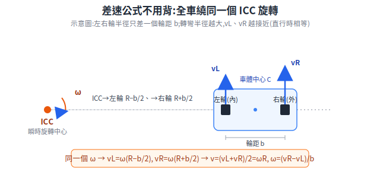

# 底盤與驅動系統

送餐機器人「怎麼動」的機械基礎:用什麼輪子、什麼馬達、要不要減速機。室內送餐幾乎都是兩輪差速 + 萬向輪,本篇解釋這個選擇背後的理由,以及輪轂馬達、BLDC、行星減速機的取捨。

> 章節編號沿用原始《送餐機器人基礎原理補充》,方便與舊文件對照。
> 延伸閱讀:[馬達與 FOC](motors-and-foc.md)、[編碼器](encoders.md)、[系統架構](../00-overview/system-architecture.md)

---

## 1. 底盤裝置解釋

### 1.1 兩輪差速 (Differential Drive)

兩顆驅動輪裝在同一軸線上、各自獨立控制轉速,**靠左右輪「速度差」轉彎**——沒有方向盤、沒有轉向機構:

```
俯視圖:
        ┌─────────┐
        │  ○ 萬向輪 │   ← 被動,只支撐
        │          │
   驅動輪▐█        █▌驅動輪   ← 同軸線,各自獨立馬達
        │          │
        │  ○ 萬向輪 │
        └─────────┘
```

| 左右輪狀態 | 行為 |
|---|---|
| 同速同向 | 直行 |
| 左快右慢 | 向右弧線轉彎 |
| 左正右反(等速) | **原地旋轉**(餐廳窄道的關鍵能力) |

**運動學公式不用背,從第一性原理推得出來。** 根本問題:左右輪轉速不同,車會怎麼動?

關鍵是一個剛體事實——**任一瞬間,整台車都繞某個點旋轉**,這個點叫 **ICC(Instantaneous Center of Curvature,瞬時旋轉中心)**;直行時它在無限遠。既然是「同一個剛體繞同一個點轉」,**全車共用同一個角速度 ω**;而左右輪到 ICC 的半徑差了一個輪距 b,半徑大的轉得快——差速就是這麼來的:

<p align="center"></p>

設車體中心到 ICC 的半徑為 R,左右輪到 ICC 就是 `R−b/2`、`R+b/2`。「速度 = 角速度 × 半徑」給出:

```
vL = ω·(R − b/2)        vR = ω·(R + b/2)
兩式相加 → vR + vL = 2ωR  → v = ωR = (vR + vL) / 2     ← 正解
兩式相減 → vR − vL = ωb    → ω = (vR − vL) / b
逆解(車體 → 輪速):       vR = v + ωb/2     vL = v − ωb/2
```

(b = 兩輪間距、r = 輪半徑;`v = ωR` 就是「中心速度 = 角速度 × 中心半徑」。)看懂這張圖,公式現場就能推,不用背——後面的 odometry 積分、SLAM 的 scan matching 也都站在這個運動學地基上。

上位機只下發 `(v, ω)`(線速度 + 角速度,即 ROS 的 `/cmd_vel`),下位機用逆解算出左右輪各該轉多快。

### 1.2 萬向輪 (Caster Wheel)

就是辦公椅腳下那種輪子:**完全被動**,不驅動、不轉向,只負責支撐車體重量、維持平衡。輪叉可 360° 自由旋轉,車往哪走它就被拖著朝哪。兩輪差速車一定要配 1–2 顆萬向輪,否則只有兩個接地點會傾倒。

### 1.3 輪轂馬達 (Hub Motor)

馬達直接做進輪框裡——定子固定在輪軸上,轉子連著輪框外殼,**輪子本身就是馬達**:

- 優點:不需要減速箱、皮帶、聯軸器 → 結構簡單、安靜、不占底盤空間(送餐機底盤要留給電池)。
- 缺點:低速大扭矩全靠馬達本體(無減速比放大),所以極數多、體積較大;維修要整顆換。
- 對比方案:BLDC + 行星減速機 → 扭矩裕度大,但有齒輪噪音,餐廳場景通常選輪轂馬達。

### 1.4 BLDC(無刷直流馬達)與 24V / 100–200W

**有刷 vs 無刷**:傳統有刷馬達靠碳刷機械接觸換相,會磨損、有火花、噪音大。BLDC 把換相改成**電子式**——轉子是永久磁鐵,定子是三相線圈 (U/V/W),由驅動器依轉子位置輪流給三相通電,「推著」磁鐵轉。代價是必須有驅動器 + 轉子位置感測(霍爾感測器),馬達不能直接接電池就轉。

選型數字的由來:

- **24V**:安全特低電壓(<60V 免高壓法規)、電池與周邊生態最齊全的室內 AMR 標準電壓。
- **100–200W/輪**:估算方式 — 整車 50kg、最高速 1.2 m/s、爬 5° 小坡/過門檻時所需驅動力 F ≈ 滾動阻力 + 坡度分量 + 加速度項,P = F × v 再留 50% 裕度,落在這個區間。

### 1.5 Encoder(編碼器)為什麼必備

Encoder 量測**輪子實際轉了多少角度 / 多快**。沒有它,兩件事都做不到:

1. **速度閉迴路**:你命令輪子轉 2 rad/s,實際因為載重、地面摩擦、電池電壓下降,可能只轉 1.6 rad/s。沒有 encoder 回授就無法修正,左右輪誤差不一致時車會走歪。
2. **Odometry(里程推算)**:把左右輪轉角累積起來,推算「車從起點走了多遠、轉了多少角度」,這是上位機定位的基礎輸入。

常見形式(解析度由低到高):

| 類型 | 解析度 | 說明 |
|---|---|---|
| 霍爾感測器 | 每電氣圈 6 個狀態 | BLDC 換相本來就需要,可兼當低解析度 encoder |
| 磁編碼器 | 每圈數千–數萬 counts | 輪轂馬達常見加裝選項 |
| 光學增量式 (A/B 相) | 每圈數百–數千線,×4 解碼 | 配減速機方案常用;STM32 Timer 有硬體 encoder mode 直接解 |

---


## 5. BLDC + 行星減速機

### 5.1 為什麼需要減速機

馬達的天性是**高轉速、低扭矩**(一般 BLDC 甜蜜點在 3000–5000 RPM),但輪子需要的是**低轉速、高扭矩**(輪徑 15cm、車速 1 m/s → 輪子只要 ~127 RPM)。減速機就是「轉速換扭矩」的齒輪變速箱:

```
減速比 N = 20 時:
馬達 3000 RPM、0.2 N·m  →  輸出 150 RPM、~3.6 N·m(扣除效率 ~90%)
轉速 ÷ N        扭矩 × N × 效率
```

### 5.2 行星減速機的構造

```
俯視剖面:
        ┌─── 外環齒輪(固定)───┐
        │   ◯       ◯        │
        │     ┌───┐           │   太陽齒輪:中心,接馬達軸(輸入)
        │   ◯│ ☀ │◯         │   行星齒輪:3–4 顆,繞著太陽轉
        │     └───┘           │   行星架:串起行星輪的軸(輸出)
        │   ◯       ◯        │
        └─────────────────────┘
```

馬達轉太陽齒輪 → 行星齒輪被帶動,沿著固定的外環齒輪「公轉」→ 行星架以較慢的速度輸出。命名就是來自「行星繞太陽」的結構。

為什麼選「行星式」而不是普通正齒輪減速:

| 特性 | 行星減速機 | 平行軸正齒輪箱 |
|---|---|---|
| 輸入/輸出軸 | **同軸心** → 可直接套在馬達前端,結構緊湊 | 軸偏移,體積大 |
| 扭矩承載 | 負載分散到 3–4 顆行星輪 → 同體積扭矩大 | 單一嚙合點受力 |
| 減速比 | 單級 3–10,可串級(兩級 9–100) | 單級比小 |

### 5.3 與輪轂馬達的取捨

| 面向 | 輪轂馬達 | BLDC + 行星減速機 |
|---|---|---|
| 結構 | 馬達=輪子,零傳動件 | 馬達 + 減速機 + 聯軸器/軸承座 |
| 噪音 | 安靜 | 有齒輪聲(精度等級越低越吵) |
| 扭矩裕度 | 受輪內空間限制 | 換減速比即可,裕度大 |
| 背隙 (backlash) | 無 | 有(齒輪間隙),低速換向時 odometry 有小死區 |
| 馬達選擇 | 特規多極馬達 | 通用高速 BLDC,便宜好買 |
| 適用 | 平地室內(送餐主流) | 重載、爬坡、戶外 AGV |

> Encoder 安裝位置的細節:配減速機時 encoder 通常裝在**馬達端**(轉得快 → 等效解析度高 N 倍),但量到的是減速機「之前」的角度,背隙誤差量不到;對送餐機精度要求這不構成問題,但要知道有這回事。

---


## 10. 伺服馬達 vs 底盤輪馬達:解析度、精度與控制模式

> 情境:網路上常見「17 位伺服馬達,131072 脈衝轉一圈,最小精度 0.0027 度,定位誤差可達 0.001mm」這類描述。它講的是**工業伺服定位**的世界,跟送餐機器人底盤是兩種不同的控制問題,而且用詞有幾處不精確。

### 10.1 逐句拆解常見誤導

| 原文說法 | 精確的說法 |
|---|---|
| 「17 位伺服馬達」 | 17-bit 指的是**馬達後面那顆編碼器**的解析度:2¹⁷ = 131072 counts/圈。馬達本身沒有位元數 |
| 「每 131072 個脈衝轉一圈」 | 這是「脈衝列 (pulse/direction) 命令介面」:控制器發脈衝、驅動器收,每個脈衝轉一格。脈衝數對應幾度其實由驅動器的**電子齒輪比**設定,不一定等於編碼器解析度 |
| 「最小精度 0.0027 度」 | 這是**解析度 (resolution)**,不是精度。解析度 = 能「分辨/命令」的最小刻度;**精度 (accuracy)** = 實際到達位置與目標的誤差,受齒隙、軸承、溫漂、編碼器本身誤差影響,永遠比解析度差 |
| 「定位誤差可達 0.001mm」 | 旋轉角度要換算成直線定位,必須經過機構(滾珠螺桿導程、皮帶輪徑)。脫離機構講 mm 級定位誤差沒有意義;0.001mm 是「高階螺桿 + 全閉環」整個系統的數字,不是馬達自己的 |

核心觀念一句話:**解析度是「尺上有幾格刻度」,精度是「量出來準不準」**——刻度可以無限細,尺本身歪了照樣不準。

### 10.2 兩個世界的對照

| | 工業伺服(引文的世界) | 送餐機器人底盤 |
|---|---|---|
| 控制目標 | **位置**(停在 0.001mm 內) | **速度**(輪子穩定追蹤目標轉速) |
| 控制迴路 | 位置環 + 速度環 + 電流環 三環 | 速度環 + 電流環 兩環(沒有位置環) |
| 命令介面 | 脈衝列 / EtherCAT / CANopen | CAN 速度命令(或 PWM) |
| 編碼器 | 17–23 bit 絕對值編碼器 | 霍爾 / 數千 counts 增量編碼器就夠 |
| 機構 | 螺桿 / 減速機,剛性連接,無打滑 | 輪胎與地面**摩擦接觸,會打滑** |
| 典型應用 | CNC、機械手臂、半導體設備 | AMR、AGV |

### 10.3 為什麼底盤不需要 17-bit 編碼器

送餐機器人的定位誤差來源排序:**輪胎打滑 >> 輪徑/輪距標定誤差 >> 編碼器解析度**。

粗算:輪徑 15cm、4096 counts 編碼器,一個 count ≈ 0.115mm 地面距離——而一次輕微打滑就是毫米到公分級誤差。換 17-bit 編碼器把 0.115mm 變成 0.0036mm,對 odometry 品質**幾乎沒有貢獻**,因為瓶頸根本不在解析度。這也是為什麼架構上靠 IMU 融合(§3.3)與 LiDAR 定位修正,而不是堆編碼器位元數。

> 引文第一段(汽車輪轂馬達含動力、傳動、制動)補充一點:送餐機器人的輪轂馬達「制動」通常不是機械煞車,而是**馬達自身電氣制動**(能量回收減速 / 三相短路煞車),部分型號加電磁抱閘用於斷電駐車。坡道停車需求要在選型時確認有無抱閘。

---


