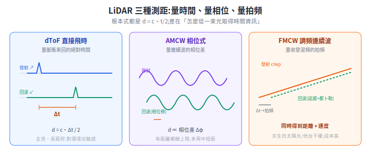
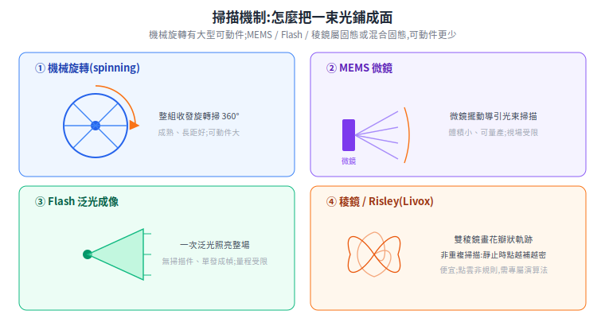
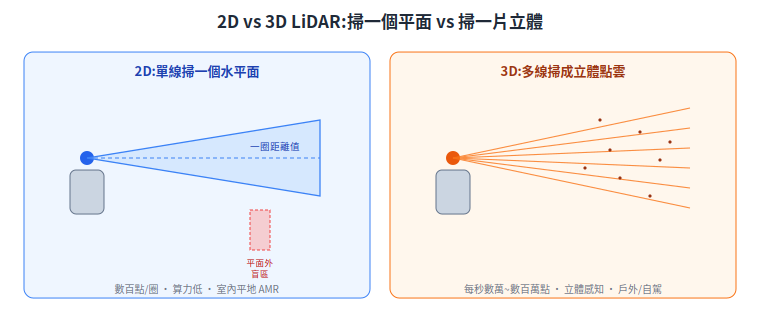

# LiDAR 完整解析:原理、技術路線、廠商與產品盤點

機器人「看見」距離,最常靠 LiDAR(光達)。但 LiDAR 不是單一東西——測距方式、波長、掃描機制、2D/3D 各有分岔,選錯一條路線可能整個方案要重來。這篇從第一性原理把 LiDAR 拆開:**它怎麼從一束光算出距離、為什麼分這麼多種、現在市場上有哪些廠商與產品、室內 AMR 跟戶外自駕各該選什麼。**

> 前置:[感測器總覽](sensors.md)(2D LiDAR / 深度相機 / IMU 的角色)。延伸:[3D LiDAR SLAM 建圖](../30-navigation/slam-3d-lidar.md)(光達點雲怎麼建成地圖)。
> 整理時間 2026 年 6 月。廠商型號、市佔、時程會變動,文中標明來源與年份;會變或行銷性質的數字標清楚,部分定量規格以各型號官方 datasheet 為準。

---

## 1. 第一性原理:LiDAR 在做什麼

LiDAR(Light Detection and Ranging)是**主動式測距**:自己發一束光出去,光打到物體反射回來,測「光來回帶回的資訊」,反推距離。一整套眼花撩亂的技術分類,本質都在回答兩個問題:

1. **怎麼從一束光,算出一個距離?**(測距原理 → §2)
2. **怎麼把很多束光的距離,組成一個平面或立體的點雲?**(掃描機制 → §4、2D/3D → §5)

剩下的(波長、規格、可動件)全是為了讓這兩件事「夠遠、夠準、夠便宜、夠耐久」而做的工程取捨。

測距的根本公式只有一條:

`d = c · t / 2`

`c` 是光速(約 3×10⁸ m/s),`t` 是光來回的時間,除以 2 是因為 `t` 含「去 + 回」兩段。從這條式子立刻看出工程難點:光速太快,**1 公尺來回只要約 6.7 奈秒**。要量到公分級,計時電路得有皮秒級分辨力——這正是不同測距方案要各自繞開的核心困難。

---

## 2. 測距三方案:dToF / 相位式 / FMCW

| 方案 | 量的是什麼 | 距離 | 能否同時測速 |
|---|---|---|---|
| **dToF(直接 ToF)** | 脈衝來回的**絕對時間** `t` | `d = c·t/2` | 否(要比較前後兩幀) |
| **相位式 / AMCW** | 連續波的**相位差** `Δφ` | `d = c·Δφ/(4π·f_M)` | 否 |
| **FMCW**(調頻連續波) | 收發信號混頻的**拍頻** `f_B` | `d = c·f_B·T/(2B)` | **是** |

> 符號:`Δφ` = 回波相位差、`f_M` = 振幅調制頻率、`f_B` = 收發混頻後的拍頻、`T` = 掃頻週期、`B` = 掃頻帶寬。相位式屬 iToF(間接 ToF)家族(量相位而非直接量時間),dToF 才是直接量時間。

- **dToF**:發短脈衝、直接計時。原理最簡單、長距訊噪比好,是目前車載主流;缺點是需要極高速計時電路,且對環境光、別台 LiDAR 的脈衝較敏感(可能把別人的脈衝當成自己的回波)。
- **相位式 / AMCW**:發連續波、對振幅做週期調制,量回波相位差。相位每 2π 重複一次 → 有「距離模糊」上限,多用於中短距。
- **FMCW**:發頻率隨時間線性掃描(chirp)的**相干光**——「相干」是指用自己發出去的那束雷射當參考,回來後跟它「對拍子」(混頻),兩個頻率相減得到**拍頻**,拍頻正比於距離。**最大優勢是一次量測同時得到距離與徑向速度**(目標移動會讓拍頻產生都卜勒偏移),不必像 ToF 比較前後幀;而且相干偵測只認自己那束光,**對陽光與脈衝式 LiDAR 的干擾抑制力很強**。代價是需要窄線寬可調雷射 + 相干接收,系統複雜、目前成本高、量產成熟度低於 dToF。

> 來源:[thinkautonomous — FMCW LiDAR](https://www.thinkautonomous.ai/blog/fmcw-lidar/)、[4sense — dToF/iToF vs FMCW](https://4sense.medium.com/lidar-dtof-itof-vs-fmcw-from-academic-perspective-a1b0410a03db)、[arXiv 2501.17884 — 車載 dToF 測距分析](https://arxiv.org/pdf/2501.17884)。

---

## 3. 波長:905nm vs 1550nm

兩者是車載 / 工業 LiDAR 的兩大標準,取捨的根源是**矽偵測器的物理上限**。

矽(Si)光電二極體的響應範圍約 400–1100nm,上限由矽的能隙決定。**905nm 落在矽的響應區內**,可用便宜成熟的矽偵測器;**1550nm 超出矽的範圍**,必須改用較貴的 InGaAs 偵測器。這條物理線決定了下表大半的取捨:

| 維度 | 905nm | 1550nm |
|---|---|---|
| 偵測器 | 矽,成熟、便宜、量大 | InGaAs / Ge,較貴 |
| 眼睛安全 | 部分穿透到視網膜,功率受限 | 角膜 / 晶狀體吸收較多,同功率下安全裕度大得多 |
| 可用功率 / 量程 | 受眼安全限制,功率上不去 | 眼安全裕度大 → 可加大功率 → 打更遠 |
| 成本 | 低 | 高 |
| 潮濕 / 雨雪 | 水氣吸收較低 | 水氣吸收較高,潮濕較吃虧;對乾塵 / 霾抗性較好 |
| 功耗 / 散熱 | 低,適合無人機 | 高,散熱與續航是負擔 |

代表:905nm 陣營有 Innoviz、Valeo、Livox HAP、多數 ADAS 量產件;1550nm 陣營有 Luminar、Aeva(FMCW)。特例:Ouster 用 865nm、RoboSense M3 用 940nm,屬廠商自家取捨。

> 來源:[Lumimetric — 905 vs 1550](https://www.lumimetric.com/en/new/905nm-and-1550nm-LiDAR-Laser-Comparison.html)、[Inertial Labs](https://inertiallabs.com/why-have-905-and-1550-nm-become-the-standard-for-lidars/)、[Edmund Optics — InGaAs](https://www.edmundoptics.com/f/ingaas-photodiodes/12621/)。**注意**:1550nm「眼安全約 40 倍」「霧中量程增減百分比」等數字多來自廠商技術頁、各家口徑不一,嚴謹引用應回查 IEC 60825-1 與型號 datasheet。

---

## 4. 掃描機制:怎麼把一束光鋪成面

圖示四種有具體掃描軌跡的機制;OPA 純靠電子控向、沒有可畫的機械軌跡,故未繪,原理見下表。

把「一束光的距離」鋪成面或立體,有幾種主流做法。後面幾種(MEMS / OPA / Flash / 稜鏡)沒有大型可動件,合稱 **solid-state(固態)**:

| 機制 | 原理 | 優點 | 缺點 / 風險 |
|---|---|---|---|
| **機械旋轉** | 馬達帶整組收發旋轉掃 360°,垂直靠堆疊多顆發射器 | 360° 視場、技術成熟、長距訊噪比好 | 大型可動件 → 壽命 / 震動 / 體積 / 成本瓶頸 |
| **MEMS 微鏡** | 晶片上的微鏡受電磁力擺動,導引光束 zig-zag 掃描 | 體積小、比機械旋轉便宜、可量產 | 微鏡是小可動件,有共振疲勞;視場受偏轉角限制(「混合固態」) |
| **OPA 光學相控陣** | 晶片上發射器陣列,調各單元相位、干涉控制波前方向,**無可動件** | 純電子控向、極快、無共振 | 製程 / 旁瓣 / 量產成熟度仍在發展 |
| **Flash** | 一次泛光照亮整個視場,用光電二極體陣列單次成像 | 單發成幀、無掃描件、抗運動模糊 | 能量分散全場 → 單點功率低 → 量程受限 |
| **稜鏡 / Risley(Livox)** | 兩片旋轉稜鏡偏折單束雷射,畫出花瓣狀軌跡 | 可動件少、便宜;**非重複掃描** | 軌跡非規則網格,點雲處理需專屬模型 |

**OPA 怎麼「不動就能控向」**:想像一排喇叭各自微調發聲的時機,聲波互相干涉後,合成波會指向某個方向——調時機就能轉向,喇叭本身完全不動。OPA 用光做同樣的事:晶片上一排發射器各自調相位,光波干涉後波前指向受控,純靠電子控向、零機械件。這是「終極固態」的方向,但製程與量產成熟度仍在追。

**Livox 的非重複掃描**值得單獨講:傳統旋轉式每圈走同一條線,Livox 用旋轉稜鏡讓軌跡不重複,於是**就算 LiDAR 靜止,視場內的點密度也隨時間持續增加**——中心區因每圈都掃到所以最密,外緣較稀但隨時間補上。好處是可動件少、便宜;代價是點雲非規則,SLAM 需要專門演算法(如 LOAM-Livox)。

> 來源:[arXiv 2202.11025 — 3D ToF LiDAR 機器人應用綜述](https://arxiv.org/pdf/2202.11025)、[Hesai — 固態與混合固態差異](https://www.hesaitech.com/things-you-need-to-know-about-lidar-solid-state-and-hybrid-solid-state-whats-the-difference/)、[PMC8309668 — Livox Mid-40 Risley 稜鏡模型](https://pmc.ncbi.nlm.nih.gov/articles/PMC8309668/)。

### 為什麼機械旋轉逐漸被固態取代

第一性原理:**可動件 = 失效源 + 成本源 + 車規門檻**。拿掉旋轉馬達後,抗震、壽命、量產成本都改善,也更容易過車規(震動 / 衝擊 / 溫度循環)。不過目前許多量產車載用的是 **MEMS / 稜鏡式「混合固態」**——仍有小型可動件,是「全機械」到「全固態(OPA / Flash)」之間的過渡;純 OPA / Flash 的量程與量產成熟度還在追趕。

> 來源:[Ouster — 車載 LiDAR 的終局](https://ouster.com/blog/what-is-the-end-state-of-automotive-lidar/)、[Embedded — 固態更簡單](https://www.embedded.com/solid-state-lidar-offers-simpler-automotive-sensing-solution/)。

---

## 5. 2D vs 3D LiDAR:本質差別

| | 2D LiDAR | 3D LiDAR |
|---|---|---|
| 掃描 | 單線,掃**一個水平平面** | 多線(16/32/64/128 線)或掃描成面 |
| 輸出 | 一圈距離值(平面上的點) | 點雲(每秒數萬~數百萬點) |
| 判準 | < 16 線一般視為 2D | 16 線起算 3D |

**室內 AMR 常用 2D**:倉儲、餐廳環境平坦受控,障礙大致在同一水平面;2D 成本低、數據量小(毫秒級可處理)、算力需求低,掃單一平面就夠做基本導航避障。代價是**平面以外的盲區**——桌面下伸出的貨架腳、懸空橫桿,單一掃描高度可能漏看。

**戶外 / 自駕用 3D**:非結構化環境,障礙分布在不同高度(行人、車、路緣、懸空物),需要立體點雲才能可靠感知,代價是算力、演算法、成本都更高。

> 來源:[Hokuyo — AMR 該用 2D 還 3D](https://www.hokuyo-usa.com/resources/blog/2d-lidar-vs-3d-lidar-which-better-your-amr-fleet)、[thinkautonomous — 2D LiDAR](https://www.thinkautonomous.ai/blog/2d-lidar/)。

---

## 6. 選型規格維度(checklist)

挑 LiDAR 時對齊這幾個維度,實際數字以**該型號官方 datasheet** 為準:

| 維度 | 意義 |
|---|---|
| **線數 / channels** | 垂直幾條掃描線(16/32/64/128),越多越密也越貴 |
| **點率(points/sec)** | 每秒輸出點數,決定點雲密度與更新率 |
| **量程(range)** | 可測最遠距離,常標「@10% 反射率」 |
| **FOV(水平/垂直)** | 視場角;機械旋轉可水平 360°,固態多為前向有限角 |
| **角解析度** | 相鄰兩點的角度間隔,越小越能辨識小物體 |
| **精度** | 分系統誤差(accuracy)與重複性(precision) |
| **重複 vs 非重複掃描** | 非重複(Livox 式)靜止時覆蓋率隨時間上升 |
| **防護等級(IP)** | 戶外 / 工業現場關鍵 |

---

## 7. 廠商與產品盤點(2025–2026)

> 選 2D LiDAR 給 AMR 前,先分清一條攸關工安的界線:**量測型**(導航避障用,無功能安全等級,不可當人員防護)vs **安全認證型**(可作人員防護)。會在有人環境移動、撞到人會出事的 AMR,人員防護一定要用安全認證型。
>
> 安全認證型標的 **Type 3(IEC 61496)、SIL2(IEC 61508)、PL d(ISO 13849)** 是三套並行的功能安全等級指標,能標到代表通過第三方認證、可在失效時把機器安全停下來、當人員防護裝置;量測型沒有這些認證,只能拿來導航避障,**不能用來保護人**。

### 7.1 2D LiDAR(室內 AMR / 安全掃描)

| 廠商 | 代表產品 | 類型 | 安全認證 |
|---|---|---|---|
| **SICK**(德) | TiM5xx/7xx(量測,~25m)、**microScan3 / nanoScan3**(安全) | 量測 + 安全 | nanoScan3:Type 3 / SIL2 / PL d,超薄(~8cm)適合低底盤 AMR |
| **Hokuyo**(日) | UST-10/20/30LX(SLAM 常用、~130g)、**UAM-05LP**(安全) | 量測 + 安全 | UAM-05LP:Type 3 / SIL2 / PL d |
| **Slamtec**(中) | RPLIDAR A 系列(三角測距)、S 系列(dToF) | 消費 / 機器人 | 無 |
| **YDLIDAR**(中) | G 系列、TG15/30/50、GS 系列 | 低成本消費 | 無 |
| **Pepperl+Fuchs**(德) | R2000(高精度量測)、R2300(多層) | 量測 / 定位 | LiDAR 非安全;safePXV 定位另達 SIL3 |

室內 AMR 實務常見組合:**安全認證 2D(人員防護)+ 量測 2D(SLAM 建圖)+ 視需要加小型 3D(立體避障)**。

> 來源:[SICK nanoScan3](https://www.sick.com/media/docs/5/75/075/product_information_nanoscan3_en_im0087075.pdf)、[Hokuyo UST](https://www.hokuyo-aut.jp/search/single.php?serial=167)、[Hokuyo UAM-05LP](https://www.hokuyo-aut.jp/search/single.php?serial=174)、[Slamtec RPLIDAR S3](https://www.slamtec.com/en/s3/spec)、[Pepperl+Fuchs R2000](https://www.pepperl-fuchs.com/en/landingpage/industrial-sensors/r2000-series-gp27391)。

### 7.2 3D LiDAR(自駕 / 戶外 / 機器人)

| 廠商 | 代表產品 | 技術路線 | 波長 | 定位 |
|---|---|---|---|---|
| **Ouster**(美) | OS0 / OS1 / OS2(數位光達) | 機械旋轉 + 數位 SPAD/VCSEL | 865nm | 機器人 / 工業 / 自駕 / 基礎設施;2023 與 Velodyne 合併 |
| **Hesai 禾賽**(中) | AT128 / ATX(車規)、JT 系列(機器人)、XT/Pandar(機械) | 半固態 + 機械 | 多為 905nm | 車規市佔領先;JT 系列為 2025 發表的微型機器人光達 |
| **RoboSense 速騰**(中) | M 系列(車規)、E1R(純固態)、Helios(機械) | 2D 掃描固態 + 機械 | M3=940nm、M1=905nm | 乘用車出貨量大;E1R 全固態(官方標稱抗 50G / IP67) |
| **Livox 覽沃**(中,DJI 孵化) | Mid-360、HAP(車規)、Avia(測繪) | 旋轉鏡混合固態 + 非重複掃描 | HAP=905nm | Mid-360 低速機器人高 CP 值;Avia 官方標稱最遠約 450m(@標稱條件) |
| **Innoviz**(以) | InnovizOne / Two | MEMS 微鏡 | 905nm | One 隨 BMW i7 L3 量產 |
| **Luminar**(美) | Iris / Halo | 機械線掃 | **1550nm** | **2025-12-15 聲請 Chapter 11**,採用前評估供應風險 |
| **Valeo**(法) | SCALA(Gen 1/2/3) | 機械車規 | — | **量產 L3 驗證件**(Mercedes DRIVE PILOT) |
| **Aeva**(美) | Aeries / Atlas | **FMCW**(4D,自帶測速) | 1550nm | Daimler Truck 獨家;高速場景 |

> 表中縮寫:**SPAD** = 單光子雪崩二極體(超靈敏的光偵測器,連單顆光子都收得到)、**VCSEL** = 垂直腔面射型雷射(一種常見、好陣列化的發光源)、**數位光達** = Ouster 把收發改成 SPAD/VCSEL 半導體陣列、走數位訊號鏈的做法、**4D** = 3D 點雲再加「每個點的徑向速度」(靠 FMCW,見 §2)、**半固態 / 混合固態** = 仍有小型可動件(MEMS 微鏡或旋轉稜鏡)、**純固態** = 完全無可動件。

> 來源:[Ouster OS1](https://ouster.com/products/hardware/os1-lidar-sensor)、[Ouster+Velodyne 合併(2023-02-10 完成)](https://www.businesswire.com/news/home/20230213005229/en/Ouster-and-Velodyne-Complete-Merger-of-Equals-to-Accelerate-Lidar-Adoption)、[Hesai AT128](https://www.hesaitech.com/product/at128/)、[Hesai JT 系列](https://www.hesaitech.com/hesai-unveils-mini-hyper-hemispherical-3d-lidar-series-for-robotics-at-ces-hesai/)、[RoboSense M3](https://www.robosense.ai/en/rslidar/M3)、[Livox Mid-360](https://www.livoxtech.com/mid-360)、[Valeo SCALA(L3)](https://www.valeo.com/en/valeos-lidar-technology-the-key-to-conditionally-automated-driving-part-of-the-mercedes-benz-drive-pilot-sae-level-3-system/)、[Aeva CES 2026](https://www.aeva.com/press/aeva-to-showcase-passenger-oem-vehicle-with-windshield-integrated-4d-lidar-and-introduce-new-sensor-technology-for-physical-ai-at-ces-2026/)、[Luminar 破產(TechCrunch)](https://techcrunch.com/2025/12/16/how-luminars-doomed-volvo-deal-helped-drag-the-company-into-bankruptcy/)。

---

## 8. 市場動態(附來源與年份)

- **Velodyne + Ouster 合併**:2022-11 簽約,**2023-02-10 完成**(對等合併),存續沿用 Ouster 名、NYSE 代號 OUST。
- **中國雙雄崛起**:依 Yole 轉述,Hesai 連年居車用 LiDAR 營收市佔前列(2024 約 33%、逐年下滑),RoboSense 2024 乘用車出貨量全球第一、2025-06 累計交付突破 100 萬顆車用 LiDAR。⚠️ **這些市佔數字各家口徑不一(營收 vs 出貨、乘用車 vs 全車用),且 Yole 原報告未取得全文,均為第三方/廠商轉述,交叉比較須先對齊定義。**
- **車規量產現況**:已實質上車的有 Valeo SCALA(Mercedes L3)、Hesai / RoboSense(中國多家 OEM)、Innoviz(BMW i7)。
- **失敗收場**:Luminar 因 Volvo、Mercedes 合約瓦解,2025-12-15 聲請 Chapter 11——1550nm 陣營少一員。
- **機器人專用光達成新戰場(2025–2026)**:低速機器人(割草、清掃、物流、服務)崛起,代表有 Livox Mid-360、Hesai JT 系列、Ouster,以及 Slamtec、Benewake、LSLIDAR 等競爭。

> 來源:[TechCrunch — Ouster/Velodyne 合併](https://techcrunch.com/2022/11/07/ouster-and-velodyne-agree-to-merger-signaling-consolidation-in-lidar-industry/)、[optics.org — 中國廠主導(Yole 轉述)](https://optics.org/op/news/16/4/25)、[LIDAR Magazine — Hesai 市佔](https://lidarmag.com/2025/04/17/lidar-industry-enters-mass-adoption-phase-hesai-remains-leader-in-global-market-share/)、[RoboSense 破百萬交付](https://cnevpost.com/2025/06/16/robosense-1-million-auto-lidar-delivery/)。

---

## 9. 選型建議

**室內送餐 / 搬運 AMR**
- 人員防護(必選安全認證型):**SICK nanoScan3 / microScan3** 或 **Hokuyo UAM-05LP**(皆 SIL2 / PL d);nanoScan3 超薄適合低底盤。
- 導航 / SLAM 建圖(量測型即可):**Hokuyo UST 系列**(輕、ROS 生態成熟)、**SICK TiM**;成本敏感或原型可用 **Slamtec RPLIDAR S 系列**、**YDLIDAR TG 系列**。
- 立體避障補強(可選):**Livox Mid-360**(360°×59° 半球、265g)、**Hesai JT16**、**RoboSense E1R**。

**戶外 / 自駕**
- 車規量產首選:**Valeo SCALA**、**Hesai AT128/ATX**、**RoboSense M 系列**、**Innoviz**(已上車)。
- 長距 / 惡劣天候:**1550nm** 路線(Aeva FMCW 自帶測速,適合高速);注意 Luminar 已破產的供應風險。
- 戶外機器人 / 測繪:**Livox Avia**、**Ouster OS1/OS2**。

---

## 來源清單

**原理**
- [thinkautonomous — FMCW LiDAR](https://www.thinkautonomous.ai/blog/fmcw-lidar/)、[4sense — dToF/iToF vs FMCW](https://4sense.medium.com/lidar-dtof-itof-vs-fmcw-from-academic-perspective-a1b0410a03db)、[arXiv 2501.17884](https://arxiv.org/pdf/2501.17884)
- [arXiv 2202.11025 — 3D ToF LiDAR 綜述](https://arxiv.org/pdf/2202.11025)、[Hesai — 固態 vs 混合固態](https://www.hesaitech.com/things-you-need-to-know-about-lidar-solid-state-and-hybrid-solid-state-whats-the-difference/)、[PMC8309668 — Livox Risley](https://pmc.ncbi.nlm.nih.gov/articles/PMC8309668/)
- 波長:[Lumimetric](https://www.lumimetric.com/en/new/905nm-and-1550nm-LiDAR-Laser-Comparison.html)、[Inertial Labs](https://inertiallabs.com/why-have-905-and-1550-nm-become-the-standard-for-lidars/)、[Edmund Optics InGaAs](https://www.edmundoptics.com/f/ingaas-photodiodes/12621/)
- 2D vs 3D:[Hokuyo](https://www.hokuyo-usa.com/resources/blog/2d-lidar-vs-3d-lidar-which-better-your-amr-fleet)、[thinkautonomous](https://www.thinkautonomous.ai/blog/2d-lidar/)
- 固態趨勢:[Ouster — 終局](https://ouster.com/blog/what-is-the-end-state-of-automotive-lidar/)、[Embedded](https://www.embedded.com/solid-state-lidar-offers-simpler-automotive-sensing-solution/)

**廠商 / 產品 / 市場**:見 §7、§8 各表格內連結。

> 待查證(未捏造,標記避免誤用):Hesai/RoboSense 部分型號的確切波長與定量規格;Yole 市佔原報告全文與口徑;Aeva 未具名歐洲 OEM;純 flash/OPA 廠商型號歸類。引用具體規格請以官方 datasheet 為準。
