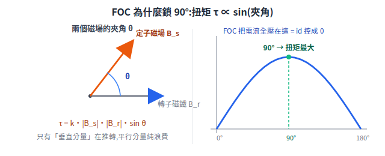

# 馬達與 FOC 控制

機器人會動,核心是馬達。本篇從「馬達怎麼把電變成轉動」一路講到 FOC(磁場導向控制)為什麼是現代無刷馬達的標準作法,並拆解定子/轉子、有刷/無刷、功率橋與閘極驅動器這些常被行銷術語包裝的硬體。

> 章節編號沿用原始《送餐機器人基礎原理補充》,方便與舊文件對照。
> 延伸閱讀:[底盤與驅動系統](chassis-and-drivetrain.md)、[編碼器](encoders.md)、[數位電路與 open-drain](digital-circuits.md)

---

## 2. FOC 是什麼

FOC = **Field-Oriented Control,磁場導向控制**,是 BLDC/PMSM 馬達目前最主流的控制演算法。

### 2.1 它解決什麼問題

最簡單的 BLDC 控制是「六步方波換相」:依霍爾訊號把三相電依 6 個區段切換通電。能轉,但每次切換都是電流硬跳變 → **扭矩脈動**,表現為低速時車身一頓一頓、有電磁嘯叫。送餐機恰好最在意低速平順(湯不能灑)與安靜,所以用 FOC。

### 2.2 核心思想

**為什麼是「垂直」?** 從第一性原理:馬達扭矩來自定子磁場與轉子磁鐵兩個磁向量的交互作用,大小是

```
τ = k · |B_定子| · |B_轉子| · sin(兩者夾角 θ)
```

`sin θ` 在 **θ = 90°** 時最大、在 0°(平行)時為零。所以「想用同樣的電流榨出最大扭矩」⟺「把夾角鎖在 90°」⟺「電流全部用在垂直分量、平行分量(id)控成 0」。這不是規定,是 `sin` 函數逼出來的:

<p align="center"></p>

FOC 做的事就是:**即時知道轉子角度,然後把三相電流精確控制成永遠垂直(90°)推轉子的方向**。

實作流程(每秒執行 10k–20k 次):

```
① 量測兩相電流 (ADC)
② Clarke + Park 變換:把三相交流電流,用轉子角度「旋轉」到
   跟著轉子轉的 d-q 座標系 → 交流問題變直流問題
     iq = 垂直分量 → 產生扭矩(想要的)
     id = 平行分量 → 不產生扭矩(控制成 0)
③ 兩個 PI 控制器分別調節 iq、id
④ 反 Park 變換 + SVPWM → 換算回三相 PWM 占空比,驅動功率橋
```

直觀類比:推旋轉門,FOC 保證你的手永遠垂直推門板(全部力氣變成轉動),而不是斜著推(一部分力氣浪費在擠門軸上)。

### 2.3 串級控制架構

FOC 電流環是最內環,外面再包速度環:

```
上位機 (v,ω) → [運動學逆解] → 輪目標轉速 → [速度環 PI (~1kHz)]
             → 扭矩(iq)命令 → [FOC 電流環 (10–20kHz)] → 三相 PWM → 馬達
                  ↑ encoder 轉速回授          ↑ 電流感測 + 轉子角度
```

### 2.4 為什麼建議初期買現成驅動器

自研 FOC 需要:電流採樣電路設計、功率橋(MOSFET)設計、20kHz 中斷下的定點/浮點運算優化、各種保護(過流/過壓/堵轉)、參數整定。是一個獨立的專業領域。現成 FOC 驅動器(CAN/RS485 介面)把這層全部封裝好,STM32 只要下「目標轉速」指令——把研發資源留給系統整合,符合 deep module 原則:介面窄(一條 CAN 指令),複雜度藏在模組內。

---


## 9. 看懂馬達驅動晶片的行銷術語

> 情境:晶片廠(TI、ST、Infineon…)官網的 BLDC 產品文案,例如:
> 「利用我們的 BLDC 馬達驅動器產品組合,實現最高的 3 相無刷馬達性能與永磁同步馬達 (PMSM) 性能。我們的產品具備如智慧型閘極驅動器、整合式馬達控制、整合式 FET 及功能安全設計封裝等關鍵功能…」

### 9.1 先建立座標:馬達驅動的硬體鏈

要看懂這些詞,先知道「讓 BLDC 轉起來」的完整硬體鏈長什麼樣:

```
MCU ──► 閘極驅動器 ──► 功率橋(6 顆 MOSFET)──► 三相線圈 ──► 馬達轉
(算 PWM)  (小訊號放大     (真正開關大電流,
           成能推 MOSFET   把電池 24V 切成
           的驅動訊號)     三相波形)
```

- **FET / MOSFET**:功率開關元件。馬達電流動輒數安培到數十安培,MCU 腳位只能輸出幾 mA,所以由 6 顆 MOSFET 組成「三相橋」來開關大電流。
- **閘極驅動器 (gate driver)**:MOSFET 的閘極需要比 MCU 腳位更高的電壓與瞬間電流才能快速開關,gate driver 就是中間的「放大器 + 電平轉換」。其中高邊 MOSFET 的閘極電壓必須比電池電壓還高,需要 bootstrap/charge pump 電路——這正是不能用 MCU 直推的原因。

### 9.2 逐詞解讀那段文案

| 文案用詞 | 實際意思 |
|---|---|
| 馬達驅動器(此處) | **驅動晶片 (IC)**,不是裝在機器人上的「驅動器整機」。整機 = 這顆 IC + MCU + 功率級 + 外殼做成的產品 |
| 3 相無刷馬達 (BLDC) vs PMSM | 同族兄弟,都是「永磁轉子 + 三相定子」。嚴格區分:BLDC 反電動勢是梯形波(配六步方波控制)、PMSM 是弦波(配 FOC)。實務上常混用;文案並列只是說「兩種都支援」 |
| 智慧型閘極驅動器 (smart gate driver) | gate driver 加上「智慧」= 內建保護(過流/過溫/欠壓)、可程式化開關速率 (slew rate,用來折衷 EMI 與發熱)、故障診斷回報。對比傳統 gate driver 需要一堆外部電阻電容調整 |
| 整合式馬達控制 (integrated motor control) | **控制演算法燒在晶片裡**——例如無感測 FOC 直接內建,MCU 只要下「目標轉速」,連 FOC 程式都不用寫(或根本不需要 MCU)。對比:傳統作法演算法跑在你的 STM32 上 |
| 整合式 FET (integrated FETs) | 6 顆功率 MOSFET **直接做進同一顆晶片封裝**,外面不用再放功率橋。代價是電流上限受封裝散熱限制(通常適合數十瓦小馬達);大功率仍要外置 MOSFET |
| 功能安全設計封裝 (functional safety package) | 不是物理封裝,是「**文件包**」:晶片依 ISO 26262(車用)/ IEC 61508(工業)功能安全標準開發,廠商提供 FMEA、安全手冊、診斷覆蓋率數據,讓你的產品過安規認證時可以引用 |
| 工業 / 個人電子 / 汽車應用 | 同一系列晶片分不同等級:車規 (AEC-Q100)、工規、消費級,溫度範圍與認證不同 |

### 9.3 整合程度光譜(這段文案真正想說的事)

晶片廠的產品線就是沿著「幫你整合多少」排開的:

```
整合少 ◄──────────────────────────────────────► 整合多

只有 gate driver     + 整合 FET          + 整合馬達控制
(MCU 跑 FOC,        (省掉外部功率橋,    (連控制演算法都內建,
 外置 MOSFET,         適合小功率)         給你一顆晶片馬達就會轉)
 功率彈性最大)
```

對送餐機器人的對應:輪轂馬達 100–200W 的電流等級,現成 FOC 驅動器整機內部通常就是「MCU + smart gate driver + 外置 MOSFET」的組合。這張光譜圖是**做驅動器的人**要面對的選型;你買整機走 CAN,這層複雜度已被封裝掉——這正是第 2.4 節「初期不自研 FOC」的理由。

---


## 12. 功率橋與閘極驅動器:電池直流電如何變成推馬達的三相電

### 12.1 要解決的問題

電池給的是**固定的直流 24V**;但 BLDC 三相線圈需要的是**輪流通電、方向會換、大小可調**的電流(§2.2 FOC 就是在指揮這件事)。中間做轉換的硬體就是功率橋,指揮它的訊號放大器就是閘極驅動器。

### 12.2 MOSFET:電控的大電流開關

先理解單顆元件。MOSFET 有三支腳:

```
        D (Drain 汲極)
        │
  G ──┤├    G (Gate 閘極):控制端,加電壓 → D-S 之間導通
        │      像繼電器的線圈,但每秒可開關 2 萬次、無機械磨損
        S (Source 源極)
```

把它想成「電壓控制的繼電器」:Gate 對 Source 加約 +10V → D-S 導通(電阻僅數 mΩ,可流數十安培);Gate 歸零 → 斷開。它只工作在「全開/全關」兩態——半開會同時承受高電壓與大電流,瞬間燒毀,這也是後面所有設計約束的來源。

### 12.3 功率橋(三相橋 / 逆變器):6 顆 MOSFET 的排法

每相一對(上管 + 下管),共三組「半橋」,中點接出馬達三相線:

```
 電池 24V ──┬──────────┬──────────┬─────
            │          │          │
          [Q1 上管]   [Q3 上管]   [Q5 上管]
            │          │          │
            ├──► U 相  ├──► V 相  ├──► W 相 ──► 馬達三相線圈
            │          │          │
          [Q2 下管]   [Q4 下管]   [Q6 下管]
            │          │          │
 電池 GND ──┴──────────┴──────────┴─────
```

**電流怎麼流**(舉一例):開 Q1(U 上管)+ 開 Q4(V 下管),其餘全關:

```
電池+ → Q1 → U 相線圈 → 馬達內部 → V 相線圈 → Q4 → 電池−
```

電流從 U 進、V 出,定子產生一個方向的磁場。換開不同的管子組合,電流就走不同相、不同方向——**六步換相**就是依霍爾狀態(§11.1 的 6 個狀態)輪流切 6 種組合;**FOC** 則更進一步:6 顆管子都以 10–20kHz 的 PWM 高速開關,用「占空比」精細調出三相各自的等效電壓(SVPWM),配合線圈電感的天然濾波,流出近似弦波的平滑電流。

兩條鐵律:

1. **同一半橋上下管絕不同時導通**——否則電池正負極直接短路(shoot-through),瞬間炸管。所以上管關閉到下管開啟之間要插入「**死區時間** (dead time)」,約數百 ns。
2. PWM 開得越慢(切換過渡期越長),MOSFET 停留在「半開」的時間越久 → 切換損耗越大、越燙。所以要「開得快」——這正是閘極驅動器存在的理由。

### 12.4 閘極驅動器:為什麼 MCU 不能直接推 MOSFET

STM32 輸出的 PWM 是 3.3V、約 20mA 的小訊號,直接接 MOSFET 的 Gate 有三個過不去的坎:

**坎 1:Gate 是一顆電容,快速開關需要安培級瞬間電流。**
MOSFET 的 Gate 等效於數十 nC 的電容,要在 ~100ns 內充滿(快速開關),瞬間電流 I = Q/t ≈ 50nC/100ns = **0.5–2A**。MCU 腳位的 20mA 只能慢慢充 → 切換過渡期拖長 → 切換損耗暴增 → MOSFET 過熱。閘極驅動器內部就是一對大電流推挽級,專門做這個「瞬間灌電流」。

**坎 2:上管的 Gate 電壓必須比電池電壓還高。**
N-MOSFET 導通條件是「Gate 比 **Source** 高 10V」。下管的 Source 接地,給 10V 就好;但**上管的 Source 是相線中點**,上管導通時中點電位 ≈ 24V,所以 Gate 要到 **~34V**——比系統裡任何電源都高。閘極驅動器用「**自舉電路** (bootstrap):下管導通時偷偷把一顆電容充到 10V,等上管要開時,把這顆電容『墊』在中點電位上面」產生這個懸浮的高壓。這是 MCU 物理上不可能直推上管的根本原因。

**坎 3:保護與時序。**
死區時間插入、欠壓鎖定(驅動電壓不足時拒絕半開 MOSFET)、過流偵測(去飽和偵測)、故障回報——§9.2 的「智慧型閘極驅動器」就是把這些保護全部做進晶片。

### 12.5 整條鏈合起來看

```
STM32/控制晶片        閘極驅動器              功率橋              馬達
 3.3V PWM ×6  ──►  電平轉換+放大+自舉  ──►  6 顆 MOSFET    ──►  三相線圈
 (決定「何時開      (把指令變成能真正    (把 24V 電池切成
  哪顆、開多久」)     推動 Gate 的訊號)     三相 PWM 波形)
   「大腦」            「神經+肌腱」           「肌肉」
```

回扣 §9 的整合光譜:這條鏈的每一段都可以「買整合的」——smart gate driver = 中段整合保護;integrated FET = 中段+右段做進同一顆晶片;FOC 驅動器整機 = 整條鏈裝盒、對外只剩 CAN 介面。本專案買整機,但看懂這條鏈,規格書上的「MOSFET 內阻」「死區時間」「最大相電流」「過流保護閾值」就都有了著落。

---


## 16. 定子與轉子:命名由來、定義、與 Park 變換的關係

### 16.1 命名由來:就是字面意思

| 中文 | 英文 | 字源 | 定義 |
|---|---|---|---|
| **定子** | stator | 拉丁文 *stare*(站立不動),同字根:static、stationary | 馬達裡**固定不動**的部分,鎖在外殼/機座上 |
| **轉子** | rotor | 拉丁文 *rotare*(旋轉),同字根:rotate、rotation | 馬達裡**跟著軸一起轉**的部分 |

命名只描述「動不動」,**不規定上面裝什麼**——這是最容易混淆的地方:

| 馬達類型 | 定子上是什麼 | 轉子上是什麼 |
|---|---|---|
| 有刷直流馬達 | 永久磁鐵 | 線圈(靠碳刷+換向器供電) |
| **BLDC / PMSM** | **三相線圈 (U/V/W)** | **永久磁鐵** |
| 感應馬達(工業 AC) | 三相線圈 | 鼠籠導體(無磁鐵) |

BLDC 的設計邏輯:把需要供電的線圈放在不動的定子上(導線直接拉出來,不需要碳刷),讓不用接線的磁鐵去轉——這正是「無刷」的由來(對照 §1.4)。

**輪轂馬達是「外轉子」結構**,跟直覺相反:定子(線圈)固定在**輪軸中心**,轉子(磁鐵)做在**外殼上、連著輪框**——轉的是外面那圈,§1.3 說「輪子本身就是馬達」就是這個意思。內轉子(轉軸在中心轉)反而是一般馬達的長相。

### 16.2 定子的具體構造(BLDC)

```
定子(不動,固定在輪軸上):
   矽鋼片疊成的鐵芯,開槽,繞上三組線圈 U/V/W
   三組線圈在圓周上每隔 120°(電氣角)分布
   §11 的三顆霍爾開關也嵌在定子上
   §12 功率橋的三條輸出線,接的就是定子的 U/V/W

轉子(轉動,= 輪框):
   一圈永久磁鐵(N/S 交替排列,§11.1 的「極對數」就是數它)
```

通電的因果鏈:功率橋給定子三相線圈輪流通電 → 定子產生**旋轉的磁場** → 轉子磁鐵被這個磁場拖著追 → 輪子轉。注意:**磁場在轉,但產生磁場的線圈本身不動**——「不動的東西產生會轉的場」,這個圖像是理解下一節的鑰匙。

### 16.3 Park 變換裡的「定子」:指的是座標系

§2.2 的 FOC 流程裡,「定子」「轉子」指的是兩個**參考座標系**:

```
定子座標系(不動)                轉子座標系(跟著轉)
  a-b-c:三相線圈的三個軸          d-q:釘在轉子磁鐵上
  (物理上釘在定子上,永遠不動)      d 軸 = 磁鐵 N 極方向
        │                          q 軸 = 垂直 d 軸(出扭矩的方向)
        │ Clarke 變換:3 軸 → 2 軸(α-β,仍在定子系,仍不動)
        ▼
       α-β ── Park 變換:用轉子當下的角度 θ,把座標系「轉過去」──► d-q
```

為什麼要轉過去:站在**定子**(不動的觀察者)看,線圈電流是交流弦波——因為磁場在你面前轉,你量到的東西永遠在振盪,PI 控制器很難追交流目標。Park 變換等於**跳上轉子一起轉**:磁場相對你靜止了,原本的交流量變成兩個直流量(iq = 扭矩分量、id = 無用分量),控制問題瞬間變簡單。

直觀類比:站在月台看旋轉木馬,每匹馬的位置都在週期變化(交流);**跳上轉盤**,馬就停在你旁邊不動了(直流)。Park 變換就是「跳上轉盤」這個動作,需要的唯一資訊是轉盤當下轉到哪(轉子角度 θ)——這就是 §2.2 說 FOC 必須即時知道轉子角度的原因,也是霍爾/編碼器(§11)在 FOC 裡的另一重身分。

### 16.4 串起來:一張對照表

| 概念 | 物理意義 | 在 FOC 數學裡 |
|---|---|---|
| 定子 | 不動的線圈 + 鐵芯 | a-b-c / α-β 座標系(靜止參考系) |
| 轉子 | 轉動的永久磁鐵 | d-q 座標系(旋轉參考系),d 軸 = 磁鐵方向 |
| 轉子角度 θ | 磁鐵當下指向 | Park 變換的旋轉角,來自霍爾/編碼器 |
| 定子電流 | 功率橋灌進 U/V/W 的電流 | 被變換的對象;在 d-q 系裡分解成 id、iq |

---


## 17. 有刷 vs 無刷直流馬達(附圖)

### 17.1 兩個共同前提

所有直流馬達轉動的原理相同:**線圈通電產生磁場 → 與永久磁鐵互相吸斥 → 產生扭矩**。
但有個物理難題:線圈轉到磁鐵正前方(對齊)後,吸力就變成「定住它」的力——**想持續轉,就必須在對的時機把線圈電流換向**,讓「追逐」永遠進行。這個動作叫**換相 (commutation)**。

有刷和無刷的全部差別,就是**換相用什麼做**:機械接觸,還是電子開關。

### 17.2 有刷馬達:機械換相(結構剖面)

```
            外殼 = 定子(永久磁鐵固定在殼上)
        ┌───────── N ─────────┐
        │                     │
        │      ┌───────┐      │     轉子:線圈繞在鐵芯上,
        │      │ 線圈   │      │           跟著軸一起轉
        │      │ +鐵芯  │═══╗  │
        │      └───┬───┘   ║軸 │
        │      ┌───┴───┐   ║   │
        │      │ 換向器 │═══╝  │     換向器:銅片做的圓筒,
        │      └─┬───┬─┘      │           分成數瓣,跟著轉
        │   碳刷▕█   █▏碳刷    │     碳刷:固定不動,用彈簧
        │        │   │        │           壓在換向器上滑動接觸
        └────────┼─S─┼────────┘
                 │   │
              電池+  電池−
```

**電流路徑**:電池+ → 碳刷 → 換向器銅片 → 轉子線圈 → 另一瓣銅片 → 另一支碳刷 → 電池−。

**換相怎麼發生**:換向器跟著轉子轉,每轉半圈,碳刷接觸到的銅片就換成另一瓣——**線圈電流方向自動反轉**。換向器本質是一顆「跟著轉子連動的機械式換向開關」,時機由幾何結構保證,完全不需要任何電子電路。

所以有刷馬達**接上直流電就會轉**——這是它最大的優點,也是「直流馬達」這名字的原始由來。

### 17.3 無刷馬達 (BLDC):電子換相(結構剖面)

```
            外殼(內轉子型)
        ┌─────────────────────┐
        │   U線圈              │     定子:三相線圈 U/V/W
        │  ┌──────────┐  ↑    │           固定不動(§16)
        │  │ 轉子:     │ W線圈 │
        │  │ 永久磁鐵  │═══╗   │     轉子:永久磁鐵,
        │  │  N / S   │   ║軸 │           沒有任何接線!
        │  └──────────┘═══╝   │
        │   V線圈    ▪霍爾×3   │     霍爾:嵌在定子上
        └──────┬──┬──┬────────┘           回報磁鐵位置(§11)
               U  V  W
               │  │  │
        ┌──────┴──┴──┴──────┐
        │  功率橋(6 MOSFET)  │  ← 換相在這裡發生(§12)
        │  + 控制晶片/MCU     │     依霍爾狀態決定哪兩相通電
        └────────┬───────────┘
               電池 DC
```

線圈和磁鐵的位置**對調**了(§16.1):要供電的線圈放到不動的定子上(導線直接拉出,不再需要滑動接觸),磁鐵去轉。但這樣一來換向器也沒了——換相改由**控制電路**做:霍爾感測器回報「磁鐵現在轉到哪」,MCU/驅動器據此切換功率橋,給對的相通電。

**對應關係一句話:碳刷+換向器 被 霍爾+MOSFET+控制程式 取代**——機械零件換成電子零件,磨損消失,代價是必須多一套驅動電路,馬達不能直接接電池。

### 17.4 差異總表

| | 有刷 DC | 無刷 BLDC |
|---|---|---|
| 換相方式 | 機械(碳刷+換向器) | 電子(霍爾+功率橋) |
| 線圈位置 | 轉子(轉) | 定子(不動) |
| 磁鐵位置 | 定子(不動) | 轉子(轉) |
| 直接接電池 | ✓ 就會轉 | ✗ 必須有驅動器 |
| 壽命瓶頸 | 碳刷磨損(數百~數千小時) | 只剩軸承(數萬小時) |
| 火花/EMI | 碳刷跳火,粉塵+干擾 | 無火花(但 PWM 有開關噪聲) |
| 噪音 | 機械摩擦聲 | 安靜(配 FOC 更安靜) |
| 效率 | 中(碳刷壓降+摩擦損耗) | 高 5–15% |
| 維護 | 定期換碳刷 | 免維護 |
| 成本結構 | 馬達便宜,零驅動成本 | 馬達+驅動器,系統較貴 |
| 控制精細度 | 調電壓調速,粗 | 電流/速度/位置閉迴路,細 |
| 典型應用 | 玩具、電動工具、汽車雨刷 | 無人機、AMR、電動車、風扇硬碟 |

### 17.5 為什麼送餐機器人必然選 BLDC

對照表逐項映射到場景:**免維護**(餐廳不會排程換碳刷)、**安靜**(用餐環境)、**無火花粉塵**(食品場域)、**壽命**(每天 8–12 小時連續運轉)、**控制精細**(低速平穩不灑湯,§2.1)。有刷的唯一優勢「便宜+不用驅動器」,在這些需求前不構成選項——多出來的驅動器成本,正是 §9/§12 那整條功率電子鏈的價值。

---


