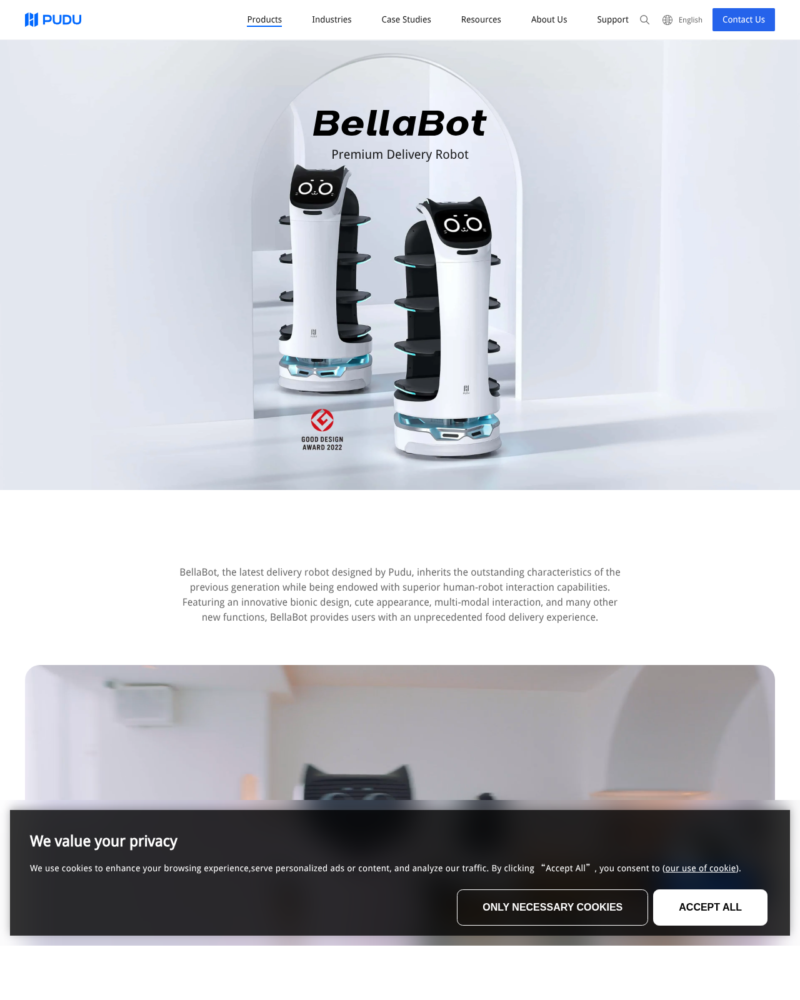
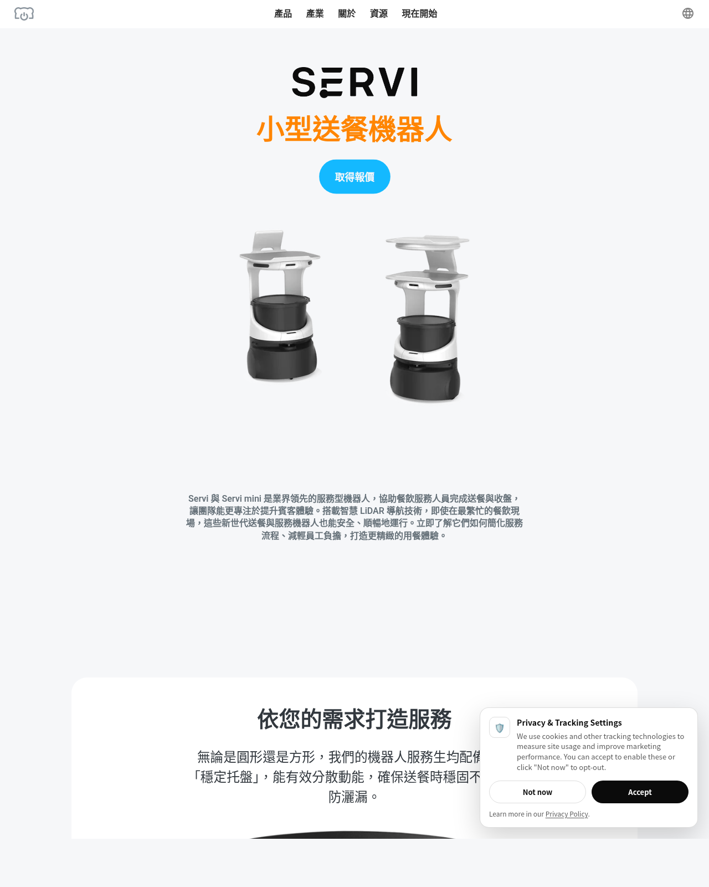
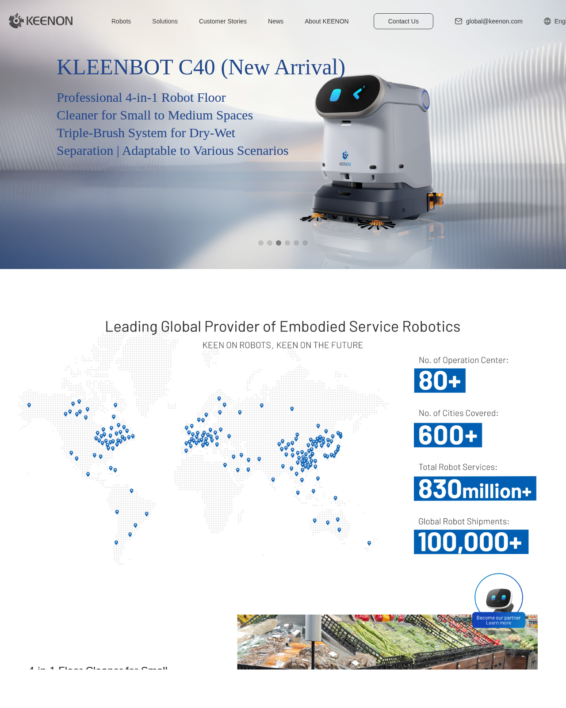

# 感測器:LiDAR、深度相機、IMU

機器人要在餐廳裡不撞人、知道自己在哪,靠的是一組互補的感測器。本篇講 2D LiDAR(建圖定位主力)、深度相機(立體避障)、IMU(姿態融合)各自看到什麼、輸出什麼,以及深度圖為什麼會有「破洞」。

> 章節編號沿用原始《送餐機器人基礎原理補充》,方便與舊文件對照。
> 延伸閱讀:[SLAM 建圖](../30-navigation/slam-mapping.md)、[定位](../30-navigation/localization.md)、[系統架構](../00-overview/system-architecture.md)

---

## 3. 感測器如何運作

### 3.1 2D LiDAR

**原理**:一顆雷射測距儀裝在馬達上連續旋轉。每個角度發一束雷射,量「光飛出去碰到物體反射回來的時間」(ToF) 換算距離。轉一圈(10–15Hz)得到一幀「掃描」(scan):幾百~幾千個 `(角度, 距離)` 點,等於**在安裝高度切一個水平面,描出周圍所有物體的輪廓線**。

三個用途:

| 用途 | 運作方式 |
|---|---|
| SLAM 建圖 | 連續 scan 之間做匹配 (scan matching),邊走邊拼出 2D 平面地圖 |
| 定位 (AMCL) | 拿當下 scan 跟已知地圖比對:「我看到的輪廓跟地圖哪個位置最像?」 |
| 避障 | scan 點直接投進 costmap,當成障礙物 |

**關鍵限制:它只看得到「安裝高度那一個平面」**。

```
側視圖:
                ╔══════════╗ ← 桌面(突出桌腳之外)
                ║          ║
   LiDAR ----●----------→  ║   雷射在 20cm 高度水平掃出
  (裝在20cm高)  │掃描平面    ║
                █桌腳      █桌腳  ← LiDAR 只看得到這兩根
```

LiDAR 裝在底盤(約 15–30cm 高)→ 只掃到桌腳,**看不到比掃描平面高的桌面突沿、椅背、托盤架**。機器人會以為桌腳之間是空的,直接撞上桌沿。這就是深度相機存在的理由。

### 3.2 深度相機

輸出不是一條輪廓線,而是**一張每個像素都帶距離值的影像**(常見原理:結構光投射紅外圖案看變形,或雙目視差,或面陣 ToF)。一幀深度圖可轉成視野內的 **3D 點雲** → 涵蓋從地面到相機視野上緣的整個立體空間,正好補上 LiDAR 掃描平面以外的高度帶:桌沿、椅背、伸出的腳、地上的低矮物。

在 ROS2 裡的處理:點雲 → 濾掉地面與雜訊 → 壓進 Nav2 costmap 的 voxel layer,跟 LiDAR 障礙層疊加。代價是視野窄(水平 ~60–90°,只看前方)、有效距離短(~0.3–4m)、運算量大——所以它**補避障,不負責建圖定位**。

### 3.3 IMU

慣性測量單元 = **陀螺儀(角速度)+ 加速度計(線加速度)**,六軸。底盤上最重要的是陀螺儀的 **yaw(偏航角速度)**:積分得到「車轉了幾度」。

為什麼 encoder 有了還要 IMU——兩者誤差特性互補:

| | 輪式 odometry (encoder) | IMU 陀螺儀 |
|---|---|---|
| 直線距離 | 準 | 不可用(加速度二次積分發散)|
| 旋轉角度 | **打滑就錯**(油污地、地毯、過坎) | 不受打滑影響 |
| 長期 | 誤差累積但可標定 | 零偏漂移,長時間積分會飄 |

融合策略(`robot_localization` EKF):**距離信 encoder、角度信陀螺儀**,長期漂移再由 LiDAR 定位(AMCL)修正。三層互補,缺一層定位品質就明顯下降。

---


## 23. 深度相機輸出什麼:RGB 圖與深度圖(圖解)

### 23.1 直覺接近正確,但要修正一個觀念

「輸出兩張圖,一張 RGB、一張灰階」——**結構對,本質要修正**:RGB-D 相機確實輸出兩路影像,但第二路不是灰階「照片」,而是**深度圖 (depth image)**:每個像素存的不是亮度,是**該點到相機的距離**(通常 16-bit 整數,單位 mm)。看起來像灰階圖,是因為檢視工具把距離「畫成」深淺而已。

```
同一個場景(前方有一張桌子):

 RGB 圖(像素 = 顏色):              深度圖(像素 = 距離 mm):
┌────────────────┐                ┌────────────────┐
│  棕色  棕色  白牆 │                │ 1200 1210 3500 │ ← 桌面近、牆遠
│  棕色  棕色  白牆 │                │ 1230 1245 3500 │
│  灰地  灰地  灰地 │                │  800 1500 2900 │ ← 地板由近到遠漸變
└────────────────┘                └────────────────┘
 人眼看內容                          視覺化成灰階:近 = 亮、遠 = 暗
                                    (或彩虹色:近紅遠藍)
┌────────────────┐                ┌────────────────┐
│ ▒▒▒ ▒▒▒ ░░░    │                │ ███ ███ ░░░    │
│ ▒▒▒ ▒▒▒ ░░░    │                │ ███ ██▓ ░░░    │
│ ▓▓▓ ▓▓▓ ▓▓▓    │                │ ███ ▓▓▓ ▒▒▒    │
└────────────────┘                └────────────────┘
```

關鍵差異一句話:**灰階照片量的是「反射多少光」,深度圖量的是「離我多遠」**——前者是外觀,後者是幾何。

### 23.2 內部其實不只兩路:以結構光/主動雙目為例

```
相機模組正面:
 ┌──────────────────────────────────┐
 │  [IR 投射器]  [IR 相機L] [IR 相機R]  [RGB 相機] │
 └──────────────────────────────────┘
      │             │        │           │
      │ 打出紅外     └────┬───┘           └──► ① RGB 影像(給人看/AI 辨識)
      │ 點陣圖案          │
      │             比對左右視差(或圖案變形)
      │                  │
      └──────────────────┴──► 深度運算 ASIC ──► ② 深度圖(給避障)
                                              (③ 有些型號也輸出原始 IR 圖)
```

所以 ROS2 driver 起來後通常看到多個 topic:

```
/camera/color/image_raw            ① RGB
/camera/depth/image_rect_raw       ② 深度圖(16UC1,單位 mm)
/camera/depth/color/points         ④ 點雲(由②+內參計算而來)
/camera/aligned_depth_to_color/…   ⑤ 對齊到 RGB 視角的深度圖
```

### 23.3 兩個實用衍生觀念

**(1) 深度圖 → 點雲**:知道相機內參(焦距、光心)後,每個像素 `(u, v, depth)` 可反投影成 3D 座標 `(X, Y, Z)`——§3.2 說壓進 costmap 的點雲就是這樣來的。深度圖是「壓縮的 3D」,點雲是攤開後的形式。

**(2) 對齊 (alignment/registration)**:RGB 鏡頭和深度鏡頭物理位置不同、視角略異,**同一個像素座標在兩張圖裡不是同一個點**。要做「這個像素是什麼顏色+多遠」(如行人偵測框出人再取距離)就需要對齊後的影像(上面的⑤)。純避障只用深度圖,不需要對齊。

### 23.4 無效值:深度圖特有的「破洞」

深度圖上會有量不到的像素(值 = 0),成因:玻璃/鏡面(IR 穿透或鏡射)、黑色吸光物、超出量程、左右相機只有一邊看到的遮擋邊緣:

```
深度圖實際長相(有破洞):     避障處理原則:
┌────────────────┐         0 ≠ 「沒障礙物」!
│ ███ ▓▓▓ 000 ░░ │         0 = 「不知道」→ 寧可當未知處理,
│ ███ 000 ▒▒▒ ░░ │              也不可當 free 直接衝
└────────────────┘         (玻璃門就是經典事故場景,§2.4 超音波補盲)
```

---


## 24. 採用深度相機的送餐機器人產品案例

> 截圖存於 `img/`(2026-06 擷取自官網/代理商頁面);規格以原廠最新公告為準。

| 產品 | 深度感知配置(公開資訊) | 印證的架構觀念 |
|---|---|---|
| **Pudu BellaBot**(普渡,貓型機) | **3 顆 RGBD 深度相機** + LiDAR;支援 Laser SLAM 與 Visual SLAM 雙方案 | 多顆深度相機補視野窄的限制(§23);LiDAR+深度互補(§3.2) |
| **Keenon DINERBOT T10**(擎朗) | **4 顆立體視覺相機(270° 3D 偵測)+ 2 顆 LiDAR(360° 2D)** | 感測冗餘與覆蓋角設計;雙 LiDAR 消盲區 |
| **Bear Robotics Servi** | 深度相機 + LiDAR 融合(早期型號公開資訊採 Intel RealSense) | 與本文件建議的「LiDAR 定位 + 深度避障」同構(§3) |





三家頭部產品**全部**是「2D LiDAR(定位主力)+ 多顆深度/立體相機(立體避障)」的組合——印證 §2.4/§3 的選型建議不是理論偏好,而是市場收斂後的共同答案。差異只在相機顆數與擺位(前向 vs 環繞),那是視野覆蓋率 vs 成本的取捨。

> 來源:[Pudu BellaBot 官網](https://www.pudurobotics.com/en/products/bellabot)、[Generation Robots BellaBot 規格](https://www.generationrobots.com/en/404257-pudu-bellabot-server-robot.html)、[Keenon DINERBOT T10](https://www.lotsofbots.com/en/keenon-robotics/dinerbot-t10/)、[Automated Warehouse 報導](https://www.automatedwarehouseonline.com/keenon-robotics-introduces-dinerbot-t10/)、[Bear Robotics Servi](https://www.bearrobotics.ai/servi)

---


