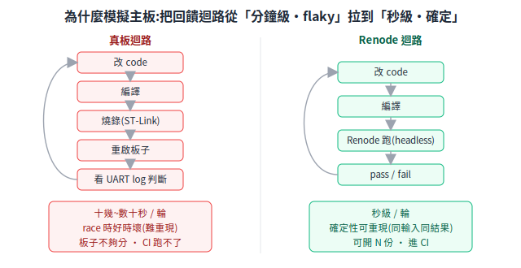
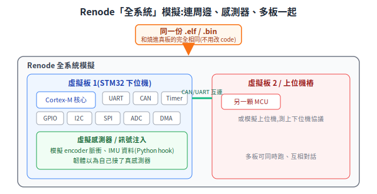

# 主板模擬:用 Renode 在電腦上跑 STM32 韌體

下位機(Low-level,跑 STM32 韌體的那塊板子)的開發有一個結構性麻煩:**韌體跑在硬體上,而硬體又貴、又慢、又不夠分。** 這篇從「為什麼需要在電腦上模擬主板」這個根本問題出發,介紹 Renode 這個全系統模擬器(full-system emulator,連 CPU 帶周邊一起模擬的工具),以及怎麼拿它驗證機器人下位機的運動控制、odometry、上下位機協議與急停邏輯,而不必每次都接實體車。

> 本篇接續 [下位機運動控制](low-level-control.md)。下位機在系統中的位置見 [系統架構](../00-overview/system-architecture.md) §3.1;上下位機協議見 [通訊匯流排](../10-hardware/communication-buses.md)。
> 工具名稱、STM32 型號、Renode 指令都經官方來源查證,文末列來源 URL;不確定處標「待查證」。

---

## R3.1 根本問題:沒有實體板,韌體就動不了嗎?

把下位機韌體開發攤開來看,痛點都指向同一件事——**韌體被綁死在實體硬體上**:

1. **沒板就不能測。** 韌體還沒寫完、板子還沒回來、或板子被別人借走,開發就卡住。一塊客製 PCB(印刷電路板)從設計到打樣回來常以週計,期間韌體只能「寫了但跑不了」。
2. **燒錄迴圈慢。** 改一行 code → 編譯 → 用燒錄器(ST-Link 之類)燒進 Flash → 重啟 → 看 UART log 判斷對不對。一輪十幾秒到數十秒,一天跑幾百輪,時間都耗在等燒錄。
3. **硬體 race / timing bug 難重現。** 下位機最毒的 bug 不是邏輯錯,是時序競爭(race condition,兩件事誰先誰後不固定)——DMA(直接記憶體存取,不經 CPU 搬資料的機制)和 CPU 搶同一塊緩衝、中斷在不該打斷的地方打斷、HAL(硬體抽象層,ST 官方的驅動庫)狀態機卡在 `HAL_BUSY`。這類 bug 在真機上「時好時壞」,因為觸發它要靠奈秒級的巧合,你重現不了就修不了。
4. **CI 跑不了韌體。** 持續整合(CI,Continuous Integration,每次 push 自動跑測試)能擋住軟體 regression(改 A 壞 B),但傳統 CI 是純軟體跑在伺服器上,**沒有實體 STM32 接在 CI 機器上**,於是下位機韌體完全沒進自動測試網——每次改動都要人工接板手測。
5. **板子不夠分。** 一個團隊三五個韌體工程師,實體板可能只有一兩塊;要同時開發、要做多板互連(例如兩塊板透過 CAN 對話)的測試,實體板數量根本不夠。

把這五條收斂成一句:**下位機開發缺一個「快速、確定、可重現、能無限複製」的回饋迴路(feedback loop)。** 實體硬體在這四個維度上全部不及格——慢、不確定(race 時好時壞)、難重現、數量有限。

「在電腦上模擬主板」要解的就是這個。如果能在 PC 上跑**和燒進真板一模一樣的韌體 binary**,而且電腦不會累、可以開一百份、執行還是確定性的(同樣輸入永遠同樣結果),上面五條痛點同時鬆動。Renode 正是為此而生的工具。

<p align="center"></p>

> 對應全域工作原則「Feedback Loop Priority」:面對棘手 bug,第一優先是先建立一個快速、決定性、可自動執行的 pass/fail 訊號。模擬器就是把這個訊號從「分鐘級、flaky」拉到「秒級、確定」的手段。

---

## R3.2 Renode 是什麼:全系統模擬器,不是只模擬 CPU

**Renode** 是 [Antmicro](https://antmicro.com/) 開發、以 **MIT 授權**開源的模擬與虛擬開發框架,專門針對複雜嵌入式系統。它最關鍵的一句定位:

> **能跑「未經修改的韌體 binary」——和你平常燒進真板的 `.elf` / `.bin` 完全相同的檔案——在虛擬的板子(或一整組板子)上執行。**

這裡有兩個容易被低估的重點。

**第一,「未修改的 binary」。** 你不需要為了模擬去改韌體、加 `#ifdef SIMULATION`、或抽換驅動。同一份要燒進量產板的檔案直接餵給 Renode 就能跑。這保證「在模擬器裡測過的」和「燒進真板的」是同一坨東西,測試結果可信。

**第二,「全系統(full-system)」——連周邊一起模擬,不是只模擬 CPU。** 很多人以為模擬器只是跑 CPU 指令,但韌體真正在乎的是周邊:

- **CPU 核心**:ARM Cortex-M 指令集照實執行。
- **周邊(peripherals)**:UART(序列埠)、GPIO(通用輸入輸出腳)、I2C、SPI、CAN、Timer(計時器)、ADC(類比數位轉換器)、DMA 等,Renode 都有模型,韌體去讀寫這些周邊的暫存器時,模擬出來的周邊會做出和真晶片一致的反應。
- **外接感測器 / 致動器**:可以掛上虛擬的感測器模型(IMU、溫度感測器等),讓韌體以為自己真的接了一顆。
- **多顆板子與它們之間的連線**:可以同時模擬多塊板,並把它們的 UART / CAN / 網路接在一起,模擬整組設備互相對話。

換句話說,Renode 模擬的是「**一整顆 SoC(系統單晶片)+ 周邊 + 感測器 + 板間通訊**」,而不是孤零零一顆 CPU。對下位機這種「邏輯不複雜、但和周邊與時序糾纏很深」的韌體,這正是模擬要有價值的關鍵——bug 多半藏在周邊和時序裡,只模擬 CPU 等於沒模擬到痛點。

<p align="center"></p>

Renode 另一個設計重點是**多節點(multi-node)**:它本來就是為了「多塊板組成的網路(有線 + 無線)」設計的,能讓多個模擬裝置共存於一個模擬中,並模擬它們之間的通訊媒介。這對機器人有直接意義——上位機板 ↔ 下位機板、或主控板 ↔ 多個馬達驅動板,都可以一起拉進同一個模擬。

---

## R3.3 跟 QEMU 的差別(一段帶過)

常有人問:不是已經有 QEMU(知名的開源模擬器)了嗎?差別在定位:

- **QEMU 偏向跑完整作業系統**(Linux 等大型系統),它能模擬約束型 ARM MCU,但主力是大系統;對 Cortex-M 系列的周邊支援與嵌入式分析工具相對薄。
- **Renode 專為小型嵌入式 / IoT 而生**,強在四件事:**多節點互連 + 周邊模型完整 + 確定性執行 + 可腳本化的自動測試**。需要精確時序、匯流排通訊、多板協作時,Renode 較合適;若只看功能正確性、時序不重要,QEMU 也行。

下位機韌體在乎的恰好是周邊與時序,所以選 Renode。

---

## R3.4 STM32 支援與基本流程

**支援的 STM32 系列(查證自官方 supported-boards 文件):** Renode 內附 STM32 F0、F4、F7、G0、H7、L0/L1/L5、W1、WBA 等系列的平台描述。文件中明確列出的板子包含 STM32F4 Discovery、STM32F7 Discovery、ST Nucleo-64、以及 STM32F103「Blue Pill」等;近期也加入了 Cortex-M33 的 STM32WBA(BLE 無線 SoC)。周邊覆蓋 UART / SPI / I2C / GPIO / DMA / ADC / Timer / 看門狗等。

> 注意:Renode 是「按需建模」——某顆 MCU 的某個周邊若還沒人寫模型,韌體去碰它時 Renode 會記 log 但不會有真實行為(出現「unhandled access」警告)。**支援某系列 ≠ 該系列每個周邊都已實作。** 要模擬的板,先確認你韌體會用到的周邊都有模型,缺的可自己補(見 R3.6)。

**怎麼描述一塊板:`.repl` 平台描述檔。** Renode 用一種叫 **REPL(REnode Platform Language)** 的宣告式語言描述硬體——記憶體配在哪、有哪些周邊、各掛在哪個位址、IRQ(中斷)怎麼接。官方已附常見 STM32 的 `.repl`(例如 `platforms/cpus/stm32f4.repl`),自己的客製板就以這些為基礎改。

**基本操作流程(monitor 指令,查證自 Memfault Interrupt 教學 + 官方文件):**

Renode 啟動後進入互動式命令列「Monitor」,核心指令如下:

```
mach create                                   # 建立一個虛擬機器
machine LoadPlatformDescription @stm32f4.repl # 載入板子描述 (.repl)
sysbus LoadELF @firmware.elf                  # 把韌體載進記憶體
showAnalyzer sysbus.uart2                     # 開一個視窗顯示某 UART 的輸出
start                                          # 開始執行
```

跑起來之後常用的:`pause`(暫停)、`machine RequestReset`(重置)、`sysbus.cpu LogFunctionNames true`(印出呼叫到哪個函式,做 trace 用)、`logFile @path`(把 log 導到檔案)、`machine StartGdbServer <port>`(開 GDB server,讓你用 GDB 像連真板一樣下中斷點、單步)。

把上面這串指令寫進一個 `.resc`(Renode script)檔,就能一鍵重建整個模擬環境——這也是 CI 與多人共享環境的基礎。

---

## R3.5 確定性與可測試性:回到「快速、確定、可重現的回饋迴路」

這節直接回應 R3.1 的根本問題,也是 Renode 對下位機 race / timing bug 最有價值的地方。

**確定性執行(deterministic execution)。** Renode **嚴格控制虛擬時間(virtual time)**,執行結果不受宿主機器快慢影響——同一份韌體、同一個輸入,跑幾次結果都一樣。它的時間模型是「**量子化(quantum)**」的:時間以一份份「時間配額(quant)」推進,主時間源發一份配額給各節點,等所有節點都跑完這份配額、回報完成,才進入同步階段處理節點間通訊,然後才發下一份配額。因為「跑運算」和「節點間通訊」被切得乾乾淨淨,多核 / 多板之間的先後順序是固定的,**race 不再時好時壞**。

這對下位機的意義很直接:真機上「奈秒級巧合才觸發」的 DMA 搶緩衝、中斷時序競爭,在 Renode 裡因為時間是你控制的,可以**穩定重現**,甚至刻意把某個事件挪到「最壞時點」逼它發生。能穩定重現,就能修;能修完再跑一次驗證它真的不再發生,就有了**確定性的 pass/fail 訊號**。

**能控制時間。** 你可以讓虛擬時間用任意速度推進、可暫停、可在精確的時間點注入事件,不被真實牆鐘時間綁住。

**用 Robot Framework 寫自動化測試。** Renode 內建 [Robot Framework](https://robotframework.org/)(關鍵字驅動的自動測試框架)整合,`renode-test` 指令會起一個 Renode 並接上 Robot Framework。可用的關鍵字(查證自官方 testing 文件)例如:

- `Start Emulation` / `Reset Emulation` — 開始 / 重置模擬
- `Execute Command` — 在 Monitor 執行任意指令
- `Write Line To Uart` / `Send Key To Uart` — 往 UART 送資料(模擬上位機下指令)
- `Wait For Line On Uart` / `Wait For Prompt On Uart` — 等 UART 出現特定輸出,沒等到就 fail
- `Test If Uart Is Idle` — 驗證 UART 沒在亂送
- `Provides` / `Requires` — 建立 / 載入模擬快照(snapshot),讓測試從存好的狀態續跑

**能在 CI 跑。** Antmicro 提供官方 **Renode GitHub Action**(`renode-test-action`),自動裝好 Renode 並執行 Robot Framework 測試。搭配 `RENODE_CI_MODE` 等設定確保一致性。於是 R3.1 第 4 條痛點(CI 跑不了韌體)被解掉——**下位機韌體第一次能進自動測試網**:每次 push,CI 在模擬器上跑一遍急停、協議、控制迴路,壞了當場擋下。

把這節收斂:Renode 把下位機韌體的回饋迴路從「分鐘級、flaky、要人工接板」拉到「秒級、確定、CI 自動跑」。R3.1 列的四個失格維度(慢 / 不確定 / 難重現 / 數量有限)被逐一補上。

---

## R3.6 怎麼模擬感測器 / 外部訊號

韌體要測得有意義,光有 CPU 和周邊還不夠——它得「以為自己接了真感測器」。Renode 給了幾條注入外部訊號的路:

**1. Python hook(掛鉤,事件觸發時跑一段 Python)。** Renode 內嵌 Python,可在事件發生時執行腳本:
- **UART hook**:當 UART 輸出出現某個字元或字串時觸發一段 Python——可用來偵測韌體進到某狀態,或自動回一段資料模擬對方應答。
- **System bus hook**:當某個周邊被讀 / 寫時觸發,可以攔截並回填你要的值(例如韌體讀某個感測器暫存器時,回一個你編好的數值)。

**2. UART analyzer。** `showAnalyzer` 開出來的視窗就是一個虛擬序列埠終端,你能看韌體吐什麼、也能往裡打字——等同手上接了一條 USB 轉 TTL 在看 log、下指令。

**3. GPIO 注入。** 可以從 Monitor 或腳本直接驅動 GPIO 腳的電位,模擬「某個輸入腳被外部拉高 / 拉低」——例如模擬急停按鈕被按下(一個 GPIO 從高變低)。`.repl` 裡也支援把多個中斷 / GPIO 訊號用邏輯 OR 合成一條。

**4. 虛擬感測器模型 / Python 周邊。** Renode 支援用 **Python 寫周邊模型**(可以是一行,也可以是獨立檔案),「只把你真正在乎的部分建模、其他用 log / mock 帶過」。另外有 **RESD**(Renode Sensor Data,把多顆感測器的時間同步資料餵進模擬的機制)可提供同步多感測器資料流。
- 例:模擬 **encoder 脈衝**——寫一個 Python 周邊或用 hook,按設定頻率往 Timer 的輸入捕捉腳送脈衝,讓韌體的 encoder 計數邏輯以為輪子在轉。
- 例:模擬 **IMU 資料**——透過 I2C / SPI hook,在韌體讀 IMU 暫存器時回一串你準備好的姿態資料,測 odometry 或姿態融合。

**`pyrenode3`** 則是用 Python 程式化操控整個 Renode 的函式庫,適合把上面這些注入串成完整的測試自動化。

> 重點不是「把感測器做到 100% 擬真」,而是**只擬真到能驗證你要驗的那條韌體邏輯**。要測 odometry 積分,就給乾淨可控的 encoder 脈衝;要測協議解析,就給精心構造的 UART 輸入(含壞封包)。模擬器的價值在「可控」,不在「逼真」。

---

## R3.7 Arduino / AVR 怎麼辦?(誠實說明)

直接講結論:**Renode 的主場是 ARM Cortex-M 與 RISC-V,不模擬 Arduino Uno 那類 AVR(ATmega)晶片。**

- 查證官方 supported-boards 文件:Renode 支援的架構是 ARM(Cortex-A/R/M)、RISC-V、x86/x86-64、PowerPC、Xtensa——**清單裡沒有 AVR**。文件中唯一出現的「Arduino」是 **Arduino Nano 33 BLE**,而它用的是 **ARM Cortex-M 處理器(nRF52840),不是 AVR**;所以那是「ARM 板剛好掛 Arduino 牌」,不是 Renode 支援了 AVR。
- 也就是說,經典 Arduino(Uno = ATmega328P、Mega = ATmega2560 等 8 位元 AVR)**不在 Renode 的能力範圍內**。

要模擬 AVR / Arduino,業界一般用別的工具:

- **simavr** — Linux / macOS 上精簡的 AVR 模擬器,可連 GDB,能模擬你韌體會用到的周邊,適合離線開發測試。
- **wokwi**(底層 **avr8js**)— 瀏覽器上的線上模擬器,支援 ATtiny85、Arduino Uno(ATmega328P)、Arduino Mega 2560,提供 cycle-accurate(逐時脈精確)的 AVR 核心與 GPIO / Timer / USART / SPI / I2C / ADC 等周邊;wokwi 也能模擬 ESP32 / STM32。

**對機器人下位機的實務取捨**:量產級下位機幾乎都走 STM32(Cortex-M),理由是周邊多、效能足、生態完整——這條路上 Renode 是對的工具。只有當下位機(或某個輔助模組)真的用 Arduino AVR 時,才改用 simavr / wokwi。本筆記後續以 STM32 + Renode 為主線。

> 待查證:Renode 是否有第三方 / 實驗性 AVR 後端。截至查證的官方文件未列入 AVR,先以「不支援」為準;若日後 Antmicro 釋出 AVR 支援再更新本節。

---

## R3.8 跟機器人筆記的關聯:Renode 能驗什麼下位機邏輯

把 Renode 接回前面幾篇的下位機內容,它能在「沒有實體車」的前提下驗證這些:

| 要驗的下位機邏輯 | 在 Renode 怎麼驗 | 對應筆記 |
|---|---|---|
| **運動控制迴路(PID)** | 餵 encoder 脈衝(Python 周邊)當回授,送目標速度,看 PWM / 扭矩命令收斂、不震盪、不 windup | [low-level-control.md](low-level-control.md) §4.1、§7 |
| **odometry 積分** | 給已知的左右輪脈衝序列,跑完後讀韌體算出的 (x, y, θ),和手算的解析值比對,驗積分公式與中點法實作對不對 | [localization.md](../30-navigation/localization.md) §27 |
| **上下位機 UART 協議** | 用 `Write Line To Uart` 送速度指令 (v, ω) 與壞封包,`Wait For Line On Uart` 驗回報 odometry 的格式、CRC、壞封包有沒有被擋 | [communication-buses.md](../10-hardware/communication-buses.md) §6 |
| **急停邏輯** | GPIO 注入模擬急停腳被拉低,驗韌體在限定時間內把輸出歸零;再驗「上位機失聯 → 自主停車」的看門狗逾時路徑 | [power-and-safety.md](../10-hardware/power-and-safety.md) §25 |
| **HAL race / timing bug** | 用確定性時間穩定重現 DMA / 中斷競爭,修完再跑同一腳本驗證不再發生 | 見 R3.5 |

這些全部寫成 Robot Framework 測試掛進 CI,每次改韌體自動跑一遍。**急停與協議這類「錯了會出安全事故」的邏輯,從靠人工接板抽測,變成每次 push 都被自動把關**——這是模擬對機器人專案最實在的回報。

> 邊界:Renode 不替代真機驗證。它擅長的是**確定性的功能與時序邏輯**;類比電氣特性(實際電流、馬達真實扭力、感測器真實噪聲、EMC)還是得上實體台架量。把 Renode 定位成「**把九成的邏輯 bug 在上真車前擋掉**」,而不是「不用真車了」。對應 [系統架構](../00-overview/system-architecture.md) §4 研發路線:模擬補在 M1 韌體開發迴圈裡,真機驗證仍是驗收門檻。

---

## 名詞說明

- **下位機(Low-level)** — 跑 STM32 韌體的板子,負責馬達閉迴路、odometry、急停等硬即時功能。
- **全系統模擬(full-system emulation)** — 不只模擬 CPU 指令,連周邊、感測器、板間連線一起模擬,能跑未修改的韌體 binary。
- **`.repl`(REnode Platform Language)** — Renode 描述一塊板硬體組成(記憶體、周邊、位址、IRQ)的宣告式檔案。
- **`.resc`(Renode script)** — 一串 Monitor 指令的腳本,一鍵重建模擬環境。
- **確定性執行(deterministic)** — 同樣輸入永遠得到同樣結果,不受宿主機快慢影響;靠量子化虛擬時間達成。
- **race condition(時序競爭)** — 兩件事誰先誰後不固定,導致行為時好時壞的 bug。
- **HAL(Hardware Abstraction Layer)** — ST 官方的硬體抽象驅動庫。
- **Robot Framework** — 關鍵字驅動的自動測試框架,Renode 內建整合可寫韌體測試。
- **AVR / ATmega** — Arduino Uno / Mega 用的 8 位元微控制器架構;Renode 不支援,用 simavr / wokwi。

---

## 來源(查證 URL)

- Renode 官方網站:<https://renode.io/>
- Renode 原始碼(GitHub):<https://github.com/renode/renode>
- Renode 官方文件 — Supported boards:<https://renode.readthedocs.io/en/latest/introduction/supported-boards.html>
- Renode 官方文件 — Testing with Renode(Robot Framework):<https://renode.readthedocs.io/en/latest/introduction/testing.html>
- Renode 官方文件 — Time framework(確定性 / 量子化虛擬時間):<https://renode.readthedocs.io/en/latest/advanced/time_framework.html>
- Renode 官方文件 — Using Python in Renode:<https://renode.readthedocs.io/en/latest/basic/using-python.html>
- Renode 官方文件 — Peripheral modeling guide:<https://renode.readthedocs.io/en/latest/advanced/writing-peripherals.html>
- Renode 官方文件 — UART integration:<https://renode.readthedocs.io/en/latest/host-integration/uart.html>
- Renode 平台描述範例 `stm32f4.repl`:<https://github.com/renode/renode/blob/master/platforms/cpus/stm32f4.repl>
- Antmicro 部落格 — Initial support for STM32WBA:<https://antmicro.com/blog/2023/07/initial-support-for-stm32wba-in-renode>
- Antmicro 部落格 — Fully deterministic Linux + Zephyr/micro-ROS testing:<https://antmicro.com/blog/2022/07/fully-deterministic-linux-zephyr-micro-ros-testing-in-renode>
- Renode news — Synchronized multi-sensor data with RESD:<https://renode.io/news/synchronized-multi-sensor-data-in-renode-with-resd/>
- Renode news — GitHub Action for automated testing:<https://renode.io/news/renode-github-action-for-automated-testing-in-simulation/>
- Memfault Interrupt — Cortex-M MCU Emulation with Renode(monitor 指令教學):<https://interrupt.memfault.com/blog/intro-to-renode>
- Memfault Interrupt — Firmware Testing with Renode and GitHub Actions:<https://interrupt.memfault.com/blog/test-automation-renode>
- simavr(AVR 模擬器):<https://github.com/buserror/simavr>
- wokwi / avr8js(Arduino AVR 模擬器):<https://github.com/wokwi/avr8js>
