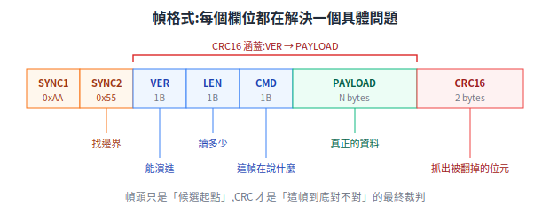
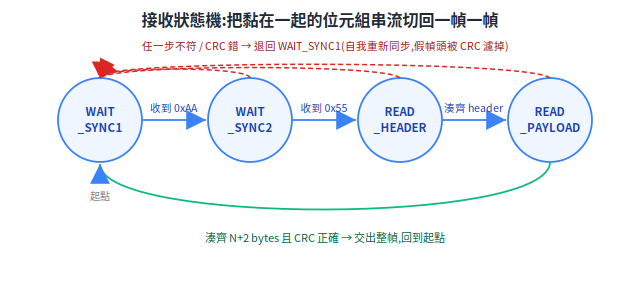
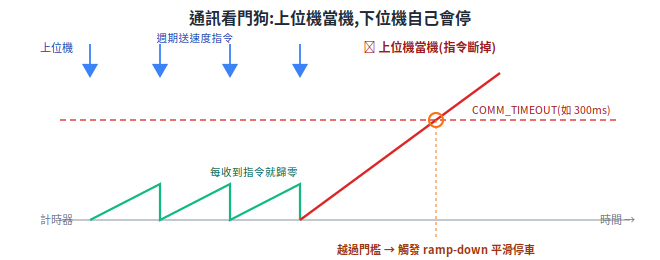
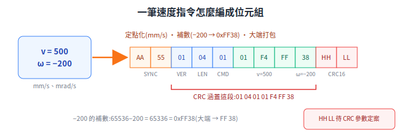

# 上下位機通訊協議:從第一性原理長出一個二進位協議

上位機(ROS2)和下位機(STM32)要對話,中間隔著一條 UART 線或 CAN 匯流排。問題是:這條線只會傳「一個一個位元組」,它不知道哪裡是一句話的開頭、哪裡是結尾,線上有雜訊會把位元翻掉,而且上位機隨時可能當機。這篇從這三個根本痛點出發,一步一步逼出一個完整的二進位協議(framing + CRC + 心跳 + 序號),並給出可以照著實作的幀格式、接收狀態機與一筆真實的位元組範例。

這份文件是**韌體團隊和軟體團隊的契約**:[下位機運動控制](low-level-control.md) §4.2 列了「協議設計」與「通訊逾時停車」當作必懂技能、[系統架構](../00-overview/system-architecture.md) §3.2 給了協議的選型表(UART vs CAN、自定義 vs micro-ROS),這篇把那兩處引用的「協議」本體寫清楚。

> 前置:看得懂十六進位、知道 UART 大致是「一條線一個一個位元組傳」即可。
> 延伸閱讀:[下位機運動控制](low-level-control.md)(逾時停車、odometry 上報的來源)、[通訊匯流排](../10-hardware/communication-buses.md)(UART / CAN 的物理層特性)、[系統架構](../00-overview/system-architecture.md) §3.2(micro-ROS vs 自定義協議的選型)。

---

## 第一部:三個根本痛點,逼出三個機制

先不要看任何現成協議。我們手上只有一條能傳位元組的線,想讓兩台電腦可靠地交換「速度指令」和「odometry」。把這條線的本質缺陷一個一個攤開,需要的機制就自己冒出來了。

### 1.1 痛點 A:串流沒有「訊息邊界」

UART(Universal Asynchronous Receiver/Transmitter,通用非同步收發器)和 CAN 在應用層看到的,都是一串**位元組串流(byte stream)**:`...3A 01 F4 00 9C 02 BB...`。線路本身不會告訴你「這 5 個位元組是一筆指令、下 3 個是另一筆」。

這就像有人把一整本書的字母全部連在一起念給你聽,中間不停頓。你聽得到每個字母,卻不知道單字和句子在哪裡斷。

**所以需要 framing(分幀)**:在位元組流裡放入「可辨識的邊界標記」,讓接收端能切出一筆一筆完整的訊息(frame,幀)。最直接的做法是放一個固定的**幀頭(header / sync bytes,同步位元組)**,接收端不斷找這個特徵,找到就認定「一筆訊息從這裡開始」。

### 1.2 痛點 B:線路有雜訊,位元會被翻掉

實體線路會受電磁干擾、接地不良、接頭氧化影響,傳出去的 `0` 可能被收成 `1`。對一筆速度指令來說,`v = 0x0064`(100mm/s)被翻一個位元變成 `0x0164`(356mm/s),車就暴衝了。**收到的位元組不一定等於送出的位元組。**

**所以需要完整性檢查(integrity check)**:在每幀尾巴附一個「根據前面所有內容算出來的校驗碼」。接收端用同樣方法重算一次,對不上就丟棄這幀。這個校驗碼用 **CRC(Cyclic Redundancy Check,循環冗餘校驗)**,理由在第三部詳述。

### 1.3 痛點 C:上位機會當機,但車還在動

上位機是 Linux + ROS2,跑著 SLAM、Nav2、一堆 Python/C++ node——它**會當、會卡、會 segfault、線會被踩掉**。出事的那一刻,下位機可能正以 1 m/s 載著一鍋熱湯往前衝。如果下位機傻傻地「維持上一個收到的速度指令」,車就會一路衝到撞牆或撞人。

**所以需要失效安全(fail-safe)機制**:下位機必須有能力察覺「上位機已經不再說話了」,並在沒有新指令時主動進入安全狀態(減速停車)。實作上靠**逾時(timeout)**——超過 N 毫秒沒收到有效指令就停車;再配一個**心跳(heartbeat)**——上位機即使沒有新速度要下,也定期送一個「我還活著」的訊息,讓逾時計時器不要誤觸發。細節在第六部。

### 1.4 三個痛點 → 協議骨架

把三個機制疊起來,一個最小可用協議的骨架就出現了:

| 痛點 | 機制 | 在協議裡長成什麼 |
|---|---|---|
| A 沒有訊息邊界 | framing(分幀) | 幀頭 + 長度欄位 |
| B 雜訊翻位元 | 完整性檢查 | 幀尾的 CRC16 |
| C 上位機會當 | 失效安全 | 心跳訊息 + 下位機逾時停車 |

剩下的(命令碼、序號、版本欄位)都是在這個骨架上,為了「能表達多種訊息」「能偵測丟幀」「能演進」而加的欄位。下面逐一展開。

---

## 第二部:幀格式 — 每個欄位都在解決一個具體問題

一個經典、夠用的二進位幀長這樣(這也是 [low-level-control](low-level-control.md) §4.2 表格裡寫的「幀頭 + 長度 + 命令 + payload + CRC16」):

<p align="center"></p>

逐欄解釋它為什麼非存在不可:

### 2.1 SYNC(幀頭,2 bytes:`0xAA 0x55`)— 為了「找邊界」

對應痛點 A。接收端在一片位元組海裡,要靠一個固定特徵認出「幀從這開始」。

- **為什麼是兩個位元組,不是一個?** 單一位元組當幀頭,資料裡剛好出現同一個值的機率是 1/256,太常誤判。兩個位元組連續出現特定組合(`0xAA 0x55`)機率降到 1/65536,誤同步率低很多。
- **為什麼挑 `0xAA 0x55`?** 二進位是 `10101010 01010101`——位元 0/1 交替,在示波器/邏輯分析儀上是一段漂亮的方波,人眼好認;且這種「高頻翻轉」的樣式在真實資料裡相對少見,降低撞車機率。這是業界常見慣例(`0xAA`、`0x55`、`0xFF` 系列),不是唯一解。
- **關鍵認知:幀頭不保證唯一。** payload 裡完全可能剛好出現 `0xAA 0x55`。所以幀頭只是「**候選起點**」,真正確認一幀有效要靠後面的長度合理性 + CRC 通過。這點在第四部的狀態機會再強調。

### 2.2 VER(協議版本,1 byte)— 為了「能演進」

韌體和上位機 driver 是兩個團隊、兩條發布節奏。哪天你想改命令表(加一個欄位、改一個單位),如果沒有版本欄位,新舊兩端對不上時只會默默解析錯,很難查。

放一個版本位元組,接收端第一步就能判斷「對方講的是不是我聽得懂的版本」,不相容就明確拒絕並上報,而不是解析出垃圾。版本協商細節見第五部。

> 取捨:有些設計把版本併進 CMD 命令碼的高位、或乾脆靠「整包協議一次換掉」。獨立 VER 欄位多花 1 byte,換來升級期的明確診斷,對「兩團隊長期維護」的契約場景划算。

### 2.3 LEN(payload 長度,1 byte)— 為了「知道要讀多少」

對應痛點 A 的下半段。找到幀頭後,接收端怎麼知道這幀有多長、payload 在哪結束?如果不講長度,就只能靠「再去找下一個幀頭」來反推結尾——但 payload 裡可能含有假幀頭,會切錯。

**明確放一個長度欄位**,接收端讀到 LEN=N,就知道「接下來精確地再收 N 個 payload 位元組,然後是 2 個 CRC」。讀多少、何時收齊,一翻兩瞪眼。

- 1 byte 的 LEN 上限是 255 bytes payload,對速度指令、odometry 這種小訊息綽綽有餘。要傳大塊資料(韌體 OTA)再擴成 2 bytes(`LEN_H LEN_L`)。
- **設計約定要寫死:LEN 算的是哪一段?** 本契約定義 **LEN = payload 的位元組數**(不含幀頭、VER、LEN、CMD、CRC)。這種「算哪幾段」的約定每個欄位都要在文件裡寫死,否則兩端各算各的,CRC 永遠對不上。

### 2.4 CMD(命令碼,1 byte)— 為了「這幀在說什麼」

一條線上要傳很多種訊息:速度指令、odometry 回報、心跳、急停、狀態查詢……接收端拿到 payload 那堆位元組,要先知道「這是哪一種」才知道怎麼解析。CMD 就是這個「訊息類型標籤」。例如 `0x01`=速度指令、`0x81`=odometry 回報。完整命令表在第五部。

### 2.5 PAYLOAD(N bytes)— 真正的資料

該訊息的實際內容。它的長度由 LEN 給定,它的格式由 CMD 決定(CMD=速度指令 → payload 是 `v`+`ω`;CMD=odometry → payload 是 `x`+`y`+`θ`...)。payload 內部多位元組數值的位元組順序(大端/小端)也是契約的一部分,見第九部。

### 2.6 CRC16(2 bytes)— 為了「抓出被翻掉的位元」

對應痛點 B。放在**整幀最後**,是「**根據它前面的內容**算出來的指紋」。接收端把同一段重算一次,比對不符就丟棄。

- **CRC 涵蓋哪些欄位?** 本契約定義 **CRC 涵蓋 VER + LEN + CMD + PAYLOAD**(即除了 SYNC 與 CRC 自己以外的全部)。SYNC 不納入是因為它只是定位用的固定值;CRC 自己當然不能算自己。**這個「涵蓋範圍」必須白紙黑字寫死**,因為發送端算 CRC 和接收端驗 CRC 必須蓋同一段位元組,差一個 byte 就全錯。
- 為什麼是 CRC 而不是把所有位元組加起來的簡單 checksum?下一部專門講。

---

## 第三部:CRC16 — 為什麼不用「全部加起來」就好

### 3.1 簡單 checksum 的破綻

最土的完整性檢查是「把所有位元組加起來,取低 8 位」當校驗碼。它能抓單一位元組翻掉,但有兩個致命弱點:

1. **抓不到「交換順序」**:`01 02` 和 `02 01` 加起來都是 `03`,校驗碼一樣,但資料完全不同。
2. **抓不到成對抵銷的錯誤**:一個位元組 +1、另一個 −1,總和不變,checksum 過關但資料已錯。

而真實線路的雜訊常常是**突發錯誤(burst error)**——一段連續的位元被同一陣干擾一起翻掉。簡單相加對這種「一整串連帶錯」的偵測能力很弱。

### 3.2 CRC 的想法:把資料當成一個大數去除以一個「魔數」

CRC 把整段資料看成一個很長的二進位多項式(每個位元是一項的係數),去除以一個固定的**生成多項式(generator polynomial)**,取**餘數**當校驗碼。接收端把「資料 + 餘數」一起再除一次,餘數應為 0,否則就是傳輸出錯。

這套「多項式除法」(在 GF(2) 上、用 XOR 取代減法)的數學性質,讓 CRC 對突發錯誤特別強:一個 16 位的 CRC 可以**保證抓出所有長度 ≤16 位元的突發錯誤**,並以極高機率抓出更長的突發錯誤(漏抓率約 2⁻¹⁶)。這正是它壓過簡單 checksum 的根本原因——不是「算得比較複雜所以比較好」,而是它的代數結構天生對應到「線路最常見的錯誤型態」。

> 直覺類比:簡單 checksum 像「數一數有幾個字」,字數對就放行;CRC 像「按特定規則把整段話揉成一個指紋」,改動順序、成對抵銷都會讓指紋變掉。

### 3.3 常見的 CRC16 多項式(選哪個是契約的一部分)

CRC 有很多「版本」,差在生成多項式、初始值、是否反射(reflect)、最後是否 XOR。**兩端必須選同一個版本**,否則永遠對不上。下位機協議常見兩種:

| 名稱 | 多項式 | 常見初始值 | 典型出沒 |
|---|---|---|---|
| **CRC-16/CCITT**(又稱 CRC-CCITT) | `0x1021`(x¹⁶+x¹²+x⁵+1) | `0xFFFF`(CCITT-FALSE)或 `0x0000`(XMODEM) | XMODEM、藍牙、許多自定義二進位協議 |
| **CRC-16/MODBUS** | `0x8005`(x¹⁶+x¹⁵+x²+1)| `0xFFFF` | Modbus RTU、工業設備 |

選擇建議:**新自定義協議常選 CRC-16/CCITT(`0x1021`)**;若你的下位機本來就要跟 Modbus 設備(很多 RS485 馬達驅動器、感測器)共線或共用程式碼,選 **CRC-16/MODBUS(`0x8005`)**可以重用同一份 CRC 程式。

> 待查證(實作時必須釘死,否則 CRC 互不相容):本契約最終採用的多項式、初始值(init)、是否輸入/輸出反射(RefIn/RefOut)、最後 XOR 值(XorOut)這四個參數,要在這份文件確定後逐字寫死,並用第九部的範例位元組做一次「黃金測試向量」雙邊對拍。上面表格給的是常見值,**尚未指定本協議最終採用哪一組**。

---

## 第四部:黏包與拆包 — 為什麼一定要寫一個接收狀態機

### 4.1 串流不是「一幀一幀」乾淨送到的

新手最容易踩的雷:以為「我送一幀,對面就收到一幀」。實際上 UART 是串流,作業系統/DMA 緩衝區會**任意切割**你的資料:

- **黏包(sticky packet)**:你連送兩幀,接收端一次 `read()` 可能把兩幀黏在一起拿到:`[幀1][幀2]`。
- **拆包(split packet)**:你送一幀,接收端可能分兩次拿到:先 `[幀1的前半]`,過一會兒才 `[幀1的後半]`。
- 甚至混合:`[幀1][幀2前半]` … `[幀2後半][幀3前半]` …

所以**不能假設「一次讀到剛好一幀」**。接收端必須把收到的位元組先丟進一個緩衝區,然後用一個**狀態機(state machine)**慢慢「啃」:啃到一個幀頭就開始,湊齊長度就驗 CRC,過了就交出一幀,沒過就丟掉、重新找幀頭。這就是為什麼幀頭、長度、CRC 三者缺一不可——它們正是狀態機賴以切幀的三個錨點。

<p align="center"></p>

### 4.2 接收狀態機(概念碼,非可編譯)

每收到 1 個位元組就餵給這個函式,它內部維護狀態,湊齊一幀且 CRC 通過時回傳一幀:

```c
/* 概念碼:示意狀態流轉,省略邊界檢查與真實型別 */
typedef enum {
    WAIT_SYNC1,   /* 等第一個幀頭位元組 0xAA            */
    WAIT_SYNC2,   /* 等第二個幀頭位元組 0x55            */
    READ_HEADER,  /* 收 VER, LEN, CMD                  */
    READ_PAYLOAD, /* 收 N 個 payload + 2 個 CRC         */
} rx_state_t;

void rx_feed_byte(uint8_t b) {
    static rx_state_t st = WAIT_SYNC1;
    static uint8_t buf[260];   /* 暫存 VER..PAYLOAD,供算 CRC */
    static uint8_t idx;        /* 已收 header/payload 的位元組數 */
    static uint8_t need;       /* READ_PAYLOAD 還要收幾個 byte  */

    switch (st) {
    case WAIT_SYNC1:
        if (b == 0xAA) st = WAIT_SYNC2;     /* 找到候選起點 */
        break;

    case WAIT_SYNC2:
        if (b == 0x55) { st = READ_HEADER; idx = 0; }
        else if (b == 0xAA) st = WAIT_SYNC2; /* 連兩個 AA,留在這續等 55 */
        else st = WAIT_SYNC1;                /* 不是 55 → 重新找幀頭 */
        break;

    case READ_HEADER:                        /* 依序收 VER, LEN, CMD */
        buf[idx++] = b;
        if (idx == 3) {                      /* buf[0]=VER buf[1]=LEN buf[2]=CMD */
            need = buf[1] + 2;               /* payload N + CRC 2 bytes */
            st = READ_PAYLOAD;
        }
        break;

    case READ_PAYLOAD:
        buf[idx++] = b;
        if (--need == 0) {                   /* payload + CRC 都收齊了 */
            uint8_t crc_len = idx - 2;       /* 要算 CRC 的長度:VER..PAYLOAD */
            uint16_t rx_crc  = (buf[idx-2] << 8) | buf[idx-1];  /* 大端讀回 */
            uint16_t my_crc  = crc16(buf, crc_len);
            if (rx_crc == my_crc) {
                dispatch_frame(buf[2], &buf[3], buf[1]); /* CMD, payload, LEN */
            }
            /* CRC 過或不過,都回去找下一個幀頭(不過就等於丟棄這幀) */
            st = WAIT_SYNC1;
        }
        break;
    }
}
```

幾個關鍵設計,每個都對應前面的痛點:

- **CRC 不過 → 整幀丟棄、退回 `WAIT_SYNC1`**:寧可漏一幀,不可放一幀錯的進去執行(對速度指令尤其致命)。漏掉的那幀靠上位機下一次重送補上(速度指令本來就高頻連發)。
- **任一步不符就退回找幀頭**:這讓狀態機有**自我重新同步(re-sync)**能力。一旦線路抖動造成錯位,它會在丟掉幾個位元組後,自動在下一個真正的 `0xAA 0x55` 重新對上,不會一錯到底。
- **假幀頭天然被濾掉**:payload 裡的假 `0xAA 0x55` 就算讓狀態機誤啟動,最後 CRC 幾乎不可能湊巧通過,於是被丟棄、重新同步。**幀頭只負責「猜起點」,CRC 才是「最終裁判」**。

> 實作備註:真實韌體常用 UART + DMA 接收到環形緩衝區(ring buffer),再由通訊任務把位元組逐一餵進這個狀態機,避免高頻收發吃滿 CPU(見 [low-level-control](low-level-control.md) §4.2 的「UART + DMA」)。

---

## 第五部:命令表 — 上行、下行與版本化

CMD 命令碼把一條線分成許多「邏輯通道」。一個常見約定:**高位元 bit7 區分方向**——`0x0x`~`0x7x` 為上行(上位機→下位機),`0x8x`~`0xFx` 為下行(下位機→上位機),一眼能看出誰發的。

### 5.1 上行(上位機 → 下位機)

| CMD | 名稱 | payload(概念) | 頻率 | 說明 |
|---|---|---|---|---|
| `0x01` | 速度指令 | `int16 v`(mm/s)+ `int16 ω`(mrad/s) | 20–50Hz | 核心指令,對應系統架構 §1.2 的 `(v, ω)` |
| `0x02` | 心跳 | `uint32 seq` 或空 | 10–20Hz | 「我還活著」,餵下位機的逾時計時器(第六部) |
| `0x03` | 模式/致能 | `uint8 mode` | 事件觸發 | 切換手動/自動、上電致能、清除錯誤 |
| `0x04` | 軟體急停 | 空 | 事件觸發 | 立即停車(硬體急停另走實體線,不靠協議) |

> 為什麼速度用整數而非浮點?整數(定點數,如「以 mm/s 為單位的 int16」)在 MCU 上解析快、無浮點對齊與位元組序歧義、跨平台一致。約定好單位(mm/s、mrad/s)即可,精度足夠。

### 5.2 下行(下位機 → 上位機)

| CMD | 名稱 | payload(概念) | 頻率 | 說明 |
|---|---|---|---|---|
| `0x81` | odometry 回報 | `int32 x` + `int32 y`(mm)+ `int32 θ`(mrad)+ `int16 v` + `int16 ω` | 50–100Hz | 對應 [low-level-control](low-level-control.md) §4.1 odometry 積分結果 |
| `0x82` | 狀態回報 | `uint8 state` + `uint16 error` + `uint8 battery%` | 10Hz | 行進/待命/異常、錯誤碼、電量 |
| `0x83` | 心跳/存活 | `uint32 seq` | 10Hz | 讓上位機也能偵測「下位機掛了」 |

### 5.3 命令碼怎麼版本化管理

CMD 表會隨產品演進(M1→M5 一路加功能)。靠第二部的 **VER 欄位**做版本控管:

- 接收端收到一幀,先看 VER。**同一大版本內只准「新增 CMD」「在 payload 尾巴加欄位」**(舊端忽略尾巴多的位元組仍可運作,即向後相容)。
- **改既有欄位語意/單位/順序 → 必須升大版本號**,並讓兩端在版本不符時明確拒絕 + 上報,而不是默默解析錯。
- 這份命令表本身就是契約文件,**每次改動要進版本記錄**,韌體 CI 出 binary 時把協議版本與上位機 driver 對齊(呼應 [系統架構](../00-overview/system-architecture.md) §3.5「協議版本與上位機 driver 對齊管理」)。

---

## 第六部:逾時與心跳 — 上位機當機時的保命機制

這一節直接落實痛點 C,也是 [low-level-control](low-level-control.md) §4.2 / §4.3 寫的「通訊逾時計數器:超過 300ms 沒收到速度指令 → 主動減速停車」的協議端設計。

### 6.1 為什麼下位機必須「自己會停」

回到 1.3 的場景:上位機當了,但車在動。**安全責任在物理上更靠近危險的那一層**——下位機直接控制馬達,它必須是那個「最後能踩煞車的人」,不能把命交給可能已經死掉的上位機。系統架構 §1.1 的核心原則就是這條:安全相關功能一律放下位機。

實作是一個**通訊看門狗(communication watchdog)**:

```c
/* 概念碼 */
volatile uint32_t last_cmd_ms;   /* 上次收到「有效上行幀」的時間戳 */

void on_valid_uplink_frame(void) {   /* 收到速度指令或心跳且 CRC 通過時呼叫 */
    last_cmd_ms = now_ms();
}

void safety_task_100hz(void) {       /* 安全監控任務,最高優先級 */
    if (now_ms() - last_cmd_ms > COMM_TIMEOUT_MS) {  /* 例如 300ms */
        ramp_down_to_stop();         /* 平滑減速停車,不是硬煞(避免打翻餐點) */
        set_error(ERR_COMM_TIMEOUT);
    }
}
```

關鍵點:

- **逾時要平滑減速(ramp down),不是急停硬煞**——送餐機硬煞會打翻熱湯,加速度壓在 0.3–0.5 m/s²(系統架構 §3.1)。真正的危險(撞到人)由硬體急停與防撞條負責立即斷電。
- **逾時門檻怎麼定?** 要大於「正常指令週期 + 合理抖動」。上位機 20–50Hz 下發速度指令(週期 20–50ms),設 300ms 約等於「連續漏掉 6~15 個週期」才觸發,避免偶發掉一兩幀就誤停;但又遠小於「車能衝出危險距離」的時間。

<p align="center"></p>

### 6.2 心跳:讓「沒話要說」也能證明「我還活著」

逾時機制有個漏洞:如果車正停著等取餐,上位機**本來就沒有新速度指令要下**(目標速度 = 0),那它什麼都不送,逾時計時器一樣會漲到觸發——但這其實是誤判,上位機好好的。

**心跳(heartbeat)**補這個洞:上位機即使無事可做,也固定每 50–100ms 送一個心跳幀(CMD `0x02`),內容可以只是一個遞增序號。下位機把「收到任何有效上行幀(含心跳)」都當作餵狗。於是:

- 上位機活著但閒著 → 心跳持續 → 不誤停。
- 上位機真的當了 → 連心跳都停 → 逾時觸發 → 安全停車。

心跳設計三要點:**頻率**要明顯高於逾時門檻(如 10–20Hz 心跳對 300ms 門檻,容得下漏幾個);**雙向**最好都做(下位機也送心跳 `0x83`,讓上位機能偵測下位機掛掉並上報維運);**輕量**,payload 越小越好,別佔頻寬。

---

## 第七部:序號與重送 — 要做到多可靠,是個取捨

### 7.1 序號(sequence number)解決什麼

在每幀(或每類訊息)放一個**遞增序號**,接收端對比序號就能看出兩件事:

- **丟幀偵測**:收到的序號從 `7` 直接跳到 `9`,中間的 `8` 丟了。
- **去重**:萬一同一幀被重複收到(重送機制下會發生),序號相同就知道是舊的,丟棄不重複執行。

對速度指令這種高頻連發的訊息,丟一兩幀其實無所謂(下一幀馬上覆蓋),序號的價值主要在**監控鏈路健康度**(統計丟幀率)與**配合重送**。

### 7.2 要不要做「可靠傳輸」(ACK + 重送)?

可靠傳輸 = 接收端對每幀回 ACK(確認),發送端沒收到 ACK 就重送。聽起來很安全,但它和「即時性」是衝突的,要看訊息性質權衡:

| 訊息類型 | 該不該重送 | 理由 |
|---|---|---|
| 速度指令(高頻連發) | **不要** | 下一幀 20ms 後就到,重送一筆「過期的速度」反而有害;丟了就丟了 |
| odometry 回報(高頻連發) | **不要** | 同理,要的是「最新一筆」,不是「每一筆都到」 |
| 模式切換 / 軟體急停 / 參數設定(關鍵、低頻) | **要** | 漏掉一筆「切到自動模式」會卡住流程;這類要 ACK + 逾時重送 |

核心取捨:**即時(real-time)vs 可靠(reliable)不可兼得**。高頻狀態流(速度、odometry)選即時——用「不斷重發最新值」自帶冗餘,丟幀無感;低頻關鍵指令選可靠——用 ACK + 重送 + 序號去重保證送達且不重複執行。

### 7.3 UART 與 CAN 在這點上的差別

要不要自己做這些,也取決於物理層幫你做了多少(詳見 [通訊匯流排](../10-hardware/communication-buses.md)):

- **UART**:純串流,**framing、CRC、序號、重送全部要自己在應用層做**(就是這篇講的全部)。
- **CAN**:控制器硬體層已內建幀邊界、CRC、自動重送與優先級仲裁。所以走 CAN 時,第二部的幀頭/CRC、第七部的重送很多可以**交給 CAN 控制器**,應用層協議能大幅簡化——你主要還要自己定義的是 CAN ID 分配(等同 CMD + 方向)與 payload 格式(CAN 一幀資料上限 8 bytes,大訊息要自己分段)。

> 一句話:**這篇的「自己造輪子」清單,大半是因為 UART 太原始;換到 CAN,輪子有一部分是現成的。** 選 UART 還是 CAN 見系統架構 §3.2。

---

## 第八部:micro-ROS vs 自定義協議(簡述,選型在架構篇)

到這裡你已經看到「自定義二進位協議」要自己扛多少事(framing、CRC、狀態機、心跳、序號、版本)。另一條路是 **micro-ROS**——把 ROS2 的通訊中介(DDS/XRCE)塞進 MCU,讓下位機直接吐 ROS2 topic,上面這些雜事大多由它代勞,省掉自己寫 bridge。

代價是記憶體占用大、版本綁定、除錯偏黑盒。兩者完整比較表(優缺點、何時選哪個)在 [系統架構](../00-overview/system-architecture.md) §3.2,這裡不重複。一句話總結該篇結論:**初期建議自定義協議**(簡單、可控、除錯直觀、資源占用小),並把這份協議文件當正式交付物管理;團隊 ROS2 經驗深、想省 bridge 工才上 micro-ROS。

---

## 第九部:一筆速度指令的完整位元組範例

把前面所有欄位串起來,實際編碼一筆「**v = 500 mm/s,ω = −200 mrad/s**」的速度指令(CMD `0x01`)。

### 9.1 先約定位元組序(這也是契約)

多位元組數值要約定**位元組順序(byte order / endianness)**。本範例採用**大端序(big-endian,高位元組在前)**,這也是網路協議的慣例,人讀十六進位時順序直覺。**大端/小端必須兩端一致**,選哪個都行,但要在文件寫死。

- `v = 500 = 0x01F4` → 大端 `01 F4`
- `ω = −200`:`int16` 的 −200,補數(two's complement)= `65536 − 200 = 65336 = 0xFF38` → 大端 `FF 38`

所以 payload = `01 F4 FF 38`,LEN = 4。

### 9.2 組出待算 CRC 的位元組

CRC 涵蓋 **VER + LEN + CMD + PAYLOAD**(第二部約定):

```
VER  LEN  CMD   v(big-endian)  ω(big-endian)
01   04   01    01 F4          FF 38
```

即 6 個位元組:`01 04 01 01 F4 FF 38`?——不,數一下:`01`(VER)`04`(LEN)`01`(CMD)`01 F4`(v)`FF 38`(ω)= **7 個位元組**:`01 04 01 01 F4 FF 38`。對這 7 個位元組算 CRC16。

### 9.3 算 CRC(標出「待查證」)

- CRC16 的結果**取決於採用哪一組參數**(多項式、init、RefIn/RefOut、XorOut)。第三部已標明:**本協議最終採用哪一組 CRC 參數尚未拍板,屬待查證**。
- 因此這裡的 CRC 值先以符號表示:設算出來是 `CRC = 0xHHLL`(高位元組 `0xHH`、低位元組 `0xLL`),大端放幀尾 → `HH LL`。
- **實作落地時的標準動作**:參數一旦在第三部釘死,就用這筆 `01 04 01 01 F4 FF 38` 當**黃金測試向量**,在上位機(Python/C)與下位機(STM32)各算一次,確認兩邊算出同一個 `0xHHLL`,CRC 程式才算對齊。CRC 寫錯是這類協議最隱蔽、最常見的 bug,一定要對拍。

### 9.4 完整幀(byte 序列)

```
┌─────┬─────┬─────┬─────┬─────┬─────┬─────┬─────┬─────┬─────┐
│ AA  │ 55  │ 01  │ 04  │ 01  │ 01  │ F4  │ FF  │ 38  │HH LL│
└─────┴─────┴─────┴─────┴─────┴─────┴─────┴─────┴─────┴─────┘
 SYNC1 SYNC2 VER   LEN   CMD   v_H   v_L   ω_H   ω_L   CRC16
       └────────── CRC 涵蓋這段 (VER..PAYLOAD) ─────────┘
```

整幀共 11 bytes:`AA 55 01 04 01 01 F4 FF 38 HH LL`(`HH LL` 待 CRC 參數定案後填入)。

<p align="center"></p>

接收端收到這 11 bytes(可能還黏著別幀),由第四部狀態機:認出 `AA 55` → 收 `01 04 01` 知道 payload 4 bytes → 再收 `01 F4 FF 38 HH LL` → 對 `01 04 01 01 F4 FF 38` 算 CRC 比對 `HH LL` → 通過則解出 `v=500mm/s, ω=−200mrad/s` 交給運動控制任務(進 [low-level-control](low-level-control.md) §7.1 的運動學逆解 → PID)。

---

## 一頁收束:這個協議的每個欄位都在還某個債

| 機制 / 欄位 | 在還哪個根本問題的債 |
|---|---|
| SYNC 幀頭 | 串流沒有訊息邊界 → 給「猜起點」的特徵 |
| LEN 長度 | 找到起點後不知讀多少 → 明確界定一幀範圍 |
| 接收狀態機 | 黏包/拆包 → 逐位元組啃、自我重新同步 |
| CRC16 | 線路雜訊翻位元 → 抓突發錯誤、當最終裁判 |
| VER 版本 | 兩團隊各自演進 → 不相容時明確拒絕而非默默錯 |
| CMD 命令碼 | 一條線多種訊息 → 標明「這幀在說什麼」 |
| 逾時 + 心跳 | 上位機會當機 → 下位機自己會停(失效安全) |
| 序號 + 重送 | 丟幀/重複 + 即時與可靠的取捨 → 按訊息性質分流 |

**一句話**:UART 給你的是一條最原始的「位元組水管」,這份協議就是在水管兩端各裝一套「裝瓶、貼標、封口、驗封、過期自動關閥」的設備,把不可靠的位元組流,變成韌體與軟體兩個團隊都能信任的契約。

---

## 來源 / 延伸

- framing、CRC、黏包/拆包、心跳逾時為嵌入式通訊通識,屬工程實務共識。
- CRC 演算法與常見多項式(CRC-16/CCITT `0x1021`、CRC-16/MODBUS `0x8005`)為標準定義;**本協議最終採用的 CRC 參數組與位元組序需在落地時釘死並做黃金向量對拍**(見第三部、第九部待查證標註)。
- 上下游接續:[下位機運動控制](low-level-control.md)(逾時停車、odometry、運動學)、[通訊匯流排](../10-hardware/communication-buses.md)(UART/CAN 物理層)、[系統架構](../00-overview/system-architecture.md) §3.2(選型:UART vs CAN、自定義 vs micro-ROS)。
