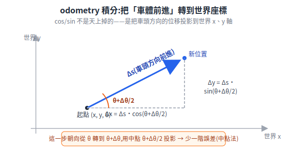

# 下位機運動控制(STM32)

下位機(STM32)是機器人的「脊髓」:把上位機下發的速度指令 (v, ω) 變成左右輪轉速、跑閉迴路、回報 odometry,並在上位機當機時自己讓車安全停下。本篇整理 M1 階段該掌握的知識清單,以及運動學解算與 PID 是什麼關係(常被混為一談的兩件事)。

> 章節編號沿用原始《送餐機器人基礎原理補充》,方便與舊文件對照。
> 下位機在系統中的位置與韌體任務分層,見 [系統架構](../00-overview/system-architecture.md) §3.1。
> 延伸閱讀:[編碼器](../10-hardware/encoders.md)、[通訊匯流排](../10-hardware/communication-buses.md)、[電源與安全](../10-hardware/power-and-safety.md)

---

## 4. M1 底盤控制該懂哪些

> M1 目標:下位機完成馬達閉迴路 + odometry + 安全保護,上位機可遙控。以下是知識清單,依「不懂就做不出來」的程度排序。

### 4.1 必懂理論(不多,就這些)

1. **差速運動學正逆解**(§1.1 的兩組公式)——下位機核心邏輯就是逆解,odometry 就是正解的積分。
2. **PID 速度閉迴路**:誤差 = 目標轉速 − encoder 實測轉速 → PID 輸出扭矩/PWM 命令。要懂:P 太大震盪、I 消穩態誤差但會 windup(需限幅)、底盤速度環通常 PI 就夠(D 對噪聲敏感)。
3. **Odometry 積分**(航位推算):

   ```
   Δs = (ΔsR + ΔsL)/2          Δθ = (ΔsR − ΔsL)/b
   x += Δs·cos(θ + Δθ/2)
   y += Δs·sin(θ + Δθ/2)
   θ += Δθ
   ```

   **這幾條也不用背,是推出來的。** 第一性原理:第 1 行 `Δs`、`Δθ` 就是 §1.1 的差速正解(把輪速換成這一步的弧長);第 2、3 行則是把「車**朝著車頭方向**前進了 Δs」這件事,投影到世界座標的 x、y 軸——一個朝向 θ 的向量,水平分量是 `Δs·cosθ`、垂直分量是 `Δs·sinθ`,cos/sin 就是這麼來的,不是公式背下來的。

<p align="center"></p>

   唯一的細節是投影該用哪個朝向:這一步車頭從 θ 轉到 θ+Δθ,**用中點 θ+Δθ/2** 投影比用起點 θ 準——這是數值積分的中點法,用泰勒展開看,中點抵消掉了一階誤差項(直行 Δθ=0 時兩者相同)。

   符號定義(每個控制週期計算一次,如 100Hz → 每 10ms):

   | 符號 | 意義 | 單位 | 來源 |
   |---|---|---|---|
   | ΔsL、ΔsR | 這個週期內,左/右輪**在地面滾過的弧長** | m | encoder 增量 counts × 每 count 對應弧長(= 2πr / CPR,r = 輪半徑) |
   | Δs | 這個週期車體中心前進的距離(左右輪平均) | m | 計算值 |
   | Δθ | 這個週期車體朝向的變化量(逆時針為正) | rad | 計算值;直行時 ΔsR=ΔsL → Δθ=0 |
   | b | 輪距:左右兩驅動輪與地面接觸點的中心距 | m | 量測+標定(§1.1 的同一個 b) |
   | x, y | 車體在**世界座標系**的位置(從開機點累積) | m | 積分累積值 |
   | θ | 車體在世界座標系的朝向角(開機時 = 0) | rad | 積分累積值 |
   | θ + Δθ/2 | 用「這段位移的**中點朝向**」投影,比直接用 θ 少一階誤差 | rad | 數值積分技巧(中點法) |

   以及它的標定:輪徑誤差 → 走 5m 量實際距離修正;輪距誤差 → 原地轉 10 圈量實際角度修正。**這個標定品質直接決定 M2 之後的 SLAM/定位品質。**

### 4.2 必懂 STM32 實作技能

| 技能 | 用在哪 |
|---|---|
| Timer encoder mode | 硬體解 A/B 相正交訊號,注意 counter 溢位處理 |
| 定時中斷 / RTOS 週期任務 | 控制環必須固定週期執行(如 100Hz),抖動會毀掉 PID |
| CAN 通訊 | 對現成 FOC 驅動器下轉速命令、收狀態回報 |
| UART + DMA | 對上位機協議收發,DMA 避免高頻收發吃滿 CPU |
| 協議設計 | 幀頭 + 長度 + 命令 + payload + CRC16;粘包/斷包處理 |
| Watchdog 思維 | 通訊逾時計數器:超過 300ms 沒收到速度指令 → 主動減速停車 |

### 4.3 必做安全機制(M1 驗收項)

1. **硬體急停**:實體開關直接切斷驅動器致能訊號,不經過任何軟體。
2. **通訊逾時停車**:模擬「上位機當機」(拔線)測試,車必須在限定時間內平滑停下。
3. **加減速 ramp**:速度指令變化率限幅(送餐機 ≤0.3–0.5 m/s²),急停除外。
4. **過流/堵轉保護**:輪子被卡住時驅動器電流飆高 → 限流 + 上報異常。

### 4.4 M1 驗收測試方法

| 測試 | 方法 | 合格參考 |
|---|---|---|
| 直線精度 | 命令直行 5m,量終點橫向偏移 | <5cm(標定後) |
| 旋轉精度 | 原地轉 360°×10 圈,量累積角度誤差 | <10°/10 圈 |
| 速度追蹤 | 階躍速度命令,錄 encoder 實測曲線 | 無持續震盪、穩態誤差 <5% |
| 逾時保護 | 行進中拔掉上位機通訊線 | 300ms 內開始減速,平滑停止 |
| 急停 | 全速行進中按急停 | 立即斷動力 |

### 4.5 M1 不需要懂的(常見的過早投入)

- FOC 內部實作(買現成驅動器,把它當黑盒)
- SLAM / Nav2 細節(M2、M3 的事)
- 多機調度、自動回充(M5)

---


## 7. 運動學解算需要哪些知識?跟 PID 是什麼關係?

### 7.1 先回答:不是,兩者是不同層次的東西

| | 運動學解算 | PID |
|---|---|---|
| 本質 | **幾何換算**(純數學公式,代入就有答案) | **回授控制**(根據誤差持續修正) |
| 回答的問題 | 「車要走 v、轉 ω,左右輪**應該**各轉多快?」 | 「輪子實際沒轉到目標速度,**怎麼修**?」 |
| 有沒有回授 | 沒有,開環計算 | 有,靠 encoder 回授 |
| 跟時間的關係 | 無關(瞬時換算) | 有關(誤差隨時間的累積與變化) |

兩者在控制鏈上是**上下游關係**,不是同一件事:

```
(v, ω) ──[運動學逆解:算出目標]──► 目標輪速 ──[PID:達成目標]──► 馬達
                                        ▲
                                   encoder 實測
```

運動學負責「算目標」,PID 負責「追目標」。運動學算錯,PID 會很努力地追一個錯的目標——車照樣走歪。

### 7.2 差速車的運動學需要哪些知識

清單其實很短,**高中數學 + 大一微積分程度**:

1. **三角函數與基本幾何**:cos/sin、弧長 = 半徑×角度。
2. **剛體平面運動的一個概念:ICC(瞬時旋轉中心)**——車身任一瞬間都繞某個點旋轉(直行時該點在無限遠),左右輪因為到 ICC 距離不同所以速度不同,差速公式就是從這推出來的。懂這個,公式就不用背。
3. **單位換算鏈**(實作上最容易出錯的地方):

   ```
   m/s(車體) ↔ rad/s(輪) ↔ RPM(馬達,有減速比要除) ↔ encoder counts/週期
   ```

4. **座標系概念**:車體座標系(v、ω 定義在這)vs 世界座標系(odometry 的 x、y、θ 在這),odometry 積分就是不斷把車體系的位移用 θ 旋轉到世界系。
5. **一點微積分**:odometry 是離散積分(每週期累加),理解取樣週期內「近似直線」的假設。

**不需要**:矩陣運算、雅可比矩陣、Lagrange 動力學——那些是機械手臂、全向輪(麥克納姆)或動力學控制的範圍,差速底盤用不到。

### 7.3 那 PID 需要哪些知識

P/I/D 三項的直覺(P 看現在、I 看過去、D 看未來)、積分 windup 與限幅、取樣週期一致性、基本調參法(先 P 後 I,底盤速度環通常 PI 就夠)。不需要傳遞函數、頻域分析也能把底盤調好——那些是進階優化時才回頭補的。

**為什麼一定要 I 項?**(第一性原理,而不是口訣)純 P 控制器的輸出 = `Kp × 誤差`。現在想像車要爬一個固定坡、或對抗固定摩擦:要維持轉速,馬達**必須持續出一個固定扭矩**。但純 P 要有輸出就**必須有誤差**(輸出 ∝ 誤差),於是系統會停在「留著一點誤差、剛好換來需要的輸出」的地方——這個擦不掉的差就是**穩態誤差 (steady-state error)**。要消掉它,需要一個「即使當下誤差為零、仍能保有輸出」的機制:對**過去誤差累積(積分)**的項正好如此——誤差歸零後,積分累積的值還在,撐住那個固定扭矩。這就是 I 項存在的根本理由。

同樣地,**windup** 也從這裡推出來:當輸出已經飽和(PWM 到 100% 還是追不上,例如卡住),誤差持續存在 → 積分項會一直累加到很大;等障礙排除,這個爆掉的積分要花很久才「洩」回來,造成大幅過衝。所以 I 項必須**限幅 (anti-windup)**——飽和時停止累積。

---


