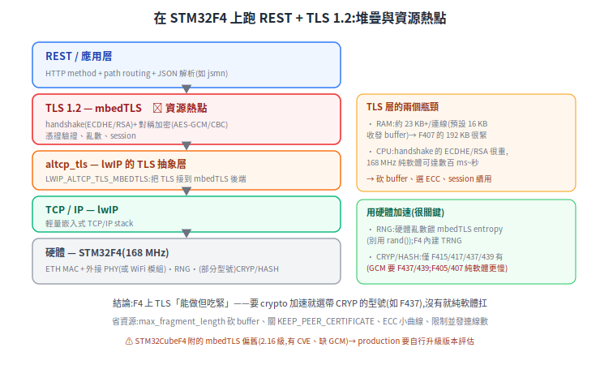
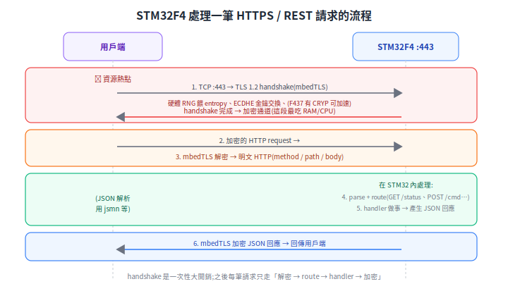

# 在 STM32F4 上設計 REST API + TLS 1.2

把一顆 STM32F4 當成網路節點,對外開一個 **REST API**(配置、監控、下指令),而且要用 **TLS 1.2** 把連線加密——這在 IoT 設備、車載子系統很常見。難點不在「寫得出 HTTP」,而在 **TLS 的運算與記憶體需求,撞上 MCU 很小的資源**。這篇從第一性原理拆這個矛盾,並標出每個選型的官方出處。

> 前置:[上下位機通訊協議](host-mcu-protocol.md)、[通訊匯流排](../10-hardware/communication-buses.md)。

---

## 1. 堆疊長怎樣

<p align="center"></p>

由下而上,每層用什麼、出處:

- **TCP/IP:[lwIP](https://www.nongnu.org/lwip/)** — 嵌入式的輕量 TCP/IP stack,MCU 上的事實標準。
- **TLS:[mbedTLS](https://www.trustedfirmware.org/projects/mbed-tls/)** — 專為嵌入式設計的 TLS 函式庫,支援 TLS 1.2(現由 TrustedFirmware 維護)。
- **接合層:lwIP 的 [altcp_tls](https://www.nongnu.org/lwip/2_1_x/group__altcp__tls.html)** — 「application-layer TCP + TLS」抽象,開 `LWIP_ALTCP_TLS_MBEDTLS` 就把 TLS 接到 mbedTLS 後端,做出 HTTPS。
- **ST 的現成支援**:STM32CubeF4 本體就內含 lwIP 與 mbedTLS 兩個 middleware,附範例([UM1730](https://www.st.com/resource/en/user_manual/um1730-getting-started-with-stm32cubef4-for-stm32f4-series-mcus-stmicroelectronics.pdf)、[stm32-mw-mbedtls](https://github.com/STMicroelectronics/stm32-mw-mbedtls))。
- **REST 層**:自己在 HTTPS 之上做 method + path routing + JSON 解析(輕量 parser 如 jsmn)。

## 2. 五個關鍵工程決策(這篇的重點)

**① RAM 是第一道牆。** mbedTLS 一條 TLS 連線約 **23 KB 以上**,大頭是預設 16 KB 的收 / 發 buffer([footprint 文件](https://mbed-tls.readthedocs.io/en/latest/kb/how-to/reduce-polarssl-memory-and-storage-footprint/))。STM32F407 只有 192 KB RAM,**這很緊**。省法:用 `max_fragment_length` 把 buffer 砍到 <1 KB、關 `MBEDTLS_SSL_KEEP_PEER_CERTIFICATE`、選小曲線 ECC、**限制並發連線數(1–2 條就好)**。

**② 加密很吃 CPU,而且型號決定能不能硬體加速。** TLS handshake 的 ECDHE / RSA 運算很重,168 MHz **純軟體**算可能要數百 ms 到秒級。關鍵:**STM32F405 / F407 沒有 CRYP 硬體加速器**——有 CRYP/HASH 的是 **F415 / F417 / F437 / F439**,而且 **AES-GCM / CCM 要 F437 / F439**(F41x 只到 AES-CBC/CTR)([F407/417 產品頁](https://www.st.com/en/microcontrollers-microprocessors/stm32f407-417.html)、[UM1924 crypto library](https://www.st.com/resource/en/user_manual/dm00215061-stm32-crypto-library-stmicroelectronics.pdf))。要硬體加速,就選帶 crypto 的型號,並用 ST 的 mbedTLS `*_ALT` port 把 CRYP/HASH 接進去([stm32-mw-mbedtls](https://github.com/STMicroelectronics/stm32-mw-mbedtls))。

**③ 亂數一定用硬體 RNG。** TLS 的安全性建立在好的亂數上(金鑰、nonce)。STM32F4 內建硬體 TRNG,接成 mbedTLS 的 entropy source——**絕對不要用 `rand()` 或時間當種子**(會讓 TLS 形同虛設)。ST 還有 AN 用 NIST 測試套件驗證其品質([RNG validation AN](https://www.st.com/resource/en/application_note/dm00073853-stm32-microcontroller-random-number-generation-validation-using-the-nist-statistical-test-suite-stmicroelectronics.pdf))。

**④ cipher suite 砍到夠用 + 憑證要保護。** 鎖 **TLS 1.2 起跳**(`min_version`)、停用弱 suite;選 **ECDHE + AES-GCM**(F41x 只能到 AES-CBC),ECC(P-256 / Curve25519)比 RSA 省 RAM 又快。server 私鑰存 Flash,**開讀保護(RDP)** 防讀取;用 session resumption 省掉重複 handshake。

**⑤ 版本警示(別直接拿範例上 production)。** STM32CubeF4 附的 mbedTLS 版本偏舊(2.16 級,有已知 CVE、且缺 TLS 1.3 要的 GCM/CCM 完整支援)。要上線就**自行升級 mbedTLS 版本、重新評估 cipher suite**,不要照搬範例版。

## 3. 最小骨架(pseudo-code)

```c
// 概念骨架:STM32F4 + lwIP altcp_tls + mbedTLS 的 HTTPS / REST server
// ⚠ pseudo;確切 API 簽名以你用的 lwIP / mbedTLS 版本為準

// ① entropy 用硬體 RNG(不是 rand())
mbedtls_entropy_add_source(&entropy, stm32_rng_poll, NULL, 32,
                           MBEDTLS_ENTROPY_SOURCE_STRONG);

// ② 載入 server 憑證 + 私鑰(存 Flash,開 RDP 讀保護)
mbedtls_x509_crt_parse(&srvcert, server_cert_pem, ...);
mbedtls_pk_parse_key(&pkey, server_key_pem, ...);

// ③ TLS 設定:鎖 TLS 1.2、只留省資源又安全的 cipher suite
mbedtls_ssl_config_defaults(&conf, MBEDTLS_SSL_IS_SERVER, ...);
mbedtls_ssl_conf_min_version(&conf, MBEDTLS_SSL_MINOR_VERSION_3);   // TLS 1.2
mbedtls_ssl_conf_ciphersuites(&conf, ecdhe_aes_gcm_only);
mbedtls_ssl_conf_own_cert(&conf, &srvcert, &pkey);

// ④ 把 TLS 接到 lwIP 的 altcp(LWIP_ALTCP_TLS_MBEDTLS)
struct altcp_tls_config *tls = altcp_tls_create_config_server(/* cert/key */);
struct altcp_pcb *pcb = altcp_tls_new(tls, IPADDR_TYPE_V4);
altcp_bind(pcb, IP_ANY_TYPE, 443);
altcp_listen(pcb);
altcp_accept(pcb, on_accept);

// ⑤ REST 路由:HTTP method + path → handler → JSON
void on_https_request(Request r) {        // r 已過 TLS 解密
    if (r.method == GET  && path_is(r, "/status")) return json_status();
    if (r.method == POST && path_is(r, "/cmd"))    return apply_cmd(json_parse(r.body));
    return http_404();
}
```

一筆 HTTPS 請求從進來到回應的流程是這樣——handshake 是一次性大開銷,之後每筆只走「解密 → route → handler → 加密」:

<p align="center"></p>

## 結論

STM32F4 上做 TLS 1.2「**能做,但吃緊**」。要做就照這條清單:**選對型號**(要 crypto 加速就用 F437/F439,不要 F407 硬扛)、**砍 mbedTLS 配置省 RAM**、**硬體 RNG + CRYP 加速**、**限連線數**、**升級 mbedTLS 版本**。若安全需求高而 F4 資源不夠,務實選項是換 **STM32F7 / H7**(更多 RAM、更強 crypto)或讓一台**閘道器代理 TLS**(MCU 走內網明文、閘道器對外做 TLS)。

## 來源

- [mbedTLS(TrustedFirmware)](https://www.trustedfirmware.org/projects/mbed-tls/)、[GitHub Mbed-TLS](https://github.com/Mbed-TLS/mbedtls)、[減少 footprint](https://mbed-tls.readthedocs.io/en/latest/kb/how-to/reduce-polarssl-memory-and-storage-footprint/)
- [lwIP](https://www.nongnu.org/lwip/)、[altcp_tls](https://www.nongnu.org/lwip/2_1_x/group__altcp__tls.html)
- STM32:[UM1730](https://www.st.com/resource/en/user_manual/um1730-getting-started-with-stm32cubef4-for-stm32f4-series-mcus-stmicroelectronics.pdf)、[stm32-mw-mbedtls](https://github.com/STMicroelectronics/stm32-mw-mbedtls)、[F407/417 產品頁](https://www.st.com/en/microcontrollers-microprocessors/stm32f407-417.html)、[UM1924 crypto library](https://www.st.com/resource/en/user_manual/dm00215061-stm32-crypto-library-stmicroelectronics.pdf)、[RNG validation AN](https://www.st.com/resource/en/application_note/dm00073853-stm32-microcontroller-random-number-generation-validation-using-the-nist-statistical-test-suite-stmicroelectronics.pdf)
