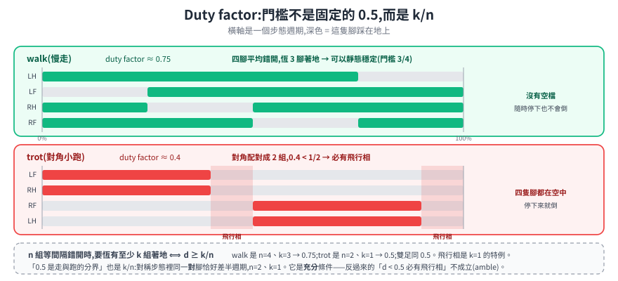

# 步態與致動:為什麼工業手臂那套馬達裝上去會壞

[上一篇](legged-fundamentals.md)推到「基座浮起來,唯一能影響它的通道是接觸,而接觸是斷續的」。這篇接著問兩個工程問題:接觸的**時序**怎麼安排(步態),以及產生接觸力的**硬體**該怎麼選(致動器)。

這兩題有一個共同的答案來源——腳著地那一瞬間的**衝擊**。步態決定衝擊多久來一次、多重;致動器決定衝擊來的時候誰承受。

---

## 1. Duty factor:一個數字把步態切成兩類

描述步態不必記一堆名字,先記一個量:**duty factor**——單一隻腳在一個步態週期裡處於**觸地(stance)**的時間比例。另一個要用到的詞是**相位**:某隻腳的觸地區間從週期的哪個位置開始,用 0 到 1 表示(相位 0.25 就是「晚四分之一個週期」)。

還有一個名詞先講定:**飛行相**(也叫騰空相)指的是**四隻腳同時離地**的那段時間。下面「全騰空」講的是同一件事。

<p align="center"></p>

先看三個具體的步態,建立圖像:

- **walk(慢走)**:duty factor 約 0.75,四隻腳**平均錯開**依序落地,任一時刻恰好三腳著地。慢、耗能高,但可以靜態穩定。
- **trot(對角小跑)**:對角兩腳**綁成一組**交替,duty factor 落在 0.5 附近或以下。快、效率好,是多數四足機器人的巡航步態。
- **bound / gallop**:前腳一組、後腳一組,duty factor 更低,飛行相更長。速度最高,對控制與硬體的要求也最高。

### 門檻:一條規則就夠

這三個數字不是背下來的,它們是同一條規則的三個代入值。

把「同時起落的腳」(相位相同)算成**一組**。n 組**等間隔**錯開、duty factor 為 `d` 時,任一時刻著地的組數只會是 `⌊n·d⌋` 或 `⌈n·d⌉`。於是:

```
要恆有至少 k 組著地  ⟺  d ≥ k / n
```

代進去:

| 步態 | n(組數) | 要求 | 門檻 | 實際 d |
|---|---|---|---|---|
| **walk** | 4(四腳各自錯開) | 恆三腳著地 → k=3 | **3/4 = 0.75** | ≈ 0.75 |
| **trot** | 2(對角配對) | 不出現飛行相 → k=1 | **1/2 = 0.5** | ≈ 0.4 → **不滿足,必有飛行相** |
| **雙足** | 2 | 不出現飛行相 → k=1 | **1/2 = 0.5** | 走路 > 0.5,跑步 < 0.5 |

飛行相的條件就是 `k=1` 那個特例:**`d < 1/n` 必有飛行相**。四腳各自錯開時是 0.25,配成兩組時才是 0.5。

> **兩個容易寫錯的地方,我自己都踩過。**
>
> 第一,**「等間隔」這個條件不能省**。相位排成 0 / 0.1 / 0.2 / 0.3、`d = 0.3` 的話,`d > 1/4` 卻仍有飛行相——四段觸地區間全擠在前半個週期,後面整段空著。`k/n` 講的是門檻,前提是相位攤平。
>
> 第二,**「至少」不能寫成「恆為」**。`d = 0.75` 時四腳確實恆為 3,但那是因為 `4 × 0.75` 剛好是整數;`d = 0.9` 時 `⌊3.6⌋ = 3`、`⌈3.6⌉ = 4`,會在 3 腳與 4 腳之間切換。只有落在門檻那一點上才「恆為」。

### 那「duty factor 0.5 是走與跑的分界」呢?

**要看它在講誰。** 對**雙足**它是嚴格的幾何門檻(n=2,k=1)。對**四足**它是 Hildebrand 那套動物步態分類裡的**統計性描述**——真實動物的四足步態多半落在配對結構上,所以這條線在經驗上好用,但它不是「四隻腳輪流」這件事本身的必然。

反例在動物身上就有:**amble(溜蹄,馬術用語,指介於走與跑之間的中速步態)**是靈長類、大象與部分馬匹採用的步態,duty factor 低於 0.5,卻**始終至少有一隻腳著地**,沒有全身騰空相(Schmitt et al. 2006)。牠們用的正是四腳各自錯開、而非兩腳一組的結構。

> gallop 是例外中的例外:它的相位結構不只一種(transverse / rotary),四隻腳不見得能乾淨地分成兩組,`k/n` 這個簡化不直接適用。

回頭看上面那張圖,兩個數字各自有出處:walk 的 0.75 是 `n=4, k=3`,trot 的 0.4 落在 `n=2, k=1` 的 0.5 之下。**不是巧合——這兩個步態各自坐在自己結構的門檻附近。**

這把[上一篇](legged-fundamentals.md#3-支撐多邊形不再固定而靜態穩定判準本身就不夠用)講的「支撐多邊形退化到消失」變成一個**設計階段就算得出來**的參數:選了相位結構與 duty factor,就等於選了會不會有飛行相、以及支撐多邊形長什麼樣。

> 這套用 duty factor 與落地時序描述步態的框架,來自 Hildebrand 1965 年對馬匹步態的分析,不是機器人學發明的。畫成「每隻腳的觸地區間對步態週期的分布圖」也是那時就定下來的表示法。

**要留意的邊界**:walk / trot / pace / bound / gallop 的**描述性**定義(誰跟誰一組、順序如何)有共識,但把它們寫成「相位差等於某個確切數值」的嚴格數學定義,可查到的來源多半是動物學角度而非機器人學的統一規範。要寫進控制器規格時,以你採用的那份教材或論文的定義為準。

---

## 2. 衝擊:腳著地那一瞬間發生什麼

輪子從來不「著地」——它一直在地上。腳每一步都要重新撞上去一次。

這個撞擊在力學上是一個近乎瞬間的動量變化:腳的速度從向下某個值變成零。時間越短、力越大。而這股力會**沿著腿往上傳**,經過每一個關節,傳進減速機的齒輪。

於是致動器要同時滿足三件在傳統工業手臂上不必同時滿足的事:

1. **承受重複衝擊**——不是偶爾撞一下,是每秒好幾次,跑一天幾萬次。
2. **能做力控**——[上一篇](legged-fundamentals.md#5-狀態估計沒有輪子可以數)講的接觸偵測要靠關節力矩反推;而控制本身也是在控接觸力,不是控位置(地面高低不知道,控位置會不是踩空就是硬頂)。
3. **反應要快**——腳從偵測到觸地到調整出力,只有幾毫秒。

---

## 3. QDD:為什麼要把減速比降下來

<p align="center"></p>

工業手臂用**高減速比**傳動,常見的**諧波減速機**(harmonic drive,又稱諧波齒輪)在單一個扁平級數裡就能做到 1:50 以上、而且幾乎沒有齒隙——靠一個薄壁齒圈被壓成橢圓、一邊變形一邊跟外圈嚙合,不是靠一排齒輪堆出來的。

這個選擇的理由很正當:馬達轉得快、扭矩小,靠減速比換成慢而有力的輸出;而且高減速比讓輸出端**很難反過來推動馬達**——手臂停在那裡不會被外力推動,省電又穩。

把同一套裝到腿上,那些優點逐一變成缺點:

> **為什麼反射慣量是「平方」而不是「倍數」?** 減速比 N 表示馬達轉子轉得比輸出端快 N 倍。轉子的動能是 `½ J_m ω_m² = ½ J_m (N ω_out)² = ½ (N² J_m) ω_out²`——從輸出端看回去,這顆轉子表現得就像一個 `N² J_m` 的慣量。一個 N 來自「速度被放大 N 倍」,另一個 N 來自「動能與速度的平方成正比」。1:100 的減速機會讓一顆很輕的轉子在輸出端變得像一萬倍重,腳撞地時要瞬間改變的就是這個等效慣量。

| | 高減速比(1:50+) | QDD(約 1:3 ~ 1:10) |
|---|---|---|
| **反射慣量**(馬達轉子從輸出端看過去的等效慣量) | 被減速比**平方**放大,輸出端感覺到的等效慣量非常大 | 低 |
| **可反向驅動** | 幾乎不能。外力推不動輸出端 | 可以。外力能推動馬達轉 |
| **衝擊怎麼處理** | 全部由齒輪硬吃。長期是磨損與失效來源 | 大部分被馬達的轉動吸收掉 |
| **力控怎麼做** | 摩擦與齒隙(backlash,齒與齒之間的空隙)讓「用電流推力矩」不準,基本上得外加力矩感測器 | **用馬達電流就能推得關節力矩**,不必外加感測器 |
| **控制頻寬**(控制器能反應多快) | 低 | 高 |

**QDD(quasi-direct drive,準直驅)** 就是走中間路線:用高扭矩密度的馬達搭配**很低**的減速比(約 1:3 到 1:10),介於直驅(1:1)與工業減速機之間。

上表五格看起來是五個獨立的缺點,其實只是**三個底層性質**的展開:高減速比同時帶來**高反射慣量、高摩擦、低傳動效率**。「不可反向驅動」是這三樣的必然結果,「衝擊只能由齒輪硬吃」與「電流推不準力矩」則是不可反向驅動的兩個後果,頻寬低則跟著慣量與摩擦走。手臂要的「斷電也不會被推動」與腿怕的那幾件事,是同一組性質從兩個方向看過去。

最關鍵的那一格是「可反向驅動」。它一次解決兩件事:

- **衝擊被動吸收**。腳撞地的力可以反過來推動馬達轉,能量進了轉子的動能,不是全部砸在齒輪上。
- **力控不必加感測器**。這就是 **proprioceptive(本體感覺)力控**——直接用馬達電流與位置推得關節扭矩,再用 [`τ = JᵀF`](../mobile-manipulator/arm-kinematics.md#身分二力映射靜力對偶) 反推腳底受力。少一個會壞的零件,而且沒有感測器的頻寬限制。

> 這是一個典型的柵欄:看到四足用 1:6 這種「低得奇怪」的減速比,直覺會想「換高一點不是更有力嗎」。它擋住的是衝擊與力控——把減速比拉高,腿會更有力,但齒輪箱會被撞壞,而且再也做不了不加感測器的力控。

**串聯彈性致動器(SEA)** 是另一條路:在輸出端加一根實體彈簧,用彈簧形變量測力(所以力控很準),彈簧也吸收衝擊。代價是犧牲頻寬(彈簧本身是個低通)與機構複雜度。QDD 與 SEA 是同一個問題的兩種答案:**衝擊要被誰吸收——馬達的轉動,還是一根彈簧。**

---

## 4. 為什麼強化學習在足式上主導了

[上一篇](legged-fundamentals.md#2-接觸是離散事件系統從連續變成混合)講過根本原因:接觸切換讓系統變成混合系統,沒有一組固定增益能同時對 16 種動力學都好。傳統做法是靠簡化模型(把整台機器當成一個倒單擺)加上線上最佳化,可行但每一層簡化都是誤差來源。

強化學習繞過了「先建模再控制」這條路:直接在模擬裡跑幾十億步,學一個從觀測到關節指令的函數。這條線這幾年的關鍵成果都在同一個平台(ANYmal)上做出來:

| 論文 | 年份 / 出處 | 主要貢獻 |
|---|---|---|
| Hwangbo et al., *Learning Agile and Dynamic Motor Skills for Legged Robots* | *Science Robotics* 4(26), 2019 | 用真實數據學一個**致動器網路**去補模擬與真實馬達的落差,再做 RL |
| Lee et al., *Learning Quadrupedal Locomotion over Challenging Terrain* | *Science Robotics* 5(47), 2020 | **teacher-student 特權學習**:先用只有模擬才知道的資訊(摩擦係數、地形真值)訓練 teacher,再讓只吃本體感覺的 student 去模仿它 |
| Rudin et al., *Learning to Walk in Minutes Using Massively Parallel Deep RL* | *CoRL 2021*(PMLR 164) | 大規模 GPU 平行模擬,把訓練時間壓到分鐘等級 |
| Miki et al., *Learning Robust Perceptive Locomotion for Quadrupedal Robots in the Wild* | *Science Robotics* 7(62), 2022 | 在 teacher-student 之上加入外部感知(深度相機、光達),推到戶外崎嶇地形 |

> **不要把這四篇說成同一套技術路線。** teacher-student 特權學習這條主軸,可查證的是 Lee 2020 → Miki 2022 這一支;Hwangbo 2019 的核心是致動器網路,Rudin 2021 的核心是訓練基礎設施本身,兩者是否也採用同一套框架,查不到明確依據。

這裡跟本筆記的 [sim-to-real](../../50-physical-ai/sim-to-real.md) 完全接得起來:特權學習就是那篇 §2.6 提到的「特權資訊 + 蒸餾」,致動器網路則是「system identification」的一個具體形式——**足式把那些通用手段推到了極致,因為它別無選擇**。

模擬環境方面,Isaac Lab 官方文件列出的足式任務包含 `Isaac-Velocity-Flat-Anymal-C-v0` / `Isaac-Velocity-Rough-Anymal-D-v0` / `Isaac-Velocity-Rough-Unitree-Go2-v0` / `Isaac-Velocity-Flat-Spot-v0` 這類命名,平坦與崎嶇地形各一組,雙足/人形則有 Cassie、H1、G1、Digit。

---

## 5. 平台現況

| 平台 | 自由度 / 規格 | 狀態與 ROS 2 |
|---|---|---|
| **Unitree Go2 / B2 / A2** | 每腿 3 個共 12 自由度。B2 含電 60 kg、最高 6 m/s、行走酬載 40 kg;A2(2025-08 發表)空機 37 kg、最高 5 m/s、行走酬載 25 kg | 在售。官方 `unitreerobotics/unitree_ros2`(Cyclone DDS) |
| **Boston Dynamics Spot** | 12 自由度,重 33.8 kg、最高 1.6 m/s、酬載 14 kg、IP54、續航約 90 分。選配手臂再加 6 軸 | 在售(改為企業詢價)。`bdaiinstitute/spot_ros2` |
| **ANYbotics ANYmal** | 12 個 ANYdrive 彈性致動器。ANYmal C 酬載 10 kg、IP67;新型號 ANYmal X 有 ATEX/IECEx 防爆認證 | 在售。**官方只開源簡化 URDF**,完整控制堆疊是 proprietary,沒有官方 ROS 2 完整套件 |
| **DEEP Robotics X30 / Lite3** | X30 含電 56 kg、IP67、−20 ~ 55°C、最高 ≥4 m/s、爬坡 ≤45° | 在售。官方 GitHub `DeepRoboticsLab` 提供 SDK |
| **MIT Mini Cheetah** | 12 自由度、約 9 kg,可反向驅動模組化致動器,**開源硬體** | 研究平台,從未商品化。它的致動器設計是 QDD 這條線的代表 |

Spot 的公司沿革值得記一筆:MIT 衍生新創(1992)→ Google(2013)→ SoftBank(2017)→ **現代汽車集團(2021 起)**。這類平台的軟體堆疊高度綁原廠,選型時公司狀態跟規格一樣是硬指標——[移動操作](../mobile-manipulator/mobile-manipulation.md#9-實際在跑的平台)那篇的 Fetch 就是活生生的例子。

ROS 2 生態要注意一個常見誤解:**CHAMP(`chvmp/champ`)是 ROS 1 的**,它的 ROS 2 版本目前都是社群另外改寫包裝,不是官方原生支援。

---

## 6. 安全標準:這一塊目前是空的

這是查證後最值得寫下來的一件事。

**目前沒有任何一部已發布的 ISO 安全標準,是專門給足式或主動平衡機器人的。** 而且既有的三條線都明確把它排除在外:

| 標準 | 為什麼不適用 |
|---|---|
| **ISO 3691-4**(無人工業車輛) | **明訂不適用於「具主動控制穩定性」的機器人** |
| **ISO 10218**(工業機器人手臂) | 不處理移動相關的風險(見[移動操作](../mobile-manipulator/mobile-manipulation.md#8-安全標準有一道空隙而且是這一類機器人正好掉進去的那道)那篇的同一道空隙) |
| **ISO 13482**(個人照護機器人) | 限定非工業應用場景 |

填補這個空白的是制定中的 **ISO/CD 25785-1**,標題是「Robotics — Safety requirements for dynamically stable industrial mobile robots (legged, wheeled, or other forms of locomotion) — Part 1: Robots」。它的範疇明訂涵蓋「需要主動控制才能維持平衡、**斷電即可能失穩**」的工業移動機器人——這句話正好是足式的定義。

**截至查證時它仍在草案階段。** 可查到的時程說法是「預計 2026–2027 年發布」,沒有確定日期。

> 實務上的意思很直接:**現在要把四足導入工業場域,沒有一張現成的標準可以照著過。** 只能做自己的風險評估,並且盯著 25785-1 的進度。這跟[移動操作](../mobile-manipulator/mobile-manipulation.md#8-安全標準有一道空隙而且是這一類機器人正好掉進去的那道)那道空隙是同一類問題的兩個版本——法規追不上形態的演化,而且追的方式是「新開一個專案」而不是「擴充舊標準」。

---

## 7. 來源

- **步態與 duty factor**:Hildebrand, M., "Symmetrical Gaits of Horses," *Science* 150(3697), 1965 <https://www.science.org/doi/10.1126/science.150.3697.701>。amble(duty factor < 0.5 但無騰空相)的反例:Schmitt, D., Cartmill, M., Griffin, T. M., Hanna, J. B., Lemelin, P., "Adaptive value of ambling gaits in primates and other mammals," *Journal of Experimental Biology* 209, 2042–2049, 2006 <https://journals.biologists.com/jeb/article/209/11/2042/16164/>。靜態 vs 動態穩定與 duty factor 的關係:<https://pmc.ncbi.nlm.nih.gov/articles/PMC7506578/>
- **QDD 與 proprioceptive 力控**:Seok, S., Wang, A., Otten, D., Kim, S., "Actuator Design for High Force Proprioceptive Control in Fast Legged Locomotion," *IROS 2012*;Wensing, P. M. et al., "Proprioceptive Actuator Design in the MIT Cheetah," *IEEE Transactions on Robotics* 33(3), 2017 <https://dspace.mit.edu/server/api/core/bitstreams/53fde66c-bd98-4dd7-a95b-3c9a5d11cf69/content>。QDD 減速比範圍:<https://arxiv.org/pdf/2202.12365>
- **SEA**:Pratt, G. A. & Williamson, M. M., "Series Elastic Actuators," *IROS 1995*
- **RL locomotion 四篇**:Hwangbo et al. *Sci. Robot.* 2019 <https://www.science.org/doi/10.1126/scirobotics.aau5872>;Lee et al. *Sci. Robot.* 2020 <https://www.science.org/doi/10.1126/scirobotics.abc5986>;Rudin et al. *CoRL 2021* <https://proceedings.mlr.press/v164/rudin22a.html>;Miki et al. *Sci. Robot.* 2022 <https://www.science.org/doi/10.1126/scirobotics.abk2822>
- **Mini Cheetah**:Katz, B., Di Carlo, J., Kim, S., "Mini Cheetah: A Platform for Pushing the Limits of Dynamic Quadruped Control," *ICRA 2019*
- **Isaac Lab 環境清單**:<https://isaac-sim.github.io/IsaacLab/main/source/overview/environments.html>
- **平台**:Unitree B2 <https://shop.unitree.com/products/unitree-b2>、Spot <https://bostondynamics.com/products/spot/>、ANYmal X <https://www.anybotics.com/robotics/anymal-x/>、DEEP Robotics X30 <https://www.deeprobotics.cn/en/index/product3.html>
- **安全標準空白與 ISO/CD 25785-1**:<https://www.iso.org/standard/91469.html>、<https://www.mta.org.uk/resources/iso-np-25785-1-link-to-new-work-item-proposal/>

> **待查證**:ISO/CD 25785-1 的確切發布時程(只有「2026–2027」這種區間說法);walk / trot / bound 在機器人學文獻裡的嚴格相位差定義(現有共識偏描述性);Unitree Go2 的 12 自由度來自多個第三方來源一致收斂,未能直接由官方規格頁確認。
>
> 另外記一個容易搞混的歸屬:Kenneally 等人那篇 *Design Principles for a Family of Direct-Drive Legged Robots*(RA-L 2016)談的是**賓州大學的 Minitaur**,不是 MIT Cheetah 系列——兩者都屬「低減速比足式致動」這個大主題,但不是同一個團隊或平台。
