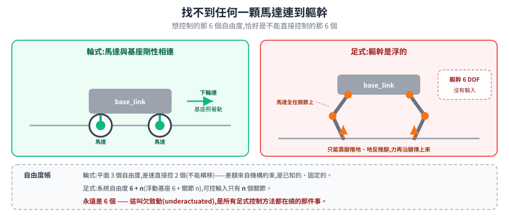
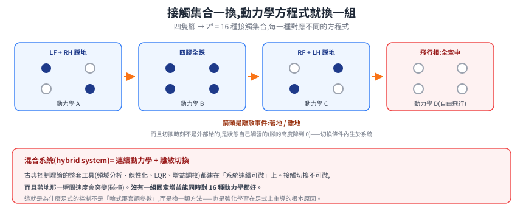
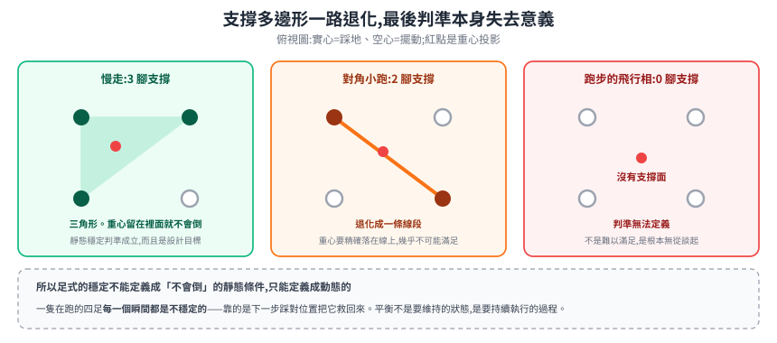
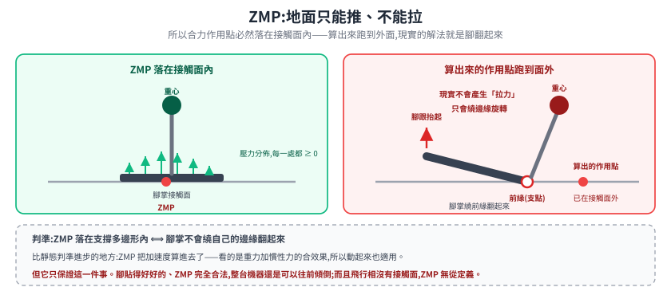
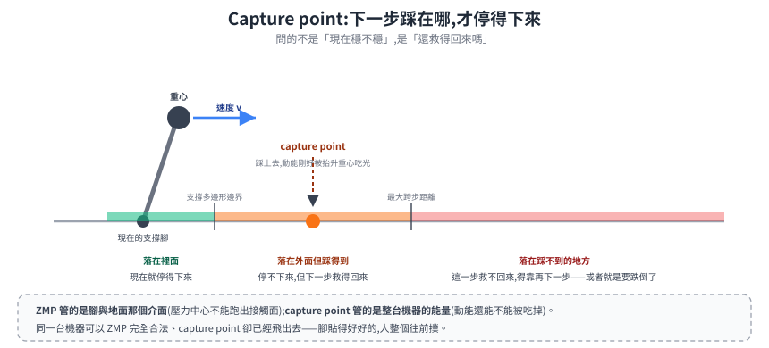
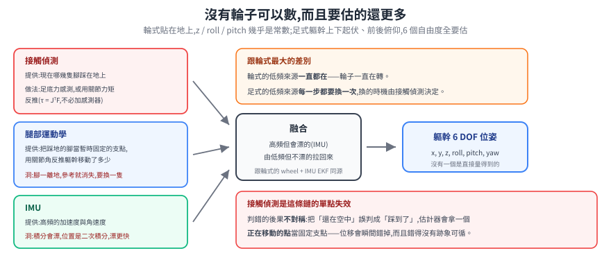

# 足式的根本分岔:基座浮起來了

輪式 AMR 的問題之所以[乾淨](../wheeled-amr/README.md#為什麼輪式的問題最乾淨),靠三個前提:支撐面固定、平面運動、接觸不切換。四足機器人把這三個前提**同時**打掉,而且不是「難一點」而是換了一類問題——連續可微的系統變成混合系統,直接可控的位姿變成間接可控。

這篇處理那個分岔本身。步態與致動器的取捨在[步態與致動](gait-and-actuation.md)。

> 前置:[座標轉換與 TF](../../10-core/30-navigation/kinematics-and-coordinate-transforms.md)、[手臂運動學](../mobile-manipulator/arm-kinematics.md)(Jacobian 與 `τ = JᵀF`,足式的力控直接用這條)。

---

## 1. 沒有一顆馬達連到基座

先看一件小事:輪式車的 `base_link` 在哪裡?在兩驅動輪的軸心中點,而那兩顆輪子上各有一顆馬達。你下輪速指令,基座就照著動——**馬達與基座之間是剛性連著的**。

四足不是這樣。翻遍一隻四足機器人,你找不到任何一顆馬達的輸出軸連到軀幹。所有馬達都在腿的關節上。

於是軀幹的 6 個自由度(3 位置 + 3 姿態)**沒有任何直接的控制輸入**。它怎麼動,是「腿推地、地反推腳、力沿腿傳到軀幹」的結果。這在控制理論裡有個名字:

- **浮動基座(floating base)**:把軀幹當成一個在空間中自由漂浮的剛體,腿掛在它下面。整個系統的廣義座標是 `q = (基座 6 DOF, 關節 n 個)`。
- **欠致動(underactuated)**:可控輸入的數目 `n`(關節數)**少於**系統自由度 `6 + n`。永遠差 6 個。

這 6 個差額不會消失。它是所有足式控制方法都在繞的那件事:**你想控制的東西(軀幹在哪、要往哪走)恰好是你不能直接控制的那 6 個。**

> 手臂也有類似結構但沒這個問題——手臂的基座**螺在地上**,那 6 個自由度被機械式地固定住了,不需要控制。把手臂的基座鬆開讓它浮起來,手臂就變成了足式問題。

---

## 2. 接觸是離散事件,系統從連續變成混合

第二個分岔:腳會離地、會著地。

在任何一個瞬間,系統的動力學方程式取決於**哪幾隻腳正踩在地上**——這叫**接觸集合(contact set)**。四足有 4 隻腳,接觸集合有 2⁴ = 16 種可能。每一種對應一組不同的方程式:踩地的腳提供約束(腳底不能穿地、不能滑),擺動的腳不提供。

**這讓系統變成混合系統(hybrid system):連續動力學 + 離散切換。** 而且切換時刻不是外部給的,是狀態自己觸發的(腳的高度降到 0 就著地)——切換條件內生於系統。

為什麼這件事這麼要緊:古典控制理論的整套工具(頻域分析、線性化、LQR、增益調校)都建在「系統連續可微」上。接觸切換是不可微的,而且著地那一瞬間速度會突變(碰撞)。你不能對這種系統直接套一組 PID 然後調參數——**沒有一組固定增益能同時對 16 種動力學都好**。

這也是為什麼[強化學習在足式上比在輪式上重要得多](gait-and-actuation.md#4-為什麼強化學習在足式上主導了)。輪式的控制問題可以寫成方程式解掉;足式的接觸切換寫不出封閉解,只能逼近或學。

---

## 3. 支撐多邊形不再固定,而靜態穩定判準本身就不夠用

[移動操作](../mobile-manipulator/mobile-manipulation.md#5-伸臂會改變重心傾覆這件事)那篇講過輪式的靜態穩定判準:重心投影落在支撐多邊形內。四足的支撐多邊形隨步態一直在變。

三種情況一路把判準逼到失效:

| 支撐腳數 | 支撐多邊形 | 靜態穩定判準 |
|---|---|---|
| **3 隻**(慢走) | 一個三角形 | 成立,而且是設計目標——重心留在三角形內就不會倒 |
| **2 隻**(對角小跑) | **退化成一條線段** | 幾乎不可能滿足。重心要精確落在那條線上 |
| **0 隻**(跑步的飛行相) | **不存在** | **判準無法定義** |

這不是「難以滿足」,是**判準本身沒有意義了**。飛行相時沒有支撐面,任何「重心投影要落在裡面」的說法都無從談起。

**所以足式的穩定不能定義成「不會倒」的靜態條件,只能定義成動態的。** 這個轉向可以追到 Raibert 那本 *Legged Robots That Balance*(MIT Press, 1986)——它跟當時多數工作的差別,正是把重點從「維持靜態平衡」移到「用運動主動平衡」。一隻在跑的四足在**每一個瞬間都是不穩定的**,靠的是下一步踩對位置把它救回來。

---

## 4. 從 ZMP 到 capture point:兩個判準各保證什麼

既然靜態判準不夠,就要找動態的。這裡有兩個層次,常被混用但保證的東西不同。

### 4.1 ZMP:保證「腳不會繞邊緣翻轉」

**ZMP(Zero Moment Point,零力矩點)** 是地面上的一個點:把所有地面反作用力等效成作用在這一點上時,水平方向的合力矩為零。

判準:**ZMP 落在支撐多邊形內 ⟺ 腳掌不會繞著自己的邊緣翻起來。**

推導的直覺:地面只能推、不能拉。腳底各處的壓力都必須 ≥ 0。壓力分佈的合力作用點(也就是壓力中心)必然落在接觸面**內部**——這是物理上的限制,不是選擇。如果控制器算出來的等效作用點跑到接觸面之外,現實中的解決方式就是腳繞著邊緣抬起來,也就是翻轉。

ZMP 比靜態判準進步的地方是**它把加速度算進去了**。靜態判準只看重心投影;ZMP 看的是重力加上慣性力的合效果,所以動起來也適用。

**但 ZMP 只保證這一件事。** 它保證腳掌貼著地不翻,不保證機器人不會跌倒——一個 ZMP 完全合法的機器人可以整體往前傾倒,只要它的腳一直平貼在地上。而且飛行相沒有接觸面,ZMP 依然無從定義。

### 4.2 Capture point:保證「還停得下來」

第二個層次換了問法:**如果我現在把下一步踩在某個位置,能不能就此停住?**

**capture point** 就是那個位置:踩上去之後,系統剩餘的動能剛好被抬升重心所需的位能吃光,速度歸零。

它的價值不在「精確算出一個點」,而在**把穩定變成一個可量測的餘裕**:

- capture point 落在支撐多邊形**內** → 現在就能停下來
- 落在**外面但腳踩得到** → 停不下來,但下一步救得回來
- 落在**腳踩不到的地方** → 這一步已經救不回來了,只能靠再下一步(或者就是要跌倒了)

這個「還剩幾步可以救」的觀點,比「現在穩不穩」有用得多——因為一隻在跑的機器人**永遠不穩**,真正要回答的問題從來是「還救得回來嗎」。

> 兩者的關係可以這樣記:**ZMP 管的是腳與地面那個介面**(壓力中心不能跑出接觸面);**capture point 管的是整台機器的能量**(動能還能不能被吃掉)。同一台機器可以 ZMP 合法但 capture point 已經飛出去——腳貼得好好的,人整個往前撲。

---

## 5. 狀態估計:沒有輪子可以數

輪式車的 odometry 來自輪子——[編碼器](../../10-core/10-hardware/encoders.md)數格數,乘上輪徑,積分成位移。四足沒有這個。

而且它要估的東西還更多:輪式車貼在地上,`z`、roll、pitch 幾乎是常數;四足的軀幹**上下起伏、前後俯仰**,那 6 個自由度全都要估,而且沒有一個是直接量得到的。

標準做法是把三個來源融合起來,每一個都補另一個的洞:

| 來源 | 提供什麼 | 它的洞 |
|---|---|---|
| **接觸偵測** | 現在哪幾隻腳踩在地上 | 判錯就整條鏈都錯(見下) |
| **腿部運動學** | 把踩地的腳當成暫時固定的支點,用關節角反推軀幹相對它移動了多少 | 只在腳真的沒滑動時成立;而且腳一離地這個參考就消失,得換到下一隻腳 |
| **IMU** | 高頻的加速度與角速度 | 積分會漂,而且位置是二次積分——漂得特別快 |

融合的邏輯跟輪式的 [wheel + IMU EKF](../../10-core/30-navigation/localization.md) 同源:**高頻但會漂的訊號**(IMU)由**低頻但不漂的訊號**(腿部運動學)拉回來。差別在輪式的低頻來源一直都在(輪子一直轉),足式的低頻來源**每一步都要換一次**。

但這套融合有一個**結構性的上限**,不是調參數能解決的:它能給出不漂的**機身速度**與 **roll / pitch**,而**水平位置與 yaw 在數學上是不可觀測(unobservable)的**。原因不難理解——腿部運動學只告訴你「相對剛才那隻腳移動了多少」,沒有任何一個來源告訴你「絕對在哪、絕對朝哪」。IMU 的重力向量把 roll / pitch 錨住了,但重力對 yaw 沒有資訊。

所以足式機器人要知道自己在地圖上哪裡,**一定得再接一個外部參考**(光達或視覺定位),跟輪式一樣——差別只在輪式的 odometry 漂得慢一點。另外一個已被反覆記載的實務問題:機身**高度**會隨著腿與地面接觸時的形變累積漂移,近年的做法是拿足端接觸點當世界座標的錨點來修正。

**接觸偵測是這條鏈的單點失效。** 判斷「這隻腳踩到了」有兩條路:裝足底力感測器(直接但多一個會壞的零件),或用關節力矩反推(不必加感測器——這正是 [`τ = JᵀF`](../mobile-manipulator/arm-kinematics.md#身分二力映射靜力對偶) 那條式子的用途:量到關節力矩,反推腳底受了多大的力)。判錯的後果不對稱:把「還在空中」誤判成「踩到了」,估計器會拿一個正在移動的參考點當固定支點,位移會瞬間錯掉。

---

## 6. 收斂:三個前提被打掉,問題換了一類

| 輪式成立的前提 | 四足打掉它 | 後果 |
|---|---|---|
| 馬達與基座剛性相連 | **浮動基座**,沒有馬達直連軀幹 | 欠致動:想控的 6 個自由度恰好不能直接控 |
| 接觸連續不切換 | 腳會離地著地,接觸集合有 16 種 | 混合系統,古典連續控制的工具整套不能直接套 |
| 支撐面固定 | 支撐多邊形隨步態退化成三角形 → 線段 → 消失 | 靜態穩定判準失效,穩定只能定義成動態的 |

三者不是各自獨立的困難,而是同一件事的三個面向:**基座浮起來之後,唯一能影響它的通道是接觸,而接觸是斷續的。**

從這裡出發,兩個判準各補一塊:ZMP 管腳與地的介面、capture point 管整台機器還剩多少救回來的餘裕。狀態估計則要靠接觸偵測把「哪隻腳現在可以當參考」找出來——同一個接觸,既是控制的通道,也是估計的錨點。

步態怎麼選、致動器為什麼不能沿用工業手臂那一套,見[步態與致動](gait-and-actuation.md)。

---

## 來源

- **ZMP**:Vukobratović, M. & Juričić, D., "Contribution to the Synthesis of Biped Gait," *IEEE Transactions on Biomedical Engineering* 16(1), 1969 <https://pubmed.ncbi.nlm.nih.gov/5775601>。回顧見 Vukobratović & Borovac, "Zero-Moment Point — Thirty Five Years of Its Life," *International Journal of Humanoid Robotics* 1(1), 2004 <https://www.worldscientific.com/doi/10.1142/S0219843604000083>。
  > 一個容易寫錯的細節:「zero-moment point」**這個詞本身**是 1970–1972 年間後續研究才創出來的,1969 那篇原始論文並沒有用這個名字。
- **Capture point**:Pratt, J., Carff, J., Drakunov, S., Goswami, A., "Capture Point: A Step toward Humanoid Push Recovery," *IEEE-RAS Humanoids 2006* <http://www.ambarish.com/paper/Pratt_Goswami_Humanoids2006.pdf>。與 ZMP 的差異推導見 Caron 的技術筆記 <https://scaron.info/robotics/capture-point.html>。
- **主動平衡的轉向**:Raibert, M. H., *Legged Robots That Balance*, MIT Press, 1986 <https://mitpress.mit.edu/9780262681193/legged-robots-that-balance/>。
- **浮動基座狀態估計**:Bloesch, M. et al., "State Estimation for Legged Robots — Consistent Fusion of Leg Kinematics and IMU," *Robotics: Science and Systems VIII*, 2013 <https://infoscience.epfl.ch/record/181040>。水平位置與 yaw 不可觀測、以及機身高度漂移的後續處理,見 <https://arxiv.org/pdf/2210.02127>。
- **接觸偵測的兩類做法**(廣義動量觀測器 vs 直接力感測):<https://arxiv.org/pdf/2404.03444>、<https://arxiv.org/pdf/2510.10843>。

> **待查證**:ZMP 首次實機展示的年份與平台,可查到的說法都指向同一份文件,沒有獨立第二來源。「機身高度會漂」這個現象**沒有公認的專有名詞**——文獻都是描述性寫法,別把它講得像一個固定術語。
