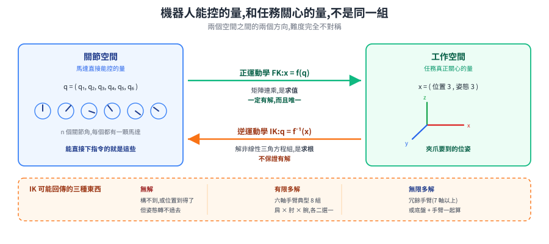
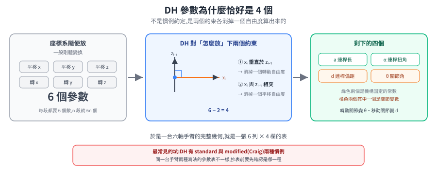
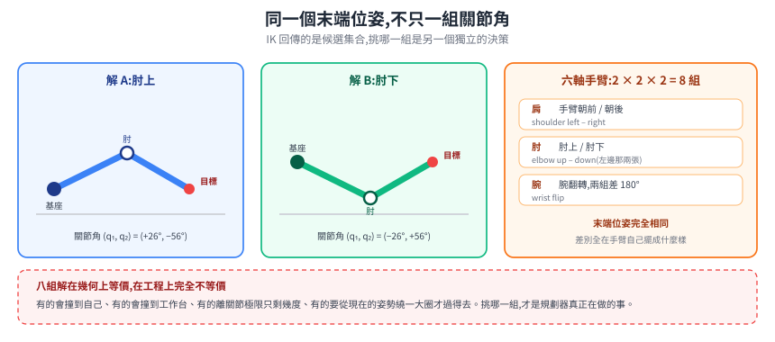
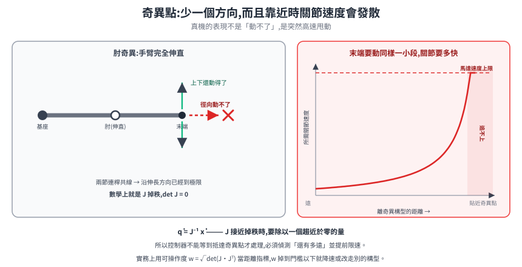
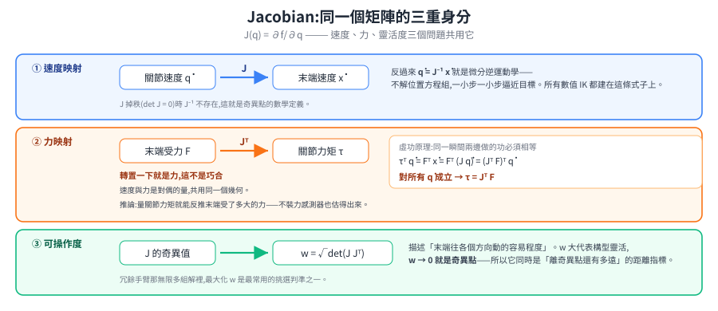

# 手臂運動學:為什麼多一隻手臂,問題就換了一種

底盤的運動學是兩條代數式:給左右輪速,算出車體的 `v` 與 `ω`,反過來也一樣直接。手臂看起來只是「多幾個關節」,但問題的性質變了——同一個目標可能有八組答案、也可能一組都沒有,而且在某些姿勢下手臂會突然「少一個方向動不了」。

這篇把這些現象推到根上:它們全部來自同一件事——**手臂能直接控制的量,和任務關心的量,不是同一組量**。

> 前置:[座標轉換與 TF](../../10-core/30-navigation/kinematics-and-coordinate-transforms.md)(剛體變換與座標系鏈)。
> 延伸:[移動操作:底盤與手臂的耦合](mobile-manipulation.md)。

---

## 1. 兩個空間,以及它們之間的兩個方向

| 詞 | 一句話 |
|---|---|
| **關節空間(joint / configuration space)** | 所有關節角組成的向量 `q = (q₁, q₂, …, qₙ)`。這是馬達**直接能控**的量。 |
| **工作空間(task / operational space)** | 末端執行器(end-effector,夾爪或工具的作用點)的位姿 `x`——3 個位置 + 3 個姿態,共 6 個量。這是任務**真正關心**的量。 |
| **正運動學(FK)** | `x = f(q)`:給關節角,算末端在哪。 |
| **逆運動學(IK)** | `q = f⁻¹(x)`:給末端目標,回推關節角。 |

<p align="center"></p>

整篇的張力就在這張圖的兩個方向上。**FK 一定有答案而且唯一;IK 不保證。** 為什麼?

**FK 是求值,IK 是求根。** FK 做的事是把一串已知的剛體變換乘起來:每個關節轉了多少是已知的、每段連桿的幾何是固定的,矩陣連乘就得到末端位姿。連乘一定算得出來,而且只有一個答案。

IK 反過來,是把那串連乘的結果攤開成一組**非線性三角方程組**,再去解它。求根本來就可能無解、可能多根。所以「IK 解不出來」不是實作沒寫好,是問題本身允許這件事發生。

> 這也解釋了差速底盤為什麼沒有這個困擾:它的 FK 是兩條線性式,反過來還是兩條線性式,一一對應。手臂的非線性來自旋轉——關節角以 `sin`、`cos` 進入變換矩陣。

---

## 2. 正運動學:DH 參數為什麼是 4 個

一條手臂是一串連桿用關節接起來。末端相對基座的位姿,就是把每一段的變換連乘:

```
T⁰ₙ = T⁰₁ · T¹₂ · … · Tⁿ⁻¹ₙ
```

問題出在「每一段的座標系要放哪裡」。**隨便放的話,相鄰兩個座標系之間的一般剛體變換要 6 個參數**(3 個平移 + 3 個旋轉)。n 段就是 6n 個數,而且每個人放的位置不一樣,兩份文件對不起來。

**Denavit–Hartenberg 的作法是對「怎麼放座標系」施加兩個約束**:

1. `xᵢ` 軸**垂直於** `zᵢ₋₁` 軸
2. `xᵢ` 軸**與** `zᵢ₋₁` 軸**相交**

<p align="center"></p>

這兩個約束下去,相鄰兩座標系之間的變換就只剩 **4 個參數**:

| 參數 | 幾何意義 | 轉動關節 | 移動關節 |
|---|---|---|---|
| `a`(link length) | 兩軸的公垂線長度 | 常數 | 常數 |
| `α`(link twist) | 兩軸之間的扭轉角 | 常數 | 常數 |
| `d`(link offset) | 沿 `zᵢ₋₁` 的偏移 | 常數 | **變數** |
| `θ`(joint angle) | 繞 `zᵢ₋₁` 的轉角 | **變數** | 常數 |

**為什麼恰好是 4 個**:一般剛體變換有 6 個自由度,「垂直」消掉一個、「相交」再消掉一個,`6 − 2 = 4`。DH 表能存在不是慣例約定,是這兩個約束算出來的結果。

對應的變換矩陣:

```
        ⎡ cosθ   −sinθ·cosα    sinθ·sinα   a·cosθ ⎤
Tᵢ₋₁ᵢ = ⎢ sinθ    cosθ·cosα   −cosθ·sinα   a·sinθ ⎥
        ⎢  0        sinα          cosα        d    ⎥
        ⎣  0         0             0          1    ⎦
```

於是一條 6 軸手臂的完整幾何,就是一張 6 列 × 4 欄的表。

> **最常見的坑**:DH 有 **standard**(Denavit–Hartenberg 原版)與 **modified**(Craig 版)兩種慣例,座標系掛在連桿的哪一端不同,同一台手臂兩種寫法的參數表**長得不一樣**。抄別人的參數表之前先確認是哪一種,否則算出來的末端位置會系統性偏掉,而且看起來很像「機構裝配誤差」。

---

## 3. 逆運動學:三種麻煩,以及機構設計怎麼遷就它

### 3.1 多解——IK 的答案是一個集合,不是一個值

<p align="center"></p>

一台典型 6 軸工業手臂,同一個末端位姿通常有 **8 組**關節角組合都能達成,來自三個二選一:

- **肩**:手臂朝前 / 朝後(shoulder left–right)
- **肘**:肘上 / 肘下(elbow up–down)
- **腕**:腕翻轉(wrist flip),兩組差 180°

八組解在幾何上等價,在工程上完全不等價——有的會撞到自己、有的會撞到工作台、有的離關節極限只剩幾度、有的要從現在的姿勢繞一大圈才過得去。

**所以把 IK 當成「一個函數呼叫」的心智模型會出事。** 它回傳的是候選集合,選哪一組是另一個獨立的決策:離目前構型最近的?可操作度最高的?不會碰撞的?這個選擇通常才是規劃器真正在做的事。

### 3.2 無解

兩種情況:目標超出工作空間(構造上構不到),或位置構得到但**姿態**做不到。後者更常見也更難察覺——夾爪要垂直向下抓,但在那個位置手腕轉不到那個角度。

### 3.3 奇異點——突然少一個方向

某些構型下,手臂會**失去一個自由度**:末端在某個方向上,無論關節怎麼動都動不了。

三種典型:

- **腕奇異(wrist singularity)**:第 4 與第 6 軸共線,兩個轉軸重疊,少掉一個獨立的轉向自由度。
- **肘奇異(elbow singularity)**:手臂完全伸直,末端在徑向上動不了(已經到極限了)。
- **肩奇異(shoulder singularity)**:腕心落在第 1 軸的軸線上,繞第 1 軸轉不改變末端位置。

<p align="center"></p>

**實務後果比「少一個方向」嚴重得多。** 靠近奇異點時,要讓末端移動一小段,所需的關節速度會**發散**——因為求解時要除以一個趨近於零的量。真機的表現是手臂突然高速甩動。所以控制器必須偵測並主動限速,不能等到真的抵達奇異點才處理。

> 這不是理論上的顧慮。MoveIt 的即時控制元件 **MoveIt Servo 內建奇異點偵測,靠近時自動降速**,而且這個行為預設是開的——成熟工具把它做成預設值,正說明踩到的人夠多。

### 3.4 機構設計遷就了求解的可行性

IK 有兩條路:

| 解法 | 怎麼做 | 代價 |
|---|---|---|
| **解析解(closed-form)** | 直接把方程組解開,得到公式 | 只有特定機構有;但**快、能一次列出全部解** |
| **數值解(iterative)** | 用 Jacobian 反覆迭代逼近目標 | 通用;但慢、可能不收斂、一次只給一組解 |

關鍵在於 **Pieper 準則**:若手臂有**三個相鄰關節軸交於一點**,IK 就有封閉解。

回頭看工業 6 軸手臂為什麼幾乎都做成「球型手腕」(spherical wrist,最後三軸交於一點)——**這不是為了機構緊湊,是為了讓 IK 有封閉解。** 機構設計反過來遷就了求解的可行性,是這個領域最典型的一個柵欄:看到球型手腕想「這樣設計比較好裝」,其實它擋住的是「IK 只能用數值迭代」這件事。

冗餘手臂(7 軸以上)沒有這個好處——自由度多於任務需求,解不再是有限組而是**無限多**,只能走數值路線,並額外決定「這無限多組裡要哪一組」。這一步就是下一篇[移動操作](mobile-manipulation.md)的主題。

---

## 4. Jacobian:同一個矩陣的三重身分

把 FK 對關節角微分,得到 **Jacobian 矩陣**:

```
J(q) = ∂f/∂q        ẋ = J(q) · q̇
```

它是 `6 × n` 的矩陣(6 個末端速度分量,n 個關節)。這個矩陣在三個看似無關的問題裡都是主角,而且是同一個矩陣。

<p align="center"></p>

### 身分一:速度映射(以及數值 IK 的來源)

`ẋ = J q̇` 是正向:給關節速度,末端跑多快。反過來:

```
q̇ = J⁻¹ · ẋ
```

這就是**微分逆運動學**——不直接解位置的方程組,而是一小步一小步地問「末端要往這個方向走一點點,關節各該轉多少」,累積逼近目標。所有數值 IK 都建在這條式子上。

奇異點的數學定義也在這裡:`J` 掉秩(`det J = 0`),`J⁻¹` 不存在,或接近時數值上爆炸。第 3.3 節那個「關節速度發散」的現象,就是這個倒數。

### 身分二:力映射(靜力對偶)

這一段是整篇最值得記住的推導。用**虛功原理**:同一個瞬間,關節力矩做的功必須等於末端受力做的功。

```
τᵀ · q̇  =  Fᵀ · ẋ          (功率相等)
        =  Fᵀ · (J q̇)
        =  (Jᵀ F)ᵀ · q̇
```

這對**所有**可能的 `q̇` 都成立,所以兩邊的係數必須相等:

```
τ = Jᵀ · F
```

**同一個 Jacobian,轉置一下就是力的映射。** 這不是巧合或記憶技巧,是虛功原理的直接後果:速度與力是對偶的量,它們共用同一個幾何。

這條式子是力控的基礎——要末端輸出指定的力(例如插銷入孔時的貼合力),就是算出各關節該出多少力矩;反過來,量到關節力矩就能推末端受了多大的力,**不必裝力感測器也能粗略估**。

### 身分三:可操作度

`J` 的**奇異值**描述「末端往各個方向動的容易程度」。

> **奇異值是什麼(它跟三行前的「奇異點」不是同一個東西,但有關)**:把 `J` 這個線性映射沿它自己的幾個主方向拆開,每個方向都有一個放大倍率,那些倍率就是奇異值。最大的那個 = 最好動的方向,最小的那個 = 最難動的方向。**最小的奇異值掉到 0,就代表有一個方向被壓扁了——那就是奇異點。** 所以「奇異值」是連續的量度,「奇異點」是它退化到 0 的那個位置。把它們全部乘起來:

```
w(q) = √( det( J · Jᵀ ) )
```

這是 **可操作度(manipulability)**,由 Yoshikawa 於 1985 年提出:`w` 大代表這個構型往各方向都靈活,`w → 0` 就是奇異點。它可以當成一個要最大化的目標,讓規劃器主動選「遠離奇異、留有餘裕」的構型——冗餘手臂那無限多組解裡,這是常用的挑選判準之一。

---

## 5. 收斂:三個現象,一個根源

| 現象 | 根源 |
|---|---|
| IK 可能無解 / 多解 | 要解的是非線性三角方程組,不是求值 |
| 六軸手臂典型八組解 | 肩、肘、腕三個二選一 |
| 工業手臂都有球型手腕 | Pieper 準則:三軸交於一點才有封閉解——機構遷就求解 |
| 靠近奇異點手臂會甩 | `J` 掉秩,`J⁻¹` 發散 |
| 力控不必然要力感測器 | `τ = JᵀF`,虛功原理下速度與力共用同一個 Jacobian |

底盤沒有這些問題,是因為它的映射是線性且一一對應的。手臂一旦接上來,**「控制的量」與「任務的量」就分家了**,上面所有現象都從這個分家長出來。

下一篇把底盤接回來:當底盤本身也會動,兩邊的自由度加在一起變成冗餘,又會多出哪些新問題。→ [移動操作:底盤與手臂的耦合](mobile-manipulation.md)

---

## 來源

- 奇異點的數學定義(Jacobian 秩虧)與典型成因:《Modern Robotics》§5.3 <https://modernrobotics.northwestern.edu/nu-gm-book-resource/5-3-singularities/>
- 可操作度:Yoshikawa, "Manipulability of Robotic Mechanisms", *The International Journal of Robotics Research* 4(2), 1985 <https://journals.sagepub.com/doi/10.1177/027836498500400201>
- MoveIt Servo 的奇異點自動降速:<https://moveit.picknik.ai/main/doc/examples/realtime_servo/realtime_servo_tutorial.html>
