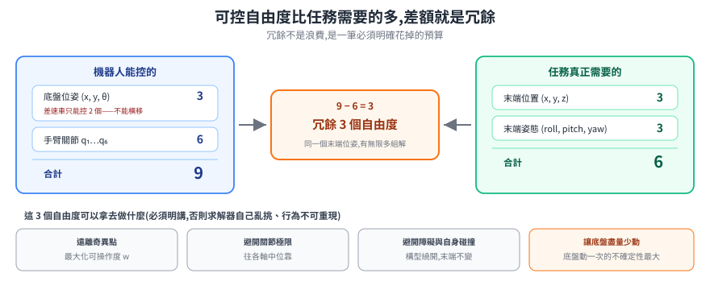
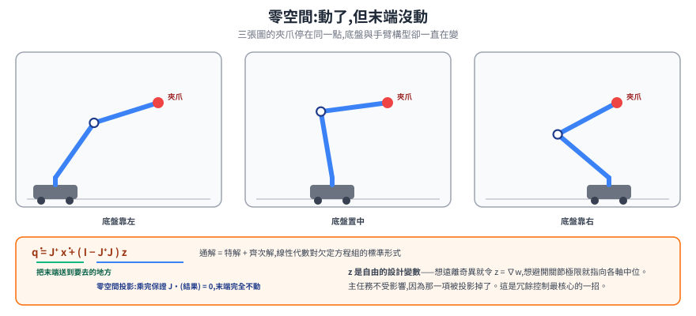
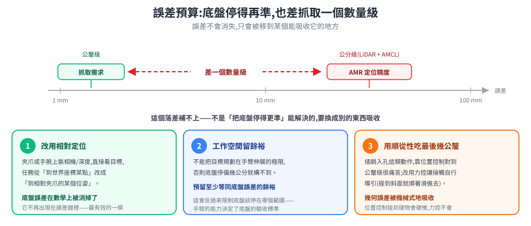
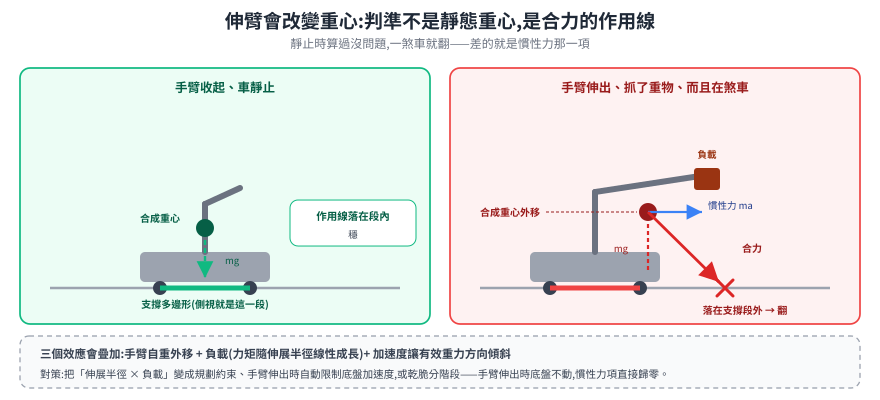

# 移動操作:底盤與手臂加起來,不是兩個問題並排

把一台手臂裝到搬運車上,直覺上是兩個已解決的問題疊在一起——底盤負責到位、手臂負責動作。實際做下去會發現三件本來不存在的事:自由度**加起來變得冗餘**(答案從有限多變成無限多)、底盤的定位誤差比抓取需要的精度**差了一個數量級**、手臂伸出去會**改變重心**讓車有翻的風險。

這篇處理的就是這三件「加起來才有」的問題。

> 前置:[手臂運動學](arm-kinematics.md)(Jacobian、奇異點、IK 多解)、[定位](../../10-core/30-navigation/localization.md)(AMR 的定位精度是多少)。
> 底盤那一半的內容在 [輪式 AMR](../wheeled-amr/)。

---

## 1. 冗餘:多出來的自由度必須明確分配

先把自由度算清楚。以「差速底盤 + 6 軸手臂」為例:

| | 可控自由度 | 說明 |
|---|---|---|
| 底盤位姿 | 3 | 平面上的 `(x, y, θ)`,但**差速車只能控 2 個**——不能橫移,這叫非完整約束 |
| 手臂關節 | 6 | 六個馬達 |
| **合計可控** | **瞬時 8、路徑上 9** | |
| **任務需要** | **6** | 末端位姿:位置 3 + 姿態 3 |

<p align="center"></p>

可控量多於任務量,差額就是**冗餘(redundancy)**。冗餘不是浪費——它是一筆可以拿去做別的事的預算:

- 讓手臂維持高[可操作度](arm-kinematics.md#4-jacobian同一個矩陣的三重身分),遠離奇異構型
- 避開關節極限,不要卡在某個軸的邊界
- 避開自身碰撞與環境障礙
- **讓底盤盡量少動**(底盤動一次的定位不確定性遠大於手臂關節動一次)

但它也帶來一個必須正面處理的代價:**解不再唯一,而且是無限多。** 如果不明確規定「多出來的自由度拿去做什麼」,求解器會自己挑一組——而且同樣的任務在不同時刻可能挑到不同組,系統行為不可重現。**冗餘系統一定要有一個明講的次要目標**,這不是最佳化的加分項,是可重現性的必要條件。

---

## 2. 零空間:冗餘怎麼被明確分配

回到那條速度映射 `J q̇ = ẋ`。當 `J` 是 `6 × n` 矩陣(6 列 = 任務維度、n 行 = 可控關節),而 `n > 6`時,這是一個**欠定**方程組——未知數比方程式多,解有無限多個。

線性代數對這種方程組的通解有標準形式:**特解 + 齊次解**。

```
q̇ = J⁺ ẋ  +  ( I − J⁺J ) z
     └─┬─┘     └────┬────┘
   把末端送到      不影響末端的
   要去的地方      那些關節運動
```

- `J⁺` 是 **偽逆(pseudo-inverse)**,它給出「所有能達成 `ẋ` 的解裡,關節動得最少的那一組」。
- `( I − J⁺J )` 是**零空間投影算子**。任意向量 `z` 被它一乘,結果**保證滿足 `J · (結果) = 0`**——也就是說,關節照著這個方向動,末端完全不動。

> 這個「保證」不必背,一行就能自己驗:`J(I − J⁺J) = J − JJ⁺J = J − J = 0`(用到偽逆的定義性質 `JJ⁺J = J`)。所以不管 `z` 取什麼,穿過 `J` 之後都是零向量——**關節在動,末端不動**,這就是「多出來的自由度可以拿去做別的事」在數學上的樣子。

<p align="center"></p>

**零空間的物理意義就是「動了但末端不動」的那些關節運動。** 冗餘的嚴格定義就是這個集合非空。

於是 `z` 變成一個自由的設計變數:想最大化可操作度就令 `z = ∇w`,往可操作度上升的方向推;想遠離關節極限就讓 `z` 指向各關節的中位。**主任務(末端要去哪)完全不受影響**,因為那一項被投影掉了。這是冗餘機器人控制最核心的一招。

> 手臂裝在會動的底盤上,零空間會大到很直觀:末端夾爪固定不動,底盤可以繞著目標小幅移動、手臂同步調整構型來補償。人拿螺絲起子鎖螺絲時身體會不自覺地換姿勢,而起子頭一直對著螺絲——同一件事。

---

## 3. 底盤與手臂怎麼協調:三種策略

| 策略 | 做法 | 什麼時候用 |
|---|---|---|
| **分階段(sequential)** | 開車到位 → 停穩 → 才動手臂 | 多數工業場景。最容易驗收,安全論證也最單純 |
| **分層(hierarchical)** | 底盤做粗定位,剩下的誤差交給手臂吸收 | 底盤定位精度不足以直接抓取時的標準解(見下一節) |
| **全身(whole-body)** | 底盤與手臂放進同一個最佳化問題一起解 | 要邊走邊動、或手臂單獨構不到目標、需要底盤一起讓位時 |

**為什麼多數場合分階段就夠——這是一個柵欄。** 看到「停下來才動手臂」很容易覺得保守、想改成邊走邊動。但停下來這個動作買到兩樣東西:

1. **切斷動態耦合**。底盤在加速時,對手臂而言就是基座在晃——那是一個未建模的擾動,而且會隨載重與地面狀況變。停穩之後,基座是慣性系,整套工業手臂的成熟控制方法直接可用。
2. **簡化安全論證**。「車在動」與「手臂在動」是兩種不同的危害,要分別做風險評估;同時發生時還要評估組合風險。分階段讓兩者不重疊,安全設計難度差很多。

要拆這道柵欄之前,得先能承擔這兩項成本。

---

## 4. 誤差預算:定位精度與抓取精度差一個數量級

這是移動操作最實際、也最常被低估的一題。

| | 典型量級 |
|---|---|
| AMR 用 LiDAR + AMCL 的定位精度 | **公分級** |
| 抓取一個工件需要的精度 | **公釐級** |

<p align="center"></p>

差距大到**不可能靠「把底盤停得更準」補上**。本筆記在[定位](../../10-core/30-navigation/localization.md)篇已經解釋過為什麼:AMCL 的精度受地圖解析度、感測雜訊、環境相似性限制,而回充對接這種需要 ±1cm 的動作,結論也是「AMCL 給不了,要另外靠近距離的標記」。抓取的要求比回充還嚴一個檔次。

**誤差不會消失,只會被移到某個能吸收它的地方。** 選哪一層吸收是設計決策,實務上有三條:

1. **改用相對定位(最有效)**。手臂或夾爪上裝相機/深度感測器,直接看目標,把任務從「移動到世界座標某點」改成「移動到相對夾爪的某個位姿」。這一改,底盤的絕對定位誤差**在數學上被消掉了**——它不再出現在誤差鏈裡。這也是為什麼移動操作平台幾乎都在手腕上裝相機(eye-in-hand)。
2. **工作空間留餘裕**。規劃時不能把目標放在手臂伸展的極限邊緣,否則底盤停偏幾公分就構不到。要預留至少等同底盤定位誤差的餘裕——這會反過來限制底盤該停在哪個範圍。
3. **用順從性吃掉最後幾公釐**。插銷入孔這類動作,靠位置控制對準到公釐級很痛苦;改用力控讓接觸自行導引(碰到斜面就順著滑進去),幾何誤差被機械式地吸收掉。位置控制碰到硬物會硬推,力控不會——這是力控在移動操作裡的核心價值。

---

## 5. 伸臂會改變重心:傾覆這件事

輪式底盤的靜態穩定判準很單純:**重心的鉛垂投影要落在支撐多邊形內**——四個輪子的接地點圍成的凸包。單獨一台 AMR 這條幾乎自動成立,因為重心低、輪距寬、質量分佈固定。

手臂一裝上去,「質量分佈固定」這個前提就沒了。

<p align="center"></p>

三個效應會疊加:

- **手臂自重外移**。手臂伸展時,它自己的質量重心離底盤中心越來越遠。
- **負載**。抓了東西之後,力臂末端多一個質量,而且力矩隨伸展半徑線性成長。
- **加速度**。底盤加減速或轉彎時,慣性力讓**有效重力方向傾斜**。所以真正的判準不是靜態重心投影,而是**合成力(重力 + 慣性力)的作用線**要落在支撐多邊形內。

第三點是最容易漏掉的:靜止時算過沒問題,一煞車就翻。實務上的對策是把它變成規劃時的約束——限制「伸展半徑 × 負載」的組合、手臂伸出時自動限制底盤加速度、或乾脆回到第 3 節的分階段策略(手臂伸出時底盤不動,慣性力項直接歸零)。

> 這裡跟四足/人形是同一個問題的不同難度。輪式的支撐多邊形固定不變,只要算合力落在哪;足式的支撐多邊形**隨步態一直在變**,判準要在每個接觸切換時重算——那才是 ZMP 那一套方法要處理的事。

---

## 6. 收斂:三件「加起來才有」的事

| 現象 | 根源 | 對策 |
|---|---|---|
| 解變成無限多、系統行為不可重現 | 可控自由度 > 任務自由度 | 用零空間投影明確指定次要目標 |
| 底盤停得再準也抓不到 | 公分級 vs 公釐級,差一個數量級 | 相對定位(把絕對誤差消掉)+ 工作空間餘裕 + 順從性 |
| 靜止時穩、一煞車就翻 | 合成力作用線離開支撐多邊形 | 伸展半徑 × 負載的約束、伸臂時限制底盤加速度 |

底盤那一半的問題,[輪式 AMR](../wheeled-amr/) 與[共通核心](../../10-core/)已經處理完;手臂那一半在[手臂運動學](arm-kinematics.md)。這篇只處理兩者相加才長出來的東西——而這三件事,恰好都不是把兩邊各自調好就會自動消失的。

---

## 7. 工具鏈:誰負責規劃、誰負責插值

ROS 2 生態的分工是清楚的,但**中間有一段是空的**,而那一段正好就是移動操作。

```
MoveIt 2 (move_group)        規劃出一串 waypoints
      ↓  FollowJointTrajectory action
ros2_control
  joint_trajectory_controller  在時間軸上做插值(預設 spline,保證速度連續)
      ↓  position / velocity / effort 硬體介面
馬達
```

底盤那邊是另一條並行的鏈:Nav2 出 `Twist` → `diff_drive_controller` → 輪子。兩條鏈各走各的。

MoveIt 2 提供四個規劃器 plugin,定位不同:

| plugin | 性質 | 適用 |
|---|---|---|
| `ompl_interface/OMPLPlanner` | 取樣式(randomized) | 預設;複雜環境找可行解 |
| `pilz_industrial_motion_planner/CommandPlanner` | 決定性,產生 LIN / PTP / CIRC | 工業軌跡,要可重現的直線與圓弧 |
| `stomp_moveit/StompPlanner` | 機率式軌跡最佳化 | 優化既有路徑 |
| `chomp_interface/CHOMPPlanner` | 梯度式軌跡最佳化 | 同上 |

可以串接——先用 OMPL 產生初解,再用 STOMP 優化。

**MoveIt Servo** 是另一條路徑:不先規劃再執行,而是直接串流速度指令,用於遙操作或視覺伺服。值得注意的是它**內建奇異點偵測,靠近時自動降速**——[手臂運動學](arm-kinematics.md#33-奇異點突然少一個方向)推導出「`J⁻¹` 會發散所以必須提前限速」這件事,在成熟的工具裡是預設行為。

### 空的那一段:官方沒有標準的移動底盤支援

MoveIt 官方的 Future Projects 頁面自己寫著:目前只有「a non-standard way to incorporate holonomic drive that requires modifying your robot model」,並說已在某個移動操作平台上做過初步工作,但要推廣到其他底盤還需要更多努力。

社群作法是替底盤造一個 planar virtual joint(x / y / θ 三自由度)接到 `odom` frame,再把它放進 planning group。可行,但那是繞路,不是官方支援的路。

**這件事反過來佐證了第 3 節那個柵欄**:業界大量採用「分階段」不只是保守,也是因為「底盤與手臂一起規劃」這條路在工具層面本來就沒鋪好。要走全身控制,得自己接。

---

## 8. 安全標準有一道空隙,而且是這一類機器人正好掉進去的那道

本筆記在[法規與認證](../../60-compliance/README.md)已經整理過移動機器人的安全線(ISO 3691-4 / ANSI R15.08)。手臂裝上來之後,會發現兩條線之間**沒有接起來**:

| 標準 | 管什麼 | 對「車 + 手臂」的態度 |
|---|---|---|
| **ISO 10218-1 / -2:2025**(第 3 版,取代 2011 年版) | 工業機器人(手臂)的安全 | 定義擴大到「fixed in place **or fixed to a mobile platform**」,涵蓋裝在移動平台上的手臂;但**明確不處理移動性本身造成的危害** |
| **ISO 3691-4:2023**(第 2 版) | 無人工業車輛的安全 | 歷來**不處理**「車上加裝手臂」這件事的危害 |
| **ANSI/RIA R15.08-1:2020** | 美規工業移動機器人(IMR) | **Part 1 明確定義 IMR Type C = AMR/AGV 平台 + 機械手臂 attachment**——把這個組合正面納入 |

一邊管手臂不管車會不會撞人,另一邊管車不管手臂會不會夾人,中間那塊「因為兩者組合才產生的危害」在 ISO 這條線上懸空。**美規的 R15.08 走得比較前面**,Type C 就是為這個組合設的;Part 2(系統整合,2023-09 發布)接著規範整合層。ISO 這邊已有新專案(ISO/NP 26058-1)在補這道縫。

> 實務上的意思:賣進歐系客戶時,「我的手臂過了 ISO 10218、我的車過了 ISO 3691-4」**不等於**這台組合機器的安全論證完整——組合才產生的危害(伸臂改變煞停距離、手臂在移動中掃到人、傾覆)得自己補風險評估。賣美系反而有現成的框架可以對。

至於協作模式,ISO/TS 15066 定義的四種——**Safety-rated Monitored Stop、Hand Guiding、Speed and Separation Monitoring、Power and Force Limiting**——其技術內容在 2025 年改版時被整合進 ISO 10218 系列的正式條文。

> **這裡有一個要誠實標的邊界**:TS 15066 這份文件本身是否已正式撤銷,可查到的公開來源說法不一致(有的寫已不再獨立存在,有的顯示 ISO 目錄仍列為 published 並登記了後繼專案 ISO/AWI 15066-1)。可以確定的是「技術內容已進 10218 正式條文」;**「TS 15066 已廢止」這句話目前查不到可靠依據,不要對客戶這樣講**。Power and Force Limiting 的力/壓力限值以身體部位分列,並區分 transient(短暫接觸)與 quasi-static(被夾住)兩種接觸型態——具體數值請以購買的標準原文為準,坊間流傳的數字多半來自二手彙整。

---

## 9. 實際在跑的平台

| 平台 | 構型 | 狀態 |
|---|---|---|
| **PAL Robotics TIAGo / TIAGo Pro** | 7 軸手臂(關節帶串聯彈性元件做力矩感測)+ 可升降軀幹 + 2 軸頭部;TIAGo Pro 單臂酬載 3 kg、臂展 96 cm | 在售,ROS 2 支援。官方稱 open-source 指的是**軟體**,不是整機硬體 |
| **Clearpath Ridgeback + UR5e / Franka Panda** | 全向底盤(mecanum)酬載 100 kg + 預先整合的手臂套件 | 在售(Clearpath 2023-10 起併入 Rockwell Automation) |
| **Hello Robot Stretch 3** | 升降 + 伸縮臂 + 底盤平移構成三個正交的類笛卡兒自由度,再加 3 軸手腕 + 夾爪 | 在售,軟體開源,官方標示「preliminary support for MoveIt 2」 |
| **MiR + Universal Robots(MC600)** | MiR600 底盤 + UR20/UR30,整體酬載可達 600 kg | 在售。兩家同屬 Teradyne |
| **Boston Dynamics Spot + Arm** | 四足平台 + 6 軸手臂,臂展 984 mm,伸出 0.5 m 時連續舉重 5 kg | 在售。**不是輪式**,支撐多邊形隨步態變化,第 5 節那套判準要換 |
| **Fetch** | 7 軸可反向驅動手臂,酬載 6 kg | **已終止**:2021 年被 Zebra 收購,2025-12 Zebra 宣布縮編該事業群,2026 年資產由 Skild AI 收購。原官方文件站已無法解析 |

Fetch 那一列值得單獨看一眼:它曾是研究界最常見的移動操作平台之一,現在文件站連 DNS 都查不到。**選平台時「公司還在不在」跟規格一樣是硬指標**——尤其這類機器的軟體堆疊高度依賴原廠。

---

## 10. 來源

- MoveIt 規劃器與 plugin 名稱:<https://moveit.ai/documentation/planners/>;MoveIt Servo(含奇異點自動降速):<https://moveit.picknik.ai/main/doc/examples/realtime_servo/realtime_servo_tutorial.html>
- MoveIt 官方承認缺移動底盤標準支援:<https://moveit.ai/documentation/contributing/future_projects/>
- `joint_trajectory_controller` 的插值職責:<https://control.ros.org/rolling/doc/ros2_controllers/joint_trajectory_controller/doc/trajectory.html>
- ISO 3691-4:2023:<https://www.iso.org/standard/83545.html>;ISO 10218:2025 改版重點:<https://www.controldesign.com/industry-news/news/55268769/iso-10218-update-makes-functional-safety-requirements-more-explicit>
- R15.08 IMR Type C 定義:<https://www.therobotreport.com/ansi-ria-r15-08-standard-redefines-industrial-mobile-robots-whats-new-and-why-it-matters/>;R15.08-2 發布:<https://www.automate.org/robotics/news/ansi-a3-r15-08-2-safety-standard-for-industrial-mobile-robot-systems-and-applications-now-available>;兩條線之間的空隙與 ISO/NP 26058-1:<https://blog.saphira.ai/mobile-robot-safety-standards-understanding-iso-3691-4-(driverless-industrial-trucks)-and-r15-08-(industrial-mobile-robots)-implementation>
- 四種協作模式:<https://www.universal-robots.com/blog/demystifying-cobot-safety-the-four-types-of-collaborative-operation/>
- 零空間投影的兩篇奠基文獻:Whitney 1969(偽逆解瞬時 IK)、Liégeois 1977(疊加零空間分量優化次要目標),脈絡整理見 <https://mosesnah-shared.github.io/robotics_null_space_projection.html>
- 可操作度:Yoshikawa, "Manipulability of Robotic Mechanisms", *IJRR* 4(2), 1985:<https://journals.sagepub.com/doi/10.1177/027836498500400201>
- 傾覆穩定度量:Papadopoulos & Rey 的 Force-Angle(ICRA 1996 / *Vehicle System Dynamics* 2000)<https://www.researchgate.net/publication/250050066_The_Force-Angle_Measure_of_Tipover_Stability_Margin_for_Mobile_Manipulators>;Moosavian & Alipour 的 Moment-Height Stability(IROS 2006)<https://ieeexplore.ieee.org/document/4059314/>
- 平台:TIAGo <https://pal-robotics.com/robot/tiago-pro/>、Ridgeback <https://clearpathrobotics.com/ridgeback-indoor-robot-platform/>、Stretch 3 <https://hello-robot.com/>、MC600 <https://www.automatedwarehouseonline.com/mc600-mobile-manipulator-combines-ur-cobot-with-mir-base/>、Spot Arm <https://support.bostondynamics.com/s/article/Spot-Arm-Specifications-151694>、Fetch 資產易主 <https://www.therobotreport.com/skild-acquires-fetch-robotics-assets-from-zebra-automation/>

> **待查證**:ISO 10218:2025 的精確發布月日(來源之間有 1 月底 / 2 月 / 4 月生效三種說法,年份與第 3 版可確定);R15.08 Part 3 是否已正式發布;傾覆穩定度沒有任何 ISO / ANSI 標準明文強制特定公式——這是從「查不到」推論的,不是查到某條文明說。

---

## 11. 還沒寫的

- **抓取與力控** — 夾爪與吸盤的取捨、力/力矩感測、阻抗與導納控制的差別。第 4 節提到的「順從性吃掉最後幾公釐」要在那裡展開。
- **視覺伺服** — 第 4 節的「相對定位」怎麼落地:eye-in-hand 標定、影像式 vs 位置式伺服。

進度見 [PLAN.md](../../../PLAN.md)。
