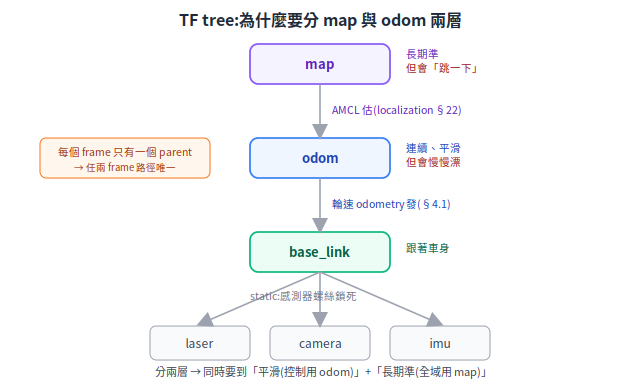
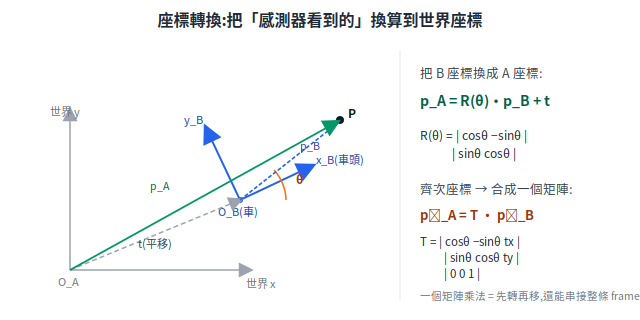

# 座標轉換與 TF

機器人身上每個感測器裝在不同位置、朝不同方向;地圖、里程、車體又各有原點。一筆「LiDAR 看到前方 2m 有牆」要變成「這牆在地圖的哪裡」,中間隔著好幾次座標換算。這篇從這個根本問題出發,講 ROS 的座標慣例、2D 剛體變換的數學(為什麼用齊次矩陣),以及 tf2 怎麼用一棵樹管理所有座標系。

> 差速車本身的運動學(輪速 ↔ v/ω)見 [底盤 §1.1](../10-hardware/chassis-and-drivetrain.md)、[下位機運動控制](../20-firmware/low-level-control.md);本篇專講「座標系之間怎麼換算」。
> 延伸閱讀:[定位](localization.md)、[SLAM](slam-mapping.md)、[路徑規劃](path-planning.md)。

---

## 1. 根本問題:每個量測都「只對某個座標系」有意義

LiDAR 回報「正前方 2m 有牆」,這個「2m、正前方」是相對 **LiDAR 自己**的。但 LiDAR 鎖在車身某個位置、相機在另一個位置、IMU 又在別處;而「我在地圖哪裡」是相對 **地圖**的。要回答「這牆在地圖哪裡、要不要閃」,就得把這筆資料從感測器座標系,一路換算到車體、再到地圖。

座標轉換就是這個換算;**TF(transform)** 是 ROS 用來集中管理「所有座標系彼此關係、且隨時間更新」的系統,tf2 是其第二代實作。REP-103 開宗明義:單位與慣例不一致是整合 bug 的常見來源——統一慣例 + 集中管理變換,就是為了消除這類風險。

## 2. ROS 座標慣例(REP-103)

要大家接得起來,先約定座標軸與單位:

- **軸向(相對車體)**:**x 朝前、y 朝左、z 朝上**,全部**右手系**。
- **單位**:SI——長度公尺、角度**弧度(rad)**、時間秒。角度逆時針為正(右手定則)。
- **旋轉表示優先序**:四元數(quaternion,緊湊、無奇異點)> 旋轉矩陣 > 固定軸 roll/pitch/yaw;一般 Euler 角不建議(24 種衝突慣例)。
- **特殊後綴**:相機光學 frame 加 `_optical`(z 朝前、x 朝右、y 朝下,跟車體慣例不同,因為光軸朝前);地理用 `_ned` 等。

## 3. REP-105:frame 鏈,以及為什麼分 map 與 odom 兩層

REP-105 規範移動平台的座標鏈:**`map → odom → base_link`**(再往下接各感測器)。

- **base_link**:剛性固定在車身上的座標系,跟著車走。
- **odom(里程)**:世界固定 frame,**連續、平滑,但會無界漂移**——它由輪速/視覺/IMU 累積推算,誤差隨時間累積,但不會突然跳。
- **map**:世界固定 frame,**長期不漂,但會離散跳變**——定位元件(如 AMCL)不斷依感測重算位姿來消除漂移,修正的瞬間位姿會「跳一下」。

**為什麼要分這兩層?**(第一性原理)因為導航同時要兩種互斥的特性:

- **控制迴路要「平滑」**:控制器吃的位姿不能突然跳,跳一下控制就抖。→ 用 **odom**(連續)。
- **全域定位要「長期準」**:長距離規劃不能讓誤差無限漂。→ 用 **map**(長期準)。

把兩種需求拆成兩層,就能各取所需:近程平滑用 odom、全域準確用 map。

<p align="center"></p>

**一個關鍵權責**:定位元件**不直接發 map→base_link**,而是先收 odom→base_link(里程發的),再反推、廣播 **map→odom**。這樣才能維持「每個 frame 只有一個 parent」(base_link 的 parent 只能是 odom)。

## 4. 座標轉換數學:旋轉 + 平移,合成一個矩陣

兩個座標系之間的剛體變換 = **旋轉 + 平移**。一個點在 B 系的座標 `p_B`,換算到 A 系:

```
p_A = R(θ) · p_B + t          R(θ) = | cos θ  −sin θ |   (逆時針為正)
                                      | sin θ   cos θ |
```

這裡 **θ = B 系 x 軸相對 A 系 x 軸的夾角**(B 在 A 中的朝向),`t` 是 B 原點在 A 中的位置——θ 與 t 合起來就是「B 在 A 中的位姿」。**齊次變換(homogeneous transformation)** 把「先轉再移」合併成單一矩陣乘法:點補一維成 `(x, y, 1)`,變換寫成 3×3 矩陣 `T`。

<p align="center"></p>

**為什麼用齊次座標?**(第一性原理,三個都很實用)

1. **統一**:旋轉本是乘法、平移本是加法;補一維後平移也變乘法,兩者用同一種運算。
2. **可串接**:多段變換直接連乘——`T_A←C = T_A←B · T_B←C`。整條 frame 鏈(感測器→車體→里程→地圖)就是一串矩陣相乘。
3. **可逆**:反方向換算只要取逆矩陣 `T_B←A = (T_A←B)⁻¹`。

tf2 在做的正是這件事:把樹上各段變換連乘(必要時取逆),算出任兩 frame 之間的總變換。

## 5. tf2:用一棵「樹」管理所有座標系

- **為什麼是樹(每個 frame 只有一個 parent)?** 若一個 frame 有兩個 parent,從不同路徑算到它會得到**互相衝突**的變換,系統無法決定哪個對。樹結構保證任兩 frame 之間**路徑唯一**,變換可確定地連乘得到、不會出現閉環矛盾。
- **查詢**:`lookupTransform(target, source, time)` 沿樹找唯一路徑、連乘各段、回傳總變換。
- **時間戳(為什麼要)**:感測資料有延遲。LiDAR 在 t 時刻掃到的點,要用 **t 時刻**的車體位姿換算,不是「現在」的——車一直在動,用錯時刻就算錯位置。所以 tf2 為每段變換存帶時間戳的快照(預設緩衝 ~10 秒),查詢時內插到指定時刻;`time=0` 代表「最新可用」。
- **static transform**:不隨時間變的關係(LiDAR 螺絲鎖死在車上)用靜態變換廣播,省儲存與發布開銷。

## 6. 與筆記其他部分的連結

- [odometry(§4.1)](../20-firmware/low-level-control.md) 算出來的就是 **odom→base_link** 這段,持續發布給 tf2;它連續、平滑、會漂——正好對應 REP-105 的 odom。
- [AMCL(§22)](localization.md) 估的是 **map→odom** 的修正量;它依雷射在已知地圖上重定位,讓 map→base_link 長期不漂——正好對應 REP-105「定位元件發 map→odom 而非 map→base_link」的權責。

## 7. 來源

- [REP-103(座標慣例/單位)](https://www.ros.org/reps/rep-0103.html)、[REP-105(frame 命名/關係)](https://www.ros.org/reps/rep-0105.html)
- [tf2 概念(ROS2)](https://docs.ros.org/en/humble/Concepts/Intermediate/About-Tf2.html)、[tf2 and time](https://docs.ros.org/en/humble/Tutorials/Intermediate/Tf2/Learning-About-Tf2-And-Time-Py.html)
- [Nav2 setup: transforms](https://docs.nav2.org/setup_guides/transformation/setup_transforms.html)
