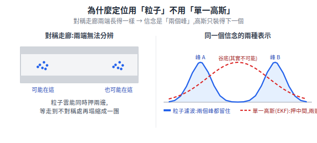
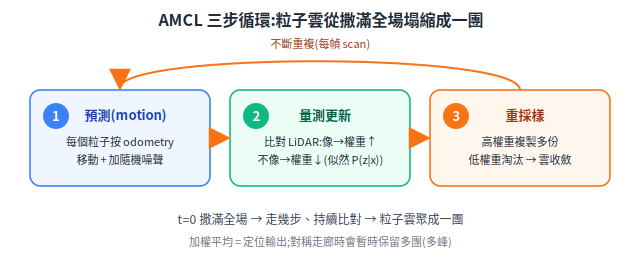
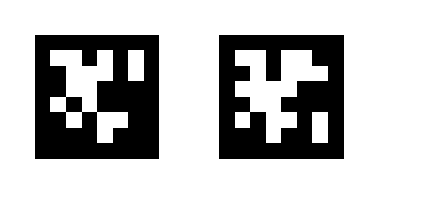

# 定位:AMCL、Odometry 與地標定位

地圖建好之後,機器人怎麼知道「我現在在地圖的哪裡」?本篇把三種互補的定位手段放在一起:odometry(里程推算,相對定位、會累積誤差)、AMCL(已知地圖下用 LiDAR 即時匹配的粒子濾波)、以及地標定位(用相機看 AprilTag 之類的目標物反推絕對位姿)。三者搭配才穩。

> 章節編號沿用原始《送餐機器人基礎原理補充》,方便與舊文件對照。
> 延伸閱讀:[SLAM 建圖](slam-mapping.md)、[感測器](../10-hardware/sensors.md)、[編碼器](../10-hardware/encoders.md)

---

## 22. AMCL 定位演算法(圖解)

### 22.1 問題:已知地圖,我在哪?

AMCL = **A**daptive **M**onte **C**arlo **L**ocalization。Monte Carlo = 用大量隨機樣本逼近答案;這裡的樣本叫**粒子 (particle)**:

```
一個粒子 = 一個「機器人可能在這」的假設 = (x, y, θ, 權重w)
AMCL 同時養 500~2000 個粒子,合起來表示「位置的機率分布」
```

**為什麼用一堆粒子,而不像 EKF 用一個高斯就好?**(第一性原理)因為定位的機率分布可能是**多峰的**:對稱的長走廊兩端、四個一模一樣的路口,從感測器看完全一樣 → 「我可能在 A、也可能在 B」是兩個分開的峰。單一高斯只有一個峰,被迫把信念押在兩峰中間(那裡其實不可能),兩邊都錯;粒子可以同時撒在 A 和 B,等車走到不對稱的地方,錯的那群自然被淘汰、塌縮成一團。**全域定位、綁架恢復需要多峰表達能力,所以用粒子濾波而非 EKF**——這也呼應 [高斯第一性原理](../90-foundations/gaussian-from-first-principles.md):高斯的長處是單峰下好算,代價就是裝不下多峰。

<p align="center"></p>

### 22.2 核心循環:三步驟不斷重複

<p align="center"></p>

②的圖像——兩個粒子的比對:

```
實際 LiDAR 看到:左 1.0m 有牆、前 3.2m 有牆

粒子 A(假設在走道中間):          粒子 B(假設在角落):
 按地圖計算應看到:                 按地圖計算應看到:
 左 1.1m 牆、前 3.0m 牆            左 0.3m 牆、前 0.5m 牆
 → 跟實測很像 → 權重 ↑↑           → 完全不像 → 權重 ↓↓ (下輪淘汰)
```

整體收斂過程:

```
 t=0 不確定位置:          t=1 走了幾步後:        t=2 持續比對後:
 粒子撒滿全場              不像的被淘汰            粒子雲聚成一團
 ░·░·░·░·░·░              ░░░░░░░░░░░            ░░░░░░░░░░░
 ·░·░·░·░·░·              ░░··░░░··░░            ░░░░░▓░░░░░
 ░·░·░·░·░·░              ░░·░░░░·░░░            ░░░░▓◉▓░░░░  ← 加權平均
 ·░·░·░·░·░·              ░░░░·░░░░░░            ░░░░░▓░░░░░     = 定位輸出
```

### 22.3 「Adaptive」與幾個關鍵行為

| 機制 | 內容 |
|---|---|
| 自適應粒子數 (KLD sampling) | 不確定時自動增加粒子(撒網),收斂後減少(省 CPU)——這就是 A 的由來 |
| 初始位姿 | 部署時通常**給初始位姿**(RViz 點一下 / API 設定),粒子只撒在附近,幾秒收斂;不給就是全域定位,要走一段路才收斂 |
| 綁架問題 (kidnapped robot) | 機器人被人抬走再放下 → 粒子雲全在錯的地方;AMCL 靠「注入少量隨機粒子」有機會恢復,但慢——實務上提供「重設初始位姿」操作比較實際 |
| 與 odometry 的關係 | ①步直接消費 §20 上報的 odometry;odometry 越準,粒子噪聲可調越小,定位越穩——又一次回扣 §4.1 |

### 22.4 餐廳場景的調參重點

先講第一性原理:②步那個「像就加權」,**權重其實是一個明確的數——似然 `P(z | x)`**:假設粒子真的在位姿 x,觀測到當前這幀 scan `z` 的機率有多大。`z_hit/z_rand/z_short` **不是憑感覺調的旋鈕,而是這個似然的「混合量測模型」拆解**——把「一條雷射光束量到的距離」拆成幾種來路的機率疊加:

```
P(z|x) = z_hit  · 量到的點剛好打在地圖的牆上(高斯峰,主成分)
       + z_rand · 純隨機雜訊(均勻背景)
       + z_short· 比地圖更近就中標(有未建圖的東西擋在前面,如行人)
       (+ z_max · 打不到回波 = 量到最大量程)
```

人群是最大干擾:行人擋住 LiDAR 時,實測 scan 跟地圖必然不像,所有粒子權重一起被拉低。對照上面的拆解就知道怎麼調:**調高 `z_rand`/`z_short`**,等於告訴模型「量到比地圖近、或對不上,有可能是行人而非我站錯位置」,於是被遮擋的光束被解釋成雜訊/前方障礙,而不是懲罰所有粒子:

```
z_hit  :量到的點跟地圖吻合的權重(主成分)
z_rand :「隨機雜訊」成分 → 調高一點,讓被行人擋住的光束
         被解釋成雜訊,而不是懲罰所有粒子
z_short:量到比地圖近(= 有東西擋在前面)的寬容度
```

兩個嚴謹補充:(1) 四個權重**加總為 1**(機率歸一),所以「調高 `z_rand`」實際上是提高雜訊成分的相對比重、壓低其他項,不是各自獨立任意放大。(2) 上面是**單一光束**的似然;**整幀** scan 的似然 = 各光束似然**相乘**(假設彼此獨立),這才是 §22.2 ②「整幀比對」的數學形式。

> 術語註:AMCL 預設常用 `likelihood_field`(似然場)模型——對「每個 scan 點到最近障礙的距離」做高斯;`z_short`/`z_max` 嚴格屬另一套 `beam` 模型的成分,這裡借 beam 模型來解釋「前方遮擋」的直覺,結論(調高容忍度抗行人)一致。

實務組合:離峰建一張乾淨地圖(§21.4)+ 調高 `z_rand`/`z_short` 容忍動態遮擋 + odometry 標定紮實 → 人群中定位依然穩。這三件事分別對應 §21、本節、§4.1——導航品質從來不是單一模組的事。

---


## 27. Odometry 是什麼:定義、字源、家族與本質限制

### 27.1 定義與字源

**Odometry(里程推算)= 靠累積「自己的運動量測」來推算「我從起點移動到了哪裡」。**

字源:希臘文 *hodos*(路)+ *metron*(量測)——跟汽車儀表板的 odometer(里程表)同字。差別是里程表只累積「走了多遠」(一個數字),機器人的 odometry 累積完整位姿 (x, y, θ):走了多遠、往哪走、現在朝哪。

它回答的問題鏈:

```
encoder 說:這 10ms 左輪滾 3.1mm、右輪滾 3.3mm     (§19/§20 量測)
   → 運動學正解:車體前進 3.2mm、左轉 0.04°        (§7 幾何)
   → 累積積分:從開機點算起,我在 (x=4.21m, y=1.37m, θ=87°)  (§4.1 公式)
```

航海時代叫 **dead reckoning(航位推算)**:沒有 GPS 的船,靠「航速 × 時間 + 航向」逐段累加推算船位——odometry 就是它的機器人版,encoder 取代了測速繩與羅盤。

### 27.2 Odometry 是一個家族

「靠量自己的運動來推位置」的思路,不限於輪子:

| 類型 | 量測來源 | 特性 |
|---|---|---|
| **Wheel odometry**(本文件的主角) | 輪式 encoder | 便宜、高頻、直線準;**打滑就錯**(§10.3) |
| IMU(慣性推算) | 陀螺儀/加速度計積分 | 角度好;位置二次積分發散,不能單用(§3.3) |
| Visual odometry | 相機連續影格特徵追蹤 | 不怕打滑;怕快速移動、無紋理牆面 |
| LiDAR odometry | 連續 scan 之間的 matching | 即 §21.2 的 scan matching 用在「相鄰兩幀」 |

實務上 `/odom` 常是 wheel + IMU 的 EKF 融合結果(§3.3 的「距離信 encoder、角度信陀螺儀」)。

> EKF 為什麼能把兩個都不準的來源融成更準的?第一性原理(信念是高斯、預測=線性推進、更新=兩高斯相乘)見 [高斯分布:第一性原理 §3.2](../90-foundations/gaussian-from-first-principles.md#32-卡爾曼濾波--ekf--用-p1--p2--p3機器人定位的核心)。

### 27.3 本質限制:相對定位,誤差只增不減

odometry 是**相對定位**——一切從開機點累積,每一步的小誤差(量化、打滑、標定偏差)**永久留在總和裡**:

```
誤差成長示意:
 走 1m   → 偏 1cm          odometry 自己永遠不知道自己偏了,
 走 10m  → 偏 12cm          也沒有任何機制能把誤差消掉——
 走 100m → 偏 1.5m + 方向歪  它只會越走越錯(漂移 drift)
```

所以導航架構永遠是「**odometry(高頻、平滑、短期準)+ 絕對定位修正(低頻、長期準)**」的搭配:AMCL 對地圖比對(§22)負責把累積誤差週期性拉回。兩者關係像手錶與電台報時——手錶走時靠自己(會漂),每天對一次報時(歸正)。

一句話總結:**odometry = 用自己的運動量測做積分的相對定位;快而平滑但必漂移,所以永遠搭配一個絕對定位來源使用。**

---


## 28. 地標定位:用相機看目標物反推自己的位置

> 📐 **進階,初讀可跳過。** 這節最長、最深(含 PnP、相機內參、手眼標定、6-DOF 位姿),屬於「需要時再來查」的參考。先掌握 §22 AMCL 與 §27 odometry 即可建立定位的基本概念。

> 問題:可以用深度相機偵測「已知位置的目標物」,反推並強制修正自己的位置嗎?
> 答案:可以,這叫**地標定位 (landmark-based localization)**,是成熟且廣泛部署的手法——它就是 §27 說的「絕對定位來源」的另一種實現,跟 AMCL 並列。

### 28.1 原理:已知地標在地圖哪裡 + 量到地標在我的哪裡 → 反推我在哪

```
地圖(部署時登錄):   地標 M 固定在世界座標 (10.0, 5.0),朝向已知
相機當下量到:        M 在我前方 2.0m、偏右 15°,且我看它的角度是 30°
反推(座標變換):     我必然站在世界座標的 (8.1, 4.6),朝向 75°
                              │
                              ▼
            用這個結果「強制定位」:重設 AMCL 粒子雲 / 餵給 EKF
```

跟 AMCL 的本質差異:AMCL 是「拿整幀 scan 跟整張地圖**機率比對**」,地標定位是「認出一個**唯一已知**的東西,幾何反算」——後者沒有多義性,一眼就是絕對位置,所以特別適合「強制」場景。

### 28.2 實作光譜:從貼碼到自然地標

| 方案 | 做法 | 精度/成本 |
|---|---|---|
| **人工標記 (fiducial marker)**:AprilTag / ArUco | 場域貼黑白方塊碼,每張碼 ID 唯一、尺寸已知;單目相機偵測四角 → PnP 解算 → 相對位姿;深度相機可再用深度值強化距離估計 | cm 級;成本 = 貼紙,演算法現成(OpenCV / `apriltag_ros`) |
| 天花板碼(歷史主流) | 碼貼天花板、相機朝上——天花板永遠不被人群遮擋。**早期送餐機器人(Pudu/Keenon 初代)正是用這招**,LiDAR SLAM 成熟後才退居輔助 | 部署工程較大,但餐廳人群中極穩 |
| 自然地標 / 視覺重定位 | 不貼碼,預先建視覺特徵地圖,比對當下影像特徵反推位姿(visual place recognition / relocalization) | 免施工,但受光照、視角、場景變動影響大 |
| 反光柱(LiDAR 版地標) | 高反射率柱子,LiDAR 強度值直接認出 | 工業 AGV 經典做法(對應 §18.3 的 ISO 3691-4 世界) |

### 28.3 「強制定位」的正確姿勢:離散重設,不要連續打架

量到地標位姿後,有兩種用法,**選一種,不要混**:

1. **離散重設 (re-seed)**:把結果發到 AMCL 的 `/initialpose`(或同等 API),粒子雲整團搬過去重新收斂。適合:開機初始化、§22.3 的綁架恢復、進出電梯/無特徵長廊後的歸位。
2. **連續融合 (fusion)**:把地標觀測當成一路絕對量測,跟 odometry 一起進 EKF(`robot_localization` 支援 pose 輸入)。適合:地標夠密、希望平滑修正的場合。

反模式:AMCL 正常運作中,粗暴地高頻覆寫位姿 → 兩個定位源互相拉扯,路徑規劃跟著抖。**地標是「校正點」,不是第二套常開定位**(除非整套就設計成地標主定位,如天花板碼方案)。

### 28.4 送餐機器人實際用在哪

| 場景 | 為什麼用地標而不是 AMCL |
|---|---|
| **回充對接**(§2.5 的二期項目) | 對接要 ±1cm/±1°,AMCL 給不了;充電樁上的標記/IR 信標做最後 50cm 的精確伺服 |
| 開機初始位姿 | 停機位貼一張碼,開機看一眼即完成初始化,免人工在 UI 點位置 |
| 電梯內/跨樓層 | 電梯轎廂無地圖特徵且樓層切換,出電梯看碼歸位 |
| 長走廊/玻璃帷幕區 | LiDAR 特徵貧乏(§22 的多義性、§23.4 玻璃問題),走廊中段補一張碼 |

設計建議:本專案以「LiDAR + AMCL 為主、AprilTag 為輔(回充對接 + 開機初始化 + 特徵貧乏區補強)」——跟頭部產品(§24)的演進路線一致:標記從「主定位」退役後,正是在這些角落繼續服役。

### 28.5 常見疑問:看一張碼,能知道車的「朝向歪了多少」嗎?

**能——方形標記給的是完整 6 自由度位姿(位置 + 姿態),不只位置。** 機制有兩層:

**(1) 透視變形編碼了相對姿態。** 標記的實體尺寸與正方形形狀已知;相機看到的四個角點若不是正正方方,變形量就唯一對應「相機從什麼角度看它」:

```
正對著看:        從右側斜看:           碼在畫面中的梯形變形,
 ┌──────┐         ┌────┐               配合已知實體尺寸與相機內參,
 │ ▓▓▓▓ │         │▓▓▓ │╲              用 PnP 解算 → 相機相對標記的
 │ ▓▓▓▓ │         │▓▓▓ │ ╲             完整旋轉 R + 平移 t(6-DOF)
 └──────┘         └────┘  ╲
4 個角點對稱      4 個角點呈梯形 → 歪多少角度,算得出來
```

**(2) 圖案不對稱消除了 90° 模糊。** 純正方形轉 90° 看起來一樣;所以 QR code 有三個角的回字定位點(finder patterns)、AprilTag 的 ID 圖案本身不對稱——「碼的上下左右」唯一可辨,於是「車相對碼轉了幾度」也唯一。倉儲 AGV(Kiva/Geek+ 型)地面貼 QR 正是同時讀「位置 + 自身航向」,每經過一張碼就把 odometry 的角度漂移歸零。

**直覺哪裡來的、又哪裡對**:這個疑問對「點狀地標」完全成立——一根反光柱、一個 RFID 標籤是一個點,單次觀測只能給方位距離,給不了車的朝向;磁條導引也只知道「偏離帶子多少」。**朝向資訊來自「地標本身有形狀和方向性」**,方形碼恰好兩者都有。

要注意的真實限制是**精度退化**:碼離得遠、在畫面裡很小時,透視變形微弱,解出的姿態角會抖、甚至出現正反兩解跳變(pose ambiguity)——所以 AprilTag(角點定位精度與抗模糊性為位姿估計優化)比 QR code(為資料儲存設計)更適合定位用途;QR 適合「掃碼取資訊」,AprilTag 適合「量位姿」。回充對接把碼貼在 50cm 內的近距離用,正是讓透視變形夠明顯、姿態解夠穩。

### 28.6 方法詳解:從一張影像到車輛位姿的五步

> 以 AprilTag + 單目相機為例;深度相機的 RGB 流程相同,深度值作為第 ③ 步的額外約束。

**事前準備(各做一次)**

- **相機內參標定 (camera intrinsic calibration)**:用棋盤格拍 20~30 張,解出焦距 (fx, fy)、光心 (cx, cy)、鏡頭畸變係數。這描述「3D 點如何投影到像素」,是後面一切幾何的前提(OpenCV `calibrateCamera` / ROS `camera_calibration` 包)。
- **登錄地標**:量好每張碼的實體邊長 s,與它在地圖座標系的位姿(貼哪、朝哪),存成設定檔。
- **手眼標定 (extrinsic)**:量出相機相對車體中心 (`base_link`) 的安裝位姿,寫進 URDF/TF(§3.3)。

**線上五步(每幀影像)**

```
① 偵測角點          ② 解碼 ID           ③ PnP 解算
 影像 → 二值化 →     讀內部圖案 →        4 組「3D↔2D」對應
 找四邊形輪廓 →      這是 23 號碼 →      → 解出 R, t
 角點亞像素精修      查表:23 號在地圖     (相機看碼的位姿)
                    (10.0, 5.0) 朝南
        │                │                   │
        ▼                ▼                   ▼
                ④ 座標鏈串接:T(map→robot) =
                T(map→marker) · T(marker→camera) · T(camera→base_link)
                  查表(事前)      ③的逆          手眼標定(事前)
                        │
                        ▼
                ⑤ 投用:發 /initialpose 重設 AMCL,或進 EKF 融合(§28.3)
```

**③ PnP 的原理(不需要解,需要懂它在解什麼)**

PnP = Perspective-n-Point:已知 n 個點的 3D 座標與它們的 2D 像素投影,反求相機位姿。對方形碼,n = 4:

```
3D(標記自己的座標系,邊長 s 已知):     2D(影像中偵測到的像素):
  P1 = (-s/2, +s/2, 0)  左上              p1 = (412, 233)
  P2 = (+s/2, +s/2, 0)  右上              p2 = (561, 241)
  P3 = (+s/2, -s/2, 0)  右下              p3 = (553, 388)
  P4 = (-s/2, -s/2, 0)  左下              p4 = (405, 379)

求:旋轉 R 與平移 t,使得「P_i 經 R,t 變換再投影」最貼合 p_i:
     p_i ≈ K · (R · P_i + t)        K = 內參矩陣(①事前標定那個)
```

四點共面有封閉解(平面 PnP,如 IPPE 演算法),`cv2.solvePnP(..., SOLVEPNP_IPPE_SQUARE)` 一行呼叫。直覺:**「多大」決定多遠(t),「多歪的梯形」決定角度(R)**——§28.5 的透視變形在這裡變成方程式。

**工程要點**

| 要點 | 原因 |
|---|---|
| 角點要做亞像素精修 (sub-pixel refinement) | 1 px 的角點誤差在 2m 外會放大成數 cm 的位姿誤差 |
| ID 解碼放在 PnP 前 | 先確認「這真的是 23 號碼」再算,避免誤認海報、地磚花紋 |
| 連續多幀取中位數/濾波後再投用 | 單幀姿態抖(§28.5 的 ambiguity);重設 AMCL 這種「強制」動作要用穩定值 |
| 整套用現成包 | `apriltag_ros` 直接輸出 TF,①~③ 全包;自己要寫的只有 ④⑤ 的投用邏輯 |

### 28.7 AprilTag 是 QR code 嗎?——不是,設計目的相反

兩者同屬「黑白方塊視覺標記 (fiducial marker)」家族,但一個為**存資料**設計、一個為**量位姿**設計:

```
QR code(存資料):                AprilTag(量位姿):
 ┌─────────────┐                 ┌─────────────┐
 │▛▜ ▖▗▘▙ ▛▜  │                 │█████████████│
 │▙▟ ▘▖▗▝▖ ▙▟ │← 模組極小極密    │█ ▓▓  ▓▓   █│← 格子極大極粗
 │ ▗▘▙▗▖▛▗▘▖  │  (21×21 起跳,   │█   ▓▓  ▓▓ █│  (例 6×6 資料格)
 │▖▝▗▘▖▙▗▘▝▗▖ │   可達 177×177)  │█ ▓▓   ▓▓  █│
 │▛▜ ▘▗▖▝▗▘▙  │                 │█  ▓▓ ▓▓ ▓▓█│
 │▙▟ ▗▘▝▖▗▘▖  │← 三個回字       │█████████████│← 一圈粗黑邊框:
 └─────────────┘   定位點         └─────────────┘   專為角點偵測設計
 容量:數百~3KB(網址、文字)      容量:只有一個 ID(數百~數萬種)
 用途:掃碼付款、取連結            用途:機器人位姿估計、AR、相機標定
```

| | QR code | AprilTag |
|---|---|---|
| 設計目的 | 儲存資料 | 位姿估計(密西根大學 APRIL 實驗室為機器人開發) |
| 資料量 | 大(KB 級) | 極小(一個 ID 編號) |
| 模組密度 | 密 → 必須近距離、高解析度才讀得到 | 粗 → **遠距離、低解析、輕微失焦都偵測得到** |
| 角點品質 | 為解碼設計,角點精度普通 | 粗黑邊框專為亞像素角點偵測設計(§28.6 ①) |
| 抗模糊/運動 | 差 | 好(機器人在動,這很關鍵) |
| 誤偵測防護 | checksum 保資料 | 編碼族設計保「不會把雜物認成 tag」(如 tag36h11 漢明距離 11) |

真實的 AprilTag 長這樣(官方 tag36h11 族,左 ID=0、右 ID=1;圖檔取自 [AprilRobotics/apriltag-imgs](https://github.com/AprilRobotics/apriltag-imgs)):



讀圖重點:(1) 外圈完整一圈粗黑邊框——PnP 用的四個角點就來自它;(2) 內部 6×6 格只編一個 ID,圖案不對稱——這就是 §28.5「消除 90° 模糊」的具體長相;(3) 兩個 ID 的圖案差異很大(漢明距離設計)——拍糊了也不會把 0 認成 1。實際部署列印時注意:**邊長要量「黑框外緣」**填進設定檔(PnP 的 s,§28.6),且紙面要平整——皺褶直接破壞透視幾何。

互補使用的實務:**定位用 AprilTag,人機介面用 QR**(顧客掃碼點餐、機台掃碼綁定)。倉儲 AGV 地面碼很多用 DataMatrix/QR 變體,是因為他們同時要在碼裡存「這是哪一格」的資料且距離極近(相機朝下 30cm)——送餐機器人的牆面/充電樁標記沒有這個需求,AprilTag 是正解。

