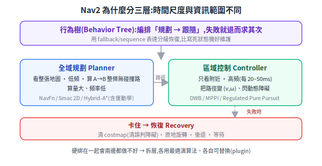
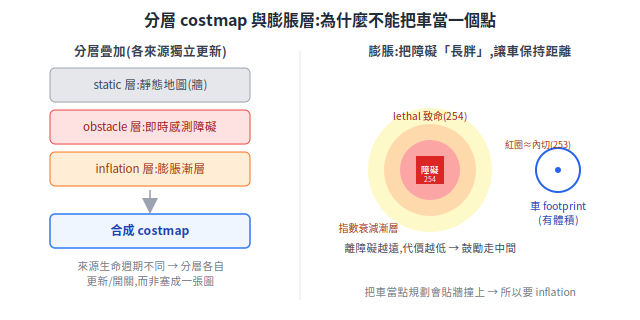

# 路徑規劃與軌跡(Nav2)

有了地圖([SLAM](slam-mapping.md))和定位([localization](localization.md)),接下來要回答:從 A 點怎麼算出一條安全到 B 點的路、怎麼驅動車跟著走、卡住了怎麼辦。這篇從這三個問題出發,講 Nav2 的三層架構、costmap 為什麼要膨脹、以及全域規劃器與區域控制器各自解決什麼。

> 前置:[座標轉換與 TF](kinematics-and-coordinate-transforms.md)(規劃都在 map frame 裡做)、[SLAM](slam-mapping.md)、[定位](localization.md)。

---

## 1. 三個問題 → 三層架構

導航要回答三個不同層次的問題,Nav2 對應切成三層,由行為樹編排:

1. **整體該走哪條路?** → **全域規劃(Planner)**:看整張地圖,算一條 A→B 無碰撞路徑。
2. **此刻該下什麼速度?** → **區域控制(Controller)**:把路徑變成即時 `(v, ω)` 去跟隨,同時閃開臨時障礙。
3. **卡住怎麼辦?** → **行為樹 + 恢復(Recovery)**:編排規劃→跟隨,失敗時觸發恢復。

**為什麼要分這三層?**(第一性原理)因為它們的**時間尺度與資訊範圍不同**:全域規劃計算量大、頻率低(看整張地圖找長路徑);區域控制計算量小、頻率高(每 20–50ms 就要更新速度,只看附近)。硬綁在一起會兩邊都做不好——拆層讓每層用最適合的演算法、各自能獨立替換(plugin)。

## 2. costmap:為什麼不能把車當一個點

規劃用的不是原始地圖,而是 **costmap(代價地圖)**——把空間切成網格,每格帶一個「代價」。它是**分層**疊起來的:

- **static layer**:預先建好的靜態地圖(SLAM 的牆、固定結構)。
- **obstacle layer**:即時感測(LiDAR/深度)偵測到的動態障礙。
- **inflation layer**:在障礙周圍鋪**漸層代價**,讓車自動保持距離。

**為什麼分層?** 各來源生命週期不同——靜態地圖長期不變、即時障礙隨時生滅、膨脹是依規則算出的衍生層。分層讓各自獨立更新/開關,而非塞成一張難維護的圖。

**為什麼要 inflation?**(第一性原理)因為**機器人有體積,不是一個點**。若規劃時把車當點,算出的路會緊貼牆面,實際開過去就撞上。膨脹層把障礙「長胖」:障礙格本身是 **lethal(致命,254)**;距離小於**內切半徑**(footprint 內切圓)的格給「接近致命」的 inscribed cost(253,視同不可走);再往外用**指數衰減**鋪漸層(離障礙越遠代價越低),鼓勵車走中間、保持安全距離。

關鍵參數:`inflation_radius`(膨脹鋪多遠)、`cost_scaling_factor`(代價隨距離衰減多快——值越大代價掉越快、車越敢貼障礙,新手常調反)。判準:車的 footprint(輪廓)永遠不可碰到致命格。

> 實務上 costmap 分兩份:**global costmap**(全圖、給 planner 算長路)與 **local costmap**(車周圍的滾動視窗、給 controller 即時避障)——正好呼應三層架構的時間尺度差異。

## 3. 全域規劃器:把車當點 vs 考慮運動學

| 規劃器 | 把車當什麼 | 適用 |
|---|---|---|
| **NavFn** | 圓點(Dijkstra/A*) | 圓形差速/全向車,快、簡單 |
| **Smac 2D** | 圓點(A*) | 同上 |
| **Smac Hybrid-A\*** | **有運動學的車**(最小轉彎半徑、可否倒車) | 類車/Ackermann |
| **Smac State Lattice** | 任意輪廓 + 預算的最小控制集 | 非圓形、任意尺寸車 |

**為什麼 Hybrid-A\* 對車輛運動學重要?**(第一性原理)一般網格 A* 算出的路可能要求車「原地 90° 急轉」或走鋸齒——但真實車輛(尤其類車)**不能原地轉、有最小轉彎半徑**,這種路根本開不出來。Hybrid-A* 在搜尋時就把運動學約束(轉彎半徑、可否倒車)納入,產出的每一步都是車**實際做得到**的動作(kinematically feasible),控制器才跟得動。

## 4. 區域控制器:跟線、避障、平滑,三選二的取捨

| 控制器 | 一句話 | 取捨 |
|---|---|---|
| **RPP**(Regulated Pure Pursuit,調節型純追蹤) | 幾何純追蹤 + 急轉/近障自動減速 | 簡單省算力、忠實跟線;偵測到前方障礙會減速/停,但**不會主動偏離路徑繞行** |
| **DWB**(Dynamic Window) | 取樣多條候選軌跡、用 critics 評分選最佳 | 能偏離路徑繞障;航向最穩,較吃調參 |
| **MPPI**(Model Predictive Path Integral) | 對上條最優軌跡隨機擾動取樣、最佳化 | 最平滑、最省控制力,但最吃算力 |

> 一句話選法:只要忠實跟線、算力有限 → RPP;要繞動態障礙、要穩 → DWB;要最平滑、算力夠 → MPPI。(DWB 航向最穩、MPPI 控制力最低、RPP 任務時間最短,屬比較研究的經驗結論,非絕對。)

## 5. 行為樹 + 恢復:為什麼不用寫死的狀態機

Nav2 用**行為樹(Behavior Tree)**編排整個流程:規劃 → 跟隨 → 卡住時恢復(清 costmap、原地旋轉、後退、等待)。

**為什麼用行為樹而非寫死狀態機(FSM)?**(第一性原理)

- **模組化可重用**:行為樹由可組合的子樹/節點構成;FSM 的狀態與轉移寫死、彼此耦合,加一個新行為常要動到多處轉移。
- **可維護**:換需求時行為樹重組子樹即可,不必整套重寫;FSM 隨狀態數成長,轉移邊組合爆炸。
- **天然分級 fallback**:「先試 A,失敗退而求其次試 B」正好對應「規劃失敗→清圖重試→還不行→原地轉→再後退」,用 fallback/sequence 節點直接表達,比 FSM 的狀態爆炸清楚得多。

## 6. 與筆記其他部分的連結

- 規劃都在 **map frame** 裡做,座標關係見 [座標轉換與 TF](kinematics-and-coordinate-transforms.md);定位提供的 map→base_link 決定「車在地圖哪裡」。
- costmap 的 obstacle layer 吃 [感測器](../10-hardware/sensors.md) 的 LiDAR/深度;controller 輸出的 `(v, ω)` 經 [上下位機協議](../20-firmware/host-mcu-protocol.md) 下到 [下位機](../20-firmware/low-level-control.md) 做運動學逆解。

## 7. 來源

- [Nav2 Concepts](https://docs.nav2.org/concepts/index.html)、[Nav2 plugins](https://docs.nav2.org/plugins/)、[演算法選擇](https://docs.nav2.org/setup_guides/algorithm/select_algorithm.html)
- [Smac Planner README](https://github.com/ros-navigation/navigation2/blob/main/nav2_smac_planner/README.md)、[Inflation Layer](https://docs.nav2.org/configuration/packages/costmap-plugins/inflation.html)
- [Regulated Pure Pursuit](https://docs.nav2.org/configuration/packages/configuring-regulated-pp.html)、[Tuning(DWB/MPPI/RPP)](https://docs.nav2.org/tuning/index.html)、[行為樹走查](https://docs.nav2.org/behavior_trees/overview/detailed_behavior_tree_walkthrough.html)
