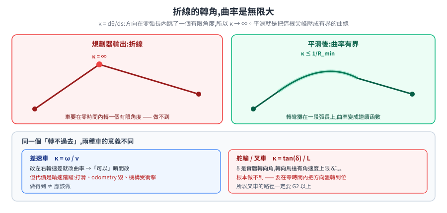
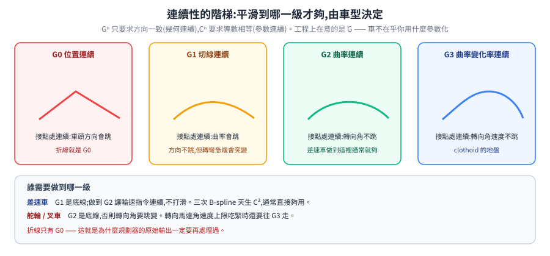
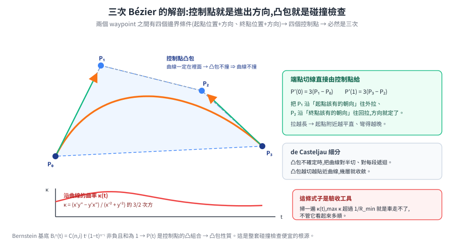
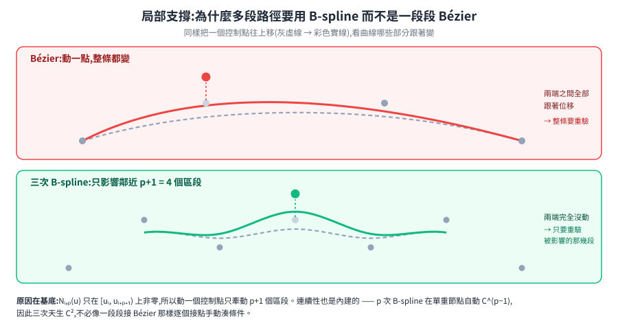
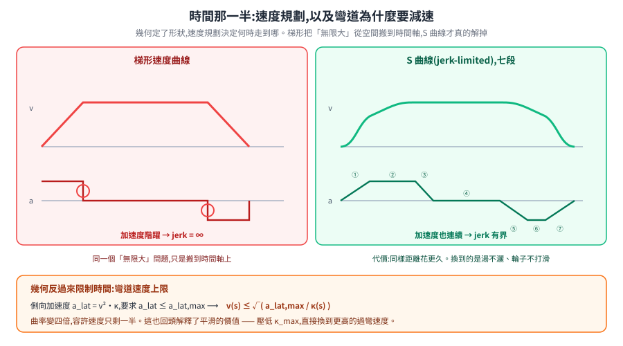
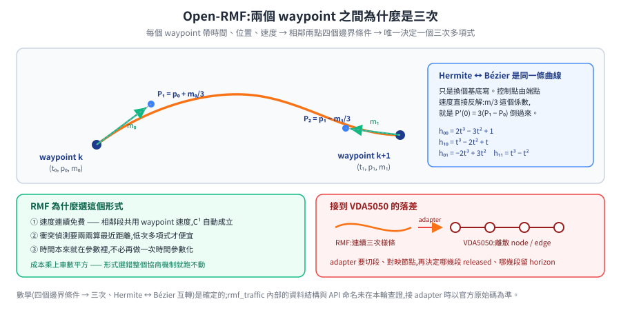

# 路徑平滑與軌跡生成:從折線到車真的走得出來的曲線

全域規劃器吐出來的是一串 waypoint 連成的折線。折線在數學上沒問題,在物理上走不了——轉角處的曲率是無限大。這篇從這個事實推起,走完幾何(曲線長什麼形狀)與時間(何時走到哪)兩條線,再看 Open-RMF 在兩個 waypoint 之間實際上是怎麼算的。

> 前置:[路徑規劃與軌跡(Nav2)](path-planning.md)(三層架構與 costmap)、[座標轉換與 TF](kinematics-and-coordinate-transforms.md)。
> 相關:[電源與安全](../10-hardware/power-and-safety.md)(ramp 與 S 曲線在下位機那一端)、[OpenRMF](../40-fleet/open-rmf.md)(時空排程)、[室內 AMR 路網選型](../40-fleet/indoor-amr-roadnet-selection.md)(叉車的轉向約束)。

---

## 1. 根本問題:折線的轉角,曲率是無限大

一條路徑的**曲率** `κ` 是「單位弧長內方向轉了多少」:

$$\kappa = \frac{d\theta}{ds}$$

直線段上 `θ` 不變,`κ = 0`。到了折線的轉角,`θ` 在**零弧長內**跳了一個有限角度,所以 `κ → ∞`。

這對車意味著什麼,要看車怎麼產生曲率:

| 車型 | 曲率怎麼來 | 能不能瞬間改 |
|---|---|---|
| **差速** | `κ = ω / v`,靠左右輪速差 | **可以**——改兩顆馬達的目標轉速就行 |
| **舵輪 / Ackermann**(叉車) | `κ = tan(δ) / L`,`δ` 是轉向角、`L` 是軸距 | **不行**——`δ` 是實體角度,轉向馬達有角速度上限 `δ̇ₘₐₓ` |

差速車「做得到」不等於「應該做」。瞬間改曲率代表兩輪速度階躍,後果是輪子打滑(odometry 立刻毀)、機構受衝擊、載的東西灑出來。舵輪車則是根本做不到:要在轉角處達到有限曲率,轉向馬達得在零時間內轉到位。

所以平滑不是為了好看,是為了**讓路徑落在車的可行集合裡**。

---

## 2. 先拆成兩半:幾何與時間

一條「路徑」和一條「軌跡」不是同一件事:

- **路徑(path)** `p(s)`:只有形狀,參數是弧長 `s`。回答「走哪裡」。
- **軌跡(trajectory)** `q(t)`:加上時間。回答「什麼時候走到哪」。

兩者由一個**時間參數化** `s(t)` 連起來:`q(t) = p(s(t))`。

這個拆法不是為了整齊,是因為兩邊受的約束**來源不同**:

| | 受什麼約束 | 誰決定 |
|---|---|---|
| 幾何 `p(s)` | 障礙物、可行走區域、車的最小轉彎半徑與曲率連續性 | 場域 + 運動學 |
| 時間 `s(t)` | 速度上限、加速度上限、jerk 上限、任務時程 | 動力學 + 舒適/安全 |

分開解的好處是**可調、可驗**:幾何出問題就看圖,時間出問題就看速度曲線。代價是拿不到全域最優——最快的走法可能需要幾何與時間一起調(見 §8 軌跡最佳化)。

Nav2 的 planner → smoother → controller 就是這個拆法;Open-RMF 的「先協商時空行程、再交給單車跟隨」也是。

---

## 3. 連續性的階梯:G0 → G1 → G2

平滑到什麼程度才夠?這有個明確的階梯。

先分清兩種連續性:

- **參數連續 `Cⁿ`**:把曲線當成參數 `t` 的函數,前 `n` 階導數在接點相等。
- **幾何連續 `Gⁿ`**:只要求**方向**一致,大小可以差一個正倍數。

`Cⁿ ⇒ Gⁿ`,反之不然。工程上在意的是幾何連續——車不在乎你用什麼參數化。

| 等級 | 接點處連續的是 | 物理意義 | 不滿足會怎樣 |
|---|---|---|---|
| **G0** | 位置 | 路徑不斷開 | 車要瞬移 |
| **G1** | 單位切向量 | 車頭方向不跳變 | 車要原地轉一個角度才能繼續 |
| **G2** | 曲率 | **轉向角**不跳變 | 舵輪車要瞬間打方向盤;差速車要輪速階躍 |
| **G3** | 曲率變化率 | 轉向**角速度**不跳變 | 轉向馬達要瞬間到達某個角速度 |

**折線只有 G0。** 這就是為什麼它走不了。

**該做到哪一級,由車型決定**:

- **差速車**:G1 是底線,G2 讓輪速指令連續(不打滑)。做到 G2 通常就夠。
- **舵輪 / 叉車**:G2 是底線(否則轉向角要跳變)。若轉向馬達的角速度上限吃緊,還要往 G3 走——那就是 clothoid 的地盤(§7)。

---

## 4. Bézier:為什麼平滑第一個想到它

要在兩個 waypoint 之間補一條曲線,需求是:由少數幾個直觀的參數決定、導數好算、數值穩定、而且**能便宜地做碰撞檢查**。Bézier 四項都滿足,而且第四項是關鍵。

### 4.1 Bernstein 基底

`n` 次 Bézier 曲線由 `n+1` 個控制點 `P₀…Pₙ` 定義:

$$P(t) = \sum_{i=0}^{n} B_i^n(t)\, P_i, \qquad t \in [0, 1]$$

其中 **Bernstein 基底多項式**:

$$B_i^n(t) = \binom{n}{i} t^i (1-t)^{n-i}$$

這組基底有兩個性質決定了 Bézier 的一切:

$$\sum_{i=0}^{n} B_i^n(t) = \big(t + (1-t)\big)^n = 1, \qquad B_i^n(t) \ge 0 \ \ \text{on} \ [0,1]$$

非負且和為 1,代表 `P(t)` 是控制點的**凸組合**。於是:

> **凸包性質**:整條曲線一定落在控制點的凸包內。

這條性質是碰撞檢查能便宜做的原因(§4.4)。

### 4.2 為什麼兩個 waypoint 之間用三次

在兩個 waypoint 之間,我們手上有四個邊界條件:起點位置、起點方向、終點位置、終點方向。四個條件對應四個控制點,也就是**三次**:

$$P(t) = (1-t)^3 P_0 + 3(1-t)^2 t\, P_1 + 3(1-t)t^2 P_2 + t^3 P_3$$

三次不是隨便挑的,是被邊界條件的數目逼出來的。次數再低放不下方向約束;再高則多出自由度,反而要另外想辦法定下來。

### 4.3 導數:控制點直接就是進出方向

Bézier 的導數還是 Bézier,控制點是相鄰差分:

$$P'(t) = n \sum_{i=0}^{n-1} B_i^{n-1}(t)\,(P_{i+1} - P_i)$$

代進端點:

$$P'(0) = n(P_1 - P_0), \qquad P'(1) = n(P_n - P_{n-1})$$

三次的情況就是 `P'(0) = 3(P₁ − P₀)`、`P'(1) = 3(P₃ − P₂)`。

這是 Bézier 在路徑平滑上最好用的一點:**把 `P₁` 沿著「起點該有的朝向」往外拉,把 `P₂` 沿著「終點該有的朝向」往回拉**,曲線的進出方向就定了。拉多遠決定彎得多急——拉得越長,曲線越貼近控制多邊形、起點附近越平直。

二階導數同理:

$$P''(0) = n(n-1)(P_2 - 2P_1 + P_0), \qquad P''(1) = n(n-1)(P_n - 2P_{n-1} + P_{n-2})$$

有了一階與二階,平面曲率直接算得出來:

$$\kappa(t) = \frac{x'(t)\,y''(t) - y'(t)\,x''(t)}{\big(x'(t)^2 + y'(t)^2\big)^{3/2}}$$

**這條式子是驗收平滑結果的工具**:沿 `t` 掃一遍 `κ(t)`,看最大值有沒有超過車的 `1/R_min`。超過就是這條曲線車走不了,不管它看起來多順。

### 4.4 de Casteljau:求值、細分,與便宜的碰撞檢查

de Casteljau 演算法用反覆線性內插求 `P(t)`:對相鄰控制點做 `Pᵢ' = (1−t)Pᵢ + tPᵢ₊₁`,一層一層縮到剩一個點。它比直接展開多項式**數值穩定**,而且順帶做到一件更有用的事——把曲線在 `t` 處**切成兩段**,兩段各自仍是三次 Bézier,控制點就是遞推過程中的中間結果。

碰撞檢查因此可以這樣做:

1. 控制點的凸包與障礙物**不相交** → 整條曲線安全,結束。
2. 凸包**完全落在**障礙物內 → 一定撞,結束。
3. 兩者都不是 → 用 de Casteljau 從中間切成兩段,對每段遞迴。

每切一次,凸包就更貼近曲線,通常幾層就收斂。這比「把曲線取樣成一百個點逐一查 costmap」既快又**保守正確**(不會漏判)。

### 4.5 單段不夠:接起來會斷曲率

兩段三次 Bézier 接在一起(第一段 `P₀…P₃`,第二段 `Q₀…Q₃`,`Q₀ = P₃`):

- **G1**:要 `P₂`、`P₃`、`Q₁` 三點共線,且 `Q₁ − P₃` 與 `P₃ − P₂` 同向。
- **C2**:再要 `P''(1) = Q''(0)`,即

$$P_3 - 2P_2 + P_1 = Q_2 - 2Q_1 + Q_0$$

一段一段接、每個接點都手動湊 C2 條件,控制點的自由度很快就被吃光——`Q₂` 被前一段完全決定,下一段又被 `Q` 決定,連鎖下去。**與其每次都手動維護連續性,不如換一組天生就連續的基底。** 那就是 B-spline。

---

## 5. B-spline:把連續性內建進基底

### 5.1 Cox–de Boor 遞推

`p` 次 B-spline 由控制點 `P₀…Pₘ` 與一組非遞減的**節點向量(knot vector)** `u₀ ≤ u₁ ≤ … ≤ u_{m+p+1}` 定義:

$$C(u) = \sum_{i=0}^{m} N_{i,p}(u)\, P_i$$

基底函數由遞推定義:

$$N_{i,0}(u) = \begin{cases} 1 & u_i \le u < u_{i+1} \\ 0 & \text{otherwise} \end{cases}$$

$$N_{i,p}(u) = \frac{u - u_i}{u_{i+p} - u_i} N_{i,p-1}(u) + \frac{u_{i+p+1} - u}{u_{i+p+1} - u_{i+1}} N_{i+1,p-1}(u)$$

(分母為 0 的項約定為 0。)

### 5.2 兩條決定性的性質

**(a) 連續性內建。** `p` 次 B-spline 在**單重**內部節點處自動 `C^{p−1}` 連續;節點重數為 `k` 時降為 `C^{p−k}`。

所以**三次 B-spline 天生 C²**——不必手動湊任何條件,曲率自動連續。這正是 §4.5 要解決的問題,而且是從基底層面解掉的。

重數的用途也很清楚:想在某處**故意**製造一個尖角(例如叉車必須在此換向倒車),就把該節點的重數提高到 `p`,連續性降到 `C⁰`。

**(b) 局部支撐。** `N_{i,p}(u)` 只在 `[u_i, u_{i+p+1})` 上非零。因此:

> 移動一個控制點 `Pᵢ`,只會改動曲線的 `p+1` 個區段,其餘完全不動。

Bézier 沒有這個性質——動任何一個控制點,整條曲線都變。對路徑平滑來說這是決定性的差異:現場多了一個臨時障礙物,只要調動附近幾個控制點就好,不會把整條路徑重算、也不會把遠處已經驗證過的部分弄壞。

### 5.3 Bézier 是 B-spline 的特例

節點向量取 `[0,…,0, 1,…,1]`(頭尾各 `p+1` 重、沒有內部節點)時,B-spline 退化成單段 Bézier,基底函數就是 Bernstein 多項式。兩者是同一族東西的不同參數化。

再往上還有 **NURBS**(非均勻有理 B-spline):給每個控制點加一個權重 `wᵢ`,曲線變成有理式

$$C(u) = \frac{\sum_i N_{i,p}(u)\, w_i P_i}{\sum_i N_{i,p}(u)\, w_i}$$

多出來的能力是**精確表示圓錐曲線**(多項式做不到精確的圓弧)。室內 AMR 的路徑平滑通常用不到這一層;它主要出現在 CAD 與需要精確圓弧的場合。

---

## 6. 用最佳化取代硬湊:離散平滑器

前面是「用一族好性質的曲線去擬合」。另一條路是**直接對一串點做最佳化**——Nav2 的 smoother 走的就是這條。

把路徑當成一串點 `p₁…p_N`,目標函數典型長這樣:

$$J = w_s \sum_{i=2}^{N-1} \big\| p_{i-1} - 2p_i + p_{i+1} \big\|^2 \;+\; w_o \sum_{i} C_{\text{obs}}(p_i) \;+\; w_d \sum_{i} \big\| p_i - p_i^{0} \big\|^2$$

三項各自在做一件事:

- **平滑項**:`p_{i−1} − 2pᵢ + p_{i+1}` 是離散二階差分。點若等距,它正比於曲率——**最小化它就是在壓低曲率**。這是 §1 那條 `κ = dθ/ds` 的離散版本。
- **障礙項**:`C_obs` 直接取 costmap 值,把曲線推離障礙物。
- **錨定項**:懲罰偏離原始路徑 `pᵢ⁰`。少了它,平滑項會把整條路徑收縮成一個點(那確實是最平滑的解)。

**端點必須釘死**,否則起終點會被拉走。

這條路的好處是障礙物代價直接進目標函數,不必先擬合再驗證;代價是需要調三個權重,而且是局部最佳解——初值(規劃器輸出)品質不好時,結果也不會好。

再往上把時間也一起解,就是**軌跡最佳化**(CHOMP、TrajOpt 這一類):把 `q(t)` 的離散取樣點當變數,目標函數同時含平滑度、障礙物距離與動力學可行性。最優但難調,而且求解時間不容易保證——這是它在即時系統裡不好用的主因。

---

## 7. Clothoid:當曲率本身也不許跳變

舵輪車若轉向馬達的角速度上限吃緊,G2 還不夠——曲率**連續**但可以變化得任意快,對應轉向角速度任意大。這時要的是曲率**線性變化**的曲線:

$$\kappa(s) = \kappa_0 + c \cdot s$$

這就是 **clothoid**(迴旋曲線,又稱 Euler spiral)。沿著它走,若車速固定,轉向角速度是**常數**——方向盤以固定速率轉。公路與鐵路的緩和曲線用的就是它,理由完全一樣。

它的位置要積分才得到:

$$\theta(s) = \theta_0 + \kappa_0 s + \tfrac{1}{2} c s^2, \qquad x(s) = x_0 + \int_0^s \cos\theta(\sigma)\, d\sigma, \quad y(s) = y_0 + \int_0^s \sin\theta(\sigma)\, d\sigma$$

這兩個積分是 **Fresnel 積分**,沒有初等封閉解。實務上靠查表或級數近似,這也是 clothoid 比 Bézier/B-spline 難用的主因——求值貴、擬合也貴。

**什麼時候值得用**:重載叉車、轉向機構慢、或路徑要交給人工審查(緩和曲線的參數對現場工程師是可讀的)。一般室內差速 AMR 用三次 B-spline 就夠。

---

## 8. 時間那一半:速度規劃

幾何定了之後,還要決定沿著它什麼時候走到哪。約束有三類:

**(a) 速度、加速度、jerk 的上限。** 見[電源與安全](../10-hardware/power-and-safety.md)——ramp 就是最陽春的加速度限幅。

**(b) 曲率決定的側向加速度上限。** 這是幾何反過來限制時間的地方。沿曲率 `κ` 的路徑以速度 `v` 行駛,側向加速度是

$$a_{\text{lat}} = v^2 \kappa$$

要求 `a_lat ≤ a_lat,max`,就得到**沿路徑逐點的速度上限**:

$$v(s) \le \sqrt{\frac{a_{\text{lat,max}}}{\kappa(s)}}$$

**彎道要減速**這件事,第一性原理就在這裡。而且它是 `κ^{-1/2}`——曲率變四倍,容許速度只剩一半。這也回頭解釋了為什麼平滑值得做:平滑降低 `κ_max`,直接換到更高的過彎速度。

**(c) 起終點的邊界條件。** 通常起終點速度為 0,或銜接前後段的速度。

### 梯形 vs S 曲線

把上面三類約束湊起來,最簡單的解是**梯形速度曲線**:加速 → 等速 → 減速。它的問題是加速度在轉折處階躍,jerk 無限大——同一個「無限大」問題,只是換到時間軸上。

**S 曲線(jerk-limited)** 把加速度也做成連續的,典型七段:

| 段 | jerk | 加速度 | 速度 |
|---|---|---|---|
| 1 | `+j_max` | 0 → `a_max` | 凹向上加速 |
| 2 | 0 | `a_max` | 線性加速 |
| 3 | `−j_max` | `a_max` → 0 | 凸向上加速 |
| 4 | 0 | 0 | 等速 |
| 5 | `−j_max` | 0 → `−a_max` | 開始減速 |
| 6 | 0 | `−a_max` | 線性減速 |
| 7 | `+j_max` | `−a_max` → 0 | 平順停住 |

代價是同樣的距離要花更久。**限 jerk 換到的是**:湯不灑、輪子不打滑(odometry 不毀)、機構壽命、以及載人時的舒適度。

---

## 9. Open-RMF:兩個 waypoint 之間實際上算什麼

[OpenRMF](../40-fleet/open-rmf.md) 那篇提到「車的軌跡以**分段三次樣條**表示」。這一節把「為什麼是三次」補上。

RMF 的行程(trajectory)是一串 waypoint,每個帶三樣東西:**時間、位置、速度**。於是相鄰兩個 waypoint 之間,邊界條件有四個——起點位置 `p₀`、起點速度 `m₀`、終點位置 `p₁`、終點速度 `m₁`。

四個條件,唯一決定一個三次多項式。這是 **三次 Hermite 樣條**:

$$H(t) = h_{00}(t)\,p_0 + h_{10}(t)\,m_0 + h_{01}(t)\,p_1 + h_{11}(t)\,m_1, \qquad t \in [0,1]$$

$$h_{00} = 2t^3 - 3t^2 + 1,\quad h_{10} = t^3 - 2t^2 + t,\quad h_{01} = -2t^3 + 3t^2,\quad h_{11} = t^3 - t^2$$

**它和 Bézier 是同一條曲線,只是換個基底寫。** 轉換直接可寫:

$$P_0 = p_0, \quad P_1 = p_0 + \tfrac{m_0}{3}, \quad P_2 = p_1 - \tfrac{m_1}{3}, \quad P_3 = p_1$$

`m₀/3` 這個係數就是 §4.3 的 `P'(0) = 3(P₁ − P₀)` 反解出來的。所以「用 Bézier 算兩個 waypoint 間的平滑軌跡」與「RMF 的分段三次樣條」在數學上是同一件事,差別只在你手上握的是控制點還是端點速度。

**RMF 為什麼選這個形式**,可以從它要做的事反推:

1. **速度連續是免費的**。相鄰段共用 waypoint 的速度值,`C¹` 自動成立。而 RMF 要把行程交給車去跟隨,速度不連續會直接變成車上的加速度尖峰。
2. **衝突偵測要算兩條曲線的最近距離**。多項式(而且是低次)才有便宜的作法;取樣或一般曲線都貴得多。RMF 的核心工作是**在所有參與者之間兩兩比對時空軌跡**,這個成本乘上車數平方,形式選錯整個機制就跑不動。
3. **時間本來就在參數裡**。Hermite 的參數可以直接對應時間區間,不必再做一次時間參數化——這跟純幾何的平滑(§2 的 `p(s)`)不同,RMF 從一開始處理的就是軌跡。

**接到 VDA5050 的落差**也就清楚了:RMF 手上是連續的三次樣條,VDA5050 的 order 是離散的 node/edge。adapter 必須把樣條切段、對映到路網節點,並決定哪幾段 `released`、哪幾段留在 `horizon`。這是既有筆記標出的核心難點,根源就在兩邊的表示法一個連續、一個離散。

> **待查證**:本節的數學(四個邊界條件 → 三次、Hermite ↔ Bézier 互轉)是確定的;但 `rmf_traffic` 內部的實際資料結構與 API 命名沒有在本輪查證,只依 [open-rmf.md](../40-fleet/open-rmf.md) 已記錄的「分段三次樣條」描述推。要接 adapter 時請以官方原始碼為準。

---

## 10. 怎麼選

| 情境 | 建議 | 理由 |
|---|---|---|
| 兩個 waypoint 之間補一段 | **三次 Bézier / Hermite** | 四個邊界條件剛好對應,端點方向直接由控制點給 |
| 一整條多段路徑要 C² | **三次 B-spline** | 連續性內建,不必逐點湊條件 |
| 現場常有臨時障礙、要局部重算 | **B-spline** | 局部支撐——只動附近幾段 |
| 障礙物代價要直接進目標 | **離散平滑器**(Nav2 smoother) | costmap 直接當代價項,不必先擬合再驗 |
| 舵輪車 + 轉向速度吃緊 | **clothoid** | 曲率線性變化 = 轉向角速度恆定 |
| 需要精確圓弧 | NURBS | 多項式做不到精確圓 |
| 多車時空協商 | **分段三次 Hermite**(RMF 的作法) | 速度連續免費、衝突偵測便宜 |

不論選哪個,**驗收方式一樣**:沿曲線掃 `κ(s)`,確認 `max κ ≤ 1/R_min`;再把 `v(s) ≤ √(a_lat,max/κ(s))` 套上去,看任務時間還可不可以接受。平滑做得漂亮但曲率超標,車照樣走不了。

---

## 11. 誠實的邊界

- §9 的 RMF 部分:數學是確定的,`rmf_traffic` 的實際實作細節未在本輪查證(見該節的待查證標記)。
- 離散平滑器的權重 `w_s / w_o / w_d` 沒有通用值,必須依場域與 costmap 尺度現場調;本篇不給建議數字。
- clothoid 的求值成本「比 Bézier 貴」是定性描述,沒有附上橫向 benchmark。
- 本篇談的是**運動學層**的平滑。真正上車還牽涉控制器的追蹤誤差、地面摩擦與載重變化——曲線可行不代表車跟得上,那是[區域控制器](path-planning.md#4-區域控制器跟線避障平滑三選二的取捨)的責任。

## 12. 延伸閱讀

- [路徑規劃與軌跡(Nav2)](path-planning.md) — 平滑的上游(全域規劃)與下游(區域控制器)
- [電源與安全](../10-hardware/power-and-safety.md) — ramp 與 S 曲線在下位機的實作
- [座標轉換與 TF](kinematics-and-coordinate-transforms.md) — 曲線算出來之後放在哪個座標系
- [OpenRMF:跨車隊調度](../40-fleet/open-rmf.md) — 時空排程與協商
- [室內 AMR 路網規劃選型](../40-fleet/indoor-amr-roadnet-selection.md) — 叉車轉向約束怎麼反過來決定路網
- [高斯分布:第一性原理](../90-foundations/gaussian-from-first-principles.md) — 本 repo 另一篇「把式子逼出來」的範本
