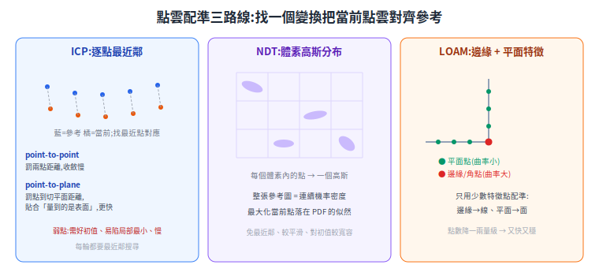
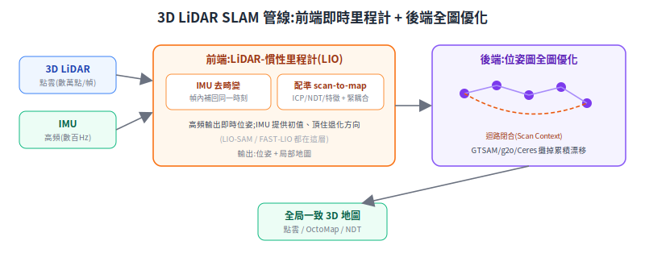
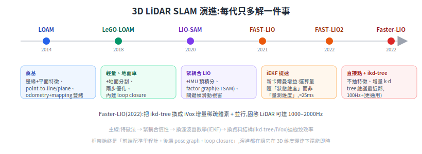

# 3D LiDAR SLAM 建圖原理

[2D SLAM](slam-mapping.md) 講透了「雞生蛋(要定位需地圖、要建圖需定位)」、占據柵格、scan matching 的加權最小二乘、loop closure、pose graph 全圖優化。這篇接續講 **3D**:把 2D 換成多線 / 固態 LiDAR 的點雲後,**多了什麼、難在哪、代表方法怎麼一步步演進**。2D 已講的基礎不重述。

> 前置:[2D SLAM 建圖](slam-mapping.md)、[LiDAR 完整解析](../10-hardware/lidar-landscape.md)(點雲從哪來)、[高斯第一性原理](../90-foundations/gaussian-from-first-principles.md)(配準與卡爾曼的數學底)。
> 關鍵演算法、論文均附可查證來源(arXiv / DOI / GitHub),見文末來源清單;不確定的標「待查證」。

---

## 1. 核心問題:框架沒變,但維度爆炸

SLAM 的本質不變:**同時估計機器人軌跡與環境地圖**。3D 真正改變的是狀態維度與觀測形態:

- **位姿從 3-DoF `(x, y, θ)` 變 6-DoF `(x, y, z, roll, pitch, yaw)`**。平地機器人近似 3-DoF,但上下坡、顛簸、無人機就得全 6-DoF;旋轉活在 SO(3) 流形上(不是普通歐氏空間),優化要在流形上做。
- **觀測從「一圈 2D 輪廓」變「一片 3D 點雲」**。2D 一幀幾百點;3D(16/32/64/128 線)一幀數萬至數十萬點,而且有掃描期間的**運動畸變(motion distortion / skew)**——機器人在一幀(約 0.1 秒)內移動了,幀內早採跟晚採的點不在同一參考系。2D 低速常忽略,3D 高速不處理會嚴重歪斜。
- **地圖從 2D 占據柵格變 3D 表示**(點雲 / 體素 / octree),記憶體與運算量高 1~2 個量級。

一句話:**前端里程計 + 後端優化 + loop closure 的框架跟 2D 同構,但「點雲配準」這個地基的演算法、和「地圖怎麼存」,都因維度爆炸而需要全新工具。** 後面所有創新(ikd-tree、iVox、iEKF)都是為了「在 3D 維度爆炸下還能即時」。

---

## 2. 點雲配準(Registration):3D SLAM 的地基

2D 的 scan matching 其實就是 2D 配準。3D 配準是同一件事——**找一個剛體變換 `T ∈ SE(3)`,把當前點雲對齊到參考(前一幀 / 地圖)**——但點多、無天然柵格、對初值更敏感。三條主流路線:

### 2.1 ICP(Iterative Closest Point)— 最樸素也最脆弱

兩步交替迭代到收斂:① **資料關聯**:對 source 每個點,在 target 找最近點當對應(這步最貴,要 k-d tree 加速);② **求解變換**:在當前對應下求 `T` 最小化殘差平方和,套回去再回到①。

殘差有兩種度量,是 ICP 的關鍵分支:

- **point-to-point**:殘差 = 對應兩點的歐氏距離。有閉式解(SVD),但收斂慢。
- **point-to-plane**:殘差 = source 點到 target 點**切平面**的距離(沿法向量投影)。更符合「LiDAR 量到的是表面」的物理——只罰垂直於表面的誤差、允許點沿平面滑動,**收斂更快更準**。3D LiDAR SLAM 幾乎都用它或其變形。

**弱點(為什麼 ICP 不夠)**:需要好初值(最近點假設兩雲已大致對齊,初值差就配錯);代價函數非凸、**易陷局部最小**(長走廊、對稱場景尤其嚴重);每輪對數萬點做最近鄰搜尋、**慢**。

### 2.2 NDT(Normal Distributions Transform)— 用機率分布取代逐點對應

反轉 ICP 的思路:把參考點雲切成**體素**,每個體素內的點擬合成一個**高斯(均值 + 協方差)**,整張參考圖變成連續的機率密度函數。配準時把當前點雲套上候選變換,**最大化這些點落在參考 PDF 上的似然**。好處:不需顯式最近鄰(點直接查落在哪個體素的高斯)、代價函數較平滑、對初值較不敏感。Autoware 的定位就常用 NDT。

### 2.3 特徵法:LOAM 的「邊緣點 + 平面點」— 為什麼又快又穩

LOAM(Zhang & Singh, 2014)的洞見:**不必用全部點,只挑幾何上資訊量高、可重複辨識的少數特徵點**。方法是對每個點算**局部平滑度(曲率)** `c`:`c` 大 → 周圍幾何彎折劇烈 → **邊緣 / 角點**(柱子、牆角);`c` 小 → 周圍平坦 → **平面點**(地面、牆面)。

配準時對應地用兩種殘差:邊緣點算到參考**邊緣線**的距離(point-to-line),平面點算到參考**平面**的距離(point-to-plane)。**快**——特徵點只佔原始點雲一小部分,優化點數降一兩個量級;**穩**——邊緣 / 平面是場景中幾何明確、跨幀可重複觀測的結構,比「隨便挑最近點」可靠得多。

> 來源:Besl & McKay 1992 [DOI](https://doi.org/10.1109/34.121791);Generalized-ICP(Segal 2009)[PDF](https://www.robots.ox.ac.uk/~avsegal/resources/papers/Generalized_ICP.pdf);NDT(Biber & Straßer 2003)[Wikipedia](https://en.wikipedia.org/wiki/Normal_distributions_transform);LOAM RSS 2014 [CMU RI](https://www.ri.cmu.edu/publications/loam-lidar-odometry-and-mapping-in-real-time/) / 期刊版 [Springer DOI](https://doi.org/10.1007/s10514-016-9548-2)。

---

## 3. 前端里程計 + 後端優化:兩段式架構

和 2D graph-SLAM 同構,但 3D 把前端進一步拆出里程計層。

### 3.1 LiDAR Odometry:scan-to-scan vs scan-to-map

- **scan-to-scan**:當前幀配準到**上一幀**。快,但誤差直接累積、漂移快。
- **scan-to-map**:當前幀配準到**已累積的局部地圖**。約束強、更準、漂移慢,但配準更貴。

LOAM 的經典設計用**兩個執行緒**:高頻(~10Hz)scan-to-scan 出即時里程計、低頻(~1Hz)scan-to-map 精修並維護地圖——「快但糙」餵「慢但準」,這就是名字 odometry + mapping 的由來。

### 3.2 為什麼要融 IMU(LIO,LiDAR-Inertial Odometry)

純 LiDAR 里程計在三種情境會崩,IMU 正好補上:

1. **去畸變(de-skew)**:IMU 高頻(數百~上千 Hz)積分出一幀掃描期間的連續運動,把幀內每個點補償回同一時刻 → 消除運動畸變。這是 LIO 最基本的價值。
2. **快速運動 / 劇烈旋轉**:LiDAR 幀率低,兩幀間高速轉動會讓配準初值極差;IMU 提供高頻運動先驗當初值,把配準從「猜」變「微調」。
3. **退化場景**:長走廊、隧道、空曠平面——幾何約束在某些方向消失(沿走廊滑動,點雲長一樣),IMU 的慣性約束在這些方向頂住,避免崩解。

**緊耦合 vs 鬆耦合**:鬆耦合是 LiDAR、IMU 各算一個位姿、事後用 EKF 融合,簡單但 LiDAR 退化時它輸出已經錯了;緊耦合把 LiDAR 的**原始殘差**和 IMU 的**原始量測**放進**同一個**狀態估計聯合求解,退化方向上 IMU 直接補進去,更穩更準。**現代主流 LIO 都是緊耦合。**

---

## 4. 代表方法演進(每代只記「比上一代多解了什麼」)

- **LOAM(2014)**:奠基。邊緣+平面特徵、point-to-line/plane 配準、odometry+mapping 雙執行緒。低漂移、嵌入式可跑,長期居 KITTI 里程計榜首,後續幾乎都從它分支。
- **LeGO-LOAM(2018)**:針對水平裝設的地面車最佳化。加**地面分割**、點雲分群去噪、兩步優化(先用地面點解 `z/roll/pitch`、再用邊緣點解 `x/y/yaw`)、內建 loop closure(GTSAM)。更輕量。
- **LIO-SAM(2020)**:升級成**緊耦合 LiDAR-慣性**,建在 factor graph(GTSAM/iSAM2)上。IMU 預積分因子去畸變並提供初值,LiDAR 里程計、IMU、GPS、loop closure 因子統一進一張圖;用關鍵幀滑動視窗而非全域配準,即時性大增。
- **FAST-LIO(2021)**:緊耦合 **iterated EKF**。最大貢獻是**新的卡爾曼增益公式,把運算量從「隨量測維度」降成「隨狀態維度」**——LiDAR 一幀上千量測點,改寫後只需狀態維度(十幾維)求逆,機載電腦上一次更新 <25ms。
- **FAST-LIO2(2022)**:① **直接用原始點**配 scan-to-map(不抽特徵、不丟資訊,對各種 LiDAR 更通用);② **ikd-tree**(增量式 k-d tree,支援動態插入/刪除/再平衡),邊建圖邊維護最近鄰結構,達 100Hz+。
- **Faster-LIO(2022)**:把 ikd-tree 換成 **iVox(增量稀疏體素)**,用雜湊體素 + 近似 k-NN 換速度,固態 LiDAR 可達 1000–2000Hz。

> 來源:LeGO-LOAM IROS 2018 [GitHub](https://github.com/RobustFieldAutonomyLab/LeGO-LOAM);LIO-SAM IROS 2020 [arXiv 2007.00258](https://arxiv.org/abs/2007.00258) / [GitHub](https://github.com/TixiaoShan/LIO-SAM);FAST-LIO [arXiv 2010.08196](https://arxiv.org/abs/2010.08196);FAST-LIO2 [arXiv 2107.06829](https://arxiv.org/abs/2107.06829) / [GitHub](https://github.com/hku-mars/FAST_LIO);Faster-LIO [GitHub](https://github.com/gaoxiang12/faster-lio)。

---

## 5. 迴路閉合 + 後端優化:消除累積漂移

2D 篇已講透 pose graph 全圖優化「按信心(資訊矩陣)加權攤回」的原理——**3D 完全沿用同一套加權最小二乘**,只是節點變 6-DoF、邊的協方差是 6×6。這裡補 3D 特有的兩件事。

**後端優化器(2D/3D 共用)**:把 pose graph(節點=歷史關鍵幀位姿,邊=里程計 + loop closure 約束)解成非線性最小二乘。三大現成函式庫:**GTSAM**(因子圖 + iSAM2 增量求解,最適合線上 SLAM,LIO-SAM 用它)、**g2o**(老牌通用圖優化)、**Ceres**(Google 通用最小二乘,Cartographer 用它)。一句話對照:**前端配準**解「這一兩幀怎麼對齊」的局部問題;**後端 pose graph**解「整條軌跡幾百個位姿怎麼全局一致」,loop closure 是撐起後端的那條跨時約束。

**3D 場景描述子(loop closure 怎麼認出舊地方)**:3D 點雲大、視角變化大,需要緊湊的全域描述子快速檢索候選回環。**Scan Context(2018)**把一幀點雲以感測器為中心、按**方位角 × 徑向距離**切 bin、每 bin 取最大高度壓成一張 2D 矩陣;視角旋轉等於矩陣的列循環移位,對齊列即可比對,**對旋轉魯棒**且檢索快,是 3D loop closure 的事實標準之一。

> 來源:[GTSAM](https://gtsam.org/)、g2o(Kümmerle ICRA 2011)[GitHub](https://github.com/RainerKuemmerle/g2o)、[Ceres](http://ceres-solver.org/);Scan Context IROS 2018 [GitHub](https://github.com/irapkaist/scancontext)。

---

## 6. 點雲地圖表示:幾種存法與取捨

| 表示 | 是什麼 | 適用 |
|---|---|---|
| **原始點雲** | 直接堆所有點 | 最完整無失真,但記憶體無上限、無 free/unknown 概念;多作中間產物 |
| **體素(voxel)** | 空間切等大立方格、存代表值 | 降採樣、查詢快;FAST-LIO2 地圖、iVox 屬此 |
| **Octree / OctoMap** | 八叉樹,自適應解析度、機率式記 occupied/free/**unknown** | 空曠區用大格省空間、明確區分「沒障礙」與「沒看過」;**導航避障的標準 3D 地圖** |
| **NDT map** | 每體素存高斯 | 緊湊,可直接用於 NDT 定位 |
| **mesh / surfel** | 三角網格 / 面元 | 視覺化、碰撞、模擬 |

選用直覺:即時里程計內部用 **voxel / ikd-tree / iVox**(配準需快速最近鄰);導航避障層用 **OctoMap**(要 free/unknown 區分);定位用 **NDT map** 或原始點雲;展示 / 模擬用 **mesh**。

> 來源:OctoMap(Hornung 2013)[Springer DOI](https://doi.org/10.1007/s10514-012-9321-0) / [octomap.github.io](https://octomap.github.io/)。

---

## 7. 2D SLAM vs 3D SLAM:差在哪、各自適合什麼

| 面向 | 2D SLAM | 3D SLAM |
|---|---|---|
| **位姿維度** | 3-DoF `(x, y, θ)` | 6-DoF,旋轉在 SO(3) 流形 |
| **感測器** | 單線 2D LiDAR(一個平面) | 多線 / 固態 3D LiDAR |
| **一幀點數** | 數百 | 數萬~數十萬 |
| **地圖** | 2D 占據柵格 | 點雲 / voxel / OctoMap / NDT / mesh |
| **配準** | scan matching(2D) | ICP / NDT / 特徵法 + 常融 IMU(LIO) |
| **運算量** | 低,嵌入式輕鬆即時 | 高 1~2 量級,逼出 ikd-tree / iVox / iEKF |
| **運動畸變** | 低速多忽略 | 必須去畸變(IMU de-skew) |
| **退化場景** | 長走廊也退化,但只在平面內 | 走廊 / 隧道 / 空曠;退化方向多,**更依賴 IMU** |
| **適用場域** | 室內平地:餐廳、倉庫、辦公室、醫院 | 室外 / 起伏:自駕、礦山、無人機、林地、多樓層 |
| **成本** | 2D LiDAR 便宜 | 3D LiDAR 較貴(固態化後快速下降) |

**選型直覺**:平地、室內、預算敏感、只需平面避障 → **2D SLAM 夠用且更省**(送餐機器人主場景);有高度起伏、戶外、需 6-DoF 位姿或 3D 障礙(懸空物、坡道、樓層)→ **3D LiDAR SLAM**。兩者框架同源,差在維度,以及為了在 3D 維度爆炸下還能即時所做的全部工程創新。

---

## 來源清單(均經查證)

**配準**:Besl & McKay 1992 [DOI 10.1109/34.121791](https://doi.org/10.1109/34.121791);Generalized-ICP 2009 [PDF](https://www.robots.ox.ac.uk/~avsegal/resources/papers/Generalized_ICP.pdf);NDT 2003 [Wikipedia](https://en.wikipedia.org/wiki/Normal_distributions_transform);LOAM RSS 2014 [CMU RI](https://www.ri.cmu.edu/publications/loam-lidar-odometry-and-mapping-in-real-time/) / [Springer DOI 10.1007/s10514-016-9548-2](https://doi.org/10.1007/s10514-016-9548-2)。

**LIO 演進**:LeGO-LOAM IROS 2018 [GitHub](https://github.com/RobustFieldAutonomyLab/LeGO-LOAM);LIO-SAM IROS 2020 [arXiv 2007.00258](https://arxiv.org/abs/2007.00258) / [GitHub](https://github.com/TixiaoShan/LIO-SAM);FAST-LIO RA-L 2021 [arXiv 2010.08196](https://arxiv.org/abs/2010.08196);FAST-LIO2 T-RO 2022 [arXiv 2107.06829](https://arxiv.org/abs/2107.06829) / [GitHub](https://github.com/hku-mars/FAST_LIO) / [ikd-Tree](https://github.com/hku-mars/ikd-Tree);Faster-LIO RA-L 2022 [GitHub](https://github.com/gaoxiang12/faster-lio)。

**後端 / 地圖**:Scan Context IROS 2018 [GitHub](https://github.com/irapkaist/scancontext);[GTSAM](https://gtsam.org/);g2o [GitHub](https://github.com/RainerKuemmerle/g2o);[Ceres](http://ceres-solver.org/);OctoMap 2013 [DOI 10.1007/s10514-012-9321-0](https://doi.org/10.1007/s10514-012-9321-0)。

> 待查證:GitHub repo 路徑(`TixiaoShan/LIO-SAM`、`irapkaist/scancontext`)依搜尋與慣例推得,引用前建議點開確認 owner 未改名;Chen & Medioni point-to-plane 原始論文精確年份(1991 期刊 vs 1992 會議)。
