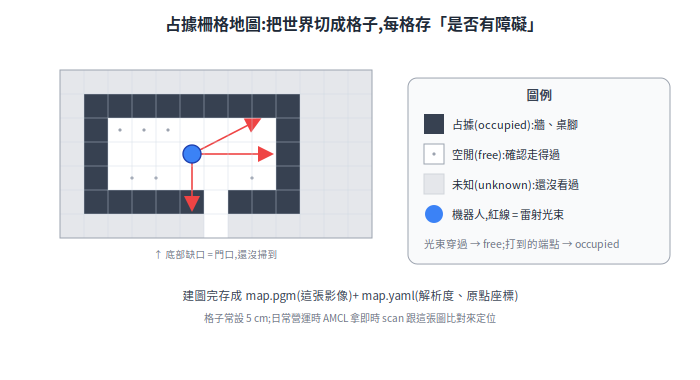
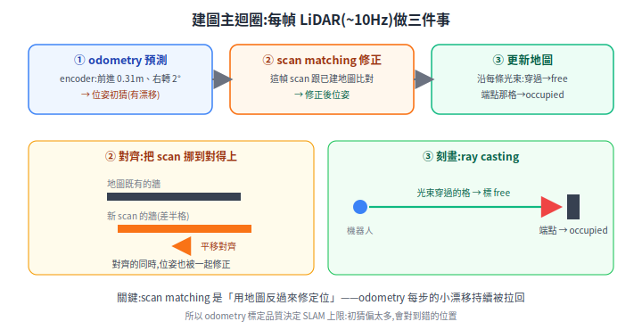
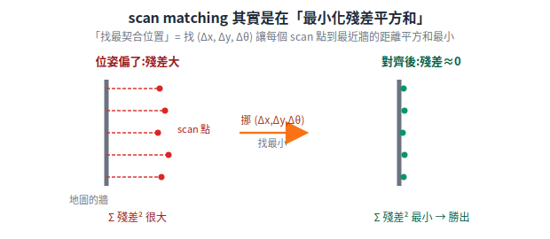
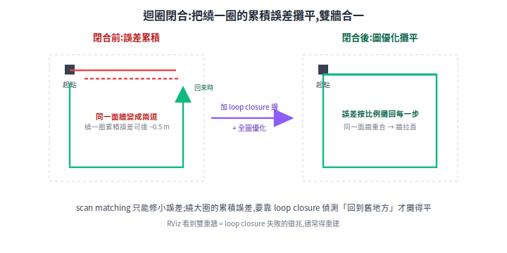
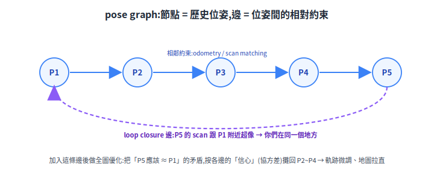
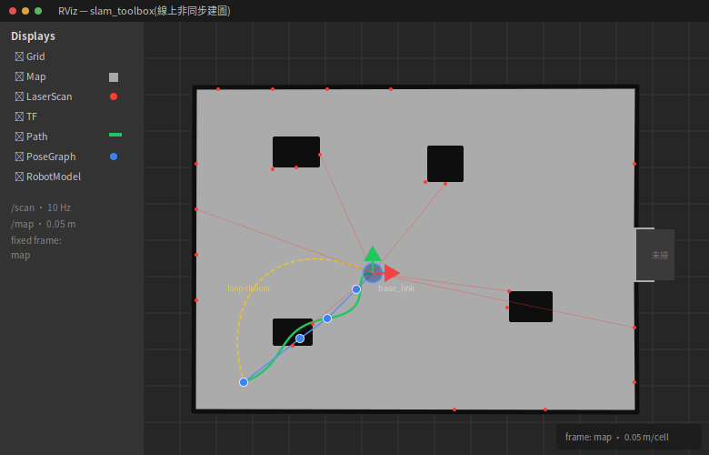

# SLAM 建圖

SLAM(Simultaneous Localization and Mapping)解決一個「雞生蛋」問題:要定位需要地圖,要建圖又需要知道自己在哪。本篇圖解 2D SLAM 的建圖主迴圈(預測 → 對齊 → 刻畫)、迴圈閉合(loop closure)這個真正的難點,以及實際建圖的品質要訣。

> 章節編號沿用原始《送餐機器人基礎原理補充》,方便與舊文件對照(故本檔編號不連續,如 §1→§5→§10,非缺漏)。
> 延伸閱讀:[定位(AMCL / 地標 / odometry)](localization.md)、[感測器](../10-hardware/sensors.md)、[系統架構](../00-overview/system-architecture.md)

---

## 21. 2D SLAM 建圖流程(圖解)

### 21.1 問題本質:雞生蛋

- 想知道「我在哪」(定位)→ 需要地圖來比對
- 想畫地圖 → 需要知道「我在哪」才能把量到的東西放到對的位置

兩者互相依賴,只能**同時解**——這就是 SLAM(Simultaneous Localization and Mapping)的字面意思。輸入是 LiDAR scan + odometry,輸出是**占據柵格地圖 (occupancy grid)**:

<p align="center"></p>

### 21.2 建圖主迴圈:預測 → 對齊 → 刻畫

每收到一幀 LiDAR scan(約 10Hz)做三件事:

<p align="center"></p>

關鍵理解:**scan matching 是在「用地圖反過來修定位」**——odometry 每步都有小誤差(§3.3 打滑),靠「這幀 scan 跟地圖對不上就挪到對得上」持續拉回來。這也解釋了為什麼 §4.1 說 odometry 標定品質決定 SLAM 上限:初猜偏太多,scan matching 會對到錯的位置上。

**「找最契合的位置」到底在算什麼?**(第一性原理,把黑盒打開)它不是模糊的「滑來滑去看哪裡順眼」,而是一個明確的最佳化:**找一組微調量 `(Δx, Δy, Δθ)`,讓「每個 scan 點到地圖上最近障礙的距離(殘差)」的平方和最小**。殘差平方和就是代價函數,最小的那個位姿勝出。

用式子寫:把 scan 第 $i$ 個點在車身座標記為 $p_i$,在初猜位姿上疊加微調 $\Delta=(\Delta x,\Delta y,\Delta\theta)$ 後的座標變換記為 $T_\Delta$(先旋轉 $\Delta\theta$、再平移 $(\Delta x,\Delta y)$),要找的是

$$ \Delta^{\star}=\arg\min_{\Delta}\;\sum_{i=1}^{N}\,d\!\big(\mathcal{M},\,T_\Delta(p_i)\big)^{2} $$

其中 $\mathcal{M}$ 是已建好的地圖,$d(\mathcal{M},\,\cdot)$ 是「把這個 scan 點擺到世界座標後,它到地圖上最近障礙的距離」(殘差)。$N$ 個點的殘差平方和就是代價函數,讓它最小的 $\Delta^{\star}$ 就是這一幀的位姿修正量。

> 兩種主流做法目標一致(找最契合位姿)但數學形式不同:**ICP**(迭代最近點)走「最小化殘差平方和」,但每輪要先做一次「資料關聯」(哪個 scan 點對應哪個障礙)再最小化,關聯↔最小化交替迭代;**correlative scan matching**(`slam_toolbox` 預設那類)則是窮舉一堆候選位姿、算 scan 跟占據柵格的**相關性得分取最大**,不顯式算殘差。下文以「殘差平方和」講直覺,實作未必是純 ICP。

<p align="center"></p>

為什麼是「平方和」而不是「絕對值和」?因為量測誤差假設成高斯,最大化似然 ⟺ 最小化殘差平方和——這條線一路接到 [高斯第一性原理](../90-foundations/gaussian-from-first-principles.md);下一節的全圖優化也是同一個「加權最小二乘」。

### 21.3 迴圈閉合 (loop closure):SLAM 真正的難點

scan matching 只能修小誤差,**長走廊繞一大圈回來,累積誤差可能已經半公尺**——這時地圖會「裂開」:

<p align="center"></p>

graph-based SLAM(`slam_toolbox` 的做法)的處理:

<p align="center"></p>

那個「**按比例**攤回」的比例不是隨便分的(第一性原理):每條邊都是一個帶不確定性的約束,全圖優化就是**最小化所有約束的加權誤差平方和**(非線性最小二乘);loop closure 約束和 odometry 約束打架時,**各自按「信心」加權**——信心由協方差/資訊矩陣表示,越確定的約束權重越大、被改動越少。所以這又是同一個「加權最小二乘 + 高斯不確定性」的故事,跟上一節的 scan matching、[高斯第一性原理](../90-foundations/gaussian-from-first-principles.md) 的協方差是同一套。

### 21.4 實際建圖操作與品質要訣

```
ros2 launch slam_toolbox online_async_launch.py   # 邊遙控邊建圖
# 用 RViz 即時看地圖長出來,繞完場域後:
ros2 run nav2_map_server map_saver_cli -f restaurant_map
```

<p align="center"></p>

*上圖為 RViz 風格示意(自繪),把建圖當下會同時看到的幾層疊在一起:正在長出來的占據柵格、即時的 LaserScan 紅點、走過的軌跡、slam_toolbox 的 pose graph 與 loop closure。真機畫面待在實機跑 `slam_toolbox` 後以 RViz 截圖替換。*

| 要訣 | 原因 |
|---|---|
| 慢速行駛(<0.5 m/s)、轉彎更慢 | scan 間重疊多,matching 穩 |
| 刻意繞回起點/交叉路徑 | 製造 loop closure 機會,攤平誤差 |
| 挑離峰時段建圖(沒有人群) | 行人會被刻進地圖變成假牆 |
| 桌椅就定位後再建圖 | 地圖反映「平常的樣子」,AMCL 比對才像 |
| 建完用 RViz 檢查牆是否筆直、有無雙重牆 | 雙重牆 = loop closure 失敗,重建 |

建圖是**部署時做一次**的離線工作(§3.3 的分工);日常營運跑的是下一節的 AMCL。

---


