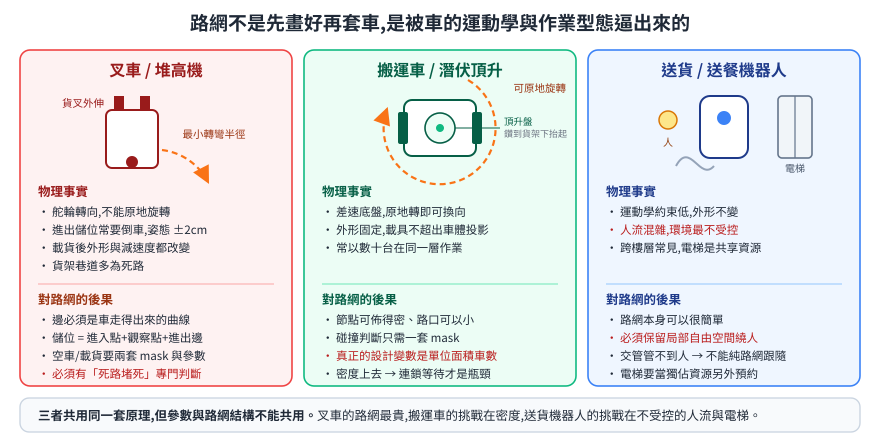
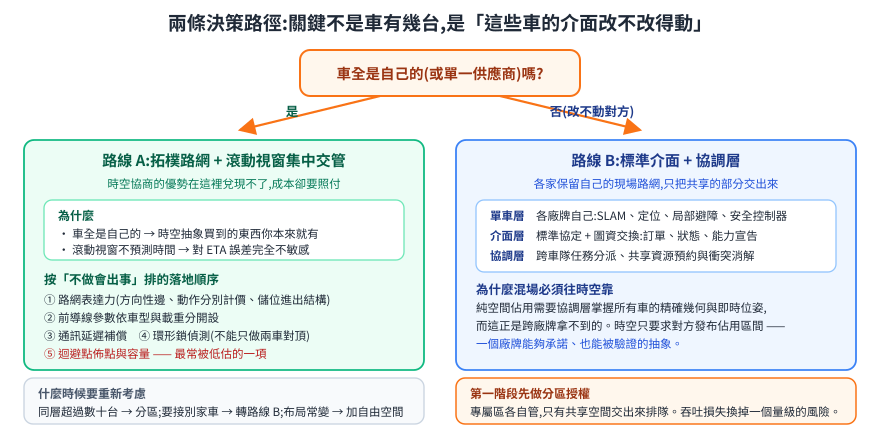

# 室內 AMR 路網規劃選型:叉車、搬運車、送貨機器人

同樣是室內自走車,叉車、搬運車與送貨機器人對路網的需求差很多;而「單一廠牌自研」與「多廠牌混場」兩種場域,合理的答案又完全不同。這篇把 [路網模型與交通管制](roadnet-and-traffic-control.md) 推出來的原理套到具體車種與場景上,給出可以拿來做決策的判準。

> 前置閱讀:[路網模型與交通管制:三條技術路線的第一性原理比較](roadnet-and-traffic-control.md)。
> 相關:[OpenRMF](open-rmf.md)、[VDA5050](vda5050.md)、[Fleet 深入:API/圖資/座標/避塞車](rmf-maps-and-traffic.md)。

---

## 1. 先看車:三種車的物理差異,決定路網長什麼樣

路網不是先畫好再套車,而是**被車的運動學與作業型態逼出來的**。

### 1.1 叉車 / 堆高機類 — 路網最貴、限制最多

| 物理事實 | 對路網的直接後果 |
|---|---|
| 舵輪或三輪轉向,**不能原地旋轉**,有最小轉彎半徑 | 節點之間的邊必須是車真的走得出來的曲線;路口需要足夠的展開空間,不能像差速車那樣密集佈點 |
| 進出儲位常需**倒車**,且姿態要求嚴格(橫向誤差常在 ±2cm 級) | 儲位不能只是一個節點,要配「進入點 + 觀察點 + 進出邊」的一組結構 |
| 貨叉前伸;**載貨後外形改變**(長度、寬度、高度都可能變) | 車體 mask 至少要有空車與載貨兩套,交管的碰撞判斷要跟著切換 |
| 載重讓減速度顯著下降 | 前導線的 `v²/(2a)` 隨載重變長,**空車與載貨要用不同的交管參數** |
| 貨架巷道多為死路(dead end) | 交管必須有「死路堵死」的專門判斷,否則兩台車在巷道裡對頂就是人去救 |

叉車場域的路網節點數最多、欄位最複雜,而且**倒車與轉彎的成本必須分開計價** —— 用單一 `weight` 會規劃出「距離最短但要倒車掉頭三次」的路線。

### 1.2 搬運車 / 潛伏頂升類 — 最好處理的一種

先說「潛伏頂升」是什麼:車體做得比貨架矮,直接鑽到貨架正下方,再用車頂的頂升機構把整座貨架抬離地面帶著走,到定點放下、鑽出來。「潛伏」講的就是鑽到底下這個動作。

差速底盤可以原地旋轉,消掉了最小轉彎半徑這個約束,路網可以佈得密、路口可以小。外形固定(頂升起來的貨架通常不超出車體投影,所以載貨前後的碰撞外形一樣),碰撞判斷只需要一套 mask。

它的難處不在運動學,在**密度**:這類車常以數十台在同一層作業,交管的計算量與死鎖機率都隨車數上升。**單位面積車數**才是這類場域真正的設計變數。

### 1.3 送貨 / 送餐機器人 — 路網最簡單,環境最不受控

走道窄、人流混雜、地面與布局隨時在變。路網本身可以很簡單(通常就是走廊中線 + 幾個停靠點),但兩個問題會反過來咬:

- **人不受交管管轄**。交管能協調車與車,協調不了人。所以這類車一定要保留局部自由空間讓它繞人,不能純路網跟隨。
- **電梯與門是共享的獨佔資源**。跨樓層時,電梯轎廂是一次只能一台(或少數幾台)的資源,而且**車進了轎廂就失去在原樓層的可控性**。這是典型的資源預約問題,和走道交管是不同層次的機制。

### 1.4 三者放在一起看

| | 叉車 | 搬運車 | 送貨機器人 |
|---|---|---|---|
| 運動學約束 | 高(不可原地轉、需倒車) | 低(差速可原地轉) | 低 |
| 外形變化 | 大(載貨改變外形與減速度) | 小 | 無 |
| 定位精度需求 | 極高(進儲位 ±2cm) | 高 | 中 |
| 環境可控性 | 高(管制區) | 高 | **低(人流混雜)** |
| 典型同場車數 | 個位數到十數台 | 數十台 | 數台到十數台 |
| 跨樓層 | 少 | 少 | **常見(電梯)** |
| 路網複雜度 | **最高** | 中 | 低 |
| 主要風險 | 巷道死鎖、姿態失準 | 密度導致連鎖等待 | 人擋路、電梯資源爭用 |

---

## 2. 場景一:單一廠牌自研車隊

車全部是自己的(或單一供應商),介面可以自訂,座標系一致,狀態回報頻率與內容自己決定。

### 2.1 結論:拓樸路網 + 滾動視窗集中交管

理由不是「這個比較先進」,而是**這個場景下,時空協商的優勢無法兌現、成本卻要照付**:

- 時空排程的價值在於「不需要知道對方怎麼走,只要對方誠實發布時空佔用」。**車全是自己的時候,這個抽象買到的東西你本來就有**。
- 時空排程要 ETA 可信。室內物流的 ETA 誤差本來就大(人擋路、地面、載重),再加上叉車進出儲位的動作時間變異可以到數十秒,排出來的時間窗兌現率不會好看。
- 滾動視窗只問「這塊地現在誰佔著」,**對時間預測完全不敏感**。這在 ETA 不可信的環境是決定性的優勢。

### 2.2 落地時的優先順序

按「不做會出事」排,不是按「做起來好看」排:

1. **路網的表達力先補齊**。方向性邊、動作分別計價、儲位進出點結構、可動態封鎖的邊、交管區與名額。這一層不足,後面所有聰明的演算法都會被上限卡住。
2. **前導線參數依車型與載重分開設定**。空車與載貨用同一組參數是常見的隱藏地雷(見 [前導線推導](roadnet-and-traffic-control.md#32-滾動視窗要開多長前導線的推導))。
3. **通訊延遲補償**。沒有這一步,交管會在網路抖動時產生大量假衝突,現場表現為「車一直停一下又走」。
4. **死鎖偵測要涵蓋環形鎖,不能只做兩車對頂**。三台車的環在現場比想像中常見。
5. **迴避點的佈點與容量**。這是最容易被低估的一項 —— 迴避點不足時,死鎖偵測做得再好也沒有出口。**建議在路網設計階段就把迴避點當成一級公民,而不是上線後哪裡卡就補哪裡。**
6. **空閒車納管**。IDLE 車擋路要能自動處理。

### 2.3 什麼時候該重新考慮

- 同層車數超過數十台,且交管週期開始跟不上 → 考慮分區(把場域切成幾個交管域,跨域用資源預約)。
- 開始要接入其他廠牌的車 → 見場景二。
- 場域布局頻繁變動,路網維護成本已高於它省下來的麻煩 → 考慮混合式(骨幹路網 + 局部自由空間)。

---

## 3. 場景二:多廠牌混場

不同廠牌的車共用走廊、電梯與任務系統。每家有自己的導航堆疊、自己的地圖、自己的座標系,而且**你改不動它們**。

### 3.1 結論:各家保留自己的現場路網,上面疊標準介面 + 協調層

分成三層,每層的職責邊界要切乾淨:

| 層 | 誰負責 | 做什麼 |
|---|---|---|
| **單車層** | 各廠牌自己 | SLAM、定位、局部避障、安全控制器。**協調層不碰,也碰不了** |
| **介面層** | 標準協定([VDA5050](vda5050.md))+ 圖資交換格式 | 統一訂單、狀態、能力宣告(factsheet)與圖資的表達 |
| **協調層** | [Open-RMF](open-rmf.md) 這類跨車隊框架 | 跨車隊任務分派、共享資源(走廊/電梯/門)的預約與衝突消解 |

為什麼混場一定要往時空協商靠?因為**純空間佔用需要協調層掌握所有車的精確幾何與即時位姿**,而這正是跨廠牌拿不到的東西 —— 不同廠牌的位姿回報頻率、座標系、車體模型都不一樣,精度也不對等。時空協商只要求對方「發布你打算佔用的時空區間」,這是一個**廠牌能夠承諾、也能被驗證**的抽象。

### 3.2 這條路的真實成本,要先講清楚

- **VDA5050 相容 ≠ 行為一致**。schema 過了不代表行為對。接入前必須做行為層的符合性測試,不是只驗 JSON 格式。
- **圖資轉換是主要工程量**,不是配置工作。各家的節點語意、座標原點、單位、朝向定義都不同,轉換錯誤會直接變成撞擊。
- **跨廠牌的生產級橋接目前不是現成商品**。開源框架本身成熟,但「把 A 牌與 B 牌接進同一個協調層並穩定跑一週」這件事,大部分要自己做。規劃時把它當自研工作包,不要當採購項目。
- **責任邊界要在合約層先切**。出事時是協調層放行錯誤,還是單車避障失效?沒有帶 correlation ID 的完整事件鏈,這個問題無法回答。

### 3.3 務實的折衷:分區授權

不是所有空間都要交給協調層。一個成本低很多的做法是**空間分區**:

- 各廠牌在自己的**專屬作業區**內用自己的交管,協調層不介入。
- 只有**共享空間**(主走廊、電梯前廳、交接區)交給協調層,用資源預約(一次授權一台/一組)而非精細的時空協商。

這把最難的部分(跨廠牌精確協商)換成最簡單的部分(獨佔資源排隊)。吞吐會損失,但**風險與工程量明顯低於全域協商**,適合作為混場的第一階段。

---

## 4. 決策判準

| 條件 | 傾向 |
|---|---|
| 車全是自己的 / 單一供應商 | **路線 A**(拓樸路網 + 滾動視窗集中交管) |
| 需接入 2 家以上、且改不動對方 | **路線 B**(標準介面 + 協調層);共享空間可先用分區授權 |
| ETA 誤差大(人流、載重變化、動作時間變異大) | 偏 A;B 需搭配保守時間窗 |
| 同層車數 > 數十台 | A + 分區,或考慮分層式協調 |
| 跨樓層、電梯是瓶頸 | 不論 A/B,電梯都要獨立當**獨佔資源預約**處理,不要塞進走道交管 |
| 場域布局頻繁變動 | 提高自由空間比例(混合式),並把路網編輯工具當成產品的一部分 |
| 需要對外證明「為什麼當時放行」 | 兩者都要,但協調層天然比較容易做出可稽核的決策鏈 |

---

## 5. 效益怎麼量

避免只比「哪個演算法比較好」。可落地的比較至少要涵蓋三個維度:

| 維度 | 指標 | 說明 |
|---|---|---|
| **吞吐** | 單位時間完成任務數;任務時間的 P95 | 用 P95 而非平均 —— 交管問題的痛點在長尾,平均值會把它藏起來 |
| **穩定** | 每千次任務的**未恢復死鎖**次數;人工介入次數 | 這是交管系統真正的驗收指標。吞吐再高,一天要人去推兩次車就不能上線 |
| **成本** | 路網建置與維護工時;接入新車型的工時 | 路網系統的隱性成本集中在這裡,而且是持續發生的 |

比較時要注意一個常見陷阱:**在低密度下,兩條路線的吞吐幾乎沒有差別**。差異只在接近飽和時才顯現。壓測必須壓到會塞車的密度,否則得到的結論沒有參考價值。

---

## 6. 結論

- **單一廠牌自研** → 拓樸路網 + 滾動視窗集中交管。它對 ETA 誤差不敏感,這在室內物流是決定性的。工程重點放在路網表達力、依載重分設的交管參數、環形鎖偵測與迴避點容量。
- **多廠牌混場** → 各家保留現場路網,上疊標準介面與協調層。第一階段先做共享空間的分區授權,再逐步往精細協商推。把跨廠牌橋接當自研工作包編列,不要當採購項目。
- **三種車** → 叉車的路網最貴(運動學約束 + 載貨態 + 巷道死路),搬運車的挑戰在密度,送貨機器人的挑戰在不受控的人流與電梯資源。三者共用同一套原理,但參數與路網結構不能共用。
- 不論哪條路線,**電梯與門這類獨佔資源都應該獨立處理**,不要混進走道交管的同一套機制。

## 7. 誠實的邊界

- 本篇的建議基於原理推導與公開資料的整理,沒有附上橫向 benchmark —— 目前不存在可公開引用的、跨路線的室內 AMR 交管對照實驗。
- 「同層數十台」這類門檻是量級參考,實際值取決於場域面積、走道寬度、路網密度與交管週期,必須用該場域的壓測結果取代。
- 多廠牌協調層的成熟度判斷會隨時間變動,規劃前應重新確認開源框架與協定的當前狀態。

## 8. 延伸閱讀

- [路網模型與交通管制](roadnet-and-traffic-control.md) — 本篇結論的推導來源
- [OpenRMF:跨車隊調度](open-rmf.md)、[VDA5050 協定](vda5050.md) — 協調層與介面層
- [目的點重複預定](slot-reservation-dispatch-strategies.md) — 獨佔資源預約的死鎖預防
- [專案探討:Gazebo 叉車搬運](../50-physical-ai/project-forklift-rmf-gazebo.md) — 叉車取放與派工的模擬驗證
