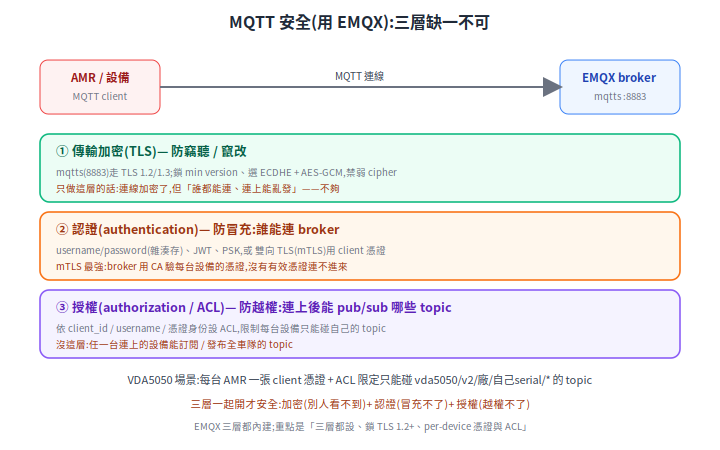

# MQTT over TLS:用 EMQX 達成 TLS 1.2+ 安全

[VDA5050](vda5050.md) 車隊、IoT 設備大多走 MQTT,但明文 MQTT(port 1883)**誰都能連、誰都能訂閱 / 發布任何 topic**。要安全,不是只「加個密」就好——安全是**三層**:傳輸加密、身份認證、權限授權。[EMQX](https://docs.emqx.com/) 這個常見的 MQTT broker 三層都內建,這篇講怎麼把它們設對。

> 相關:[VDA5050](vda5050.md)(車隊走 MQTT)、[實作小抄](rmf-adapter-cookbook.md)(adapter↔broker)、[STM32 REST+TLS](../20-firmware/stm32-rest-tls.md)(MCU 端連 mqtts 的資源考量)。

---

## 1. 三層,缺一不可

<p align="center"></p>

只做加密,連線是看不到了,但「誰都能連、連上能亂發」;加了認證,冒充不了,但連上的設備還是能碰全車隊的 topic。**三層一起開**才完整:加密(別人看不到)+ 認證(冒充不了)+ 授權(越權不了)。

## 2. ① 傳輸加密:鎖 TLS 1.2 起跳

EMQX 預設就開一個 SSL/TLS listener 在 **port 8883**(`mqtts`),預設是**單向**(client 驗 server 憑證)([Enable SSL/TLS](https://docs.emqx.com/en/emqx/latest/network/emqx-mqtt-tls.html))。達成「TLS 1.2 以上」規範的要點:

- **鎖最低版本**:`versions` 只留 `tlsv1.2` / `tlsv1.3`,**拿掉 TLS 1.0/1.1 與 SSLv3**。
- **選強 cipher**:用有 forward secrecy 的 **ECDHE** + AEAD 的 **AES-GCM**(或 ChaCha20),禁用 RC4/3DES/弱 CBC。
- **憑證由 CA 簽**、規劃輪換與撤銷(見 §6)。

## 3. ② 認證:從單向走到雙向 mTLS

預設單向只證明「broker 是真的」,但**沒驗 client 是誰**。要證明「連進來的是授權設備」,有幾種做法,最強的是**雙向 TLS(mTLS)**——broker 用 CA 驗每台 client 的 X.509 憑證:

- `verify = verify_peer`:要求並驗證 client 憑證
- `fail_if_no_peer_cert = true`:沒帶有效 client 憑證就**拒連**

([雙向 TLS 設定](https://www.emqx.com/en/blog/enable-two-way-ssl-for-emqx)、[認證總覽](https://docs.emqx.com/en/emqx/latest/access-control/authn/authn.html))。其他認證方式:username/password(雜湊存)、JWT、PSK——可單用或疊在 TLS 上。對車隊,**每台一張 client 憑證**最乾淨(憑證的 CN/DN 還能當身份給授權層用)。

## 4. ③ 授權:ACL 限制每台只能碰自己的 topic

連上之後,用 **ACL(存取控制清單)** 限制「這個身份能 connect / subscribe / publish 哪些 topic」。依 `client_id` / `username` / 憑證身份設規則,**讓每台設備只能碰自己的 topic**,而不是全車隊。

## 5. EMQX 配置骨架(pseudo)

```hocon
# EMQX 5.x(HOCON);確切鍵名以 EMQX 官方文件 / 你的版本為準
listeners.ssl.default {
  bind = "0.0.0.0:8883"
  ssl_options {
    cacertfile = "/etc/certs/ca.pem"        # 驗 client 憑證的 CA(mTLS 用)
    certfile   = "/etc/certs/server.pem"
    keyfile    = "/etc/certs/server.key"
    versions   = ["tlsv1.3", "tlsv1.2"]     # 鎖 1.2 起跳,不准更舊
    ciphers    = ["ECDHE-ECDSA-AES256-GCM-SHA384",
                  "ECDHE-RSA-AES256-GCM-SHA384"]
    verify               = verify_peer      # 要求並驗證 client 憑證
    fail_if_no_peer_cert = true             # 沒帶有效 client 憑證 → 拒連
  }
}
```

```text
# 授權 ACL(概念):每台只能碰自己 serialNumber 的 topic
allow  pub/sub   topic = "vda5050/v2/ACME/${clientid}/#"
deny   all
```

## 6. 注意事項

- **別只開加密**:三層缺一不可。只開 TLS 不做認證 / 授權,等於「上鎖的門但鑰匙人人有、進來想拿什麼拿什麼」。
- **per-device 憑證的生命週期**:每台一張、規劃**輪換**與**撤銷**(CRL / OCSP);一台設備被偷,要能單獨吊銷它的憑證而不影響其他。
- **handshake 的效能成本**:大量設備同時上線,TLS handshake 會壓 broker;用 session resumption、評估 broker 資源,設備端有硬體加速更好。
- **憑證過期監控**:server 與 client 憑證都會過期,要有到期告警,別等斷線才發現。
- **MCU 端的資源**:如果連進來的是 STM32 這類 MCU,`mqtts` 的 TLS 一樣吃 RAM/CPU(見 [STM32 REST+TLS](../20-firmware/stm32-rest-tls.md)),cipher suite 要兩端都撐得住。
- **VDA5050 落地**:每台 AMR 一張 client 憑證 + ACL 限定只能 pub/sub `vda5050/v2/廠/自己serial/*`,一台被攻破也碰不到別車。

## 結論

「MQTT 達成 TLS 1.2+ 安全」不是「打開 8883」這麼一句。完整的是:**鎖 TLS 1.2+ 與強 cipher(加密)→ 雙向 mTLS 或強認證(認證)→ per-device ACL(授權)**,三層一起。EMQX 三層都內建,工作量在「設對 + 管好每台設備的憑證與權限」。

## 來源

- EMQX:[Enable SSL/TLS](https://docs.emqx.com/en/emqx/latest/network/emqx-mqtt-tls.html)、[SSL/TLS 憑證](https://docs.emqx.com/en/emqx/latest/network/tls-certificate.html)、[雙向 TLS](https://www.emqx.com/en/blog/enable-two-way-ssl-for-emqx)、[認證](https://docs.emqx.com/en/emqx/latest/access-control/authn/authn.html)、[Network and TLS 總覽](https://docs.emqx.com/en/emqx/latest/network/overview.html)
