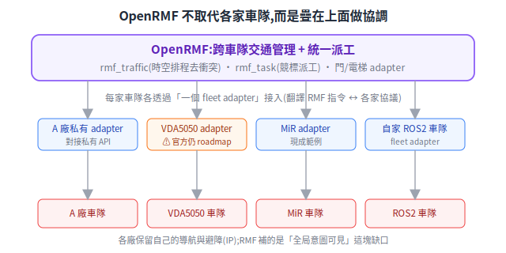
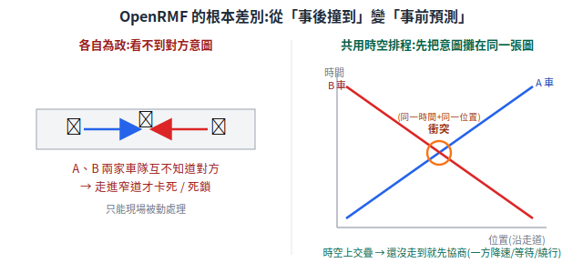
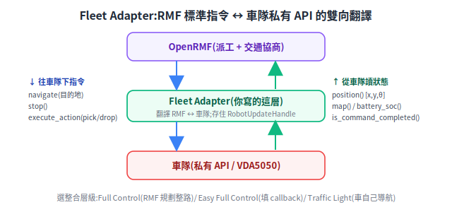
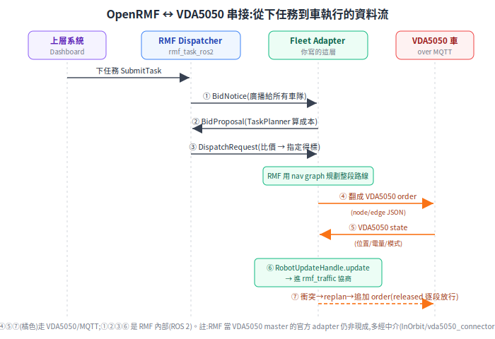

# OpenRMF:跨車隊調度

[VDA5050](vda5050.md) 解決了「一套主控怎麼跟不同廠的車講話」。但還有一層更上面的問題沒解決:**很多家車隊同時在一個場域跑,彼此共用門、電梯、窄道,誰來協調?** 這就是 OpenRMF 要補的那塊。

> 延伸閱讀:[VDA5050](vda5050.md)、[SLAM](../30-navigation/slam-mapping.md)、[定位](../30-navigation/localization.md)。

---

## 1. 根本問題:各車隊只看得到自己的車

每家 AMR 自帶 fleet manager(車隊管理系統),但它**只看得到、也只管得了自己的車**。多家車隊共用同一個物理空間時,衝突無可避免——RMF 官方直接說「多廠商、多機器人系統仍是未解問題」:

- **共用瓶頸資源爭搶**:一扇門、一台電梯、一條窄道,同一刻只容一台車,但 A 廠的車不知道 B 廠的車也要進。
- **互不相讓 / 死鎖**:窄道兩端各來一台不同廠的車,各自等對方先走,卡死。
- **基礎設施無法協調**:自動門、電梯要「被機器人呼叫」,若每家各接各的,門禁要同時對接 N 套私有協議。
- **無法統一派工**:想說「哪台車有空就派誰」,但跨車隊沒有共同語言比價。

## 2. 第一性原理:在車隊「之上」加一層,而不是取代它們

OpenRMF(Open Robotics Middleware Framework)由 **Open Robotics**(ROS 維護者)主導、建在 ROS 2 上。關鍵定位:**它不取代各家 fleet manager,而是疊在所有車隊「之上」做協調**。

為什麼是「疊上面」而不是「換掉」?第一性原理:**各廠的導航與避障是他們的核心 IP、而且運作良好,不需要、也換不掉**。真正缺的東西只有一個——**全局意圖的可見性**(誰打算走哪、何時走)。OpenRMF 補的就是這塊,讓各廠保留自己的車隊系統,只透過一個轉接層接進來:

<p align="center"></p>

### 核心元件

- **rmf_traffic**:交通管理函式庫——維護共用的時空排程,偵測不同車隊行程的衝突並協商化解(下一節詳述)。
- **rmf_fleet_adapter**:車隊轉接層——把各家車隊接進 RMF,翻譯「RMF 標準指令 ↔ 各家私有 API」。它本身**不直接開車**,真正驅動車的還是各廠 fleet manager。
- **rmf_task**:任務分派——RMF 的「大腦」,用競標機制(各 adapter 對任務出價,選成本最低者)決定「哪台車做哪件任務」,並自動考量電量等限制。
- **traffic schedule**:rmf_traffic 內的中央排程資料庫,存全場域所有車「打算走的軌跡」,找出意圖衝突。(註:是 rmf_traffic 的子系統,不是獨立套件。)
- **door / lift / workcell adapter**:基礎設施轉接層——讓 RMF 統一呼叫並協調自動門、電梯、工作站。

## 3. 交通協商:從「事後撞到」變「事前預測」

這是 OpenRMF 跟「各車隊各自為政」最根本的差別:

<p align="center"></p>

第一性原理在「共用一張時空排程」:

1. **共用時空排程**:所有接入的車隊,都必須把自家車「打算走的行程」上報到中央排程庫。排程庫因此擁有各自為政時缺的**全局視野**。
2. **衝突偵測(預防)**:車的軌跡以分段三次樣條表示,兩兩比對在時空上是否交疊;交疊就發 conflict notice。
3. **協商化解**:被通知的車隊各自提交「能容納對方」的替代行程(降速、暫停、繞行),RMF 的協商機制收斂到一組**彼此相容、整體延遲較小**的方案。(traffic 協商層相對平等對待各車,優先序主要在 rmf_task 派工端;細節以官方實作為準。)
4. **避障分工不變**:RMF 用「帶時間維度的 A*」處理車隊級的時空避讓;**單車對突發障礙的即時避障,仍由各車自己負責**——對 VDA5050 車隊就是協定規定的車端職責。

對比很清楚:沒有共用排程時,衝突只能在現場「卡住了」才被動處理;有了排程庫,衝突在「還沒走進去之前」就被預測並協商掉。這也接回 VDA5050 的 [released/horizon](vda5050.md#releasedhorizon逐段放行的安全設計最關鍵):RMF 協商定案後,才讓主控釋放下一段路。

## 4. OpenRMF 與 VDA5050 怎麼搭(含誠實的現況)

層次很清楚:**OpenRMF(跨車隊協調)→ fleet adapter →(對 VDA5050 車隊)VDA5050 over MQTT → 各廠 AMR**。理想上,對「支援 VDA5050」的車隊用一個 VDA5050 fleet adapter,讓 RMF 扮演 VDA5050 的 master control。

**但要誠實說明現況(查證結果,別被誤導)**:

- **「RMF 當 VDA5050 master、直接指揮 VDA5050 車隊」目前仍在官方 roadmap 階段**,沒有掛在 RMF `awesome_adapters` 的正式、生產級釋出(見 `rmf_demos` Issue #189「Roadmap for integrating VDA5050 with the OpenRMF」)。
- InOrbit 的 `ros_amr_interop`(含 `vda5050_connector`)方向**相反**:它是「讓一台 ROS2 機器人去連某個 VDA5050 主控」(車端接入),**不是**「讓 RMF 當主控去指揮 VDA5050 車隊」。引用時不要反向當成現成直連方案。
- 目前多數實際導入仍是「**RMF + 各廠私有 fleet adapter**」(已有 MiR、Gaussian Ecobot、Clearpath/OTTO 等現成 adapter;私有協議可用官方 `fleet_adapter_template` 當骨架自寫)。

> 一句話:VDA5050 與 OpenRMF 在架構上是天作之合(一個管車隊內共同語言、一個管跨車隊協調),但「RMF 直連 VDA5050 車隊」的成熟 adapter 還在路上,規劃導入時要把這點算進去。

### 兩者的職責邊界,與 adapter 真正要做的事

- **邊界**:**VDA5050 管「車隊內」(一個 master 對自己的車),RMF 管「車隊間」(多車隊的交通與派工)**,兩者不重疊。VDA5050 本身沒有跨車隊協調的概念——那正是 RMF 補的層。
- **連續 → 離散的落差(VDA5050 adapter 的核心難點)**:RMF 協商出來的是**連續時空樣條軌跡**,VDA5050 的 order 卻是**離散的 node/edge 圖**。adapter 要把前者切成後者、並逐段對映到 released/horizon——這個「連續轉離散」是寫 VDA5050 fleet adapter 最麻煩的一塊。
- **factsheet 是跨廠派工的能力來源**:RMF 要「哪台車有空就派誰」,前提是知道每台車的尺寸/載重/支援 action——這正是 VDA5050 `factsheet` 提供的;rmf_task 競標時據此判斷車能不能做、成本多少。
- **座標與時間要先對齊**:多廠車隊共用一張時空排程,前提是各家 map frame 與時間基準對齊;adapter 通常要做 frame transform([座標轉換](../30-navigation/kinematics-and-coordinate-transforms.md))。

## 5. 系統需求、語言與安裝

**跑在 ROS 2 上**,跟著 ROS 2 的 Tier-1 平台走:

| ROS 2 distro | Ubuntu | 備註 |
|---|---|---|
| Humble | 22.04 | LTS,最常用 |
| Jazzy | 24.04 | LTS,較新 |
| Kilted / Rolling | 24.04 / 滾動 | 較新 / 開發用 |

- **架構**:amd64 與 **aarch64(ARM64)** 都支援;另有 RHEL/Fedora 的 RPM。
- **安裝三選一**:① apt 二進位 `sudo apt install ros-<distro>-rmf-dev`(只用不改核心時最快);② source build(`vcs import` 抓 `rmf.repos` 共 17 個套件 + `colcon build`,**官方建議用 clang + lld**,因為 C++ template 重、編譯吃記憶體);③ 官方 docker image `ghcr.io/open-rmf/rmf`(各 distro nightly)。
- **硬體**:**不需要 GPU**(核心是交通協商與任務規劃,純 CPU)。source build 因 template heavy 建議 **RAM ≥ 8GB(16GB 較穩)**;runtime 本身吃資源不大。
- **使用語言**:**核心(rmf_traffic、rmf_task)是 C++**;**fleet adapter 可用 C++ 或 Python**(Python 經 pybind11 綁定,套件 `rmf_fleet_adapter_python`,import 名 `rmf_adapter`)。**官方範本 `fleet_adapter_template` 是純 Python**。設定用 **YAML**;場域地圖用 **traffic-editor** 畫、輸出 `.building.yaml`(含 waypoint/lane/交通圖)。
- **核心 repo**:`rmf_traffic`(協商引擎)、`rmf_task`(競標派工)、`rmf_ros2`(ROS2 節點層,含 `rmf_fleet_adapter`)、`rmf_battery`(電量/回充模型)、`rmf_traffic_editor`、`rmf_demos`。

## 6. 怎麼寫一個 fleet adapter

把一個車隊接進 RMF,就是寫一支 fleet adapter。**先選整合層級**(對 RMF 的控制力由高到低):

| 層級 | RMF 的控制力 | 何時用 |
|---|---|---|
| **Full Control** | 最高:RMF 規劃**完整路徑**、可即時打斷重派 | 車的 API 接受「導到某點」且可被打斷 |
| **Easy Full Control** | 同上,但只填 callback、不碰內部邏輯 | **官方建議起點**,多數整合用這個 |
| **Traffic Light** | 最低:RMF 只能 pause/resume,**車自己規劃路徑** | 車自有完整導航,只想要 RMF 當「路口紅綠燈」防撞 |

> 這就是「RMF 規劃整條路下發」(Full Control)vs「車自己導航」(Traffic Light)的差別——大多數導入用 **Easy Full Control**:RMF 用 nav graph 逐 waypoint 下目的地,車負責實際開過去。

<p align="center"></p>

**從 `fleet_adapter_template`(Python)開始,要實作的就兩組函式:**

```
往車隊下指令(RMF → 車):              從車隊讀狀態(車 → RMF):
  navigate(目的地 x,y,θ, 地圖名, 速限)   position()    → 車在自己座標的 [x,y,θ]
  start_activity(...)  dock/開門/電梯     map()         → 目前地圖名
  stop()               叫車停            battery_soc() → 電量
                                         is_command_completed() → 命令完成了沒
```

對應 Easy Full Control 的 C++ API:加車用 `add_robot(name, initial_state, configuration, callbacks)`;`callbacks` 裡是 `NavigationRequest`(去某目的地、完成時呼叫 `execution.finished()`)、`StopRequest`、`ActionExecutor`;狀態用 `EasyRobotUpdateHandle::update(RobotState{map, position, battery_soc}, ...)` 回報。**`add_robot` 回傳的 `RobotUpdateHandle` 一定要存起來**,之後持續用它更新車況。

**`config.yaml` 要填的**(車隊契約):車隊名、`limits`(線/角速度與加速度上限)、`profile`(footprint 半徑、vicinity 防護半徑)、`reversible`(可否倒退)、`battery_system`(電壓/容量/充電電流)、`mechanical_system`(質量/慣量/摩擦)、`recharge_threshold`/`recharge_soc`(何時回充、充多滿)、`task_capabilities`(loop/delivery/clean)、以及 `reference_coordinates`(RMF 座標 ↔ 車座標的對應,建議至少 4 組 waypoint 求轉換——呼應 §4 的「座標要先對齊」)。

## 7. 串接流程:從下任務到車執行

把前面組起來,一筆任務從下達到車執行、再回報協商的完整資料流:

<p align="center"></p>

逐步看:

1. **下任務**:上層系統發 `SubmitTask` 給 RMF Dispatcher(`rmf_task_ros2` 的 `rmf_dispatcher_node`)。
2. **競標派工**(RMF 內部,ROS 2):Dispatcher 發 **BidNotice** 廣播 → 各 fleet adapter 用 `rmf_task::TaskPlanner` 算成本回 **BidProposal** → Dispatcher 比價(fastest-to-finish / lowest-cost)發 **DispatchRequest** 指定得標車隊。
3. **規劃**:得標車隊的 adapter,RMF 用 nav graph 規劃整段路線,逐 waypoint 下 `NavigationRequest`。
4. **翻成 VDA5050**(走 MQTT):adapter 把目的地翻成 VDA5050 **order**(node/edge 的 JSON)發給車。
5. **車回報**:車週期發 VDA5050 **state**(位置、電量、模式)。
6. **更新回 RMF**:adapter 把 state 轉成 `RobotUpdateHandle.update(...)` 餵回 rmf_traffic 的時空排程。
7. **協商**:排程偵測到衝突 → 重規劃 → 追加 order 更新;這裡 RMF「已協商釋出的路段」對映到 VDA5050 order 的 **`released`** 旗標(逐段放行),未協商完的後續段標 `released:false`(horizon)。

> ⚠️ **誠實標註**:第 7 步「RMF released ↔ VDA5050 released horizon」的對映是依兩邊協定語意推得的**整合設計建議**,官方沒有逐欄定義的權威文件(因為官方 RMF-as-VDA5050-master adapter 尚未成熟,見 §4)。實務多走 adapter 內自行轉換,或經 InOrbit `vda5050_connector`(MQTT_bridge + Controller + Adapter 三件)這類中介。

## 8. 落地場景與開源位置

- **旗艦場景**:醫院(送藥/檢體/送餐車與門、電梯深度整合)、機場/大樓/飯店等共用電梯與窄道的室內場域;新加坡是主要早期落地與資助來源。
- **可跑 demo**:`rmf_demos` 提供醫院、辦公室、機場情境(含交通協商、門/電梯協調)。

| 用途 | repo |
|---|---|
| 總入口 | [github.com/open-rmf](https://github.com/open-rmf) |
| 交通管理 | [open-rmf/rmf_traffic](https://github.com/open-rmf/rmf_traffic) |
| ROS2 整合 + fleet adapter | [open-rmf/rmf_ros2](https://github.com/open-rmf/rmf_ros2) |
| 任務 | [open-rmf/rmf_task](https://github.com/open-rmf/rmf_task) |
| demo | [open-rmf/rmf_demos](https://github.com/open-rmf/rmf_demos) |
| adapter 範本 | [open-rmf/fleet_adapter_template](https://github.com/open-rmf/fleet_adapter_template) |
| 社群 adapter 清單 | [open-rmf/awesome_adapters](https://github.com/open-rmf/awesome_adapters) |

## 9. 來源

- [ROS2 Multi-Robot Book — RMF Core](https://osrf.github.io/ros2multirobotbook/rmf-core.html) / [整合車隊](https://osrf.github.io/ros2multirobotbook/integration_fleets.html)
- [open-rmf/rmf(安裝/repos/clang+lld/docker)](https://github.com/open-rmf/rmf)、[fleet_adapter_template(Python)](https://github.com/open-rmf/fleet_adapter_template)
- [EasyFullControl.hpp(add_robot/callbacks/RobotState API)](https://github.com/open-rmf/rmf_ros2/blob/main/rmf_fleet_adapter/include/rmf_fleet_adapter/agv/EasyFullControl.hpp)
- [rmf_demos Issue #189(VDA5050 整合詢問,仍 open)](https://github.com/open-rmf/rmf_demos/issues/189)、[InOrbit ros_amr_interop / vda5050_connector](https://github.com/inorbit-ai/ros_amr_interop)
- [VDA5050 官方規格](https://github.com/VDA5050/VDA5050/blob/main/VDA5050_EN.md)
