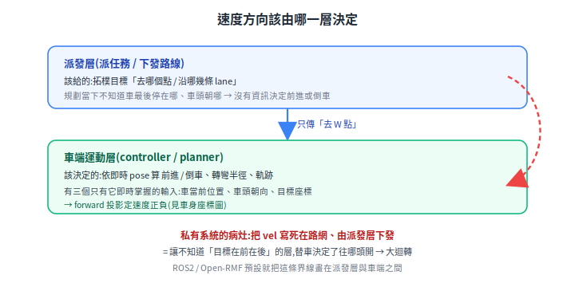

# 用 proprietary 系統(私有系統)案例討論:在 ROS2 會發生嗎

一個真實現場狀況:叉車從任意位置出發,系統要它先回到預定路線的起點,結果車子畫了一個大圈才接上路線(以下稱「大迴轉」)。乍看像「舵輪叉車轉不了急彎」的運動學限制,拆開來看,真因是**速度方向的決定權被放錯了層**。把同樣情境放進 ROS2 / Open-RMF,結構上不會出現這種大迴轉,原因正在於分層放對了位置。

> 前置:[OpenRMF](open-rmf.md)、[Fleet 深入:API/圖資/座標/避塞車](rmf-maps-and-traffic.md)、[路徑規劃與軌跡](../30-navigation/path-planning.md)。

---

## 1. 案例:大迴轉怎麼來的

先講清楚這類私有調度系統的世界觀:

- 廠房路網是**預先規劃**的(一堆節點 node 與連線 edge),節點之間組成可走的路線。
- 車輛被假設**走在路網的節點與連線上**。派發層(負責派任務、下發路徑)只要給「沿哪幾條路線走」。

問題出在「任意起點」:車當下不在任何節點上(剛上電、被推過、上一個任務停在半路)。這時系統的處理是:

1. 路徑演算法挑一個**離車最近的儲位或路徑點**,當成第一條路徑的起點。
2. 派發層把這個點設成第一條路徑的 `startX/startY`,要車「先回到這個起點,再沿路線走」。
3. 車從當前位置到這個起點的這段「接駁」,**直接沿用了第一條路徑的速度** `vel`。

關鍵就在第 3 步。看一段簡化的路徑定義:

```json
{
  "linePaths": [
    {
      "startX": -9.527, "startY": 1.308, "startTheta": 0.008,
      "endX":   -7.700, "endY":   2.308, "endTheta":   1.57,
      "vel": 0.5
    }
  ]
}
```

`vel` 是**有號**的:正值代表前進,負值代表倒車。第一條路徑設計時是要往前開(`vel = 0.5`),於是接駁段也用了 `+0.5`。

這裡要把叉車的車頭講清楚,因為它是整個問題的支點:

- 這台是**舵輪驅動叉車**:有動力、可大角度轉向的舵輪在**非牙叉端**,牙叉端是兩顆被動載重輪。
- **車頭 = 舵輪端**。`vel` 正值 = 往舵輪端方向走;負值 = 往牙叉端方向走。

把案例數值代進去:車當前在 `X = -8.549`、車頭(舵輪端)朝 +X;路徑起點在 `startX = -9.527`,也就是在車的 **−X 方向 = 牙叉端那一側 = 車的正後方**。

於是矛盾成形:**要去的點在車後方,給的卻是前進速度。** 舵輪叉車不會側移,前進又只能往車頭(+X)那頭去,車子只好往前開出去再繞一大圈,才能回到後方那個起點。這就是大迴轉。

<p align="center"></p>

最短解其實只差一個正負號:接駁段給 `vel` 負值,讓車往牙叉端**倒退約 1 公尺**就接上起點,連掉頭都不必。

## 2. 第一性原理:這是哪一層該決定的事

把問題還原到最根本:**「該前進還是倒車」這個決定,需要哪些資訊?**

要判斷目標在車的前方還後方,需要兩組資訊:車的 **pose**(pose = 位置 + 朝向,這裡指車的座標加上車頭朝向 θ),和**目標點的座標**。車頭朝向是關鍵,因為「前方 / 後方」是相對車頭定義的。

有了這些,用一條投影就能定號。設車 pose 為 `(xᵣ, yᵣ, θᵣ)`,目標為 `(xₜ, yₜ)`。`(cos θᵣ, sin θᵣ)` 就是車頭指的方向;把「車到目標」這支箭頭打影子(投影)到車頭方向,影子朝前為正、朝後為負:

```
forward = (xₜ − xᵣ)·cos θᵣ + (yₜ − yᵣ)·sin θᵣ
```

- `forward > 0` → 目標在舵輪端(車頭)前方 → 該前進(`vel` 正)。
- `forward < 0` → 目標在牙叉端(車尾)後方 → 該倒車(`vel` 負)。

代案例:車頭朝 +X,所以 `θᵣ ≈ startTheta ≈ 0.008 ≈ 0`,`sin` 項可忽略,投影退化成只看 X 差:`forward ≈ (−9.527 −(−8.549))·cos 0 ≈ −0.978 < 0` → 應倒車。系統卻給了 `+0.5`,方向剛好相反,大迴轉是這個符號錯誤的必然結果。

重點不在這條公式,而在**它需要的輸入(車的即時 pose),只有車端當下掌握**。私有系統的做法是把 `vel` 連同路徑幾何一起**寫死在靜態路網定義裡**,接駁段直接**沿用**這個符號,沒有依車當下的 pose 重算一次。於是「該前進還倒車」這個本該看即時朝向的決定,被一個規劃階段就固定的數值取代了。這是責任錯置,不是運動學限制。

<p align="center"></p>

## 3. 對應到 ROS2 / Open-RMF:被切成兩層

同一件事,在 ROS2/RMF 的分層裡本來就是**兩層**,而私有系統的病灶是把它們**併在派發層**:

| 層 | 負責 | ROS2/RMF 是誰 | 碰速度方向嗎 |
|---|---|---|---|
| 拓樸分配層 | 接回哪個 waypoint / 哪條 lane | `rmf_traffic` + fleet adapter 的 **lane merge**(把車對到最近的路網線) | 不碰。只給「去 W 點」 |
| 運動規劃層 | 從當前 pose 怎麼開過去(前進/倒車、轉彎半徑、軌跡) | **車端 Nav2**(controller / planner) | **這層的權責**,內建車輛運動學 |

RMF 給車的是**拓樸目標**(「去這個 waypoint」),它**不生成軌跡、不指定速度符號**。「現在該前進還倒車」是車端 Nav2 拿著即時 pose 自己算的。Open-RMF 的 fleet adapter 還有一組距離門檻,把車回報的 pose **吸附**到 nav graph 上最近的 waypoint / lane:`RobotUpdateHandle::update_position()` 的 `max_merge_waypoint_distance`(預設 0.1 m)與 `max_merge_lane_distance`(預設 1.0 m)。注意這是 C++ 函式參數,不是 `config.yaml` 的鍵。車偏離 nav graph 太遠、併不回任何 waypoint / lane 時,RMF 會把它標成 `Lost`(`RobotContext::set_lost()`,並掛一張回報 ticket);這不是狀態機列舉的一格,而是一個 optional 標記。這套「吸附門檻 + `Lost` 標記」正是私有系統缺的那個「車在不在軌道上」旗標。

換句話說,案例那個 bug 在 RMF 架構下**沒有容身的層**:沒有任何一層會去做「用固定 `vel=+0.5` 追一個座標」這件事,因為速度符號根本不在派發側被決定。

## 4. 那 ROS2 會不會也大迴轉

要分兩種「迴轉」,結論不同:

**(a) nonholonomic 運動學的必然迴轉 — 會有,但被壓到最小。**
nonholonomic 指「不能側移、只能沿車頭方向前後走」。任何舵輪 / Ackermann(像汽車那樣靠轉向輪打角)車從任意朝向接目標,因為有最小轉彎半徑,一定會有一段迴轉。但這台叉車的舵輪可轉到接近 ±90°,最小轉彎半徑很小,甚至能繞牙叉端兩輪做近似原地掉頭。所以它本來就**有能力**小半徑接回,不該被迫走大圈。

**(b) 案例這種「前進追後方點」的病態大迴轉 — 結構上不會。** 因為:

1. Nav2 是 free-space(自由空間,不限定走在路網線上)規劃,在 costmap(把障礙與可走區畫成成本格的地圖)上算路徑;目標在後方就直接規劃倒車或最短可行路徑,不被「沿用前段速度符號」綁死。
2. 倒車與否主要在 **planner 階段**決定。Nav2 的 Smac Hybrid-A* 規劃器(Smac Hybrid-A* / Dubins / Reeds-Shepp 三個詞見[文末名詞解釋](#名詞解釋smac-hybrid-a--dubins--reeds-shepp))有 `motion_model_for_search`:選 Dubins 只准前進,選 **Reeds-Shepp 則允許倒車**;再配合 `minimum_turning_radius` 與 `reverse_penalty`(倒車代價,預設 2.1,只在 Reeds-Shepp 下生效),規劃出「倒一小段」而不是「前進繞一大圈」的路徑;controller(如 RPP / MPPI)再去追隨這條路徑、輸出帶符號的速度。
3. RMF 只給拓樸目標、不給軌跡,責任分層乾淨。

但有前提:**Nav2 的運動學模型要配對**(`minimum_turning_radius`、motion model、允許倒車)。拿差速車的設定去開舵輪車、或沒開倒車,一樣會出怪軌跡。所以 ROS2 不是「天生免疫」,而是**把這個決策放對了層,且 controller 本身懂運動學**。

<p align="center"></p>

## 5. 私有系統的三個對策,對到 ROS2 怎麼做

現場討論這類問題時,常見三個方向。把它們對到 RMF/Nav2,順便看缺點怎麼解:

| 現場對策 | 缺點 | RMF / Nav2 對應 |
|---|---|---|
| 不追起點,直接開往路線終點 | 起點若在軌道外,長距離移動沒有碰撞保護 | RMF/Nav2 在 free-space 也有 **costmap + traffic schedule** 保護,不是裸奔 |
| 多插一段接駁路徑,獨立給速度(可倒車) | 每個任務開頭多一段、車會卡頓 | 這正是 Nav2 標準做法:從當前 pose 規劃 approach,速度由 planner 定、可倒車,且是連續軌跡不卡頓 |
| 讓系統知道車在不在軌道上 | 私有系統沒有這個狀態 | RMF 的 **lane-merge 距離判定**就是這個旗標,明確分 on-lane / off-lane(lost) |

## 6. 最小止血(不重構也能先擋)

接駁段(當前 pose → 路線起點)的速度符號**不要繼承路線的 `vel`**,改成即時算:

1. 用第 2 節的 `forward` 投影判斷起點在車身的前後。
2. 落在牙叉端(`forward < 0`)→ `vel` 給負,直接倒退過去。
3. 落在舵輪端(`forward > 0`)→ `vel` 給正。
4. 橫向偏移大 → 交給車端用舵輪大轉角做小半徑接近,而不是固定速度硬追。

案例就屬於第 2 種,倒車一小段結案。

這也把現場「需要派發層與車端一起討論」收斂成一句明確命題:**速度方向(`vel` 正負)的決定權,從派發層下放到車端**;派發層只給「去哪個點」,車端依即時 pose 決定「怎麼去」。這條界線,正是 ROS2/RMF 預設就畫好的那一條。

## 7. 待實測

參數名與語意已對照原始碼確認(見下方來源);仍待實測的是調參效果:Nav2 Smac Hybrid-A* 在**窄空間**倒車接駁時,`reverse_penalty`(預設 2.1)、`change_penalty`(預設 0)要調到多少,才在「倒車一小段」與「前進繞行」之間取得現場想要的折衷。這要在目標場域實際跑才定得下來。

## 8. 來源

- 拓樸 vs 運動規劃分層:[Open-RMF](open-rmf.md)、[rmf_traffic](https://github.com/open-rmf/rmf_traffic)。
- pose 吸附門檻與 `Lost`:[RobotUpdateHandle.hpp](https://github.com/open-rmf/rmf_ros2/blob/main/rmf_fleet_adapter/include/rmf_fleet_adapter/agv/RobotUpdateHandle.hpp)(`max_merge_waypoint_distance`=0.1 / `max_merge_lane_distance`=1.0)、[RobotContext.hpp](https://github.com/open-rmf/rmf_ros2/blob/main/rmf_fleet_adapter/src/rmf_fleet_adapter/agv/RobotContext.hpp)(`struct Lost` / `set_lost`)。
- nonholonomic 規劃:[Nav2 Smac Hybrid-A*](https://docs.nav2.org/configuration/packages/smac/configuring-smac-hybrid.html)、[smac_planner README](https://github.com/ros-navigation/navigation2/blob/main/nav2_smac_planner/README.md)(`motion_model_for_search` Dubins/Reeds-Shepp、`minimum_turning_radius`=0.40、`reverse_penalty`=2.1)。
- 叉車運動學:[路徑規劃與軌跡](../30-navigation/path-planning.md)、[座標轉換與 TF](../30-navigation/kinematics-and-coordinate-transforms.md)。
- Dubins / Reeds-Shepp 科普:[Reeds-Shepp 與 Dubins 曲線(機器人家園)](https://www.robotattractor.com/reeds-shepp-dubins/)。

## 名詞解釋:Smac Hybrid-A* / Dubins / Reeds-Shepp

§4 用到的三個詞,放在這裡一起講清楚。

### Dubins 曲線

1957 年 Lester Dubins 的結果。設想一台**只能往前開**、有**最小轉彎半徑**(方向盤打死也只能轉這麼急)的車,從一個起點 pose 開到終點 pose(pose = 位置 + 朝向),最短路徑長什麼樣?Dubins 證明:最短路徑一定是「圓弧 → 直線 → 圓弧」的拼接,圓弧半徑就是車的最小轉彎半徑,而且**只有 6 種候選樣式**,從中挑最短;樣式用 L(左滿舵弧)、R(右滿舵弧)、S(直線)表示(如 LSL、RSR、LRL)。關鍵限制:**全程前進,不能倒車**。

### Reeds-Shepp 曲線

1990 年 Reeds 與 Shepp 把 Dubins 放寬:**允許倒車**。同樣求最小轉彎半徑的車從起點 pose 到終點 pose 的最短路徑,但可以前進與倒退交替。候選樣式從 6 種增為 **46 種**(原論文列 48 種,後人證明其中 2 種不會是最短),從中挑最短。倒車帶來兩個結果:

- 路徑會出現**換向點(cusp)**:車停下、由前進切成倒退(或反過來)的那個尖點。
- 路徑**通常比 Dubins 短**,目標在車後方時尤其明顯——Dubins 只能往前繞一大圈,Reeds-Shepp 直接倒車過去。

還有一個值得記的性質:**只要起點到終點之間存在任何一條無碰撞路徑,就一定存在一條無碰撞的 Reeds-Shepp 曲線**;Dubins 沒有這個保證。這是運動規劃偏好 Reeds-Shepp 的根本原因之一。本文案例的「該倒車卻前進」,本質就是被限制在 Dubins 的世界、而非 Reeds-Shepp。

<p align="center"></p>

### Smac Hybrid-A*

Nav2 內建的路徑規劃器(planner,套件 `nav2_smac_planner`)。一般的 A* 在格子地圖上找路,節點是離散格子,算出來是折線,**沒考慮車的運動學**——可能要求車原地急轉或走出方向盤打不出來的彎,車根本開不出來。Hybrid-A*(源自 2008 年前後的 DARPA 無人車研究)改成在**連續狀態 (x, y, θ)** 上搜尋:每往前展開一步,都用車的運動模型(就是上面 Dubins 或 Reeds-Shepp 的一小段)生成,所以搜出來的路徑**車一定開得出來**(滿足最小轉彎半徑,可選含不含倒車)。

Dubins / Reeds-Shepp 在這裡有**雙重角色**:既是每一步展開用的運動模型,它們的**路徑長度**也被拿來當搜尋的**啟發函數(heuristic)**——估「忽略障礙、單看運動學,從這裡到目標還要多遠」,引導 Hybrid-A*(或 RRT*)更快收斂。

把三者串起來:**Hybrid-A* 是搜尋框架,Dubins / Reeds-Shepp 是它每一步的運動模型、也是它的運動學啟發式**。Nav2 的 `motion_model_for_search` 選哪一個,就決定了規劃時准不准倒車,正是 §4 那個「會不會被迫大迴轉」的開關。

## 論文出處

- **Hybrid-A*(原始論文)**:Dolgov, Thrun, Montemerlo, Diebel, "Practical Search Techniques in Path Planning for Autonomous Driving," STAIR-08(First Int. Symp. on Search Techniques in AI and Robotics), 2008。源自 2007 DARPA Urban Challenge 的停車場自主導航。
  - [Stanford PDF](https://ai.stanford.edu/~ddolgov/papers/dolgov_gpp_stair08.pdf) ・ [AAAI 條目](https://aaai.org/papers/ws08-10-006-practical-search-techniques-in-path-planning-for-autonomous-driving/)
  - 期刊延伸版:同作者, "Path Planning for Autonomous Vehicles in Unknown Semi-structured Environments," _Int. J. of Robotics Research_ 29(5), 2010([DOI: 10.1177/0278364909359210](https://journals.sagepub.com/doi/10.1177/0278364909359210))。
- **Smac Planner(Nav2 的 Smac Hybrid-A* 實作)**:Macenski, Moore, Lu, Merzlyakov, Ferguson, "From the Desks of ROS Maintainers: A Survey of Modern & Capable Mobile Robotics Algorithms in the Robot Operating System 2," _Robotics and Autonomous Systems_ 168, 2023。涵蓋 Smac Planner 的 2D-A* / Hybrid-A* / State Lattice 實作。
  - [arXiv:2307.15236](https://arxiv.org/abs/2307.15236) ・ [ScienceDirect](https://www.sciencedirect.com/science/article/abs/pii/S092188902300132X)
