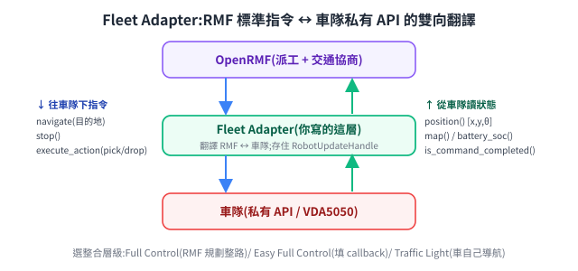

# 實作小抄:VDA5050 adapter + REST 派任務(pseudo-code)

[OpenRMF 篇](open-rmf.md) 講了「為什麼」與介面長相,這份補兩段最常被問的最小寫法——都是 **pseudo-code**,目的是把骨架與資料流講清楚,**真實 API 簽名、欄位、端點路徑以官方當前版本為準**(見文末來源)。

> 前置:[OpenRMF](open-rmf.md)(fleet adapter 介面)、[VDA5050](vda5050.md)(order/state 結構)、[Fleet 深入](rmf-maps-and-traffic.md)(三層 API、task request JSON)。

---

## 先讀這段:pseudo 跟真實 API 差在哪

下面的骨架為了敘事做了三處簡化,實作前要知道:

| pseudo 寫的 | 真實 API |
|---|---|
| 一次給整條 `path` | `EasyFullControl` 的 `NavigationRequest` 目的地是**單一 waypoint**,RMF 逐段下 |
| 狀態分幾個欄位回報 | 單一 `EasyRobotUpdateHandle.update(RobotState{map, position, battery_soc})` |
| `battery_soc` 直接放電量 | 它是 **0–1 的比例**;VDA5050 的 `batteryCharge` 是 0–100,要除以 100 |

還有一處**不是簡化而是重點**:`nodeId` **不能現生**。它必須用車廠透過 LIF 交付、車自己已經認得的那一套(見[多車隊怎麼共用一個場域 §3](rmf-maps-and-traffic.md#3-vda5050-車輛怎麼拿到圖資最容易誤解的一段))。下面骨架裡寫成 `node_id_of(wp)`,就是在提醒這裡要查表而不是編號。

---

## 1. 寫一個 VDA5050 fleet adapter(最小骨架)

**一句話定位**:adapter 是「RMF 世界 ↔ VDA5050 世界」的翻譯員。RMF 那側用 fleet adapter 程式 API(`EasyFullControl`),VDA5050 那側用 MQTT 收發 `order` / `state`。

<p align="center"></p>

要翻譯的就是兩個方向:

- **RMF → 車**:RMF 算好「去哪幾個 waypoint」,adapter 把它組成 VDA5050 `order`,用 MQTT 發給車。
- **車 → RMF**:車週期性發 `state`,adapter 解析後回填給 RMF(車現在在哪、電量多少、這段走完了沒)。

```python
# ── VDA5050 ↔ Open-RMF adapter(pseudo-code,最小骨架)──
rmf  = EasyFullControl(fleet_name="vda5050_fleet", config=load("fleet_config.yaml"))
mqtt = MqttClient(broker="tcp://broker:1883")

# topic 命名:interfaceName/majorVersion/manufacturer/serialNumber/topic
def topic(robot, kind):
    return f"vda5050/v2/{robot.manufacturer}/{robot.serial}/{kind}"

# 方向一:RMF 要車沿一串 waypoint 走 → 組 VDA5050 order 發出去
def on_navigate(robot, path, on_done):     # path = [(x, y, theta, map_id), ...]
    order = {
        "headerId": next_header_id(),
        "orderId":  new_uuid(),
        "orderUpdateId": 0,
        "nodes": [
            {"nodeId": node_id_of(wp),   # 用車已經認得的 LIF nodeId,不要現生
             "sequenceId": 2*i, "released": True,
             "nodePosition": {"x": p.x, "y": p.y, "theta": p.theta, "mapId": p.map_id}}
            for i, p in enumerate(path)
        ],
        "edges": [
            {"edgeId": f"e{i}", "sequenceId": 2*i+1, "released": True,
             "startNodeId": f"n{i}", "endNodeId": f"n{i+1}"}
            for i in range(len(path) - 1)
        ],
    }
    mqtt.publish(topic(robot, "order"), json(order))
    robot.pending_done = on_done            # 等車回報走完這段,再通知 RMF

# 方向二:車週期性發 state → 解析後回填 RMF
def on_state(raw):
    s = json_parse(raw)
    robot = lookup_by_serial(s["serialNumber"])
    rmf.update_position(robot, map=s["agvPosition"]["mapId"],
                        position=(s["agvPosition"]["x"],
                                  s["agvPosition"]["y"],
                                  s["agvPosition"]["theta"]))
    rmf.update_battery(robot, s["batteryState"]["batteryCharge"])
    if not s["nodeStates"] and not s["edgeStates"]:   # 都空 = order 走完
        if robot.pending_done: robot.pending_done()   # 通知 RMF:這段完成

mqtt.subscribe("vda5050/v2/+/+/state", on_state)       # + 萬用字元收全車隊
rmf.run()
```

**取放怎麼接**:叉起/放下這類動作,對映成 VDA5050 的 `action`(掛在 node 上)或 `instantActions`;在 RMF 那側對應 **dispenser / ingestor** 事件(RMF 把「取貨」與「放貨」抽象成兩種工作站:dispenser 是**出貨方**,把東西交給機器人;ingestor 是**收貨方**,從機器人手上收走。分成兩個是因為兩邊可能是完全不同的設備,而且各自有自己的忙碌/就緒狀態要等)。最小導航骨架可先不做,要展示完整搬運再加(見 [VDA5050 篇](vda5050.md) 的 order 樹與 action)。

## 2. 用 REST API 叫 RMF 派一個任務

**一句話**:`rmf-web` 的 api-server 開了 HTTP 端點,你 POST 一個 **task request**,RMF 就會把它丟進競標派工(BidNotice → BidProposal → DispatchRequest,見 [open-rmf §5 串接流程](open-rmf.md#5-串接流程從下任務到車執行)),選一台車去做。

`curl`:

```bash
# pseudo-code:確切路徑/schema 以 rmf-web api-server 的 /docs(OpenAPI)為準
curl -X POST http://RMF_WEB_HOST:8000/tasks/dispatch_task \
  -H "Content-Type: application/json" \
  -d '{
    "type": "dispatch_task_request",
    "request": {
      "category": "delivery",
      "description": { "pickup": "rack_A", "dropoff": "rack_B" },
      "fleet_name": "vda5050_fleet",
      "priority": { "type": "binary", "value": 0 }
    }
  }'
```

Python:

```python
import requests
resp = requests.post(
    "http://RMF_WEB_HOST:8000/tasks/dispatch_task",
    json={"type": "dispatch_task_request",
          "request": {"category": "delivery",
                      "description": {"pickup": "rack_A", "dropoff": "rack_B"}}})
print(resp.json())   # 回傳 task_id / state,可再用 GET /tasks/{id} 追蹤
```

`request` 裡只有 `category` 與 `description` 必填,`description` 的內容要符合該車隊那個 category 的 schema(delivery / patrol / clean 各不同);選填 `fleet_name`(指定車隊)、`priority`、`labels`、`unix_millis_earliest_start_time` 等(對照 [Fleet 深入 §1](rmf-maps-and-traffic.md))。正式部署的 api-server 通常開了驗證,裸 `curl` 要帶 auth token。

## 其他注意

- 以上是 **pseudo-code 等級**:確切簽名、REST 端點路徑與 task schema,**一定要對照當前版本的 `rmf_ros2`、`rmf_api_msgs`、`rmf-web` 原始碼**(版本間會變)。
- **MQTT topic 的 `v2`** 跟著 VDA5050 協定主版本走(spec main 已示範 `v3`),用哪版對齊你車隊的協定版本。
- VDA5050 的 `headerId` 遞增、`orderUpdateId` 規則、`released` vs horizon 的逐段釋放,按規範處理(見 [VDA5050 篇](vda5050.md))。

## 來源

- fleet adapter 寫法:[fleet_adapter_template](https://github.com/open-rmf/fleet_adapter_template)、[rmf_ros2](https://github.com/open-rmf/rmf_ros2)。
- Web/REST API:[rmf_api_msgs](https://github.com/open-rmf/rmf_api_msgs)、[rmf-web](https://github.com/open-rmf/rmf-web)(api-server 的 `/docs` 看 OpenAPI)。
- VDA5050 order/state:[VDA5050 規格](https://github.com/VDA5050/VDA5050/blob/main/VDA5050_EN.md)。
