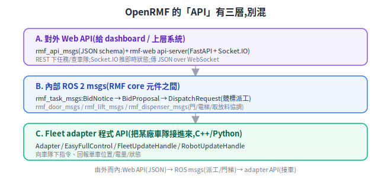
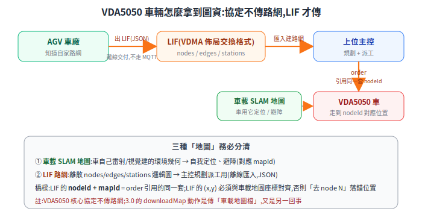
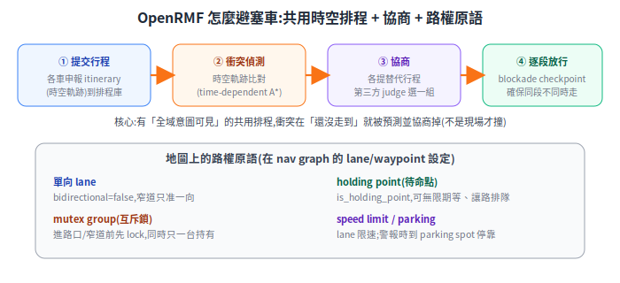

# Fleet 深入:RMF API、圖資匯入、座標對齊與避塞車

四個常被問到的細節:**OpenRMF 有哪些 API、VDA5050 的基本結構、VDA5050 車輛怎麼拿到圖資、OpenRMF 怎麼讀不同車的地圖並做座標轉換、避塞車**。前兩篇([OpenRMF](open-rmf.md)、[VDA5050](vda5050.md))講「為什麼」,這篇補「機制細節」。

> 前置:[OpenRMF](open-rmf.md)、[VDA5050](vda5050.md)、[座標轉換與 TF](../30-navigation/kinematics-and-coordinate-transforms.md)。
> API/格式名稱經官方來源查證;不確定處標待查證。

---

## 1. OpenRMF 有哪些 API:三層,別混

「RMF 的 API」橫跨三個層級,先分清在講哪一層:

<p align="center"></p>

- **A. 對外 Web API(給 dashboard / 上層系統)**:`rmf_api_msgs`(一組 JSON schema)+ `rmf-web` 的 **api-server**(FastAPI + Socket.IO)。REST 下任務/查車隊(如 `GET /fleets`),Socket.IO 推即時狀態(房間如 `/fleets/{name}/state`)。**task request JSON** 只有 `category` 與 `description` 必填,選填 `priority`、`fleet_name`、`labels`、`unix_millis_*` 等:
  ```json
  { "category": "delivery",
    "description": { "...": "符合該車隊 delivery schema" },
    "priority": { "type": "binary", "value": 0 }, "fleet_name": "forklift_fleet" }
  ```
- **B. 內部 ROS 2 msgs(RMF core 元件之間)**:派工走 `rmf_task_msgs` 的 **BidNotice → BidProposal → DispatchRequest**(競標,見 [open-rmf §7](open-rmf.md));基礎設施走 `rmf_door_msgs`(`DoorState`/`DoorRequest`)、`rmf_lift_msgs`(`LiftState`/`LiftRequest`)、`rmf_dispenser_msgs`(`DispenserRequest`…)。
- **C. Fleet adapter 程式 API(把某廠車隊接進來)**:`Adapter` / `EasyFullControl` / `FleetUpdateHandle` / `RobotUpdateHandle`(見 [open-rmf §6](open-rmf.md))。

一句話:**由外而內 = Web API(JSON over WS/REST)→ ROS msgs(派工/門梯)→ adapter 程式 API(接車)**。

## 2. VDA5050 基本結構(精簡)

完整 order 樹與設計理由見 [VDA5050 篇](vda5050.md);這裡補 topic 命名規則與 state/factsheet 關鍵欄位。

- **MQTT topic 命名**:`interfaceName/majorVersion/manufacturer/serialNumber/topic`,例 `vda5050/v3/ACME/forklift-01/order`。
- **5+1 topic**:`order`/`instantActions`(主控→車)、`state`/`visualization`/`factsheet`(車→主控)、`connection`(含 last-will);選用 `zoneSet`/`responses`。
- **state 關鍵欄位**:`agvPosition`(x,y,θ,mapId)、`nodeStates`/`edgeStates`(還要走的節點/邊)、`actionStates`、`batteryState`、`driving`、`operatingMode`、`errors`、`lastNodeId`、`orderId`/`orderUpdateId`。
- **factsheet 關鍵欄位**:`typeSpecification`、`physicalParameters`(尺寸/重量/速度)、`agvGeometry`(外形包絡)、`loadSpecification`(載運規格)、`protocolFeatures`(支援哪些 action)、`localizationParameters`。RMF 跨廠派工要靠它判斷「這台車能不能做、成本多少」。

## 3. VDA5050 車輛怎麼匯入圖資(最容易誤解)

**關鍵認知:VDA5050 核心協定不傳「路網地圖」。** order 裡主控只給每個 node 的 `nodeId` + `nodePosition`(x,y,θ,mapId)——它**假設車輛已經有 `mapId` 對應的環境**,只是引用節點。那「整個廠房路網長怎樣、怎麼從車廠交給主控」由誰負責?答案是 **LIF**:

<p align="center"></p>

- **LIF(Layout Interchange Format,佈局交換格式)**:**VDMA** 發布的配套指南(不是 VDA5050 協定的一部分),讓 AGV 車廠把車隊可行駛路網(nodes/edges/stations)以 **JSON 離線交付**給上位主控匯入。頂層 `metaInformation` + `layouts[]`,每個 layout 含 `nodes`/`edges`/`stations`。
  - 注意結構差異:**LIF 的 `nodePosition` 只有 `x`/`y`**,`theta`/`actions` 放在依車種的 `vehicleTypeNodeProperties` 下;VDA5050 order 的 `nodePosition` 才同時含 `x/y/θ/mapId`。
  - **更正**:`github.com/VDA5050/VDA5050_LIF` repo **不存在**;LIF 是 VDMA 指南 PDF,GitHub 上只有社群 schema(`continua-systems/vdma-lif`)與編輯器。
- **nodeId 是橋樑**:LIF 裡定義的 `nodeId`/`mapId` 就是日後 order 引用的同一套。流程:**車廠出 LIF → 主控匯入建路網 → 規劃 → 用同樣 nodeId 組 order 派車**。
- **VDA5050 3.0 的 `downloadMap`**:這是另一回事——3.0 新增 `downloadMap`/`deleteMap` 動作讓車從 map server 下載「**車載地圖檔**」(SLAM 環境圖),`state` 加 `maps` 欄位回報。**待查證**:3.0 是否另開獨立 map topic,需核對規範原文。

**三種「地圖」分清**(現場導入最常混淆):① 車載 SLAM 地圖(車自己定位/避障)② LIF 路網(主控規劃派工)③ RMF building map(下一節)。橋樑是 `nodeId+mapId`,且 **LIF 的 (x,y) 必須與車載地圖座標對齊**,否則「去 node N」會落到錯的物理位置——這是現場最常見的對位工作。

## 4. RMF 怎麼讀不同車的地圖 + 座標轉換 + 避塞車

### 4.1 地圖:一個 building、多車隊各一張 nav graph

RMF 用 traffic-editor 畫的 **`.building.yaml`**:`levels`(樓層)→ 每個 level 有 `vertices`(waypoint,可帶 `is_charger`/`is_holding_point`/`is_parking_spot`)與 `lanes`(連 waypoint 成 nav graph)。traffic-editor 預設給 **9 個 graph 對應 9 個車隊**,每條 lane 用 `graph_idx` 標屬於哪隊。**重點:不同車隊各有自己的 nav graph,但全部疊在同一個 building/level 座標系**——這就是異質車隊能被統一調度的基礎。

### 4.2 座標轉換:`reference_coordinates`(每家車本地座標 → RMF 世界座標)

每家車有自己的座標原點,要先對齊到 RMF 世界座標。fleet adapter 的 `config.yaml` 用 **`reference_coordinates`**:給同一批實體地點在「RMF 座標」與「該車座標」的兩串對應點,求一個 **2D 相似變換(平移+旋轉+均勻縮放)**:

```yaml
reference_coordinates:
  L1:
    rmf:   [[20.33,-3.16],[8.91,-2.57],[13.02,-3.60],[21.93,-4.12]]   # RMF 世界座標
    robot: [[59,399],     [57,172],    [68,251],     [75,429]]         # 車自己座標(同一批點)
```

- **至少 4 組對應點**;fleet adapter 用 Python `nudged` 套件從兩串點最小平方擬合出雙向變換。
- 為什麼是「相似變換」不是任意變換?剛體場域只差平移+旋轉,加一個均勻縮放吸收單位差(像素↔公尺);**不允許拉伸/剪切**,所以需要多組點擬合而非一組算。這正是 [座標轉換篇](../30-navigation/kinematics-and-coordinate-transforms.md) 的齊次變換用在「跨座標系對齊」的實例。

### 4.3 避塞車:共用時空排程 + 協商 + 路權原語

<p align="center"></p>

`rmf_traffic` 採「先預防、衝突再協商」(第一性原理見 [open-rmf §3](open-rmf.md) 的「事前預測 vs 事後撞」):

1. **共用時空排程**:各車向中央排程庫申報 **itinerary(時空軌跡)**,系統因此有全域意圖可見性。
2. **衝突偵測**:比對**時空軌跡**(不只空間交叉,還看同時刻),用 **time-dependent A***(加時間維度的 A*)規劃避開他車。
3. **協商(negotiation)**:衝突 → 各車隊提偏好 + 可容讓的替代 itinerary → **第三方 judge**(系統整合商部署)選整體較佳的一組。
4. **逐段放行(blockade)**:路線空間交疊時,用 checkpoint 確保「同一段不同時前進」。

掛在 nav graph 上的**路權原語**(避塞車的具體工具):

| 原語 | 設在哪 | 作用 |
|---|---|---|
| **單向 lane** | lane `bidirectional: false` | 窄道只准一個方向,根除對向死鎖 |
| **mutex group(互斥鎖)** | lane/waypoint 指派同群組 | 進路口/窄道前先 lock,同時只一台持有 |
| **holding point** | waypoint `is_holding_point` | 可無限期等待,讓路/排隊用 |
| **parking spot** | waypoint `is_parking_spot` | 緊急警報時自行停靠 |
| **speed limit** | lane 屬性 | 該段限速 |

> 對應 VDA5050:RMF 協商定案後,透過 fleet adapter 控制車隊;對 VDA5050 車隊則對映到 order 的 `released`/horizon 逐段放行(見 [open-rmf §7](open-rmf.md))。

## 5. 待查證

- rmf-web dispatch task 的精確 REST 路徑、完整 socket room 清單(讀 `/docs` OpenAPI 核對)。
- `.building.yaml` vertices 像素 → 公尺/RMF world 的換算流程。
- VDA5050 3.0 是否另開獨立 map MQTT topic(還是沿用 order/instantActions 帶 downloadMap)。
- RMF 獨立 reservation node(停車/充電資源分配)在主線的正式套件名與成熟度。

## 6. 來源

- RMF API:[rmf_api_msgs](https://github.com/open-rmf/rmf_api_msgs)、[rmf-web](https://github.com/open-rmf/rmf-web)、[task bidding(ROS2 book)](https://osrf.github.io/ros2multirobotbook/task.html)
- 地圖/座標/避塞車:[traffic-editor(book)](https://osrf.github.io/ros2multirobotbook/traffic-editor.html)、[整合車隊/reference_coordinates](https://osrf.github.io/ros2multirobotbook/integration_fleets.html)、[fleet_adapter_template config.yaml](https://github.com/open-rmf/fleet_adapter_template/blob/main/fleet_adapter_template/config.yaml)、[rmf_traffic](https://github.com/open-rmf/rmf_traffic)
- VDA5050 / LIF:[VDA5050 規格](https://github.com/VDA5050/VDA5050/blob/main/VDA5050_EN.md)、[LIF 指南(VDMA PDF)](https://www.vdma.eu/documents/34570/3317035/FuI_Guideline_LIF_GB.pdf)、[社群 LIF schema](https://github.com/continua-systems/vdma-lif)
