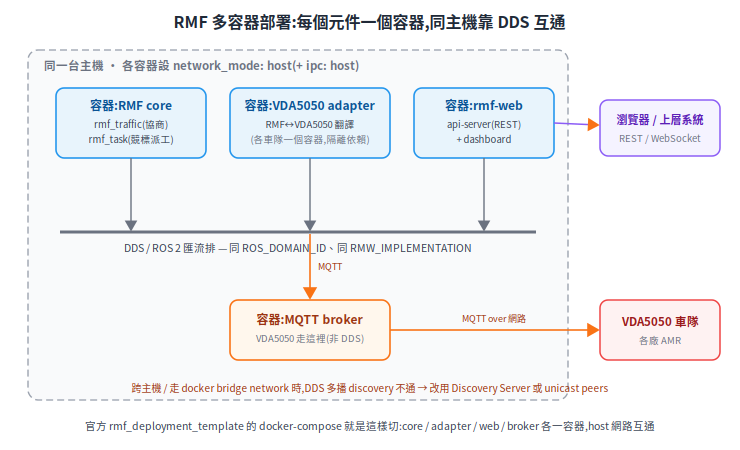

# RMF 多容器部署:adapter 一個容器、core 一個容器,怎麼接起來

[OpenRMF 篇](open-rmf.md) 講為什麼、[實作小抄](rmf-adapter-cookbook.md) 講 adapter 怎麼寫,這篇補最後一塊:**怎麼把它部署起來**。常見的問題是「能不能 adapter 一個 docker、RMF core 另一個 docker」——可以,這正是 ROS 2 / RMF 的標準分散式部署形態;官方 [`rmf_deployment_template`](https://github.com/open-rmf/rmf_deployment_template) 也提供容器化範本(現以 Helm chart 為主,另含 `devel/docker-compose-local.yaml` 範例)。

> 前置:[OpenRMF](open-rmf.md)、[實作小抄](rmf-adapter-cookbook.md)。

---

## 1. 為什麼能分容器(第一性原理)

RMF 整套是**一堆 ROS 2 節點**(`rmf_traffic`、`rmf_task`、各 `fleet_adapter`、`rmf-web`…),它們之間**不是函式呼叫,是透過 DDS 互通**(ROS 2 的底層中介)。而 DDS 本來就設計成**跨進程、跨容器、跨主機**都能通。所以把元件切到不同容器,對 RMF 不是 hack,是它分散式架構的自然延伸——fleet adapter 本身就是一個獨立 ROS 2 節點([rmf_demos_fleet_adapter](https://docs.ros.org/en/humble/p/rmf_demos_fleet_adapter/)),可單獨容器化;`rmf_demos` 官方也支援在容器內 headless 跑([rmf_demos](https://github.com/open-rmf/rmf_demos))。

<p align="center"></p>

好處很直接:
- **依賴隔離**:每個廠商 adapter 常綁不同 SDK / Python 版本 / MQTT client,各自一個容器就不打架(最實際的理由)。
- **獨立部署 / 重啟 / 版本管理**:某車隊 adapter 要升級,單獨重啟那個容器,不動 core。
- **水平擴展**:多車隊 = 多 adapter 容器,一隊一個。
- 對齊你的 Docker first 與 deep-modules(adapter 放邊界)原則。

## 2. 讓不同容器的 ROS 2 互相看到 — 只有幾個關卡

| 關卡 | 設定 | 出處 |
|---|---|---|
| **同一個 DDS 域** | 各容器 `ROS_DOMAIN_ID` 設一樣(預設 0;同值才互相 discover) | [About Domain ID](https://docs.ros.org/en/foxy/Concepts/About-Domain-ID.html) |
| **RMW 實作一致** | 全棧統一 `RMW_IMPLEMENTATION`(都 Cyclone 或都 Fast)。注意:topic 多半能跨 vendor,但 **services / actions 不保證互通**,所以實務一律統一 | [Different Middleware Vendors](https://docs.ros.org/en/humble/Concepts/Intermediate/About-Different-Middleware-Vendors.html) |
| **同主機要能發現** | 最省事:各容器 `network_mode: host`(共用主機網路)。**docker 預設 bridge network 不轉發多播 → DDS discovery 廣播看不到彼此** | [Fast DDS in Docker](https://fast-dds.docs.eprosima.com/en/latest/docker/shm_docker.html) |
| **共享記憶體 transport** | Fast DDS 預設用 SHM 加速,跨容器要 `network_mode: host` + `ipc: host`(否則被當成不同 host 退回 UDP);Cyclone 的 SHM(走 Iceoryx)預設關閉、需另設 | [Fast DDS SHM in Docker](https://fast-dds.docs.eprosima.com/en/latest/docker/shm_docker.html) |
| **跨主機 / 要網段隔離** | 不能用多播時,改 **Fast DDS Discovery Server** 或 **Cyclone unicast peers**(列出對端 IP) | [Discovery Server](https://fast-dds.docs.eprosima.com/en/latest/fastdds/discovery/discovery_server.html)、[Cyclone config](https://cyclonedds.io/docs/cyclonedds/latest/config/config_file_reference.html) |
| **時鐘** | 接模擬時各容器 `use_sim_time` 要一致 | — |

打通這幾點,core 在 A 容器、adapter 在 B 容器,DDS 一發現彼此,`BidNotice` / `RobotUpdateHandle` 那些 topic 就照常流動,跟同容器沒差。

## 3. 最小 docker-compose(pseudo)

結構參考官方 [`rmf_deployment_template`](https://github.com/open-rmf/rmf_deployment_template):該範本以 `rmw_cyclonedds_cpp` 統一 RMW,並讓需要直連 DDS 的服務(如模擬)用 host network。下面是本文整理的示意切法,**非逐字照搬範本**:

```yaml
# pseudo;映像名/launch 以官方當前版本為準
services:
  rmf-core:                              # rmf_traffic + rmf_task + 地圖
    image: ghcr.io/open-rmf/rmf:humble    # 官方 image,與 open-rmf §5 一致
    network_mode: host
    ipc: host
    environment: [ ROS_DOMAIN_ID=42, RMW_IMPLEMENTATION=rmw_cyclonedds_cpp ]
    command: ros2 launch rmf_demos office.launch.xml headless:=true

  vda5050-adapter:                       # 自寫,每個車隊一個(見實作小抄)
    build: ./vda5050_adapter
    network_mode: host
    ipc: host
    environment: [ ROS_DOMAIN_ID=42, RMW_IMPLEMENTATION=rmw_cyclonedds_cpp ]
    depends_on: [ rmf-core, mqtt-broker ]

  mqtt-broker:                           # VDA5050 走 MQTT,不走 DDS
    image: eclipse-mosquitto
    ports: [ "1883:1883" ]

  rmf-web-api:                           # 對外 REST,給 dashboard / 上層派任務
    image: ghcr.io/open-rmf/rmf-web/api-server
    network_mode: host
    environment: [ ROS_DOMAIN_ID=42, RMW_IMPLEMENTATION=rmw_cyclonedds_cpp ]
```

三個 ROS 2 容器靠 `ROS_DOMAIN_ID=42` + 同一 RMW + host 網路彼此發現;adapter 另外用 MQTT 連 broker 出去找車(那條不是 DDS)。

## 4. 取捨(誠實標)

- **`network_mode: host` 犧牲網路隔離**:容器直接用主機網路、`ports` 對映也失效。開發 / 單機部署最省事;多租戶或要網段隔離的生產環境要改走 Discovery Server。
- **bridge network 是新手第一個坑**:不設 host 又沒設 discovery server,會卡在「兩容器各自起得來、但互相看不到對方 topic」——因為多播 discovery 被 bridge 擋掉。
- **跨容器多一層網路**:RMF 派工/協商是秒級,可接受;但硬即時的東西(下位機控制環)不該這樣拆,留在車端。

## 來源

- 官方部署範本:[rmf_deployment_template](https://github.com/open-rmf/rmf_deployment_template)、[rmf_demos](https://github.com/open-rmf/rmf_demos)、[rmf-web](https://github.com/open-rmf/rmf-web)。
- ROS 2 / DDS:[Domain ID](https://docs.ros.org/en/foxy/Concepts/About-Domain-ID.html)、[Middleware Vendors](https://docs.ros.org/en/humble/Concepts/Intermediate/About-Different-Middleware-Vendors.html)、[Discovery Server 教學](https://docs.ros.org/en/humble/Tutorials/Advanced/Discovery-Server/Discovery-Server.html)。
- DDS in Docker:[Fast DDS SHM/Docker](https://fast-dds.docs.eprosima.com/en/latest/docker/shm_docker.html)、[Fast DDS Discovery Server](https://fast-dds.docs.eprosima.com/en/latest/fastdds/discovery/discovery_server.html)、[Cyclone config](https://cyclonedds.io/docs/cyclonedds/latest/config/config_file_reference.html)。
