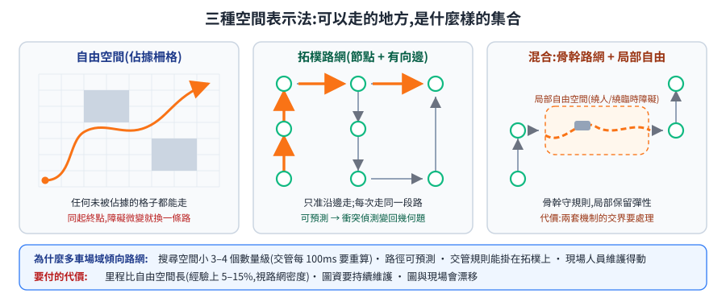
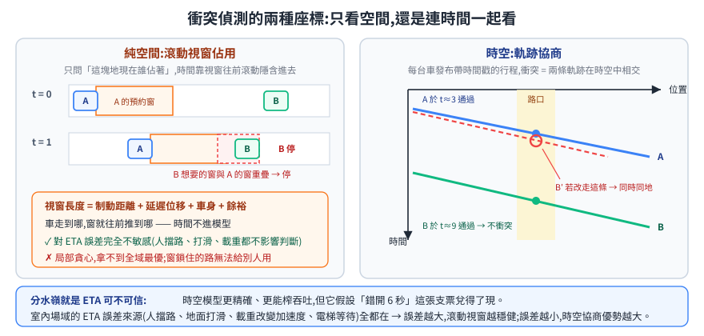
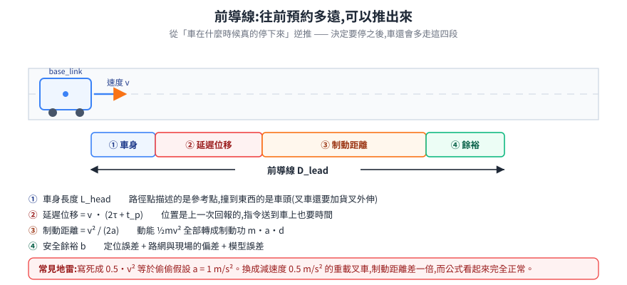
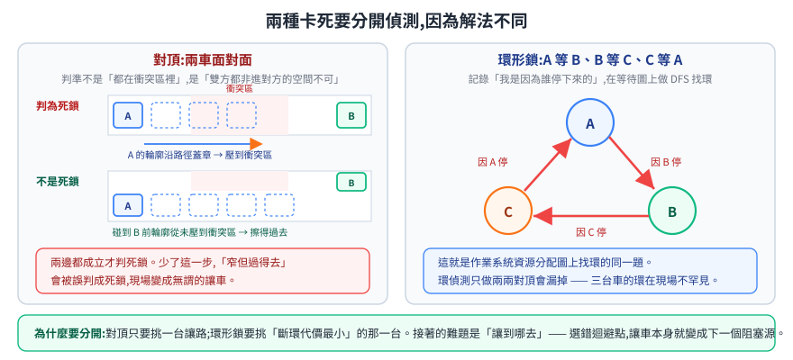

# 路網模型與交通管制:三條技術路線的第一性原理比較

多台有體積的車共用一個場域,要同時保證「不相撞」和「不卡死」。這件事沒有唯一解,業界實際跑在線上的做法分成幾條差異很大的路線。這篇把問題拆到不能再拆,再看每條路線各自在哪一層做了什麼取捨。

> 延伸閱讀:[OpenRMF:跨車隊調度](open-rmf.md)、[VDA5050 協定](vda5050.md)、[Fleet 深入:API/圖資/座標/避塞車](rmf-maps-and-traffic.md)、[目的點重複預定](slot-reservation-dispatch-strategies.md)、[路徑規劃與軌跡(Nav2)](../30-navigation/path-planning.md)。
> 選型結論(叉車/搬運車/送貨機器人分場景)在 [室內 AMR 路網規劃選型](indoor-amr-roadnet-selection.md)。

---

## 1. 根本問題:不是「怎麼走」,是「誰在什麼時候可以佔哪塊地」

單車導航解的是「從 A 到 B 怎麼走」。多車場域真正的難題是另一個:**同一塊地,同一段時間,只能有一台車**。

把它拆開,任何多車系統都必須各自回答三個子問題,少答一個就會在現場出事:

| 子問題 | 沒答好會怎樣 |
|---|---|
| **空間怎麼表示** — 「可以走的地方」是一個什麼樣的集合 | 表示太細 → 算不動;太粗 → 明明過得去卻判定過不去 |
| **衝突怎麼定義與偵測** — 兩台車的計畫在什麼條件下算「打架」 | 判太鬆 → 擦撞;判太嚴 → 全場互相等待,吞吐崩掉 |
| **誰先走、卡死怎麼解** — 衝突發生後的仲裁與脫困 | 沒有脫困機制 → 死鎖只能靠人去現場推車 |

三條主流路線的差別,幾乎全部可以歸結成「它們在這三題各自選了什麼」。

---

## 2. 第一題:空間表示 — 為什麼室內物流最後都收斂到拓樸路網

### 2.1 三種表示法

**自由空間(free space)**:地圖是一張佔據柵格(occupancy grid),車可以走任何沒被佔據的格子。Nav2 的 costmap 就是這個模型。

**拓樸路網(topological graph)**:人為在地圖上畫出節點(node)與有向邊(edge),車只准沿著邊走。節點帶座標與朝向,邊帶方向性與成本。

**混合**:骨幹用路網,局部(進出儲位、閃避臨時障礙)放開一小段自由空間。

### 2.2 為什麼不是「越自由越好」

直覺上自由空間更聰明 —— 它能走出路網想不到的捷徑。但把多車因素加進來之後,這個直覺會反過來。原因有四層,一層比一層根本:

**第一層:搜尋成本。** 自由空間的搜尋空間是格子數。一個 100m × 60m 的倉庫,5cm 解析度就是 240 萬格;要考慮朝向再乘上角度離散數。拓樸路網把同一個場域壓縮到幾百到幾千個節點,差三到四個數量級。單車規劃一次還算得動,但交管要**每 100ms 對每台車重算一次**,這個差距就是「跑得動」與「跑不動」的分界。

**第二層:可預測性。** 這一層才是關鍵。交管要判斷兩台車會不會打架,前提是**知道對方接下來會走哪裡**。自由空間裡,同一個起終點在障礙物稍微變動時可能規劃出完全不同的路徑;路網上,同一段路每次都是那一段。可預測性讓「衝突偵測」從機率問題變回幾何問題。

**第三層:可驗收與可維護。** 現場管理者要能回答「這條走道是不是單行道」「這個路口一次能過幾台」。這些是**規則**,不是代價函數。路網把規則變成可以指著地圖看的東西;自由空間只能靠調 costmap 參數間接逼近,出事時無法追溯是哪個參數造成的。

**第四層:與現場語言對齊。** 倉儲現場本來就用「走道」「路口」「儲位」「暫存區」在講話。路網的節點與邊直接對應這些名詞,圖資才可能被非軟體的人維護。

### 2.3 代價要誠實講

路網不是免費的:

- **繞路**:最短路徑被限制在圖上,實際里程通常比自由空間長 5–15%(視路網密度)。
- **圖資維護成本**:場域改一次布局,路網要重畫。這是持續性人力成本,不是一次性的。
- **圖資與現場漂移**:圖上還有那條邊,現場已經堆了棧板。漂移是路網系統最常見的事故來源,必須靠「邊可被動態封鎖(isBlock)」這類機制兜底。

### 2.4 路網上要放哪些欄位,是被交管需求逼出來的

一個只服務單車導航的路網,節點只需要 `(x, y)`。實際跑多車的路網會長出一堆欄位,每一個都對應一個現場踩過的坑:

| 欄位 | 它在擋什麼 |
|---|---|
| 節點朝向 `arc/theta` | 車到了節點還得「朝對的方向」,否則進儲位要先原地轉,那段時間佔著路口 |
| 邊的方向型別(直行前進/倒退/轉彎/偏移/自轉) | 倒車與自轉的**耗時和掃掠面積**跟直行完全不同,交管必須分開算 |
| 邊的成本 `weight` 依動作分別給值 | 倒車成本 1.5、轉彎 2.0、直行 1.0 —— 讓規劃器主動避開昂貴動作,而不是事後才發現走不動 |
| `isBlock` / `is_closed` | 現場臨時封路,不重畫圖也要能立刻生效 |
| `isWaiting` / `traffic_zone` | 標出「這個節點是等待點」「這個節點屬於哪個交管區」,把交管規則掛在拓樸上 |
| 儲位的**進入點**與**觀察點** | 進出儲位是一段有嚴格姿態要求的動作,不能當成普通邊 |
| 節點 `fixed`(不可被合併) | 自動化工具會合併冗餘節點,但有些節點的存在理由是交管而非幾何 |

最後一列是柵欄原則的典型案例:一個看起來多餘、可以被自動合併掉的節點,存在理由可能不在幾何裡,而在「它是某個等待點」。判斷路網哪裡可以簡化之前,要先知道每個節點當初為什麼被放進去。

### 2.5 兩層路網:為什麼還要一張「道路級」的粗圖

大型場域會再疊一層更粗的圖:**交叉口(junction)+ 道路(road)**,道路用多邊形描述涵蓋範圍。

它解的是一個很具體的問題:**估距離**。交管要頻繁問「從這裡到那個候選點大概多遠」(選迴避點時對每個候選點都要問一次)。用歐氏或曼哈頓距離估會嚴重失真 —— 場域是一條一條的走道,直線距離跟實際行走距離可能差兩三倍。用完整路網做 Dijkstra 又太貴。

道路級圖是中間解:節點數從幾千降到幾十,在上面跑一次 Dijkstra 幾乎免費,精度卻比直線距離好得多。代價是多一份要維護的圖資。

另一條路是**預先算好全點對最短路**(啟動時對每個節點跑一次 Dijkstra,存成 `dist_cache`),查詢降到 O(1)。這條路的邊界很清楚:節點數 V 的記憶體是 O(V²),預計算是 O(V² log V)。幾百個節點沒問題,上萬個節點就會在啟動時卡住、在記憶體上爆掉。**路網規模決定了該用哪種估距法**,不是偏好問題。

---

## 3. 第二題:衝突偵測 — 純空間 vs 時空

### 3.1 兩種座標系,取捨在「時間預測可不可信」

**純空間佔用**:只問「這塊地現在誰佔著」。時間不進模型,而是靠**只預約前方一小段**把時間隱含進去 —— 車走到哪,預約窗就往前推到哪。

**時空佔用**:每台車發布一條帶時間戳的軌跡(itinerary),衝突定義成「兩條軌跡在時空中相交」。A 車 10:00:03 經過路口、B 車 10:00:09 經過,不算衝突。

時空模型明顯更精確,也更能榨出吞吐 —— 但它有一個硬前提:**ETA 要可信**。而 ETA 的誤差來源在室內場域全部都在:人擋路、地面打滑、貨物重量改變加速度、局部避障臨時減速、電梯等待。當 ETA 誤差達到秒級以上,時空排程算出的「錯開 6 秒」就變成一張支票,兌現不了就得重新協商;協商失敗只好保守等待,精度優勢被吃掉。

這是兩派的分水嶺:**時間預測誤差越小,時空模型的優勢越大;誤差越大,純空間的滾動視窗越穩健**。

### 3.2 滾動視窗要開多長:前導線的推導

純空間路線的核心參數只有一個 —— 往前預約多遠。太短會來不及煞停,太長會把整條走道鎖死。這個值不該用試的,可以直接推出來。

從「車在什麼時候真的停下來」逆推,一台車從決定停到完全靜止,會多走這幾段:

**① 制動距離。** 以速度 $v$ 行駛、減速度 $a$,動能全部轉成制動功:

$$\tfrac{1}{2}mv^2 = m\,a\,d_{\text{brake}} \;\Rightarrow\; d_{\text{brake}} = \frac{v^2}{2a}$$

**② 通訊與處理延遲造成的位移。** 交管拿到的位置是上一次回報的,決策送到車上還要一段時間。設單程延遲 $\tau$、處理時間 $t_p$,這段期間車還在以 $v$ 前進:

$$d_{\text{delay}} = v\,(2\tau + t_p)$$

**③ 車身長度。** 路徑點描述的是參考點(通常是 base_link),真正會撞到東西的是車頭。載貨的叉車還要加上貨叉與貨物的外伸。

**④ 安全餘裕。** 定位誤差、路網與現場的偏差、模型誤差的總和。

$$D_{\text{lead}} = \frac{v^2}{2a} + v\,(2\tau + t_p) + L_{\text{head}} + b$$

實作上常看到寫死成 `brake_dist = 0.5 * v²`。這不是別的公式,就是 $a = 1\ \text{m/s}^2$ 代進去的結果。把它當常數抄走的風險是:換一台減速度只有 $0.5\ \text{m/s}^2$ 的重載叉車,制動距離會**差一倍**,而公式看起來完全沒問題。這類「常數裡藏著一個未寫出來的物理假設」是交管參數最容易出事的地方。

$v^2$ 這一項還有一個實務推論:**前導線隨速度平方成長**。速度加倍,預約長度不是兩倍而是接近四倍。這解釋了一個反直覺的現場現象 —— 把車速調高之後,吞吐反而下降,因為每台車鎖住的路變長了。

### 3.3 排隊距離要跟避讓距離分開

同向跟車與對向會車是兩件事。跟車時前車不會突然反向衝過來,只需要留「前車急停我也停得住」;會車時要留出雙方都能反應的空間。所以實作上會有兩個窗:`avoid_dist` 與 `lineup_dist`,後者短得多。用同一個值會讓排隊變成一列稀疏的車陣,把走道容量浪費掉。

### 3.4 為什麼要把車體柵格化成像素圖

看起來很粗暴的一步:把每台車的輪廓沿路徑「蓋章」畫進一張二值影像,再用影像的位元運算判斷重疊。為什麼不用多邊形求交這種「乾淨」的幾何解法?

- **車體形狀不是矩形**。叉車載貨與空車的外形不同,有些車有側向外伸。多邊形求交要處理凹多邊形、載貨態切換,程式碼會長成一團;柵格化只要能把輪廓畫出來就行。
- **要判的不只是兩兩相交**,還有「這台車的整條軌跡掃過的區域」與「人工劃定的多邊形交管區」的交集。掃掠面積(swept area)的解析解很麻煩,柵格化就是沿路徑重複蓋章。
- **成本可預測**。像素運算的成本只跟地圖大小有關,不隨車數增長變形;幾何法在車多時的最壞情況難以估計。而交管跑在 100ms 的硬性週期上,**最壞情況可預測比平均值快更重要**。
- **多車型統一**。不同車型只是不同的 mask 圖,判斷邏輯完全一樣。

代價是解析度誤差(5cm 格子帶來 ±2.5cm 的判定誤差)與記憶體。對室內物流這個誤差遠小於定位誤差,不是瓶頸。

### 3.5 延遲補償:判斷要基於「車現在應該在哪」

交管手上的位置永遠是過期的。直接拿它做碰撞判斷,等於用 200ms 前的世界做決策,而車在這段時間已經走了 20–30cm。

補償的做法是外推:

$$t_{\text{est}} = t_{\text{odom}} + 2\tau + t_p, \qquad \hat{p} = p_{\text{odom}} + v \cdot (t_{\text{est}} - t_{\text{odom}})$$

用速度向量把位置推到「決策生效的那一刻」。這一步的重要性容易被低估 —— 沒有它,交管會在通訊抖動時產生大量假衝突,現場表現為「車莫名其妙一直停一下又走」。

---

## 4. 第三題:仲裁與脫困

### 4.1 仲裁順序不能只看距離

多台車搶同一塊地時,先來後到的判準看起來很自然,實際上會產生震盪。穩定的仲裁順序通常是這樣分層的:

1. **上一輪已經持有的車繼續持有**。這一條是防震盪的關鍵 —— 沒有它,兩台距離相近的車會在每個週期互相搶走對方的路權,結果是兩台都走不動。
2. **距離最近者優先**。已經接近的車讓它先過,總等待時間較小。
3. **路線下發較早者優先**。剛換路線的車有一段「穩定期」,先讓舊路線持有者通過,避免換路瞬間的搶佔亂序。

第一條是設計上最違反直覺、也最容易在重構時被拿掉的一條。它的存在理由是**遲滯(hysteresis)**:任何基於瞬時量測的仲裁,都需要一點黏性來對抗量測噪聲。

### 4.2 兩種卡死,要分開偵測

**對頂(pairwise deadlock)**:兩台車在同一段路上面對面。判定的關鍵不是「兩台車都在衝突區裡」,而是「**雙方都必須進入對方要用的空間才能通過**」。做法是用 A 的車身輪廓沿它的行進方向投影,一路蓋到碰到 B 為止;若在碰到 B 之前輪廓從未壓到衝突區,代表 A 其實擦得過去,不是死鎖。兩邊都成立才判死鎖。這一步避免了把「窄但過得去」誤判成死鎖。

**環形鎖(chain lock)**:A 等 B、B 等 C、C 等 A。這是作業系統資源分配圖上找環的同一個問題 —— 記錄「我是因為誰停下來的」形成等待圖(wait-for graph),在上面做 DFS,遇到已訪問過的節點就是一個環。

兩者要分開,因為解法不同:對頂只要挑一台讓路;環形鎖要挑**斷環代價最小**的那一台。

> 這裡跟 [目的點重複預定](slot-reservation-dispatch-strategies.md) 那篇是互補的兩面:那篇談的是**預防**(banker's algorithm 這類「先確認安全序列再放行」),這裡談的是**偵測後脫困**。工程上兩者常常並存 —— 預防用在資源粒度粗、可以事先算的地方(儲位、電梯);偵測用在粒度細、狀態變化快的地方(走道空間)。

### 4.3 脫困:選一個迴避點,難在「不要製造新的死鎖」

挑一台車讓路之後,真正的難題是「讓到哪去」。一個看似合理的迴避點很容易變成新的阻塞源。實務上的做法是先用**禁止層**把不能去的地方刷掉,再對剩下的候選點評分:

| 禁止層 | 為什麼 |
|---|---|
| 明言禁止區 | 設定檔硬性排除(消防通道、人員作業區) |
| 其他車路徑的頭尾各數公尺 | 別停在人家馬上要走、或快要抵達的地方 |
| 已被佔用的迴避點的車身輪廓 | 那裡已經有車 |
| 已佔用迴避點周圍的緩衝帶 | 不讓兩台車擠在同一個角落,否則第二台又卡住第一台 |

評分則是兩項相加:

- **距離成本**:取「我到迴避點」與「對手到迴避點」兩者的**較大值**。只算自己的話,會挑到一個對手還要開很久才到得了的點,結果是我讓完路還要繼續等。
- **動作成本**:需要橫移的加一點,**需要倒車或大迴轉的加很重**。這一項把運動學代價拉進決策 —— 一個直線距離最近但要倒車掉頭的點,實際耗時可能是次近點的三倍。

最後對候選點由好到壞逐一做精確驗證,通過就採用;通不過的按嚴重程度降級當備選(路線略長 → 壓到他人終點 → 與第三方衝突 → 與對手衝突 → 需穿越受限區)。**寧可用一個有瑕疵的解,也不要回傳「找不到」**,因為找不到就等於現場真的要人去推車。

### 4.4 空閒車也要管

無任務的車停在路口,一樣是障礙物。偵測「IDLE 超過門檻且擋住他人路徑」並主動送去迴避點,是很多系統上線後才補上的一塊。它提醒一件事:**交管的對象是「所有佔空間的東西」,不是「所有正在執行任務的車」**。

---

## 5. 三條路線的對照

| | **A. 拓樸路網 + 滾動視窗集中交管** | **B. 時空軌跡協商** | **C. 集中式 MAPF** |
|---|---|---|---|
| 空間表示 | 拓樸路網 + 柵格化車體 | 各車隊自有路網,協調層看時空佔用 | 柵格或路網 |
| 衝突定義 | 空間佔用重疊 | 時空軌跡相交 | 時空(格子, 時步)衝突 |
| 決策粒度 | 每 100ms 全場重算「走/停」 | 事件驅動:發布行程 → 偵測衝突 → 協商 | 任務下達時算一次全體最優 |
| 對 ETA 誤差 | **不敏感**(不預測時間) | 敏感(誤差大會頻繁重協商) | 很敏感(偏差即失效) |
| 最優性 | 局部貪心,非全域最優 | 中等 | 理論最優 |
| 異質車隊 | 需自行統一介面 | **原生支援**(協定化) | 需統一模型 |
| 車數擴展 | 數十台實務可行 | 設計上為跨車隊 | 隨車數與時域指數惡化 |
| 死鎖處理 | 偵測 + 迴避點脫困 | 協商階段規避 + 路權租約 | 規劃階段保證無衝突 |
| 主要失效模式 | 迴避點不足 → 連鎖等待 | 某車隊不誠實回報 → 協調層失準 | 執行偏差 → 全盤重算 |
| 落地成熟度 | 高(大量現場在跑) | 中(開源框架成熟,跨廠牌橋接仍在建設) | 低(多見於研究與高度受控場域) |

還有一條**去中心化互相避讓**(ORCA/RVO 這類速度障礙法)。它在開闊空間效果很好,但在室內物流的窄走道會系統性失敗:兩台車在只容一台的走道對頂時,不存在任何「都稍微偏一點」的速度解。缺乏全域資訊的局部避讓無法處理需要「有人退回去」的情況。這不是調參問題,是**資訊不足**的結構性限制。

---

## 6. 路網是交管規則的掛載點,不是單純的路徑資料結構

把路網當成「A* 要吃的圖」,是單車視角的看法。多車視角下,路網其實是**交管規則的掛載點**:

- 單行道 = 邊的方向性
- 一次只能過一台的窄道 = 掛在節點上的交管區與名額
- 等待點 = 節點屬性
- 進出儲位的姿態要求 = 進入點與觀察點
- 現場臨時封路 = 邊的封鎖旗標

這解釋了為什麼「換一個更聰明的規劃器」通常無法解決現場的塞車問題 —— 塞車的成因多半不在規劃層,而在路網把交管規則表達得不夠,或圖資與現場已經漂移。**規劃器的上限由路網的表達力決定。**

---

## 7. 誠實的邊界

- 本篇整理的是設計模式與其推導,不是任何單一系統的規格。實際系統的參數與流程細節依場域而異。
- 表格中的「落地成熟度」是相對判斷,沒有公開的橫向 benchmark 可引用。跨廠牌時空協商的生產級案例目前公開資料有限。
- 前導線公式假設等減速度。實際制動曲線受載重、地面摩擦、驅動器限流影響,現場量測值通常比理論值長。
- 「路網比自由空間繞路 5–15%」是經驗區間,依路網密度差異很大,不應直接引用為設計依據。

## 8. 延伸閱讀

- [室內 AMR 路網規劃選型](indoor-amr-roadnet-selection.md) — 本篇的結論如何套到叉車/搬運車/送貨機器人
- [OpenRMF:跨車隊調度](open-rmf.md) — 路線 B 的開源實作
- [VDA5050 協定](vda5050.md) — 異質車隊的標準介面
- [目的點重複預定](slot-reservation-dispatch-strategies.md) — 死鎖的預防面
- [路徑規劃與軌跡(Nav2)](../30-navigation/path-planning.md) — 單車層的規劃與控制
