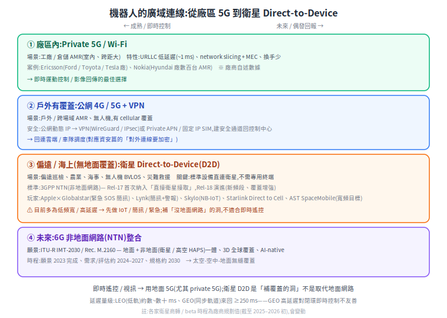

# 機器人的廣域連線:5G / 6G / 衛星 Direct-to-Device

機器人一旦走出本地 Wi-Fi 範圍(戶外 AMR、無人機、偏遠巡檢、海事),就得靠**廣域連線**回連雲端或車隊調度。這是一條從「廠區 5G」到「衛星直連」的光譜——成熟、低延遲的一端做即時控制,新興、高延遲的一端補「沒有地面網路」的洞。

> 相關:[OpenRMF](open-rmf.md)(車隊/雲端)、[資安總覽](../70-security/README.md)(對外連線要加密)。

---

## 1. 為什麼需要廣域連線

本地 Wi-Fi 只覆蓋一個場域。當機器人要**跨場域、上戶外、進偏遠**,或要把資料回傳到雲端 / 車隊大腦,就需要 cellular(4G/5G)甚至衛星。核心問題只有兩個:**覆蓋到不到**、**延遲與頻寬夠不夠該任務**。

## 2. 5G:對機器人有用的特性

5G 定義三類差很多的服務,剛好對應機器人不同需求([eMBB/URLLC/mMTC 說明](https://www.techtarget.com/searchnetworking/definition/What-are-eMBB-URLLC-and-mMTC-in-5G-Use-cases-explained)):

- **URLLC**(超可靠低延遲,延遲可低至約 1 ms)→ 即時運動控制、安全停車。
- **eMBB**(高頻寬)→ 影像 / 感測回傳。
- **mMTC**(海量連線)→ 大量低功耗感測器 / 標籤。

**Network slicing(網路切片)+ MEC(邊緣運算)**:把一張實體網切成多個有獨立 SLA 的虛擬網,可為「即時控制」切一條低延遲高可靠 slice,跟「影像回傳」隔離;MEC 把運算下放邊緣縮短往返([slicing 說明](https://www.5gtechnologyworld.com/how-5g-network-slicing-works-part-1/))。

**Private 5G(企業私有 5G)** 在工廠 / 倉儲 AMR 明確成形:相較 Wi-Fi,換手更少、延遲更穩、覆蓋更省設備;已見於 Ford、Toyota、Tesla 等廠,Nokia 為 Hyundai 廠協調數百台 AMR([Ericsson 案例](https://www.ericsson.com/en/industries/warehousing-and-logistics))。*(注:具體「省幾個 AP、生產力提升幾 %」多為廠商行銷數字,看的時候要意識到來源。)*

## 3. 安全回連:VPN over cellular / Private APN

走**公網** cellular 回連控制中心,流量會經過電信與網際網路,動態 IP 又暴露在公網。兩種常見做法:

- **VPN(WireGuard / IPsec)**:在機器人與閘道間建端到端加密通道;mobile VPN 還能讓機器人在不同網路間漫遊而 session 不中斷([IoT VPN](https://telnyx.com/resources/iot-security-vpn))。
- **Private APN / 固定 IP SIM**:靠電信專網層把流量導進企業私網、指派私有 IP,不暴露公網——是「不靠應用層 VPN、靠電信層隔離」的替代或互補。

這對應 [資安總覽](../70-security/README.md) 的「對外 / 雲端連線要加密 + 認證」。

## 4. 衛星 Direct-to-Device(D2D):太空通訊直連標準設備

**D2D / Direct-to-Cell = 讓未經改裝的標準手機 / IoT 設備直接連衛星**(不需專用衛星終端),設備像連一般基地台,只是訊號經衛星中繼([Skylo 說明](https://www.skylo.tech/newsroom/how-existing-cellular-iot-devices-reach-satellite-networks-today))。

**標準靠 3GPP NTN(Non-Terrestrial Networks)**:Release 17(2022)首次把 NTN 納入規範、標準化「直接衛星接取」(分 NR-NTN 與 IoT-NTN);Release 18 演進(新頻段、上行覆蓋增強、抗 Doppler)([3GPP NTN 總覽](https://www.3gpp.org/technologies/ntn-overview)、[Release 17](https://www.3gpp.org/specifications-technologies/releases/release-17))。

**主要玩家做到什麼(截至 2025–2026 初,時程為廠商規劃值會變動)**:

| 玩家 | 做到什麼 |
|---|---|
| **Apple × Globalstar** | iPhone 14 起的[緊急 SOS 簡訊](https://support.apple.com/en-us/101573);每段傳輸需對空指向 15–30 秒(極低頻寬)——最保守、最早落地 |
| **Lynk Global** | 標準手機收發[簡訊 + 緊急警報](https://lynk.world/news/),Palau 首個商用 |
| **Skylo** | [NB-IoT NTN](https://www.skylo.tech/newsroom/skylo-launches-its-direct-to-device-service-in-the-us-canada)(IoT / 小數據),Rel-17 標準,與 Vodafone / DT IoT 合作 |
| **Starlink Direct to Cell**(×T-Mobile) | [簡訊→語音→有限資料](https://www.starlink.com/business/direct-to-cell)漸進,2025 起 beta |
| **AST SpaceMobile** | 目標[寬頻直送手機](https://ast-science.com/next-gen-bluebird/)(視訊/數據),商轉最晚但頻寬目標最高 |

**現況很重要**:D2D 目前多為**低頻寬 / 高延遲**,所以先做 IoT / 簡訊 / 緊急,**不適合即時遙控**([Ericsson 對 D2D 的討論](https://www.ericsson.com/en/reports-and-papers/ericsson-technology-review/articles/satellite-direct-to-device-communication))。

## 5. 6G:非地面網路(NTN)整合願景

6G 的官方願景在 **ITU-R IMT-2030 / Recommendation M.2160**(2023/11 通過):整合通訊 / 感測 / 運算 / 定位、AI 內生(native AI)、3D 全球覆蓋,**地面 + 非地面(衛星 / 高空 HAPS)整合是核心研究軸**;願景 2023 完成、需求評估約 2024–2027、規格約 2030([ITU 新聞稿](https://www.itu.int/en/mediacentre/Pages/PR-2023-12-01-IMT-2030-for-6G-mobile-technologies.aspx)、[M.2160 PDF](https://www.itu.int/dms_pubrec/itu-r/rec/m/R-REC-M.2160-0-202311-I!!PDF-E.pdf))。對機器人的意涵:未來「太空-空中-地面無縫覆蓋」,理想上不管走到哪都有連線。

## 6. 對機器人:怎麼選 + 現實限制

- **即時遙控 / 視訊 / 閉環控制 → 用地面 5G**(尤其 private 5G):URLLC 低延遲、可切片隔離。衛星 D2D 撐不起即時控制。
- **偶發回報 / 遠端監測 / 緊急 → 衛星 D2D 可補洞**:偏遠巡檢、農業、海事、無人機 BVLOS、災難救援等「沒有地面網路」的場景。
- **延遲是物理限制**:LEO(低軌)約數~數十 ms,GEO(同步軌道)來回 ≥250 ms——GEO 的高延遲對閉環即時控制不友善;這是軌道高度決定的,不是工程能調掉的。
- **安全別忘**:不管走 5G 還是衛星,對外連線都要套 [資安](../70-security/README.md) 的加密 + 認證(VPN / TLS / per-device 憑證)。

一句話:**衛星 D2D 是「補覆蓋的洞」,不是取代地面網路**;機器人的廣域連線會是「地面 5G 做即時、衛星補偏遠」的混合,而 6G 的願景是把這兩者無縫整合起來。

## 7. 相關標準與白皮書

這議題橫跨幾個標準組織,主角是 **3GPP**(把「衛星直連」寫進行動通訊標準)與 **ITU**(5G/6G 願景框架與衛星頻譜)。可查證的規格頁、白皮書與報告:

**3GPP — NTN(非地面網路)**
- [TR 38.811](https://portal.3gpp.org/desktopmodules/Specifications/SpecificationDetails.aspx?specificationId=3234) — NTN 部署情境與通道模型(Rel-15 研究)
- [TR 38.821](https://portal.3gpp.org/desktopmodules/Specifications/SpecificationDetails.aspx?specificationId=3525) — NR 支援 NTN 的解決方案(Rel-16 研究)
- [NTN 總覽](https://www.3gpp.org/technologies/ntn-overview) — Rel-15 研究 → Rel-17 正式納入的演進
- `TS 33.501` — 5G 安全架構(對外連線的認證/加密)

**ITU-R — 5G/6G 願景與衛星頻譜**
- [M.2083](https://www.itu.int/rec/R-REC-M.2083-0-201509-I/en) — IMT-2020(5G)願景框架(eMBB/URLLC/mMTC 三情境)
- [M.2410](https://www.itu.int/dms_pub/itu-r/opb/rep/R-REP-M.2410-2017-PDF-E.pdf) — IMT-2020 最低技術需求(report)
- [M.2160](https://www.itu.int/dms_pubrec/itu-r/rec/m/R-REC-M.2160-0-202311-I!!PDF-E.pdf) — IMT-2030(6G)框架
- [WRC-23](https://www.itu.int/wrc-23/) — 世界無線電通信大會,修訂衛星(GSO/NGSO)頻譜規則

**產業白皮書**
- 5G-ACIA:[工業 5G 白皮書](https://5g-acia.org/whitepapers/5g-for-connected-industries-and-automation-second-edition/)、[AGV/行動機器人 sidelink](https://5g-acia.org/whitepapers/using-5g-sidelink-in-industrial-factory-applications/)
- GSMA:[D2D 頻譜政策報告](https://www.gsma.com/connectivity-for-good/spectrum/gsma_resources/spectrum-for-d2d-public-policy-paper/)、[Satellite 2.0: Going Direct to Device](https://www.gsmaintelligence.com/research/satellite-2-0-going-direct-to-device)
- Ericsson:[衛星 D2D 通訊](https://www.ericsson.com/en/reports-and-papers/ericsson-technology-review/articles/satellite-direct-to-device-communication)、[Rel-19 NTN payload(把 gNB 放上衛星)](https://www.ericsson.com/en/blog/2024/10/ntn-payload-architecture)

**安全 / VPN(對外連線,呼應資安章)**
- [RFC 8446](https://datatracker.ietf.org/doc/html/rfc8446) — TLS 1.3
- [RFC 4301](https://datatracker.ietf.org/doc/html/rfc4301) — IPsec 安全架構
- WireGuard — **沒有 IETF 標準軌 RFC**(常被誤標);權威規格見[官方論文](https://www.wireguard.com/papers/wireguard.pdf)

## 來源

- 5G:[eMBB/URLLC/mMTC](https://www.techtarget.com/searchnetworking/definition/What-are-eMBB-URLLC-and-mMTC-in-5G-Use-cases-explained)、[network slicing](https://www.5gtechnologyworld.com/how-5g-network-slicing-works-part-1/)、[Private 5G(Ericsson 倉儲)](https://www.ericsson.com/en/industries/warehousing-and-logistics)
- VPN:[IoT security VPN](https://telnyx.com/resources/iot-security-vpn)
- 衛星 D2D:[3GPP NTN](https://www.3gpp.org/technologies/ntn-overview)、[Rel-17](https://www.3gpp.org/specifications-technologies/releases/release-17)、[Skylo](https://www.skylo.tech/newsroom/how-existing-cellular-iot-devices-reach-satellite-networks-today)、[Starlink Direct to Cell](https://www.starlink.com/business/direct-to-cell)、[AST SpaceMobile](https://ast-science.com/next-gen-bluebird/)、[Apple SOS](https://support.apple.com/en-us/101573)、[Lynk](https://lynk.world/news/)、[Ericsson D2D](https://www.ericsson.com/en/reports-and-papers/ericsson-technology-review/articles/satellite-direct-to-device-communication)
- 6G:[ITU IMT-2030 新聞稿](https://www.itu.int/en/mediacentre/Pages/PR-2023-12-01-IMT-2030-for-6G-mobile-technologies.aspx)、[Rec. M.2160](https://www.itu.int/dms_pubrec/itu-r/rec/m/R-REC-M.2160-0-202311-I!!PDF-E.pdf)
