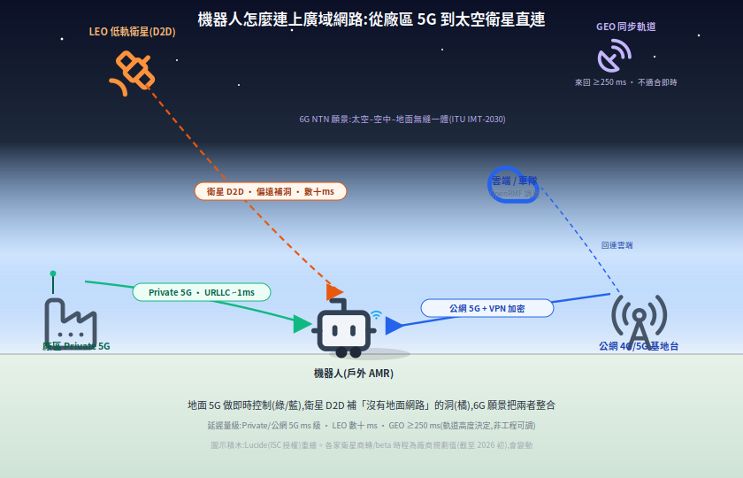
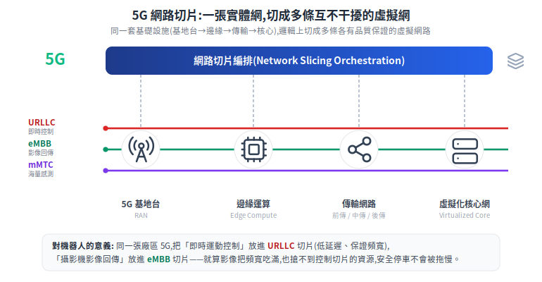

# 機器人的廣域連線:5G / 6G / 衛星 Direct-to-Device

機器人一旦走出本地 Wi-Fi 範圍(戶外 AMR、無人機、偏遠巡檢、海事),就得靠**廣域連線**回連雲端或車隊調度。這是一條從「廠區 5G」到「衛星直連」的光譜——成熟、低延遲的一端做即時控制,新興、高延遲的一端補「沒有地面網路」的洞。

> 相關:[OpenRMF](open-rmf.md)(車隊/雲端)、[資安總覽](../70-security/README.md)(對外連線要加密)。

---

一張圖看懂:地面 5G(綠/藍)做即時控制,衛星 D2D(橘)補沒有地面網路的洞,6G 願景把兩者整合。圖示積木採 Lucide(ISC 授權)重繪。

下面把這張圖的四層拆開,逐層講「在解什麼、用什麼技術、現實限制」:

## 1. 為什麼需要廣域連線

本地 Wi-Fi 只覆蓋一個場域。當機器人要**跨場域、上戶外、進偏遠**,或要把資料回傳到雲端 / 車隊大腦,就需要 cellular(4G/5G)甚至衛星。核心問題只有兩個:**覆蓋到不到**、**延遲與頻寬夠不夠該任務**。

## 2. 5G:對機器人有用的特性

5G 定義三類差很多的服務,剛好對應機器人不同需求([eMBB/URLLC/mMTC 說明](https://www.techtarget.com/searchnetworking/definition/What-are-eMBB-URLLC-and-mMTC-in-5G-Use-cases-explained)):

- **URLLC**(超可靠低延遲,延遲可低至約 1 ms)→ 即時運動控制、安全停車。
- **eMBB**(高頻寬)→ 影像 / 感測回傳。
- **mMTC**(海量連線)→ 大量低功耗感測器 / 標籤。

**Network slicing(網路切片)+ MEC(邊緣運算)**:把一張實體網切成多個有獨立 SLA 的虛擬網,可為「即時控制」切一條低延遲高可靠 slice,跟「影像回傳」隔離;MEC 把運算下放邊緣縮短往返([slicing 說明](https://www.5gtechnologyworld.com/how-5g-network-slicing-works-part-1/))。

概念參考自 5G Technology World 的 network slicing 圖,重繪並補上機器人情境。

**Private 5G(企業私有 5G)** 在工廠 / 倉儲 AMR 明確成形:相較 Wi-Fi,換手更少、延遲更穩、覆蓋更省設備;已見於 Ford、Toyota、Tesla 等廠,Nokia 為 Hyundai 廠協調數百台 AMR([Ericsson 案例](https://www.ericsson.com/en/industries/warehousing-and-logistics))。

一個講得比較具體的案例是 **Ericsson × 韓國 CJ Logistics 物流倉**:把原本 300 個 Wi-Fi AP(無線基地台)換成 **22 個 5G radio dot(室內小型天線)**,整個倉庫當成「一個訊號細胞(single cell)」運作——AMR / AGV 車隊在裡面全速跑、不再因為跨 AP 換手而斷線或減速;Ericsson 揭露的數字是生產力 +20%、資本支出 −15%([Ericsson CJ Logistics 案例](https://www.ericsson.com/en/cases/2023/transforming-warehouse-operations))。「換手少」對機器人為什麼重要:Wi-Fi 跨 AP 切換的瞬間會掉封包,正在跑的車就可能頓一下;5G 單一細胞把這個切換點消掉了。*(注:這類「省幾個 AP、提升幾 %」是廠商揭露的數字,看的時候要意識到來源。)*

## 3. 安全回連:VPN over cellular / Private APN

走**公網** cellular 回連控制中心,流量會經過電信與網際網路,動態 IP 又暴露在公網。兩種常見做法:

- **VPN(WireGuard / IPsec)**:在機器人與閘道間建端到端加密通道;mobile VPN 還能讓機器人在不同網路間漫遊而 session 不中斷([IoT VPN](https://telnyx.com/resources/iot-security-vpn))。
- **Private APN / 固定 IP SIM**:靠電信專網層把流量導進企業私網、指派私有 IP,不暴露公網——是「不靠應用層 VPN、靠電信層隔離」的替代或互補。

這對應 [資安總覽](../70-security/README.md) 的「對外 / 雲端連線要加密 + 認證」。

## 4. 衛星 Direct-to-Device(D2D):太空通訊直連標準設備

**D2D / Direct-to-Cell = 讓未經改裝的標準手機 / IoT 設備直接連衛星**(不需專用衛星終端),設備像連一般基地台,只是訊號經衛星中繼([Skylo 說明](https://www.skylo.tech/newsroom/how-existing-cellular-iot-devices-reach-satellite-networks-today))。

**標準靠 3GPP NTN(Non-Terrestrial Networks)**:Release 17(2022)首次把 NTN 納入規範、標準化「直接衛星接取」(分 NR-NTN 與 IoT-NTN);Release 18 演進(新頻段、上行覆蓋增強、抗 Doppler)([3GPP NTN 總覽](https://www.3gpp.org/technologies/ntn-overview)、[Release 17](https://www.3gpp.org/specifications-technologies/releases/release-17))。

**主要玩家做到什麼(截至 2025–2026 初,時程為廠商規劃值會變動)**:

| 玩家 | 做到什麼 |
|---|---|
| **Apple × Globalstar** | iPhone 14 起的[緊急 SOS 簡訊](https://support.apple.com/en-us/101573);每段傳輸需對空指向 15–30 秒(極低頻寬)——最保守、最早落地 |
| **Lynk Global** | 標準手機收發[簡訊 + 緊急警報](https://lynk.world/news/),Palau 首個商用 |
| **Skylo** | [NB-IoT NTN](https://www.skylo.tech/newsroom/skylo-launches-its-direct-to-device-service-in-the-us-canada)(IoT / 小數據),Rel-17 標準,與 Vodafone / DT IoT 合作 |
| **Starlink Direct to Cell**(×T-Mobile) | [簡訊→語音→有限資料](https://www.starlink.com/business/direct-to-cell)漸進,2025 起 beta |
| **AST SpaceMobile** | 目標[寬頻直送手機](https://ast-science.com/next-gen-bluebird/)(視訊/數據),商轉最晚但頻寬目標最高 |

**台灣在地進展**:這不是只在國外發生。2026 年 3 月 2 日 MWC(世界行動通訊大會)上,**台灣大哥大與 AST SpaceMobile 簽署「低軌衛星通訊服務策略合作備忘錄」(MOU)**,要在台灣推「太空基地台 + 既有行動網路協同」——用 500 公里以上的 AST 衛星發射台灣大的行動訊號,直連未改裝的標準手機(D2C, Direct to Cellular),補「沒有基地台涵蓋」的死角、強化災害時的通訊韌性;台灣大看中 AST 的一點是其股東陣容(Google、AT&T、Verizon、Vodafone、日本樂天)([台灣大新聞稿](https://corp.taiwanmobile.com/press-release/news/press_20260302_441365.html)、[INSIDE 報導](https://www.inside.com.tw/article/40819-mwc-2026-taiwan-mobile)、[TechNews:雙技術路線](https://technews.tw/2026/05/12/mobile-direct-satellite-communication-dual-tech-paths-telecom-value-chain-restructuring))。另一條路線是 **3GPP 標準的 NTN**:中華電信 2024 年 7 月已完成 IoT-NTN(衛星物聯網)測試,遠傳則握有 28GHz 頻段、傳出有意進低軌([TechNews:遠傳低軌](https://finance.technews.tw/2025/10/21/fetnet-leo-satellite/))。對機器人的意涵一樣:**先補偏遠 / 災防的洞,還不是拿來即時遙控**。

**現況很重要**:D2D 目前多為**低頻寬 / 高延遲**,所以先做 IoT / 簡訊 / 緊急,**不適合即時遙控**([Ericsson 對 D2D 的討論](https://www.ericsson.com/en/reports-and-papers/ericsson-technology-review/articles/satellite-direct-to-device-communication))。

## 5. 6G:非地面網路(NTN)整合願景

6G 的官方願景在 **ITU-R IMT-2030 / Recommendation M.2160**(2023/11 通過):整合通訊 / 感測 / 運算 / 定位、AI 內生(native AI)、3D 全球覆蓋,**地面 + 非地面(衛星 / 高空 HAPS)整合是核心研究軸**;願景 2023 完成、需求評估約 2024–2027、規格約 2030([ITU 新聞稿](https://www.itu.int/en/mediacentre/Pages/PR-2023-12-01-IMT-2030-for-6G-mobile-technologies.aspx)、[M.2160 PDF](https://www.itu.int/dms_pubrec/itu-r/rec/m/R-REC-M.2160-0-202311-I!!PDF-E.pdf))。對機器人的意涵:未來「太空-空中-地面無縫覆蓋」,理想上不管走到哪都有連線。

## 6. 對機器人:怎麼選 + 現實限制

- **即時遙控 / 視訊 / 閉環控制 → 用地面 5G**(尤其 private 5G):URLLC 低延遲、可切片隔離。衛星 D2D 撐不起即時控制。
- **偶發回報 / 遠端監測 / 緊急 → 衛星 D2D 可補洞**:偏遠巡檢、農業、海事、無人機 BVLOS、災難救援等「沒有地面網路」的場景。
- **延遲是物理限制**:LEO(低軌)約數~數十 ms,GEO(同步軌道)來回 ≥250 ms——GEO 的高延遲對閉環即時控制不友善;這是軌道高度決定的,不是工程能調掉的。
- **安全別忘**:不管走 5G 還是衛星,對外連線都要套 [資安](../70-security/README.md) 的加密 + 認證(VPN / TLS / per-device 憑證)。

一句話:**衛星 D2D 是「補覆蓋的洞」,不是取代地面網路**;機器人的廣域連線會是「地面 5G 做即時、衛星補偏遠」的混合,而 6G 的願景是把這兩者無縫整合起來。

## 7. 相關標準與白皮書

這議題橫跨幾個標準組織,主角是 **3GPP**(把「衛星直連」寫進行動通訊標準)與 **ITU**(5G/6G 願景框架與衛星頻譜)。可查證的規格頁、白皮書與報告:

**3GPP — NTN(非地面網路)**
- [TR 38.811](https://portal.3gpp.org/desktopmodules/Specifications/SpecificationDetails.aspx?specificationId=3234) — NTN 部署情境與通道模型(Rel-15 研究)
- [TR 38.821](https://portal.3gpp.org/desktopmodules/Specifications/SpecificationDetails.aspx?specificationId=3525) — NR 支援 NTN 的解決方案(Rel-16 研究)
- [NTN 總覽](https://www.3gpp.org/technologies/ntn-overview) — Rel-15 研究 → Rel-17 正式納入的演進
- `TS 33.501` — 5G 安全架構(對外連線的認證/加密)

**ITU-R — 5G/6G 願景與衛星頻譜**
- [M.2083](https://www.itu.int/rec/R-REC-M.2083-0-201509-I/en) — IMT-2020(5G)願景框架(eMBB/URLLC/mMTC 三情境)
- [M.2410](https://www.itu.int/dms_pub/itu-r/opb/rep/R-REP-M.2410-2017-PDF-E.pdf) — IMT-2020 最低技術需求(report)
- [M.2160](https://www.itu.int/dms_pubrec/itu-r/rec/m/R-REC-M.2160-0-202311-I!!PDF-E.pdf) — IMT-2030(6G)框架
- [WRC-23](https://www.itu.int/wrc-23/) — 世界無線電通信大會,修訂衛星(GSO/NGSO)頻譜規則

**產業白皮書**
- 5G-ACIA:[工業 5G 白皮書](https://5g-acia.org/whitepapers/5g-for-connected-industries-and-automation-second-edition/)、[AGV/行動機器人 sidelink](https://5g-acia.org/whitepapers/using-5g-sidelink-in-industrial-factory-applications/)
- GSMA:[D2D 頻譜政策報告](https://www.gsma.com/connectivity-for-good/spectrum/gsma_resources/spectrum-for-d2d-public-policy-paper/)、[Satellite 2.0: Going Direct to Device](https://www.gsmaintelligence.com/research/satellite-2-0-going-direct-to-device)
- Ericsson:[衛星 D2D 通訊](https://www.ericsson.com/en/reports-and-papers/ericsson-technology-review/articles/satellite-direct-to-device-communication)、[Rel-19 NTN payload(把 gNB 放上衛星)](https://www.ericsson.com/en/blog/2024/10/ntn-payload-architecture)

**安全 / VPN(對外連線,呼應資安章)**
- [RFC 8446](https://datatracker.ietf.org/doc/html/rfc8446) — TLS 1.3
- [RFC 4301](https://datatracker.ietf.org/doc/html/rfc4301) — IPsec 安全架構
- WireGuard — **沒有 IETF 標準軌 RFC**(常被誤標);權威規格見[官方論文](https://www.wireguard.com/papers/wireguard.pdf)

## 縮寫白話對照

這篇用了不少電信圈的縮寫,這裡一次翻成白話。看到正文卡住就回來查。

**連線服務的種類(5G 的三種「模式」)**

| 縮寫 | 全名 | 白話 |
|---|---|---|
| **URLLC** | Ultra-Reliable Low-Latency Communications | 超可靠、超低延遲(延遲低到約 1 毫秒)。給「慢一下就出事」的即時控制、安全停車用 |
| **eMBB** | enhanced Mobile Broadband | 高速大流量。給影像、感測資料回傳 |
| **mMTC** | massive Machine Type Communications | 同時連「超大量」低功耗小裝置(感測器、標籤) |

**軌道與衛星**

| 縮寫 | 全名 | 白話 |
|---|---|---|
| **LEO** | Low Earth Orbit | 低軌衛星(數百~2000 公里)。離地近、延遲小,但一顆顧到的範圍小、要很多顆 |
| **GEO** | Geostationary Orbit | 同步軌道衛星(約 36,000 公里)。對地面看起來不動,一顆顧很大範圍,但訊號來回 ≥250 毫秒、延遲大 |
| **D2D / D2C** | Direct-to-Device / Direct to Cellular | 衛星「直連設備 / 直連手機」:標準手機不用改裝、不用接專用天線,直接連衛星 |
| **NTN** | Non-Terrestrial Network | 非地面網路:把衛星、高空平台正式納入行動通訊標準的那一套 |
| **HAPS** | High Altitude Platform Station | 高空平台:停在平流層的氣球 / 無人機,當「空中基地台」 |
| **NB-IoT** | Narrowband IoT | 窄頻物聯網:低速、超省電、覆蓋廣,給小數據量的感測裝置 |

**網路與架構**

| 縮寫 | 全名 | 白話 |
|---|---|---|
| **Private 5G** | — | 企業私有 5G:公司自建、只給自己廠區用的 5G 網 |
| **Network slicing** | 網路切片 | 把一張實體網「切」成多條互不干擾、各自保證品質的虛擬網 |
| **MEC** | Multi-access Edge Computing | 邊緣運算:把運算機房放到離機器人很近的地方,縮短一來一回的時間 |
| **radio dot** | — | Ericsson 的室內小型 5G 天線單元(一顆顆佈在天花板) |
| **AP** | Access Point | 無線基地台 / Wi-Fi 熱點 |
| **gNB** | — | 5G 基地台的正式名稱 |
| **SLA** | Service Level Agreement | 服務品質保證:白紙黑字承諾「延遲多少、可用率多少」 |

**安全與連線方式**

| 縮寫 | 全名 | 白話 |
|---|---|---|
| **VPN** | Virtual Private Network | 虛擬私人網路:在公開網路上建一條加密通道,像拉了條只有自己人能進的隧道 |
| **IPsec** | — | 一種在網路層做加密的 VPN 協定 |
| **TLS** | Transport Layer Security | 傳輸層加密,網頁 `https` 用的就是它 |
| **APN** | Access Point Name | 行動網路的「接入點」設定;電信可以靠它把你的流量直接導進企業私網 |

**裝置、場景與組織**

| 縮寫 | 全名 | 白話 |
|---|---|---|
| **AMR** | Autonomous Mobile Robot | 自主移動機器人:會自己規劃路線、繞過障礙的車 |
| **AGV** | Automated Guided Vehicle | 自動導引車:沿固定路線(磁條 / 軌跡)走的車,比 AMR 死板 |
| **IoT** | Internet of Things | 物聯網:大量連網的小裝置 |
| **BVLOS** | Beyond Visual Line of Sight | 超視距:無人機飛到操作員看不見的範圍 |
| **MOU** | Memorandum of Understanding | 合作備忘錄:表達合作意向,還不是正式合約 |
| **MWC** | Mobile World Congress | 世界行動通訊大會:每年最大的電信產業展 |
| **3GPP** | 3rd Generation Partnership Project | 制定行動通訊標準(4G/5G/NTN)的國際組織 |
| **ITU / ITU-R** | International Telecommunication Union | 國際電信聯盟(及其無線電部門),管 5G/6G 願景框架與衛星頻譜 |
| **IMT-2020 / IMT-2030** | — | ITU 給 5G / 6G 的官方代號 |
| **WRC** | World Radiocommunication Conference | 世界無線電通信大會:分配、修訂全球頻譜規則 |

## 來源

- 5G:[eMBB/URLLC/mMTC](https://www.techtarget.com/searchnetworking/definition/What-are-eMBB-URLLC-and-mMTC-in-5G-Use-cases-explained)、[network slicing](https://www.5gtechnologyworld.com/how-5g-network-slicing-works-part-1/)、[Private 5G(Ericsson 倉儲)](https://www.ericsson.com/en/industries/warehousing-and-logistics)、[Ericsson × CJ Logistics 案例(22 radio dots、+20% 生產力)](https://www.ericsson.com/en/cases/2023/transforming-warehouse-operations)
- 台灣在地:[台灣大 × AST SpaceMobile MOU 新聞稿(2026-03-02)](https://corp.taiwanmobile.com/press-release/news/press_20260302_441365.html)、[INSIDE:MWC 2026 手機直連衛星](https://www.inside.com.tw/article/40819-mwc-2026-taiwan-mobile)、[TechNews:手機直連衛星雙技術路線](https://technews.tw/2026/05/12/mobile-direct-satellite-communication-dual-tech-paths-telecom-value-chain-restructuring)、[TechNews:遠傳低軌衛星](https://finance.technews.tw/2025/10/21/fetnet-leo-satellite/)
- VPN:[IoT security VPN](https://telnyx.com/resources/iot-security-vpn)
- 衛星 D2D:[3GPP NTN](https://www.3gpp.org/technologies/ntn-overview)、[Rel-17](https://www.3gpp.org/specifications-technologies/releases/release-17)、[Skylo](https://www.skylo.tech/newsroom/how-existing-cellular-iot-devices-reach-satellite-networks-today)、[Starlink Direct to Cell](https://www.starlink.com/business/direct-to-cell)、[AST SpaceMobile](https://ast-science.com/next-gen-bluebird/)、[Apple SOS](https://support.apple.com/en-us/101573)、[Lynk](https://lynk.world/news/)、[Ericsson D2D](https://www.ericsson.com/en/reports-and-papers/ericsson-technology-review/articles/satellite-direct-to-device-communication)
- 6G:[ITU IMT-2030 新聞稿](https://www.itu.int/en/mediacentre/Pages/PR-2023-12-01-IMT-2030-for-6G-mobile-technologies.aspx)、[Rec. M.2160](https://www.itu.int/dms_pubrec/itu-r/rec/m/R-REC-M.2160-0-202311-I!!PDF-E.pdf)
