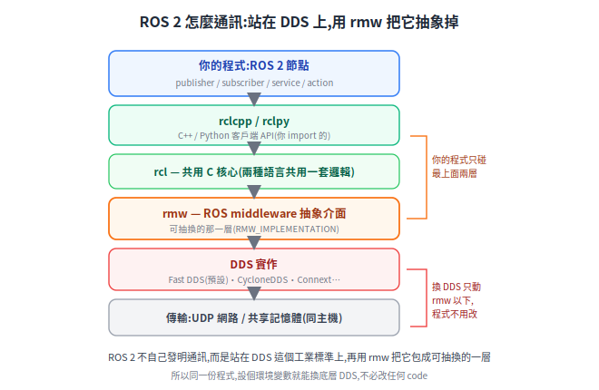
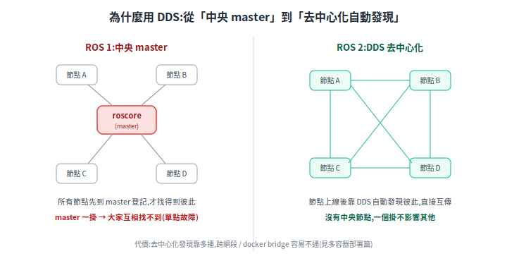

# ROS 2 的 DDS:節點之間怎麼互相講話

ROS 2 一個系統裡有一堆節點(導航、定位、相機 driver、fleet adapter…),它們**怎麼找到彼此、怎麼傳資料**?答案是 **DDS**。這篇用最少的概念把它講清楚,也補上 [多容器部署篇](rmf-multi-container-deploy.md) 一直提到的「DDS 跨容器」到底是什麼。

> 相關:[OpenRMF](open-rmf.md)、[RMF 多容器部署](rmf-multi-container-deploy.md)(DDS 跨容器的實際設定)。

---

## 1. 問題:很多節點,要互相通

ROS 2 程式是拆成很多**節點(node)**的:一個讀 LiDAR、一個跑定位、一個規劃、一個發馬達命令…。它們得互相傳資料(LiDAR → 定位 → 規劃 → 控制)。問題就兩個:**新節點上線時,別人怎麼知道它在?資料又怎麼送過去?** 這兩件事(發現 + 傳輸)就是通訊中介(middleware)要解的。

## 2. DDS 是什麼:ROS 2 站在一個工業標準上

**DDS(Data Distribution Service)是一套工業界的通訊標準**(OMG 制定,早就用在國防、航太、工控),專門解「一堆節點即時交換資料」。ROS 2 沒有自己重造通訊,而是**直接站在 DDS 上**,再用一層 `rmw` 把它包成可抽換的介面。

由上而下:你的程式(`rclcpp`/`rclpy`)→ `rcl`(共用 C 核心)→ **`rmw`(抽換層)** → DDS 實作 → 傳輸。**重點是 `rmw` 這層**:它讓「換一個 DDS 實作」變成設一個環境變數 `RMW_IMPLEMENTATION` 的事,你的程式一行都不用改。([ROS on DDS 設計文](https://design.ros2.org/articles/ros_on_dds.html))

## 3. 去中心化:ROS 2 沒有中央 master

這是 DDS 帶來最大的改變。**ROS 1 有一個中央 `roscore`(master)**,所有節點先去它那裡登記,才找得到彼此——master 一掛,大家就互相失聯(單點故障)。**ROS 2 靠 DDS 去中心化**:節點上線後自動「廣播找人」,彼此直接發現、直接傳,沒有中央節點。

好處:沒有單點故障、開關節點更自由。代價:這個「自動發現」靠**多播(multicast)**,而多播**跨網段或走 docker 預設 bridge network 容易不通**——這就是 [多容器部署篇](rmf-multi-container-deploy.md) 要處理的事。

## 4. 你會碰到的幾個詞

| 詞 | 一句話 |
|---|---|
| **topic + pub/sub** | 節點不直接點對點呼叫,而是「發布到一個 topic、誰想要誰訂閱」;DDS 天生就是這種資料導向的發布/訂閱 |
| **discovery(發現)** | 節點上線自動找到同網路、同 domain 的其他節點,不需中央登記 |
| **QoS(服務品質)** | 每條 topic 可設可靠度等級:命令用 **reliable**(保證送到)、高頻感測資料用 **best-effort**(掉幾筆沒差、要的是最新)([QoS 設定](https://docs.ros.org/en/humble/Concepts/Intermediate/About-Quality-of-Service-Settings.html)) |
| **`ROS_DOMAIN_ID`** | DDS 的邏輯隔離:同值的節點才在同一個邏輯網路、才看得到彼此(預設 0)([Domain ID](https://docs.ros.org/en/foxy/Concepts/About-Domain-ID.html)) |
| **`RMW_IMPLEMENTATION`** | 選哪個 DDS 實作:Fast DDS(預設)、CycloneDDS…。**全系統要統一**(topic 多半能跨,但 service/action 不保證)([不同 middleware](https://docs.ros.org/en/humble/Concepts/Intermediate/About-Different-Middleware-Vendors.html)) |

## 5. 對機器人與部署的意義

- **無單點故障**:不會因為一個「中央大腦」掛掉就全死,對要長時間穩定跑的機器人很重要。
- **QoS 分級**:LiDAR 點雲用 best-effort(高頻、要新)、急停/命令用 reliable(一定要送到)——這是 DDS 給的旋鈕。
- **同一套機制跨進程 / 容器 / 主機**:節點在同進程、不同容器、還是不同主機,通訊方式一致;這讓 [多容器部署](rmf-multi-container-deploy.md)(adapter 一容器、core 一容器)變得自然——只要把「發現」這關打通(host network 或 discovery server)。

一句話:**DDS 是 ROS 2 的「神經系統」**——去中心化、自動發現、可調 QoS;搞懂它,才知道為什麼多容器部署要設 `ROS_DOMAIN_ID`、統一 RMW、處理多播。

## 來源

- [ROS on DDS(設計文)](https://design.ros2.org/articles/ros_on_dds.html)
- ROS 2 Concepts:[不同 middleware 廠商](https://docs.ros.org/en/humble/Concepts/Intermediate/About-Different-Middleware-Vendors.html)、[Domain ID](https://docs.ros.org/en/foxy/Concepts/About-Domain-ID.html)、[QoS 設定](https://docs.ros.org/en/humble/Concepts/Intermediate/About-Quality-of-Service-Settings.html)
