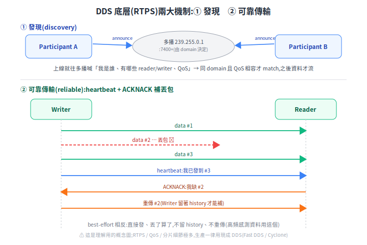
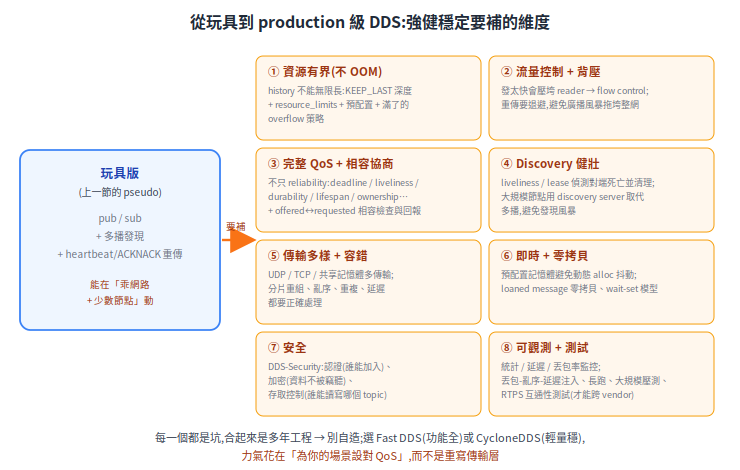
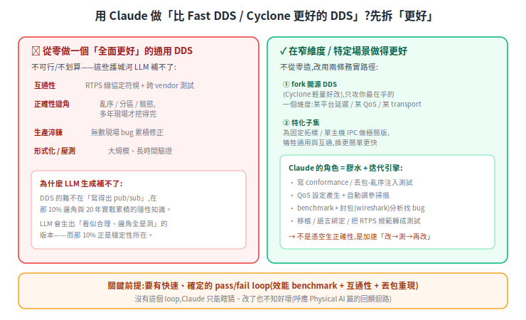

# ROS 2 的 DDS:節點之間怎麼互相講話

ROS 2 一個系統裡有一堆節點(導航、定位、相機 driver、fleet adapter…),它們**怎麼找到彼此、怎麼傳資料**?答案是 **DDS**。這篇用最少的概念把它講清楚,也補上 [多容器部署篇](rmf-multi-container-deploy.md) 一直提到的「DDS 跨容器」到底是什麼。

> 相關:[OpenRMF](open-rmf.md)、[RMF 多容器部署](rmf-multi-container-deploy.md)(DDS 跨容器的實際設定)。

---

## 1. 問題:很多節點,要互相通

ROS 2 程式是拆成很多**節點(node)**的:一個讀 LiDAR、一個跑定位、一個規劃、一個發馬達命令…。它們得互相傳資料(LiDAR → 定位 → 規劃 → 控制)。問題就兩個:**新節點上線時,別人怎麼知道它在?資料又怎麼送過去?** 這兩件事(發現 + 傳輸)就是通訊中介(middleware)要解的。

## 2. DDS 是什麼:ROS 2 站在一個工業標準上

**DDS(Data Distribution Service)是一套工業界的通訊標準**(OMG 制定,早就用在國防、航太、工控),專門解「一堆節點即時交換資料」。ROS 2 沒有自己重造通訊,而是**直接站在 DDS 上**,再用一層 `rmw` 把它包成可抽換的介面。

<p align="center"></p>

由上而下:你的程式(`rclcpp`/`rclpy`)→ `rcl`(共用 C 核心)→ **`rmw`(抽換層)** → DDS 實作 → 傳輸。**重點是 `rmw` 這層**:它讓「換一個 DDS 實作」變成設一個環境變數 `RMW_IMPLEMENTATION` 的事,你的程式一行都不用改。([ROS on DDS 設計文](https://design.ros2.org/articles/ros_on_dds.html))

## 3. 去中心化:ROS 2 沒有中央 master

這是 DDS 帶來最大的改變。**ROS 1 有一個中央 `roscore`(master)**,所有節點先去它那裡登記,才找得到彼此——master 一掛,大家就互相失聯(單點故障)。**ROS 2 靠 DDS 去中心化**:節點上線後自動「廣播找人」,彼此直接發現、直接傳,沒有中央節點。

<p align="center"></p>

好處:沒有單點故障、開關節點更自由。代價:這個「自動發現」靠**多播(multicast)**,而多播**跨網段或走 docker 預設 bridge network 容易不通**——這就是 [多容器部署篇](rmf-multi-container-deploy.md) 要處理的事。

## 4. 你會碰到的幾個詞

| 詞 | 一句話 |
|---|---|
| **topic + pub/sub** | 節點不直接點對點呼叫,而是「發布到一個 topic、誰想要誰訂閱」;DDS 天生就是這種資料導向的發布/訂閱 |
| **discovery(發現)** | 節點上線自動找到同網路、同 domain 的其他節點,不需中央登記 |
| **QoS(服務品質)** | 每條 topic 可設可靠度等級:命令用 **reliable**(保證送到)、高頻感測資料用 **best-effort**(掉幾筆沒差、要的是最新)([QoS 設定](https://docs.ros.org/en/humble/Concepts/Intermediate/About-Quality-of-Service-Settings.html)) |
| **`ROS_DOMAIN_ID`** | DDS 的邏輯隔離:同值的節點才在同一個邏輯網路、才看得到彼此(預設 0)([Domain ID](https://docs.ros.org/en/foxy/Concepts/About-Domain-ID.html)) |
| **`RMW_IMPLEMENTATION`** | 選哪個 DDS 實作:Fast DDS(預設)、CycloneDDS…。**全系統要統一**(topic 多半能跨,但 service/action 不保證)([不同 middleware](https://docs.ros.org/en/humble/Concepts/Intermediate/About-Different-Middleware-Vendors.html)) |

## 5. 對機器人與部署的意義

- **無單點故障**:不會因為一個「中央大腦」掛掉就全死,對要長時間穩定跑的機器人很重要。
- **QoS 分級**:LiDAR 點雲用 best-effort(高頻、要新)、急停/命令用 reliable(一定要送到)——這是 DDS 給的旋鈕。
- **同一套機制跨進程 / 容器 / 主機**:節點在同進程、不同容器、還是不同主機,通訊方式一致;這讓 [多容器部署](rmf-multi-container-deploy.md)(adapter 一容器、core 一容器)變得自然——只要把「發現」這關打通(host network 或 discovery server)。

一句話:**DDS 是 ROS 2 的「神經系統」**——去中心化、自動發現、可調 QoS;搞懂它,才知道為什麼多容器部署要設 `ROS_DOMAIN_ID`、統一 RMW、處理多播。

## 附:DDS 底層在做什麼(概念 pseudo-code)

想知道「發現」和「可靠傳輸」底層怎麼跑?把 DDS 的傳輸協定 **RTPS** 極度簡化,核心就兩塊:

<p align="center"></p>

```python
# 概念骨架:理解 DDS(RTPS)內部在做什麼
# ⚠ 教學用;生產一律用現成 DDS(Fast DDS / Cyclone),別自己造

MCAST = ("239.255.0.1", 7400 + domain_id * 250)   # domain 決定多播位址/port(概念)

# ── 1. 發現:上線就往多播喊「我是誰、有哪些 reader/writer」──
def announce_loop(self):
    every(3, "seconds"):
        mcast_send(MCAST, Announce(participant_id, domain_id,
                                   writers=[(topic, qos), ...],
                                   readers=[(topic, qos), ...]))

def on_announce(self, msg):
    if msg.domain_id != self.domain_id: return        # 不同 domain,不理
    add_peer(msg.participant_id, msg.addr)
    for w in msg.writers:
        for r in self.readers:
            if r.topic == w.topic and qos_compatible(r.qos, w.qos):
                match(r, w)            # 配對成功,之後資料才會流

# ── 2. 發布:writer 把資料發給所有 match 的 reader ──
def publish(writer, data):
    writer.seq += 1
    pkt = cdr_serialize(data, writer.seq)             # 跨平台序列化 + 序號
    for r in writer.matched_readers:
        if writer.qos.reliability == BEST_EFFORT:
            udp_send(r.addr, pkt)                     # 丟了就算了
        else:                                         # RELIABLE
            writer.history[writer.seq] = pkt          # 留著以備重傳
            udp_send(r.addr, pkt)

# ── 3. 可靠:heartbeat 通報進度,ACKNACK 點名缺哪筆,再重傳 ──
def writer_tick(writer):
    udp_send_all(writer.matched_readers, Heartbeat(writer.seq))    # 我發到第 N 號

def on_heartbeat(reader, hb):
    missing = [s for s in range(reader.last+1, hb.seq+1) if s not in reader.got]
    if missing: udp_send(hb.sender, AckNack(missing))              # 我缺這幾號

def on_acknack(writer, nack):
    for s in nack.missing:
        udp_send(nack.sender, writer.history[s])      # 重傳
```

### 注意事項

1. **別自己造(最重要)**:上面只是讓你看懂機制。真實 RTPS 的 QoS、分片、計時、安全層細節極多,生產一律用 Fast DDS / CycloneDDS。
2. **多播是發現的命脈**:`announce` 走多播,**跨網段 / docker bridge / 防火牆擋多播就發現失敗**(節點起得來卻互相看不到)→ 改用 discovery server / unicast peers(見 [多容器部署](rmf-multi-container-deploy.md))。
3. **QoS 不相容就配不上**:`qos_compatible` 沒過(reliability、durability… 不匹配),writer/reader 就 match 不起來——**沒資料也不報錯**,新手最常卡這。
4. **序列化要跨平台一致**:用 CDR、統一位元組序、型別 / IDL 對齊;不能各送各的格式,否則對端解不開。
5. **UDP 有 MTU 上限**:資料大於一個封包要分片重組(RTPS fragmentation),別假設一筆送得完。
6. **reliable 不是免費**:`history` buffer 吃記憶體、重傳增延遲。高頻又容得了丟幾筆的(LiDAR、影像)用 best-effort,命令 / 狀態才用 reliable。
7. **晚加入者(late joiner)**:`reliable` + `durability=transient_local` 時,晚上線的 reader 要能補拿先前資料,代價是 writer 得一直留 buffer。

## 附:從玩具到 production——強健穩定的 DDS 要補什麼

上一節的 pseudo 能在「乖網路 + 少數節點」動,但離強健穩定差很遠。production 級 DDS(Fast DDS / CycloneDDS 花多年做的)要在**資源有限、對端會死、網路會丟 / 亂序 / 分區、規模會大、要即時、要安全**這些現實下還正確穩定。要補的維度:

<p align="center"></p>

每個維度都是坑,合起來就是「為什麼別自造」。務實做法:

- **選現成,別重寫**:功能最全用 **Fast DDS**;要輕量、確定性好用 **CycloneDDS**(RMF 官方範本就用它)。RTPS 是 OMG 的線協定標準,照規範實作才能跨 vendor 互通——光這點就是巨大工程。
- **9 成的「強健」其實是設對 QoS**:把 `reliability` / `durability` / `history` / `deadline` / `liveliness` 配對你的場景(命令 reliable、感測 best-effort、晚加入 transient_local、要偵測掉線設 liveliness…),比重寫傳輸層划算太多。QoS 不相容配不上、history buffer 設太大 OOM——這些「強健問題」多半是**設定問題**,不是要你自己寫 DDS。
- **打通 discovery**:跨容器 / 網段別硬靠多播,用 discovery server 或 unicast peers(見 [多容器部署](rmf-multi-container-deploy.md))。
- **真要客製**:基於開源 DDS(Fast DDS / Cyclone 都開源)改,別從零開始。

一句話:**「做一個強健的 DDS」99% 不該是「自己寫一個」,而是「選對 DDS + 設對 QoS + 打通網路」**。

## 附:用 Claude 做一個「比 Fast DDS / Cyclone 更好的 DDS」?

延續上一節「別自造」,這題要誠實拆。「更好」沒有全面版本,先分兩種:

<p align="center"></p>

**全面更好的通用 DDS、從零用 Claude 寫 → 不可行也不划算。** DDS 的難不在「寫得出 pub/sub」(上一節 pseudo 就是),而在那 10% 邊角:亂序、網路分區、競態、QoS 完整矩陣、RTPS 跨 vendor 互通——這些是 20 年現場累積的隱性知識。LLM 會生出「看似合理、邊角全是洞」的版本,而那 10% 正是穩定性所在;靠「讀更多文件」補不了,因為這些 bug 是被真實流量打出來的,不是寫在文件裡。

**但在窄維度 / 特定場景做得更好 → 可行,而且這才是 Claude 的正確用法。** 兩條路徑:

- **fork 開源 DDS**(Cyclone 輕量好改),只攻你最在乎的一個維度(某嵌入式平台的延遲、某個 QoS、某 transport),其他照用成熟實作。
- **特化子集**:若你的場景是固定拓樸、單主機 IPC、訊息型別固定,做一個極簡、零配置的特化版,在那個窄場景可能比通用 DDS 更快更簡單——代價是放棄通用性、互通性、完整 QoS。

這兩條裡,**Claude 是膠水 + 迭代引擎,不是憑空生正確性的魔法**(呼應 [Claude Physical AI workflow](../50-physical-ai/claude-physical-ai-workflow.md)):它真正能加速的是 conformance / 丟包注入測試、QoS 自動調參、benchmark + 封包分析找 bug、移植與綁定、把 RTPS 規範條文轉成測試案例。

**關鍵前提還是 pass/fail loop**:要有快速、確定的「效能 benchmark + 互通性測試 + 丟包重現」當訊號,Claude 才知道每次改是變好還變壞;沒有這個 loop,它只能瞎猜。

**結論**:務實的問法不是「Claude 能不能寫一個打敗 Fast DDS 的」,而是「**我的場景在哪個維度需要更好,能不能 fork 成熟 DDS、用 Claude + 嚴格測試 loop 在那個維度做到更好**」。後者答案是肯定的;「全面從零超越」則不是。

## 來源

- [ROS on DDS(設計文)](https://design.ros2.org/articles/ros_on_dds.html)
- DDS 實作文件(QoS / 傳輸 / Security / Discovery):[Fast DDS](https://fast-dds.docs.eprosima.com/)、[CycloneDDS](https://cyclonedds.io/docs/)
- ROS 2 Concepts:[不同 middleware 廠商](https://docs.ros.org/en/humble/Concepts/Intermediate/About-Different-Middleware-Vendors.html)、[Domain ID](https://docs.ros.org/en/foxy/Concepts/About-Domain-ID.html)、[QoS 設定](https://docs.ros.org/en/humble/Concepts/Intermediate/About-Quality-of-Service-Settings.html)
