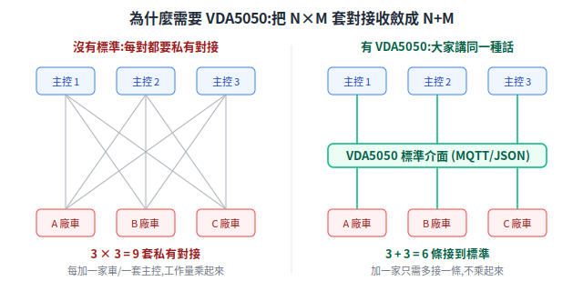
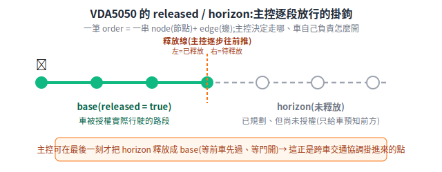

# VDA5050 協定

當一個場域要同時用很多家廠商的 AMR,第一個撞牆的問題是:**上位的主控系統要怎麼跟每一家的車講話?** VDA5050 就是為這個問題訂的「共同語言」。本篇從根本問題講起,再展開訊息結構與幾個關鍵設計。

> 延伸閱讀:[OpenRMF](open-rmf.md)(跨車隊那一層)、[系統架構](../00-overview/system-architecture.md)。
> 版本註:GitHub 主分支標 **3.0.0**,業界大量導入仍是 2.x;引用具體欄位時註明對照版本。

---

## 1. 根本問題:N 家車 × M 套主控 = N×M 套對接

每家 AMR 都自帶私有通訊協議。沒有共同標準時,一套主控系統要指揮 3 家車,就得寫 3 套對接;反過來 3 套主控要接同一家車,也要 3 套。**對接數量是「乘」起來的(N×M)**,每多一家車或一套主控,整合成本就翻倍。

VDA5050 的第一性原理就是把這個乘法變加法:**定義一個標準介面,大家都接到它**,對接數量收斂成 **N+M**:

<p align="center"></p>

這跟 USB、HTTP 是同一個道理:標準的價值不在功能多強,而在「把多對多的私有對接,收斂成大家對一個共同介面」。

## 2. VDA5050 是什麼

**VDA5050** 是一份規格,定義 **AGV/AMR 與上位主控系統(master control,統一指揮車隊的中央系統)之間的標準介面**。

- **誰訂的**:德國汽車工業協會 **VDA** + 德國機械設備製造業協會 **VDMA** 共同制定(KIT 卡爾斯魯厄理工的物流研究所主導)。
- **傳輸**:**MQTT**(輕量發布/訂閱訊息協定)+ **JSON** 資料格式。選 MQTT 是因為它天生適合「一個主控對多台車、即時、可偵測斷線」的場景。

### 核心訊息類型(MQTT topic)

| Topic | 方向 | 一句話 |
|---|---|---|
| **order**(訂單) | 主控 → 車 | 一筆運輸任務的路徑,由一串 node + edge 組成,可掛 action |
| **instantActions**(即時動作) | 主控 → 車 | 不依附 order、要立刻做的命令(急停、暫停、繼續) |
| **state**(狀態) | 車 → 主控 | 當前狀態:位置、order 進度、電量、錯誤 |
| **visualization**(視覺化) | 車 → 系統 | 高頻位置/路徑,專供畫面顯示(不保證可靠送達) |
| **connection**(連線) | 車 → 主控(含 broker last-will) | 正常時車自己發 ONLINE;斷線時 broker 代發 OFFLINE,偵測非預期斷線 |
| **factsheet**(規格表) | 車 → 主控 | 車輛能力宣告:尺寸、載重、支援的 action |

> QoS 等級規格沒強制、留給實作,但取捨呼應第一性原理:**visualization 適合 QoS 0**(高頻、丟幾幀無妨);**order/state 視部署多採 QoS 1**(任務指令/狀態漏送後果嚴重);**connection 用 last-will + retain** 確保「斷線」這個安全訊號一定送達。

## 3. 把路徑描述成「節點–邊」圖

VDA5050 把一條路徑表示成一張圖:

- **node(節點)**:路徑上的點位,帶 `nodeId`、`sequenceId`(順序碼,節點取偶數、邊取奇數)、座標,以及選用的 actions。
- **edge(邊)**:連接相鄰兩節點的路段。
- **action(動作)**:掛在 node 或 edge 上的具體動作(舉升、放貨、開門訊號),由 `actionType` + `actionParameters` 描述,車端負責解讀執行並回報。

### released / horizon:逐段放行的安全設計(最關鍵)

一筆 order 切成兩段,這是 VDA5050 最重要、也最容易被忽略的設計:

<p align="center"></p>

- **base(released = true)**:車**被授權實際行駛**的路段。
- **horizon(視界,未釋放)**:已規劃、但**尚未授權**的後續路段,給車「預知前方」用,但不可貿然走進去。

為什麼要這樣切?第一性原理:**主控需要一個「最後一刻才放行」的掛鉤**。主控可以逐步把 horizon 的節點「釋放」成 base——等前方車先過、等門打開,才放下一段。這個 released/horizon 機制,正是上一層的跨車交通協調([OpenRMF](open-rmf.md))能掛進來的點:協商定案前,主控就先不釋放。

### action 的 blockingType:動作與行駛能否並行

| blockingType | 意義 |
|---|---|
| `NONE` | 可與行駛、以及其他 action 並行 |
| `SOFT` | 不可同時行駛,但允許其他 action 並行 |
| `HARD` | 必須完全靜止,且不可有任何並行 action |

> 版本註:常見規格列 `NONE / SOFT / HARD` 三種;部分版本另有 `SINGLE`,以對照版本的 `order.schema` 為準。

## 4. 一個完整的 order 長什麼樣(小型範例)

把前面的概念組成一筆真的能發的 order:**叉車從節點 `n1` 出發,經一條邊 `e1` 到 `n2`,在 `n2` 叉起一個 EPAL 棧板**。每個欄位都對應前面講的某個設計:

```json
{
  "headerId": 1,
  "timestamp": "2026-06-22T10:30:45Z",
  "version": "2.0.0",
  "manufacturer": "ACME",
  "serialNumber": "forklift-01",
  "orderId": "order-1234",
  "orderUpdateId": 0,
  "nodes": [
    {
      "nodeId": "n1", "sequenceId": 0, "released": true,
      "nodePosition": { "x": 1.0, "y": 2.0, "theta": 0.0, "mapId": "warehouse" },
      "actions": []
    },
    {
      "nodeId": "n2", "sequenceId": 2, "released": true,
      "nodePosition": { "x": 5.0, "y": 2.0, "theta": 1.57, "mapId": "warehouse" },
      "actions": [
        {
          "actionId": "act-pick-1",
          "actionType": "pick",
          "blockingType": "HARD",
          "actionParameters": [ { "key": "loadType", "value": "EPAL" } ]
        }
      ]
    }
  ],
  "edges": [
    {
      "edgeId": "e1", "sequenceId": 1, "released": true,
      "startNodeId": "n1", "endNodeId": "n2",
      "actions": []
    }
  ]
}
```

逐欄對回第一性原理:

- **header 五件**(`headerId`/`timestamp`/`version`/`manufacturer`/`serialNumber`):每則訊息都帶,讓主控知道「誰、什麼時候、哪個協定版本」發的——對應 §1 的「跨廠共同語言」。
- **`orderId` + `orderUpdateId`**:同一筆 order 改動(例如釋放更多 horizon)時 `orderId` 不變、`orderUpdateId` 遞增,車才知道是「同一單的更新」而非新單。
- **`sequenceId`**:節點偶數(0, 2…)、邊奇數(1, 3…)交錯,標明遍歷順序。
- **`released: true`**:這幾段都已授權可走;若把 `n2`/`e1` 設 `false` 就是 horizon(已規劃、未放行,見 §3)。
- **`pick` action 在 `n2` 上、`blockingType: HARD`**:取貨要停車作業,不能邊走邊叉(§3 的 blockingType);`loadType: EPAL` 是給車的參數(歐規棧板)。

> 車端收到後:走到 `n1`→沿 `e1` 到 `n2`→因 `pick` 是 HARD 先停穩再叉貨,完成後用 **state** 訊息回報進度(位置、`actionStates`、電量)。完整欄位以官方 `order.schema` 為準。

## 5. 職責邊界:主控規劃路、車自己開

VDA5050 明確劃分誰負責什麼——這條邊界是看懂整個協定的關鍵:

| 職責 | 歸誰 |
|---|---|
| **路徑規劃**(走哪些 node/edge、考慮車能力與交通) | **主控** |
| **連通圖維護**(維護全圖,只把允許子集下發給車) | **主控** |
| **導航 / 定位 / 軌跡執行 / 避障** | **車自己** |
| **action 執行與狀態管理** | **車** |

一句話:**主控決定「走哪條路」,車自己負責「怎麼安全開過去、遇到障礙怎麼閃」**。VDA5050 不規定避障演算法——那是各車廠的本事,標準只管介面。這也是為什麼一個標準能容納很多家技術完全不同的車。

## 6. 待查證 / 留意

- 版本號:主分支 3.0.0、業界多 2.x,引用欄位註明版本。
- `sequenceId` 偶/奇規則、`orderUpdateId` 版本控制細節以官方 `VDA5050_EN.md` 的 JSON schema 為準,實作前逐欄覆核。

## 7. 來源

- [VDA5050 官方規格 (VDA5050_EN.md)](https://github.com/VDA5050/VDA5050/blob/main/VDA5050_EN.md)
- [VDA5050 repo](https://github.com/VDA5050/VDA5050)
- [ROS2 Multi-Robot Book](https://osrf.github.io/ros2multirobotbook/intro.html)
