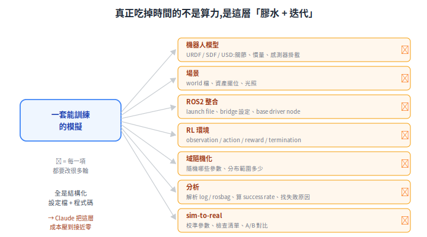
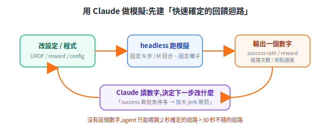
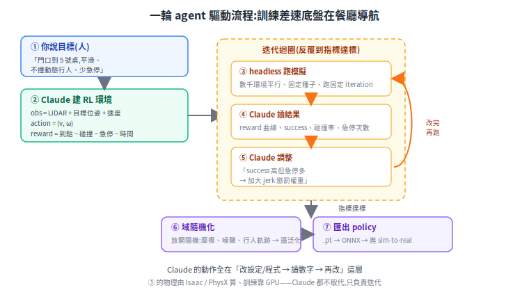

# 用 Claude 完成機器人的 Physical AI 模擬

想用 Claude(尤其 Claude Code 這種能讀寫檔案、跑指令的 agent)把一套機器人 Physical AI 模擬實際建起來、跑起來、調到能用,關鍵其實不在模擬器怎麼操作,而在先看清楚「模擬到底卡在哪」,再決定 Claude 適合插進哪幾個環節、怎麼讓它安全地跑。下面就照這個順序走一遍。

> 前置:先讀 [Physical AI 總覽](physical-ai-overview.md)、[Isaac Sim/Lab](isaac-sim-isaac-lab-amr.md) 或 [Gazebo+ROS2](simulation-gazebo-ros2.md) 其一、[sim-to-real](sim-to-real.md)。
> 相關:[感測器資料與 3D Gaussian 重建](sensor-data-and-3d-reconstruction.md)。

---

## 1. 第一性原理:模擬的瓶頸不是算力,是「膠水與迭代」

直覺會以為「做 Physical AI 模擬」最難的是 GPU 夠不夠、物理引擎準不準。但實際動手會發現,真正吃掉時間的是另一類工作:

這些幾乎全是**結構化的設定檔與程式碼**,而且**要改很多輪**:reward 調一個係數重跑、randomization 範圍放寬再跑、感測器位置改了 launch 跟著改。算力是一次性的硬體投資,但這層「膠水 + 迭代」是**持續的人力消耗**——這才是瓶頸。

**第一性原理結論**:能大幅加速模擬的,不是更多 GPU,而是**把「產生與修改結構化程式碼/設定」這件事的成本壓到接近零**。這正好是 LLM coding agent 的強項。所以 Claude 在 Physical AI 模擬裡的定位很明確:**它是膠水層與迭代引擎,不是物理引擎、也不是訓練算力**。

## 2. 第二個第一性原理:沒有快速 pass/fail 訊號,agent 幫不上忙

Claude 之所以能迭代,前提是**每改一次,都有一個快速、確定性、機器可讀的「好/壞」訊號**讓它知道改對沒。沒有這個訊號,它只能瞎猜。所以用 Claude 做模擬的第一件事不是寫 reward,而是**先把回饋迴路建出來**:

設計這個迴路的要點(對應本專案的工作守則):

- **headless、無 GUI**:模擬跑在無畫面模式,結果輸出成檔案(數字、log、必要時 dump PNG 再回讀)。不要開 GUI viewer 阻塞。
- **有界**:每次跑限定回合數 / frames / `timeout`,不要無限跑。
- **確定性**:固定隨機種子、固定初始位姿,讓「同樣的改動 → 同樣的結果」,否則 Claude 分不清是改善還是噪聲。
- **迴路寧可慢一點,也要每次結果一致**:一個 2 秒、但每跑都一樣的迴路,比 30 秒卻時準時不準的有用得多。先把迴路弄穩,再開始調策略。

## 3. Claude 插在哪幾個環節

對照第 1 節的清單,逐項說明 Claude 能做什麼、產出什麼:

| 環節 | Claude 做什麼 | 產出 |
|---|---|---|
| **機器人/場景建模** | 從文字描述生成 URDF/SDF/USD 骨架、在格式間轉換、填慣量/關節參數、擺感測器 | `.urdf` / `.sdf` / world 檔 |
| **ROS2 整合** | 寫 launch file、`ros_gz_bridge` 對應表、base driver node(訂 `/cmd_vel` 發 `/odom`+tf) | launch / node 程式 |
| **RL 環境(Isaac Lab)** | 起草 Manager-based env:observation/action/reward/termination 設定;**迭代 reward shaping** | env config `.py` |
| **域隨機化** | 寫 randomization 設定:隨機哪些參數、分布範圍 | randomization config |
| **分析診斷** | 解析 rosbag/log、算 success rate、畫趨勢、定位「sim 好 real 壞」的原因 | 報告 / 圖表 |
| **sim-to-real** | 把 [sim-to-real](sim-to-real.md) 的檢查清單變成可執行的對比腳本 | 校準/對比腳本 |

關鍵心法:**Claude 最擅長「reward shaping 與設定迭代」這種「規則清楚、但要試很多輪」的工作**。你給目標(「機器人要平滑到點、不撞人、不急停」),它把目標翻成 reward 項與權重,跑、看數字、調權重,反覆收斂——這正是最耗人工的一段。

## 4. 一個具體迴路:訓練差速底盤在餐廳導航

把前面組起來,一輪典型的 agent 驅動流程長這樣:

注意每一步 Claude 的動作都落在「改設定/程式 → 讀數字 → 再改」,**它沒有取代物理引擎(③ 是 Isaac/PhysX 在算)、也沒有取代 GPU 訓練**。

## 5. 安全地驅動 Claude(工程守則)

讓 agent 長時間跑模擬,要守幾條紀律,避免空轉殭屍與環境污染:

- **Docker first**:模擬與訓練環境一律進容器(Isaac 有官方 NGC image;ROS2/Gazebo 用對應 distro 的 image)。Python 套件用容器內的 venv,不污染系統。
- **同步前景、有界執行**:跑模擬的指令同步等回傳,帶回合數/`timeout` 上限;不要用背景 sentinel 迴圈輪詢等檔(會空轉整夜)。
- **不開 GUI**:headless + dump 檔案再回讀;不要在 agent 環境開 viewer 視窗。
- **確定性**:固定 seed、固定初始狀態,讓 Claude 的每次比較有意義。
- **版本對齊**:ROS2 distro ↔ Gazebo 版本、Isaac Sim ↔ ROS2 版本有嚴格對應(見各自文件),讓 Claude 先確認版本矩陣再動手,避免裝錯整套重來。

## 6. 誠實的邊界:Claude 不做什麼

| 角色 | 誰做 |
|---|---|
| 產生/修改設定與程式、reward 迭代、log 分析、診斷 | **Claude** |
| 物理解算、算繪、感測器模擬 | 模擬器(Isaac Sim / Gazebo) |
| 大規模 RL 訓練的算力 | GPU |
| 物理參數是否真的對、模型是否合理 | **人**(需驗證,Claude 產出要審) |
| 真實硬體量測、最終上車決策 | **人 + 真機** |

兩個要特別記住的限制:

1. **物理正確性要人把關**:Claude 生成的 URDF 慣量、reward 設計可能「看起來合理但物理上不對」,一定要在模擬裡驗證、必要時對照真實量測。這也是為什麼第 2 節的確定性回饋迴路是地基——它讓「對不對」可被檢驗,而不是靠 Claude 自說自話。
2. **reality gap 不會因為用了 Claude 就消失**:模擬調得再好,上實車仍要走 [sim-to-real](sim-to-real.md) 的完整流程(域隨機化、參數校準、小心漸進上車)。Claude 加速的是「把這套流程執行得更快」,不是「跳過它」。

## 7. 與本筆記其他部分的連結

- **模擬器選擇**:只驗導航邏輯 → [Gazebo+ROS2](simulation-gazebo-ros2.md);要 RL/合成資料/高擬真感測 → [Isaac Sim/Lab](isaac-sim-isaac-lab-amr.md)。
- **遷移到真車**:[sim-to-real](sim-to-real.md) 的 reality gap、域隨機化、檢查清單。
- **高擬真場景**:用 [3D Gaussian 重建](sensor-data-and-3d-reconstruction.md) 把真實餐廳掃進模擬。
- **導航本體**:模擬裡跑的 [SLAM](../30-navigation/slam-mapping.md) 與 [定位](../30-navigation/localization.md) 跟真車同一套 ROS2 堆疊。

**一句話**:Claude 不是來算物理或頂替 GPU 的;它把 Physical AI 模擬裡那層「永遠在改的膠水與迭代」成本壓到接近零,讓你把時間花在「定義目標、驗證正確性、決定要不要上車」這些真正需要人的判斷上。
