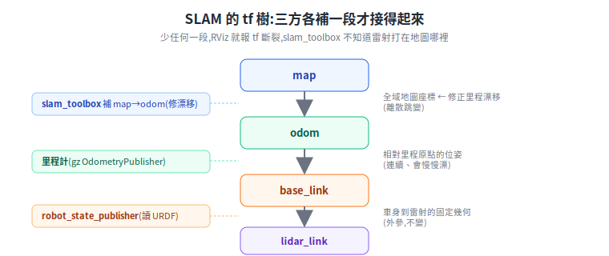

# 在 Gazebo 倉庫用 slam_toolbox 建圖(可重跑教學)

把前面那台舵輪叉車開進 AWS Small Warehouse,用 **slam_toolbox** 邊走邊建出 2D 地圖。這篇是可重跑的步驟教學:從「幫機器人裝雷射」到「RViz 看著地圖長出來」。

> 前置:[用 Gazebo + ROS2 模擬 AMR](simulation-gazebo-ros2.md)(gz/ROS2 版本對應、ros_gz 橋接)、[2D SLAM 建圖原理](../30-navigation/slam-mapping.md)(occupancy grid、scan matching、loop closure)。實作素材(叉車模型、倉庫世界)在 [aws_warehouse_model_for_gazebo_harmonic](https://github.com/wicanr2/aws_warehouse_model_for_gazebo_harmonic)。
>
> **誠實前提**:`slam_toolbox` 是 ROS 2 套件,雷射 `gpu_lidar` 要 **render**(GPU/EGL)。所以**實際建圖要在有 GPU 的機器或 GPU runner + ROS 2 環境**跑;免費 GitHub runner 的軟體渲染不穩(見 [GitHub Actions × gz sim playbook](../_meta/github-actions-gz-sim-playbook.md))。CI 能驗的是「模型/世界 SDF 結構、`/scan` 有沒有宣告」,**不能**穩定跑出整張地圖。

---

## 1. 全貌:SLAM 要哪些零件

slam_toolbox 要的東西其實很少,但每個都不能缺:

| 要件 | 從哪來 | 沒有會怎樣 |
|---|---|---|
| `/scan`(`sensor_msgs/LaserScan`) | 機器人身上的 2D LiDAR(gz `gpu_lidar`)→ ros_gz_bridge | 沒雷射就沒得比對,SLAM 不動 |
| `odom → base_link` 的 tf | 里程計(gz `OdometryPublisher` 或輪速估算)→ bridge | slam_toolbox 用它當「兩幀之間大概移動多少」的初值 |
| `base_link → lidar_link` 的 tf | `robot_state_publisher` 讀 URDF(機器人固定幾何) | 雷射點對不到車身座標 |
| `/clock`(模擬時間) | gz → bridge,`use_sim_time:=true` | 時間對不上,tf 外插失敗 |

slam_toolbox 吃 `/scan` + tf,**產出** `/map`(`OccupancyGrid`)並補上 `map → odom` 這段 tf(把里程漂移修回全域地圖)。

資料流跟 [Nav2 閉迴路](simulation-gazebo-ros2.md#3-跟-nav2-串接sim--nav2-閉迴路) 同源,只是這裡終點是 slam_toolbox 而非 Nav2。

## 2. 機器人要會出 `/scan` 與 `odom→base_link`(已做進叉車模型)

叉車模型 `robot/forklift/model.sdf` 已經補上兩樣 SLAM 必需品:

- **2D LiDAR**:一個 `lidar_link` 掛在車身前上方,裡面一顆 `gpu_lidar` sensor:
  ```xml
  <sensor name="lidar" type="gpu_lidar">
    <topic>scan</topic>
    <gz_frame_id>lidar_link</gz_frame_id>
    <update_rate>10</update_rate>
    <lidar>
      <scan><horizontal>
        <samples>360</samples><resolution>1</resolution>
        <min_angle>-3.14159</min_angle><max_angle>3.14159</max_angle>
      </horizontal></scan>
      <range><min>0.2</min><max>12.0</max></range>
    </lidar>
    <always_on>1</always_on>
  </sensor>
  ```
  > `gpu_lidar` 掃的是**視覺 mesh**(rendering),不是 collision——所以即使 [dartsim 忽略倉庫的 mesh collision](simulation-gazebo-ros2.md#5-物理層的雷),雷射**照樣掃得到貨架與牆**,地圖會長出貨架輪廓。代價是它要 render。

- **里程計**:`gz-sim-odometry-publisher-system` 發 `odom` 與 `odom→base_link` tf:
  ```xml
  <plugin filename="gz-sim-odometry-publisher-system" name="gz::sim::systems::OdometryPublisher">
    <odom_frame>odom</odom_frame><robot_base_frame>base_link</robot_base_frame>
    <dimensions>2</dimensions>
  </plugin>
  ```
  > 這是「模擬里程」(直接從模型真值算),實機要由輪速/編碼器估。slam_toolbox 不挑來源,有 `odom→base_link` 就能用。

## 3. world 要掛 Sensors system

`gpu_lidar` 要真的出資料,world 一定要掛 **`gz-sim-sensors-system`**(沒掛 sensor 就閒置不出 `/scan`)。遷移後的倉庫世界 `worlds/small_warehouse.sdf` / `no_roof_small_warehouse.sdf` 已經有了。建圖建議用 **no_roof 版**(雷射在車高掃不到屋頂,但 no_roof 對視覺/除錯友善)。

## 4. Docker 環境(ROS 2 Jazzy + Gazebo Harmonic + slam_toolbox)

不污染主機,用容器(對應 [model repo 的 Docker 規劃](https://github.com/wicanr2/aws_warehouse_model_for_gazebo_harmonic/tree/main/docker)):

```dockerfile
FROM osrf/ros:jazzy-desktop-full
RUN apt-get update && apt-get install -y \
    ros-jazzy-ros-gz \           # gz Harmonic + ros_gz 橋接(Jazzy 官方配對)
    ros-jazzy-slam-toolbox \
    ros-jazzy-teleop-twist-keyboard
```

> 為何是 Jazzy + Harmonic:見 [ROS2↔Gazebo 版本對應](simulation-gazebo-ros2.md#gazebo-版本--ros-2-版本對應最容易踩雷)。主機若是更新的 gz(如 Jetty),容器自帶 Harmonic、互不干擾。

## 5. ros_gz_bridge:把 gz 訊息接成 ROS

slam_toolbox 只懂 ROS topic/tf,gz 講自己的話,中間靠 `ros_gz_bridge`。最少要橋這幾條(`@ROS型別@gz型別`,方向見 [§4 橋接語法](simulation-gazebo-ros2.md#4-典型啟動方式結構不貼完整程式)):

```
/scan@sensor_msgs/msg/LaserScan@gz.msgs.LaserScan        # gz → ROS(雷射)
/clock@rosgraph_msgs/msg/Clock@gz.msgs.Clock             # 模擬時間
/model/forklift/odometry@nav_msgs/msg/Odometry@gz.msgs.Odometry
/forklift/traction@std_msgs/msg/Float64@gz.msgs.Double   # ROS → gz(舵輪驅動)
/forklift/steer@std_msgs/msg/Float64@gz.msgs.Double      # ROS → gz(轉向)
```

tf 部分:gz 的 `OdometryPublisher` 會發 `odom→base_link`;用 `ros_gz_bridge` 把 gz 的 tf(`/model/forklift/pose` 或 odom 的 tf)接成 ROS `/tf`,或在 ROS 端用 `robot_state_publisher`(讀 URDF)補 `base_link→lidar_link`。

## 6. tf 樹:三方各補一段(slam_toolbox 的關鍵)

<p align="center"></p>

| 這段 tf | 誰提供 | 意義 |
|---|---|---|
| `map → odom` | **slam_toolbox**(建圖時即時算) | 把里程漂移修回全域地圖 |
| `odom → base_link` | 里程計(gz OdometryPublisher) | 相對里程原點的位姿(會漂) |
| `base_link → lidar_link` | robot_state_publisher(URDF) | 車身到雷射的固定幾何 |

三段接起來,slam_toolbox 才知道「這幀雷射打在地圖的哪裡」。少任何一段,RViz 會報 tf 斷裂。

## 7. 起 slam_toolbox + 驅動繞倉庫 + RViz

1. **起模擬**:`gz sim` 載 `no_roof_small_warehouse.sdf`(設 `GZ_SIM_RESOURCE_PATH` 含 `models/` 與 `robot/`),spawn 叉車進倉庫走道。
2. **起 bridge + robot_state_publisher**(§5)。
3. **起 slam_toolbox**:`ros2 launch slam_toolbox online_async_launch.py use_sim_time:=true`,參數檔設:
   ```yaml
   odom_frame: odom
   map_frame: map
   base_frame: base_link
   scan_topic: /scan
   mode: mapping
   ```
4. **驅動繞一圈**:對 `/forklift/traction`、`/forklift/steer` 發指令(或接 teleop),讓叉車沿走道繞倉庫一圈、**回到起點觸發 loop closure**。
5. **RViz** 看圖長出來:Fixed Frame = `map`,加 Display:**Map**(`/map`)、**LaserScan**(`/scan`)、**TF**、**RobotModel**。地圖會隨車走逐漸補滿貨架輪廓。
6. 滿意後存圖:`ros2 run nav2_map_server map_saver_cli -f warehouse_map` → `warehouse_map.pgm` + `.yaml`。

## 8. 在 CI 能驗到哪、不能驗到哪(誠實)

| 項目 | 免費 CI(無 GPU) |
|---|---|
| 叉車/世界 SDF 結構、`/scan` 有無宣告、`model://` 解析、world 載入 | ✅ 可驗(`gz sdf -k`、`gz sim -s` headless) |
| 叉車在倉庫會動、走什麼軌跡 | ✅ 可驗(位姿判定 + 軌跡圖,純物理) |
| **gpu_lidar 真的出 `/scan`、slam_toolbox 建出地圖** | ❌ 要 render(GPU)+ ROS2 Docker;免費 runner 不穩 |

所以這篇是「**把環境與步驟備齊到一鍵可跑**」;真正那張倉庫地圖,等有 GPU 的機器(本機或 GPU runner)跑一次截圖即可。為什麼這樣切,見 [playbook 的「需不需 render」分水嶺](../_meta/github-actions-gz-sim-playbook.md)。

---

## 來源

- slam_toolbox(Jazzy):https://docs.ros.org/en/jazzy/p/slam_toolbox/ ｜ repo:https://github.com/SteveMacenski/slam_toolbox
- Nav2 — Navigating while Mapping(SLAM):https://docs.nav2.org/tutorials/docs/navigation2_with_slam.html
- gz gpu_lidar / 感測器:https://gazebosim.org/docs/harmonic/sensors/
- ros_gz 橋接:https://github.com/gazebosim/ros_gz/blob/ros2/README.md
- 實作素材:https://github.com/wicanr2/aws_warehouse_model_for_gazebo_harmonic
