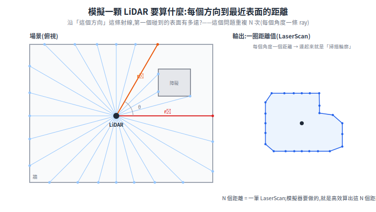
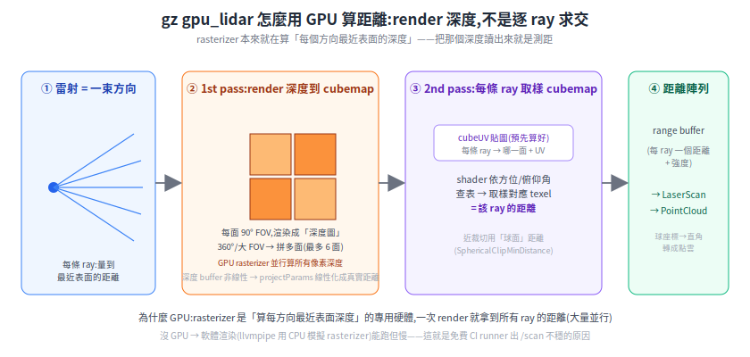
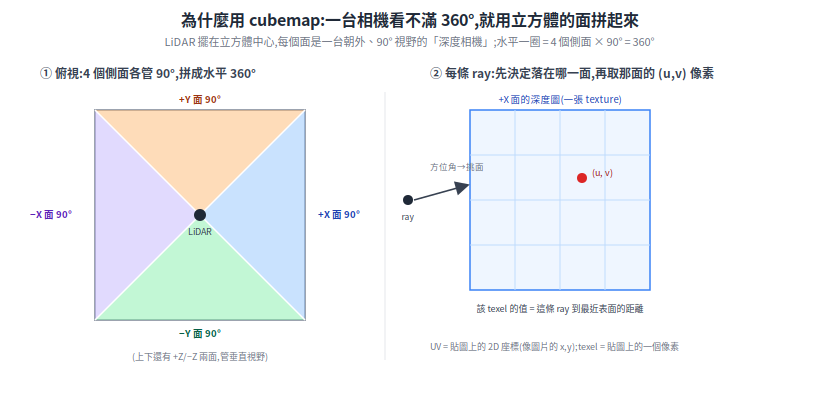
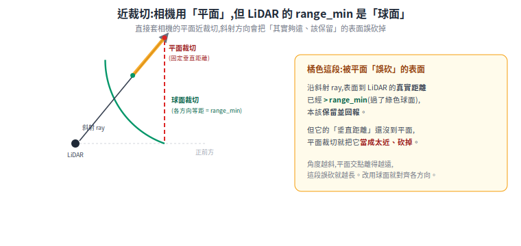
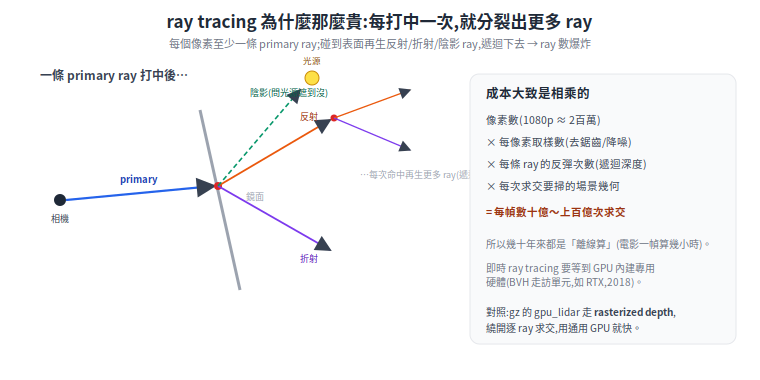

# gpu_lidar 怎麼運作:用 GPU render 深度,不是逐 ray 求交(讀原始碼)

模擬裡的 LiDAR(Gazebo 的 `gpu_lidar`)為什麼叫「**GPU** lidar」、為什麼要 GPU?直覺會說「LiDAR 打很多 ray,所以是 ray tracing」——但讀完 gz 的原始碼會發現:**它其實是叫 GPU 把場景的「深度」render 出來,再讀那張深度圖當距離**,跟典型的 ray tracing 不一樣。這篇從第一性原理講起,並對照真正的實作程式碼。

> 前置:[LiDAR 完整解析](../10-hardware/lidar-landscape.md)(真實 LiDAR 怎麼測距)、[在 Gazebo 倉庫用 slam_toolbox 建圖](gazebo-slam-warehouse.md)(gpu_lidar 在 SLAM 的角色)。
> 讀的原始碼(Gazebo Harmonic 對應分支):[`gz-sensors/src/GpuLidarSensor.cc`](https://github.com/gazebosim/gz-sensors/blob/gz-sensors8/src/GpuLidarSensor.cc)、[`gz-rendering/ogre2/src/Ogre2GpuRays.cc`](https://github.com/gazebosim/gz-rendering/blob/gz-rendering8/ogre2/src/Ogre2GpuRays.cc)。

---

## 1. 第一性原理:模擬一顆 LiDAR 要算什麼

真實 2D LiDAR 的物理:從一個點,往 N 個方向(例如 360 條,每隔 1°)各射一束光,量「打到最近表面、反射回來」的距離。輸出就是 N 個距離值(`LaserScan`)。

所以模擬器要回答的問題只有一個,重複 N 次:

> **沿著「這個方向」這條射線,第一個碰到的場景表面有多遠?**

<p align="center"></p>

## 2. 兩種算法:逐 ray 求交 vs render 深度

**做法 A — CPU 逐 ray 求幾何交點(直覺、慢)**:對每一條 ray,跟場景裡每個三角形算「射線–三角形交點」,取最近的。複雜度 ~ O(ray 數 × 三角形數)。一顆 360 線的 LiDAR、場景幾十萬個三角形,每幀就是上億次運算。雖然有 BVH 之類加速結構(BVH:把幾何體包成一層層的包圍盒、組成樹狀結構,讓「找最近交點」不必跟全部三角形比對,§5 細說),但仍是「逐 ray」的活。

**做法 B — 用 GPU render 場景的「深度」(gz 走這條)**:這裡有個關鍵觀察——

> **GPU 的 rasterizer(光柵器)本來就在做「對每個螢幕像素,算出最近的表面、以及它的深度」**(那叫 depth buffer / Z-buffer,是畫 3D 畫面時用來決定誰遮住誰的東西)。

也就是說:把相機擺在 LiDAR 的位置、朝場景 render 一次,GPU 順手產生的**深度緩衝**,每個像素值就是「那個方向到最近表面的距離」——這正是 LiDAR 要的東西!不必逐 ray 自己算交點,**讓畫圖的硬體免費附贈**。

<p align="center"></p>

## 3. 為什麼是 GPU

- **rasterizer 是專用硬體、海量並行**:它一次處理整張影像的所有像素(深度測試是內建功能),這正好是「一次拿到所有 ray 的距離」。CPU 逐 ray 求交是序列的活,差好幾個數量級。
- **深度測試是「免費」的副產品**:GPU 畫任何 3D 場景都要算 Z-buffer 決定遮擋;gpu_lidar 只是把這個本來就會算的東西讀出來用。

代價:它需要一個能 render 的 GPU(或軟體模擬的 rasterizer)。這也是它叫 `gpu_lidar`、以及[沒 GPU 就跑不順](#6-回扣為什麼沒-gpu--ci-軟體渲染就慢)的根本原因。

## 4. gz 實際怎麼做(讀碼)

### 4.1 感測器層:`GpuLidarSensor` 包一個會 render 的 `GpuRays`

`GpuLidarSensor.cc` 的 `CreateLidar()` 建立一個 `GpuRays`(gz-rendering 的物件),並做一件很關鍵、很能說明「這是 render」的事:

```cpp
this->dataPtr->gpuRays->SetNearClipPlane(this->RangeMin());
this->dataPtr->gpuRays->SetFarClipPlane(this->RangeMax());
```

**把 LiDAR 的最小/最大量程,設成相機的近/遠裁切面**——因為它真的是用一台相機在 render。`Update()` 每幀呼叫 `this->Render()`(GPU render),把結果(每方向的深度)拿來發布。

### 4.2 1st pass:把場景深度 render 成 **cubemap**

`Ogre2GpuRays.cc` 裡,真正幹活的是把場景深度 render 出來。但有個幾何問題:**一台透視相機的 FOV 有限,涵蓋不了 360°**(甚至超過 90° 就開始嚴重變形)。gz 的解法是 **cubemap**——把場景深度 render 到一個立方體的多個面上,程式註解寫得很白:

> *"Each cubemap texture covers 90 deg FOV"*(每面涵蓋 90° 視野)

所以 360° 水平掃描 → 用立方體的側面拼起來(最多 6 面,`cubeFaceIdx` 只算 LiDAR FOV 需要的那幾面)。每面是一次深度 render(`firstPassTextures`,一面一張)。1st pass 的解析度會依取樣數動態決定(程式裡 clamp 在 128~1024)。

<p align="center"></p>

> **深度要「線性化」**:GPU 的 depth buffer 不是線性的距離(近處精度高、遠處被壓縮),所以 1st pass 的 shader 用相機投影參數把它**還原成真實距離**。程式註解:*"The projectParams is used to linearize depth buffer data"*。

### 4.3 2nd pass:每條 ray 去 cubemap 取樣

有了「立方體六面的深度圖」,還要把它變回「LiDAR 的 N 條 ray、每條一個距離」。這是 2nd pass:

- 預先算好一張 **`cubeUVTexture`**(註解:*"Texture packed with cubemap face and uv data"*)——對每一條輸出 ray(某個方位角 azimuth + 俯仰角 inclination),記好「該去**哪一面**、取樣那面的**哪個 UV**」(UV = 貼圖上的 2D 座標,像圖片的 x/y;一個 UV 位置對到貼圖上的一個像素,叫 texel)。
- 2nd pass 是一個全螢幕 quad shader:對每條 ray,照 `cubeUVTexture` 的指示去對應的 cube face 取樣,讀出那個方向的(線性化)深度 = **該 ray 的距離**。

輸出是一張 range buffer:每條 ray 一個距離(外加強度/laser retro)。

### 4.4 近裁切要用「球面」

一個容易忽略的細節(實作 corner case,不影響理解主線,可跳過):相機的近裁切面是**平面**,但 LiDAR 的 `range_min` 是**球面半徑**(各方向等距)。直接用平面近裁切,斜射的 ray 會被錯誤裁掉。gz 為此寫了一個自訂 shader `Ogre2GzHlmsSphericalClipMinDistance`,把近裁切改成球面距離。這種小地方正是「模擬要對得起物理」的功夫。

<p align="center"></p>

### 4.5 深度 → 距離 → 點雲

回到 `GpuLidarSensor.cc`:拿到每條 ray 的深度後,`FillPointCloudMsg()` 用**球座標轉直角座標**把它變成 3D 點:

```cpp
x = depth * cos(inclination) * cos(azimuth);
y = depth * cos(inclination) * sin(azimuth);
z = depth * sin(inclination);
```

`LaserScan`(2D)直接用距離陣列;`PointCloud`(3D)用上面的轉換。這就是 `/scan`、`/points` 的由來。

## 5. ray tracing 是什麼,為什麼那麼吃運算

前面一直說 gz「不是用 ray tracing」,那 ray tracing 到底是什麼、為什麼大家提到它都說「很貴」?

**它的核心想法很老、也很直白**:從相機(眼睛)出發,**對每個像素射一條 ray 進場景,找它第一個打中的表面**。這叫 **ray casting**,Arthur Appel 在 **1968** 年就提出([Appel, 1968](https://dl.acm.org/doi/10.1145/1468075.1468082))。十二年後,Turner Whitted 在 **1980** 年把它變成**遞迴**的:ray 打中表面後,**再生出新的 ray**——往鏡射方向的「反射 ray」、穿過透明材質的「折射 ray」、朝光源問「我被擋住了沒」的「陰影 ray」;這些新 ray 又可能再打中表面、再分裂下去。這就是現代「Whitted-style ray tracing」([Whitted, 1980](https://dl.acm.org/doi/10.1145/358876.358882))。所以它其實是 **1960~80 年代**的算法,不是 90 年代才出現。

<p align="center"></p>

**為什麼這麼吃運算**:成本大致是**相乘**的——

> 像素數(1080p 約 2 百萬) × 每像素取樣數(去鋸齒、降噪要好幾條) × 每條 ray 的反彈次數(遞迴深度) × 每次「射線–幾何求交」要掃的場景複雜度。

乘下來每幀就是**數十億到上百億次求交**。所以幾十年來 ray tracing 都是「**離線算**」的(電影一幀算好幾小時、靠農場機房);**即時**ray tracing 一直做不到,直到 GPU 內建了**專用硬體**(在晶片上做 BVH 走訪與射線求交,例如 NVIDIA 的 RTX,**2018**)才在遊戲/模擬裡跑得動。物理上它最迷人:反射、折射、軟陰影、多次反彈的光,都自然算出來——代價就是這個運算量。

### ray tracing 的數學:一條 ray 怎麼求交、複雜度怎麼來

一條 ray 用參數式寫成 `P(t) = O + t·D`(`O` 是起點、`D` 是單位方向向量、`t ≥ 0` 是沿射線走的距離)。「找這條 ray 第一個打中什麼」= 對場景裡每個幾何體,解出它跟 ray 相交的 `t`,取**最小的正根**。幾個基本幾何體都有封閉解:

- **球面**(中心 `C`、半徑 `r`):把 `P(t)` 代進 `|P − C|² = r²`,展開成一元二次方程,解 `t`(`D` 是單位向量,故 `D·D = 1`):

$$ t^2 + 2\,D\cdot(O-C)\,t + \big(|O-C|^2 - r^2\big) = 0 $$

  判別式 `< 0` 就是沒打中;有實根時取**最小的正根**(較近的交點)——負根代表交點在起點後方:起點在球內則兩根一負一正、取那個正根;兩根皆負則整顆球在起點後方,一樣視為沒打中。

- **平面**(平面上一點 `Q`、法向量 `n`):`t = (Q − O)·n / (D·n)`;`D·n = 0` 代表 ray 平行於平面、不相交。
- **三角形**(網格的基本單位):用 Möller–Trumbore 演算法,一次解出 `t` 和重心座標,順便判斷交點是否落在三角形內([Möller & Trumbore, 1997](https://doi.org/10.1080/10867651.1997.10487468))。

把場景所有幾何體的 `t` 算出來、取最小正根,就得到「這條 ray 的最近表面」。複雜度就從這裡長出來:設畫面 `P` 個像素、每像素發 `S` 條取樣 ray、每條 ray 遞迴 `B` 層、場景有 `N` 個幾何體——

$$ \text{樸素法} \approx O(P \cdot S \cdot B \cdot N) \qquad\Longrightarrow\qquad \text{加速結構(BVH/kd-tree)} \approx O(P \cdot S \cdot B \cdot \log N) $$

BVH(bounding volume hierarchy,包圍盒階層)把「跟全部 `N` 個幾何體比對」變成「在樹上走約 `log N` 層」(這是分布均勻時的平均情形,退化情況仍可能接近 `O(N)`),這是讓 ray tracing 能加速的關鍵資料結構,也是 RTX 在硬體裡專門做的事。代個數字感受一下:1080p(`P ≈ 2×10⁶`)、每像素 64 取樣、反彈 8 層、就算有 BVH(`log N ≈ 20`),一幀也要約 `2×10⁶ × 64 × 8 × 20 ≈ 2×10¹⁰` 次求交——**兩百億**。這就是「為什麼即時做不到、得上專用硬體」的具體數字。

補一個進階注腳(看不懂可以跳過,只要記得一句:**最寫實的做法,是「每找到一個表面點,還要對它頭頂整個半球的入射光再積一次分」,這就是運算量爆炸的根源**)。要算得物理正確,完整描述是 **rendering equation**(Kajiya, 1986):一個表面點往某方向射出的光,等於它自己發的光,加上對整個半球所有入射方向的反射積分:

$$ L_o(x,\omega_o) = L_e(x,\omega_o) + \int_{\Omega} f_r(x,\omega_i,\omega_o)\, L_i(x,\omega_i)\, (\omega_i \cdot n)\, d\omega_i $$

逐項白話:`L_o` = 從點 `x` 往 `ω_o` 方向**射出**的光;`L_e` = 這個點**自己發**的光(光源才有);積分號 `∫_Ω` = **對頭頂整個半球所有入射方向加總**;`f_r` = 材質的反射特性(這個入射角的光,有多少比例反射到出射方向);`L_i` = 從 `ω_i` 方向**射進來**的光;`(ω_i · n)` = 入射角的餘弦(光越斜貢獻越少,背面入射算 0)。

這個積分沒有解析解,只能用 **Monte Carlo**(蒙地卡羅:用大量隨機取樣去逼近一個算不出來的積分,取樣越多越準、越少畫面越雜訊)去逼近——這種「每個交點都對半球取樣積分」的做法叫 **path tracing**,前面複雜度公式裡的 `S`(每像素取樣數)在這裡就是在逼近這個積分。(注:§5 開頭講的 Whitted-style 比較陽春,只追固定幾條反射/折射/陰影 ray,它的 `S` 主要是用來**抗鋸齒、軟化陰影**;要完整逼近上面的半球積分,是後來 path tracing 才做到的。)**運算量的根源,就是這個「對每個交點再積分一次」的遞迴**([Kajiya, 1986](https://dl.acm.org/doi/10.1145/15922.15902))。

### 那 `gpu_lidar` 跟 ray tracing 是什麼關係

- **概念上**:LiDAR「每個方向一條 ray、量到最近表面」就是 ray casting 的語意,所以直覺把它跟 ray tracing 連在一起不算錯。
- **gz 的實作不是**:gz 沒有對每條 ray 去做「射線–幾何求交」(那就是上面那筆貴帳),而是用 **rasterization 把場景深度畫出來 + cubemap + 深度取樣**(§2~§4)。它繞開了逐 ray 求交,用通用 GPU 就快——代價是少了反射/折射這些光路效果(對一般 LiDAR 測距夠用)。
- **真的用 ray tracing 的模擬也有**:像 NVIDIA Isaac Sim 的 **RTX Lidar** 就是用 RTX 硬體 ray tracing 算 LiDAR,能模擬玻璃/鏡面反射、材質反射率這些 `gpu_lidar` 做不到的效果——但要 RTX 等級的 GPU。**這正是「rasterized depth(快、通用)」與「hardware ray tracing(準、要專用硬體)」的取捨**。

> 所以「`gpu_lidar` = ray tracing」是個方便但不精確的說法;精確講是「**用 GPU rasterizer render 深度來模擬 ray 測距**」。要真 ray tracing 的物理保真度,得上 RTX 那條路。

## 6. 回扣:為什麼沒 GPU / CI 軟體渲染就慢

既然 `gpu_lidar` 的距離是「render 出來的」,它就**需要一個 render 後端(ogre2)能用的 GPU**。沒有實體 GPU 時,Mesa 用 **llvmpipe** 在 CPU 上「軟體模擬」整個 rasterizer——能跑,但把「本來硬體並行的深度 render」變成 CPU 算,於是又慢又吃 CPU。這正是我們在 [GitHub Actions × gz sim playbook](../_meta/github-actions-gz-sim-playbook.md) 看到的:**免費 runner 上 `gpu_lidar` 出 `/scan` 不穩**,因為它骨子裡是 render。

也因此,把 LiDAR 換成「不需 render 的 CPU ray-cast 感測器」一直是無 GPU CI 的願望——但 gz 新版主力就是 `gpu_lidar`(rendering-based),這條限制短期改不掉。

---

## 來源(實際讀過的檔)

- `gz-sensors` `GpuLidarSensor.cc`(感測器層、近/遠裁切=量程、深度→點雲):https://github.com/gazebosim/gz-sensors/blob/gz-sensors8/src/GpuLidarSensor.cc
- `gz-rendering` `Ogre2GpuRays.cc`(cubemap 1st pass 深度、2nd pass 取樣、線性化、球面近裁切):https://github.com/gazebosim/gz-rendering/blob/gz-rendering8/ogre2/src/Ogre2GpuRays.cc
- `gz-rendering` `BaseGpuRays.hh`(GpuRays 介面:角度/ray 數/clip 設定):https://github.com/gazebosim/gz-rendering/blob/gz-rendering8/include/gz/rendering/base/BaseGpuRays.hh
- 概念對照:GPU depth/Z-buffer 與 rasterization(維基):https://en.wikipedia.org/wiki/Z-buffering
- ray tracing 歷史:Appel 1968「Some techniques for shading machine renderings of solids」https://dl.acm.org/doi/10.1145/1468075.1468082 ；Whitted 1980「An Improved Illumination Model for Shaded Display」https://dl.acm.org/doi/10.1145/358876.358882 ；綜述 https://en.wikipedia.org/wiki/Ray_tracing_(graphics)
- ray tracing 數學:Möller & Trumbore 1997「Fast, Minimum Storage Ray-Triangle Intersection」https://doi.org/10.1080/10867651.1997.10487468 ；Kajiya 1986「The Rendering Equation」https://dl.acm.org/doi/10.1145/15922.15902 ；BVH https://en.wikipedia.org/wiki/Bounding_volume_hierarchy
- 硬體 ray tracing:NVIDIA RTX(2018)https://www.nvidia.com/en-us/geforce/news/geforce-rtx-real-time-ray-tracing/ ；Isaac Sim RTX Lidar https://docs.isaacsim.omniverse.nvidia.com/latest/sensors/isaacsim_sensors_rtx_based_lidar.html
