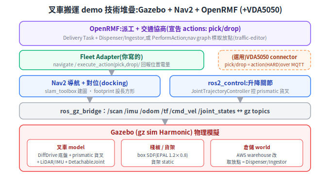
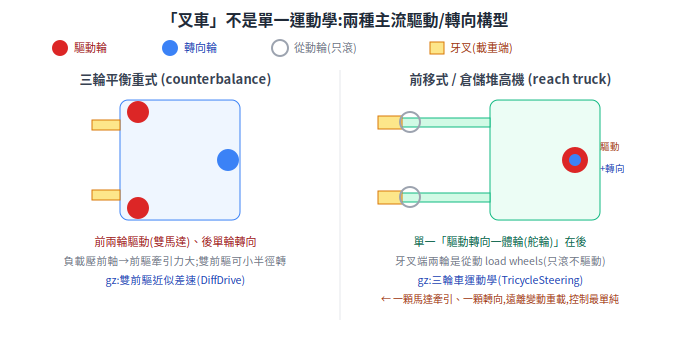
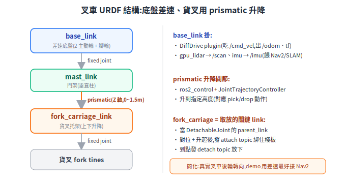
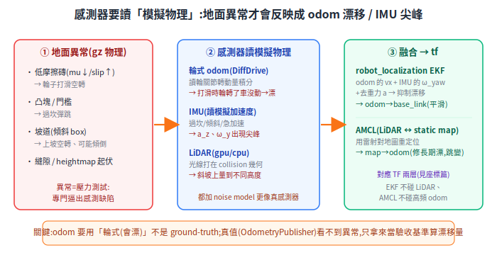
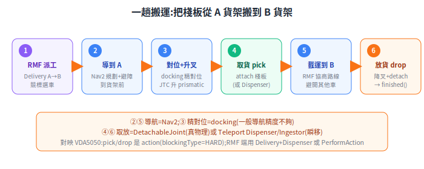

# 專案探討:在 Gazebo 做叉車搬運(OpenRMF + VDA5050)

把這份筆記學到的東西全部串起來,做一個能跑的小專案:**在 Gazebo 裡一台叉車,聽 OpenRMF 的調度,把棧板從 A 貨架搬到 B 貨架**,並讓「叉起/放下」對映到 VDA5050 的動作。與其直接貼一份 launch 檔,這篇從頭拆解:要達成「叉車 Physical AI 模擬」,**worklist 有哪些、模型怎麼準備、物理參數怎麼設**。

> 本篇是整合性探討,前置散在各章:[Physical AI 總覽](physical-ai-overview.md)、[Gazebo+ROS2 模擬](simulation-gazebo-ros2.md)、[OpenRMF](../40-fleet/open-rmf.md)、[VDA5050](../40-fleet/vda5050.md)、[座標轉換/TF](../30-navigation/kinematics-and-coordinate-transforms.md)、[路徑規劃](../30-navigation/path-planning.md)。
> 版本基準:**gz sim Harmonic + ROS 2 Jazzy + gz_ros2_control(Jazzy)**;以官方當前為準。

---

## 1. 目標與範圍:先把「做到什麼算成功」釘死

動手寫 code 前,第一件事是**定義可驗證的成功條件**。本專案的最小可驗收目標(MVP):

> 在 Gazebo 倉儲場景裡,一台叉車收到 RMF 下的「把 A 點棧板搬到 B 點」任務後,**自主導航到 A → 對位 → 升叉取貨 → 載運到 B → 放貨 → 回報完成**,全程不撞貨架、可重複執行。

範圍取捨(先做什麼、先不做什麼):
- **要**:單台叉車、單一棧板、固定 A/B 點、RMF 派工 + Nav2 導航 + 升降取放。
- **暫不做**:多台叉車交通協商(RMF 的強項,但留到 MVP 通了再加)、真實叉車後輪轉向運動學、載重對重心的精細物理、生產級 VDA5050 雙向。
- **VDA5050 的定位**:MVP 階段可先讓 RMF fleet adapter 直接驅動叉車(省一層);要展示「標準介面」時再把 pick/drop 對映成 VDA5050 action 接上(見 §10)。

## 2. 整體架構:每層各司其職

<p align="center"></p>

由下而上:**Gazebo(物理 + 模型)→ ros_gz_bridge(gz↔ROS2)→ ros2_control(升降)+ Nav2(導航/對位)→ OpenRMF(派工/協商)→(選用)VDA5050 connector**。每層的「為什麼」在後面各節展開。

## 3. 三個關鍵設計決策(會卡很久的岔路)

做這個 demo,最該先想清楚的是三個「走哪條路」的決策——選錯會在實作中卡很久:

| 決策 | 選項 A(簡單,先選) | 選項 B(真實,後換) | 為什麼這樣選 |
|---|---|---|---|
| **底盤驅動** | 差速 DiffDrive(模擬簡化) | 依真實車型(見下) | Nav2 對差速支援最成熟;但 diff-drive **不等於真叉車運動學**,要清楚這是簡化 |
| **取放怎麼做** | Teleport Dispenser/Ingestor(瞬移) | DetachableJoint(真實叉起) | 要展示「調度流程」用瞬移最省力(RMF demo 就這樣);要展示「真實貨叉物理」才上 DetachableJoint |
| **VDA5050** | 先不接,RMF 直接驅動 | 接 connector,pick/drop=action | 標準介面是價值但不是 MVP 必需;先把流程跑通,再加標準層 |

> 這張表本身就是專案的「風險前置」:三個都先選 A,最快看到端到端跑通;每個再獨立升級成 B,風險被切開、不會一次全擔。

### 3.1 先搞清楚:真實叉車的驅動/轉向不是差速

「叉車」不是單一運動學,主流分兩種構型(查證自 Toyota/Raymond/Hyster 等原廠):

<p align="center"></p>

- **三輪平衡重式 (counterbalance)**:**前兩輪(同軸、左右各一馬達)獨立驅動**(負載壓前軸→前輪牽引力大、雙前驅靠轉速差可小半徑轉),後單輪轉向。注意:多數機型後輪是**主動轉向**(駕駛打方向盤),不是被動腳輪。
- **前移式 / 倉儲堆高機 (reach truck / stacker)**:**單一「驅動轉向一體輪(舵輪)」在後**(遠離牙叉端),負責牽引 + 轉向;**牙叉端的兩輪是從動載重輪 (load wheels),只滾不驅動**(常裝在外伸腳 straddle legs 末端)。道理是:load wheels 在貨叉下、要小且能伸進貨架、承受變動重載,做成驅動+轉向太複雜;把驅動+轉向集中到遠離負載的單一後輪,一顆馬達牽引、一顆轉向,控制最單純。

**對模擬的意義(務必誠實)**:
- reach truck 的「單一驅動轉向輪 + 從動輪」運動學是**三輪車 (tricycle)**,對應 gz 的 **`gz::sim::systems::TricycleSteering`**,**不是** `DiffDrive`。
- 三輪平衡重式的「雙前驅 + 後主動轉向」也**不是純差速**;用 `gz::sim::systems::DiffDrive`(`DiffDrive`)模擬時,等於**把後主動轉向輪簡化成被動腳輪**——這是為了最快接通 Nav2 的近似,代價是原地旋轉能力、轉彎軌跡與真車不同。
- 要擬真就換 `TricycleSteering`,Nav2 端改用支援非完整約束的 planner/controller(Hybrid-A* + 對應 controller)。(`AckermannSteering` 是汽車式「兩前輪幾何連動轉向」,叉車一般用不到,列出僅為對照。)

## 4. 模型怎麼準備

### 4.1 叉車 URDF/SDF 結構

<p align="center"></p>

關鍵是「升降 = `prismatic`(滑動)關節」:`base_link --fixed--> mast_link --prismatic(Z 軸)--> fork_carriage_link --fixed--> 貨叉`。底盤掛 DiffDrive plugin（出 `/odom`、tf）、gpu_lidar（`/scan`）、imu；升降關節用 ros2_control 的 `JointTrajectoryController` 控位置。**`fork_carriage_link` 是取放的關鍵 link**——當 DetachableJoint 的 `parent_link`。

### 4.2 棧板、貨架、倉儲場景

- **棧板 pallet**:一個 box model,尺寸取 EPAL 標準 1.2 × 0.8 m;要有 `visual + collision + inertial` 三件(少了 inertial 物理會出錯)。
- **貨架 rack**:設 `<static>true</static>` 的固定多層 box(取放點設在某層高度);static 物件不參與動力學、省算力也不會被撞飛。
- **倉儲 world**:可直接拿 `aws-robotics/aws-robomaker-small-warehouse-world` 改,省去手刻;取放點放 Teleport Dispenser/Ingestor 或標成 nav graph 的 waypoint。
- **現成素材**:gz Fuel 模型庫可搜 pallet/forklift/warehouse 直接 `<include>`;gz-sim repo 的 `detachable_joint.sdf` 範例正是「車載物件再分離」的範本。

## 5. 物理參數怎麼設(模擬穩不穩,八成看這裡)

這是新手最容易忽略、卻最常讓模擬「爆炸 / 抖動 / 打滑」的地方。道理很直接:**模擬器是在解牛頓方程,參數不合理,數值積分就會發散**。逐項看:

### 5.1 質量與慣性張量(最關鍵)

- **每個會動的 link 都要有合理的 `mass` 與 `inertia`(慣性張量)**。最常見的爆炸原因就是 inertia 亂填(留 0 或 1e-9)。
- box(長寬高 a×b×c、質量 m)的慣性張量有公式,務必用它算,別亂填:

```
Ixx = m(b² + c²)/12     Iyy = m(a² + c²)/12     Izz = m(a² + b²)/12
（Ixy = Iyz = Ixz = 0,對齊主軸時)
```

- **慣性要和質量、尺寸一致**:一個 20kg、1.2m 的棧板,inertia 數量級應在 ~1（kg·m²),不是 0.001 也不是 1000。不一致 → 接觸時抖動或彈飛。
- **質量比不要太懸殊**:叉車幾百 kg、棧板幾十 kg 還行;但棧板設 0.01kg 配叉車 500kg,接觸求解器會不穩。MVP 階段**棧板設輕一點(5–20kg)** 較穩。

### 5.2 摩擦係數(決定會不會打滑)

- **輪子與地面的摩擦 μ 要夠高**(乾地 0.8–1.0)。太低 → 差速車原地打滑、odom 狂漂、Nav2 定位跟著爛(呼應 [感測器 §3.3](../10-hardware/sensors.md) 的打滑問題)。
- 棧板與貨叉之間:用 DetachableJoint 剛性連接時不靠摩擦;若想靠摩擦夾持(較難穩)才需要調高接觸摩擦。
- 貨叉/地面接觸的 `<surface>` 可設 `mu`、`mu2`(兩個方向的摩擦)。

### 5.3 關節限制與致動力

- **prismatic 升降關節**:`<limit>` 要設 `lower/upper`(行程,如 0~1.5m)、`effort`(最大力,**要 ≥ (fork carriage 質量 + 載重質量)×g + 餘裕**——這個關節只升降貨叉托架與其上的貨,不是整台車,別把車體質量算進去)、`velocity`(升降速度上限)。
- effort 設太小 → 升不起棧板;設無限大 → 升降瞬間衝擊、物理不穩。給一個物理合理值。

### 5.4 物理引擎步長與求解器

- **`max_step_size`(模擬步長)**:常見 1ms(0.001s)。步長越大越快但越不穩;接觸/取放這種需要穩定的場景,步長別開太大。
- **`real_time_factor` / 求解器迭代數**:headless 訓練可拉高 RTF 加速;接觸不穩時增加 solver iterations。
- 這幾個是「速度 vs 穩定」的取捨旋鈕,接觸抖動先從「縮小步長、增加迭代」下手。

### 5.5 DetachableJoint 的物理前提(取放專屬)

- 運動拓樸必須**樹狀(不可成環)**。
- **初始狀態父/子 model 不可有碰撞**,否則 joint 建不起來——所以「對位後才升叉、升到位才 attach」的時機要控好。
- 分離後父子若會互撞,父 model 要設 `<self_collide>true</self_collide>`。
- **接觸中不支援 reattach**——attach/detach 的時機要避開正在碰撞的瞬間。

## 6. 地面異常:給模擬加「壓力測試」

平地上一切正常的系統,不代表它穩。**地面異常說穿了,就是專門用來逼出感測缺陷的測試夾具**——沒有異常,你永遠不知道 odom 會不會漂、IMU 接不接得到、定位扛不扛得住。在 gz 裡擺幾種異常:

| 異常 | 怎麼建 | 逼出什麼缺陷 |
|---|---|---|
| **低摩擦「濕滑」區** | 一塊地磚 box,`<surface><friction><ode>` 設低 `mu`/`mu2`(如 0.05)、調高 `slip1`/`slip2` | 切向需求 > μ×法向力 → **輪子打滑空轉** → 輪式 odom 多積分 → **位置漂** |
| **凸塊 / 門檻** | 很扁的小 box(如 0.05×1×0.02)貼地擺 | 過坎瞬間 → **IMU 的 a_z、ω_y 出現尖峰** |
| **坡道 ramp** | 傾斜 box(pose 帶 pitch,如 0.15 rad) | 上坡需更多扭矩、輪易空轉(odom 高估);過度傾斜 → **重心超出支撐多邊形 → 翻車** |
| **縫隙 / 起伏地形** | 有限尺寸地板拼接留空(gap);大面積起伏用 **heightmap**(灰階圖→地形,放進 `<collision>` 才影響物理) | 顛簸、卡住、定位抖動 |

實作要點:
- 摩擦/彈跳調在接觸面的 `<surface>`:`<friction><ode><mu>/<mu2>/<slip1>/<slip2>`、`<bounce><restitution_coefficient>`、`<contact><ode><kp>/<kd>`(接觸剛度/阻尼,影響過坎手感)。
- **heightmap 要設 collision 才有物理**(只放 visual 輪子會穿透);gz 官方建議 heightmap world 把碰撞偵測器設成 `bullet`(DART 預設對 heightmap 較差)。
- 現成素材:gz-sim 的 `examples/worlds/heightmap.sdf`、`dem_*.sdf`(DEM 地形)可改。

## 7. 感測器與物理整合:讓異常「反映得出來」

地面異常擺好了,但**如果感測器讀的是「理想真值」,異常就完全看不到**。關鍵在這:**感測器必須讀模擬的物理量**,異常才會反映成 odom 漂移、IMU 尖峰、雷射量測變化——這才有訓練/測試的意義。

<p align="center"></p>

三個關鍵接法:

- **odom 一定要用「輪式」不能用真值**:gz 有兩個 plugin——`DiffDrive`(讀**輪關節轉動量**積分,**會反映打滑/坡度** → 會漂)vs `OdometryPublisher`(直接讀車的**真實世界位姿** → 不漂)。**要看到異常造成 odom 漂移,就必須用 `DiffDrive` 的輪式 odom**;`OdometryPublisher` 的真值只拿來當**驗收基準**(算漂移量 = 輪式 odom − 真值)。
- **IMU / LiDAR 讀物理**:`gz-sim-imu-system` 讀模擬的角速度/加速度(過坎、傾斜出尖峰);`gpu_lidar` 的光線打在 world 的碰撞/視覺幾何上(斜坡會量到不同高度)。兩者都該掛 **noise model**(`<noise type="gaussian">` 設 `stddev`、`bias_*`)讓它更像真感測器,而不是完美量測。
- **融合 = robot_localization EKF + AMCL**:EKF 融合「會漂的輪式 odom(信任其 `vx`)+ IMU(信任其 `ω_yaw`、去重力後的 `a`)」→ 發布平滑的 `odom→base_link`,抑制短期漂移;AMCL 用 LiDAR 對 static map 重定位 → 發布 `map→odom` 修長期漂(離散跳變)。**本設計讓 EKF 只融 odom+IMU、不吃 LiDAR**(EKF 技術上可吃 LiDAR 衍生 pose,這裡是分工選擇),AMCL 獨立發 map→odom——正好對應 [座標篇](../30-navigation/kinematics-and-coordinate-transforms.md) 的 TF 兩層、[感測器 §3.3](../10-hardware/sensors.md)「距離信 encoder、角度信陀螺儀」、[定位 §27](../30-navigation/localization.md)。
- **時間要對齊**:所有 ROS 2 節點 `use_sim_time:=true` 吃 gz 的 `/clock`(單向橋 `rosgraph_msgs/Clock`),否則 tf/感測時間源混用會報錯。

## 8. Worklist:按相依順序排的里程碑

排序原則:**每一步都建立在前一步「已驗證可動」之上,且每步都有可量化、可自動判定的 pass/fail**(呼應 [Renode 篇](../20-firmware/board-simulation-renode.md) 的回饋迴路精神)。先讓「車會動」,再「會感知」,再「會搬」,最後「RMF 指揮」。**這份表就是給其他 agent 的執行規格**:一列一個可獨立交付、可驗收的里程碑。

| 里程碑 | 產出 artifact | 可量化驗收(pass/fail) |
|---|---|---|
| **M0 場景與模型** | 叉車 URDF/xacro + 棧板/貨架 SDF + 平地 world;物理參數設好(§5) | 靜置 10s,base_link world pose 位移 < 1cm 且 z 沉降 < 5mm |
| **M1 底盤遙控** | DiffDrive plugin + `bridge.yaml` + `use_sim_time`;鍵盤 `/cmd_vel` | 遙控直線 5m,**輪式 odom 對真值(OdometryPublisher)漂移 < 5cm** |
| **M2 升降可控** | ros2_control + JTC + `controllers.yaml` | 下指令叉子升到指定高度 ±2cm、停得住 |
| **M3 感測 + 地面異常** | 加 LiDAR/IMU(含 noise)+ 異常 world(§6) | 過低摩擦區後輪式 odom 對真值漂移 **> 平地基線 3 倍**;過坎時 **\|a_z − g\| 尖峰 > 5 m/s²** |
| **M4 感測融合** | robot_localization EKF(§7)`ekf.yaml` | **EKF 輸出對真值的誤差 < 純輪式 odom**(異常區尤其) |
| **M5 自主導航** | slam_toolbox 建圖 + Nav2(footprint 長方形)+ docking | 指定點往返成功;到點誤差 < 0.25m / 0.25rad;能對位到貨架前 |
| **M6 取放** | DetachableJoint(或 Teleport Dispenser/Ingestor)接「對位+升叉」時機 | 載運 5m 後棧板相對 fork_carriage 位移 < 2cm、全程無穿透/碰撞警告 |
| **M7 RMF 派工** | fleet adapter(`actions: pick/drop`)+ nav graph(traffic-editor) | 下「A→B」Delivery 任務 → task state=completed、A 點棧板消失 / B 點出現(§11 流程) |
| **M8(選)VDA5050** | pick/drop 對映 VDA5050 action(HARD)+ connector | 經 VDA5050 order/state 走完同一趟 |
| **M9(選)多車協商** | 加第二台叉車,rmf_traffic 協商 | 兩車不死鎖、會互讓 |

> 為什麼是這個順序?**M0–M2 驗證「物理與致動」,M3–M4 驗證「感知會反映異常、融合能抑制」,M5 驗證「導航」,M6 驗證「操作」,M7+ 才疊「調度」**。每層獨立可驗收,壞了能單獨定位——比「全接起來一起 debug」省十倍時間。M3/M4 刻意排在導航之前:**先確認 odom 會漂、IMU 接得到、EKF 壓得下,再讓 Nav2 站在這之上**,否則導航爛了分不清是規劃問題還是感測問題。

## 9. 給其他 agent 執行的規劃骨架

這份探討要能直接派給其他 agent 執行,需要三樣東西落地(以下為可照抄的慣例):

**package / 檔案結構**:

```
forklift_gz_sim/
├── package.xml / CMakeLists.txt   # ROS2 package(沒有這個 agent 不知道怎麼 build)
├── description/  forklift.urdf.xacro(含 gz plugin、ros2_control、sensor)、forklift.gazebo.xacro
├── worlds/       flat.sdf(基準平地)、terrain_anomaly.sdf(ramp/bump/gap/低摩擦/heightmap)
├── config/       ekf.yaml、bridge.yaml、nav2_params.yaml、controllers.yaml、fleet_config.yaml
├── nav_graph/    warehouse.building.yaml(traffic-editor 產出,標取放 waypoint)
├── launch/       sim.launch.py、localization.launch.py、nav2.launch.py、rmf.launch.py
└── maps/         AMCL static map(.pgm + .yaml)
```

**環境(apt 套件,先 pin 好)**:`ros-jazzy-ros-gz`(bridge/sim)、`ros-jazzy-gz-ros2-control`、`ros-jazzy-nav2-bringup`、`ros-jazzy-slam-toolbox`、`ros-jazzy-robot-localization`、Open-RMF(`ros-jazzy-rmf-dev` 或 source build);gz 版本 Harmonic。

**bridge.yaml 範例 entry**(最容易卡的落地點,先給樣板):

```yaml
- ros_topic_name: "cmd_vel"      # ROS → gz
  gz_topic_name: "/model/forklift/cmd_vel"
  ros_type_name: "geometry_msgs/msg/Twist"
  gz_type_name: "gz.msgs.Twist"
  direction: ROS_TO_GZ
- ros_topic_name: "scan"          # gz → ROS
  gz_topic_name: "/lidar"
  ros_type_name: "sensor_msgs/msg/LaserScan"
  gz_type_name: "gz.msgs.LaserScan"
  direction: GZ_TO_ROS
# 同理:/odom(gz.msgs.Odometry↔nav_msgs/Odometry)、/imu(gz.msgs.IMU↔sensor_msgs/Imu)、
#       /clock(gz.msgs.Clock↔rosgraph_msgs/Clock)、/tf(gz.msgs.Pose_V↔tf2_msgs/TFMessage)
```

**派工給 agent 的紀律**(對齊本專案工作守則):每個 agent 認領一個里程碑(§8 一列),產出該列的 artifact,並**自己用該列的 pass/fail 訊號驗收**;驗收用 `ros2 topic echo` / `ros2 bag record` + 離線比對腳本(例:錄 `/odom` 與真值 pose,算漂移量;抓 `/imu` 的 `a_z` 尖峰;Nav2 到點誤差)。**有界執行**:做不到就誠實標受阻,不要硬湊綠燈。

**headless 跑法(CI / agent 環境)**:`gz sim -s -r --headless-rendering <world>.sdf`(`-s` server-only、`-r` 載入即跑、`--headless-rendering` 走 EGL 供 gpu_lidar)。**gpu_lidar 在無 GPU/EGL 時會直接拿不到資料**(不只是變慢);無 GPU 環境是否能改用 CPU ray-based lidar、Harmonic 的支援度待實測(列入 §12 待查證)。記得設 `GZ_SIM_RESOURCE_PATH` / `GZ_SIM_PLUGIN_PATH`,否則 `<include>` 的模型找不到。

## 10. RMF 整合與 VDA5050 對映

- **取放怎麼讓 RMF 表達**:兩條路——(A) RMF 內建 **Delivery Task + Teleport Dispenser/Ingestor**(在 A 放 Dispenser、B 放 Ingestor,瞬移取放,最省力,RMF demo 就這樣);(B) 自訂 **PerformAction**(fleet adapter 用 `add_performable_action("pick"/"drop", ...)` 宣告、`config.yaml` 的 `actions: [pick, drop]`、`execute_action` callback 內實際驅動升叉 + DetachableJoint,完成呼叫 `execution.finished()`)。
- **nav graph**:用 traffic-editor 畫 waypoint/lane,貨架前的 waypoint 標上 dispenser/ingestor 名稱或 dock 名。
- **VDA5050 對映**:叉車的「叉起/放下」= VDA5050 order 某 node 上的 **action**,`actionType: pick/drop`、`blockingType: HARD`(停車作業)、`actionParameters` 帶 `loadType: EPAL`。RMF 端要接需經 VDA5050 connector(`tum-fml/vda5050_connector`、`inorbit-ai/ros_amr_interop` 等),官方 RMF-as-VDA5050-master adapter 仍非現成(見 [open-rmf §4](../40-fleet/open-rmf.md))。

## 11. 一趟搬運的端到端流程

<p align="center"></p>

## 12. 風險與待查證

- **取放的時機控制**是最容易卡的:DetachableJoint 要求 attach 前父子不碰撞、接觸中不能 reattach——「對位→升叉→attach」的觸發條件要自己用位置/contact 判斷。MVP 想避開可先用 Teleport 瞬移。
- **物理不穩**多源於 inertia 亂填、μ 太低、步長太大(見 §5);先排除這三個。
- **待查證**:① Harmonic `DetachableJoint` 的 attach topic 是否支援 runtime 動態指定任意 child(官方偏向「reattach 同一 child」);② Fuel 上現成 forklift/EPAL/rack 模型清單;③ RMF↔VDA5050 維護中的橋接 repo;④ RMF PerformAction 任務 JSON schema;⑤ Jazzy 的 cmd_vel 是 `Twist` 還是 `TwistStamped`;⑥ 無 GPU 環境 gz Harmonic 是否提供可用的 CPU ray-based lidar(gpu_lidar 需 GPU/EGL)。動手前逐一確認。

## 13. 來源與現成素材

- Gazebo:[DetachableJoint(api/sim/9)](https://gazebosim.org/api/sim/9/detachablejoints.html)、[detachable_joint.sdf 範例](https://github.com/gazebosim/gz-sim/blob/ign-gazebo5/examples/worlds/detachable_joint.sdf)、[Fuel 模型插入](https://gazebosim.org/docs/latest/fuel_insert/)
- 控制/導航:[gz_ros2_control(Jazzy)](https://control.ros.org/jazzy/doc/gz_ros2_control/doc/index.html)、[Nav2 gz 感測器](https://docs.nav2.org/setup_guides/sensors/setup_sensors_gz.html)
- RMF:[PerformAction tutorial](https://osrf.github.io/ros2multirobotbook/integration_fleets_action_tutorial.html)、[rmf_simulation(Teleport plugins)](https://github.com/open-rmf/rmf_simulation)、[rmf_demos](https://github.com/open-rmf/rmf_demos)
- VDA5050:[官方規格](https://github.com/VDA5050/VDA5050/blob/main/VDA5050_EN.md)
- 現成倉儲:[aws-robomaker-small-warehouse-world](https://github.com/aws-robotics/aws-robomaker-small-warehouse-world)

## 14. 附錄:起手式片段(骨架,需驗證再用)

以下是最容易做錯、最核心的幾段,給 agent 當起點。**都是骨架——版本/欄位以官方為準,貼上後一定要在 gz 跑過驗證,別當成保證可動的最終答案**(呼應前面說的:先建回饋迴路驗它,不靠貼來的 code 自說自話)。

### 14.1 world 必備 system plugins(沒掛感測器不會動)

```xml
<plugin filename="gz-sim-physics-system"           name="gz::sim::systems::Physics"/>
<plugin filename="gz-sim-scene-broadcaster-system" name="gz::sim::systems::SceneBroadcaster"/>
<plugin filename="gz-sim-user-commands-system"     name="gz::sim::systems::UserCommands"/>
<plugin filename="gz-sim-sensors-system"           name="gz::sim::systems::Sensors">
  <render_engine>ogre2</render_engine>   <!-- gpu_lidar/camera 要 -->
</plugin>
<plugin filename="gz-sim-imu-system"     name="gz::sim::systems::Imu"/>
<plugin filename="gz-sim-contact-system" name="gz::sim::systems::Contact"/>
```

### 14.2 地面異常 world 片段(低摩擦磚 + 坡 + 凸塊)

```xml
<!-- 低摩擦「濕滑」磚:輪子打滑 → 輪式 odom 漂 -->
<model name="slippery_tile"><static>true</static><link name="l">
  <collision name="c"><geometry><box><size>2 2 0.01</size></box></geometry>
    <surface><friction><ode>
      <mu>0.05</mu><mu2>0.05</mu2><slip1>0.5</slip1><slip2>0.5</slip2>
    </ode></friction></surface></collision>
  <visual name="v"><geometry><box><size>2 2 0.01</size></box></geometry></visual>
</link><pose>4 0 0.005 0 0 0</pose></model>

<!-- 坡道:傾斜 box(pitch 0.15 rad);凸塊:扁 box -->
<model name="ramp"><static>true</static><link name="l">
  <collision name="c"><geometry><box><size>2 1.5 0.1</size></box></geometry></collision>
  <visual name="v"><geometry><box><size>2 1.5 0.1</size></box></geometry></visual>
</link><pose>8 0 0.2 0 0.15 0</pose></model>

<model name="bump"><static>true</static><link name="l">
  <collision name="c"><geometry><box><size>0.05 1.5 0.03</size></box></geometry></collision>
  <visual name="v"><geometry><box><size>0.05 1.5 0.03</size></box></geometry></visual>
</link><pose>2 0 0.015 0 0 0</pose></model>
```

**上面這些 tag 在 Gazebo 裡做什麼**(給看不懂 XML 的對照):

先看三塊異常**共通的骨架**——每塊都是一個 `<model>`,裡面包一個 `<link>`(實體),link 又分兩種身份(同 [SDF 模型篇](sdf-3d-models.md)):

- `<static>true</static>`:這東西**固定在世界、不會被推動**(地面異常本來就該釘住)。
- `<collision>`:給物理引擎算「撞到沒、摩擦多少」的形狀;`<visual>`:給畫面顯示的形狀。這裡兩者都用 `<box><size>長 寬 高</size>`(單位公尺)。
- `<pose>x y z  roll pitch yaw</pose>`:擺放位置(前三個 = x/y/z 座標)+ 繞三軸的旋轉(後三個,單位**弧度**)。

再看你問的**摩擦表面**那段(只有「濕滑磚」有設,所以它才滑):

| Tag | 作用 |
|---|---|
| `<surface>` | 這個碰撞面的物理表面屬性都掛在這(摩擦、彈跳、接觸剛度) |
| `<friction>` | 摩擦相關設定的容器 |
| `<ode>` | 給 **ODE 物理引擎**的參數(Gazebo Classic 預設引擎;換 bullet/DART 時這層標籤名會不同) |
| `<mu>` | 主方向的庫倫摩擦係數。一般地面約 0.6–1.0;這裡設 **0.05 = 非常滑** |
| `<mu2>` | 次方向(垂直於 mu 那個方向)的摩擦係數,通常設一樣 |
| `<slip1>` / `<slip2>` | 兩個方向的「力相依滑移量」,**值越大,輪子越容易打滑空轉** |

**為什麼這樣設就會逼出 odom 漂移**:把 `mu` 壓到 0.05、`slip` 調高,等於地面幾乎抓不住輪子。車一給扭矩,輪子空轉、車身卻沒前進多少;但輪式 odom 是「照輪子轉了多少」去積分位置的,於是它**以為走了很遠**——這個「輪子轉動量 vs 實際位移」的落差,就是位置漂移的來源(對照 §7 為何 odom 要用 `DiffDrive` 而非真值)。

**坡與凸塊靠 pose / size 做出來**,不需要摩擦設定:

- **坡道**:`<pose>8 0 0.2  0 0.15 0</pose>` 的第 5 個數字 `0.15` 是 **pitch(繞 y 軸傾斜,弧度,約 8.6°)**,把一塊 box 轉成斜面。
- **凸塊**:`<size>0.05 1.5 0.03</size>` 是一塊**很扁(高只有 3 cm)的長條**貼地擺,車輾過去的瞬間,IMU 的垂直加速度與俯仰角速度會跳出尖峰。

**Gazebo(ODE 引擎)怎麼把這些數字算成「車能前進多少」**:每個模擬步,引擎在「輪子↔地面」接觸點解下面幾條,再積分出位移。

1. 法向力 `N`:輪子壓在地上的力(約等於分到這顆輪的車重)。
2. 地面能給的最大牽引力(庫倫摩擦上限):`F_牽引(上限) = μ × N`
3. 抓不抓得住:輪子要前進需要切向牽引力 `F_t`。`F_t ≤ μN` → 抓住地、正常前進;`F_t > μN` → **多出來的傳不出去,牽引力卡在 μN,輪子開始打滑空轉**(次方向同理用 `mu2`)。
4. `slip1` / `slip2`(ODE 的「力相依滑移」):就算還在摩擦上限內,接觸點仍容許一點滑移,滑移速度正比於切向力與 slip 係數——`v_滑移 = slip × F_t`,slip 越大、同樣的力滑得越多。
5. 車身前進:把牽引力減掉阻力,套牛頓第二定律積分成速度與位移——`a = (F_牽引 − F_阻力) / m`,`v = ∫ a·dt`。

把 `μ = 0.05`(很小)配上高 `slip`:`μN` 一下就被超過、`v_滑移` 又大 → 輪子轉得快、車卻幾乎沒前進。但輪式 odom 是拿「輪子轉了多少」回推位移,於是它**以為車走了一大段**——漂移就是這個「輪子轉動 vs 實際位移」的落差。

### 14.3 慣性張量實算範例(棧板 20kg、1.2×0.8×0.15 m)

用 §5.1 公式 `Ixx=m(b²+c²)/12`…(a=x=1.2, b=y=0.8, c=z=0.15):

```
Ixx = 20·(0.8²+0.15²)/12 = 1.104
Iyy = 20·(1.2²+0.15²)/12 = 2.438
Izz = 20·(1.2²+0.8²)/12  = 3.467   (單位 kg·m²)
```
```xml
<inertial><mass>20</mass>
  <inertia><ixx>1.104</ixx><iyy>2.438</iyy><izz>3.467</izz>
           <ixy>0</ixy><ixz>0</ixz><iyz>0</iyz></inertia></inertial>
```
數量級落在 ~1–3,和「20kg、約 1m」一致——這就是「inertia 要和質量尺寸相符」的具體長相。

### 14.4 底盤 DiffDrive + 感測器 + 升降 ros2_control(URDF/SDF 內 `<gazebo>`)

```xml
<!-- 輪式 odom(會漂,反映打滑)— 不是 OdometryPublisher 真值 -->
<plugin filename="gz-sim-diff-drive-system" name="gz::sim::systems::DiffDrive">
  <left_joint>left_wheel_joint</left_joint><right_joint>right_wheel_joint</right_joint>
  <wheel_separation>0.6</wheel_separation><wheel_radius>0.1</wheel_radius>
  <topic>cmd_vel</topic><odom_topic>odom</odom_topic>
  <frame_id>odom</frame_id><child_frame_id>base_link</child_frame_id>
</plugin>
<!-- 真值基準(只拿來算漂移量,不餵 Nav2) -->
<plugin filename="gz-sim-odometry-publisher-system" name="gz::sim::systems::OdometryPublisher">
  <odom_topic>ground_truth/odom</odom_topic><dimensions>2</dimensions>
</plugin>

<!-- LiDAR / IMU 帶 noise(讀物理,不是完美量測)-->
<sensor name="lidar" type="gpu_lidar"><topic>lidar</topic><update_rate>10</update_rate>
  <lidar><scan><horizontal><samples>640</samples>
    <min_angle>-2.356</min_angle><max_angle>2.356</max_angle></horizontal></scan>
    <range><min>0.1</min><max>12.0</max></range>
    <noise type="gaussian"><mean>0</mean><stddev>0.01</stddev></noise></lidar>
</sensor>
<sensor name="imu" type="imu"><topic>imu</topic><update_rate>100</update_rate>
  <imu><angular_velocity><z><noise type="gaussian"><stddev>0.009</stddev>
    <bias_mean>0.0</bias_mean><bias_stddev>0.0003</bias_stddev></noise></z></angular_velocity></imu>
</sensor>

<!-- 升降:ros2_control 接 prismatic -->
<ros2_control name="GazeboSimSystem" type="system">
  <hardware><plugin>gz_ros2_control/GazeboSimSystem</plugin></hardware>
  <joint name="fork_lift_joint">
    <command_interface name="position"><param name="min">0.0</param><param name="max">1.5</param></command_interface>
    <state_interface name="position"/><state_interface name="velocity"/>
  </joint>
</ros2_control>
<gazebo><plugin filename="libgz_ros2_control-system.so"
  name="gz_ros2_control::GazeboSimROS2ControlPlugin">
  <parameters>$(find forklift_gz_sim)/config/controllers.yaml</parameters></plugin></gazebo>
```

### 14.5 ekf.yaml(robot_localization,地面車設定)

```yaml
ekf_filter_node:
  ros__parameters:
    use_sim_time: true
    frequency: 30.0
    two_d_mode: true          # 地面車:強制 z/roll/pitch 歸零
    world_frame: odom
    odom_frame: odom
    base_link_frame: base_link
    odom0: /odom              # 輪式 odom(會漂)
    odom0_config: [false,false,false, false,false,false, true,false,false, false,false,true, false,false,false]  # 信 vx, vyaw
    imu0: /imu
    imu0_config:  [false,false,false, false,false,false, false,false,false, false,false,true, true,false,false]  # 信 vyaw, ax
    imu0_remove_gravitational_acceleration: true
```

15 維順序:`[x,y,z, roll,pitch,yaw, vx,vy,vz, vroll,vpitch,vyaw, ax,ay,az]`——輪式 odom 信線速度 `vx`(打滑會讓位置漂、但短期速度仍可用)、IMU 信 `vyaw` 與去重力後 `ax`(陀螺儀不受打滑影響)。

### 14.6 headless 啟動

```bash
# server-only + 載入即跑 + EGL 離屏渲染(供 gpu_lidar)
gz sim -s -r --headless-rendering worlds/terrain_anomaly.sdf
# 另一終端橋 /clock,所有 ROS 節點 use_sim_time:=true
ros2 run ros_gz_bridge parameter_bridge /clock@rosgraph_msgs/msg/Clock[gz.msgs.Clock
```

### 14.7 M5 Nav2 起手式(footprint 要設成叉車的長方形)

叉車車身長、轉向受限,**footprint 一定要設成實際長方形**(不能用預設圓);否則規劃會以為車很小、貼著貨架算路然後撞上。

```yaml
# nav2_params.yaml(節錄)
planner_server:
  ros__parameters:
    planner_plugins: ["GridBased"]
    GridBased:
      plugin: "nav2_smac_planner/SmacPlanner2D"   # diff-drive 簡化用 2D;真 reach truck 換 SmacPlannerHybrid(含最小轉彎半徑)
controller_server:
  ros__parameters:
    controller_plugins: ["FollowPath"]
    FollowPath:
      plugin: "nav2_mppi_controller::MPPIController"   # 或 nav2_regulated_pure_pursuit_controller(算力有限時)
local_costmap:
  local_costmap:
    ros__parameters:
      footprint: "[[0.9,0.4],[0.9,-0.4],[-0.5,-0.4],[-0.5,0.4]]"  # 叉車外型(含牙叉),原點在 base_link
      plugins: ["obstacle_layer","inflation_layer"]
      obstacle_layer:
        observation_sources: scan
        scan: {topic: /scan, data_type: LaserScan, clearing: true, marking: true}
      inflation_layer: {inflation_radius: 0.55, cost_scaling_factor: 3.0}
```

最後一段「開到貨架前精準停」靠 docking(Nav2 的 `opennav_docking` 或 RMF 的 dock),一般導航精度不足以對位取貨。建圖用 `slam_toolbox`(`online_async`)先繞一圈存 map,正式跑用 AMCL + static map。

### 14.8 M7 RMF 起手式(fleet 設定 + 下任務 + 取放 callback)

```yaml
# fleet_config.yaml(節錄):車隊契約
rmf_fleet:
  name: "forklift_fleet"
  limits: {linear: [0.7, 0.5], angular: [0.6, 0.8]}   # [速度, 加速度]
  profile: {footprint: 0.6, vicinity: 1.0}            # 半徑(m)
  reversible: true
  battery_system: {voltage: 48.0, capacity: 40.0, charging_current: 26.0}
  recharge_threshold: 0.15
  recharge_soc: 1.0
  task_capabilities: {delivery: true}
  actions: ["pick", "drop"]        # 宣告本車隊能做的自訂動作
```

```bash
# 下一個 A→B 的 Delivery 任務(rmf_demos_tasks 風格;取放用 dispenser/ingestor)
ros2 run rmf_demos_tasks dispatch_delivery \
  -p pickup_A  -pd dispenserA \
  -d dropoff_B -dd ingestorB  --use_sim_time
```

```python
# fleet adapter 的取放 callback(Easy Full Control / Python 骨架)
def execute_action(self, category: str, description: dict, execution):
    if category == "pick":
        self.api.dock_to(description["target"])   # Nav2 docking 精對位
        self.api.lift_fork(description["height"])  # JTC 升叉到貨架層高
        self.api.attach_pallet()                   # 發 DetachableJoint attach topic
    elif category == "drop":
        self.api.lower_fork(); self.api.detach_pallet()
    execution.finished()                           # 完成回報給 RMF
```

> 取放兩條路(§10):最省力用 **Delivery Task + Teleport Dispenser/Ingestor**(瞬移,上面 dispatch 指令即走這條);要真物理叉取才用 **PerformAction(pick/drop)+ DetachableJoint**(上面 callback 那條)。nav graph 的貨架前 waypoint 要標上 `dispenserA`/`ingestorB` 名稱,RMF 才知道在哪取放。`dispatch_delivery` 的旗標名以你的 `rmf_demos_tasks` 版本為準(待查證)。
