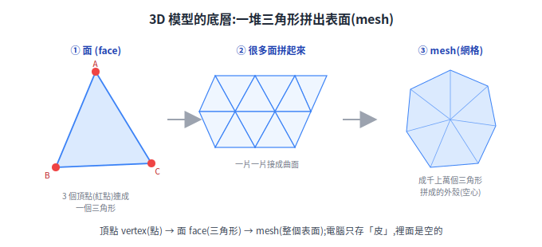
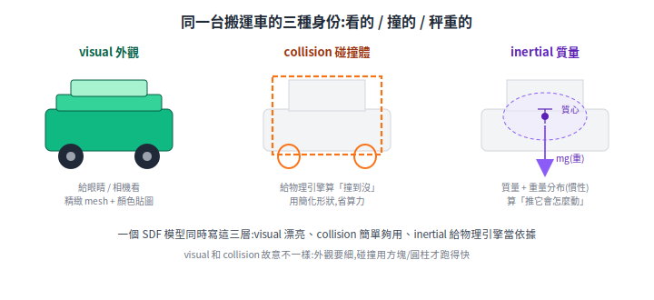

# SDF 3D 模型檔:從零開始,看懂 Gazebo 的模型在描述什麼

要在 Gazebo 裡擺一台機器人、一個倉庫,你會碰到「SDF 模型」「mesh」「visual / collision」這些詞。這篇假設你**完全沒接觸過 3D 模型**,從最底層講起:一個模型檔到底在描述什麼、為什麼這樣分、自己怎麼弄一個出來。

> 延伸:[用 Gazebo + ROS2 模擬 AMR](simulation-gazebo-ros2.md)、[Gazebo 叉車搬運專案](project-forklift-rmf-gazebo.md)。

---

## 1. 3D 模型是什麼:一堆三角形

電腦裡的 3D 物體,說穿了是**一堆三角形拼出來的表面**。

- 空間中的點叫**頂點(vertex)**,每個有 x, y, z 座標。
- 三個頂點連成一個三角形,叫**面(face)**。
- 成千上萬個面拼起來,蒙出物體的外殼,這個外殼叫 **mesh(網格)**。

比喻:像用鐵絲折出骨架再蒙一層皮。電腦**只存這層皮(表面)**,裡面是空心的。

<p align="center"></p>

## 2. 模擬裡,一個物件要有「三種身份」

光有形狀不夠。Gazebo 要讓物體**看得到、撞得到、會照物理動**,所以一個模型要描述三層:

| 身份 | 給誰 | 通常長怎樣 |
|---|---|---|
| **visual** 外觀 | 眼睛 / 相機 | 精緻 mesh + 顏色貼圖 |
| **collision** 碰撞 | 物理引擎算「撞到沒」 | 故意用**簡化形狀**(方塊、圓柱),省算力 |
| **inertial** 質量 | 物理引擎算「推它怎麼動」 | 質量 + 慣性(重量分布) |

關鍵直覺:**visual 跟 collision 常常不一樣**。外觀要細才好看,但讓物理引擎逐個三角形算碰撞太慢,所以碰撞體用一個大方塊或圓柱框住就好。

<p align="center"></p>

## 3. SDF 是什麼

**SDF(Simulation Description Format)就是一個 XML 文字檔,把上面三層用標籤寫下來。** 它是 Gazebo 的原生格式。

(你可能也聽過 **URDF**——那是 ROS 描述機器人的格式,概念幾乎一樣;Gazebo 載入 URDF 時內部會轉成 SDF。先記「SDF = Gazebo 的身家資料表」就好。)

## 4. 一個模型資料夾長怎樣

```
my_table/
├── model.config        # 名片:模型叫什麼、作者、版本
├── model.sdf           # 主檔:visual / collision / inertial 都寫這
└── meshes/
    └── table.dae       # 實際的 3D 形狀檔(mesh)
```

## 5. mesh 檔格式速覽(形狀存成什麼檔)

| 副檔名 | 特點 |
|---|---|
| **.stl** | 只有形狀、沒顏色;3D 列印、簡單碰撞體常用 |
| **.dae**(COLLADA) | 形狀 + 顏色 + 貼圖;Gazebo 最常用的 visual |
| **.obj** | 通用,常見下載格式 |
| **.glb / .gltf** | 現代格式、壓縮好,新版 Gazebo 愛用 |

## 6. 最小範例:一個紅色方塊(不需外部 mesh)

```xml
<?xml version="1.0"?>
<sdf version="1.7">
  <model name="box">
    <link name="link">
      <inertial>                                  <!-- 秤重 -->
        <mass>1.0</mass>
        <inertia><ixx>0.16</ixx><iyy>0.16</iyy><izz>0.16</izz>
                 <ixy>0</ixy><ixz>0</ixz><iyz>0</iyz></inertia>
      </inertial>
      <collision name="col">                       <!-- 撞的:方塊 -->
        <geometry><box><size>1 1 1</size></box></geometry>
      </collision>
      <visual name="vis">                          <!-- 看的:方塊,塗紅 -->
        <geometry><box><size>1 1 1</size></box></geometry>
        <material><ambient>1 0 0 1</ambient></material>
      </visual>
    </link>
  </model>
</sdf>
```

形狀用內建的 `<box>`,不必外部 mesh。內建形狀還有 `<sphere>`、`<cylinder>`、`<plane>`。

## 7. 用外部 mesh + 從哪拿 + 怎麼打包

把 `<box>` 換成指向 mesh 檔:

```xml
<geometry><mesh><uri>model://my_table/meshes/table.dae</uri></mesh></geometry>
```

所以「從網路抓一個模型放進 Gazebo」的流程是:**下載 mesh → 放進 `meshes/` → 寫 model.sdf 包成 visual + 一個簡化 collision + 估一個 inertial → 寫 model.config**。

常用來源:
- **Gazebo Fuel**([app.gazebosim.org](https://app.gazebosim.org/fuel))——別人**已經包好整包 SDF**,Gazebo 裡直接搜尋 insert,最省事。
- **Poly Haven**([polyhaven.com](https://polyhaven.com))——CC0 免費素材(見下節),要自己打包。

## 8. Poly Haven 上三種東西別搞混:HDRIs / Textures / Models

Poly Haven 首頁分三類,新手最容易混。對照前面的概念就清楚了:

| 類別 | 是什麼 | 在場景裡的角色 | 對應本文 |
|---|---|---|---|
| **HDRIs** | 一張 360° 全景環境圖(高動態範圍) | 場景的**打光 + 背景天空**;套上去物體才有真實光照與反射 | world 等級,不是單一物體 |
| **Textures** | 可平鋪的表面材質(木紋、磚牆、金屬、地板),一組常含顏色 / 法線 / 粗糙度多張圖 | 貼到 mesh 表面的**「皮膚花紋」** | §2 的 visual 材質 / 貼圖 |
| **Models** | 真正的 3D 物體(椅子、植物、工具),含 mesh + 已套好的材質 | **直接能放進場景的東西** | §1 的 mesh + §2 三層 |

一句話分辨:**Models 是「物體」、Textures 是「貼在物體表面的花紋」、HDRIs 是「整個場景的光跟天空」**。要擺一台車就找 Models;要讓地板像水泥就找 Textures;要場景光照真實就掛一張 HDRI。

## 9. 實戰:一台最簡單的搬運車 AMR(差速 + LiDAR)

我們不用現成的 TurtleBot3,自己搭一台**差速搬運車**(呼應送餐 / 倉儲 AMR 的底盤)。一台能在 Gazebo 裡跑 SLAM 的搬運車,SDF 至少要這些零件:

| 零件 | 用 | 說明 |
|---|---|---|
| `base_link`(車體) | box | visual + collision + inertial |
| 左 / 右驅動輪 | cylinder + `revolute` joint | 兩輪獨立轉 = 差速 |
| caster(萬向輪) | sphere + 低摩擦 | 撐住車尾,被動 |
| 2D LiDAR | `<sensor type="ray/gpu_lidar">` | 發 `/scan` 給 SLAM |
| 差速外掛 | `diff_drive` plugin | 收 `/cmd_vel`、發 `/odom` 與 TF |

兩個關鍵片段(Gazebo Classic / `gazebo_ros`):

```xml
<!-- 車體頂上的 2D LiDAR,發 /scan -->
<link name="lidar_link">
  <sensor name="lidar" type="ray">
    <ray><scan><horizontal>
      <samples>360</samples><min_angle>-3.14</min_angle><max_angle>3.14</max_angle>
    </horizontal></scan>
      <range><min>0.12</min><max>12.0</max></range>
    </ray>
    <plugin name="laser" filename="libgazebo_ros_ray_sensor.so">
      <ros><remapping>~/out:=scan</remapping></ros>
      <output_type>sensor_msgs/LaserScan</output_type>
    </plugin>
  </sensor>
</link>
```

```xml
<!-- 差速驅動:收 /cmd_vel,發 /odom + TF -->
<plugin name="diff_drive" filename="libgazebo_ros_diff_drive.so">
  <left_joint>left_wheel_joint</left_joint>
  <right_joint>right_wheel_joint</right_joint>
  <wheel_separation>0.40</wheel_separation>   <!-- 輪距 b -->
  <wheel_diameter>0.13</wheel_diameter>
  <odometry_frame>odom</odometry_frame>
  <robot_base_frame>base_link</robot_base_frame>
</plugin>
```

有了 `/scan`(LiDAR)和 `/odom`(差速里程)這兩個輸出,就能餵給 [slam_toolbox](../30-navigation/slam-mapping.md) 建圖。完整 `.sdf`(每個 link 的 inertia、joint、輪子摩擦)會在實際跑 Gazebo 那輪一起補齊並驗證——這台搬運車就是接下來 AWS Small Warehouse SLAM 場景要用的機器人。

> 版本提醒:上面是 **Gazebo Classic(`libgazebo_ros_*`)** 的 plugin 名;新版 **Gazebo(gz sim)** 改用 `gz-sim-diff-drive-system` 等,標籤略不同。實際用哪個,看你機器的 Gazebo 版本(見 simulation 篇)。

---

## 名詞說明

- **mesh(網格)** — 由頂點與三角形面拼成的物體表面;電腦只存表面,內部空心。
- **visual / collision / inertial** — 一個模型的三層:外觀 / 碰撞形狀 / 質量慣性。
- **SDF(Simulation Description Format)** — Gazebo 描述模型與世界的 XML 格式;URDF 是 ROS 端對應格式,載入時轉 SDF。
- **HDRI** — 360° 環境光照圖,給場景打光與背景,非單一物體。
- **Texture(材質貼圖)** — 貼在 mesh 表面的表面花紋(色彩 / 法線 / 粗糙度等)。
- **diff_drive plugin** — 差速底盤外掛,收 `/cmd_vel`、發 `/odom` 與 TF。

## 來源

- SDF 規格:<http://sdformat.org/>
- Gazebo Fuel 模型庫:<https://app.gazebosim.org/fuel>
- Poly Haven(CC0 HDRIs / Textures / Models):<https://polyhaven.com/>
