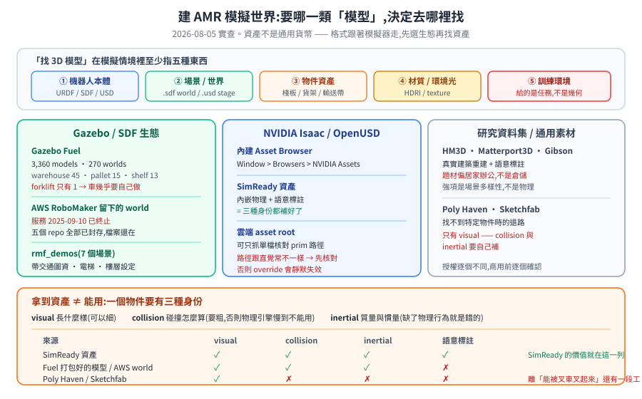

# 建 AMR 模擬世界:模型與場景哪裡來

要在模擬裡跑一台 AMR,得先有一個世界讓它跑。這篇盤點目前拿得到的模型與場景來源、各自適合什麼、以及「下載下來不等於能用」這件事要多付多少工。

> 前置:[SDF 3D 模型檔:從零開始](sdf-3d-models.md)(一個模型的三種身份)、[用 Gazebo + ROS2 模擬 AMR](simulation-gazebo-ros2.md)、[用 Isaac Sim + Isaac Lab 模擬 AMR](isaac-sim-isaac-lab-amr.md)。
> 本篇的數字都是 **2026-08-05 實查**,查證方式列在 §7。

---

<p align="center"></p>

---

## 1. 先分清楚你要找的是哪一種「模型」

「找 3D 模型」這句話在模擬情境裡至少指五種不同的東西,混在一起是新手最大的困惑來源:

| 類別 | 是什麼 | 典型格式 | 例子 |
|---|---|---|---|
| **① 機器人本體** | 帶關節、感測器、驅動的可動模型 | URDF / SDF / USD / MJCF | 差速 AMR、叉車、Nova Carter |
| **② 場景 / 世界** | 整個場域:地面、牆、光源、物理參數 | `.sdf` world / `.usd` stage | 倉庫、醫院、辦公室 |
| **③ 物件資產** | 場景裡的東西 | mesh + 材質,或包好的 SDF/USD | 棧板、貨架、輸送帶、桌椅 |
| **④ 材質與環境光** | 貼圖、HDRI 天空光 | `.hdr` / `.png` / MDL | Poly Haven 的 HDRIs 與 Textures |
| **⑤ 訓練環境** | **任務 + 獎勵 + 重置邏輯**,不只是幾何 | Gymnasium API 的 Python 套件 | Isaac Lab 的 env、Habitat task |

第 ⑤ 類最容易被誤解。Gym / Gymnasium 給的**不是模型**,是一層「怎麼開始、怎麼算分、怎麼重來」的介面契約——幾何仍然來自底下的模擬器與資產。要世界就往 ①–④ 找,要訓練迴圈才看 ⑤。

---

## 2. 決定性的分岔:格式跟著模擬器走

資產不是通用貨幣。挑來源之前,先確定自己站在哪個生態:

| 生態 | 場景格式 | 資產來源重心 |
|---|---|---|
| **Gazebo(gz sim)** | SDF | Gazebo Fuel、ROS 社群 repo、AWS 留下的 world |
| **NVIDIA Isaac Sim** | OpenUSD | Isaac 內建 Asset Browser、SimReady、Omniverse 內容 |
| **Habitat / AI2-THOR 等研究平台** | 各自專用(多為重建的 mesh + 語意標註) | 學術資料集 |
| **通用 3D 素材** | glTF / OBJ / FBX / Blender | Poly Haven、Sketchfab、Objaverse |

跨生態轉換做得到但要付工:`urdf → usd` 有官方轉換器,`SDF → USD` 或反過來就得自己處理慣量、關節、感測器外掛的對應。**先選生態再找資產**,比先囤資產再想辦法塞進去省事得多。

---

## 3. Gazebo / SDF 生態

### 3.1 Gazebo Fuel — 主要的公開模型庫

線上模型與世界資料庫,`gz sim` 可以直接用 Fuel URI `<include>` 進 world,不必先下載。

**2026-08-05 實查**(打 Fuel API):

| 項目 | 數量 |
|---|---|
| models 總數 | **3,360** |
| worlds 總數 | **270** |
| 搜 `warehouse` | 45 |
| 搜 `shelf` | 13 |
| 搜 `pallet` | 15 |
| 搜 `conveyor` | 5 |
| 搜 `forklift` | **1** |

`forklift` 只有一個結果,這是選型時值得先知道的事——**倉儲場景的「場」有得挑,「車」幾乎要自己做**。這也是為什麼叉車那篇是從 URDF 自己刻起。

授權以 Creative Commons 為主,但**逐個模型不同**,API 回傳裡有 `license_name` 欄位,要商用前逐個確認。

> ⚠ 網頁瀏覽介面的路徑目前對不上:`https://app.gazebosim.org/fuel` 回 **404**(根路徑 `https://app.gazebosim.org/` 回 200)。API 端點 `https://fuel.gazebosim.org/1.0/models` 正常。本 repo 其他篇引用的 `/fuel` 深層連結已一併更新。

### 3.2 AWS RoboMaker 留下的世界 — 服務已終止,檔案還在

AWS RoboMaker **已於 2025-09-10 終止支援**,主控台與服務資源都下線了。但當年開源在 GitHub 的 sample world 仍然可以直接 clone 使用。

**2026-08-05 實查 `aws-robotics/` 底下五個 world repo:**

| Repo | ★ | 狀態 |
|---|---:|---|
| `aws-robomaker-small-warehouse-world` | 492 | **已封存(archived)** |
| `aws-robomaker-small-house-world` | 321 | 已封存 |
| `aws-robomaker-hospital-world` | 272 | 已封存 |
| `aws-robomaker-bookstore-world` | 92 | 已封存 |
| `aws-robomaker-racetrack-world` | 56 | 已封存 |

**全部已封存**(最後一次 push 都在 2026-07-21)。意思是:可以拿、可以改、不會再有上游修正,踩到的坑要自己補。這幾份原本是 Gazebo Classic 的 world,搬到 `gz sim` 需要一整套遷移工作——那個過程與踩到的真 bug 記在 [用 Gazebo + ROS2 模擬 AMR §7](simulation-gazebo-ros2.md#7-把舊世界搬上新-gazebo以-aws-small-warehouse-為例),遷移成品另見 [aws_warehouse_model_for_gazebo_harmonic](https://github.com/wicanr2/aws_warehouse_model_for_gazebo_harmonic)。

### 3.3 Open-RMF demo 場景 — 多機調度情境現成的

[`open-rmf/rmf_demos`](https://github.com/open-rmf/rmf_demos) 附了一組帶交通圖資的場景,對做**多車調度**特別有用——它們不只是幾何,還配好了 RMF 的 nav graph 與樓層/電梯設定。

**2026-08-05 實查,`rmf_demos_maps/maps` 底下有 7 個**:

`airport_terminal`、`battle_royale`、`campus`、`clinic`、`hotel`、`office`、`triple_H`

`airport_terminal` 與 `hotel` 帶電梯與門的情境,最接近真實的跨樓層派工。要驗 [Open-RMF](../40-fleet/open-rmf.md) 的協商與路權,從這裡起步比自己畫圖快得多。

### 3.4 其他 ROS 社群來源

- **各家機器人的 description package**:多數商用 AMR/研究平台會開源 `*_description`(URDF + mesh),可以直接當 ① 類資產。
- **世界檔散在教學專案裡**:社群有不少「給 ROS 2 用的 world 檔集合」,品質不一,通常要自己補物理參數。

---

## 4. NVIDIA Isaac / OpenUSD 生態

### 4.1 內建 Asset Browser

Isaac Sim 裡從 `Window > Browsers > NVIDIA Assets` 開,分類瀏覽並拖進場景。倉儲相關在 `Industrial` 底下(Buildings → Warehouse 等)。這是 Isaac 生態最省事的入口——資產已經是 USD、已經帶物理。

### 4.2 SimReady 資產

Omniverse 的 **SimReady** 是一個明確的品質標準:資產**內嵌物理屬性與語意標註**,不是只有好看的 mesh。對做合成資料與 AI 訓練是關鍵差別——語意標籤直接就是 ground truth。工業與倉儲題材的覆蓋相對完整。

### 4.3 雲端 asset root:不必下載整包

Isaac 的官方資產放在一個可直接存取的雲端 root 底下,**可以只抓單一檔案**,不必下載 GB 級的 asset pack:

```
https://omniverse-content-production.s3-us-west-2.amazonaws.com/Assets/Isaac/<版本>/
```

這在兩種情況特別有用:一是沒有大顯卡的機器上想**核對 USD 內部的 prim 路徑**(payload 鏈通常只有幾個檔、幾百 KB);二是 CI 裡要驗證資產引用是否還對得上。

> **踩過的坑**:官方 USD 內的 prim 路徑跟直覺常常不一樣——車體可能是 merged 的(輪子只有 revolute joint、沒有獨立 link)、摩擦掛在獨立的 Material prim 而不是輪子 link 上、感測器多包一層 `sensors/`。**寫物理參數 override 之前先核對路徑**,否則 override 會靜默失效,而模擬照跑、跑出一組看起來合理的數字。

另一個相關發現:官方 USD 往往**已經帶著依實車量測的物理參數**(質量、慣量、輪胎摩擦)。自己憑「一般室內 AMR 的量級」填的暫定值可能差一倍以上,而官方那組比較可信。動手覆寫前先看看原本有什麼。

### 4.4 Isaac Lab — 這是第 ⑤ 類

[Isaac Lab](https://isaac-sim.github.io/IsaacLab/) 提供的是**訓練環境**,完全相容 Gymnasium API,可直接接 Stable-Baselines3、RSL-RL、RL-Games、SKRL、Ray/RLlib 等 RL 工具。它給的是任務與獎勵的框架,場景幾何仍來自 Isaac Sim 的資產。

---

## 5. 研究用室內場景資料集

這一類來自學術界,特點是**真實建築的 3D 重建 + 語意標註**,規模大、擬真度高,但題材偏居家與辦公,**不是倉儲**。適合做視覺導航、物件搜尋、開放詞彙感知這類研究;要驗倉儲 AMR 的派工與交管,用處有限。

| 資料集 / 平台 | 規模(依官方說法) | 適合什麼 |
|---|---|---|
| **HM3D**(Habitat-Matterport 3D) | 1,000 棟建築的高擬真重建;HM3DSem v0.2 有 142,646 個物件實例標註、涵蓋 216 個空間 | 語意導航、物件搜尋 |
| **Matterport3D** | 10,800 張全景 | RGB-D 室內理解 |
| **Gibson** | 572 棟建築、1,400+ 個樓層空間 | 視覺導航訓練 |
| **AI2-THOR / ProcTHOR** | ProcTHOR 走程序生成路線,可大量產生房屋 | 需要場景多樣性時 |
| **iGibson / OmniGibson / BEHAVIOR-1K** | 互動式場景(物件可操作) | 移動操作(mobile manipulation) |

搭配的模擬器多半是各自的(Habitat、AI2-THOR),要搬進 Gazebo 或 Isaac 得自己轉。**先確認你要的是「場景多樣性」還是「物理正確性」**——這批的強項是前者。

---

## 6. 通用 3D 素材庫

當上面都找不到你要的那個東西(某型號的貨架、某種托盤),就回到通用素材:

| 來源 | 授權 | 注意 |
|---|---|---|
| **Poly Haven** | CC0 | HDRIs / Textures / Models 三類別要分清(見 [SDF 3D 模型檔 §8](sdf-3d-models.md)) |
| **Sketchfab** | 逐個模型不同 | 可篩 CC 授權;品質與拓樸差異大 |
| **BlenderKit** | 逐個不同 | Blender 內建整合 |
| **Objaverse** | 大規模物件集合 | 偏 AI 訓練用,品質不齊 |

這條路的代價很明確:拿到的是**只有外觀的 mesh**,要自己補 collision 與 inertial 才能進模擬(見下節)。

---

## 7. 拿到資產不等於能用

這是整篇最該記住的一段。模擬裡一個物件要有**三種身份**:

- **visual** — 長什麼樣(可以細)
- **collision** — 碰撞怎麼算(**要粗**,用簡化幾何,否則物理引擎會慢到不能用)
- **inertial** — 質量與慣量張量(缺了或亂填,物理行為就是錯的)

美術素材庫給的通常**只有 visual**。所以:

| 來源 | visual | collision | inertial | 語意標註 |
|---|---|---|---|---|
| SimReady 資產 | ✅ | ✅ | ✅ | ✅ |
| Gazebo Fuel(打包好的模型) | ✅ | 多半有 | 多半有 | ✗ |
| AWS 留下的 world | ✅ | ✅ | ✅ | ✗ |
| Poly Haven / Sketchfab | ✅ | ✗ | ✗ | ✗ |

**SimReady 這個詞的價值就在這張表**——它宣稱的正是「後面三欄都補好了」。反過來說,從美術素材庫抓一個好看的貨架,離「能在模擬裡被叉車叉起來」還有一段不小的工。

授權也要一併看:CC0 最省事;CC-BY 要標示;NoDerivatives / NonCommercial 這類條款會直接擋掉商用或改作。**Fuel 的 API 回傳裡有 `license_name`,批次抓資產時可以一起記錄下來**,不要等到交付前才逐個回頭查。

---

## 8. 怎麼選

| 你要做的事 | 建議起點 |
|---|---|
| 驗 Nav2 導航 / SLAM 建圖 | AWS small warehouse(已封存但堪用)或 Fuel 上的 warehouse world |
| 驗多車調度、電梯、跨樓層 | `rmf_demos` 的 `airport_terminal` / `hotel` |
| 要物理正確的取放、承重、接觸 | Isaac Sim + SimReady 資產 |
| 要合成資料訓練感知模型 | Isaac Sim SimReady(有語意標註)或 HM3D 這類帶標註的資料集 |
| 要 RL 訓練迴圈 | Isaac Lab(Gymnasium 相容) |
| 要場景多樣性(大量不同房間) | ProcTHOR / HM3D |
| 找不到的特定物件 | Poly Haven / Sketchfab,自己補 collision + inertial |
| **叉車本體** | 幾乎都要自己做(Fuel 上只有 1 個結果)—— 見[叉車搬運專案](project-forklift-rmf-gazebo.md) |

---

## 9. 查證方式與日期

本篇的數字都是 2026-08-05 實查,方法留在這裡供之後複驗:

```bash
# Fuel 模型 / 世界總數(看回應標頭的 X-Total-Count)
curl -sD - -o /dev/null "https://fuel.gazebosim.org/1.0/models?per_page=1" | grep -i x-total-count
curl -sD - -o /dev/null "https://fuel.gazebosim.org/1.0/worlds?per_page=1" | grep -i x-total-count

# 特定關鍵字在 Fuel 上的命中數
curl -sD - -o /dev/null "https://fuel.gazebosim.org/1.0/models?q=forklift&per_page=1" | grep -i x-total-count

# AWS world repo 是否已封存
gh api repos/aws-robotics/aws-robomaker-small-warehouse-world --jq '.archived, .pushed_at'

# rmf_demos 有哪些場景
gh api repos/open-rmf/rmf_demos/contents/rmf_demos_maps/maps --jq '.[].name'
```

## 10. 誠實的邊界

- 數字會變。Fuel 每天都有人上傳(實查當天就看到前一日的新模型),表中的命中數只代表 2026-08-05 那一刻。
- **關鍵字搜尋不等於可用資產**。搜 `warehouse` 有 45 個結果,不代表 45 個都是完整的倉儲 world——有些是單一物件、有些品質不足以直接用。要用之前逐個看。
- §5 那些學術資料集的規模數字引自各自官方說明,本輪沒有逐一下載核對。
- Isaac Sim 的 Asset Browser 路徑(`Window > Browsers > NVIDIA Assets`)與倉儲資產的分類位置引自官方文件;不同版本的選單位置可能不同,以你手上那版為準。
- 沒有涵蓋:Unity / Unreal 的機器人模擬生態、MuJoCo 的 MJCF 資產、以及各家商用資產市集。

## 11. 延伸閱讀

- [SDF 3D 模型檔:從零開始](sdf-3d-models.md) — visual / collision / inertial 三種身份,以及怎麼打包
- [用 Gazebo + ROS2 模擬 AMR](simulation-gazebo-ros2.md) — 版本對應與 AWS world 的遷移實錄
- [用 Isaac Sim + Isaac Lab 模擬 AMR](isaac-sim-isaac-lab-amr.md) — URDF→USD、ROS2 橋接
- [在 Gazebo 倉庫用 slam_toolbox 建圖](gazebo-slam-warehouse.md) — 拿到 world 之後的第一個可跑實驗
- [專案探討:Gazebo 叉車搬運](project-forklift-rmf-gazebo.md) — 自己做車的完整過程
- [Physical AI 總覽](physical-ai-overview.md) — OpenUSD 與 SimReady 在整套堆疊裡的位置
