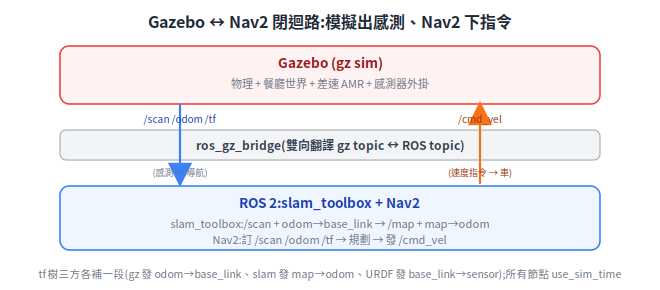

# 用 Gazebo + ROS 2 模擬室內差速 AMR

一句話定位:在電腦裡用 **Gazebo**(開源機器人物理模擬器)蓋一個虛擬餐廳,放進一台差速送餐機器人,讓它產生跟真車一樣的感測器訊號(雷射、里程、姿態),再接上 **Nav2**(ROS 2 的導航軟體堆疊)跑 SLAM 與自主導航——整套不碰真硬體就能驗證導航邏輯。

> 延伸閱讀:[Physical AI 總覽](./physical-ai-overview.md)、[導航運動學與座標轉換](../30-navigation/kinematics-and-coordinate-transforms.md)、[SLAM 建圖](../30-navigation/slam-mapping.md)、[定位](../30-navigation/localization.md)

本檔聚焦 **Gazebo** 這條輕量、CPU 可跑、ROS 原生的路線;與 **Isaac Sim** 的分工放在最後一節。

---

## 1. 先把名字搞清楚:Gazebo Classic 已死,現在的「Gazebo」是 gz sim

這是新手最常踩的坑。同一個品牌「Gazebo」前後是**兩套完全不同的軟體**:

- **Gazebo Classic**(舊的,版本號到 Gazebo 11)— 已於 **2025-01-31 正式 end-of-life(EOL,停止維護)**。教學文章裡看到 `gazebo_ros`、`spawn_entity.py`、`<gazebo>` 標籤配 Gazebo 9/11 的,多半是這套舊的,新專案不要再用。
- **新 Gazebo**(現在官方就叫 **Gazebo**,執行檔 `gz sim`)— 前身叫 **Ignition / Ignition Gazebo**,2022 年改名回 Gazebo。版本用英文字母順序命名:**Fortress → Garden → Harmonic → Ionic → Jetty…**,套件名與指令都是 `gz-*`、`gz sim`。

命名為什麼亂:一個品牌名(Gazebo)被「舊架構(Classic)」和「新架構(原 Ignition)」共用過,中間還改名兩次(Gazebo→Ignition→Gazebo)。判斷手上是哪套,看**指令**最快:`gazebo` 是 Classic、`gz sim` 是新版。

> 名詞:**LTS**(Long-Term Support,長期支援版)指維護週期較長的版本。Gazebo Harmonic 是 LTS,支援到 2028-09。

來源:[Gazebo Classic EOL 公告(Open Robotics Discourse)](https://discourse.openrobotics.org/t/gazebo-classic-11-has-reached-end-of-life-x-post-gazebo-sim-community/41852)、[gazebo-classic GitHub(導向 gz-sim)](https://github.com/gazebosim/gazebo-classic)

### Gazebo 版本 ↔ ROS 2 版本對應(最容易踩雷)

每個 ROS 2 distro(發行版)官方「配對」一個 Gazebo 版本。用配對版本最省事;混搭可行但要自己裝非官方 binary 或從原始碼編 `ros_gz`。

| ROS 2 distro | 官方配對 Gazebo | 備註 |
|---|---|---|
| **Humble**(LTS, 22.04) | **Fortress** | 官方主支援是 Fortress;也可改裝 Harmonic(走 `ros-humble-ros-gzharmonic`),屬進階用法 |
| **Jazzy**(LTS, 24.04) | **Harmonic** | 從 Jazzy 起 Gazebo 走 ROS vendor package,整合最順 |
| **Kilted**(24.04) | **Ionic** | |
| **Rolling / 後續 LTS** | **Jetty** | Rolling 是滾動開發版 |

安裝就一行(裝配對版本的橋接 metapackage):

```bash
sudo apt-get install ros-${ROS_DISTRO}-ros-gz   # ROS_DISTRO 換成 humble / jazzy / kilted
```

實務建議:**新專案首選 Jazzy + Harmonic**(都是 24.04 上的 LTS、官方配對、整合最乾淨)。若被既有 Humble 環境綁住,維持 Humble + Fortress 最穩,要新功能再評估升 Harmonic。版本細節以官方最新為準。

> 名詞:**vendor package** 指 ROS 官方把 Gazebo 函式庫重新打包進 ROS apt 倉庫,讓相依關係跟 ROS 套件一致、不必另加第三方來源。

來源:[Installing Gazebo with ROS(官方)](https://gazebosim.org/docs/latest/ros_installation/)、[ros_gz README 相容矩陣](https://github.com/gazebosim/ros_gz/blob/ros2/README.md)

---

## 2. 一台差速 AMR 的模擬要哪些零件

把模擬拆成四塊:**機器人長相 → 怎麼動 → 怎麼感知 → 在哪裡跑**。

### (a) 機器人描述:URDF / SDF

- **URDF**(Unified Robot Description Format)— ROS 慣用的機器人描述格式(XML),描述連桿(link)、關節(joint)、外型、慣性。
- **SDF**(Simulation Description Format)— Gazebo 原生格式,除了機器人本身,還能描述世界、物理、感測器、外掛(plugin)。

實務上機器人本體寫 URDF(ROS 端的 robot_state_publisher 也要吃它),在 URDF 裡用 `<gazebo>` 區塊補上 Gazebo 專屬設定;Gazebo 載入時會把 URDF 轉成 SDF。差速車最少要有:底盤 link、左右驅動輪 joint(continuous)、一個萬向輪。

### (b) 怎麼動:ros2_control + diff_drive_controller

讓模擬輪子能被 ROS 指令驅動,標準作法是 **ros2_control**(ROS 2 的即時控制框架),在 Gazebo 端由 **gz_ros2_control** 這個外掛接起來:

- 在 URDF 加一個 `<ros2_control>` 區塊,宣告硬體外掛 `gz_ros2_control/GazeboSimSystem`,並列出左右輪 joint 的命令介面(velocity)與狀態介面(position/velocity)。
- 再加一個 Gazebo 系統外掛,指向一份 **controller YAML**(控制器設定檔)。
- YAML 裡設定 **diff_drive_controller**(差速驅動控制器):它訂閱 `/cmd_vel`(`geometry_msgs/Twist`,線速度+角速度指令),依輪距/輪徑換算成左右輪速,反過來用輪子轉動量算出 **odometry**,發布 `nav_msgs/Odometry` 到 `/odom` 並送出 `odom → base_link` 的 tf。

也就是說 `diff_drive_controller` 同時做兩件事:**收 `/cmd_vel` 驅動輪子** + **發 `/odom` 與 tf**。這正好是 Nav2 需要的介面。

> 名詞:**tf**(transform)指 ROS 的座標轉換樹,描述各座標系(map/odom/base_link/雷射…)之間的相對位姿。

來源:[gz_ros2_control 文件](https://control.ros.org/humble/doc/gz_ros2_control/doc/index.html)、[Setting Up Odometry - Gazebo(Nav2)](https://docs.nav2.org/setup_guides/odom/setup_odom_gz.html)

### (c) 怎麼感知:LiDAR / 相機 / IMU 感測器外掛

感測器在 SDF/URDF 裡以 `<sensor>` 宣告,由 Gazebo 的**系統外掛**負責模擬出資料:

| 感測器 | SDF type | 模擬它的系統外掛 | 產出(經橋接後的 ROS 訊息) |
|---|---|---|---|
| 2D LiDAR | `gpu_lidar` | `gz-sim-sensors-system`(渲染類感測共用) | `sensor_msgs/LaserScan`(SLAM 主力) |
| 3D LiDAR | `gpu_lidar` | `gz-sim-sensors-system` | `sensor_msgs/PointCloud2`(點雲,非 LaserScan) |
| 相機 | `camera` / `depth_camera` | 同上 | `sensor_msgs/Image` |
| IMU | `imu` | `gz-sim-imu-system` | `sensor_msgs/Imu` |

世界檔本身也要掛幾個基礎系統外掛才動得起來:`gz-sim-physics-system`(物理)、`gz-sim-scene-broadcaster-system`(場景廣播)、`gz-sim-sensors-system`(感測渲染)。

> 名詞:**plugin / system**(系統外掛)— Gazebo 把功能模組化成可掛載的外掛,物理、感測、控制各是一個 system,在 SDF 裡用 `<plugin filename=...>` 掛進去。

來源:[Gazebo Harmonic Sensors(官方)](https://gazebosim.org/docs/harmonic/sensors/)、[Setting Up Sensors - Gazebo(Nav2)](https://docs.nav2.org/setup_guides/sensors/setup_sensors_gz.html)

### (d) 在哪裡跑:世界檔(world)

**world** 是一份 SDF,描述場景:地面、牆壁、桌椅、光源、物理參數。送餐情境就是擺一個餐廳:走道、餐桌、出餐口。可以自己用 SDF 拼,或載入現成模型(Gazebo Fuel 線上模型庫)。世界檔決定了 LiDAR 會掃到什麼、SLAM 要建出什麼地圖。

---

## 3. 跟 Nav2 串接:sim → Nav2 閉迴路

核心觀念:**Gazebo 不知道 Nav2 存在,Nav2 也不知道 Gazebo 存在**。它們只透過幾個標準 ROS topic 與 tf 對話,中間靠 `ros_gz_bridge` 翻譯。把 Gazebo 換成真車(同樣發 `/scan /odom /tf`、收 `/cmd_vel`),Nav2 那側完全不用改——這正是模擬的價值。

資料流(閉迴路):

<p align="center"></p>

tf 樹由三方各補一段,合起來才完整:

| 提供者 | 提供的 tf | 意義 |
|---|---|---|
| Gazebo / diff_drive_controller | `odom → base_link` | 機器人相對里程原點的位姿(相對定位,會漂移) |
| robot_state_publisher(讀 URDF) | `base_link → 各感測器/輪子` | 機器人本體固定幾何 |
| **slam_toolbox**(建圖時)/ AMCL(已知地圖時) | `map → odom` | 把里程漂移修正回全域地圖座標 |

- **建圖階段**:跑 **slam_toolbox**(ROS 2 主流 2D SLAM 套件,也是 Nav2 官方支援之一)。它吃 `/scan` + `odom→base_link`,即時產生 `/map` 與 `map→odom` 修正,可以邊走邊建圖(Navigating while Mapping)。
- **導航階段**:有了地圖後,改用 **AMCL**(粒子濾波定位)提供 `map→odom`;Nav2 依目標點規劃路徑、避開 costmap 上的障礙,持續發 `/cmd_vel`,Gazebo 把車開過去,新 `/scan` 又回饋進來——閉迴路成立。

來源:[Setting Up Odometry - Gazebo(Nav2)](https://docs.nav2.org/setup_guides/odom/setup_odom_gz.html)、[Navigating while Mapping (SLAM)(Nav2)](https://docs.nav2.org/tutorials/docs/navigation2_with_slam.html)、[Mapping and Localization(Nav2)](https://docs.nav2.org/setup_guides/sensors/mapping_localization.html)

---

## 4. 典型啟動方式(結構,不貼完整程式)

一個完整模擬通常由一個 ROS 2 **launch file**(啟動描述檔,Python 或 XML)把下列節點一次拉起來:

1. **啟 Gazebo + 載世界**:用 `ros_gz_sim` 提供的 launch 包起 `gz sim <restaurant.world>`。
2. **生成機器人**:把 URDF 餵給 `ros_gz_sim` 的 `create`,在世界裡 spawn 出 AMR。
3. **robot_state_publisher**:讀 URDF 發布機器人本體 tf。
4. **ros_gz_bridge**:逐一宣告要橋接的 topic 對應,把 gz 訊息翻成 ROS 訊息(雙向)。語法形如:
   ```
   /scan@sensor_msgs/msg/LaserScan@gz.msgs.LaserScan        # gz → ROS
   /cmd_vel@geometry_msgs/msg/Twist@gz.msgs.Twist           # ROS → gz
   /odom@nav_msgs/msg/Odometry@gz.msgs.Odometry
   ```
   (`@ROS型別@gz型別`,中間的方向由箭頭符號決定)
5. **controller_manager + spawner**:載入 `diff_drive_controller` 與 `joint_state_broadcaster`。
6. **slam_toolbox 或 Nav2**:依「建圖」或「導航」階段擇一啟動,通常各自一份 launch,再用一個上層 launch 組合。

> 名詞:**ros_gz_bridge / parameter_bridge** — `ros_gz` 套件群裡負責 Gazebo Transport 與 ROS 2 之間雙向轉訊息的橋。`ros_gz` 還含 `ros_gz_sim`(啟動/生成工具)、`ros_gz_image`(影像單向高效傳輸)等。

來源:[ros_gz README(套件職責)](https://github.com/gazebosim/ros_gz/blob/ros2/README.md)、[Setting Up Sensors - Gazebo(Nav2,橋接語法)](https://docs.nav2.org/setup_guides/sensors/setup_sensors_gz.html)

---

## 5. Gazebo 的定位 vs Isaac Sim:各適合什麼

兩者不是取代關係,是**不同階段、不同目的**的工具。

| 面向 | **Gazebo (gz sim)** | **NVIDIA Isaac Sim** |
|---|---|---|
| 授權/生態 | 開源,Open Robotics,**ROS 原生** | 免費但閉源,跑在 NVIDIA Omniverse 平台上 |
| 物理/算力 | CPU 即可跑,輕量 | GPU 加速物理;Isaac Lab 可在 GPU 上**並行上千個環境** |
| 畫面擬真 | 夠用,非照片級 | RTX 光線追蹤,**照片級渲染** |
| 強項定位 | 導航/控制/感測整合驗證、ROS2 堆疊聯調、教學、CI | 強化學習(RL)大規模訓練、合成資料生成(Replicator + 域隨機化)、電腦視覺/感知擬真 |
| ROS2 整合 | best-in-class(`ros_gz` 橋接) | 可接但學習曲線較陡 |
| 硬體門檻 | 低,無獨顯也能(可 headless) | 高,需較強 NVIDIA GPU |

選用建議:

- **驗證導航/控制邏輯、跑 Nav2/SLAM 閉迴路、團隊聯調、CI 自動測試** → **Gazebo**。輕、開源、ROS 原生,送餐機器人這類室內 2D 導航的甜蜜點。
- **訓練視覺感知模型、要照片級合成資料 + 標註、大規模 RL 平行訓練、sim-to-real 視覺** → **Isaac Sim / Isaac Lab**。用 GPU 算力換擬真度與吞吐。
- 常見組合:**Isaac 練感知/策略模型,Gazebo(或真車)驗導航整合**,各取所長。

> 名詞:**RL**(Reinforcement Learning,強化學習)讓機器人在模擬中反覆試錯學策略;**合成資料**指模擬器自動產生帶標註的訓練影像,省去真實標註成本;**域隨機化(Domain Randomization)** 隨機化光照/材質/物件以提升真實世界泛化(見 [Physical AI 總覽](./physical-ai-overview.md))。

來源:[Gazebo vs Isaac Sim 比較(SVRC)](https://www.roboticscenter.ai/learn/robot-simulation-software-comparison)、[Robot Simulation Software: 2026 Perspective(Black Coffee Robotics)](https://www.blackcoffeerobotics.com/blog/which-robot-simulation-software-to-use)

---

## 6. 安裝與硬體需求概況

- **作業系統**:Gazebo Harmonic 官方 binary 提供 **Ubuntu 22.04(Jammy)** 與 **24.04(Noble)**。Windows 走 WSL2 + Ubuntu;原生 Windows/macOS 支援有限,以官方最新為準。
- **安裝**:加 OSRF apt 來源後 `sudo apt install gz-harmonic`(只裝模擬器),或 `sudo apt install ros-${ROS_DISTRO}-ros-gz`(連 ROS 橋接一起裝,**做 ROS 專案用這個**)。
- **GPU**:跑模擬**不強制要獨顯**——感測器渲染走 OpenGL,內顯也能動;有獨顯則畫面/感測渲染更順。要完全無 GPU 環境(如 CI、伺服器)可開 **headless 模式**(不開 GUI),省資源也不需強 OpenGL 支援。
- **記憶體**:用 binary 安裝吃得不多;**從原始碼編譯**才重,官方提到編譯可能用到 ~16GB RAM,可用 `CMAKE_BUILD_PARALLEL_LEVEL=1` 降低佔用。一般人裝 binary 即可,不必自編。

> 對照:這份「內顯可跑、headless 可上 CI」正是 Gazebo 相對 Isaac Sim(需較強 NVIDIA GPU)的入門優勢。

來源:[Binary Installation on Ubuntu - Harmonic(官方)](https://gazebosim.org/docs/harmonic/install_ubuntu/)、[Installing Gazebo with ROS(官方)](https://gazebosim.org/docs/latest/ros_installation/)

---

## 7. 把舊世界搬上新 Gazebo:以 AWS Small Warehouse 為例

網路上現成的模擬世界(餐廳、倉庫、辦公室)很多都是 **Gazebo Classic** 時代的,直接丟進 `gz sim` 不會動。這節用實際把 **AWS RoboMaker Small Warehouse**(Classic)遷到 **Harmonic** 的經驗,講「為什麼不能直接載、要改什麼、怎麼確認改對了」。完整可跑的成品在獨立 repo:[aws_warehouse_model_for_gazebo_harmonic](https://github.com/wicanr2/aws_warehouse_model_for_gazebo_harmonic)。

### 為什麼 Classic 的 `.world` 不能直接在 gz sim 跑

關鍵認知:**卡住的不是幾何**。倉庫 9 成是靜態 mesh(地板、牆、貨架),mesh(Collada/OBJ/STL)兩套 Gazebo 通用。真正不相容的是三件機械性的事:

| 卡點 | Classic | 新 gz sim | 
|---|---|---|
| 資源路徑環境變數 | `GAZEBO_MODEL_PATH` | **`GZ_SIM_RESOURCE_PATH`**(解析 `model://`) |
| plugin | `libgazebo_ros_*` | **`gz-sim-*-system`**,`name=` 要填 C++ 類別全名;硬載對方 plugin 會 crash |
| world 系統 plugin | Classic 內建 | 要自掛 Physics / SceneBroadcaster / UserCommands / Sensors,否則沒物理、沒感測、GUI 不動 |

加上 SDF 版本要升、材質可能要從 Classic 材質腳本改走 mesh 自帶 / PBR。AWS 倉庫的好消息是:**14 個模型全部沒有 plugin、沒有材質腳本、全 `<static>`**,所以模型層只要升 SDF 版本(`1.6 → 1.10`),材質與 mesh 原封不動;world 層補上 4 個系統 plugin、清掉 `<pose frame="">`、physics 區塊處理一下即可。

### 遷移時意外踩到的坑(這幾個最值得記)

把檔案改完不等於對。用 `gz sdf` 與嚴格 XML 解析器一驗,跳出幾個一開始沒料到的:

1. **`<physics>` 的 `type` 是 SDFormat 必填屬性**。新版 gz sim 的物理引擎其實是由 `gz-sim-physics-system` plugin 決定(預設 dartsim),於是直覺會想把 Classic 的 `type="ode"` 拿掉——結果 SDFormat 直接報錯(缺必填屬性)。正解是**保留 `type` 字串**(留 `ode` 即可),引擎選擇交給 plugin。
2. **慣性張量要過三角不等式**。AWS 的 GroundB(地板)、RoofB(屋頂)原始 inertia 其實是壞的(`ixx+izz < iyy`),Classic 不檢查、新版 sdformat 直接 Error。這兩個是 static 裝飾物,慣性根本不影響模擬,改成合法值即可——但**沒有驗證就不會發現原始資料是錯的**。
3. **XML 註解裡不能有 `--`(雙連字號)**。在註解寫了 `--physics-engine`,`gz sdf` 用的 tinyxml2 容忍,但嚴格的解析器(Python expat)直接拒——這是 XML 規格,不是 bug。寫中文註解時很容易不小心帶到。

> 這三個都是「Classic 容忍、新版較嚴」的典型:遷移的工作量常常不在搬幾何,而在補上新版才會檢查的正確性。

### 怎麼確認改對了(驗證 + CI,省本機 CPU)

`gz sim` 跑起來吃 CPU/GPU;但**驗證模型不必真的開模擬**。分兩層:

- **輕量靜態驗證**(只解析,CPU 吃很少,本機可跑):
  - `gz sdf -k <model.sdf>` 逐一驗模型結構(就是它抓出上面的慣性錯)。
  - world 用嚴格 XML 解析器驗良構(抓出 `--` 那種)。
  - 另外檢查 world 裡每個 `model://NAME` 都對應得到 `models/NAME/` 目錄。
- **真正載入**:只有 `gz sim` 能解析 `model://`(它在執行期靠 `GZ_SIM_RESOURCE_PATH` + Fuel 註冊 findFile callback);獨立的 `gz sdf` 工具沒這個 callback,會報 `callback is empty`,**所以 world 的 include 解析驗證只能交給 `gz sim`**,headless 跑幾百個 iteration 即可。

本機 CPU 吃緊時,把這兩層丟上 **GitHub Actions**:runner 裝 Gazebo Harmonic,push 後自動跑靜態驗證 + `gz sim` headless 載入(用 xvfb 軟體渲染)。改一行 push 一次,綠燈才算數,完全不占你本機資源。設定見 model repo 的 [`.github/workflows/validate.yml`](https://github.com/wicanr2/aws_warehouse_model_for_gazebo_harmonic/blob/main/.github/workflows/validate.yml) 與 [`MIGRATION.md`](https://github.com/wicanr2/aws_warehouse_model_for_gazebo_harmonic/blob/main/MIGRATION.md)。

> 一個工作習慣:**先在本機把驗證腳本跑通,再寫成 CI**。CI 腳本自己也有盲點(例如一開始用 `gz sdf -p` 想驗 world,卻因為它解析不了 `model://` 而誤判),先在本機踩過,CI 才不會綠得不明不白或紅得冤枉。

### 想在 CI 裡 headless「出圖 / 錄影」:技術與雷

把模擬畫面(相機影像、影片)在無 GPU 的 GitHub Actions 上 render 出來,是另一個層級的問題。**會動的技術組合**:

1. **`gz sim -s -r --headless-rendering`**:EGL surfaceless,不需 X server / xvfb(EGL 只在 ogre2 可用)。
2. **裝 Mesa 軟體渲染**:`libgl1-mesa-dri libegl1 libegl-mesa0 mesa-utils`。
3. **強制最快的軟體光柵器**:`export LIBGL_ALWAYS_SOFTWARE=true GALLIUM_DRIVER=llvmpipe`。**關鍵**:EGL surfaceless 預設會掉到 `swrast`(最舊最慢的軟體光柵器),`GALLIUM_DRIVER=llvmpipe` 才切到多執行緒、吃滿 CPU 核的 llvmpipe([Mesa 文件](https://docs.mesa3d.org/drivers/llvmpipe.html))。
4. **相機要存檔**:`<sensor type="camera">` 內加 `<save enabled="true"><path>/tmp/frames</path></save>`,world 掛 `gz-sim-sensors-system`(沒掛這個 system,相機不會 render)。
5. **給暖機時間**:render 在獨立 thread 跑,首張影格要等 ogre2/llvmpipe 暖機;用 real-time 跑、輪詢磁碟出圖,別用 `--iterations`(它跑完會在 render thread 出圖前就關掉 server)。影格存出後用 `ffmpeg` 合成 mp4。

**但要誠實面對的雷**:**免費 GitHub runner 沒有 GPU,純軟體渲染又慢又不穩定**——首張影格動輒十幾秒,而且**常常整輪跑完都生不出影格(間歇性失敗)**,加重試也未必穩。所以分界線很清楚:

| 任務 | 需要 GPU? | 在免費 runner 上 |
|---|---|---|
| SDF 結構驗證(`gz sdf -k`)、XML 良構、`model://` 路徑 | 否 | **完全可靠** |
| world headless 載入(`gz sim -s`,驗 include 解析) | 否 | **可靠** |
| 機器人「會不會動」(下指令、比對位姿) | 否(純物理) | **可靠** |
| **相機出圖 / 錄影** | 實質上要 | **不可靠**(軟體渲染慢且間歇) |

要穩定產圖/影片,實務上的可靠路線是:① 用**帶正確 Mesa/GL 的 Docker image**、② **GPU runner**(self-hosted 或付費大型 runner)、③ 或**本機一次性截圖**(開 gz 截一張就關,是單發、非持續負載)。**結論:把「需不需要 render」當成 CI 設計的分水嶺**——不需 render 的驗證盡量自動化上 CI;需要 render 的視覺產出,別硬塞免費 runner。

來源:[Classic→gz 遷移(SDF/plugin)](https://gazebosim.org/api/sim/8/migrationsdf.html)、[gz 資源路徑](https://gazebosim.org/api/sim/8/resources.html)、[world 系統 plugin](https://gazebosim.org/docs/latest/sdf_worlds/)、[AWS Small Warehouse(Classic 原始)](https://github.com/aws-robotics/aws-robomaker-small-warehouse-world)。

---

## 參考來源(實際查證)

- Gazebo Classic EOL 公告:https://discourse.openrobotics.org/t/gazebo-classic-11-has-reached-end-of-life-x-post-gazebo-sim-community/41852
- gazebo-classic GitHub(導向 gz-sim):https://github.com/gazebosim/gazebo-classic
- Installing Gazebo with ROS(版本配對、安裝):https://gazebosim.org/docs/latest/ros_installation/
- ros_gz README(相容矩陣、套件職責、bridge):https://github.com/gazebosim/ros_gz/blob/ros2/README.md
- gz_ros2_control 文件:https://control.ros.org/humble/doc/gz_ros2_control/doc/index.html
- Nav2 — Setting Up Odometry (Gazebo):https://docs.nav2.org/setup_guides/odom/setup_odom_gz.html
- Nav2 — Setting Up Sensors (Gazebo,橋接語法):https://docs.nav2.org/setup_guides/sensors/setup_sensors_gz.html
- Nav2 — Mapping and Localization:https://docs.nav2.org/setup_guides/sensors/mapping_localization.html
- Nav2 — Navigating while Mapping (SLAM):https://docs.nav2.org/tutorials/docs/navigation2_with_slam.html
- Gazebo Harmonic Sensors(官方):https://gazebosim.org/docs/harmonic/sensors/
- Gazebo Harmonic Binary Install(官方):https://gazebosim.org/docs/harmonic/install_ubuntu/
- 模擬器比較(SVRC):https://www.roboticscenter.ai/learn/robot-simulation-software-comparison
- 模擬器比較(Black Coffee Robotics, 2026):https://www.blackcoffeerobotics.com/blog/which-robot-simulation-software-to-use
- Classic → gz sim 遷移(SDF/plugin 差異):https://gazebosim.org/api/sim/8/migrationsdf.html
- gz sim 資源路徑(GZ_SIM_RESOURCE_PATH / model://):https://gazebosim.org/api/sim/8/resources.html
- AWS Small Warehouse(Classic 原始,MIT):https://github.com/aws-robotics/aws-robomaker-small-warehouse-world
- 本系列遷移成品 + 驗證 CI:https://github.com/wicanr2/aws_warehouse_model_for_gazebo_harmonic
</content>
</invoke>
