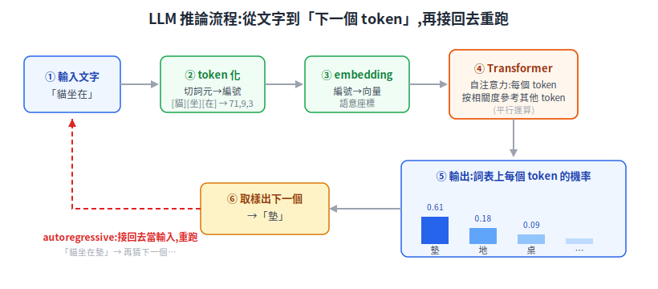
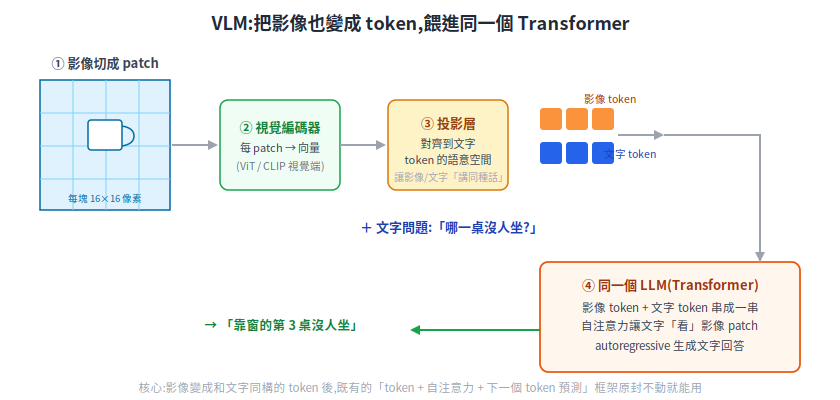

# LLM 與 VLM 給機器人:從「下一個 token」到「看圖做事」

一句話定位:把近年生成式 AI 的兩種模型——**LLM**(大型語言模型)與 **VLM**(視覺語言模型)——從第一性原理講清楚,再說明它們對機器人(尤其送餐這類室內 AMR)到底改變了什麼、哪些已能用、哪些還在研究階段。

> 前置:會「機率」「向量」的概念即可,其餘從零講。涉及高斯/機率的地方可參考 [高斯第一性原理](../90-foundations/gaussian-from-first-principles.md)。
> 延伸閱讀:[在 NVIDIA GB10 上架本地 LLM](./local-llm-on-nvidia-gb10.md)(把這顆「大腦」放進機器人本機)、[Physical AI 總覽](../50-physical-ai/physical-ai-overview.md)。

本篇只講「模型在做什麼、為什麼這樣設計、對機器人意義何在」,不講怎麼訓練一個 LLM(那是另一回事)。

---

## 1. 先問:LLM 在解什麼根本問題

人類的知識、指令、對話,絕大多數是用**自然語言**承載的。一台機器人若聽不懂「幫我把餐點送到靠窗那桌」,就只能靠工程師事先把每種情況寫死。**根本問題是:能不能有一個數學物件,把「語言」變成電腦能運算、能生成的東西?**

LLM(Large Language Model,大型語言模型)給的答案出乎意料地簡單:**把語言變成「猜下一個字」的機率遊戲**。給一段文字,模型輸出「下一個最可能接什麼」。反覆接下去,就生成一整段話。

聽起來太單純,不像能聊天、能寫程式、能推理。但這篇後面會看到:**「猜下一個 token」這個目標,逼著模型在過程中學會語法、事實、邏輯關係,於是「能力」是被擠出來的副產品**。先把這條主線記住:LLM = 一個非常會猜下一個 token 的機率機器。

---

## 2. Token 化:語言怎麼變成數字

電腦不認得「貓」這個字,只認得數字。第一步是把文字切成一塊塊**token**(詞元),再給每塊一個編號。

> 名詞:**token(詞元)** = 模型處理文字的最小單位,可能是一個字、半個英文單字、或一個標點。不是「一個字 = 一個 token」,中文常一字一 token 上下,英文常一個詞被拆成幾塊。

為什麼不直接用「字」或「整個單字」當單位?兩個極端都不好:

- 用**字母/單字**當單位 → 字母太細(失去語意),整字太多(英文有數十萬個詞,還有沒見過的新詞)。
- 折衷做法叫 **subword(子詞)切分**(如 BPE,Byte-Pair Encoding):常見的詞給一個 token,罕見的詞拆成幾個常見片段。這樣**字典大小可控(常見幾萬到十幾萬個 token),又不會遇到「沒看過的詞」就卡住**。

切完之後,每個 token 編號會再被轉成一個**向量**(一串浮點數,叫 embedding,嵌入),代表這個 token 的「語意座標」。意思相近的 token,向量也相近。到這一步,語言就完全變成了「一串向量」,可以丟進神經網路運算。

<p align="center"></p>

---

## 3. Transformer 與自注意力:在解什麼問題

把一串 token 向量丟進去、吐出「下一個 token 機率」的那個神經網路,主流架構叫 **Transformer**。它的核心零件是 **self-attention(自注意力)**。要懂它,先看它在解什麼問題。

### 3.1 問題:一個詞的意思取決於上下文

看這兩句:

- 「我去**銀行**存錢」
- 「我坐在**河**的岸**邊**」(bank 在英文同時是銀行與河岸)

同一個詞,意思由**周圍哪些詞**決定。模型若想正確處理一個 token,必須能「回頭看」整句話裡**跟它有關的其他 token**,而且自動判斷哪些相關、哪些無關。這就是自注意力要解的根本問題:**讓每個 token 動態地、按相關程度去「參考」序列裡其他 token 的資訊**。

### 3.2 機制:query / key / value 的配對

自注意力的做法,用一個比喻最好懂——**查字典 / 找資料**:

- 每個 token 產生一個 **query(查詢)**:我想找什麼資訊。
- 每個 token 也產生一個 **key(鍵)**:我能提供什麼資訊。
- 還有一個 **value(值)**:我實際攜帶的內容。

對某個 token,拿它的 query 去和**所有** token 的 key 比對(算相似度),相似度高的就給高權重,然後按權重把大家的 value 加權平均,匯總成這個 token 的新表示。

```
某 token 的新表示 = Σ (其他每個 token 的 value × 對它的注意力權重)
                   注意力權重 ∝ query 與該 token 的 key 有多相似
```

「銀行」這個 token 的 query,會和「存錢」的 key 高度相似 → 給它高權重 → 於是「銀行」的表示被「存錢」拉向「金融」語意。**整句話的詞,就這樣互相參考、彼此消歧**。多疊幾層,模型就能表示越來越複雜的關係(片語 → 句子 → 段落邏輯)。

> 為什麼叫「self」:query、key、value 都來自**同一個序列自己**(自己參考自己),所以是 self-attention。
> 一個關鍵工程性質:序列裡每個 token 的注意力可以**平行**算(不像舊的 RNN 必須一個字一個字依序處理),這是 Transformer 能在 GPU 上高效訓練、規模衝到「大型」的根本原因。

### 3.3 為什麼非要這個架構

在 Transformer 之前,處理序列主流是 RNN/LSTM:一個字一個字往後傳遞記憶。問題是(a)無法平行(慢)、(b)隔太遠的詞關係會「遺忘」。自注意力一次把**任意兩個 token 直接連起來**(不管隔多遠),既解決長距離依賴,又能平行。「Attention is all you need」這篇 2017 論文的標題就是這個意思:把 RNN 那套丟掉,光靠注意力就夠了。

來源:[Attention Is All You Need(原始 Transformer 論文,arXiv)](https://arxiv.org/abs/1706.03762)

---

## 4. Autoregressive 生成:一次一個 token,接回去再來

模型輸出的不是「一個答案」,而是**詞表上每個 token 的機率分布**(下一個是「的」機率多少、「貓」機率多少……)。生成一段話的流程是:

```
① 餵進目前的文字 → 模型輸出「下一個 token」的機率分布
② 從分布裡挑一個 token(取機率最高,或按機率隨機取樣)
③ 把這個 token 接到文字尾巴
④ 回到 ①,重跑
```

這種「**把自己剛生成的輸出,接回去當下一步輸入**」的方式叫 **autoregressive(自回歸)**。一句話、一段程式、一篇文章,都是這樣一個 token 一個 token「長」出來的。

> 名詞:**取樣溫度(temperature)** 控制第②步多隨機。溫度低 → 幾乎總選機率最高的(穩定、保守);溫度高 → 較常選次高的(多樣、有創意但也較可能出錯)。

這也解釋了一個常見現象:LLM 是「邊講邊想」,**沒有事先規劃整段**;它每一步只在猜下一個 token。能講出通順長文,是因為每一步都帶著前文的上下文在猜。

---

## 5. 參數、權重、推論:這些數字是什麼

常聽到「70B 模型」「參數量」,到底指什麼?

- **參數(parameter)/ 權重(weight)**:就是神經網路裡那些「可調的數字」——自注意力的 query/key/value 怎麼算、各層怎麼組合,全靠這些數字決定。訓練,就是用海量文字反覆微調這些數字,讓「猜下一個 token」越來越準。
- **參數量**:這些數字有幾個。「70B」= 700 億個權重。越多參數,模型「容量」越大、能記住越複雜的模式(也越吃記憶體與算力)。
- **推論(inference)**:訓練好之後,拿模型去「用」——餵輸入、跑前向計算、得到輸出。機器人上跑的就是推論。

**這裡埋一個關鍵伏筆**:推論時,模型每生成一個 token,都要把這幾百億個權重讀出來算一遍。權重要先全部載入記憶體,而且每個 token 都要把它們搬一遍——這就是為什麼「在本機跑大模型」的瓶頸是**記憶體(容量與頻寬)**,而不只是算力。這條主線在 [GB10 那篇](./local-llm-on-nvidia-gb10.md) 完整展開。

---

## 6. 為什麼「猜下一個 token」能湧現能力

最違反直覺的一點:一個只會猜下一個 token 的模型,為什麼能做算術、翻譯、寫程式、甚至簡單推理?

第一性原理是這樣:**要把「猜下一個 token」這件事做到極好,模型被迫去學會背後的規律**。

- 要正確接「2 + 3 =」後面的「5」→ 被迫學會加法。
- 要正確接「法國的首都是」後面的「巴黎」→ 被迫記住事實。
- 要正確接一段程式的下一行 → 被迫學會語法與邏輯。
- 要正確接一段推理的下一句 → 被迫掌握因果與論證結構。

換句話說,**「猜下一個 token」是一個極其廣的目標**:訓練資料裡涵蓋了人類寫下的各種文字,而要在所有這些文字上都猜得準,模型就得在內部建立起對語言、事實、邏輯的某種表示。當模型夠大、資料夠多,這些能力會**湧現(emergence)**——某些能力在小模型上幾乎沒有,模型規模跨過某個門檻後才突然出現。

> 誠實提醒:「湧現」是觀察到的現象,不是魔法,學界對它的精確定義與成因仍有爭論(有研究指出部分「湧現」是評測指標選擇造成的錯覺)。本篇取其工程上可觀察的意義:大模型確實展現出小模型沒有的能力。

也要誠實面對它的限制:LLM 的「知識」來自訓練資料的統計規律,它會**自信地講錯**(俗稱 hallucination,幻覺),因為它的目標從來是「猜得通順」而非「講得正確」。用在機器人上時,這一點攸關安全,後面 §9 再談。

來源:[Emergent Abilities of Large Language Models(arXiv)](https://arxiv.org/abs/2206.07682)、[Are Emergent Abilities of LLMs a Mirage?(arXiv,反方觀點)](https://arxiv.org/abs/2304.15004)

---

## 7. VLM:把影像也變成 token

機器人不只要聽懂語言,還要**看**。VLM(Vision-Language Model,視覺語言模型)解的問題是:**讓同一個模型既能讀文字、又能看影像,並把兩者連起來理解**(看一張餐桌的照片回答「哪一桌沒人坐」)。

它的核心訣竅,順著前面的主線就懂了:**既然 Transformer 吃的是「一串 token 向量」,那就想辦法把影像也變成 token 向量,混進去一起餵**。

### 7.1 影像怎麼變 token:切 patch

一張圖是一堆像素,沒辦法直接當 token。做法(來自 **ViT**,Vision Transformer):

1. 把影像切成固定大小的小方塊,叫 **patch**(圖塊),例如每塊 16×16 像素。
2. 每個 patch 攤平、過一個小網路,變成一個向量——這就是一個「影像 token」。一張圖於是變成一串影像 token,跟文字 token 形式一致。

<p align="center"></p>

### 7.2 三段式結構:視覺編碼器 + 投影 + LLM

主流 VLM 把三個零件接起來:

| 零件 | 做什麼 |
|---|---|
| **視覺編碼器(vision encoder)** | 把影像 patch 變成一串視覺特徵向量(常用預訓練好的 ViT / CLIP 視覺端) |
| **投影層(projector / adapter)** | 把視覺向量「翻譯」到 LLM 文字 token 所在的語意空間——讓影像 token 和文字 token「講同一種話」 |
| **LLM(語言模型主體)** | 接收「影像 token + 文字 token」混合序列,照樣用自注意力處理,autoregressive 生成文字回答 |

關鍵在投影層:視覺編碼器產出的向量,和 LLM 認得的文字向量,本來是兩個不同的座標系。投影層學會把前者對齊到後者,於是**自注意力可以讓文字 token「看」影像 token**——問「哪一桌沒人」時,文字 query 會去注意對應區域的影像 token。LLaVA 這類開源 VLM 就是這個結構的代表。

> 名詞:**CLIP**(Contrastive Language-Image Pre-training)= 一個用「大量圖配文字」對比學習出來的模型,讓「一張圖」和「描述它的句子」在向量空間靠得很近。很多 VLM 直接拿 CLIP 的視覺端當編碼器,因為它的特徵天生就和語言對齊。

### 7.3 為什麼能「看圖說話 / 回答」

一旦影像變成了和文字同構的 token,前面講過的整套機制原封不動就能用:自注意力讓問題文字去「注意」影像裡相關的 patch,autoregressive 一個字一個字把答案生出來。**VLM 沒有發明新原理,它只是把「影像」也納入了「token + 自注意力 + 下一個 token 預測」這個既有框架**——這正是 Transformer 架構通用性的威力。

來源:[An Image is Worth 16×16 Words: ViT(arXiv)](https://arxiv.org/abs/2010.11929)、[Learning Transferable Visual Models From Natural Language Supervision: CLIP(arXiv)](https://arxiv.org/abs/2103.00020)、[Visual Instruction Tuning: LLaVA(arXiv)](https://arxiv.org/abs/2304.08485)

---

## 8. 給機器人的意義:從 VLM 到 VLA

VLM 能看圖、能對話,但機器人最終要**動**。把「視覺 + 語言」再接上「動作」,就是近兩年最受關注的方向:**VLA**(Vision-Language-Action,視覺-語言-動作模型)。

### 8.1 VLA 在解什麼問題

傳統機器人的「看 → 想 → 動」是好幾個分開的模組拼起來的(感知、規劃、控制各一套,工程師手寫接口)。VLA 的構想是:**用一個大模型,直接把「相機畫面 + 語言指令」對映成「動作」**。

順著前面的主線,做法依然是「token 化 + 下一個 token 預測」,只是這次連**動作**也當成 token:

```
輸入:影像 token + 語言指令 token(「把可樂罐放到盤子上」)
輸出:動作 token(把機械臂/底盤的目標位置、夾爪開合,離散化成 token)
      一樣 autoregressive 一步步生出動作序列
```

Google 的 **RT-2** 是代表作:它把網路上學到的視覺-語言知識,直接遷移到機器人動作生成,讓機器人能對「把草莓放進正確的碗」這種它沒被專門教過的指令做出合理反應。後續 **OpenVLA**(開源)、NVIDIA 的 **GR00T**(人形機器人基礎模型)、Physical Intelligence 的 **π0** 等都屬這條路線。

來源:[RT-2: Vision-Language-Action Models(Google DeepMind)](https://robotics-transformer2.github.io/)、[OpenVLA(arXiv)](https://arxiv.org/abs/2406.09246)、[NVIDIA Isaac GR00T](https://developer.nvidia.com/isaac/gr00t)

### 8.2 三個對機器人真正重要的能力

- **Grounding(語言落地)**:把語言裡的詞,對應到實體世界的具體東西。「靠窗那桌」要對應到地圖上某個座標、相機畫面裡某個區域。這是 VLM/VLA 相對傳統 pipeline 最大的增益——以前「靠窗那桌」得工程師手動定義,現在模型能從「語言 + 畫面」自己對上。
- **開放詞彙感知(open-vocabulary perception)**:傳統物件偵測只認得訓練時定義好的固定類別(人、桌、椅)。基於 VLM 的偵測(如 OWL-ViT、Grounding DINO)能偵測「**用文字描述的任意東西**」——你說「找紅色的托盤」,它就找,不必事先有「紅色托盤」這個類別。對「現場才知道要找什麼」的服務場景很有用。
- **自然語言下任務**:操作員或客人用人話下指令,不必透過固定的按鈕/選單/API。

### 8.3 和傳統 pipeline 的差別(以及該不該全換)

| 面向 | 傳統 pipeline(感知/規劃/控制分模組) | VLM/VLA 端到端 |
|---|---|---|
| 新指令/新物件 | 要改程式、重訓專用模型 | 常可靠語言泛化,不必改碼 |
| 行為可預測性 | 高(邏輯寫死,可逐條驗證) | 較低(大模型內部不透明) |
| 即時性 | 控制迴圈可達 kHz 級 | 大模型推論慢,難直接跑高頻控制 |
| 失敗可解釋 | 容易定位是哪個模組 | 難說清「為什麼這樣動」 |
| 安全保證 | 可做形式化/規則保證 | 仍是開放研究問題 |

務實的結論是**分層**:讓 VLM/VLA 處理「高層理解與決策」(聽懂指令、認出物件、決定去哪、做什麼),把「**安全攸關的底層**」——避障、急停、運動控制——留給傳統、可驗證、跑得快的模組(就是本 repo [導航](../30-navigation/path-planning.md) 與 [下位機控制](../20-firmware/low-level-control.md) 講的那一套)。大模型當「大腦皮層」,傳統控制當「脊髓反射」。

---

## 9. 哪些能用、哪些還在研究(誠實盤點)

避免把研究 demo 當成產品現況:

| 能力 | 現況 |
|---|---|
| 用 VLM 做開放詞彙物件偵測、影像問答 | **已可用**:有成熟開源模型,工程上能整合進感知層 |
| 用 LLM 解析自然語言指令、轉成任務 | **大致可用**:配合明確的工具/API 框架(function calling)效果好,但需防幻覺 |
| VLM/LLM 跑在機器人**本機**(離線、低延遲) | **逐漸可行**:靠量化 + 邊緣硬體(見 [GB10 篇](./local-llm-on-nvidia-gb10.md)),但大模型仍吃資源 |
| VLA 端到端「看畫面直接輸出動作」做複雜操作 | **多數仍是研究階段**:實驗室成績亮眼,但泛化性、可靠性、安全保證離大規模商用尚有距離 |
| 把高層決策完全交給大模型、無傳統安全層兜底 | **不建議**:幻覺與不可預測性使其不能單獨負責安全攸關行為 |

三個務必記住的限制:

1. **幻覺**:LLM 會自信地講錯/編造。涉及動作與安全時,必須有外部檢查(規則、幾何約束、人類確認)。
2. **延遲**:大模型推論動輒數百毫秒到數秒,**不能**直接放進需要 kHz 的控制迴圈;它負責「慢思考」,快反應交給下位機。
3. **資料與泛化**:VLA 在訓練分布內表現好,遇到沒見過的場景仍可能失常——sim-to-real 與長尾問題依舊存在(見 [sim-to-real](../50-physical-ai/sim-to-real.md))。

---

## 10. 一句話收束

LLM 把語言變成「猜下一個 token」,VLM 把影像也變成 token 餵進同一個 Transformer,VLA 再把動作也納進來——**三者是同一個「token + 自注意力 + 下一個 token 預測」框架的逐步擴張**。對機器人的真正價值在於 grounding(語言對上實體)、開放詞彙感知與自然語言下任務;但大模型的幻覺、延遲與不可預測,決定了它現階段該當「會理解的大腦」,而非取代那層「跑得快、可驗證」的傳統控制。

要把這顆「大腦」真的放進機器人本機跑(離線、隱私、低延遲),硬體與部署的第一性原理見下一篇:[在 NVIDIA GB10 上架本地 LLM](./local-llm-on-nvidia-gb10.md)。

---

## 來源 / 延伸

- [Attention Is All You Need(Transformer 原論文)](https://arxiv.org/abs/1706.03762)
- [An Image is Worth 16×16 Words(ViT)](https://arxiv.org/abs/2010.11929)
- [CLIP: Learning Transferable Visual Models From Natural Language Supervision](https://arxiv.org/abs/2103.00020)
- [Visual Instruction Tuning(LLaVA)](https://arxiv.org/abs/2304.08485)
- [Emergent Abilities of Large Language Models](https://arxiv.org/abs/2206.07682) / [反方:Are Emergent Abilities a Mirage?](https://arxiv.org/abs/2304.15004)
- [RT-2(Vision-Language-Action)](https://robotics-transformer2.github.io/) / [OpenVLA](https://arxiv.org/abs/2406.09246) / [NVIDIA Isaac GR00T](https://developer.nvidia.com/isaac/gr00t)
- 概念中的 token 化、自注意力、autoregressive 生成屬深度學習通識,以上論文為原始出處。
