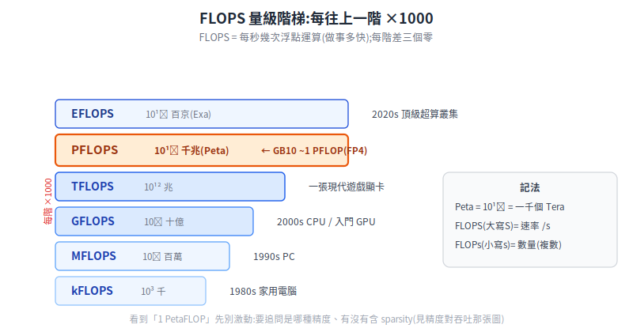
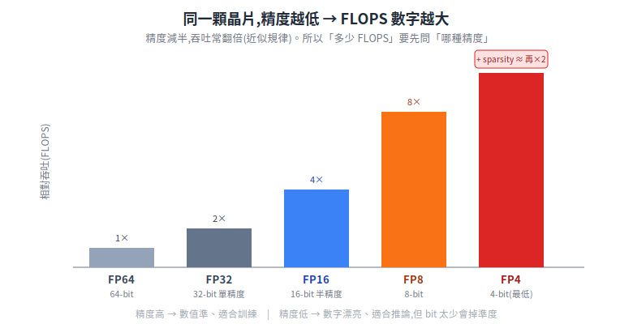
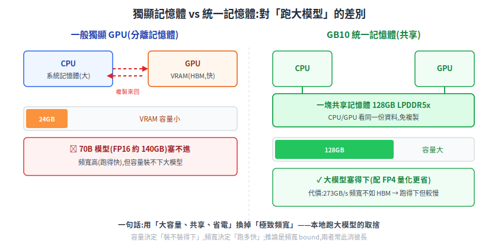
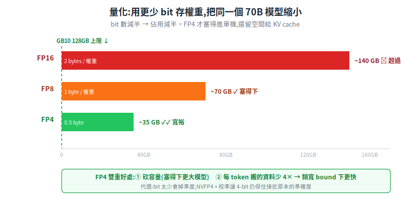

# 在 NVIDIA GB10(DGX Spark)上架本地 LLM:第一性原理

一句話定位:把上一篇講的「LLM/VLM 大腦」放進機器人**本機**跑——不靠雲端、不外傳資料、低延遲。本篇從第一性原理拆解兩件事:**(1) 跑 LLM 的真正瓶頸是什麼**(為什麼是記憶體而非算力),以及 **(2) NVIDIA 為桌上型本地 AI 推出的 GB10 superchip / DGX Spark** 為什麼這樣設計、適合與不適合什麼。

> 前置:建議先讀 [LLM 與 VLM 給機器人](./llm-vlm-for-robots.md)(token、權重、推論的概念)。
> 延伸閱讀:[Physical AI 總覽](../50-physical-ai/physical-ai-overview.md)、[系統架構](../00-overview/system-architecture.md)(機器人上位機)。

**重要:本篇所有產品數字(規格、價格、算力)都附官方來源 URL;查不到的標「待查證」,不臆造。** GB10 / DGX Spark 是 2025 年的新硬體,規格與價格會變動,以官方最新為準。

---

## 1. 先補基礎:FLOP / FLOPS 到底是什麼(每次都記不住的那個)

看硬體規格永遠會撞到「1 PetaFLOP」「1000 TOPS」這種數字。先把它一次講清楚,之後就不會再忘。

### 1.1 FLOP 與 FLOPS:差一個 s 差很多

- **FLOP** = **FL**oating-point **OP**eration,**一次浮點運算**(把兩個小數加起來、或乘起來,算一次)。它是「**做了多少事**」的單位(數量)。
- **FLOPS**(或 FLOP/s)= FLOP **per second**,**每秒做幾次浮點運算**。它是「**做事多快**」的單位(速率)。

最容易搞混的是大小寫與複數:

| 寫法 | 意思 |
|---|---|
| **FLOPs**(小寫 s,複數) | 「幾次運算」——數量。例:訓練這個模型花了 10²³ FLOPs |
| **FLOPS**(大寫 S,= /s) | 「每秒幾次」——速率。例:這顆晶片有 1 PFLOPS |

記法:**大寫 S 想成斜線 /s(速率);小寫 s 只是複數(數量)**。產品規格標的算力都是**速率(FLOPS)**——晶片每秒能算多少次。

### 1.2 數量級前綴:每階差 1000 倍

浮點運算的數字都很大,用前綴縮寫。每往上一階**乘以 1000**:

| 前綴 | 全名 | 倍數 | 生活化類比(想成「每秒算幾次」) |
|---|---|---|---|
| **kFLOPS** | kilo | 10³(千) | 1980 年代家用電腦等級 |
| **MFLOPS** | Mega | 10⁶(百萬) | 1990 年代 PC |
| **GFLOPS** | Giga | 10⁹(十億) | 2000 年代 CPU / 入門 GPU |
| **TFLOPS** | Tera | 10¹²(兆) | 現代一張遊戲顯卡的量級 |
| **PFLOPS** | **Peta** | **10¹⁵(千兆)** | 一台超級電腦 / 一櫃 AI 伺服器;**GB10 標稱 1 PFLOP(FP4)** |
| **EFLOPS** | Exa | 10¹⁸(百京) | 2020 年代頂級超算叢集 |

<p align="center"></p>

一個好記的錨點:**Peta = 10¹⁵ = 一千兆 = 一千個 Tera**。GB10 標稱「1 PetaFLOP」,意思是它(在特定條件下)每秒能做到 10¹⁵ 次浮點運算——但「特定條件」是重點,見下一節。

### 1.3 為什麼同一顆晶片有好幾個 FLOPS 數字:精度

同一顆晶片,你會看到它報 FP64、FP32、FP16、FP8、FP4 好幾個不同的 FLOPS,而且**越低精度數字越大**。為什麼?

- **精度** = 一個數字用幾個 bit 表示。FP32 = 32 bit(單精度),FP16 = 16 bit(半精度),FP8 = 8 bit,FP4 = 4 bit。bit 越多,能表示的範圍與細節越精確,但每次運算要搬/算的資料也越多。
- 硬體規律:**精度減半,吞吐常常翻倍**。原因有兩層:(1)算這種小數字的乘法器電路更小,同樣晶片面積能塞下更多個運算單元同時算;(2)每個數字佔的記憶體空間少一半,同一條「資料管路」單位時間能流過兩倍數量的數字。就像同一條水管,每個數字佔的水量小一半,單位時間就能流過兩倍數量——所以吞吐翻倍(這是近似規律,實際倍率看晶片設計)。

所以「這顆晶片多少 FLOPS」這個問題**沒有單一答案**,要先問「**哪種精度**」:

<p align="center"></p>

這帶出讀規格的鐵則:**看到「X PetaFLOP」一定要追問兩件事**——

1. **哪種精度?** 同一顆晶片 FP4 的數字可能是 FP16 的好幾倍。拿 FP4 的數字去比別人 FP16 的數字,是不公平比較。
2. **有沒有含 sparsity(稀疏)?** **sparsity** = 假設權重裡有很多 0(可跳過不算),廠商常報「含 2:4 結構化稀疏」的理論峰值。**2:4** 指「每 4 個權重裡固定有 2 個是 0」,硬體可跳過那 2 個不算,理論上速度翻倍——但實務上不一定吃得到。含 sparsity 的數字通常是不含的 **2 倍**。

### 1.4 怎麼把產品標稱「還原」成可比較的數字

以 GB10 官方標稱為例:**「up to 1 PFLOP FP4(含 sparsity)」**(來源見 §3)。把它拆開讀:

```
1 PFLOP  = 10^15 次/秒        ← 速率(注意:是「最高 up to」的理論峰值)
FP4      = 4-bit 精度          ← 最低精度,數字最漂亮
sparse   = 含稀疏假設,約 ×2   ← 去掉 sparsity 約剩一半 → ~0.5 PFLOP dense FP4
```

換算到大家熟悉的 FP16 來比,一步步算:`1 PFLOP(FP4, sparse)` → 去掉 sparsity(÷2)≈ `0.5 PFLOP`(FP4 dense)→ 換到 FP16(精度 4 倍、吞吐約 ÷4)≈ **`0.125 PFLOP = ~125 TFLOPS`(FP16 dense,理論值)**。注意這只是「拿同一條規則一路換」算出的理論上界;**實測**的 FP16/BF16 通用矩陣乘遠低於此(社群實測 GB10 約 11~12 TFLOPS,受記憶體與排程限制)——這也再次說明峰值規格和實際吞吐差很多。重點不是記住換算後的精確值,而是養成習慣:**任何「N PetaFLOP」都先問精度與 sparsity,再決定能不能跟另一個數字比**。

### 1.5 FLOPS 跟訓練 / 推論的關係

- **訓練**:用「總共要做幾次運算」(FLOPs 數量,大寫的反面)衡量成本——例如「訓練 GPT 級模型要 ~10²⁴ FLOPs」。算力(FLOPS 速率)越高,訓練越快。**訓練普遍需要較高精度**(FP16,或 **BF16**——另一種 16-bit 浮點,和 FP16 一樣 16 位但把更多位元分給「範圍」、較不易溢位,訓練常用;甚至部分 FP32)以維持數值穩定,所以低精度的漂亮 FLOPS 數字對訓練幫助有限。
- **推論**:機器人上跑的是推論。但這裡有個關鍵轉折——**推論(尤其逐 token 生成)的瓶頸往往不是 FLOPS,而是記憶體頻寬**。下一節就講這個第一性原理,它也是理解 GB10 設計取捨的鑰匙。

> TOPS(Tera Operations Per Second)是另一個常見單位,指「每秒幾兆次運算」,常用於整數(INT8)算力;1000 TOPS = 1 PetaOP/s。GB10 官方同時標「up to 1,000 TOPS」與「1 PFLOP FP4」描述同一顆晶片的不同講法。

---

## 2. 第一性原理:跑 LLM 的瓶頸是記憶體,不是算力

這是理解「為什麼需要 GB10 這種設計」的核心。直覺會以為「跑大模型 = 要很強的算力」,但對 LLM 推論,**真正卡住的常是記憶體**。

### 2.1 為什麼:每個 token 都要把整個模型搬一遍

LLM 推論是 autoregressive 的(見上一篇 §5),**每生成一個 token,都要把模型的權重讀出來算一遍**。生成階段(decode)一次只處理一個 token,這是個「**矩陣 × 向量**」運算——一次只算一個 token,就是「一個向量(這個 token)過一遍權重矩陣」;要是一次算很多個 token(下面會講的 prefill / batching),才會變成「矩陣 × 矩陣」。先看 batch=1 的 decode:

- 它要做的**運算量**不大(一個向量過一遍權重)。
- 但它要**讀取的資料量**很大(整組權重都得從記憶體搬到計算單元)。

於是計算單元大部分時間在**等記憶體把權重餵過來**,而不是在等算術。這種「算得快、但資料搬不夠快」的狀態,叫 **memory-bandwidth bound(記憶體頻寬受限)**。

```
單序列(batch=1, decode)每秒能生幾個 token
        ≈  記憶體頻寬(GB/s) ÷ 每個 token 要讀的權重(GB)
```

舉例(粗估,看數量級):一個 70B 模型用 FP16 存,權重約 140 GB。要生 1 個 token,理論上得把這 140 GB 讀一遍。記憶體頻寬若是 273 GB/s(GB10 的數字,見 §3),把單位帶進去算:`273 GB/s ÷ 140 GB/token ≈ 2 token/s`(實務還更低)。**換成資料中心級 HBM 就快得多**——HBM(High Bandwidth Memory,高頻寬記憶體)是一種堆疊式記憶體,頻寬可達數 TB/s(GB10 的數十倍),資料中心 GPU 在用;同一個模型在 HBM 上能快上十倍。看到了嗎——決定速度的是**頻寬**,不是 FLOPS。

> 兩個重要但容易被這條公式誤導的限定:
> - 這條公式**只適用 batch=1 的 decode**。**prefill**(一次把整段 prompt 餵進去、平行算多個 token)是矩陣×矩陣,算力才是瓶頸(compute-bound)。
> - **batching**(多個請求一起跑)會打破這條公式:多請求共用同一次權重讀取,總吞吐(throughput)可遠高於單序列估算——這正是 §6 的 vLLM 連續批次要做的事。所以拿這條式子估「一台機器服務很多人能多快」會嚴重低估。
> - 上式分母只算了**權重**;長序列時還要加上 **KV cache**(見 §2.2)的搬運量,故長對話的 token/s 會比這個估算更低。

### 2.2 兩個推論不直接看出來的事

- **權重必須整個放得進記憶體**:不然根本載不進來。所以「能不能跑這個模型」第一關是**記憶體容量**夠不夠裝下權重(再加上推論時的 KV cache 等開銷)。容量不夠 → 跑不了;容量夠但頻寬低 → 跑得慢。
- **「裝得下」和「跑得快」是兩回事**:大容量讓你**能**跑大模型,高頻寬讓你跑得**快**。這兩個指標常此消彼長,正是 GB10 設計取捨的重點。

> 名詞:**KV cache**(鍵值快取)= autoregressive 生成時,把已生成 token 的 key/value 暫存起來避免重算,代價是它會佔記憶體,且序列越長佔越多。長對話/長文件會吃掉可觀的記憶體。

來源(機制佐證):[NVFP4 技術部落格(NVIDIA Developer)](https://developer.nvidia.com/blog/introducing-nvfp4-for-efficient-and-accurate-low-precision-inference/)、[LLM 推論記憶體牆解析(IntoAI)](https://www.intoai.pub/p/a-hardware-level-tour-of-llm-inference)、[Micron — 高頻寬記憶體對推論的影響(廠商技術報告 PDF)](https://assets.micron.com/adobe/assets/urn:aaid:aem:c71563a1-3408-4bac-9262-145f3fddd82e/renditions/original/as/llm-inference-engineering-report.pdf)

---

## 3. NVIDIA GB10 / DGX Spark 是什麼(查證規格)

前面講的「跑大模型卡在記憶體容量與頻寬」,正是這台機器想解的問題:NVIDIA 為「在桌上就能塞下並跑大模型」推出了一台桌上型本地 AI 開發機。它的命名沿革容易混,先理清:

- **Project DIGITS**:2025 年 1 月 CES 發表時的**專案代號**。
- **DGX Spark**:2025 年 3 月 GTC 公布的**正式產品名**(一台桌上型小主機)。
- **GB10**:這台主機裡那顆 **Grace Blackwell Superchip**(把 ARM CPU + Blackwell GPU 整合在一個封裝裡的晶片)。

> 名詞:**superchip / SoC** = 把原本分離的 CPU、GPU 等整合進同一個封裝。**Grace** 是 NVIDIA 的 ARM CPU 品牌,**Blackwell** 是其 GPU 架構世代名。

### 3.1 官方規格(逐項附來源)

| 項目 | 數字 | 來源 |
|---|---|---|
| 全名 | NVIDIA GB10 Grace Blackwell Superchip | [DGX Spark 產品頁](https://www.nvidia.com/en-us/products/workstations/dgx-spark/) |
| 統一記憶體容量 | **128 GB LPDDR5x**,CPU/GPU 一致性共享 | [DGX Spark 硬體規格(官方 docs)](https://docs.nvidia.com/dgx/dgx-spark/hardware.html) |
| 記憶體頻寬 | **273 GB/s**(256-bit, 4266 MHz) | [同上(官方 docs)](https://docs.nvidia.com/dgx/dgx-spark/hardware.html) |
| AI 算力 | **最高 1 PFLOP at FP4**(含 sparsity)/ 最高 1,000 TOPS | [GTC 新聞稿](https://nvidianews.nvidia.com/news/nvidia-announces-dgx-spark-and-dgx-station-personal-ai-computers) |
| CPU | **20 核 Arm**(10× Cortex-X925 + 10× Cortex-A725),與 MediaTek 合作 | [DGX Spark 硬體規格(官方 docs)](https://docs.nvidia.com/dgx/dgx-spark/hardware.html) |
| GPU | Blackwell,6,144 CUDA cores,**第 5 代 Tensor Core**(原生 FP4) | [DGX Spark 硬體規格(官方 docs)](https://docs.nvidia.com/dgx/dgx-spark/hardware.html) |
| CPU↔GPU 互連 | **NVLink-C2C**(官方稱頻寬為第 5 代 PCIe 的 5 倍) | [GTC 新聞稿](https://nvidianews.nvidia.com/news/nvidia-announces-dgx-spark-and-dgx-station-personal-ai-computers) |
| 單機可跑模型 | **最高 ~200B 參數**;兩台串接 **~405B** | [DGX Spark 產品頁](https://www.nvidia.com/en-us/products/workstations/dgx-spark/) |
| 作業系統 | **NVIDIA DGX OS**(基於 Ubuntu 24.04,**aarch64 / ARM64**) | [DGX Spark — DGX OS(官方 docs)](https://docs.nvidia.com/dgx/dgx-spark/dgx-os.html) |

### 3.2 時程與價格(會變動,標日期與來源)

- **2025-01(CES)**:以 Project DIGITS 發表,當時宣稱 5 月上市、US$3,000 起。來源:[CES Project DIGITS 新聞稿(官方)](https://nvidianews.nvidia.com/news/nvidia-puts-grace-blackwell-on-every-desk-and-at-every-ai-developers-fingertips)、[TechCrunch](https://techcrunch.com/2025/01/06/nvidias-project-digits-is-a-personal-ai-computer/)
- **2025-03(GTC)**:正式命名 DGX Spark。來源:[GTC 新聞稿(官方)](https://nvidianews.nvidia.com/news/nvidia-announces-dgx-spark-and-dgx-station-personal-ai-computers)
- **2025-10-15**:實際開賣,Founders Edition US$3,999。來源(媒體):[Tom's Hardware](https://www.tomshardware.com/desktops/mini-pcs/nvidias-dgx-spark-ai-mini-pc-goes-up-for-sale-october-15-1-petaflop-developer-platform-was-originally-slated-for-may)
- **2026-02**:因 LPDDR5x 記憶體供應吃緊,MSRP 調漲 18% 至 US$4,699。來源(媒體):[Tom's Hardware](https://www.tomshardware.com/desktops/mini-pcs/nvidia-dgx-spark-gets-18-percent-price-increase-as-memory-shortages-bite-founders-edition-now-usd4-699-up-from-usd3-999)

> 價格以媒體報導為準(NVIDIA 官方產品頁未直接列價);最新價格請以官方/通路為準。

### 3.3 別跟 GB200 混淆

| | **GB10**(本篇,桌上型/開發者) | **GB200**(資料中心級) |
|---|---|---|
| 等級 | 個人 / 桌上 AI 開發 | AI factory / 機櫃級 |
| GPU 記憶體 | 128 GB **LPDDR5x**,273 GB/s | HBM3e,**數 TB/s** 級頻寬 |
| CPU | 20 核 Arm(Cortex-X925/A725) | Grace 72 核 Neoverse V2 |

兩者只是品牌系出同源(Grace Blackwell),**等級、記憶體型號、頻寬完全不同,不可混為一談**。GB200 的 HBM 頻寬是 GB10 的數十倍——這正好對應 §2「頻寬決定推論速度」:GB200 跑得快,GB10 勝在小、省電、能塞進桌上與大容量。來源:[GB200 NVL72(官方)](https://www.nvidia.com/en-us/data-center/gb200-nvl72/)

---

## 4. 第一性原理:統一記憶體為什麼是 GB10 的關鍵賣點

接 §2 的結論——跑大模型,**第一關是容量(裝得下),第二關是頻寬(跑得快)**。GB10 的核心設計選擇,就是用一種特別的記憶體架構去攻「容量」這一關。

### 4.1 獨顯 vs 統一記憶體

一般遊戲/工作站 GPU 用的是**獨立顯示記憶體**:GPU 有自己一塊很快的 VRAM(常是 HBM 或 GDDR),和 CPU 的系統記憶體分開。問題是這塊 VRAM 容量有限(消費級常 8~24 GB,專業級到數十 GB),**裝不下大模型的權重**——70B 模型 FP16 要 140 GB,塞不進一張 24 GB 的卡。

GB10 走的是**統一記憶體(unified memory)**:CPU 和 GPU **共享同一塊**大記憶體(128 GB LPDDR5x),而且是一致性(coherent)共享——兩邊看到的是同一份資料,不必在 CPU 記憶體和 GPU 記憶體之間複製來複製去。

<p align="center"></p>

### 4.2 取捨:容量換頻寬

統一記憶體用的是 **LPDDR5x**(低功耗 DDR,本來是手機/筆電在用的),好處是容量大、省電、能整合進小機身;代價是**頻寬遠低於獨顯的 HBM**(273 GB/s vs HBM 的數 TB/s)。

為什麼「容量能堆大、頻寬卻上不去」?這是兩種記憶體的物理取向不同:LPDDR 走的是「**省電、寬鬆時序、便宜**」路線,容易堆到大容量、塞進小機身,但代價是資料管路較窄;HBM 則把記憶體晶片**堆疊起來、緊貼 GPU、用極寬的匯流排**,換到數 TB/s 的頻寬,但又貴、又熱、容量受限。**容量與頻寬在這裡天生此消彼長**——GB10 選了前者(大容量、省電),正好對應「本地塞下大模型」的目標,而非追求最高吞吐。

把 §2 的原理套上去,結論很乾淨:

- **容量大(128 GB)** → 大模型權重**塞得進去**,單機能跑到 ~200B 級(獨顯小卡做不到)。這是 GB10 對「本地跑大模型」最大的價值。
- **頻寬較低(273 GB/s)** → 因為推論是頻寬 bound,所以**塞得下但 token/s 受限**——跑得動,但不如資料中心 HBM 那麼快。

**一句話:GB10 用「大容量、共享、省電」換掉「極致頻寬」,目標是讓你在桌上(或機器人本機)就能跑得起大模型,而不是追求最高吞吐。** 這個取捨對「本地、離線、隱私」的場景剛剛好。

---

## 5. 量化:把大模型塞進記憶體的關鍵手段(第一性原理)

就算有 128 GB,FP16 的 70B 模型也要 140 GB——還是裝不下。**量化(quantization)** 是讓大模型能塞進有限記憶體的核心手段。

### 5.1 原理:用更少 bit 存每個權重

量化 = **把每個權重用更少的 bit 表示**。FP16 一個權重 2 bytes,換成 INT8/FP8 變 1 byte,換成 INT4/FP4 變 0.5 byte。權重少佔位,整個模型就變小:

| 精度 | 每權重 | 70B 模型約佔(僅權重) | 相對 FP16 |
|---|---|---|---|
| FP16 | 2 bytes | ~140 GB | 1× |
| FP8 / INT8 | 1 byte | ~70 GB | 0.5× |
| FP4 / INT4 | 0.5 byte | **~35 GB** | **~0.25×** |

<p align="center"></p>

看出關鍵了:**FP4 把 70B 砍到 ~35 GB**,128 GB 的 GB10 不但塞得下,還留出空間給 KV cache 與更大的模型。這直接呼應 §3.1 的「單機可跑 ~200B 模型」——靠的就是低精度量化。

### 5.2 代價與為什麼 GB10 主打 FP4

量化不是免費的:bit 越少,能表示的數值越粗,**模型精度會下降**。所以重點是「**用最少的 bit,把精度損失壓到可接受**」。NVIDIA 在 Blackwell 推出 **NVFP4**——一種「用 4 個 bit 表示一個浮點數」的格式,搭配校準技術,讓大模型量化到 4-bit 仍能保住接近原本的準確度(官方稱可達 ~99% 準確度回復)。

> 想多知道一點:NVFP4 的 4 個 bit 怎麼分配?1 個位元記正負號、2 個位元記「指數」(大概多大,決定能表示的數值範圍)、1 個位元記「尾數」(在那個量級裡的細部)。重點不在記住分配方式,而在理解 4-bit 之所以還堪用,是因為它沒把 4 個位元平均切,而是聰明地保留了「範圍」。

GB10 主打 FP4 有雙重好處,正好打在前面兩條原理上:

1. **省容量(§5.1)**:FP4 把模型砍到 1/4,讓 128 GB 塞得進更大的模型。
2. **省頻寬(§2)**:推論是頻寬 bound,每個權重從 2 bytes 變 0.5 byte,**每個 token 要搬的資料也少了 4 倍** → 在同樣 273 GB/s 下,token/s 變快。

而且 GB10 的第 5 代 Tensor Core **原生支援 FP4 運算**(不是軟體模擬),所以低精度同時換到容量、頻寬、算力三重好處——這就是「為什麼 Blackwell 世代主打 FP4」的第一性原理答案。

來源:[NVFP4 技術部落格(NVIDIA Developer)](https://developer.nvidia.com/blog/introducing-nvfp4-for-efficient-and-accurate-low-precision-inference/)、[NVFP4 量化加速 LLM(Red Hat Developer)](https://developers.redhat.com/articles/2026/02/04/accelerating-large-language-models-nvfp4-quantization)

---

## 6. 怎麼架:軟體堆疊與 aarch64 注意事項

GB10 跑的是 **DGX OS**(基於 Ubuntu 24.04)、**aarch64(ARM64)** 架構。這一點很關鍵:**它不是 x86,有些 x86 預編好的二進位/容器在它上面跑不了**,要找 ARM64 版本或自己編。

### 6.1 常見軟體選項

| 工具 | 一句話 | 適合 | aarch64 / GB10 現況 |
|---|---|---|---|
| **Ollama** | 最易上手的本地 LLM 執行器(一行指令拉模型來跑) | 單機、單使用者、快速試 | 支援 ARM;DGX Spark 上可跑 |
| **llama.cpp** | 輕量 C++ 推論引擎,量化支援成熟 | 邊緣裝置、要榨硬體 | Arm 官方有「在 GB10 上 build GPU 版」教學 |
| **vLLM / SGLang** | 高吞吐推論伺服器(連續批次、PagedAttention) | 多併發、當服務後端 | 可用,但要確認容器/wheel 真的支援 arm64 |
| **TensorRT-LLM** | NVIDIA 官方,編成 TensorRT engine,吞吐最高 | 要極致效能、吃定 NVIDIA 生態 | 官方針對 Spark 優化 |
| **NVIDIA NIM** | 容器化推論微服務(底層常用 TensorRT-LLM) | 想要打包好、即插即用 | 針對 Spark 提供,用 NVFP4 量化 |

> 名詞:**aarch64 / ARM64** = ARM 架構的 64 位元指令集(手機、Apple Silicon、Grace CPU 都是)。與桌機常見的 **x86_64**(Intel/AMD)不相容,軟體要分別編譯。

務實建議:**先用 Ollama 或 llama.cpp 把模型跑起來驗證可行**(門檻最低),要做成多人共用的服務或追求吞吐,再上 vLLM / TensorRT-LLM / NIM。挑模型與量化時,優先選已有 **NVFP4 / GGUF 4-bit** 版本的,直接對上 §5 的容量與頻寬優勢。

來源:[Arm learning path — 在 GB10 build GPU 版 llama.cpp](https://learn.arm.com/learning-paths/laptops-and-desktops/dgx_spark_llamacpp/2_gb10_llamacpp_gpu/)、[DGX Spark Porting Guide(官方,軟體需求/aarch64)](https://docs.nvidia.com/dgx/dgx-spark-porting-guide/porting/software-requirements.html)

### 6.2 跟機器人結合:為什麼要「本機」跑

把 LLM/VLM 放在機器人本機(或廠區邊緣的一台 GB10),而非全部丟雲端,理由是三個第一性的需求:

- **延遲(latency)**:雲端來回有網路延遲與抖動;本機推論省掉這段,對「即時對話、即時看畫面回應」更穩。
- **隱私 / 資料不出場**:餐廳客人影像、廠區佈局、訂單內容不外傳,符合資安與法規(對醫院、半導體 fab 尤其重要,見 [半導體 fab AMR 規範](../60-compliance/semiconductor-amr-standards.md))。
- **離線可用**:網路斷了機器人不能變笨。本機大腦讓核心理解能力不依賴連線。

但要接回上一篇 §8.3 的分層原則:GB10 上的 LLM/VLM 負責**慢思考**(聽懂指令、看懂場景、決定做什麼),**安全攸關的快反應**(避障、急停、運動控制)仍交給跑在下位機/上位機的傳統、可驗證、高頻模組。大模型推論動輒數百毫秒,**絕不能**塞進需要 kHz 的控制迴圈。

---

## 7. 誠實盤點:GB10 適合與不適合什麼

| 適合 | 不適合 |
|---|---|
| 桌上型**本地 AI 開發 / 原型**:在自己機器上跑、調、測大模型 | **大規模訓練**:訓練大模型仍要資料中心叢集(HBM、多卡 NVLink) |
| 單機跑**中大型模型推論**(靠量化,~200B 級裝得下) | **超大模型 / 高併發服務**:頻寬 273 GB/s 限制吞吐,服務大量使用者要資料中心 GPU |
| **隱私 / 離線 / 低延遲**場景(資料不出場) | **追求最高 token/s**:要極致速度該選 HBM 的資料中心卡(GB200 等) |
| 機器人/邊緣的**本機大腦**(VLM/LLM 當高層理解) | **取代傳統安全控制層**:幻覺與延遲使其不能單獨負責安全攸關行為(見上一篇 §9) |

**所有效能數字都依條件而定**:標稱 1 PFLOP 是 FP4 + sparsity 的理論峰值(§1.4);實際 token/s 受模型大小、量化、批次、序列長度影響很大,且多數實測數字來自社群部落格而非官方基準——引用時要標明條件與來源,別當保證值。

---

## 8. 收束:三句話帶走

整篇可以濃縮成三件事。第一,跑 LLM 卡的常是**記憶體**而非算力——容量決定裝不裝得下、頻寬決定跑多快。第二,GB10 / DGX Spark 就是順著這條原理在做取捨:用 128 GB 統一記憶體買到「桌上塞得下大模型」,代價是 LPDDR5x 頻寬不如資料中心 HBM,再靠 FP4 量化同時壓低容量佔用與每 token 的搬運量。第三,它的定位是「本地、離線、隱私」的開發與部署機,不是訓練怪獸,也不該頂替機器人那層跑得快、可驗證的傳統控制。

順手養成一個習慣就好:看到任何「N PetaFLOP」,先問是**哪種精度**、**有沒有含 sparsity**(§1),再決定這個數字能不能信、能不能比。

---

## 來源 / 延伸

官方(可直接引用):
- [DGX Spark 產品頁](https://www.nvidia.com/en-us/products/workstations/dgx-spark/)
- [DGX Spark 硬體規格(官方 docs)](https://docs.nvidia.com/dgx/dgx-spark/hardware.html)
- [GTC 新聞稿(DGX Spark 正式發表)](https://nvidianews.nvidia.com/news/nvidia-announces-dgx-spark-and-dgx-station-personal-ai-computers)
- [CES 新聞稿(Project DIGITS)](https://nvidianews.nvidia.com/news/nvidia-puts-grace-blackwell-on-every-desk-and-at-every-ai-developers-fingertips)
- [NVFP4 技術部落格(量化)](https://developer.nvidia.com/blog/introducing-nvfp4-for-efficient-and-accurate-low-precision-inference/)
- [DGX Spark Porting Guide(aarch64 軟體需求)](https://docs.nvidia.com/dgx/dgx-spark-porting-guide/porting/software-requirements.html)
- [GB200 NVL72(對照資料中心級)](https://www.nvidia.com/en-us/data-center/gb200-nvl72/)

輔助(媒體/技術文章,已標明非官方):
- 價格時程:[Tom's Hardware(上市)](https://www.tomshardware.com/desktops/mini-pcs/nvidias-dgx-spark-ai-mini-pc-goes-up-for-sale-october-15-1-petaflop-developer-platform-was-originally-slated-for-may)、[Tom's Hardware(漲價)](https://www.tomshardware.com/desktops/mini-pcs/nvidia-dgx-spark-gets-18-percent-price-increase-as-memory-shortages-bite-founders-edition-now-usd4-699-up-from-usd3-999)
- 換算/實測分析:[LMSYS — DGX Spark 評測](https://www.lmsys.org/blog/2025-10-13-nvidia-dgx-spark/)
- 推論記憶體瓶頸:[IntoAI — LLM 推論記憶體牆](https://www.intoai.pub/p/a-hardware-level-tour-of-llm-inference)、[Micron — HBM 對推論影響(PDF)](https://assets.micron.com/adobe/assets/urn:aaid:aem:c71563a1-3408-4bac-9262-145f3fddd82e/renditions/original/as/llm-inference-engineering-report.pdf)
- 軟體:[Arm learning path(llama.cpp on GB10)](https://learn.arm.com/learning-paths/laptops-and-desktops/dgx_spark_llamacpp/2_gb10_llamacpp_gpu/)

**待查證項目**(寫作時未在 NVIDIA 官方頁找到明確數字):
- GB10 NVLink-C2C 的**確切頻寬 GB/s**(官方僅說「第 5 代 PCIe 的 5 倍」;媒體推估 ~600 GB/s 待官方確認)。
- GPU **製程節點**(部分媒體稱 3nm,未在官方頁確認)。
- 各引擎**實測 token/s**(均為社群部落格數字,非官方基準)。
- FP4→FP16 的**等效 FLOPS 換算值**:文中 ~125 TFLOPS 為依「sparsity ÷2、精度 ÷4」理論換算;~11~12 TFLOPS 為社群實測,均非 NVIDIA 官方基準。
