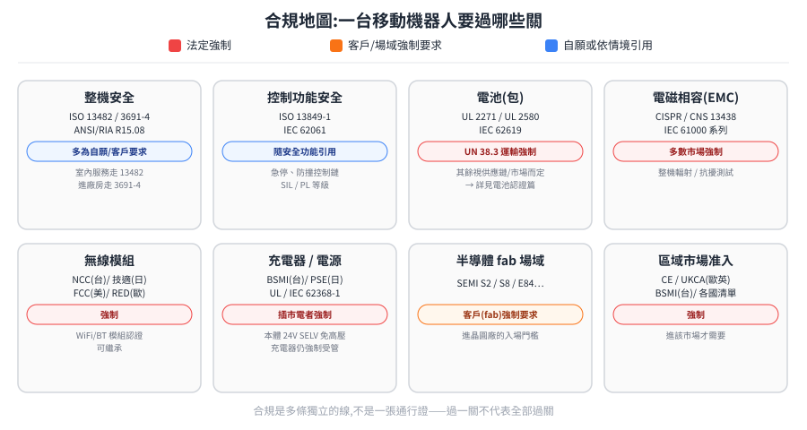

# 法規與認證(Compliance)

一個機器人產品要出貨,**過得了技術不代表過得了法規**。同一台送餐機器人,進餐廳、進醫院、進半導體廠,要符合的標準完全不同。這一章把「除了技術以外要過的關」整理成一張地圖,讓規劃期就把合規成本估進去,而不是上市前才發現卡關。

> 延伸閱讀:[電源與安全 §18](../10-core/10-hardware/power-and-safety.md)(電壓法規 SELV、日台標準)是這章的硬體源頭。

---

## 合規地圖:一台移動機器人要過哪些關

八個面向各自獨立,顏色是強制力等級——紅色是法規強制、橘色是客戶或場域說了算、藍色是自願或被其他標準引用時才適用:

藍色與橘色都可能寫著「客戶要求」,差別在**沒過會怎樣**:整機安全那格是藍的,因為客戶可能要求但不過也還有得談;fab 場域那格是橘的,因為那是進不進得了廠的門檻,沒過就是零。

| 面向 | 主要標準 | 強制/自願 | 備註 |
|---|---|---|---|
| **整機安全** | ISO 13482(個人照護機器人)、ISO 3691-4(工業 AMR/AGV)、ANSI/RIA R15.08(美 AMR) | 多為自願/客戶要求 | 室內服務走 ISO 13482;進廠房走 ISO 3691-4 |
| **控制功能安全** | ISO 13849-1、IEC 62061 | 隨安全功能引用 | 急停、防撞這條控制鏈要多可靠,用 PL / SIL 等級量化 |
| **電池(包)** | [UL 2271 / UL 2580](battery-certification.md)、UN 38.3、IEC 62619 | UN 38.3 運輸**強制** | 見電池認證篇 |
| **電磁相容 EMC** | CNS 13438(對應 CISPR 22)、IEC 61000 系列 | 多數市場**強制** | 整機輻射/抗擾 |
| **無線模組** | 台 NCC、日「技適」、美 FCC、歐 RED | **強制** | WiFi/BT 模組認證可繼承 |
| **充電器/電源** | 台 BSMI、日 PSE、UL/IEC 62368-1 | 插市電者**強制** | 機器人本體 24V SELV 免高壓法規,但充電器一定管 |
| **半導體 fab 場域** | [SEMI S2/S8/E84…](semiconductor-amr-standards.md) | 客戶(fab)**強制要求** | 進晶圓廠的入場門檻 |
| **區域市場准入** | CE/UKCA(歐英)、BSMI(台)、各國強制清單 | **強制** | 進該市場才需要 |

> 表格裡三個會反覆出現的縮寫,先在這裡釘住:**PL(Performance Level)** 是 ISO 13849 用來量化「一個安全功能有多可靠」的等級,a 到 e 五級;**SIL(Safety Integrity Level)** 是 IEC 62061 / IEC 61508 體系的同類概念,1 到 4 級,兩套可互相對照但不是同一把尺(注意這個縮寫在模擬領域另有 Software-in-the-Loop 的意思,兩者無關)。**SELV(Safety Extra-Low Voltage,安全特低電壓)** 指低到不會電死人的電壓等級,機器人本體走 24V/48V 就落在這裡。
>
> **ISO 13482 的正式範圍是「個人照護機器人」(personal care robots)**,分成移動僕從、身體輔助、載人三型——業界常用「服務機器人」通俗代稱,但它其實是服務機器人裡的一個子集,不涵蓋工業機器人與時速 20 km/h 以上的載具。

## 三個容易被忽略的第一性原理

1. **「免高壓法規」≠「免一切法規」**:選 24V/48V(SELV 安全特低電壓)讓觸電面的合規幾乎歸零(見 [§18.1](../10-core/10-hardware/power-and-safety.md)),但 EMC、無線、電池運輸、充電器這幾關照樣要過。合規是**多條獨立的線**,不是一張通行證。
2. **場域決定標準,不是機型決定**:同一台 AMR,進餐廳(ISO 13482)、進工廠(ISO 3691-4)、進晶圓廠(SEMI)要過的關完全不同。**先確定目標場域,再回推要哪些認證**。
3. **認證可繼承、可分層**:無線模組、充電器選「已有認證的現成件」,自己只剩整機 EMC 要過;電池分電芯(IEC 62619)/包(UL 2271/2580)/運輸(UN 38.3)三層,各管各的。把可繼承的繼承掉,合規成本能砍掉一大塊。

## 本章文件

- [電池認證法規](battery-certification.md) — UL 2271 vs UL 2580、LFP、金屬外殼、供應商、配套標準
- [半導體 fab AMR 規範](semiconductor-amr-standards.md) — SEMI S2/S8/E84、AMHS、潔淨室/ESD、ISO 3691-4
- [PwC、SEMI E187 與 ISO 3691 認證角色](pwc-semi-iso3691-certification.md) — PwC 顧問/評估 vs 官方檢測發證、SEMI E187 資安認驗證、ISO 3691-1/3691-4 分界
