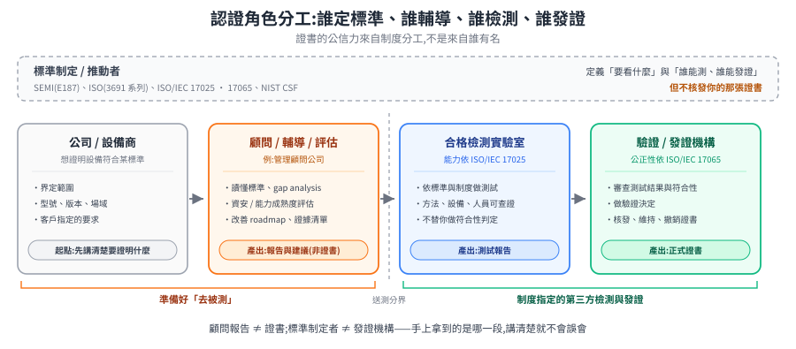

# PwC、SEMI E187 與 ISO 3691:認證角色怎麼分

這篇不是再列一堆標準,而是整理一個實務上很容易混在一起的問題:

> 聽到「PwC / SEMI / ISO 3691 認證」時,到底誰是標準制定者、誰是顧問、誰能檢測、誰能發證?
>
> (**PwC**,PricewaterhouseCoopers,四大專業服務事務所之一,提供審計、稅務與管理顧問服務。這裡它扮演的是顧問/評估角色。)

先給結論:**PwC 比較像顧問 / 輔導 / 評估角色;SEMI 是標準與產業平台;正式認驗證要看該標準自己的制度與合格第三方機構。** 對機器人或無人叉車來說,ISO 3691 系列又是另一條「工業車輛安全」線,不能跟 SEMI E187 的半導體設備資安認證混成同一張證書。

> 本篇起點是一份內部討論筆記,裡面提到 PwC Taiwan、SEMI E187、ISO/IEC 17025 / 17065、ISO 3691-1 / 3691-4 這幾條線混在一起。以下整理成可讀的專欄。標準與認證制度會更新,實際引用前仍要以 SEMI、主管機關、客戶規範與檢測 / 驗證機構的最新文件為準。

---

## 1. 先釘住四種「認證角色」

很多誤會來自「做認證」這句話太模糊。它至少可能指四種角色:

| 角色 | 它做什麼 | 典型產出 |
|---|---|---|
| **標準制定 / 推動者** | 定義標準內容、推動產業共識 | 標準文件、導入指南、產業制度 |
| **顧問 / 輔導 / 評估者** | 幫企業讀懂標準、做差距分析、建立改善計畫 | gap analysis、成熟度評估、改善建議、預稽核報告 |
| **檢測實驗室** | 依制度與測試方法做測試 | 測試報告、實驗室檢測結果 |
| **驗證 / 發證機構** | 依制度審查測試與管理證書 | 驗證決定、證書、維持 / 撤銷管理 |

**第一性原理**:證書的公信力不是來自「誰很有名」,而是來自**制度分工**。標準制定者不能隨便等於發證者;顧問協助你準備,也不必然等於官方認證機構;檢測與驗證通常要維持第三方公正性。

---

## 2. PwC 與 SEMI E187:顧問 / 評估,不等於官方發證

`SEMI E187` 是半導體設備資安標準,關心的是半導體設備在資安上的基本防護能力。來源筆記把它簡化成四個面向:

1. **作業系統支援**:設備使用的 OS 是否仍受支援、能否維護更新。
2. **網路安全**:網路服務、連線、遠端存取、分段與防護是否可控。
3. **端點防護**:設備本體是否具備惡意程式、防竄改、存取控制等防護。
4. **安全監控**:事件紀錄、異常偵測、資安監控與回應能力。

PwC Taiwan 的定位,可以直接從其半導體服務頁的「資安策略與 AI 治理」段落讀到:PwC 表示會結合 **NIST 網路安全框架(CSF)**、**產業標準 SEMI E187**、以及 **CMMI 能力成熟度模型**,協助企業建立可衡量的供應商資安風險管理方案。這個外部頁面很適合拿來佐證「PwC 是協助導入 / 評估」而不是「PwC 發 SEMI 證書」。

- PwC Taiwan 半導體服務頁:<https://www.pwc.tw/zh/industries/semiconductor.html>
- NIST Cybersecurity Framework:<https://www.nist.gov/cyberframework>
- CMMI Institute:<https://cmmiinstitute.com/>

所以這類工作非常有價值,但它的性質比較接近:

- SEMI E187 導入輔導;
- 資安成熟度評估;
- 差距分析;
- 改善 roadmap;
- 認證 / 稽核前準備;
- 對客戶問卷或供應商資安要求的回覆整理。

它**不等於**「PwC 自己就是 SEMI E187 官方發證單位」。

比較精準的內部說法可以是:

> PwC 可協助企業依 SEMI E187、NIST CSF 等框架進行資安成熟度評估、差距分析與改善建議;但是否正式取得 SEMI E187 相關認驗證,仍需依該認驗證制度,由合格實驗室 / 驗證機構完成檢測與驗證。

---

## 3. SEMI E187 正式認驗證:看制度,不看顧問名氣

SEMI 官方商店頁把 `SEMI E187` 命名為 **Specification for Cybersecurity of Fab Equipment**(晶圓廠設備資安規範),這也說明它本質上是「fab equipment 資安」標準,不是一般機器人移動安全標準。

- SEMI E187 官方頁:<https://store-us.semi.org/products/e18700-semi-e187-specification-for-cybersecurity-of-fab-equipment>

來源筆記提到:台灣的 SEMI E187 認驗證制度由**數位發展部數位產業署**與 **SEMI** 共同推動,並依循 `ISO/IEC 17025` 與 `ISO/IEC 17065` 建立第三方公正性的架構。這裡要把兩件事分開看:

- **SEMI E187**:定義設備資安要看什麼。
- **ISO/IEC 17025 / 17065**:定義「誰來測、誰來驗證」要怎麼維持能力與公正性。

這兩個 ISO/IEC 標準不是機器人本體標準,而是「認驗證制度如何可信」的底層規則:

| 標準 | 管什麼 | 對 SEMI E187 認驗證的意義 |
|---|---|---|
| **ISO/IEC 17025** | 檢測與校正實驗室能力 | 實驗室要能證明測試方法、設備、品質系統與人員能力可靠 |
| **ISO/IEC 17065** | 產品、流程與服務驗證機構 | 發證 / 驗證機構要有公正性、審查流程與證書管理能力 |

參考入口:

- ISO/IEC 17025 官方搜尋入口:<https://www.iso.org/search.html?q=ISO%2FIEC%2017025>
- ISO/IEC 17065 官方搜尋入口:<https://www.iso.org/search.html?q=ISO%2FIEC%2017065>
- IAF(International Accreditation Forum)認可機構入口:<https://iaf.nu/en/accreditation-bodies/>

把第 1 節那四種角色排成一條線,就能看出誰站在哪一段:

圖上有兩個容易被忽略的位置。最上面那條虛線框是**站在流程之外的標準制定者**:SEMI 定義 E187 要看什麼、ISO/IEC 17025 與 17065 定義誰有資格測與發證,但它們都不會核發你手上那張證書。中間那條「送測分界」則分開兩種性質完全不同的工作——分界左邊是你自己(與顧問)把東西準備好,右邊是制度指定的第三方來判定。顧問可以把你推到分界線前,推不過去。

反過來說,這條線也解釋了顧問的價值在哪:分界右邊只認證據,而把散落的控制項整理成可審查的證據,正是分界左邊那段工作。

---

## 4. SEMI E187 跟既有 fab AMR SEMI 標準不是同一層

本 repo 已有 [半導體 fab AMR 規範](semiconductor-amr-standards.md),主要討論:

- `SEMI S2 / S8 / S14 / S22`:環安衛、安全、人因、火災、電氣;
- `SEMI E84 / E87 / E88 / E10`:FOUP 交接、載具管理、倉儲、稼動率;
- `ISO 14644 / ESD / out-gassing`:潔淨室適用性;
- `ISO 13849 / ISO 3691-4 / ANSI R15.08`:功能安全與移動車輛安全。

`SEMI E187` 是**資安**線,跟上面這些不是互斥,而是疊加。

對一台要進 fab 的 AMR / AGV / 無人叉車,可以把合規地圖想成五層:

| 層 | 問題 | 常見標準 / 制度 |
|---|---|---|
| 場域環安衛 | 進晶圓廠會不會造成 EHS 風險? | SEMI S2、S8、S14、S22 |
| 搬運交接 | 能不能跟 load port / AMHS 正確交接? | SEMI E84、E87、E88 |
| 潔淨室 | 會不會吐塵、放電、逸氣? | ISO 14644、ESD、out-gassing 要求 |
| 移動安全 | 會不會撞人、夾人、失控? | ISO 3691-4、ISO 13849、ANSI/RIA R15.08 |
| 資安 | 設備會不會變成廠內攻擊面? | SEMI E187、NIST CSF、客戶資安規範 |

**重點**:拿到某一層的評估或認證,不會自動覆蓋其他層。例如 SEMI E187 資安評估不會取代 ISO 3691-4 防撞安全;ISO 3691-4 也不會證明設備符合 SEMI E187 資安要求。

---

## 5. ISO 3691:一般叉車 vs 無人叉車,要分 3691-1 與 3691-4

來源筆記提到「3691 叉車規範」,通常指 `ISO 3691` 系列:

> **Industrial trucks — Safety requirements and verification**
> 工業車輛的安全要求與驗證。

ISO 官方搜尋入口可用來查最新版本與修訂:

- ISO 3691-1 官方搜尋入口:<https://www.iso.org/search.html?q=ISO%203691-1>
- ISO 3691-4 官方搜尋入口:<https://www.iso.org/search.html?q=ISO%203691-4>
- ISO 3691-4 標題也常見於第三方標準商頁面,完整名稱為 *Industrial trucks — Safety requirements and verification — Part 4: Driverless industrial trucks and their systems*(例如 ANSI Webstore:<https://webstore.ansi.org/standards/iso/iso36912020>)。

這條線跟 SEMI E187 完全不同。SEMI E187 管資安;ISO 3691 管工業車輛 / 叉車安全。

| 場景 | 對應標準 | 說明 |
|---|---|---|
| 一般有人駕駛叉車、堆高機 | **ISO 3691-1** | 適用於有人駕駛的 self-propelled industrial trucks,如 counterbalance forklift、reach truck、pallet truck、stacker 等 |
| AGV / AMR / 無人叉車 | **ISO 3691-4** | 適用於 driverless industrial trucks 與其系統,常見包含 AGV、AMR、自動搬運車、無人叉車 |

如果場景是「上層調度軟體控制無人叉車或 AMR 叉車」,通常更關鍵的是 **ISO 3691-4**,不是 3691-1。原因很直覺:

- 有人駕駛叉車的風險核心是「駕駛員如何安全操作車」。
- 無人叉車的風險核心是「沒有駕駛員時,系統如何自己偵測人、避障、停車、限制速度、管理區域」。

所以無人車要看的是:

- 人員偵測與防撞;
- protective stop / emergency stop;
- 速度限制與轉彎限制;
- 感測器覆蓋區域;
- 自動 / 手動模式切換;
- 系統整合後的場域驗證;
- 安全控制鏈對應的功能安全等級,通常會牽到 ISO 13849。

---

## 6. 常見誤解與正確說法

### 誤解 A:「PwC 有做 SEMI E187,所以 PwC 發 SEMI 認證」

較精準:PwC 可協助 SEMI E187 導入、資安成熟度評估與差距補強;正式認驗證仍要依 SEMI E187 認驗證制度,由合格檢測 / 驗證機構完成。

### 誤解 B:「SEMI E187 過了,就代表機器人進 fab 沒問題」

較精準:SEMI E187 只處理資安面。進 fab 還要看 SEMI S2/S8/S14/S22、E84/E87、潔淨室、ISO 3691-4、電池、EMC、無線、充電器等要求。

### 誤解 C:「ISO 3691 就是叉車,所以 AMR 叉車看 3691-1」

較精準:有人駕駛工業車輛偏 ISO 3691-1;driverless industrial trucks / AMR / AGV / 無人叉車偏 ISO 3691-4。

### 誤解 D:「顧問報告就是認證證書」

較精準:顧問報告可作為導入與改善依據,也可幫助準備認證,但正式證書要看是否由制度認可的驗證機構核發。

---

## 7. 對外回覆範本

如果公司內部要回客戶或同事,可以用這段較不會踩雷的寫法:

> 我們理解 PwC 與 SEMI E187 的關係比較偏向顧問、導入輔導與評估角色。SEMI E187 是 SEMI 推動的半導體設備資安標準;台灣的正式認驗證制度則由數位發展部數位產業署與 SEMI 共同推動,並依 ISO/IEC 17025、ISO/IEC 17065 建立第三方檢測與驗證架構。
>
> PwC 可協助企業依 SEMI E187、NIST CSF 等框架進行資安成熟度評估、差距分析與改善建議,但不代表 PwC 本身就是 SEMI E187 的官方發證單位。若要確認是否正式取得認證,仍需依 SEMI E187 認驗證制度,由合格實驗室 / 驗證機構完成檢測與驗證。
>
> 另外,ISO 3691 是工業車輛安全要求與驗證標準系列;有人駕駛叉車偏 ISO 3691-1,AGV / AMR / 無人叉車通常更關鍵的是 ISO 3691-4。這條線處理移動安全,不等同於 SEMI E187 的資安認證。

---

## 8. 導入時的工作清單

若目標是「半導體廠用 AMR / 無人叉車」,可以把認證準備拆成這樣:

- [ ] 先確認目標場域:一般工廠、倉庫、半導體 fab、潔淨室、或客戶指定區域。
- [ ] 確認車種:有人駕駛叉車、AGV、AMR、無人叉車、或改裝既有叉車。
- [ ] 若是無人叉車 / AMR:優先評估 **ISO 3691-4** 與功能安全鏈路。
- [ ] 若要進 fab:接上 [半導體 fab AMR 規範](semiconductor-amr-standards.md) 的 SEMI S / E 系列與潔淨室要求。
- [ ] 若客戶要求設備資安:評估 **SEMI E187**、NIST CSF、資產盤點、OS 支援、網路面、端點防護、監控紀錄。
- [ ] 分清楚「顧問輔導」與「正式檢測 / 驗證」的供應商角色。
- [ ] 對每一張證書 / 報告建立證據清單:測試項目、測試實驗室、驗證機構、有效期限、適用型號、適用場域。

---

## 9. 外部參考 URL

本篇用到的外部入口集中如下,方便回查與更新:

| 主題 | URL | 本篇用途 |
|---|---|---|
| PwC Taiwan 半導體服務 | <https://www.pwc.tw/zh/industries/semiconductor.html> | 佐證 PwC 把 NIST CSF、SEMI E187、CMMI 用於供應鏈資安成熟度評估;定位為顧問 / 輔導 / 評估 |
| SEMI E187 官方頁 | <https://store-us.semi.org/products/e18700-semi-e187-specification-for-cybersecurity-of-fab-equipment> | 佐證 SEMI E187 是 fab equipment cybersecurity specification |
| NIST CSF | <https://www.nist.gov/cyberframework> | PwC 服務頁提到的資安框架之一 |
| CMMI Institute | <https://cmmiinstitute.com/> | PwC 服務頁提到的成熟度模型來源 |
| ISO/IEC 17025 搜尋入口 | <https://www.iso.org/search.html?q=ISO%2FIEC%2017025> | 查檢測 / 校正實驗室能力標準 |
| ISO/IEC 17065 搜尋入口 | <https://www.iso.org/search.html?q=ISO%2FIEC%2017065> | 查產品 / 流程 / 服務驗證機構標準 |
| IAF 認可機構入口 | <https://iaf.nu/en/accreditation-bodies/> | 補充第三方驗證 / 認可制度的角色 |
| ISO 3691-1 搜尋入口 | <https://www.iso.org/search.html?q=ISO%203691-1> | 查有人駕駛工業車輛安全要求 |
| ISO 3691-4 搜尋入口 | <https://www.iso.org/search.html?q=ISO%203691-4> | 查 driverless industrial trucks / AGV / AMR 安全要求 |
| ANSI Webstore: ISO 3691-4 | <https://webstore.ansi.org/standards/iso/iso36912020> | 補充 ISO 3691-4 英文標題與版本資訊入口 |

> 註:ISO / SEMI 標準原文多半需要購買;上面 URL 是公開入口與標題 / 範圍查核點。真正做認證時,仍要用正式購買的標準原文、客戶最新規範與當期認驗證制度文件。

---

## 10. 一句話總結

**PwC 可以幫你準備 SEMI E187;SEMI / 制度決定標準與認驗證框架;合格實驗室與驗證機構才處理正式檢測與發證;ISO 3691-4 則是無人叉車 / AMR 的移動安全線,跟 SEMI E187 資安線並行不互相取代。**
