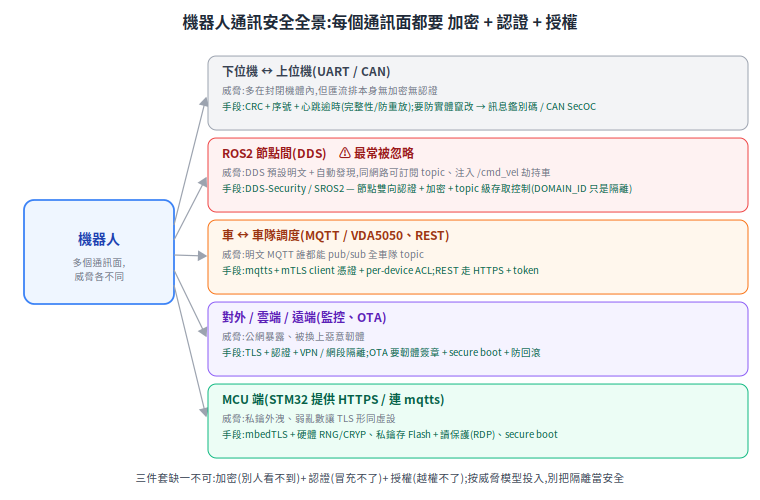

# 機器人通訊安全(總覽)

把機器人攤開,它有**好幾個通訊面**(下位機鏈路、ROS2 節點間、車隊調度、對外雲端、MCU 端),每個面的威脅與手段都不同。確保安全不是一招,而是**每個面都把「加密、認證、授權」三件套配齊**,再按威脅模型決定投入多少。這份是資安主題的入口,把散在各章的安全篇聚合成一個「資安視角」的階層。

## 通訊面與對應手段

| 通訊面 | 威脅 | 成熟手段 | 詳細子篇 |
|---|---|---|---|
| **下位機↔上位機**(UART/CAN) | 封閉但匯流排無加密無認證 | CRC + 序號 + 心跳(完整性/防重放);要防竄改 → SecOC | [上下位機協議](../20-firmware/host-mcu-protocol.md) |
| **ROS2 節點間**(DDS) | ⚠ 預設明文,同網路可注入 `/cmd_vel` | DDS-Security / SROS2:認證 + 加密 + ACL | [DDS 簡介](../40-fleet/ros2-dds-intro.md)(SROS2 待專文) |
| **車↔車隊**(MQTT/VDA5050、REST) | 明文誰都能 pub/sub | mqtts + mTLS + ACL;HTTPS + token | [MQTT over TLS(EMQX)](../40-fleet/mqtt-tls-emqx.md) |
| **對外/雲端/OTA** | 公網暴露、惡意韌體 | TLS + VPN;韌體簽章 + secure boot | (待專文) |
| **MCU 端** | 私鑰外洩、弱亂數 | mbedTLS + 硬體 RNG/CRYP + RDP | [STM32 REST+TLS](../20-firmware/stm32-rest-tls.md) |

## 三件套:加密 + 認證 + 授權(缺一不可)

- **加密(機密性)**:別人看不到。只做這個 = 上鎖的門但鑰匙人人有。
- **認證(身份)**:冒充不了。確認連進來的是授權設備。
- **授權(權限)**:越權不了。每個身份只碰自己該碰的(最小權限)。

每個通訊面都該三件一起,不能只加密。

## 橫切原則

- **威脅模型決定強度**:封閉機體內部 / 共享內網 / 連公網,威脅天差地遠,投入也該不同。
- **金鑰與憑證生命週期**:per-device 簽發、輪換、撤銷(CRL/OCSP)、過期監控——一台被偷要能單獨吊銷。
- **別把隔離當安全**:`ROS_DOMAIN_ID`、VLAN 是隔離,不等於認證加密。
- **網路分段**:機器人網段別跟公網 / IT 網混;不必要的 port 不開。
- **安全開機 + 韌體簽章**:防止被換上惡意韌體。

## 誠實的現況

技術其實都成熟、現成可用(SROS2、EMQX mTLS+ACL、mbedTLS、OTA 簽章),問題幾乎都在「**有沒有真的開**」:

- **最常見的洞是 ROS2 DDS 明文裸奔**——假設「反正在內網」,但內網一旦被滲透就能注入 `/cmd_vel` 控車。SROS2 能解,但因憑證 / 運維成本,開的人不多。
- **MQTT 常只開 TLS 不做 mTLS/ACL**——加密了,認證授權沒做,半套。
- **下位機鏈路多半靠物理封閉**——送餐機可接受,工規 / 車規才上 SecOC。

務實的答案:**逐個通訊面盤點,把三件套補齊到符合該面的威脅模型**——重點不是高深技術,而是把現成機制真的開起來、把憑證和權限管好。最該先補的,通常是被當成「反正在內網」而裸奔的 DDS 層。

## 子主題

**已有**:
- [MCU 端:STM32F4 上的 REST API + TLS 1.2](../20-firmware/stm32-rest-tls.md)
- [車隊:MQTT over TLS(用 EMQX)](../40-fleet/mqtt-tls-emqx.md)
- [ROS2 的 DDS](../40-fleet/ros2-dds-intro.md)(含 DDS-Security 概念與「別把隔離當安全」)
- [上下位機通訊協議](../20-firmware/host-mcu-protocol.md)(CRC / 序號 / 心跳的完整性)

**待寫**:
- ROS2 DDS-Security / SROS2 的實作(憑證、access control、效能取捨)
- OTA 韌體簽章 + secure boot
