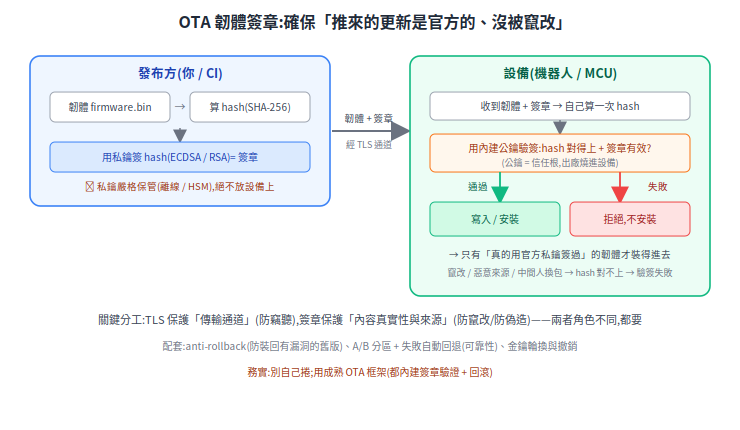

# OTA 更新的韌體簽章(code signing)

OTA(Over-The-Air)推更新很方便,但要怎麼確保「**推來的是官方的、沒被竄改**」?靠**簽章驗證**。

先釐清:機器人的 OTA 其實分兩種——**上位機軟體**(Linux 上的容器 / 套件 / 應用)與**下位機 MCU 韌體**(`.bin`)。**ROS2 本身沒有官方 OTA 框架**(它是中介軟體);更新靠底層 OS / 容器 / bootloader 的機制。但不論哪種,核心都是同一件事:用簽章證明韌體來源與完整性。

> 前置:[資安總覽](README.md)、[STM32 REST+TLS](../20-firmware/stm32-rest-tls.md)(MCU 端 TLS)。

---

## 1. 第一性原理:TLS 不夠,要簽章

威脅:OTA 通道被中間人攔截、或更新伺服器被入侵 → 推一份惡意韌體下來,設備被植後門。

很多人以為「用 HTTPS 下載就安全了」——不對。**TLS 保護的是「傳輸通道」不被竊聽 / 竄改,但不保證「內容來源可信」**(你連到一台惡意 server,它也能跟你好好做 TLS)。要保證「這份韌體真的是官方發的、沒被動過」,得靠**簽章**。

- **TLS**:保護**通道**(防竊聽)。
- **簽章**:保護**內容的真實性與來源**(防竄改、防偽造)。

兩者角色不同,**都要**。

## 2. 簽章 / 驗章流程

- **發布方**:算韌體的 hash(SHA-256)→ 用**私鑰**簽(ECDSA / RSA / Ed25519)→ 韌體 + 簽章一起發。
- **設備**:收到 → 自己算一次 hash → 用**內建公鑰**驗簽。hash 對得上且簽章有效才安裝;否則拒絕。
- **信任根**:公鑰出廠燒進設備(理想是不可變的 OTP / ROM);私鑰**嚴格保管**(離線 / HSM),絕不放設備上。

竄改、惡意來源、中間人換包——任一種都會讓 hash 對不上或簽章無效,**驗簽失敗就不裝**。

## 3. 機器人的兩種 OTA + 成熟工具

**別自己捲簽章機制**,用成熟框架(都內建簽章驗證 + 失敗自動回退):

- **上位機(Linux SBC / 工控機)**:[Mender](https://mender.io)、[RAUC](https://rauc.io)、[SWUpdate](https://sbabic.github.io/swupdate/)、OSTree——做 image 簽章 + **A/B 分區 + 失敗自動回退**;[Eclipse hawkBit](https://www.eclipse.org/hawkbit/) 當更新管理後端(可搭上述)。容器 / 套件層另有 GPG 簽章(apt)、image 簽章。
- **下位機(MCU,如 STM32)**:[MCUboot](https://www.mcuboot.com/) 在更新時**驗 image 簽章**(Ed25519 / ECDSA / RSA),配 [Memfault](https://docs.memfault.com/docs/platform/ota)、Golioth 等平台管理;[Zephyr 的 OTA](https://docs.zephyrproject.org/latest/services/device_mgmt/ota.html) 也走 MCUboot。

## 4. 關鍵要點

- **私鑰保管**:離線 / HSM;一旦外洩,整批設備都可能被植入惡意韌體——這是最高風險點。
- **公鑰信任根**:出廠燒進設備,理想放在不可變的 OTP / ROM。
- **TLS + 簽章兩者都要**:通道 + 內容,角色不同。
- **anti-rollback**:防止被裝回有已知漏洞的舊版本。
- **A/B 分區 + 失敗回退**:更新失敗能回到舊版,避免變磚(這是可靠性,也是安全的一部分)。
- **金鑰輪換與撤銷**:預先規劃,別等出事才想。

## 5. 跟 secure boot 的關係

OTA 簽章防的是「**更新時**裝進壞韌體」;secure boot 防的是「**開機時**跑到壞韌體」(即使 Flash 被人用其他途徑離線竄改)。兩者是同一條**信任鏈**的兩端,互補——一個守「裝什麼」,一個守「跑什麼」。

## 來源

- OTA 框架:[Mender](https://mender.io)、[RAUC](https://rauc.io)、[SWUpdate](https://sbabic.github.io/swupdate/)、[MCUboot](https://www.mcuboot.com/)、[Eclipse hawkBit](https://www.eclipse.org/hawkbit/)、[Memfault OTA](https://docs.memfault.com/docs/platform/ota)、[Zephyr OTA](https://docs.zephyrproject.org/latest/services/device_mgmt/ota.html)
