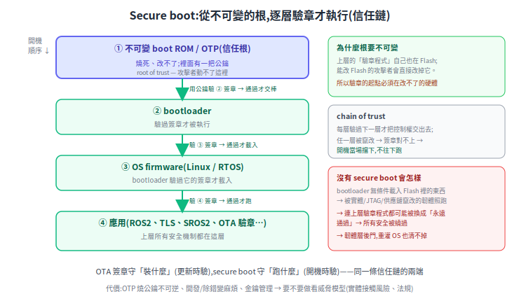

# Secure boot:為什麼 bootloader 需要 security

[OTA 韌體簽章](ota-firmware-signing.md) 守的是「**裝什麼**」——更新時驗章,不讓壞韌體裝進來。但這只擋 OTA 這條路。這篇講信任鏈的另一端:**secure boot**,守「**跑什麼**」——開機時驗章,即使 Flash 被人用別的方式改過,也擋下來。

> 前置:[OTA 韌體簽章](ota-firmware-signing.md)、[資安總覽](README.md)。

---

## 1. OTA 簽章擋不到的盲點

OTA 簽章只防「**透過 OTA 通道**推壞韌體」。但韌體還能從別處被改:

- 實體接觸:JTAG / SWD 除錯口直接寫 Flash
- 換掉 Flash 晶片,或在供應鏈階段就植入
- 利用某個漏洞拿到寫 Flash 的能力

這些**全繞過 OTA**。下次開機,bootloader 把 Flash 裡的東西載進來執行——**如果它無條件載入,被竄改的韌體就照跑**,OTA 簽章在這裡完全使不上力。

## 2. 核心:bootloader 是信任鏈的「根」

bootloader 特殊在它是**開機第一個跑、而且決定「接下來載入並執行什麼」**的程式。關鍵的第一性原理是這句:

> **上層所有安全機制,本身都是「程式」,都存在可被竄改的 Flash 裡。**

你的 TLS、SROS2 驗憑證、OTA 驗簽章——這些「做驗證的程式碼」自己也在 Flash。所以能改 Flash 的攻擊者,**最聰明的做法不是改資料,而是直接改掉「做驗章的那段程式」本身**:把驗章改成「永遠回傳通過」。於是上層砌再高的牆,都被從地基抽掉。

這就是為什麼信任**必須從最底層、不可變的地方建立**:

- 信任根(root of trust)放在**不可變的 boot ROM / OTP**(燒進去改不了),裡面有一把公鑰。
- 開機:用那把公鑰**驗 bootloader 簽章** → 通過才跑;bootloader 再**驗 OS firmware 簽章** → 通過才載入;OS 再驗應用……
- 每層**驗過下一層才把控制權交出去**,一層扣一層——這條鏈就是 secure boot。根在不可變硬體,攻擊者改不了「驗章的起點」,整條鏈才可信。

## 3. 信任鏈長怎樣

## 4. 沒有它的後果

少了 bootloader security,攻擊者只要能**寫一次 Flash**(實體、漏洞、供應鏈任一)就能:

1. 植入**韌體層後門**——**重灌 OS 也清不掉**,因為它在更底層。
2. 繞過**所有**上層安全(驗章程式本身被換掉)。
3. 完全控制設備。對機器人這種**會動、載人載物**的東西,直接是物理安全事故。

## 5. 要不要做:威脅模型的取捨

secure boot 有實打實的成本,所以**不是每個專案都該立刻上**:

- OTP 燒公鑰**不可逆**,燒錯或金鑰沒管好就變磚
- 開發 / 除錯變麻煩(每次都要簽)、量產流程變複雜
- 私鑰 / HSM / 輪換的長期運維負擔

| 偏向**可以先緩** | 偏向**該做** |
|---|---|
| 機體物理封閉、無暴露 JTAG/SWD | 設備在公共場所、可能被實體接觸 / 偷走 |
| OTA 是唯一寫 Flash 途徑且簽章嚴格 | 有除錯口、或 Flash 可被外部寫入 |
| 被偷 / 供應鏈風險低 | 供應鏈不可控、要符合法規(如歐盟 CRA) |

務實順序:**先把 OTA 簽章做好,secure boot 看威脅升級再補**。OTA 簽章擋住最常見的遠端攻擊面;secure boot 擋的是「實體 / 離線竄改」這個較進階、成本也較高的威脅。等機器人要進公共場域、或被實體接觸的風險上升,再把信任鏈的根補上。

## 6. 工具

- **MCU(如 STM32)**:[MCUboot](https://www.mcuboot.com/)(secure bootloader,開機驗 image 簽章)、[TF-M(TrustedFirmware-M)](https://www.trustedfirmware.org/);STM32 另用 RDP 讀保護 + boot ROM。
- **Linux SBC / 工控機**:UEFI Secure Boot、[TF-A(TrustedFirmware-A)](https://www.trustedfirmware.org/)。
- **晶片級信任根**:ARM TrustZone、OTP / eFuse 存公鑰雜湊。

## 來源

- [MCUboot](https://www.mcuboot.com/)、[TrustedFirmware(TF-M / TF-A)](https://www.trustedfirmware.org/)
- 觀念:[NIST SP 800-193 — Platform Firmware Resiliency Guidelines](https://csrc.nist.gov/pubs/sp/800/193/final)
