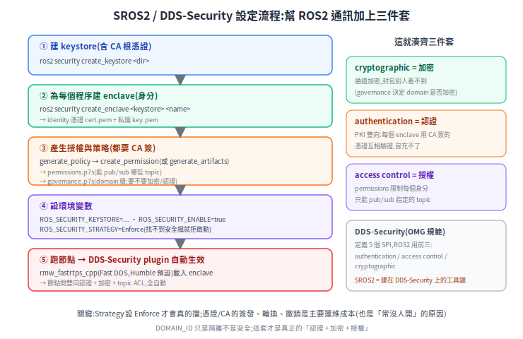

# SROS2 / DDS-Security:幫 ROS2 節點間通訊加上認證 + 加密 + 授權

[資安總覽](README.md) 裡最該先補的洞,就是 **ROS2 DDS 預設明文裸奔**——同網路誰都能訂閱 topic、甚至注入 `/cmd_vel` 控車。補它的標準做法是 **SROS2**(Secure ROS 2),它建在 **DDS-Security** 上,一次把三件套(認證、加密、授權)加到節點間通訊。

> 前置:[ROS2 的 DDS](../40-fleet/ros2-dds-intro.md)(先懂 DDS 與「DOMAIN_ID 只是隔離不是安全」)。

---

## 1. 它在解什麼

[DDS](../40-fleet/ros2-dds-intro.md) 預設明文 + 自動發現,任何同 domain 的節點都能收發。**DDS-Security 是 OMG 的規範**,定義 5 個 SPI(Service Plugin Interface);ROS2 用其中前三個:

- **authentication(認證)**:PKI 雙向——每個身分用 CA 簽的 X.509 憑證互相驗證,冒充不了。
- **cryptographic(加密)**:通道加密,封包別人看不到、不能竄改。
- **access control(授權)**:限制每個身分只能 pub/sub 指定的 topic。

`ROS_DOMAIN_ID`、VLAN 只是隔離;這套才是真正的「認證 + 加密 + 授權」。

## 2. 怎麼設定

<p align="center"></p>

五個步驟(CLI 以 Humble 為準,子命令用底線):

```bash
# ① 建 keystore(裡面含一組 CA 根憑證,之後簽所有節點/權限)
ros2 security create_keystore demo_keystore

# ② 為每個程序建一個 enclave(身分):產出 identity 憑證 cert.pem + 私鑰 key.pem
ros2 security create_enclave demo_keystore /talker_listener/talker
ros2 security create_enclave demo_keystore /talker_listener/listener

# ③ 產授權與策略(都會用 keystore 的 CA 簽章)
#    先從跑起來的系統蒐集 policy,再產 permissions
ros2 security generate_policy policy.xml
ros2 security create_permission demo_keystore /talker_listener/talker policy.xml
#    (或 generate_artifacts 一次把多個 enclave 的 governance + permissions 都產好)

# ④ 設環境變數,啟用安全
export ROS_SECURITY_KEYSTORE=$PWD/demo_keystore
export ROS_SECURITY_ENABLE=true
export ROS_SECURITY_STRATEGY=Enforce      # 找不到安全檔就拒絕啟動(Permissive 會裸跑)

# ⑤ 照常跑節點 —— DDS-Security plugin 自動載入 enclave,做認證+加密+ACL
ros2 run demo_nodes_cpp talker --ros-args --enclave /talker_listener/talker
```

跑起來後,節點間的通訊就是**雙向認證 + 加密 + 依 permissions 限 topic**,全部由 DDS 層自動處理,應用程式碼不用改。

## 3. 兩個關鍵簽章檔

設定產出兩種 XML,**都必須由 keystore 的 CA 簽章**(簽完是 `.p7s`):

- **`governance.p7s`(domain 級)**:整個 domain 的策略——要不要加密、要不要認證、未授權的 topic 如何處理。
- **`permissions.p7s`(節點級)**:這個身分能 pub / sub / 哪些 topic。**最小權限**就靠它(例如一台 AMR 的節點只能發自己的 `/odom`、收自己的 `/cmd_vel`)。

## 4. 注意事項

- **RMW 要支援**:`rmw_fastrtps_cpp`(Fast DDS,Humble 起的預設)是官方安全教學的 backend;CycloneDDS 也有 DDS-Security 實作,但在 ROS 安全主線著墨較少,啟用細節要另查。
- **Strategy 一定設 `Enforce`**:預設的 Permissive 找不到安全檔會以**無安全**模式啟動——等於沒開,容易誤以為安全了。
- **效能成本**:handshake(認證)+ 對稱加密有開銷;節點多、訊息高頻時要實測。
- **運維才是真門檻**:CA 管理、每個 enclave 的憑證簽發 / 輪換 / 撤銷——**這正是「技術成熟但常沒人開」的主因**。導入前要先想清楚憑證生命週期怎麼管。
- **enclave 粒度**:可以每節點一個、或一台機器人(一個 context)共用一個 enclave;粒度細=權限精準但管理多,要取捨。

## 來源

- 設計文:[ROS 2 DDS-Security integration](https://design.ros2.org/articles/ros2_dds_security.html)、[Security enclaves](https://design.ros2.org/articles/ros2_security_enclaves.html)
- 教學(Humble):[About Security(概念)](https://docs.ros.org/en/humble/Concepts/Intermediate/About-Security.html)、[Setting up security](https://docs.ros.org/en/humble/Tutorials/Advanced/Security/Introducing-ros2-security.html)、[The Keystore](https://docs.ros.org/en/humble/Tutorials/Advanced/Security/The-Keystore.html)、[Deployment Guidelines](https://docs.ros.org/en/humble/Tutorials/Advanced/Security/Deployment-Guidelines.html)
- 工具:[ros2/sros2(GitHub)](https://github.com/ros2/sros2)
